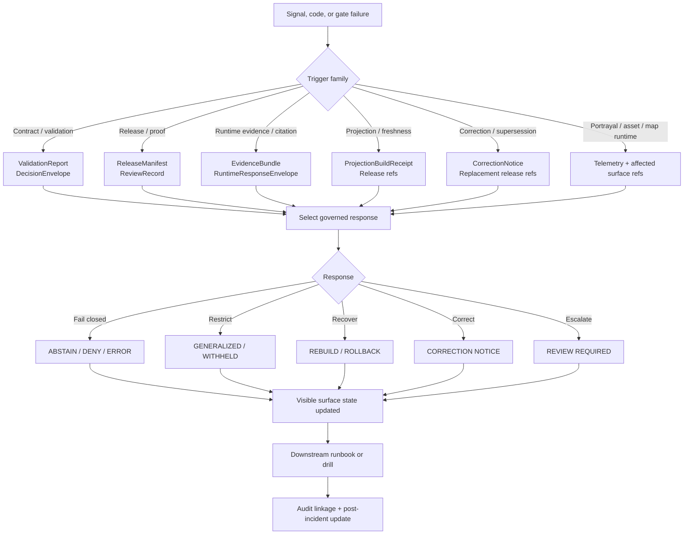

<!-- [KFM_META_BLOCK_V2]
doc_id: kfm://doc/TODO-uuid
title: Reliability Trigger Mechanisms
type: standard
version: v1
status: draft
owners: TODO-owners-NEEDS-VERIFICATION
created: TODO-YYYY-MM-DD
updated: TODO-YYYY-MM-DD
policy_label: TODO-policy-label
related: [TODO-review-related-paths]
tags: [kfm, reliability, runbooks, triggers]
notes: [Mounted repo topology was not directly verified in-session; adjacent runbook paths below are starter paths unless repo-verified.]
[/KFM_META_BLOCK_V2] -->

# Reliability Trigger Mechanisms

Directory-level trigger index for KFM reliability actions, so failures, denials, staleness, and corrections become governed responses instead of silent degradation.

> **Status:** draft  
> **Owners:** TODO — NEEDS VERIFICATION  
> **Badges:**      
> **Quick jumps:** [Scope](#scope) · [Repo fit](#repo-fit) · [Inputs](#inputs) · [Exclusions](#exclusions) · [Directory tree](#directory-tree) · [Quickstart](#quickstart) · [Usage](#usage) · [Diagram](#diagram) · [Tables](#tables) · [Task list](#task-list) · [FAQ](#faq) · [Appendix](#appendix)

> [!IMPORTANT]
> This README is a reliability control surface, not just an index page. Its job is to keep trigger detection, proof objects, visible state changes, and downstream runbooks aligned.

> [!NOTE]
> Mounted repository topology was not directly visible in the current session. Path-level relationships below are intentionally labeled **PROPOSED** or **NEEDS VERIFICATION** where project doctrine did not confirm mounted files.

## Scope

This directory exists to define **what conditions must trigger governed reliability action** in KFM.

In KFM, reliability is not limited to uptime. It also covers trust-bearing seams such as:

- release readiness
- projection freshness
- runtime evidence and citation integrity
- policy denial and review escalation
- correction propagation
- portrayal and asset failures
- stale or degraded public surfaces

This directory should answer four practical questions fast:

1. What was triggered?
2. What proof objects must exist?
3. What user-visible state must change?
4. Which downstream runbook or drill owns the next step?

[Back to top](#reliability-trigger-mechanisms)

## Repo fit

| Item | Value |
| --- | --- |
| Path | `docs/runbooks/reliability/trigger-mechanisms/README.md` |
| Role | Directory README and trigger-class index for reliability-side governed actions |
| Upstream | `docs/runbooks/reliability/README.md` *(PROPOSED parent index; NEEDS VERIFICATION)* |
| Downstream | `docs/runbooks/publication.md`, `docs/runbooks/correction.md`, `docs/runbooks/stale_projection.md`, `docs/runbooks/rollback.md`, `runbooks/restore-drill.md` *(PROPOSED starter set; NEEDS VERIFICATION)* |
| Contract touchpoints | `contracts/source/source_descriptor.schema.json`, `contracts/runtime/evidence_bundle.schema.json`, `contracts/runtime/runtime_response_envelope.schema.json`, `contracts/correction/correction_notice.schema.json`, `contracts/release/release_manifest.schema.json` *(PROPOSED starter paths; filenames not repo-verified)* |
| Policy touchpoints | `policy/reason_codes.*`, `policy/obligation_codes.*`, `policy/reviewer_roles.*` *(PROPOSED starter paths; NEEDS VERIFICATION)* |
| Test touchpoints | `tests/contracts/`, `tests/policy/`, `tests/e2e/`, `tests/regression/`, `fixtures/hydrology/` *(PROPOSED starter paths; NEEDS VERIFICATION)* |

### Reliability-side repo contract

This directory should stay **downstream of doctrine** and **upstream of runbook execution**.

It should not redefine KFM truth law. It should operationalize when truth law, release law, and fail-closed behavior must become visible action.

[Back to top](#reliability-trigger-mechanisms)

## Inputs

Accepted inputs for this directory include:

- machine-readable trigger codes such as reason codes, obligation codes, runtime outcomes, and surface states
- observability signals that indicate degraded, stale, denied, or correction-pending behavior
- proof-object references such as `ValidationReport`, `DecisionEnvelope`, `ReleaseManifest`, `ProjectionBuildReceipt`, `EvidenceBundle`, `RuntimeResponseEnvelope`, and `CorrectionNotice`
- route-family context, especially where a trigger affects public discovery, map/tile/portrayal, evidence resolution, Focus, export, or ops/status surfaces
- downstream runbook mappings
- drill and rehearsal mappings, including correction, rollback, restore, and stale-projection drills
- post-incident updates that change trigger language, thresholds, or operator expectations

## Exclusions

This directory is **not** the place for:

- full incident postmortems
- deployment manifests or infrastructure secrets
- broad architecture doctrine already owned by central KFM manuals
- raw dashboards without trigger interpretation
- uncontrolled ad hoc notes that do not map to proof objects or governed responses
- direct-client troubleshooting paths that bypass governed APIs or trust-visible surface behavior

[Back to top](#reliability-trigger-mechanisms)

## Directory tree

```text
docs/runbooks/reliability/trigger-mechanisms/
├── README.md
└── (trigger-specific entries, registries, or mappings)  # NEEDS VERIFICATION
```

<details>
<summary>Possible starter expansion (PROPOSED, not repo-verified)</summary>

```text
docs/runbooks/reliability/trigger-mechanisms/
├── README.md
├── registry.yaml
├── runtime-evidence-missing.md
├── runtime-citation-failed.md
├── projection-stale.md
├── release-docs-gate-failed.md
├── correction-required.md
└── policy-denied.md
```

These names are intentionally conservative starter shapes, not claims about mounted files.

</details>

[Back to top](#reliability-trigger-mechanisms)

## Quickstart

1. **Detect the trigger.**  
   Start from a machine code, release gate failure, observability signal, or user-visible degraded state.

2. **Classify the trigger family.**  
   Use the matrices below to decide whether this is primarily a contract, policy, runtime, projection, correction, or portrayal/asset event.

3. **Collect proof objects immediately.**  
   Do not continue on memory alone. Pull the relevant `audit_ref`, release references, decision refs, projection receipts, and evidence objects first.

4. **Choose the governed response.**  
   The response must be one of KFM’s allowed visible actions: fail closed, generalize, withhold, rebuild, publish correction state, or route to review.

5. **Update the visible surface state.**  
   If the public shell is affected, mark the state visibly. Silent degradation is not an acceptable completion state.

6. **Run or create the downstream runbook.**  
   If the trigger has no downstream runbook yet, freeze expansion at that seam and create one before broadening scope.

7. **Close the loop.**  
   Every incident, drill, or migration that changes trigger handling must update this directory.

> [!CAUTION]
> “The system still works” is not sufficient closure if evidence resolution, citation integrity, release linkage, or correction visibility failed along the way.

[Back to top](#reliability-trigger-mechanisms)

## Usage

### Trigger families

Use this directory to organize triggers into a small number of stable families:

#### 1. Contract and validation triggers
These start when source, schema, or corroboration rules fail and the system must stop outward progression, quarantine material, or require review.

#### 2. Release and proof triggers
These start when promotion or publication gates fail, especially if release proof, documentation, accessibility, or review artifacts are incomplete.

#### 3. Runtime trust-surface triggers
These start when outward runtime behavior cannot reconstruct evidence, fails citation checks, or must deny, abstain, or error instead of bluffing.

#### 4. Projection and freshness triggers
These start when derived layers drift from promoted scope, exceed freshness basis, or require rebuild and stale-visible labeling.

#### 5. Correction and supersession triggers
These start when already-released material needs visible correction, rollback, withdrawal, narrowing, or replacement.

#### 6. Portrayal and asset triggers
These start when styles, glyphs, sprites, fonts, icons, or tile assets fail and the map must enter a degraded or restricted state rather than merely looking broken.

#### 7. Scheduled drill triggers
These are planned, not accidental. They include restore drills, correction drills, stale-projection drills, and other rehearsals that prove reliability behavior is real.

### Usage rule

A trigger definition belongs here only if it names all of the following:

- the trigger itself
- the proof objects to collect
- the expected visible surface state
- the default governed response
- the downstream runbook, or an explicit statement that none exists yet

[Back to top](#reliability-trigger-mechanisms)

## Diagram



[Back to top](#reliability-trigger-mechanisms)

## Tables

### Canonical trigger codes and starter actions

| Trigger | Meaning in doctrine | Starter response in this directory | Primary proof objects | Expected visible state |
| --- | --- | --- | --- | --- |
| `runtime.evidence_missing` | No reconstructible evidence path exists for the outward claim | Fail closed; do not allow confident outward response | `EvidenceBundle`, `RuntimeResponseEnvelope`, `audit_ref` | `abstained`, `denied`, or `error` |
| `runtime.citation_failed` | Evidence was retrieved but user-visible claims failed citation verification | Fail closed; correct retrieval or citation path before outward use | `EvidenceBundle`, `RuntimeResponseEnvelope`, `audit_ref` | `abstained`, `denied`, or `error` |
| `policy.denied` | Policy explicitly blocks the requested action or surface | Withhold or generalize; escalate if required | `DecisionEnvelope`, related release refs, `audit_ref` | `denied` or `generalized` |
| `release.docs_gate_failed` | Documentation or accessibility gate did not pass for the release candidate | Stop promotion; treat as release-blocking | `ReleaseManifest` / `ReleaseProofPack`, docs/accessibility evidence, `ReviewRecord` if applicable | No outward release; candidate remains unreleased |
| `projection.stale` | Derived projection is older than its declared freshness basis | Mark stale-visible and rebuild from promoted scope | `ProjectionBuildReceipt`, `ReleaseManifest`, `CatalogClosure` | `stale-visible` until rebuilt |
| `validation.schema_failed` | Required schema or semantic validation failed | Stop outward progression; quarantine or hold candidate material | `ValidationReport`, `IngestReceipt`, `DecisionEnvelope` if policy-relevant | Not publishable; hold or quarantine |
| `corroboration.conflicted` | Independent admissible sources disagree materially | Preserve conflict visibly; escalate review before consequential outward synthesis | `EvidenceBundle`, `DecisionEnvelope`, supporting source refs | `conflicted`, possibly `review-required` |
| post-release error / staleness / exposure issue | Released surface now needs correction, rollback, withdrawal, or replacement | Start correction workflow with visible state change | `CorrectionNotice`, affected release refs, rebuild refs, `audit_ref` | `withdrawn`, `superseded`, `correction-pending`, or narrowed scope |

### Canonical obligations and what they mean operationally

| Obligation | Typical consequence | Reliability implication |
| --- | --- | --- |
| `generalize` | Serve only a generalized representation for the audience | Public surface changes, but not silently |
| `withhold` | Do not publish or render the object on the requested surface | Reliability completion may be a deliberate non-display |
| `review_required` | Escalate before promotion or outward use | Trigger remains open until steward review completes |
| `correction_notice` | Publish visible correction state across affected surfaces | Correction is part of normal reliability behavior |
| `rebuild_projection` | Rebuild tiles/search/vector/scene outputs from corrected scope | Derived delivery must re-link to promoted scope |
| `cite` | Attach inspectable evidence or fail closed | Evidence integrity is part of reliability, not just UX |
| `disclose_partial` | Label partial coverage or incompleteness in-place | Silence is failure |
| `disclose_modeled` | Label modeled / assimilated / forecast status in-place | Prevents observation/model blending |
| `log_audit` | Emit decision trace and audit linkage | Every trigger should leave operational memory |

### Trigger-to-proof-object lookup

| Trigger family | Minimum proof objects | Why they matter |
| --- | --- | --- |
| Intake / validation | `SourceDescriptor`, `IngestReceipt`, `ValidationReport` | Proves what was fetched, how it landed, and what failed |
| Canonical candidate / authority | `DatasetVersion` plus validation outputs | Anchors stable identity, support, and time semantics |
| Catalog / policy / review | `CatalogClosure`, `DecisionEnvelope`, `ReviewRecord`, `ReleaseManifest`, `CorrectionNotice` | Proves promotion readiness and policy posture |
| Derived delivery / freshness | `ProjectionBuildReceipt` plus release refs | Proves what public-facing projection was built from what release |
| Runtime / outward claim | `EvidenceBundle`, `RuntimeResponseEnvelope`, `audit_ref` | Proves evidence path, citation behavior, and outcome accountability |

### Operational signals that should map into trigger handling

| Signal family | Why it matters | Reliability response expectation |
| --- | --- | --- |
| tile latency / tile error spike | A map can be “up” while still operationally degraded | Check release basis, cache state, asset availability, and stale-visible behavior |
| style JSON / glyph / sprite / icon / font failure | These are product failures, not cosmetic incidents | Enter degraded or restricted map state; do not leave silent broken portrayal |
| evidence-resolution failure | Trust-bearing runtime correctness is affected directly | Fail closed and preserve audit linkage |
| policy-denied outcome spike | Could indicate policy drift, surface misuse, or caller mismatch | Review route family, role scope, and decision grammar |
| stale-visible count increase | Derived layers may be drifting from promoted scope | Rebuild projections or keep visible stale state until rebuilt |
| correction propagation lag | Public integrity over time is at risk | Track affected surfaces until correction state is complete |
| runbook freshness / post-incident update incomplete | Operational memory is degrading | Update runbooks as part of incident closure |

[Back to top](#reliability-trigger-mechanisms)

## Task list

### Definition of done for this directory

- [ ] Every trigger entry names a machine code or an explicit detection signal.
- [ ] Every trigger entry names the proof objects required before response.
- [ ] Every trigger entry names the visible public or steward-facing surface state.
- [ ] Every outward-facing trigger maps to a downstream runbook or explicitly states that one does not yet exist.
- [ ] Every trigger with public impact is covered by a test, drill, or both.
- [ ] Every incident or migration that changes trigger behavior updates this directory.
- [ ] Every adjacent path in this README has been repo-verified.
- [ ] The user-facing and machine-facing trigger vocabulary match closely enough that operators can move between them without ambiguity.

### Review gates for changes here

- [ ] No trigger weakens the trust membrane.
- [ ] No trigger lets a public surface outrun release state.
- [ ] No trigger silently suppresses correction state.
- [ ] No trigger assumes mounted repo topology without verification.
- [ ] No trigger definition collapses modeled, observed, and documentary material into one undifferentiated class.

[Back to top](#reliability-trigger-mechanisms)

## FAQ

### Is every deny, abstain, or error an incident?

No. In KFM, negative outcomes are valid and often correct. They become incidents when the system fails to behave visibly, consistently, or according to contract.

### Does every trigger require rollback?

No. Some triggers require rollback, but others require generalization, withhold behavior, correction notice publication, projection rebuild, or reviewer escalation.

### Are stale derived layers acceptable if canonical data is still correct?

Only as **visible** stale states. Hidden freshness drift is not acceptable.

### Can this directory define new machine codes on its own?

Not safely. New codes should stay aligned with the shared reason/obligation registry and the contract layer, then be reflected here as operator-facing trigger guidance.

### Why is this a reliability document instead of just a policy or UI document?

Because KFM reliability includes truthful degradation, correction visibility, release discipline, and evidence-accountable runtime behavior, not just uptime.

[Back to top](#reliability-trigger-mechanisms)

## Appendix

<details>
<summary>Starter controlled vocabulary</summary>

### Primary outward runtime outcomes

- `ANSWER`
- `ABSTAIN`
- `DENY`
- `ERROR`

### Testable surface states

- `promoted`
- `generalized`
- `partial`
- `stale-visible`
- `source-dependent`
- `conflicted`
- `withdrawn`
- `denied`
- `abstained`

### Reliability shorthand

| Term | Working meaning here |
| --- | --- |
| trigger | Any condition that must initiate governed action |
| proof object | The artifact that makes the action inspectable |
| visible state | The user- or steward-facing state that must not be hidden |
| downstream runbook | The operational procedure that executes the next step |
| closure | The point at which the action, visibility, and audit trail are all complete |

</details>

<details>
<summary>Illustrative trigger descriptor (PROPOSED starter shape)</summary>

```yaml
trigger_id: projection.stale
class: freshness
status: proposed-starter-shape
detects_from:
  - contract_field: ProjectionBuildReceipt.stale_after
  - observability_signal: stale_visible_count
affects:
  - route_family: map/tile/portrayal
  - surface: Map Explorer
required_objects:
  - ProjectionBuildReceipt
  - ReleaseManifest
  - CatalogClosure
default_obligations:
  - rebuild_projection
  - log_audit
visible_states:
  - stale-visible
downstream_runbook: ../stale_projection.md # NEEDS VERIFICATION
notes:
  - Do not silently continue with outdated derived output.
  - Preserve release linkage before and after rebuild.
```

</details>

<details>
<summary>Maintenance rule</summary>

After any migration, incident, correction drill, restore drill, or release-gate change:

1. update the trigger definition here,
2. update the downstream runbook,
3. update fixtures or drill evidence if behavior changed, and
4. keep user-facing wording proportionate to the real trust impact.

</details>

[Back to top](#reliability-trigger-mechanisms)
