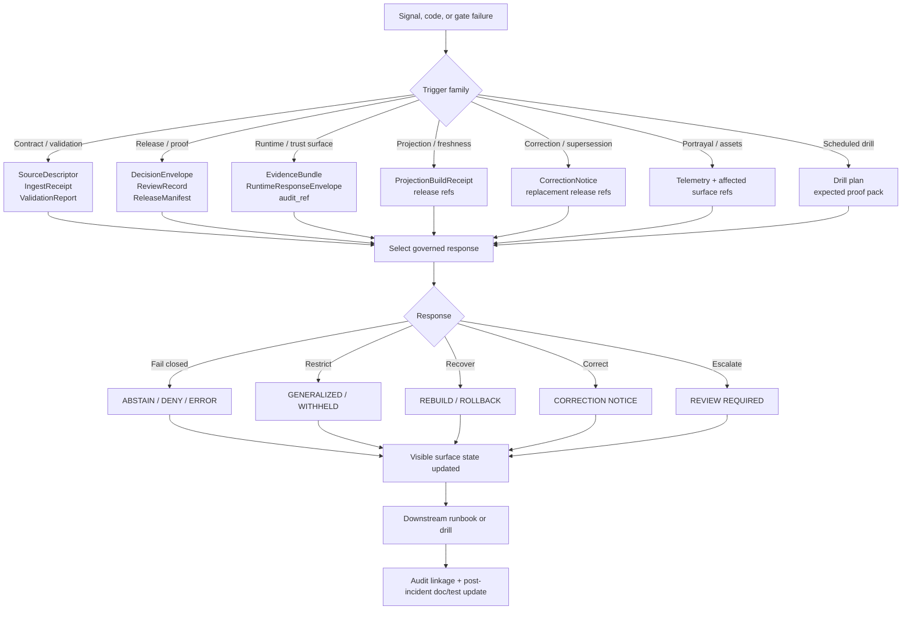

<!-- [KFM_META_BLOCK_V2]
doc_id: kfm://doc/TODO-uuid
title: Reliability Trigger Mechanisms
type: standard
version: v1
status: draft
owners: TODO-owners-NEEDS-VERIFICATION
created: TODO-YYYY-MM-DD
updated: TODO-YYYY-MM-DD
policy_label: TODO-policy-label-NEEDS-VERIFICATION
related: [TODO-review-related-paths-NEEDS-VERIFICATION]
tags: [kfm, reliability, runbooks, triggers]
notes: [Current session exposed attached PDFs and no mounted KFM repo checkout; target path and adjacent runbook paths below are treated as task-target or proposed starter paths until repo-verified.]
[/KFM_META_BLOCK_V2] -->

# Reliability Trigger Mechanisms

Directory-level trigger index for governed reliability actions, so failures, denials, staleness, and corrections become visible, auditable responses instead of silent degradation.

> **Status:** experimental  
> **Owners:** TODO — NEEDS VERIFICATION  
> **Badges:**      
> **Quick jumps:** [Scope](#scope) · [Repo fit](#repo-fit) · [Inputs](#inputs) · [Exclusions](#exclusions) · [Directory tree](#directory-tree) · [Quickstart](#quickstart) · [Usage](#usage) · [Diagram](#diagram) · [Tables](#tables) · [Task list](#task-list) · [FAQ](#faq) · [Appendix](#appendix)

> [!IMPORTANT]
> This README is a reliability control surface, not just an index page. Its job is to keep **trigger detection**, **proof objects**, **visible surface states**, and **downstream runbooks** aligned.

> [!NOTE]
> Evidence posture for this draft: **CONFIRMED doctrine**, **PROPOSED starter paths**, and **UNKNOWN mounted implementation depth**. The current session did not expose a mounted KFM repository checkout, so all file- and directory-level claims below stay visibly qualified.

## Scope

This directory exists to define **what conditions must trigger governed reliability action** in KFM.

In KFM, reliability is broader than uptime. It reaches into the trust-bearing seams that make outward claims safe to publish and safe to consume:

- release readiness
- runtime evidence resolution and citation integrity
- policy-consistent negative outcomes
- freshness and stale-visible behavior for derived projections
- correction propagation and rollback visibility
- portrayal and asset failures that degrade map truth surfaces
- post-incident operational memory, including runbook updates

This README should answer four practical questions fast:

1. What was triggered?
2. Which proof objects must exist?
3. What user-visible or steward-visible state must change?
4. Which downstream runbook owns the next step?

### Evidence posture used in this README

| Posture | What this README treats as in-bounds |
| --- | --- |
| **CONFIRMED** | KFM doctrine about fail-closed behavior, trust-visible surface states, proof-object families, example reason/obligation codes, and the requirement that correction and stale states remain visible. |
| **PROPOSED** | Starter repo paths, directory layout, and runbook targets drawn from the March 2026 artifact plans. |
| **UNKNOWN** | Mounted repo topology, exact workflow inventory, emitted proof objects, current route trees, and whether the target directory already exists in the repo. |

[Back to top](#reliability-trigger-mechanisms)

## Repo fit

| Item | Value | Confidence |
| --- | --- | --- |
| Target path | `docs/runbooks/reliability/trigger-mechanisms/README.md` | **TASK TARGET**; mounted repo placement **NEEDS VERIFICATION** |
| Parent index | [`../README.md`](../README.md) | **PROPOSED** parent reliability index |
| Downstream runbooks | [`../../publication.md`](../../publication.md), [`../../correction.md`](../../correction.md), [`../../stale_projection.md`](../../stale_projection.md), [`../../rollback.md`](../../rollback.md) | **PROPOSED** starter set from attached artifact plan |
| Contract touchpoints | `contracts/source/source_descriptor.schema.json`, `contracts/core/dataset_version.schema.json`, `contracts/policy/decision_envelope.schema.json`, `contracts/release/release_manifest.schema.json`, `contracts/runtime/evidence_bundle.schema.json`, `contracts/runtime/runtime_response_envelope.schema.json`, `contracts/correction/correction_notice.schema.json` | **PROPOSED** starter paths |
| Policy touchpoints | `policy/reason_codes.json`, `policy/obligation_codes.json`, `policy/reviewer_roles.json` | **PROPOSED** starter paths |
| Test touchpoints | `fixtures/valid/*`, `fixtures/invalid/*`, `tests/contracts/*`, `tests/policy/*`, `tests/e2e/runtime_proof/*`, `tests/e2e/correction/*`, `tests/e2e/release_assembly/*`, `tests/ui/surface_state/*` | **PROPOSED** starter paths |
| Observability touchpoints | `observability/join_keys.md`, `observability/audit_ref_contract.md` | **PROPOSED** starter paths |

### Reliability-side repo contract

This directory should stay **downstream of doctrine** and **upstream of runbook execution**.

It should not redefine KFM law. Its job is operational: turn doctrine into named trigger classes, proof-object expectations, visible surface-state transitions, and runbook routing. When behavior changes, this directory should move with the contracts, the tests, and the runbooks rather than drifting into historical prose.

[Back to top](#reliability-trigger-mechanisms)

## Inputs

Accepted inputs for this directory include:

- machine-readable trigger identifiers and trigger families
- reason codes, obligation codes, and runtime outcomes
- observability signals that indicate degraded, stale, denied, conflicted, or correction-pending behavior
- proof-object references such as `SourceDescriptor`, `IngestReceipt`, `ValidationReport`, `DatasetVersion`, `DecisionEnvelope`, `ReleaseManifest`, `ProjectionBuildReceipt`, `EvidenceBundle`, `RuntimeResponseEnvelope`, and `CorrectionNotice`
- route-family or surface-class context, especially for map, timeline, dossier, story, Evidence Drawer, Focus Mode, review, compare, export, and controlled 3D surfaces
- downstream runbook mappings
- drill and rehearsal mappings, especially correction, rollback, restore, and stale-projection drills
- incident learnings that change operator expectations, trigger wording, thresholds, or visible-state rules

## Exclusions

This directory is **not** the place for:

- full incident postmortems
- deployment manifests, secrets, or infrastructure credentials
- broad architecture doctrine already owned by central KFM manuals
- raw dashboards or telemetry dumps without trigger interpretation
- ad hoc operator notes that do not map to proof objects, visible states, or governed responses
- direct-client troubleshooting paths that bypass governed APIs, policy evaluation, or evidence resolution

[Back to top](#reliability-trigger-mechanisms)

## Directory tree

```text
docs/runbooks/reliability/trigger-mechanisms/
├── README.md
└── (trigger-specific entries, registries, or mappings)  # PROPOSED / NEEDS VERIFICATION
```

<details>
<summary>Starter expansion (PROPOSED, not repo-verified)</summary>

```text
docs/runbooks/reliability/trigger-mechanisms/
├── README.md
├── registry.yaml
├── runtime-evidence-missing.md
├── runtime-citation-failed.md
├── projection-stale.md
├── release-docs-gate-failed.md
├── policy-denied.md
└── correction-required.md
```

These names are intentionally conservative starter shapes. They are **not** claims about current mounted files.

</details>

[Back to top](#reliability-trigger-mechanisms)

## Quickstart

1. **Detect the trigger.**  
   Start from a machine code, a release-gate failure, an observability signal, or a user-visible degraded state.

2. **Classify the trigger family.**  
   Decide whether this is mainly a contract/validation, release/proof, runtime trust-surface, projection/freshness, correction, portrayal/asset, or drill/rehearsal event.

3. **Collect proof objects first.**  
   Do not continue on memory alone. Pull the relevant `audit_ref`, decision references, release references, projection receipts, and evidence objects first.

4. **Choose the governed response.**  
   The response must be one of KFM’s visible, policy-consistent actions: fail closed, generalize, withhold, rebuild, publish correction state, or escalate to review.

5. **Update the visible surface state.**  
   If a public or steward-facing shell is affected, mark it visibly. Silent degradation is not an acceptable completion state.

6. **Run the downstream runbook.**  
   If no runbook exists yet, stop broadening scope at that seam and create one before calling the behavior “handled.”

7. **Close the loop.**  
   After incidents, drills, migrations, or policy changes, update the trigger definition, downstream runbook, and affected fixtures or tests together.

> [!CAUTION]
> “The system still works” is not sufficient closure if evidence resolution, citation integrity, release linkage, correction visibility, or stale-visible behavior failed along the way.

[Back to top](#reliability-trigger-mechanisms)

## Usage

### Trigger families

#### 1. Contract and validation triggers
These begin when source admission, integrity, schema, or semantic validation rules fail and the system must stop outward progression, quarantine material, or require review.

#### 2. Release and proof triggers
These begin when promotion or publication gates fail, especially if release proof, documentation, accessibility, or review artifacts are incomplete.

#### 3. Runtime trust-surface triggers
These begin when outward runtime behavior cannot reconstruct evidence, fails citation checks, or must deny, abstain, or error rather than bluff.

#### 4. Projection and freshness triggers
These begin when derived layers drift from promoted scope, exceed freshness basis, or require rebuild and stale-visible labeling.

#### 5. Correction and supersession triggers
These begin when already-published meaning needs visible correction, rollback, withdrawal, narrowing, or replacement.

#### 6. Portrayal and asset triggers
These begin when styles, glyphs, sprites, fonts, icons, or tile assets fail and the map must enter a degraded or restricted state rather than simply looking broken.

#### 7. Scheduled drill triggers
These are planned, not accidental. They include correction drills, rollback drills, restore drills, stale-projection drills, and similar rehearsals that prove reliability behavior is real.

### Entry rule

A trigger entry belongs here only if it names **all** of the following:

- the trigger itself
- the proof objects required before response
- the expected visible surface state
- the default governed response
- the downstream runbook, or an explicit statement that none exists yet

### Thin-slice proving ground

Hydrology remains the preferred first proving ground for this directory because it is the clearest public-safe thin slice with strong place/time semantics. Reliability trigger definitions written here should therefore be usable in hydrology-first end-to-end proof before broader lane expansion.

[Back to top](#reliability-trigger-mechanisms)

## Diagram



[Back to top](#reliability-trigger-mechanisms)

## Tables

### Confirmed example reason codes and trigger classes

| Trigger | Status | Meaning | Starter response in this directory | Minimum proof objects | Expected visible state |
| --- | --- | --- | --- | --- | --- |
| `runtime.evidence_missing` | **CONFIRMED example reason code** | No reconstructible evidence path exists for the outward claim. | Fail closed; do not allow confident outward response. | `EvidenceBundle`, `RuntimeResponseEnvelope`, `audit_ref` | `abstained`, `denied`, or `error` |
| `runtime.citation_failed` | **CONFIRMED example reason code** | Evidence was retrieved but user-visible claims failed citation verification. | Fail closed; repair citation or evidence-resolution path before outward use. | `EvidenceBundle`, `RuntimeResponseEnvelope`, `audit_ref` | `abstained`, `denied`, or `error` |
| `policy.denied` | **CONFIRMED example reason code** | Policy explicitly blocks the requested action or surface. | Withhold or generalize; escalate if required. | `DecisionEnvelope`, related release refs, `audit_ref` | `denied` or `generalized` |
| `release.docs_gate_failed` | **CONFIRMED example reason code** | Documentation or accessibility gate did not pass for the release candidate. | Stop promotion; treat as release-blocking. | `ReleaseManifest` or `ReleaseProofPack`, relevant docs/accessibility evidence, `ReviewRecord` if applicable | No outward release; candidate remains unreleased |
| `projection.stale` | **CONFIRMED example reason code** | Derived projection is older than its declared freshness basis. | Mark stale-visible and rebuild from promoted scope. | `ProjectionBuildReceipt`, release refs | `stale-visible` until rebuilt |
| post-release error / staleness / exposure issue | **CONFIRMED trigger class; exact code not surfaced here** | Published meaning now needs correction, rollback, withdrawal, or replacement. | Start correction workflow with visible state change and rollback or withdrawal if needed. | `CorrectionNotice`, affected release refs, rebuild refs, `audit_ref` | `correction-pending`, `withdrawn`, `superseded`, or narrowed scope |

### Obligations and their operational consequence

| Obligation code | Typical consequence | Reliability implication |
| --- | --- | --- |
| `generalize` | Serve only a generalized representation for the audience. | The surface stays available, but only in a visibly constrained form. |
| `withhold` | Do not publish or render the object on the requested surface. | Reliability completion may be a deliberate non-display. |
| `review_required` | Escalate before promotion or outward use. | The trigger remains open until the steward/reviewer boundary is crossed. |
| `correction_notice` | Publish visible correction state across affected surfaces. | Correction is normal reliability behavior, not a hidden patch. |
| `rebuild_projection` | Rebuild tiles/search/vector/scene outputs from corrected scope. | Derived delivery must re-link to promoted scope after change. |
| `cite` | Attach inspectable evidence or fail closed. | Evidence integrity is part of reliability, not just UX polish. |
| `disclose_partial` | Label partial coverage or incompleteness in place. | Silence about partial scope is a reliability failure. |
| `disclose_modeled` | Label modeled / assimilated / forecast status in place. | Prevents modeled material from masquerading as direct observation. |
| `log_audit` | Emit audit linkage and decision trace. | Every trigger should leave operational memory behind it. |

### Trigger-to-proof-object lookup

| Trigger family | Minimum proof objects | Why they matter |
| --- | --- | --- |
| Intake / validation | `SourceDescriptor`, `IngestReceipt`, `ValidationReport` | Proves what was fetched, how it landed, and what failed before outward progression. |
| Canonical candidate / authority | `DatasetVersion` plus validation outputs | Anchors stable identity, support, and time semantics. |
| Catalog / policy / review | `CatalogClosure`, `DecisionEnvelope`, `ReviewRecord`, `ReleaseManifest`, `CorrectionNotice` | Proves promotion readiness, policy posture, and correction lineage. |
| Derived delivery / freshness | `ProjectionBuildReceipt` plus release refs | Proves which release a public-facing projection came from, and whether it has gone stale. |
| Runtime / outward claim | `EvidenceBundle`, `RuntimeResponseEnvelope`, `audit_ref` | Proves evidence path, citation behavior, surface state, and accountable runtime outcome. |

### Operational signals that should feed trigger handling

| Signal family | Why it matters | Reliability response expectation |
| --- | --- | --- |
| tile latency, cache-hit drop, tile error spike | The map can be “up” while still operationally degraded or stale. | Check release basis, cache state, freshness basis, and stale-visible behavior. |
| style / glyph / sprite / icon / font failure | These are product failures, not cosmetic incidents. | Enter degraded or restricted map state; do not leave silent broken portrayal. |
| evidence-resolution failure | Trust-bearing runtime correctness is affected directly. | Fail closed and preserve audit linkage. |
| policy-denied outcome spike | May indicate policy drift, surface misuse, or caller mismatch. | Review route family, role scope, and decision grammar. |
| stale-visible count increase | Derived layers may be drifting from promoted scope. | Rebuild projections or keep visible stale state until rebuilt. |
| correction propagation lag | Public integrity over time is at risk. | Track affected surfaces until correction state is complete. |
| runbook freshness or post-incident update lag | Operational memory is degrading. | Update runbooks as part of incident closure, not later cleanup. |

### Inferred starter trigger classes to register explicitly once repo contracts exist

| Starter class | Current posture | Why it belongs here |
| --- | --- | --- |
| validation failure | **INFERRED** | ValidationReport exists as a proof object family, but the exact machine code set is not repo-verified here. |
| corroboration conflict | **INFERRED** | The verification doctrine requires explicit conflict handling when independence or comparability breaks. |
| portrayal asset degraded | **INFERRED** | Geospatial operations doctrine treats style and asset failures as product failures that should surface visibly. |
| offline/field stale pack | **INFERRED** | Offline refresh, eviction, and stale-pack behavior are named operational concerns but exact trigger IDs are not confirmed here. |

[Back to top](#reliability-trigger-mechanisms)

## Task list

### Definition of done for this directory

- [ ] Every trigger entry names a machine code or an explicit detection signal.
- [ ] Every trigger entry names the proof objects required before response.
- [ ] Every trigger entry names the visible public or steward-facing surface state.
- [ ] Every outward-facing trigger maps to a downstream runbook or explicitly states that one does not yet exist.
- [ ] Every trigger with public impact is covered by a test, drill, or both.
- [ ] Every incident or migration that changes trigger behavior updates this directory.
- [ ] Every adjacent path in this README is repo-verified or visibly marked **PROPOSED** / **NEEDS VERIFICATION**.
- [ ] The user-facing and machine-facing trigger vocabulary align closely enough that operators can move between them without ambiguity.

### Review gates for changes here

- [ ] No trigger weakens the trust membrane.
- [ ] No trigger lets a public surface outrun release state.
- [ ] No trigger silently suppresses correction state.
- [ ] No trigger assumes mounted repo topology without verification.
- [ ] No trigger definition collapses observed, modeled, documentary, and statutory material into one undifferentiated class.
- [ ] Any new exact reason code or obligation code is added only after policy registry review.
- [ ] Any behavior-changing change updates tests, fixtures, and downstream runbook text together.

[Back to top](#reliability-trigger-mechanisms)

## FAQ

### Is every deny, abstain, or error an incident?

No. In KFM, negative outcomes are valid and often correct. They become incidents when the system fails to behave visibly, consistently, or according to contract.

### Does every trigger require rollback?

No. Some triggers require rollback, but others require generalization, withhold behavior, correction notice publication, projection rebuild, or reviewer escalation.

### Are stale derived layers acceptable if canonical data is still correct?

Only as **visible** stale states. Hidden freshness drift is not acceptable.

### Can this directory mint new machine codes on its own?

Not safely. New codes should stay aligned with shared policy registries and contract families first, then be reflected here as operator-facing trigger guidance.

### Why is this a reliability document instead of just a policy or UI document?

Because KFM reliability includes truthful degradation, release discipline, correction visibility, stale-visible behavior, and evidence-accountable runtime responses, not only service uptime.

[Back to top](#reliability-trigger-mechanisms)

## Appendix

<details>
<summary>Starter controlled vocabulary</summary>

### Runtime outcomes

- `ANSWER`
- `ABSTAIN`
- `DENY`
- `ERROR`

### Testable surface states

- `promoted`
- `generalized`
- `partial`
- `stale-visible`
- `source-dependent`
- `conflicted`
- `withdrawn`
- `denied`
- `abstained`

### Reliability shorthand

| Term | Working meaning here |
| --- | --- |
| trigger | Any condition that must initiate governed action |
| proof object | The artifact that makes the action inspectable |
| visible state | The user- or steward-facing state that must not be hidden |
| downstream runbook | The operational procedure that executes the next step |
| closure | The point at which action, visibility, and audit trail are all complete |

</details>

<details>
<summary>Illustrative trigger entry template (PROPOSED starter shape)</summary>

```yaml
trigger_id: projection.stale
status: proposed-starter-shape
family: projection_and_freshness
detection:
  reason_code: projection.stale
  signal_family:
    - stale_visible_count
    - projection_build_age
affected_surfaces:
  - map_explorer
  - timeline
  - export
required_objects:
  - ProjectionBuildReceipt
  - ReleaseManifest
  - audit_ref
default_obligations:
  - rebuild_projection
  - log_audit
visible_states:
  - stale-visible
downstream_runbook: ../../stale_projection.md  # PROPOSED / NEEDS VERIFICATION
notes:
  - Do not silently continue with outdated derived output.
  - Preserve release linkage before and after rebuild.
```

</details>

<details>
<summary>Maintenance rule</summary>

After any migration, incident, correction drill, restore drill, release-gate change, or surface-state change:

1. update the trigger definition here,
2. update the downstream runbook,
3. update fixtures or drill evidence if behavior changed,
4. update observability join expectations if new signals were introduced, and
5. keep user-facing wording proportionate to the real trust impact.

</details>

[Back to top](#reliability-trigger-mechanisms)
