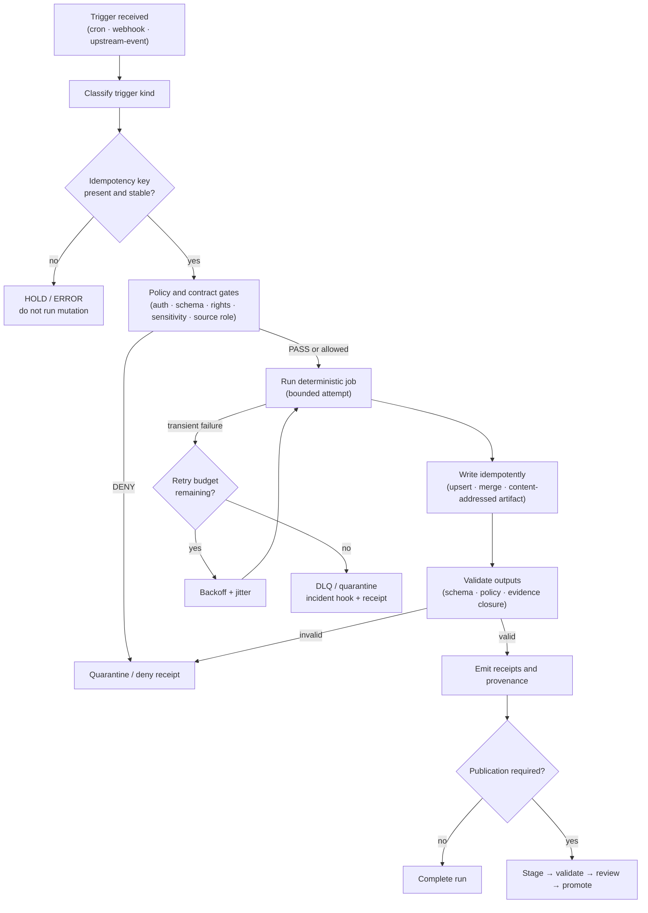

<!-- [KFM_META_BLOCK_V2]
doc_id: kfm://doc/TODO-trigger-retry-matrix-uuid
title: Trigger & Retry Decision Matrix
type: standard
version: v1
status: draft
owners: TODO-reliability-ops-owner (NEEDS VERIFICATION)
created: 2026-04-28
updated: 2026-04-28
policy_label: public
related: [TODO: docs/runbooks/README.md, TODO: policy/README.md, TODO: schemas/README.md, TODO: tools/validators/README.md]
tags: [kfm, runbook, reliability, triggers, retries, idempotency, provenance]
notes: [Repo checkout was not mounted in this session; owner, doc_id, adjacent links, workflow names, and CI commands require verification before commit.]
[/KFM_META_BLOCK_V2] -->

<a id="top"></a>

# ⏱️ Trigger & Retry Decision Matrix

Safe, governed defaults for when KFM jobs run and how they retry without weakening idempotency, provenance, review, or publication gates.


> [!IMPORTANT]
> This runbook defines the **required operating posture** for KFM trigger and retry behavior. It does **not** claim that any workflow, queue, runner, telemetry backend, schema, policy engine, or CI command is already implemented. Treat concrete commands and file homes below as `NEEDS VERIFICATION` until confirmed in the mounted repository.

---

## Quick jumps

- [Scope](#scope)
- [Repo fit](#repo-fit)
- [Trigger decision flow](#trigger-decision-flow)
- [Universal guardrails](#universal-guardrails)
- [Default retry matrix](#default-retry-matrix)
- [Failure classification](#failure-classification)
- [Idempotency keys](#idempotency-keys)
- [Writes, receipts, and provenance](#writes-receipts-and-provenance)
- [DLQ and quarantine](#dlq-and-quarantine)
- [Focus Mode integration](#focus-mode-integration)
- [Validation and CI](#validation-and-ci)
- [Review gates](#review-gates)
- [Open verification items](#open-verification-items)

---

## Scope

This runbook covers three trigger families:

| Trigger kind | What it means | Primary risk |
|---|---|---|
| `cron` | Scheduled execution by clock, cadence, or maintenance window. | Overlapping runs, retry storms, stale wall-clock assumptions. |
| `webhook` | Immediate request-driven execution from a human, agent, or external system. | Unsigned requests, policy bypass, duplicate mutation, unclear actor/reason. |
| `upstream-event` | Event-driven ingestion from object storage, queue, pub/sub, CDC, or source refresh notification. | Bursty delivery, duplicate messages, poisoned events, partial downstream fanout. |

### Accepted inputs

Use this runbook when designing or reviewing:

- scheduled ETL, watcher, compaction, QA, index, or catalog jobs;
- signed webhook actions that create small, reviewable changes;
- event-driven ingestion jobs for new files, messages, or source-refresh signals;
- retry, dedupe, DLQ, quarantine, and replay behavior;
- CI checks that prove trigger handlers are deterministic and receipt-bearing.

### Exclusions

This runbook does **not** define:

| Not covered here | Where it belongs instead |
|---|---|
| Source authority, licensing, rights, sensitivity, or sovereignty decisions | Source registry, policy docs, and publication gates. |
| Schema details for `RunReceipt`, `PolicyDecision`, `EvidenceBundle`, or release objects | Machine contract and schema registry docs. |
| Emergency alerting or life-safety instructions | Official alerting systems and source-specific emergency guidance. |
| Canonical data modeling for a domain lane | Domain architecture docs and contracts. |
| Public publication approval | Promotion, release, proof-pack, and review runbooks. |
| Free-form model retries or chat completion retry behavior | Governed AI runtime docs and model-adapter contracts. |

[Back to top](#top)

---

## Repo fit

```text
docs/
└── runbooks/
    ├── README.md                         # Runbooks index — NEEDS VERIFICATION
    └── reliability/
        └── trigger-retry-matrix.md       # This runbook
```

| Direction | Relationship | Status |
|---|---|---|
| Upstream doctrine | KFM lifecycle, promotion, proof objects, receipts, policy, trust membrane. | CONFIRMED from corpus; exact repo homes UNKNOWN. |
| Adjacent docs | Runbooks index, CI health card, promotion gate docs, worker boundary docs. | NEEDS VERIFICATION. |
| Downstream users | Pipeline authors, workflow maintainers, validators, CI, review/steward surfaces, Focus Mode summaries. | PROPOSED consumers until repo wiring is inspected. |
| Runtime boundary | Public and UI surfaces must consume governed outputs, not raw runner state. | CONFIRMED doctrine; implementation UNKNOWN. |

> [!NOTE]
> If the mounted repository already has a different runbook naming convention, preserve the local convention and update this file through an ADR or migration note rather than silently creating a parallel reliability lane.

[Back to top](#top)

---

## Trigger decision flow



The key principle is simple: **a retry may repeat execution, but it must not silently repeat authority**. If a job produces governed artifacts, it still moves through `stage → validate → review → promote`; retries do not bypass publication controls.

[Back to top](#top)

---

## Universal guardrails

| Guardrail | Required behavior | Failure mode if ignored |
|---|---|---|
| Idempotency first | Every retried job must have a stable idempotency key before mutation. | Duplicate files, rows, graph edges, or conflicting artifacts. |
| No tight loops | Retries must use bounded attempts, backoff, jitter, and a retry budget. | Retry storms, source overload, false incidents, noisy CI. |
| No partial publish | Jobs may stage, validate, and emit receipts; public authority comes only through governed promotion. | Candidate output masquerades as public truth. |
| Failure is evidence | Success and failure paths both emit machine-readable receipts and provenance. | Operators cannot reconstruct what happened or safely replay. |
| Policy remains sovereign | Auth, source-role, rights, sensitivity, and publication policy failures are not “temporary.” | Retry loops repeatedly attempt forbidden work. |
| Public path stays governed | UI, Focus Mode, exports, and public APIs must consume released or governed artifacts only. | Trust membrane bypass. |
| Sensitive data stays out of logs | Logs, DLQs, and retry metadata must not expose restricted identifiers or precise sensitive locations. | Leakage through operational tooling. |

[Back to top](#top)

---

## Default retry matrix

These are repository defaults unless a stricter lane-specific runbook or source contract is approved. Relaxing these defaults requires review.

### 1. Retry policy defaults

| Trigger kind | Typical use | Start condition | Default retry policy | Retry budget |
|---|---|---|---|---|
| `cron` | Periodic ETL, ledger compaction, QA sweeps, source freshness checks. | Clock time or scheduled cadence, for example `0/15 * * * *`. | `6` attempts; exponential `2^n` with jitter; base `30s`; cap `15m`. | `6h` per scheduled run. |
| `webhook` | Human or agent action, small batch fixes, request-driven review action. | HTTP request with signed context. | `3` attempts; fixed `30s`, then `2m`, then `5m`; all jittered. | `30m` from accepted request. |
| `upstream-event` | New file, object, CDC, queue, topic, source-refresh message. | Object-store, queue, pub/sub, or event notification. | `8` attempts; exponential `2^n` with jitter; base `15s`; cap `10m`; DLQ after exhaustion. | `24h` from first accepted event. |

### 2. Required keys, writes, and audit hooks

| Trigger kind | Idempotency key | Write strategy | Provenance and audit hooks | Notes and anti-patterns |
|---|---|---|---|---|
| `cron` | `{dataset_id, period, partition, code_sha}` | Upsert and merge; content-addressed artifacts; `stage → validate → promote`. | Emit `run.start`, `run.metrics`, `run.end`; include input checksums, output URIs, code SHA, and policy results. | Prefer watermarks over wall-clock assumptions. Do not align many cron jobs to the same flaky upstream source. |
| `webhook` | `{request_uuid}`; reject reuse unless explicitly replayed by authorized process. | Transactional change; dry-run where possible; require preview diff before mutation. | Log request envelope hash, actor, reason, signature status, and policy checks. | Never mutate without request signature and policy gate. Do not retry auth, permission, or policy denial. |
| `upstream-event` | `{source_uri OR message_id}`; include `etag`, `md5`, or source sequence when available. | Dedupe ledger; content-hash partitioning; idempotent merges; no overwrite-in-place. | Emit `event.ingest`; store source ETag/MD5, upstream watermark, sequence number, and DLQ receipt on failure. | Coalesce bursty upstream events before fanout. Do not replay poison events without review. |

[Back to top](#top)

---

## Failure classification

Use the narrowest truthful classification. Do not retry merely because retrying is easy.

| Failure class | Examples | Retry? | Required outcome |
|---|---|---:|---|
| Transient infrastructure | Network timeout, temporary runner failure, source `429` with acceptable `Retry-After`, queue visibility timeout. | Yes, within budget. | Retry with backoff and jitter; emit attempt receipt. |
| Ambiguous completion | Timeout after mutation request where success is unknown. | Only if idempotency is proven. | Check dedupe ledger, artifact hash, transaction record, or source watermark before retry. |
| Permanent input | Invalid schema, bad syntax, malformed payload, unsupported trigger kind. | No. | `ERROR` or `HOLD`; emit validation receipt; route to owner. |
| Auth or signature | Missing webhook signature, expired token, actor not authorized. | No. | `DENY`; preserve safe envelope hash; do not log secrets. |
| Policy or sensitivity | Rights unresolved, source role not admitted, restricted domain without approval, geoprivacy obligation missing. | No. | `DENY` or `QUARANTINE`; policy receipt required. |
| Non-idempotent mutation | Increment, append, delete, external write, or side effect without stable dedupe key. | No. | Hold until idempotency strategy is added and tested. |
| Poison event | Same event repeatedly fails after deterministic validation. | No automatic replay. | DLQ/quarantine with replay instructions and operator review. |
| Overload protection | Runner, source, database, or queue is overloaded. | Maybe delayed; never immediate fanout. | Backpressure, coalescing, or circuit-breaker hold. |

> [!WARNING]
> A retry after an ambiguous write can corrupt state if the original request succeeded. If the system cannot prove idempotency or non-completion, stop and emit a reviewable failure receipt.

[Back to top](#top)

---

## Idempotency keys

An idempotency key is the stable identity for “this same attempted effect.” It is not just a random run ID.

### Key rules

| Rule | Requirement |
|---|---|
| Stable inputs | Build the key from inputs that define the intended effect: source URI, message ID, period, partition, request UUID, source sequence, and code SHA when relevant. |
| One meaning | The same key must never represent two different intended effects. |
| Replay visibility | Manual replay must either reuse the original key with a `replay_reason`, or create a clearly linked replay key. |
| Dedupe ledger | The runner must record accepted keys and final disposition before side-effecting writes. |
| Hash discipline | When the key depends on payload content, hash canonicalized bytes rather than raw formatting. |
| Policy visibility | Policy gates must receive enough context to decide whether the key and replay are allowed. |

### Example key shapes

```text
cron:
  IK = sha256(dataset_id | period | partition | code_sha)

webhook:
  IK = request_uuid

upstream-event:
  IK = sha256(source_uri | etag | last_modified)
  IK = message_id
  IK = sha256(topic | partition | offset | source_sequence)
```

> [!TIP]
> Include `code_sha` when a changed transform could produce a different output from the same source partition. Exclude `code_sha` when the goal is to dedupe the source event regardless of implementation version; record the transform version separately in the receipt.

[Back to top](#top)

---

## Writes, receipts, and provenance

Retries are safe only when writes are safe.

### Write strategy by target

| Target | Preferred strategy | Avoid |
|---|---|---|
| Object storage | Write to staging path keyed by content hash; promote by atomic pointer or manifest update. | Overwrite-in-place. |
| SQL / spatial DB | Upsert or merge using stable business keys and idempotency ledger. | Blind insert on retry. |
| Graph / triples | Merge by deterministic subject-predicate-object identity and source assertion key. | Duplicate edges without assertion identity. |
| Catalog records | Versioned records keyed by `spec_hash`, source descriptor, and release state. | Mutating published catalog state without correction lineage. |
| Review summaries | Regenerate from receipts and decision envelopes. | Treating prose summary as source of truth. |

### Required receipt facts

Every run attempt should make these facts reconstructable:

| Field family | Required examples |
|---|---|
| Trigger identity | `trigger_kind`, trigger source, accepted time, received time, schedule/event/request ID. |
| Idempotency | `idempotency_key`, dedupe decision, prior disposition if duplicate. |
| Inputs | source refs, ETag/MD5/checksums, partitions, watermarks, schema version. |
| Execution | runner ID, code SHA, container/tool digest when available, attempt number, retry policy. |
| Policy | auth result, source-role result, rights/sensitivity result, policy decision, reason codes. |
| Outputs | staged artifact refs, output digests, validation reports, catalog refs if produced. |
| Failure | failure class, safe error reason, DLQ/quarantine ref, incident/refollow-up link. |
| Replay | replay operator, reason, original run ref, replay key or reused key. |

### Minimal illustrative run receipt

```json
{
  "record_type": "kfm.run_receipt",
  "schema_version": "v1",
  "run_id": "run_2026-04-28T120000Z_example",
  "semantic_document_id": "kfm://doc/TODO-trigger-retry-matrix-uuid",
  "trigger_kind": "upstream-event",
  "idempotency_key": "sha256:TODO",
  "attempt": 1,
  "retry_policy": {
    "max_attempts": 8,
    "backoff": "exponential",
    "base_delay": "15s",
    "cap": "10m",
    "jitter": true,
    "budget": "24h"
  },
  "input_refs": [
    {
      "source_uri": "s3://example/source/object.geojson",
      "etag": "TODO",
      "watermark": "TODO"
    }
  ],
  "policy_decision_ref": "kfm://policy-decision/TODO",
  "output_refs": [],
  "outcome": "ERROR",
  "reason_codes": ["example.transient_timeout"],
  "dlq_ref": null,
  "created_at": "2026-04-28T12:00:00Z"
}
```

[Back to top](#top)

---

## DLQ and quarantine

KFM uses operational holding states carefully. A DLQ is not a public truth store, and quarantine is not a discard bin.

| Holding surface | Use when | Required controls |
|---|---|---|
| DLQ | Delivery failed, poison event detected, retry budget exhausted, upstream burst needs delayed handling. | Safe payload summary, original event hash, idempotency key, failure class, replay instructions, no restricted leakage. |
| Quarantine | Rights, sensitivity, schema, source-role, policy, or validation uncertainty blocks processing. | Quarantine reason, policy decision, review owner, source refs, no public path, correction path. |
| Incident hook | Failure affects many runs, upstream health, public release readiness, or protected branch checks. | Human-readable summary plus machine-readable receipt refs. |
| Replay queue | Operator-approved replay after repair or source clarification. | Replay reason, original run ref, replay scope, same or linked idempotency key. |

### Replay rules

1. Verify the original failure class.
2. Confirm no public or promoted artifact was partially emitted.
3. Check the dedupe ledger and staged output digests.
4. Preserve the original receipt.
5. Replay with the same idempotency key unless a new intended effect is explicitly approved.
6. Emit a replay receipt linked to the original run.

[Back to top](#top)

---

## Focus Mode integration

Focus Mode may help operators understand this runbook, but it must remain evidence-subordinate.

### Focus Mode MAY

- summarize this runbook into operator checklists;
- extract the default retry values into structured configuration suggestions;
- explain why a job was retried, held, denied, quarantined, or DLQ’d when receipts are available;
- link runs, review actions, and incidents to this runbook through `semantic_document_id`.

### Focus Mode MUST NOT

- claim a run is idempotent without idempotency-key, dedupe-ledger, or merge/upsert evidence;
- invent governance approvals, signatures, policy outcomes, or review decisions;
- fabricate lineage links, source refs, or artifact refs;
- provide public-facing truth from raw, work, quarantine, DLQ, or unpublished candidate state;
- turn a retry recommendation into a publication approval.

[Back to top](#top)

---

## Implementation hooks

The exact configuration surface is `NEEDS VERIFICATION`. The shape below is illustrative and should be adapted to the repo-native scheduler, worker, queue, or workflow engine.

```yaml
# Illustrative only — verify actual schema home and runner before use.
semantic_document_id: kfm://doc/TODO-trigger-retry-matrix-uuid
trigger:
  kind: upstream-event
  source: objectstore
  coalesce_window: 60s

idempotency:
  key_template: "{source_uri}|{etag}|{last_modified}"
  ledger: data/receipts/dedupe-ledger/TODO
  reject_duplicate_mutation: true

retry:
  max_attempts: 8
  backoff: exponential
  base_delay: 15s
  cap_delay: 10m
  jitter: true
  budget_window: 24h
  retryable_failure_classes:
    - transient.infrastructure
    - transient.source_rate_limit
  non_retryable_failure_classes:
    - policy.denied
    - auth.signature_missing
    - schema.invalid
    - sensitivity.unresolved
    - mutation.non_idempotent

outputs:
  staging_mode: content_addressed
  publish_mode: governed_promotion_only
  receipts_required: true
  dlq_on_exhaustion: true
```

[Back to top](#top)

---

## Validation and CI

### Required checks

| Check | What it proves |
|---|---|
| Trigger schema fixtures | `cron`, `webhook`, and `upstream-event` configs validate. |
| Duplicate delivery simulation | Same idempotency key does not create duplicate rows/files/edges. |
| Ambiguous timeout simulation | Retry is blocked unless idempotency proof is present. |
| Retry budget test | Attempts stop at the budget and route to DLQ/quarantine with receipt. |
| Webhook signature test | Missing or invalid signatures produce `DENY`, not retry. |
| Policy deny test | Rights/sensitivity/source-role denial is terminal. |
| DLQ replay test | Replay preserves original receipt and links replay receipt. |
| No-public-path check | Raw, work, quarantine, and DLQ outputs cannot be served as public truth. |
| Receipt completeness test | Start, attempt, failure, end, and replay facts are reconstructable. |
| Focus Mode guard test | Focus outputs do not invent approvals or claim idempotency without evidence. |

### Placeholder command set

```bash
# Example placeholders — replace with repo-specific commands after verification.

# 1. Run Markdown/doc lint.
# TODO: make docs-lint

# 2. Validate trigger configuration fixtures.
# TODO: make validate-trigger-retry-fixtures

# 3. Run duplicate delivery and retry-budget tests.
# TODO: pytest -q tests/reliability/test_trigger_retry_matrix.py

# 4. Run policy denial and no-public-path checks.
# TODO: make policy-test

# 5. Run CI smoke for governed promotion boundaries.
# TODO: make ci-smoke
```

> [!CAUTION]
> Do not make a flaky retry test a required branch-protection check until it has run informationally long enough to establish stable signal. A required check that flaps erodes trust in the governance model.

[Back to top](#top)

---

## Telemetry signals

| Signal | Meaning | Use |
|---|---|---|
| `trigger_lag_ms` | Delay between upstream/schedule/request time and handler acceptance. | Detect stale or overloaded trigger paths. |
| `retry_attempts_total` | Count of retry attempts by trigger kind and failure class. | Watch retry storms and persistent upstream issues. |
| `retry_budget_exhausted_total` | Count of runs that reached retry exhaustion. | Drive incident review and source health checks. |
| `dedupe_hits_total` | Duplicate key detected and safely suppressed. | Prove idempotency path is active. |
| `dlq_depth` | Pending DLQ items by lane and failure class. | Operational backlog and poison-event detection. |
| `quarantine_items_total` | Policy/schema/source-role/sensitivity holds. | Steward and policy workload. |
| `replay_total` | Manual or approved replays. | Audit replay frequency and causes. |
| `published_from_retry_total` | Promotions whose candidate came after a retry. | Review higher-risk release paths. |

[Back to top](#top)

---

## Review gates

Changing this runbook can alter KFM’s operational risk posture. Keep review narrow but explicit.

| Change type | Required review |
|---|---|
| Default retry attempts, backoff, jitter, or budget windows | Reliability/Ops owner; exact owner `NEEDS VERIFICATION`. |
| Idempotency-key strategy or dedupe window | Reliability/Ops owner plus affected domain steward. |
| DLQ routing, quarantine handling, or replay behavior | Reliability/Ops owner and policy steward. |
| Webhook signature, auth, or actor/reason requirements | Security/policy owner. |
| Trigger behavior for restricted, Indigenous, cultural, ecological, critical infrastructure, living-person, DNA, or otherwise sensitive domains | FAIR/CARE, sovereignty, or steward review as applicable. |
| Public release behavior after retry | Promotion/release owner; cannot be approved by this runbook alone. |
| Kill-switch semantics or bypass/escape-hatch procedure | Security, ops, and release owner; audit note required. |

[Back to top](#top)

---

## Operator quick card

| Situation | Action |
|---|---|
| Trigger lacks stable idempotency key | Do not mutate. Emit `ERROR` or `HOLD`. |
| Failure is auth, signature, schema, or policy denial | Do not retry. Emit `DENY` or validation failure receipt. |
| Failure is transient and idempotency is proven | Retry within budget using backoff and jitter. |
| Failure is ambiguous after mutation | Check dedupe ledger and output digest before retry. |
| Retry budget exhausted | Route to DLQ/quarantine; emit receipt and incident hook if material. |
| Run produced governed artifacts | Stage and validate only; promotion remains a separate governed state transition. |
| Operator wants replay | Require replay reason, original receipt, dedupe check, and linked replay receipt. |
| Focus Mode gives a confident answer without receipt refs | Treat as invalid; Focus Mode is interpretive only. |

[Back to top](#top)

---

## Definition of done

A trigger/retry implementation that claims conformance to this runbook is done only when:

- [ ] Each trigger handler declares `trigger_kind`.
- [ ] Each mutation-capable job computes and records an idempotency key before mutation.
- [ ] Duplicate delivery tests prove no duplicate rows, files, artifacts, or graph edges.
- [ ] Retry attempts are bounded by trigger-specific max attempts and budget windows.
- [ ] Backoff and jitter are implemented for every retrying trigger family.
- [ ] Auth, signature, schema, source-role, rights, sensitivity, and policy denial do not retry.
- [ ] DLQ/quarantine routing emits a receipt with safe reason codes.
- [ ] Replay emits a linked replay receipt and preserves the original failure receipt.
- [ ] Public outputs use governed promotion and never publish directly from retry output.
- [ ] Receipts include input refs, output refs, code SHA/tool digest where available, policy result, and attempt metadata.
- [ ] Focus Mode can only summarize from governed receipts and evidence refs.
- [ ] CI has no-network valid/invalid fixtures for all trigger kinds.
- [ ] The runbook’s owner, doc ID, related paths, and policy label have been verified.

[Back to top](#top)

---

## Open verification items

| Item | Status |
|---|---|
| Actual owner or team for reliability runbooks | NEEDS VERIFICATION |
| Whether `docs/runbooks/reliability/` already exists in the repository | NEEDS VERIFICATION |
| Adjacent runbook index path and relative links | NEEDS VERIFICATION |
| Repo-native scheduler, workflow engine, queue, or worker framework | UNKNOWN |
| Actual `RunReceipt`, `PolicyDecision`, `EvidenceBundle`, and trigger config schema homes | UNKNOWN |
| CI runner, workflow names, and required branch checks | UNKNOWN |
| Telemetry backend and metric naming convention | UNKNOWN |
| DLQ/quarantine storage homes | UNKNOWN |
| Security review process for webhook signatures and replay | UNKNOWN |
| FAIR/CARE or sovereignty owner names | NEEDS VERIFICATION |

[Back to top](#top)

---

<details>
<summary>Appendix A — Pre-publish checklist</summary>

Before publishing or merging this runbook:

- [ ] KFM Meta Block v2 has a real `doc_id`.
- [ ] `owners` is replaced with the verified owner or team.
- [ ] `related` paths are verified from this file’s location.
- [ ] `policy_label` is confirmed by the repo’s documentation policy.
- [ ] Any local badge convention is preserved.
- [ ] Markdown lint passes.
- [ ] Mermaid diagram renders in GitHub.
- [ ] No secrets, private source IDs, restricted identifiers, or precise sensitive locations appear.
- [ ] Retry defaults are accepted by reliability/ops owner.
- [ ] DLQ/quarantine language matches actual repo storage and policy vocabulary.
- [ ] CI examples are either wired to real commands or clearly left as placeholders.
- [ ] Changes to defaults are recorded in release notes or an ADR.

</details>

<details>
<summary>Appendix B — Glossary</summary>

`DLQ`
: Dead-letter queue or equivalent holding surface for exhausted or poison events. In KFM, DLQ material is not public truth.

`Idempotency key`
: Stable key proving that a repeated attempt represents the same intended effect.

`Retry budget`
: Maximum retry duration or attempts allowed before a run must stop and route to DLQ, quarantine, or review.

`Quarantine`
: Governed holding state for invalid, sensitive, rights-conflicted, policy-denied, or unresolved material.

`RunReceipt`
: Process-memory artifact that records what happened during a run. A receipt is not the same as a proof or publication approval.

`Promotion`
: Governed state transition that changes what an artifact or claim may mean publicly. Promotion is not a file move.

`Focus Mode`
: Evidence-bounded synthesis surface. It may explain receipts and evidence; it must not invent truth.

</details>

[Back to top](#top)
