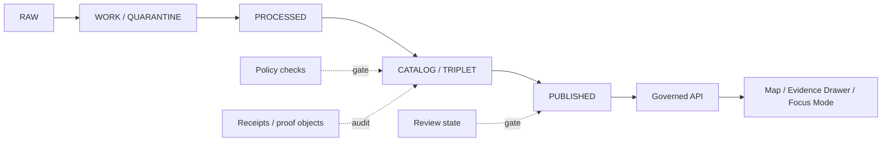
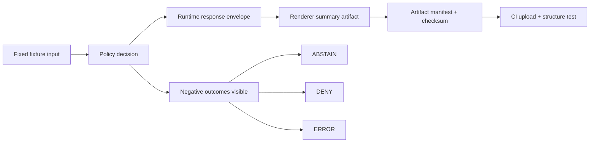

<!-- [KFM_META_BLOCK_V2]
doc_id: kfm.runbook.repository_next_steps.v1
title: Repository Next Steps
type: runbook
version: v1
status: active-draft
owners: TODO: verify owner
created: 2026-04-25
updated: 2026-04-26
policy_label: evidence_first
related:
  - docs/runbooks/foundation-strategy.md
  - docs/runbooks/markdown-remediation-plan.md
  - docs/runbooks/markdown-debt-backlog.md
  - .github/workflows/verification-baseline.yml
notes:
  - This revision expands the pasted runbook with clearer sequencing, risk handling, validation, and rollback.
  - Repository behavior described here is based on the referenced prior scan/runbook and must be refreshed after each new scan.
[/KFM_META_BLOCK_V2] -->

# Repository Next Steps

<p align="center">
  <strong>Impact-ordered follow-up plan after the 2026-04-25 baseline verification and 2026-04-26 markdown debt update.</strong>
</p>

<p align="center">
  
  
  
  
</p>

<p align="center">
  <a href="#current-determination">Current determination</a> ·
  <a href="#next-pr-sequence">Next PR sequence</a> ·
  <a href="#three-file-markdown-sprint">Markdown sprint</a> ·
  <a href="#validation">Validation</a> ·
  <a href="#rollback-and-correction">Rollback</a> ·
  <a href="#weekly-scorecard">Scorecard</a>
</p>

> [!IMPORTANT]
> This runbook records the next actions implied by the repository scan and markdown backlog state captured on **2026-04-25** and updated on **2026-04-26**. Re-run the validation commands before treating any metric, path, workflow, or pass count as current.

| Field | Value |
|---|---|
| Runbook status | `active-draft` |
| Primary objective | Reduce governance ambiguity while hardening contract and artifact proof paths. |
| Evidence basis | Prior local scan/runbook results; this file should be refreshed after a new repo scan. |
| Public posture | Cite-or-abstain; fail closed on unresolved rights, sensitivity, access, exact location, or release state. |
| Next recommended PR | Three-file markdown debt sprint + path-policy sanity check. |
| Do not start with | Live source connectors, UI polish, public publication, broad ingest, direct model integration, or exposed deployment. |

## What this is / what this is not

| This runbook does | This runbook does not |
|---|---|
| Turns the latest scan/backlog state into a sequenced execution plan. | Does not prove current implementation after the last scan date. |
| Identifies the next PRs, risks, validation, and rollback path. | Does not authorize public release or source activation. |
| Keeps documentation cleanup tied to governance and contract integrity. | Does not let generated artifacts, map layers, or AI summaries become sovereign truth. |

## Current determination

The previous baseline-and-smoke-check phase has largely moved from missing scaffolding to **governance hardening**. The current highest-value work is therefore not another broad framework pass. It is a small, reversible sequence that:

1. burns down ambiguity in the most consequential markdown hotspots;
2. verifies that existing contract tests and path policies are aligned;
3. proves one deterministic governed artifact path in CI;
4. updates backlog metrics and threshold guardrails without hiding uncertainty.

### Why this is the next move

The prior runbook already reports a green local baseline, baseline workflow coverage, Python syntax checks, placeholder marker reporting, markdown authority threshold checks, governed API path policy checks, ecology boundary tests, and deterministic artifact/backlog generation. The remaining constraint is no longer only test scaffolding. It is the ability for maintainers to read the repo and know which claims are verified, proposed, unknown, or blocked.

### Next action in one sentence

Open the next PR as a **markdown-debt and trust-surface PR** focused on `docs/domains/fauna/README.md`, `packages/genealogy_ingest/README.md`, and `data/catalog/prov/README.md`, while also verifying the `apps/governed_api` / `apps/governed-api` path-policy boundary before extending artifact proof work.

<p align="right"><a href="#repository-next-steps">Back to top ↑</a></p>

## Evidence snapshot

> [!NOTE]
> These values come from the previous scan/runbook. Re-run the commands in [Validation](#validation) before using them as current PR facts.

| Area | Reported state | Follow-up needed |
|---|---:|---|
| Baseline local verification | `tools/ci/run_repo_baseline_local.sh` green; `101 passed` | Re-run before merge. |
| Baseline workflow | `.github/workflows/verification-baseline.yml` covers thin-slice checks and `tests/ci` | Confirm artifact upload and optional dependency behavior still match current workflow. |
| Ecology API/UI boundary | Runtime schemas and boundary tests added | Confirm path policy and shim/canonical naming before extending. |
| Python syntax checks | `tools/ci/check_python_syntax.sh` in baseline | Re-run after any Python edits. |
| Placeholder reporting | `tools/ci/report_placeholder_markers.py` automated | Regenerate after markdown sprint. |
| Markdown authority thresholds | `tools/ci/check_markdown_authority_thresholds.py` and JSON thresholds active | Lower thresholds after successful marker reduction. |
| Governed API path policy | `apps/governed_api` canonical; `apps/governed-api` shim-only | Resolve any documentation or test references that imply the shim is canonical. |

### Reported marker counts

| Scan point | `TODO` | `UNKNOWN` | `NEEDS VERIFICATION` | Overall marker total | Notes |
|---|---:|---:|---:|---:|---|
| 2026-04-25 baseline snapshot | 498 | 480 | 1,857 | TODO: compute from same script output | Source runbook counts. |
| 2026-04-26 backlog regeneration | TODO: refresh | TODO: refresh | TODO: refresh | 2,592 | Reduced from 2,801 after four burn-down passes. |

> [!WARNING]
> The source notes mention both **190 Markdown files out of 361 files** and later **194 Markdown files vs 82 Python files**. Treat these as different scan points until a fresh inventory reconciles them.

## Governed lifecycle anchor



This plan keeps public-facing surfaces downstream of governed APIs and released artifacts. It does not permit public clients, map surfaces, Focus Mode, or AI outputs to read directly from RAW, WORK, QUARANTINE, unpublished candidates, canonical/internal stores, or direct model-runtime output.

<p align="right"><a href="#repository-next-steps">Back to top ↑</a></p>

## Completed or reported moves

### Move A — Ecology API/UI boundary contract tests

Reported action:

- Added runtime schemas:
  - `schemas/contracts/v1/runtime/ecology_evidence_bundle_response.schema.json`
  - `schemas/contracts/v1/runtime/ecology_evidence_drawer.schema.json`
- Added boundary schema tests:
  - `apps/governed-api/ecology/tests/test_route_response_contract_schema.py`
  - `apps/ui/ecology/tests/test_evidence_drawer_contract_schema.py`
- Added negative assertions for missing required fields.
- Added deterministic governed-artifact build path:
  - `tools/ci/build_governed_artifacts.py`
  - workflow artifact upload: `governed-artifacts`

Follow-up: verify whether `apps/governed-api/...` is intentionally shim-only or should be rewritten to the canonical `apps/governed_api/...` naming in docs, imports, and test references.

### Move B — Marker-growth freeze in markdown hotspots

Reported action:

- Added threshold ceilings for known hotspots:
  - `packages/indexers/README.md` — 59
  - `packages/genealogy_ingest/README.md` — 44
  - `pipelines/kansas_biodiversity_etl/dedupe/README.md` — 39
  - `data/catalog/prov/README.md` — 39
  - `pipelines/kansas_biodiversity_etl/catalog/README.md` — 35
  - `.github/README.md` — 35

Follow-up: after the next sprint, lower ceilings where markers were actually removed. Do not raise thresholds unless a documented policy decision explains why the extra uncertainty is intentional.

## Progress update

Reported 2026-04-26 burn-down passes:

- `packages/indexers/README.md`
- `docs/README.md`
- `docs/architecture/README.md`
- `apps/ui/README.md`

Reported result: overall marker total reduced from **2,801** to **2,592**.

## Next PR sequence

| Priority | PR theme | Primary files | Why now | Exit criteria |
|---|---|---|---|---|
| P0 | Three-file markdown debt sprint | `docs/domains/fauna/README.md`, `packages/genealogy_ingest/README.md`, `data/catalog/prov/README.md` | These are the next backlog targets and carry high trust/sensitivity load. | Combined marker count reduced by at least 30%; no threshold regressions. |
| P1 | Path-policy sanity check | `tools/ci/check_governed_api_path_policy.py`, ecology API/UI references, runbook docs | The runbook says underscore path is canonical while some tests reference hyphenated path. | No doc/test reference implies shim path is canonical. |
| P2 | Governed E2E artifact proof | `tools/ci/build_governed_artifacts.py`, workflow artifact upload, fixture tests | Turns fixture smoke into a reproducible proof path. | One no-network command generates a governed artifact whose checksum and structure are tested. |
| P3 | Threshold tightening and scorecard refresh | `tools/ci/markdown_authority_thresholds.json`, `docs/runbooks/markdown-debt-backlog.md`, this runbook | Prevents debt from regrowing after cleanup. | Thresholds lowered where appropriate; scorecard updated with before/after values. |
| P4 | Next boundary contract expansion | Next highest-risk API/UI or Evidence Drawer boundary after ecology | Expands deterministic contract coverage without broad rewrite. | Positive and negative schema tests added; failure messages are actionable. |

<p align="right"><a href="#repository-next-steps">Back to top ↑</a></p>

## Three-file markdown sprint

### Shared sprint rules

For each target file:

- Replace vague placeholders with repo-evidenced facts only when the current repo supports them.
- Move unresolved items into a clearly labeled `Open verification items` section.
- Delete stale or duplicate uncertainty markers that no longer guide action.
- Preserve KFM truth posture: `CONFIRMED`, `PROPOSED`, `UNKNOWN`, `NEEDS VERIFICATION`, `CONFLICTED` where materially useful.
- Keep public release, sensitivity, and source-rights claims fail-closed.
- Add a compact validation and rollback section.

### Target 1 — `docs/domains/fauna/README.md`

| Add or clarify | Why it matters |
|---|---|
| Accepted inputs vs exclusions | Prevents occurrence aggregators, models, legal status, and habitat context from being treated as equivalent. |
| Source-role table | Keeps observed occurrence, modeled context, protected-area context, and statutory context distinct. |
| Public precision rules | Exact sensitive locations must fail closed unless reviewed and transformed. |
| Evidence Drawer implications | Public UI claims must resolve evidence and policy posture before display. |
| Negative states | `ABSTAIN`, `DENY`, and `ERROR` should remain visible rather than smoothed into vague copy. |

Definition of done:

- [ ] Marker count for this file is reduced from current baseline.
- [ ] Sensitive exact-location posture is explicit.
- [ ] Source roles are named and not collapsed.
- [ ] Claims about live connectors or route behavior are either evidenced or moved to open verification.
- [ ] Validation and rollback notes are present.

### Target 2 — `packages/genealogy_ingest/README.md`

| Add or clarify | Why it matters |
|---|---|
| Assertion-first ingest boundary | Genealogical claims should not become canonical person records without evidence and review. |
| Living-person and DNA/genomics restrictions | High-sensitivity material should be restricted by default. |
| Accepted inputs and exclusions | Prevents GEDCOM, family lore, DNA hints, assessor records, and title/ownership claims from being collapsed. |
| Deduplication posture | Entity resolution should preserve uncertainty, not erase it. |
| Public output posture | Public outputs must be evidence-bound, reviewed, and policy-safe. |

Definition of done:

- [ ] Marker count for this file is reduced from current baseline.
- [ ] Living-person and DNA/genomics policy posture is explicit.
- [ ] Assertions, canonical records, and hypotheses are separated.
- [ ] Ingest examples do not imply public release.
- [ ] Rollback/correction path is included for bad assertions or unsafe publication attempts.

### Target 3 — `data/catalog/prov/README.md`

| Add or clarify | Why it matters |
|---|---|
| PROV role | Provenance records explain derivation; they do not replace proof, catalog, release, or review objects. |
| Object-family separation | Keeps receipts, proof packs, catalog records, release manifests, correction notices, and rollback references distinct. |
| Catalog closure | Public claims should resolve to evidence, source, policy, review, release, and correction lineage. |
| Generated artifact posture | Generated artifacts are rebuildable outputs, not canonical source truth. |
| Validation expectations | Reviewers need to know which checks fail closed. |

Definition of done:

- [ ] Marker count for this file is reduced from current baseline.
- [ ] PROV is framed as provenance, not as sovereign proof.
- [ ] Object-family responsibilities are compactly mapped.
- [ ] Generated artifacts remain downstream and rebuildable.
- [ ] Validation and rollback/correction notes are present.

## P1 path-policy sanity check

> [!WARNING]
> The runbook reports `apps/governed_api` as canonical and `apps/governed-api` as shim-only, but also names ecology tests under `apps/governed-api/...`. Verify this before adding more API/UI references.

Checklist:

- [ ] Run `python3 tools/ci/check_governed_api_path_policy.py`.
- [ ] Confirm whether `apps/governed-api/ecology/tests/...` is allowed as a shim test path.
- [ ] If not allowed, move or update references to `apps/governed_api/...` according to repo convention.
- [ ] Update this runbook and any affected README references.
- [ ] Add a short note explaining canonical path vs shim path in the relevant docs.

## P2 governed E2E artifact proof

The next engineering step should prove one no-network, deterministic path from fixture to artifact. This should be small enough to review and strong enough to prevent artifact drift.



Minimum useful artifact fields:

| Field | Purpose |
|---|---|
| `artifact_id` | Stable identifier for the generated output. |
| `source_fixture` | Points to the fixture used to generate the artifact. |
| `policy_decision_ref` | Links output to policy result. |
| `runtime_envelope_ref` | Links output to the governed runtime response. |
| `checksum` | Detects output drift. |
| `created_by` | Build script or CI job that created the artifact. |
| `release_state` | Should remain non-public unless promotion is explicitly tested. |

Definition of done:

- [ ] One command generates the artifact from fixed fixtures.
- [ ] CI uploads the artifact under a clearly named artifact group.
- [ ] Tests verify structure and checksum or deterministic content.
- [ ] Negative outcomes remain visible and testable.
- [ ] Generated artifacts are not placed in canonical truth paths unless repo convention explicitly supports that.
- [ ] Operator runbook explains generation, validation, and rollback.

## Risk register

| Risk | Impact | Mitigation |
|---|---|---|
| Markdown thresholds freeze debt instead of reducing it | Bad docs remain permanently tolerated | Lower thresholds after burn-down; require before/after deltas. |
| Path naming drift between `apps/governed_api` and `apps/governed-api` | Tests/docs normalize a shim path as canonical | Run path policy and add a short canonical-path note. |
| E2E artifact becomes treated as truth | Generated output replaces EvidenceBundle/proof path | Label artifact as derived; validate EvidenceRef and policy links. |
| Fauna README exposes or normalizes exact sensitive locations | Rare/protected species exposure | Fail closed; document geoprivacy and public-safe transforms. |
| Genealogy ingest README implies living-person or DNA release | Privacy and policy breach | Restrict by default; separate assertions, hypotheses, and canonical records. |
| PROV README collapses provenance, proof, catalog, and release | Reviewers cannot reconstruct claims | Add object-family table and catalog closure notes. |
| Metrics are compared across different scans | False progress or regression claim | Record scan timestamp, command, and script version for each metric. |

## Validation

Run from the repository root after confirming the paths exist in the current checkout.

```bash
# Baseline verification.
tools/ci/run_repo_baseline_local.sh

# Placeholder and uncertainty marker reporting.
python3 tools/ci/report_placeholder_markers.py --root . --top 20
python3 tools/ci/report_placeholder_markers.py --root . \
  --max-overall 5000 \
  --max-marker "NEEDS VERIFICATION=2500"

# Markdown debt backlog regeneration.
python3 tools/ci/generate_markdown_debt_backlog.py

# Markdown authority threshold check.
python3 tools/ci/check_markdown_authority_thresholds.py

# Governed API path policy check.
python3 tools/ci/check_governed_api_path_policy.py

# Governed artifact build path, if present in current checkout.
python3 tools/ci/build_governed_artifacts.py
```

Optional inventory refresh:

```bash
python - <<'PY'
from pathlib import Path
root = Path('.')
files = [p for p in root.rglob('*') if p.is_file() and '.git' not in p.parts]
print('files', len(files))
print('markdown', sum(1 for p in files if p.suffix.lower() == '.md'))
PY

python - <<'PY'
import subprocess
for pat in ['TODO', 'UNKNOWN', 'NEEDS VERIFICATION']:
    out = subprocess.run(['rg', '-n', pat, '.'], capture_output=True, text=True)
    count = 0 if out.returncode == 1 else len(out.stdout.strip().splitlines())
    print(pat, count)
PY
```

## Rollback and correction

| Change type | Rollback path |
|---|---|
| Markdown sprint edit | Revert edited README/runbook files; restore previous backlog snapshot if regeneration was wrong. |
| Threshold tightening | Restore prior `tools/ci/markdown_authority_thresholds.json`; rerun threshold check. |
| Path-policy correction | Revert path move/reference changes; rerun path policy before reattempt. |
| Artifact build path | Remove generated artifact upload step or restore prior build script; keep fixtures unchanged unless they caused failure. |
| Contract/schema test change | Revert schema and related positive/negative tests together; do not leave tests pointing to removed schemas. |
| Public meaning changed accidentally | Add correction note in the affected doc and restore prior wording until review approves the new meaning. |

No rollback should publish, delete, or alter RAW/WORK/QUARANTINE data. This runbook deals with documentation, CI checks, contracts, and generated artifacts only.

<p align="right"><a href="#repository-next-steps">Back to top ↑</a></p>

## Weekly scorecard

Update this table at the end of each sprint.

| Week ending | Baseline status | `tests/ci` count | `TODO` | `UNKNOWN` | `NEEDS VERIFICATION` | Overall marker total | Boundary tests added | E2E artifact status | Top blocker |
|---|---|---:|---:|---:|---:|---:|---|---|---|
| 2026-04-26 | Reported green | 101 passed | 498 | 480 | 1,857 | 2,592 after burn-down | Ecology boundary tests reported | Build path reported; proof path still needs validation | Three-file markdown sprint + path-policy verification |
| TODO: next week | TODO | TODO | TODO | TODO | TODO | TODO | TODO | TODO | TODO |

## Seven-day execution packet

| Day | Focus | Output |
|---:|---|---|
| 1 | Three-file markdown sprint setup | Fresh marker counts for `docs/domains/fauna/README.md`, `packages/genealogy_ingest/README.md`, and `data/catalog/prov/README.md`. |
| 2 | Fauna README pass | Source-role, sensitivity, public precision, Evidence Drawer, and negative-state cleanup. |
| 3 | Genealogy ingest README pass | Assertion/canonical separation, living-person restrictions, DNA/genomics restriction, correction path. |
| 4 | Catalog/PROV README pass | Object-family map, catalog closure, generated artifact posture, validation notes. |
| 5 | Regenerate backlog and thresholds | Updated `docs/runbooks/markdown-debt-backlog.md`; lowered threshold ceilings where appropriate. |
| 6 | Path-policy and E2E artifact proof | Path-policy check; deterministic artifact build/test draft or implementation. |
| 7 | Scorecard and merge readiness | Updated weekly scorecard, before/after deltas, blockers, rollback notes. |

## Open verification items

- [ ] Confirm current branch, dirty state, and workflow state before merge.
- [ ] Reconcile `190` vs `194` Markdown file counts with a fresh inventory.
- [ ] Confirm whether `apps/governed-api` references are intentionally shim-only.
- [ ] Confirm the exact command and output path for `tools/ci/build_governed_artifacts.py`.
- [ ] Confirm whether generated artifacts are uploaded only through CI and not committed into canonical source paths.
- [ ] Confirm owner/reviewer expectations for fauna, genealogy ingest, and catalog/prov docs.
- [ ] Confirm whether marker thresholds should be lowered immediately after sprint completion or after one stable weekly cycle.

<details>
<summary>Appendix A — Original analysis commands preserved from source runbook</summary>

```bash
tools/ci/run_repo_baseline_local.sh
python3 tools/ci/report_placeholder_markers.py --root . --top 10
python3 tools/ci/report_placeholder_markers.py --root . --max-overall 5000 --max-marker "NEEDS VERIFICATION=2500"
python - <<'PY'
from pathlib import Path
root=Path('.')
files=[p for p in root.rglob('*') if p.is_file() and '.git' not in p.parts]
print('files',len(files))
print('markdown',sum(1 for p in files if p.suffix.lower()=='.md'))
PY
python - <<'PY'
import subprocess
for pat in ['TODO','UNKNOWN','NEEDS VERIFICATION']:
    out=subprocess.run(['rg','-n',pat,'.'],capture_output=True,text=True)
    count=0 if out.returncode==1 else len(out.stdout.strip().splitlines())
    print(pat,count)
PY
```

</details>

<details>
<summary>Appendix B — Maintainer checklist for this runbook</summary>

- [ ] Evidence snapshot refreshed with current command output.
- [ ] Three-file markdown sprint completed or blockers recorded.
- [ ] Before/after marker counts added.
- [ ] Path-policy check result recorded.
- [ ] Governed artifact proof status recorded.
- [ ] Threshold JSON changes justified.
- [ ] Rollback path still matches actual files changed.
- [ ] No fake CI, release, owner, coverage, security, or deployment claim added.
- [ ] No public release or source activation implied by documentation cleanup.

</details>
