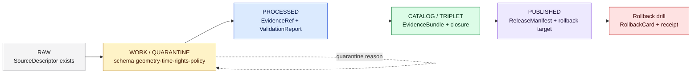

<!-- [KFM_META_BLOCK_V2]
doc_id: kfm://doc/runbook/roads-rail-trade/no-network-test
title: Roads, Rail, and Trade Routes — No-Network Test Runbook
type: standard
version: v0.1
status: draft
owners: Roads/Rail/Trade Routes domain steward + QA + Docs steward
created: 2026-05-12
updated: 2026-05-12
policy_label: public
related:
  - docs/runbooks/README.md (PROPOSED)
  - docs/domains/roads-rail-trade/README.md (PROPOSED)
  - docs/architecture/testing-strategy.md (PROPOSED)
  - docs/adr/ADR-runbook-domain-placement.md (PROPOSED)
  - tests/domains/roads-rail-trade/ (PROPOSED)
  - fixtures/domains/roads-rail-trade/ (PROPOSED)
  - schemas/contracts/v1/domains/roads-rail-trade/ (PROPOSED)
  - policy/domains/roads-rail-trade/ (PROPOSED)
tags: [kfm, runbook, roads-rail-trade, no-network, fixtures, tests, governance]
notes:
  - Path placement is PROPOSED; see §12 (Directory Rules basis) for rationale.
  - All command shapes are PROPOSED until verified against a mounted repo.
[/KFM_META_BLOCK_V2] -->

# Roads, Rail, and Trade Routes — No-Network Test Runbook

> **Run the Roads/Rail/Trade domain's trust-spine fixture suite — schema, contract, evidence, policy, release, correction, and rollback — entirely offline, with zero live sources and zero public side effects.**


| Field | Value |
|---|---|
| **Status** | `draft` — first iteration, not yet exercised against a mounted repo |
| **Owners** | Roads/Rail/Trade Routes domain steward + QA + Docs steward |
| **Last updated** | 2026-05-12 |
| **Applies to** | PR-00 no-network fixture wave, scoped to Roads, Rail, and Trade Routes |
| **Pipeline scope** | RAW → WORK / QUARANTINE → PROCESSED → CATALOG / TRIPLET → PUBLISHED |
| **Network posture** | Deny-by-default; no egress allowed during this runbook |

---

## Quick jump

- [1 · Purpose](#1--purpose)
- [2 · Scope and non-scope](#2--scope-and-non-scope)
- [3 · Preconditions](#3--preconditions)
- [4 · Domain object families under test](#4--domain-object-families-under-test)
- [5 · Pipeline gates the suite must exercise](#5--pipeline-gates-the-suite-must-exercise)
- [6 · Fixture catalogue (per object family)](#6--fixture-catalogue-per-object-family)
- [7 · Sensitivity, rights, and public-safe fixture rules](#7--sensitivity-rights-and-public-safe-fixture-rules)
- [8 · Procedure](#8--procedure)
- [9 · Finite outcomes and exit criteria](#9--finite-outcomes-and-exit-criteria)
- [10 · Failure modes and triage](#10--failure-modes-and-triage)
- [11 · Rollback](#11--rollback)
- [12 · Directory Rules basis](#12--directory-rules-basis)
- [13 · Verification backlog](#13--verification-backlog)
- [Related docs](#related-docs)

---

## 1 · Purpose

This runbook governs the **no-network deterministic test pass** for the Roads, Rail, and Trade Routes domain. It is the operational form of **PR-00 no-network fixture** as applied to this lane: a fully offline rehearsal that proves the trust spine — source admission, lifecycle handling, schema, evidence, policy, release, correction, rollback — runs end-to-end against synthetic, public-safe fixtures before any live source or public surface is wired.

> [!IMPORTANT]
> **The point of this runbook is not "tests pass." The point is that the system fails closed in the right places.** A green run that never produced an `ABSTAIN`, never produced a `DENY`, and never exercised a rollback fixture has not validated the trust spine — it has only validated the happy path.

The doctrine is project-wide; this file localizes it to **Roads/Rail/Trade Routes** so the lane can ship its first reversible PR without crossing a forbidden boundary.

---

## 2 · Scope and non-scope

### In scope

- The deterministic, no-network fixture suite for Roads/Rail/Trade Routes objects, schemas, validators, policy gates, evidence resolution, release manifests, correction notices, and rollback cards.
- Synthetic and public-safe fixtures only (no real exact sensitive geometry, no live source pulls).
- Schema, contract, source-role, evidence, policy, lifecycle, release, UI-trust (payload-shape only), and AI-boundary (MockAdapter) test classes.
- Producing per-run receipts and per-fixture validation reports as local artifacts.

### Explicitly out of scope

- Live KDOT / FHWA / FRA / WZDx / OSM / GNIS / KanDrive / KanPlan source fetches. Source rights are `NEEDS VERIFICATION` and live retrieval is forbidden in this run.
- Publication to any public path. `data/published/` MUST NOT be written during this runbook.
- Live AI provider adapters (Ollama, OpenAI, hosted). Only the **MockAdapter** is permitted.
- Production auth, deployment topology, or real tile signing infrastructure.
- Domains adjacent to but **not owned** by Roads/Rail/Trade Routes (Settlements/Infrastructure, Hydrology, Archaeology, Hazards). Cross-lane relations are exercised only via reference, not by mutating those domains' canon.

---

## 3 · Preconditions

> [!NOTE]
> Every precondition below is **PROPOSED** until verified against a mounted repo. Do not treat the path strings as proof a file exists.

| Precondition | Where it lives (PROPOSED) | Truth label |
|---|---|---|
| Domain dossier present | `docs/domains/roads-rail-trade/README.md` | PROPOSED |
| Schemas reachable | `schemas/contracts/v1/domains/roads-rail-trade/` | PROPOSED |
| Contracts reachable | `contracts/domains/roads-rail-trade/` | PROPOSED |
| Policy bundle reachable | `policy/domains/roads-rail-trade/` | PROPOSED |
| Fixtures reachable | `fixtures/domains/roads-rail-trade/` (or `tests/fixtures/domains/roads-rail-trade/`) | PROPOSED |
| Validator entry point | `tools/validators/` (repo-wide) | PROPOSED |
| Test harness | `tests/domains/roads-rail-trade/` | PROPOSED |
| MockAdapter available | `runtime/mock/` | PROPOSED |
| Receipt writer | `tools/` or `packages/` (exact home `NEEDS VERIFICATION`) | PROPOSED |
| **Network egress disabled at runner level** | `infra/` egress policy / CI runner config | PROPOSED · **MUST** be true |
| No real secrets present | `configs/dev/`, `configs/test/`, `configs/local/` | CONFIRMED rule (Directory Rules §10.3) |

> [!CAUTION]
> If network egress cannot be proven disabled at the runner level, **do not start this run**. A no-network suite that ran with egress available has not validated the no-network invariant — it has merely happened to not call out. Treat this as a missed gate, not a passed run.

---

## 4 · Domain object families under test

Roads/Rail/Trade Routes owns the following canonical object families. Each MUST have at least the five fixture roles in §6.

| Object family | Owned by this domain | Cross-lane note |
|---|---|---|
| `RoadSegment` | ✓ | Anchors crossings/facilities in Settlements (settlement-owned identity) |
| `RailSegment` | ✓ | Same constraint as RoadSegment |
| `HistoricRoute` / `Historic RouteClaim` | ✓ | Indigenous corridors default to generalized public geometry |
| `CorridorRoute` / `TradeRouteCorridor` | ✓ | Distinguish surveyed alignment from narrative claim |
| `Depot`, `Siding`, `Yard` | ✓ | Facility identity is settlement-owned for cross-references |
| `Crossing`, `Bridge`, `Ferry`, `RiverCrossing` | ✓ | Hydrology owns the water evidence |
| `FreightCorridor`, `NetworkEdge`, `Network Node` | ✓ | Derived graph projections are not root truth |
| `RouteEvent`, `OperatorStatus` / `StatusEvent` | ✓ | Temporal fields stay distinct (observed/valid/release/correction) |
| `AccessRestriction` / `RestrictionEvent` | ✓ | Hazards owns closure/detour/exposure context |
| `RouteMembership`, `OperatorAssignment` | ✓ | Designation vs membership must remain separable |
| `TransportFacility` | ✓ | Public detail subject to sensitivity review |
| `MovementStoryNode` | ✓ | Narrative carrier; never sovereign over surveyed alignment |
| `GeneralizationReceipt` | ✓ | Records redaction/generalization transforms and reasons |

Source: domain identity, scope, and object families per the KFM Domains Atlas chapter on Roads, Rail, and Trade Routes (CONFIRMED doctrine / PROPOSED implementation).

---

## 5 · Pipeline gates the suite must exercise

The no-network suite walks the lifecycle **without** writing to any public surface. Each gate has a finite outcome and a fixture that proves it.



> [!NOTE]
> **Diagram status:** the lifecycle invariant is **CONFIRMED doctrine**; per-stage gate labels are **PROPOSED implementation** until a mounted repo confirms the validator outputs. Re-render once `tests/domains/roads-rail-trade/` exists.

---

## 6 · Fixture catalogue (per object family)

Every major Roads/Rail/Trade object family **SHOULD** carry at least the five fixture roles below. Sensitive lanes (Indigenous corridors, critical facilities) **MUST** substitute public-safe transformed geometry for the `valid` role; never real exact coordinates.

| Fixture role | Purpose | Expected outcome | Example for this domain (illustrative) |
|---|---|---|---|
| **valid** | Schema-conformant, releasable shape | `ANSWER` at resolver; `ALLOW` at policy | A synthetic `RoadSegment` with normalized time, rights, evidence ref |
| **invalid** | Violates schema or contract | Validator fails closed; receipt records `NormalizationError` | A `RailSegment` missing temporal fields |
| **denied** | Schema-valid but policy-blocked | `DENY` with reason (rights/sensitivity/review/release) | A `Historic RouteClaim` over an Indigenous corridor without steward review |
| **abstention** | Evidence unresolved | `ABSTAIN` with `ResolutionError.missing_bundle` | A `MovementStoryNode` whose `EvidenceRef` points to a missing bundle |
| **rollback / correction** | Drives the reversal path | Rollback receipt emitted; correction notice linked | A withdrawn `ReleaseManifest` for a generalized `TradeRouteCorridor` |

> [!TIP]
> The five-role fixture rule is project-wide doctrine. Treat any object family with fewer than five fixture roles as "not yet ready for PR-00 closure" — even if its happy path passes.

<details>
<summary><strong>Domain-specific negative tests this suite MUST contain</strong> (click to expand)</summary>

The following negative tests are called out specifically for Roads, Rail, and Trade Routes (status: **PROPOSED**):

- **Route membership vs designation separation** — a `RouteMembership` change MUST NOT silently rewrite a `CorridorRoute` designation; the fixture forces both to be present and distinguishable.
- **Operator / status temporal tests** — `OperatorAssignment` and `StatusEvent` keep `source`, `observed`, `valid`, `retrieval`, `release`, and `correction` times distinct; collapse fails closed.
- **OSM / GNIS legal-status denial** — community-sourced or place-name attributes MUST NOT be used to assert legal-status authority. Fixture forces `DENY` when source role is `context` but the claim requires `authority`.
- **Historic overprecision denial** — a `Historic RouteClaim` carrying surveyor-precision geometry from a narrative source fails closed; fixture asserts `DENY` and points at the `GeneralizationReceipt` requirement.
- **Public generalization receipt tests** — every public-safe geometry for a sensitive corridor MUST resolve to a `GeneralizationReceipt` describing the transform and reason; missing receipt → `DENY`.
- **Transport graph projection rollback** — a derived `NetworkEdge` projection MUST be reversible. Rollback fixture exercises the full revert and emits an attestation.

These map to the validator/test entries listed in the Roads/Rail/Trade Routes domain chapter (status: PROPOSED).

</details>

---

## 7 · Sensitivity, rights, and public-safe fixture rules

> [!WARNING]
> Even **synthetic** fixtures can leak real sensitive geometry if built from sketched real corridors. Build fixtures from clearly invented place names, generic coordinate ranges, and explicit `mock:true` markers. Never paste real Indigenous corridor coordinates, real rare-species crossings, real critical-infrastructure precision, or real archaeological alignments into a fixture, even "for realism."

| Sensitivity class | Public-safe rule for fixtures | Default outcome on violation |
|---|---|---|
| Indigenous trade and mobility corridors | Generalized geometry + steward-review marker required | `DENY` |
| Treaty / cultural / oral-history evidence | Steward review + provenance citation required | `DENY` or `ABSTAIN` |
| Critical transport facilities (precision) | Default to generalized public view | `DENY` |
| Living-person operator data | Public-safe redaction; no PII payload | `DENY` |
| OSM / GNIS / community attributes used outside their role | Source-role mismatch must surface | `DENY` |

All fixtures **MUST** include an obvious mock marker, **MUST** be schema-valid, and **MUST NOT** be confused with released evidence. Fixtures are not publication artifacts. (CONFIRMED doctrine.)

---

## 8 · Procedure

> [!IMPORTANT]
> Every command shape below is **PROPOSED**. The actual command names depend on the repo's chosen toolchain (`npm` / `pnpm` / `yarn` / `pytest` / `make` / Dagster / equivalent). Substitute the repo's verified equivalent before running. Do not invent commands without verifying.

### 8.1 Confirm network egress is denied

```bash
# PROPOSED — substitute the repo's verified network-deny check.
# Examples (each NEEDS VERIFICATION before use):
#   make assert-no-egress
#   ./tools/assert-no-egress.sh
#   curl --max-time 2 -sS https://example.invalid && echo "FAIL: egress reached" || echo "OK"
```

Expected: any outbound DNS or HTTP call fails or is denied at the runner level. If not, **stop**.

### 8.2 Validate schemas and fixtures

```bash
# PROPOSED — repo-wide validator over the domain's schemas and fixtures.
# Substitute the repo's actual command (ajv, jsonschema, or in-tree validator).
#
#   <repo-validator> \
#     --schemas schemas/contracts/v1/domains/roads-rail-trade \
#     --fixtures fixtures/domains/roads-rail-trade \
#     --report tests/reports/roads-rail-trade/schema.json
```

Expected: every `valid` fixture passes; every `invalid` fixture fails with a precise error. A `valid` failure or a silent `invalid` pass is a release-blocker.

### 8.3 Run the domain test suite

```bash
# PROPOSED — domain test runner; substitute the verified entry point.
#
#   <repo-test-runner> tests/domains/roads-rail-trade --no-network --deterministic
```

Expected: every test class in the table below produces a finite outcome and a receipt.

| Test class | What it asserts | Expected outcome |
|---|---|---|
| Schema test | Required fields and versions present | pass / fail-closed |
| Contract test | Object meaning matches vocabulary and lifecycle role | pass / fail-closed |
| Source-role test | A source is not used outside its authority | `DENY` on misuse |
| Evidence test | `EvidenceRef` resolves or answer abstains | `ANSWER` / `ABSTAIN` |
| Policy test | Unknown rights or sensitivity deny release | `DENY` |
| Release test | Manifest has proof, correction, rollback | pass / fail-closed |
| UI trust test (payload shape) | Drawer payload renders required trust state | pass / fail-closed |
| AI boundary test | `MockAdapter` cannot answer without admissible evidence | `ABSTAIN` / `DENY` |

(Default status for every class: **PROPOSED**, per the unified testing strategy.)

### 8.4 Walk the lifecycle without publishing

```bash
# PROPOSED — promotion dry-run; MUST NOT write to data/published/.
#
#   <repo-promote> --dry-run \
#     --candidate release/candidates/roads-rail-trade \
#     --emit-receipt
```

Expected: a `PromotionReceipt` or equivalent receipt is emitted to a local artifact path. No file is written under `data/published/`. A `no-public-write` assertion confirms this.

### 8.5 Run the rollback drill

```bash
# PROPOSED — rollback against the dry-run release candidate.
#
#   <repo-rollback> --drill \
#     --release release/candidates/roads-rail-trade \
#     --emit-rollback-card
```

Expected: a `RollbackCard` is produced; the prior release manifest is restored in-fixture; an attestation lands in the receipts area. The drill must be re-runnable from a clean state.

### 8.6 Collect receipts

All receipts from §§8.2–8.5 land in the repo-local receipts area (PROPOSED home: `data/receipts/` per Directory Rules §6). The run is **incomplete** until those receipts exist and are themselves schema-valid.

---

## 9 · Finite outcomes and exit criteria

This run produces only **finite outcomes**, never silent success. Every fixture path resolves to one of:

| Outcome | Meaning | Suite implication |
|---|---|---|
| `ANSWER` | Schema-valid, evidence resolved, policy allows | Counted toward happy-path coverage |
| `ABSTAIN` | Evidence unresolved or insufficient | **Required** for abstention fixtures; failing to abstain is a release-blocker |
| `DENY` | Policy / rights / sensitivity / review state blocks | **Required** for denied fixtures; failing to deny is a release-blocker |
| `ERROR` | Validator / runtime fault before a decision | Triage; never accept as a passing state |

### Exit criteria for PR-00 closure (Roads/Rail/Trade lane)

The lane's no-network slice may merge only when **all** of the following hold:

- [ ] Network egress is verifiably denied for the entire run.
- [ ] Every object family in §4 has the five fixture roles in §6.
- [ ] Every domain-specific negative test in §6 (collapsible) is present and passes (i.e., correctly **denies**).
- [ ] Every test class in §8.3 produces a finite outcome.
- [ ] The promotion dry-run produces a receipt **and** writes no file under `data/published/`.
- [ ] The rollback drill produces a `RollbackCard` and a restoration receipt.
- [ ] All receipts are themselves schema-valid.
- [ ] The `VERIFICATION_BACKLOG` (§13) is updated, not silently closed.

---

## 10 · Failure modes and triage

| Symptom | Likely cause | Triage step |
|---|---|---|
| `valid` fixture fails schema | Schema drift, or fixture authored against an older version | Pin schema version; record in `DRIFT_REGISTER`; do not patch fixture into compliance silently |
| `invalid` fixture silently passes | Validator regression or rule weakened | Treat as release-blocker; revert validator change; add a negative-test gate |
| `EvidenceRef` resolves when it should abstain | Resolver pulling from a non-released store | Audit resolver scope; confirm it reads only released / review-authorized layers |
| Network call attempted | A connector, watcher, or analytics call slipped in | Identify caller; gate behind `--no-network`; file an ADR if the call is unavoidable |
| Sensitive corridor geometry exact-match | Fixture built from real data | Replace with synthetic geometry; record in correction log; rotate the fixture id |
| Rollback drill leaves residue | Restoration path incomplete | Treat as a rollback-bug; do not paper over with manual cleanup; fix the drill |
| Receipt is missing or unsigned | Receipt writer not wired into this lane | Block PR-00 closure for the lane until the receipt step is present |

> [!CAUTION]
> A failure to abstain or deny is a **more serious** finding than a `valid` fixture failing schema. The latter is loud; the former is silent and degrades the trust spine. Triage abstain/deny regressions first.

---

## 11 · Rollback

Per PR-00 doctrine, the no-network fixture PR is itself reversible:

- **Forward step:** revert the PR. No public artifact has been published, so revert is sufficient.
- **Fixtures retained as lineage:** if the PR is superseded rather than withdrawn, keep the fixture set under a `lineage/` or `superseded/` marker rather than deleting it; the work has documentary value.
- **Receipts retained:** receipts from the dry-run remain valid as evidence of the run; they should not be deleted on revert.
- **Drift register:** if the revert reveals doctrine drift, open a `DRIFT_REGISTER` entry instead of just rolling back.

---

## 12 · Directory Rules basis

This document's placement, and the paths it references, follow these Directory Rules conventions:

- **Responsibility root for this file:** `docs/` (explains something to humans).
- **Domain segment for this file:** `roads-rail-trade` as a sub-folder under `docs/runbooks/`, applying Domain Placement Law (§12) by analogy. **Status: PROPOSED.** The Directory Rules confirm `docs/runbooks/` exists as a runbook home but show flat naming examples (e.g., `ui_LOCAL_DEV.md`). The sub-folder pattern is consistent with how `docs/domains/<domain>/`, `tests/domains/<domain>/`, etc. are structured, but is **not yet ADR-resolved** for runbooks specifically.
- **Alternatives considered** (each PROPOSED):
  - `docs/runbooks/roads_rail_trade_NO_NETWORK_TEST.md` — flat, matches the visible runbook naming in source docs.
  - `docs/domains/roads-rail-trade/runbooks/NO_NETWORK_TEST.md` — keeps all roads-rail-trade artifacts under one domain umbrella inside `docs/`.
- **Recommendation:** open a short ADR (`docs/adr/ADR-runbook-domain-placement.md`, PROPOSED) to freeze one of the three forms. Until then, treat this file's location as `PROPOSED / CONFLICTED` and link it from `docs/runbooks/README.md` (PROPOSED) regardless of which form wins.
- **Lifecycle / responsibility roots referenced:** `data/raw/`, `data/work/`, `data/quarantine/`, `data/processed/`, `data/catalog/`, `data/published/`, `data/receipts/`, `release/`, `schemas/contracts/v1/domains/roads-rail-trade/`, `policy/domains/roads-rail-trade/`, `tests/domains/roads-rail-trade/`, `fixtures/domains/roads-rail-trade/`. All are PROPOSED until verified against a mounted repo.

---

## 13 · Verification backlog

These items roll up to `docs/registers/VERIFICATION_BACKLOG.md` (PROPOSED). Do not silently close any of them — each requires a citable piece of repo evidence to retire.

| Item | Evidence that would settle it | Status |
|---|---|---|
| Runbook placement form (flat vs `roads-rail-trade/` vs `docs/domains/...`) | Accepted ADR | NEEDS VERIFICATION |
| `tools/validators/` actual command and flag surface | Mounted repo file presence and CI invocation | NEEDS VERIFICATION |
| Domain schema home actually present | `schemas/contracts/v1/domains/roads-rail-trade/*.schema.json` in repo | NEEDS VERIFICATION |
| Policy bundle actually present | `policy/domains/roads-rail-trade/` in repo with conftest / OPA tests | NEEDS VERIFICATION |
| Fixture home convention (root `fixtures/` vs `tests/fixtures/`) | Per-root README declaration | NEEDS VERIFICATION |
| Receipt writer wired for this lane | Local receipt artifacts emitted by a sample run | NEEDS VERIFICATION |
| `MockAdapter` boundary holds for roads/rail Focus | Test asserting MockAdapter cannot answer without an admissible EvidenceBundle | NEEDS VERIFICATION |
| KDOT / FHWA / FRA / WZDx / OSM / GNIS rights and terms | Source descriptors with verified rights state | NEEDS VERIFICATION |
| Indigenous / cultural corridor policy concrete form | Reviewed `policy/domains/roads-rail-trade/sensitivity/...` rule set | NEEDS VERIFICATION |
| Transport graph projection rollback drill | Replayable rollback fixture + restoration receipt | NEEDS VERIFICATION |
| MapLibre layer manifest read path for this domain | Verified `apps/explorer-web/` → `apps/governed-api/` route | NEEDS VERIFICATION |

---

## Related docs

- `docs/runbooks/README.md` — runbook index (PROPOSED).
- `docs/domains/roads-rail-trade/README.md` — domain dossier (PROPOSED).
- `docs/architecture/testing-strategy.md` — overall no-network test pyramid (PROPOSED).
- `docs/runbooks/ui_LOCAL_DEV.md`, `ui_VALIDATION.md`, `ui_ROLLBACK.md` — UI lane runbooks (PROPOSED).
- `docs/runbooks/governed_ai_LOCAL_DEV.md`, `governed_ai_VALIDATION.md`, `governed_ai_ROLLBACK.md` — Governed AI lane runbooks (PROPOSED).
- `docs/adr/ADR-runbook-domain-placement.md` — to be opened (PROPOSED).
- `docs/registers/DRIFT_REGISTER.md`, `docs/registers/VERIFICATION_BACKLOG.md` — registers (PROPOSED).

---

_Last updated: **2026-05-12** · Status: **draft (v0.1)** · Authority: this runbook is **CONFIRMED** as project doctrine localized to the Roads/Rail/Trade lane; implementation-level claims are **PROPOSED** until a mounted repo verifies them._

[↑ Back to top](#roads-rail-and-trade-routes--no-network-test-runbook)
