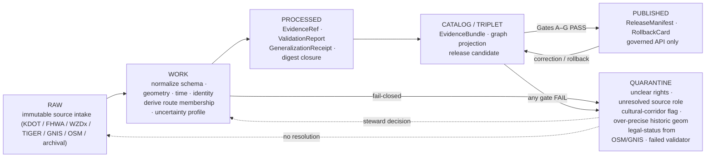

<!-- [KFM_META_BLOCK_V2]
doc_id: kfm://doc/runbook-roads-rail-trade-promotion
title: Roads / Rail / Trade Routes — Promotion Runbook
type: standard
version: v1
status: draft
owners: <docs-steward>, <roads-rail-trade-domain-steward>
created: 2026-05-12
updated: 2026-05-12
policy_label: public
related:
  - docs/doctrine/directory-rules.md
  - docs/doctrine/lifecycle-law.md
  - docs/doctrine/truth-posture.md
  - docs/doctrine/trust-membrane.md
  - docs/domains/roads-rail-trade/README.md
  - docs/architecture/promotion-gates.md
  - policy/domains/roads-rail-trade/
  - schemas/contracts/v1/receipts/promotion_receipt.schema.json
  - release/candidates/roads-rail-trade/
tags: [kfm, runbook, promotion, roads-rail-trade, governance]
notes:
  - Runbook is doctrine-grounded; specific paths PROPOSED until mounted-repo verification.
  - Path placement follows Directory Rules §12; runbook lives under a domain segment.
[/KFM_META_BLOCK_V2] -->

<a id="top"></a>

# Roads / Rail / Trade Routes — Promotion Runbook

> Operator-facing procedure for promoting roads, rail, historic routes, trade corridors, facilities, and graph projections across `RAW → WORK / QUARANTINE → PROCESSED → CATALOG / TRIPLET → PUBLISHED` under KFM's seven-gate matrix.

<p align="center">
  
  
  
  
  
  
</p>

| Status | Owner(s) | Authority | Last reviewed |
|---|---|---|---|
| `draft` | `<docs-steward>` · `<roads-rail-trade-domain-steward>` | CONFIRMED doctrine · **PROPOSED** implementation | 2026-05-12 |

> [!IMPORTANT]
> **Promotion is a governed state transition, not a file move.** No artifact reaches `PUBLISHED` without (1) resolved `EvidenceRef → EvidenceBundle`, (2) policy decision, (3) all seven gates A–G passing, (4) a signed `PromotionReceipt`, (5) a `ReleaseManifest` with rollback and correction targets. Missing any one element → fail-closed → `DENY` / `QUARANTINE`.

---

## Quick links

- [Purpose](#purpose)
- [Scope and repo fit](#scope-and-repo-fit)
- [What this runbook governs](#what-this-runbook-governs)
- [Lifecycle map for Roads / Rail / Trade Routes](#lifecycle-map-for-roads--rail--trade-routes)
- [Domain snapshot](#domain-snapshot)
- [Promotion Gates A–G applied to Roads / Rail / Trade Routes](#promotion-gates-ag-applied-to-roads--rail--trade-routes)
- [Operator procedure](#operator-procedure)
- [Sensitivity, generalization, and fail-closed defaults](#sensitivity-generalization-and-fail-closed-defaults)
- [Failure modes and quarantine handling](#failure-modes-and-quarantine-handling)
- [Negative-path fixtures](#negative-path-fixtures)
- [Receipts and artifacts emitted](#receipts-and-artifacts-emitted)
- [Rollback and correction](#rollback-and-correction)
- [Governed AI posture for this domain](#governed-ai-posture-for-this-domain)
- [Verification backlog and open questions](#verification-backlog-and-open-questions)
- [Related docs](#related-docs)
- [Appendix — receipt sketches](#appendix--receipt-sketches)

---

## Purpose

This runbook tells a domain steward, release officer, and pipeline operator **how to move a Roads / Rail / Trade Routes artifact through KFM's governed lifecycle** without bypassing the trust membrane. It binds three things together for this domain:

1. The **canonical KFM lifecycle** — `RAW → WORK / QUARANTINE → PROCESSED → CATALOG / TRIPLET → PUBLISHED` (CONFIRMED doctrine).
2. The **seven-gate promotion matrix** (Gates **A** Structure and Metadata, **B** Schemas and Contracts, **C** Policy Parity, **D** Security and Sensitivity, **E** Data Quality, **F** Provenance and Lineage, **G** Reviewability with two-key approval) — CONFIRMED gate names and meaning; per-domain wiring PROPOSED until mounted-repo verification.
3. The **Roads / Rail / Trade Routes domain doctrine** — modern roads, rail corridors, historic routes (wagon, military, emigrant, stage, cattle, trade), depots, sidings, yards, crossings, bridges, ferries, river crossings, freight corridors, network graph projections, and the explicit sensitivity rules that gate Indigenous corridors, culturally sensitive routes, and critical transport facilities.

It does **not** decide truth, replace `EvidenceBundle` resolution, or substitute for steward review. AI summarization is advisory only.

[Back to top](#top)

---

## Scope and repo fit

> [!NOTE]
> All paths in this section are PROPOSED until verified against mounted-repo evidence. Placement follows Directory Rules §3 (responsibility roots), §4 (placement protocol), and §12 (Domain Placement Law). A domain MUST appear as a *segment* inside a responsibility root, never as a root itself.

This runbook lives under `docs/` because its primary responsibility is **explaining a governed procedure to humans**. It lives under the `roads-rail-trade` domain segment because every step here applies specifically to that domain's objects, sources, and sensitivity posture.

```text
docs/
└── runbooks/
    └── roads-rail-trade/
        └── PROMOTION_RUNBOOK.md    ← this file
```

**Upstream of this runbook** (inputs it depends on):

| Upstream artifact | PROPOSED home | Why this runbook needs it |
|---|---|---|
| Roads / Rail / Trade Routes domain README | `docs/domains/roads-rail-trade/README.md` | Scope, ubiquitous language, object families. |
| Lifecycle law | `docs/doctrine/lifecycle-law.md` | `RAW → PUBLISHED` invariants. |
| Directory Rules | `docs/doctrine/directory-rules.md` | Where every artifact emitted by promotion belongs. |
| Authority ladder | `docs/doctrine/authority-ladder.md` | Conflict resolution between sources, ADRs, and convention. |
| Promotion-gate spec (A–G) | `docs/architecture/promotion-gates.md` | Canonical gate definitions; this runbook applies them to one domain. |
| `SourceDescriptor` standard | `docs/sources/SOURCE_DESCRIPTOR_STANDARD.md` | Intake field requirements. |
| Domain object map | `contracts/domains/roads-rail-trade/OBJECT_MAP.md` | Object meaning. |
| Domain schemas | `schemas/contracts/v1/domains/roads-rail-trade/*.schema.json` | Object shape. |
| Domain policy | `policy/domains/roads-rail-trade/*.rego` | Allow / deny / restrict / abstain. |

**Downstream of this runbook** (artifacts produced by following it):

| Downstream artifact | PROPOSED home |
|---|---|
| `RunReceipt` for each pipeline run | `data/receipts/roads-rail-trade/` |
| `PromotionReceipt` covering Gates A–G | `data/receipts/roads-rail-trade/promotion/` |
| `EvidenceBundle` for released claims | `data/catalog/domain/roads-rail-trade/` |
| `ReleaseManifest` for a release set | `release/candidates/roads-rail-trade/` then `release/published/roads-rail-trade/` |
| `RollbackCard` paired with every release | `release/rollback/roads-rail-trade/` |
| `CorrectionNotice` for any superseded release | `release/corrections/roads-rail-trade/` |
| `GeneralizationReceipt` / `RedactionReceipt` | `data/receipts/roads-rail-trade/transforms/` |

[Back to top](#top)

---

## What this runbook governs

| In scope | Out of scope (and where to look instead) |
|---|---|
| Roads, rail, historic route, depot, siding, yard, crossing, bridge, ferry, river-crossing, freight-corridor, route-event, operator-status, access-restriction, network-edge, movement-story-node promotion. | Settlement / infrastructure canonical claims → **Settlements / Infrastructure** runbook. |
| Generalization, suppression, and uncertainty handling for Indigenous corridors, culturally sensitive routes, uncertain historic alignments, and critical transport facilities. | Hydrologic evidence for fords, gauges, channels → **Hydrology** runbook. |
| Cross-lane consumption of crossings, river fords, facility identity, hazard closures, and historic-corridor context. | Hazard event / advisory / warning publication → **Hazards** runbook. |
| Graph / triplet projection of the transport network and rollback of derived graphs. | Archaeological site coordinates → **Archaeology** runbook (denied / generalized by default). |
| `RunReceipt`, `PromotionReceipt`, `ReleaseManifest`, `RollbackCard`, and `CorrectionNotice` for this domain. | Generic governed-API runtime semantics → `docs/architecture/governed-ai/` and governed-API runbooks. |

[Back to top](#top)

---

## Lifecycle map for Roads / Rail / Trade Routes

The lifecycle below is CONFIRMED KFM doctrine; the per-domain handler labels are PROPOSED — exact validator, policy, and pipeline names will be set when the responsibility-root files are landed.



> [!NOTE]
> The "fail-closed" arrows are non-decorative: **unclear rights, unresolved source role, missing evidence, unresolved sensitivity, or absent release state MUST block public promotion** (CONFIRMED doctrine). Resolution is a steward action, not an operator override.

[Back to top](#top)

---

## Domain snapshot

CONFIRMED domain scope; PROPOSED field-level realization until schemas land.

### Object families this runbook moves

| Object family | Identity rule (PROPOSED) | Temporal handling (CONFIRMED) |
|---|---|---|
| `RoadSegment` | `source_id + object_role + temporal_scope + normalized_digest` | `source / observed / valid / retrieval / release / correction` times distinct where material. |
| `RailSegment` | same shape as RoadSegment | same |
| `HistoricRouteClaim` | same shape; uncertainty class required | same; alignment versions explicit |
| `TradeRouteCorridor` | same shape; corridor envelope, not surveyed alignment | same |
| `CorridorRoute` · `RouteMembership` | same | same |
| `Crossing` · `Bridge` · `Ferry` · `RiverCrossing` | point identity + temporal scope | same |
| `Depot` · `Siding` · `Yard` · `TransportFacility` | facility identity is **Settlements/Infrastructure-owned**; this runbook carries the *transport* relation. | same |
| `RouteEvent` · `OperatorStatus` · `AccessRestriction` · `RestrictionEvent` | event identity + temporal scope | same |
| `NetworkNode` · `NetworkEdge` | derived graph identity; rollback-distinct from canonical | derived; never replaces canonical |
| `MovementStoryNode` | narrative identity bound to released evidence | linked to source/observed times |
| `GeneralizationReceipt` | transform identity + input/output digests | always paired with public-safe geometry |

### Key source families (CONFIRMED)

| Source family | Role | Rights / sensitivity | Freshness |
|---|---|---|---|
| Census TIGER/Line roads | authority / observation / context / model | terms NEEDS VERIFICATION; sensitive joins fail-closed | source-vintage |
| FHWA HPMS | authority / observation | terms NEEDS VERIFICATION | cadence-specific |
| FHWA National Highway Freight Network | authority / context | terms NEEDS VERIFICATION | cadence-specific |
| WZDx feeds | observation | terms NEEDS VERIFICATION | near-real-time; treat as observation, not authority |
| KDOT / KanPlan / KanDrive / Kansas GIS | authority / observation | terms NEEDS VERIFICATION | cadence-specific |
| County / state bridge and restriction data | authority / observation | terms NEEDS VERIFICATION | cadence-specific |
| GNIS names | authority / context | terms NEEDS VERIFICATION | versioned |
| OpenStreetMap | context / observation | **MUST NOT** be used as legal-status authority | crowd-cadence |
| Historic maps · county atlases · military/emigrant trail sources | context | sensitive cultural-corridor flag possible | source-vintage |
| Steward sources for sensitive cultural corridors | authority (restricted) | steward-only; **never** public-default | as steward defines |

### Cross-lane relations (CONFIRMED doctrine)

| This domain → related lane | Relation type | Constraint |
|---|---|---|
| Roads/Rail → Settlements / Infrastructure | depots · crossings · facilities · dependencies | preserve facility ownership; settlement-owned identity. |
| Roads/Rail → Hydrology | bridge · ferry · ford · river-crossing | preserve hydrologic evidence ownership. |
| Roads/Rail → Hazards | closure · detour · flood / fire / smoke exposure | KFM is **never** an alert authority. |
| Roads/Rail → Archaeology / Cultural Heritage | historic routes · Indigenous corridors · forts · missions | exact archaeological coordinates **denied**; corridor reconstructions cited as context only. |

[Back to top](#top)

---

## Promotion Gates A–G applied to Roads / Rail / Trade Routes

The seven gates are CONFIRMED canonical (KFM Promotion Gate Matrix A–G). The mapping below shows what each gate checks **for this domain**. Per-gate validator names, Rego packages, and CI job names remain PROPOSED until mounted-repo verification.

| Gate | Canonical intent (CONFIRMED) | Roads / Rail / Trade Routes specifics (PROPOSED) | Pass evidence | Default on failure |
|---|---|---|---|---|
| **A · Structure and Metadata** | MetaBlock present; zone correctness; placement matches Directory Rules. | KFM Meta Block present on doc artifacts; emitted records placed under `data/<phase>/roads-rail-trade/` and `release/candidates/roads-rail-trade/`; no path drift into a root domain folder. | `check_structure` PASS; placement audit clean. | `ERROR` → quarantine. |
| **B · Schemas and Contracts** | Schema and OpenAPI validation against canonical homes. | `RoadSegment`, `RailSegment`, `HistoricRouteClaim`, `TradeRouteCorridor`, `Crossing`, `Bridge`, `Ferry`, `RouteEvent`, `OperatorStatus`, `AccessRestriction`, `NetworkEdge`, `GeneralizationReceipt` validate against `schemas/contracts/v1/domains/roads-rail-trade/*.schema.json`; layer manifests validate against the canonical `LayerManifest` schema. | Validator PASS with version pinned; spec_hash recorded. | `ERROR` → quarantine. |
| **C · Policy Parity** | Same Rego bundle in CI (Conftest) and runtime. | `policy/domains/roads-rail-trade/*.rego` runs identically in CI and PDP; pinned by digest. | Conftest PASS; PDP digest matches CI digest. | `DENY` → fail-closed. |
| **D · Security and Sensitivity** | Sensitivity, rights, license scans; living-person and culturally sensitive content checks. | **Indigenous trade / mobility corridors, oral history, treaty, cultural, and interpretive evidence default to steward review and generalized public geometry**; critical transport facilities require review; OSM / GNIS **may not** publish a legal-status determination; over-precise historic alignments without uncertainty profile are denied. | `RedactionReceipt` / `GeneralizationReceipt` present where required; license SPDX in allowlist; steward sensitivity review recorded. | `DENY` → quarantine; steward review required. |
| **E · Data Quality** | DQ profilers / assertions with thresholds. | Route membership and designation are separable (no conflation); operator / status timelines temporally coherent; uncertainty class set for every `HistoricRouteClaim`; crossing / bridge / ferry references resolve to facility identity in Settlements / Infrastructure. | DQ assertions PASS at threshold; failed assertions emit a structured report. | `ERROR` → quarantine; remediation required. |
| **F · Provenance and Lineage** | Receipt and lineage validation; PROV-O round-trip. | Every claim resolves `EvidenceRef → EvidenceBundle`; `RunReceipt` present for the producing pipeline; PROV-O / STAC / DCAT fragments emitted; graph / triplet projection labeled as **derived**, not canonical. | `EvidenceBundle` content-addressed; `RunReceipt` cosign-verified; lineage walk returns no orphans. | `ABSTAIN` (missing evidence) or `ERROR` (missing receipt). |
| **G · Reviewability** | CODEOWNERS-enforced human approval plus policy approval (two-key). | Domain steward **and** release officer both approve; sensitivity steward additionally approves any cultural-corridor or critical-facility release; `PromotionReceipt` records both approval identities and timestamps. | `PromotionReceipt` carries two distinct, valid approval signatures bound to CODEOWNERS roles. | `DENY` until both approvals present and policy-significant duties separated. |

> [!IMPORTANT]
> **Auto-merge / auto-publish fires only when all seven gates pass.** Any gate failure blocks the transition. The matrix is the *complete* set; partial passage is not a partial release.

[Back to top](#top)

---

## Operator procedure

The procedure is grouped by lifecycle phase. Each step lists the **action**, the **evidence emitted**, and the **failure rule**. Commands shown are illustrative; exact tool names and flags are PROPOSED until repo verification.

### Phase 0 — Pre-flight checks

- [ ] You hold the domain-steward or release-officer role for `roads-rail-trade` (CODEOWNERS check).
- [ ] The release officer is **a different person** than the producing operator when the release is policy-significant (cultural corridor, critical facility, schema-versioned change). Separation of duties is required at Gate G.
- [ ] `SourceDescriptor` exists for every source you intend to admit; `source_role`, `rights`, `sensitivity`, `cadence`, and citation are present.
- [ ] You have read the active sensitivity callouts in `docs/domains/roads-rail-trade/README.md` for cultural corridors and critical facilities.
- [ ] No active `CorrectionNotice` or open rollback drill blocks the affected layer.

### Phase 1 — RAW intake (admission, not promotion)

> [!NOTE]
> `RAW` is **not** a public surface. Admission to `RAW` does not imply promotion. Connectors emit to `data/raw/roads-rail-trade/` and quarantine — never to `data/processed/` or `data/published/`.

1. Run the source connector or watcher. The connector emits a `RunReceipt` covering fetch metadata (ETag, Last-Modified, content length, source URL, fetch timestamp).
2. Persist the immutable source payload (or governed reference) plus the `SourceDescriptor`.
3. If `source_role`, `rights`, `sensitivity`, citation, or hash are missing → **route to `QUARANTINE`** with a structured reason. Do not proceed.
4. Watchers MUST open a PR or candidate record — **never publish directly** (watcher-as-non-publisher invariant).

**Emitted:** `RunReceipt` · `SourceDescriptor` (or update).

### Phase 2 — WORK / QUARANTINE normalization

1. Normalize schema, geometry, time, identity, evidence references, rights, and policy posture.
2. For `HistoricRouteClaim` and `TradeRouteCorridor`, attach an uncertainty profile and explicit alignment-version. Over-precise historic geometry without uncertainty profile → quarantine (per the Roads/Rail validator set).
3. For cross-lane references (crossings → settlements, bridges/fords → hydrology, closures → hazards, historic corridors → archaeology), resolve to the **owning lane's** canonical identity; do not invent identity here.
4. For OSM / GNIS-derived legal-status claims → strip the claim; persist the geometry / name evidence but **do not** carry an OSM legal-status determination into `PROCESSED`.
5. Failures hold in `QUARANTINE`; a quarantine reason record is required. Quarantine is not "later"; it is a governed holding state with its own review queue.

**Emitted:** `RunReceipt` for the normalization run · quarantine reason record where applicable.

### Phase 3 — PROCESSED (validated, but not yet public)

1. Resolve `EvidenceRef → EvidenceBundle` for every claim. Unresolved evidence → `ABSTAIN` (Gate F).
2. Emit `ValidationReport` covering shape (Gate B), meaning (contract conformance), and domain-specific assertions (Gate E).
3. Apply public-safe transforms where sensitivity policy requires generalization (cultural corridors, critical facilities, precise historic alignments). Each transform emits a `GeneralizationReceipt` or `RedactionReceipt` with input / output geometry digests and reasoning.
4. Compute a canonical `spec_hash` from the JCS-canonicalized record. Same evidence → same hash, deterministically.

**Emitted:** `ValidationReport` · `EvidenceRef` chain · `GeneralizationReceipt` / `RedactionReceipt` as needed · `RunReceipt`.

### Phase 4 — CATALOG / TRIPLET (release candidate)

1. Emit the `EvidenceBundle` (JSON-LD, content-addressed by `spec_hash`).
2. Emit catalog records and the graph / triplet projection, **labeled derived**. The graph never replaces canonical records.
3. Emit a release candidate under `release/candidates/roads-rail-trade/<release-id>/`.
4. Run the **full** Gate A–G evaluation against the candidate. Joined decision records carry a shared `decision_id`.

**Emitted:** `EvidenceBundle` · catalog records · graph projection (derived) · candidate `ReleaseManifest` · gate decision records.

### Phase 5 — PUBLISHED (governed release)

1. If all seven gates PASS → produce the signed `PromotionReceipt` enumerating Gates A–G.
2. Bind the release to a `ReleaseManifest` that records: artifact digests, policy posture, review state, correction path, and rollback target.
3. Sign with DSSE; record cosign verification; (optionally) anchor via Rekor.
4. Promote to `release/published/roads-rail-trade/<release-id>/`. The governed API is the **only** route public clients use; no direct reads of canonical stores.
5. Open the paired `RollbackCard` in `release/rollback/roads-rail-trade/<release-id>/`. Every release MUST have a rollback target, even if the rollback is "forward fix only" with stated reason.

**Emitted:** `PromotionReceipt` (Gates A–G) · `ReleaseManifest` · DSSE signature · `RollbackCard`.

> [!TIP]
> If a partial set of gates passes and one fails, the right action is **always** quarantine plus a structured reason — never "publish the safe parts now and fix the rest later." Lifecycle skip is an anti-pattern (Directory Rules §13.5).

[Back to top](#top)

---

## Sensitivity, generalization, and fail-closed defaults

This domain has explicit, CONFIRMED sensitivity posture. The defaults below apply unless a steward decision documented in the `PromotionReceipt` overrides them with stated reason.

| Class | Default posture | Required transform | Required reviewer |
|---|---|---|---|
| Indigenous trade and mobility corridors | **Steward review** required; geometry **generalized** for public release. | Corridor envelope, not surveyed alignment; precision generalization to reviewer-stated tolerance. | Cultural / sensitivity steward + domain steward. |
| Oral history, treaty, or interpretive route evidence | Steward review; public release **default-off**. | `RedactionReceipt`; cited as context, not as authoritative alignment. | Cultural / sensitivity steward. |
| Uncertain historic alignments (wagon, military, emigrant, stage, cattle) | Uncertainty profile **required**; over-precise geometry denied. | `GeneralizationReceipt` with stated tolerance and uncertainty class. | Domain steward. |
| Critical transport facilities (bridges, ferries, designated freight nodes flagged as critical) | Review required before public detail. | Sensitivity-aware projection; precision suppression where harmful. | Sensitivity steward + domain steward. |
| OSM- or GNIS-derived legal status | **Never** published as legal authority. | Strip status; retain geometry / name only. | Validator; no steward override at Gate C. |
| Cross-domain join with archaeology (historic corridor near a site) | Exact archaeological coordinates **denied** by default. | Archaeology lane controls site geometry; this lane carries only the corridor. | Archaeology steward. |

> [!WARNING]
> Unclear rights, unresolved source role, missing evidence, unresolved sensitivity, or absent release state **MUST** block public promotion (CONFIRMED doctrine, Directory Rules §3, Lifecycle Law). The default is `DENY`, not "publish and revisit."

[Back to top](#top)

---

## Failure modes and quarantine handling

| Failure | Detected at | Outcome | Remediation |
|---|---|---|---|
| Missing `SourceDescriptor` field (role / rights / sensitivity / citation / hash). | Phase 1 RAW intake. | `QUARANTINE`. | Source steward populates descriptor; re-admit. |
| Geometry / time / identity normalization fails. | Phase 2. | `QUARANTINE`. | Pipeline operator + domain steward repair; re-run. |
| OSM / GNIS attempts to set legal status. | Phase 2 / Gate C. | `DENY`. | Strip claim; retain underlying observation only. |
| Over-precise historic alignment, no uncertainty profile. | Phase 2 / Gate E. | `QUARANTINE`. | Attach uncertainty profile; apply `GeneralizationReceipt`. |
| `EvidenceRef` does not resolve to `EvidenceBundle`. | Phase 3 / Gate F. | `ABSTAIN`. | Re-resolve; if unresolvable, drop the claim. |
| Cultural corridor flagged but no sensitivity review recorded. | Gate D. | `DENY`. | Sensitivity steward review; record decision in `PromotionReceipt`. |
| Single-approver attempt on policy-significant release. | Gate G. | `DENY`. | Second approver required; release officer ≠ producer. |
| Spec hash mismatch (recomputation differs from recorded). | Gate B / Gate F. | `ERROR` → quarantine. | Re-canonicalize; investigate non-determinism. |
| Cosign signature invalid or absent. | Phase 5. | `DENY`. | Re-sign; verify key chain; abort release if unresolved. |
| Rollback target missing or stale. | Phase 5 / Gate G. | `DENY`. | Pair release with `RollbackCard` covering the prior root hash / manifest reference. |

[Back to top](#top)

---

## Negative-path fixtures

Negative-path coverage is mandatory; fail-closed gates are only meaningful when proven by failing inputs. The fixture list below is PROPOSED in shape and home; exact filenames are NEEDS VERIFICATION until landed.

```text
tests/domains/roads-rail-trade/negative/
fixtures/domains/roads-rail-trade/invalid/
```

| Fixture | Asserted outcome | Gate exercised |
|---|---|---|
| `missing_source_role.json` | `DENY` | Gate D · source-role check |
| `osm_legal_status_claim.json` | `DENY` (claim stripped) | Gate C · policy parity |
| `historic_route_no_uncertainty.json` | `QUARANTINE` | Gate E · data quality |
| `cultural_corridor_no_review.json` | `DENY` | Gate D · sensitivity review |
| `evidence_ref_unresolvable.json` | `ABSTAIN` | Gate F · provenance |
| `spec_hash_mismatch.json` | `ERROR` | Gate B · schemas / Gate F · receipts |
| `single_approver_policy_significant.json` | `DENY` | Gate G · two-key approval |
| `release_manifest_no_rollback.json` | `DENY` | Gate G · review / rollback target |
| `graph_projection_published_as_canonical.json` | `DENY` | Gate F · derived-vs-canonical labeling |

[Back to top](#top)

---

## Receipts and artifacts emitted

CONFIRMED doctrine: receipts are not optional when an operation is consequential. If no receipt exists, the operation did not happen in the governed sense.

| Artifact | Emitted at | PROPOSED schema home | Lifetime |
|---|---|---|---|
| `SourceDescriptor` | RAW intake | `schemas/contracts/v1/sources/source_descriptor.schema.json` | Immutable; supersession via new descriptor + lineage. |
| `RunReceipt` | Every pipeline run | `schemas/contracts/v1/receipts/run_receipt.schema.json` | Permanent; signed. |
| `GeneralizationReceipt` / `RedactionReceipt` | Public-safe transform | `schemas/contracts/v1/receipts/transform_receipt.schema.json` | Permanent; bound to release. |
| `ValidationReport` | Phase 3 | `schemas/contracts/v1/validation/validation_report.schema.json` | Permanent. |
| `EvidenceBundle` | Phase 4 | `schemas/contracts/v1/evidence/evidence_bundle.schema.json` | Content-addressed; immutable. |
| `PromotionReceipt` (Gates A–G) | Phase 5 | `schemas/contracts/v1/receipts/promotion_receipt.schema.json` | Permanent; signed. |
| `ReleaseManifest` | Phase 5 | `schemas/contracts/v1/release/release_manifest.schema.json` | Permanent. |
| `RollbackCard` | Phase 5 | `schemas/contracts/v1/release/rollback_card.schema.json` | Paired with release; survives release retirement. |
| `CorrectionNotice` | On correction | `schemas/contracts/v1/release/correction_notice.schema.json` | Permanent; carries supersession link. |
| `ReviewRecord` | At Gate G | `schemas/contracts/v1/review/review_record.schema.json` | Permanent; carries reviewer identities. |
| `DecisionEnvelope` (per gate) | Each gate | `schemas/contracts/v1/decisions/decision_envelope.schema.json` | Permanent; joined by `decision_id`. |

[Back to top](#top)

---

## Rollback and correction

Rollback is a **governance event**, not an emergency hack.

### Rollback procedure (PROPOSED operational shape)

1. Identify the affected release via `release/published/roads-rail-trade/<release-id>/`.
2. Locate the paired `RollbackCard` in `release/rollback/roads-rail-trade/<release-id>/`. It names the prior root hash, manifest reference, and tile / artifact checksum set.
3. Two-key approval: domain steward + release officer (Gate G mirror).
4. Promote the prior `ReleaseManifest` back to active via the same governed transition — **never** a manual file move.
5. Emit a fresh `PromotionReceipt` for the rollback transition. Gates A–G evaluate over the rollback, not the original release.
6. Open a `CorrectionNotice` linked to the superseded release. Citations to the prior release MUST be updated through the governed API.

### Correction procedure

1. File a `CorrectionNotice` referencing the affected `EvidenceBundle` `spec_hash` and the specific claim.
2. Re-run the lifecycle from the lowest phase the correction touches (usually Phase 2 or Phase 3).
3. The new release supersedes — never silently overwrites — the prior release. Both remain inspectable.

> [!CAUTION]
> A rollback that has no paired `RollbackCard`, or a correction that does not preserve the superseded artifact for audit, is an invariant violation. Halt and escalate to the docs steward.

[Back to top](#top)

---

## Governed AI posture for this domain

AI may **summarize** released Roads / Rail / Trade Routes `EvidenceBundle`s, **compare** evidence across sources, **explain** uncertainty, and **draft** steward-review notes. AI must `ABSTAIN` when evidence is insufficient and `DENY` where policy, rights, sensitivity, or release state blocks the request. AI must `ERROR` cleanly on internal failure.

| AI may | AI must not |
|---|---|
| Summarize a released route's evidence and limitations. | Establish truth about a route, alignment, or restriction. |
| Compare two source claims for the same corridor. | Bypass steward review on cultural corridors or critical facilities. |
| Draft a steward-review note explaining a sensitivity concern. | Publish an unsigned claim or substitute generated language for an `EvidenceBundle`. |
| Surface a `RunReceipt` for inspection. | Override a `DENY` policy decision under any framing. |
| Project a public-safe popup or Evidence Drawer payload. | Read `RAW`, `WORK`, `QUARANTINE`, or unpublished candidates directly from a public client. |

[Back to top](#top)

---

## Verification backlog and open questions

NEEDS VERIFICATION until a mounted repo or accepted ADR settles each.

| Item | Evidence that would settle it | Status |
|---|---|---|
| Live KDOT / FHWA / FRA / WZDx source terms and rights. | `data/registry/sources/roads-rail-trade/` entries + license SPDX in allowlist. | NEEDS VERIFICATION |
| Indigenous / cultural corridor policy text and reviewer assignments. | `policy/domains/roads-rail-trade/sensitivity_cultural_corridor.rego` + steward CODEOWNERS. | NEEDS VERIFICATION |
| `RouteUncertaintyProfile` shape and validator. | Schema landed under `schemas/contracts/v1/domains/roads-rail-trade/`. | NEEDS VERIFICATION |
| Transport graph projection and MapLibre integration boundary. | ADR (renderer-as-non-truth) + accompanying tests. | NEEDS VERIFICATION |
| Two-key approval enforcement (Gate G) on policy-significant releases. | CODEOWNERS + branch protection + Conftest rule. | NEEDS VERIFICATION |
| Path convention for domain runbooks: `docs/runbooks/<domain>/` vs `docs/runbooks/<domain>_PROMOTION.md`. | An accepted ADR or per-root README directive in `docs/runbooks/`. | NEEDS VERIFICATION |
| Existence of canonical `docs/architecture/promotion-gates.md` (gate definitions referenced by this runbook). | File presence + cross-linking. | NEEDS VERIFICATION |
| CI workflow name(s) that implement Gates A–G for this domain. | `.github/workflows/*` and required-checks branch protection. | NEEDS VERIFICATION |

[Back to top](#top)

---

## Related docs

PROPOSED links; targets exist as doctrine references and may not all be landed.

- `docs/doctrine/directory-rules.md` — placement authority for every artifact this runbook emits.
- `docs/doctrine/lifecycle-law.md` — `RAW → PUBLISHED` invariant.
- `docs/doctrine/truth-posture.md` — cite-or-abstain default.
- `docs/doctrine/trust-membrane.md` — public clients consume governed APIs only.
- `docs/architecture/promotion-gates.md` — canonical Gate A–G specification.
- `docs/domains/roads-rail-trade/README.md` — domain scope, ubiquitous language, object families.
- `docs/sources/SOURCE_DESCRIPTOR_STANDARD.md` — `SourceDescriptor` intake standard.
- `docs/adr/ADR-0001-schema-home.md` — schemas live under `schemas/contracts/v1/`.
- `policy/domains/roads-rail-trade/` — gate logic and sensitivity policy.
- `release/candidates/roads-rail-trade/` and `release/published/roads-rail-trade/` — release homes.
- TODO: cross-link the Settlements / Infrastructure, Hydrology, Hazards, and Archaeology promotion runbooks once they exist.

[Back to top](#top)

---

## Appendix — receipt sketches

The shapes below are PROPOSED illustrative skeletons. They show the joins this runbook depends on (`decision_id`, `spec_hash`, gate identifiers). Authoritative shape lives in `schemas/contracts/v1/`.

<details>
<summary><b>Illustrative <code>RunReceipt</code> (PROPOSED shape)</b></summary>

```json
{
  "object_type": "RunReceipt",
  "schema_version": "v1",
  "decision_id": "<uuid>",
  "domain": "roads-rail-trade",
  "phase": "PROCESSED",
  "pipeline": "roads-rail-trade/normalize",
  "spec_hash": "sha256:<jcs-canonicalized-hash>",
  "inputs": [
    { "source_descriptor_ref": "kfm://source/<id>", "fetch_etag": "<etag>" }
  ],
  "outputs": [
    { "object_type": "RoadSegment", "digest": "sha256:<...>" }
  ],
  "tool_versions": { "normalizer": "<pin>", "validator": "<pin>" },
  "policy_decision_ref": "kfm://decision/<decision_id>",
  "evidence_refs": [ "kfm://evidence/<bundle-id>" ],
  "actor": "<runner-identity>",
  "timestamp": "2026-05-12T00:00:00Z"
}
```

</details>

<details>
<summary><b>Illustrative <code>PromotionReceipt</code> with Gates A–G (PROPOSED shape)</b></summary>

```json
{
  "object_type": "PromotionReceipt",
  "schema_version": "v1",
  "decision_id": "<uuid>",
  "domain": "roads-rail-trade",
  "release_id": "<release-id>",
  "release_manifest_ref": "kfm://release/roads-rail-trade/<release-id>",
  "spec_hash": "sha256:<...>",
  "gates": {
    "A_structure_metadata": { "outcome": "ANSWER", "evidence_refs": ["..."] },
    "B_schemas_contracts": { "outcome": "ANSWER", "evidence_refs": ["..."] },
    "C_policy_parity":     { "outcome": "ANSWER", "evidence_refs": ["..."] },
    "D_security_sensitivity": {
      "outcome": "ANSWER",
      "evidence_refs": ["..."],
      "review_record_ref": "kfm://review/<id>"
    },
    "E_data_quality":      { "outcome": "ANSWER", "evidence_refs": ["..."] },
    "F_provenance_lineage": {
      "outcome": "ANSWER",
      "evidence_bundle_ref": "kfm://evidence/<bundle-id>"
    },
    "G_reviewability": {
      "outcome": "ANSWER",
      "approvals": [
        { "role": "domain-steward", "actor": "<id>", "timestamp": "..." },
        { "role": "release-officer", "actor": "<id>", "timestamp": "..." }
      ]
    }
  },
  "outcome": "ANSWER",
  "rollback_card_ref": "kfm://rollback/<release-id>",
  "signature": { "type": "DSSE", "key_id": "<cosign-key>", "rekor_ref": "<optional>" },
  "timestamp": "2026-05-12T00:00:00Z"
}
```

</details>

<details>
<summary><b>Illustrative <code>RollbackCard</code> (PROPOSED shape)</b></summary>

```json
{
  "object_type": "RollbackCard",
  "schema_version": "v1",
  "domain": "roads-rail-trade",
  "release_id": "<release-id>",
  "prior_release_manifest_ref": "kfm://release/roads-rail-trade/<prior-id>",
  "prior_root_hash": "<hash>",
  "rollback_target_state": "release/published/roads-rail-trade/<prior-id>/",
  "rehearsal_status": "REHEARSED | NEEDS_REHEARSAL | FORWARD_FIX_ONLY",
  "forward_fix_reason": "<required iff rehearsal_status = FORWARD_FIX_ONLY>",
  "approvers": [
    { "role": "domain-steward", "actor": "<id>" },
    { "role": "release-officer", "actor": "<id>" }
  ],
  "timestamp": "2026-05-12T00:00:00Z"
}
```

</details>

[Back to top](#top)

---

**Related docs:** [Directory Rules](../../doctrine/directory-rules.md) · [Lifecycle Law](../../doctrine/lifecycle-law.md) · [Promotion Gates A–G](../../architecture/promotion-gates.md) · [Roads / Rail / Trade Routes domain README](../../domains/roads-rail-trade/README.md)

**Last updated:** 2026-05-12 · **Status:** `draft` · **[Back to top](#top)**
