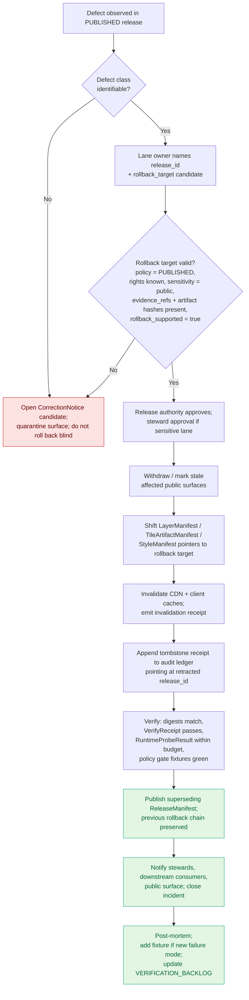

<!-- [KFM_META_BLOCK_V2]
doc_id: kfm://doc/runbook/roads-rail-trade/rollback
title: Roads / Rail / Trade Routes — Rollback Runbook
type: standard
version: v1
status: draft
owners: [Docs steward, Roads/Rail/Trade lane owner, Release authority]
created: 2026-05-12
updated: 2026-05-12
policy_label: public
related:
  - docs/doctrine/directory-rules.md
  - docs/doctrine/lifecycle-law.md
  - docs/architecture/correction-and-rollback.md
  - docs/domains/roads-rail-trade/README.md
  - docs/runbooks/governed_ai_ROLLBACK.md
  - docs/adr/ADR-0001-schema-home.md
  - release/candidates/roads-rail-trade/
  - data/receipts/README.md
  - data/proofs/README.md
  - schemas/contracts/v1/domains/roads-rail-trade/
tags: [kfm, runbook, rollback, roads-rail-trade, governance, release]
notes:
  - Doctrine is CONFIRMED from attached KFM corpus.
  - All path-shaped claims about *this repo* are PROPOSED until verified against mounted-repo evidence.
  - Placement follows Directory Rules §12 (Domain Placement Law) and the existing docs/runbooks/* convention.
[/KFM_META_BLOCK_V2] -->

<a id="top"></a>

# Roads / Rail / Trade Routes — Rollback Runbook

> **Reversible withdrawal and restoration of public-safe Roads, Rail, and Trade-Routes releases through the governed release path — pointer-shift, not file delete; audit-preserving, not memory-holing.**


<!-- TODO badges to verify: CI workflow badge for release/rollback drill; coverage of rollback fixtures. -->

| Field | Value |
|---|---|
| **Status** | draft |
| **Owners** | Docs steward · Roads/Rail/Trade lane owner · Release authority |
| **Reviewers required** | Release authority + lane owner; additional steward sign-off for Indigenous / cultural corridors |
| **Last updated** | 2026-05-12 |
| **Doctrine basis** | CONFIRMED — KFM domain atlas, encyclopedia, unified build manual, MapLibre master, Directory Rules |
| **Implementation basis** | PROPOSED — exact route names, schema homes, CI wiring, and deployed behavior remain `NEEDS VERIFICATION` |

---

## Table of contents

1. [Scope and non-scope](#1-scope-and-non-scope)
2. [Doctrine basis and truth labels](#2-doctrine-basis-and-truth-labels)
3. [When to run this runbook](#3-when-to-run-this-runbook)
4. [Preconditions](#4-preconditions)
5. [Roles and separation of duties](#5-roles-and-separation-of-duties)
6. [Rollback flow at a glance](#6-rollback-flow-at-a-glance)
7. [Procedure](#7-procedure)
8. [Roads / Rail / Trade-specific concerns](#8-roads--rail--trade-specific-concerns)
9. [Verification checklist](#9-verification-checklist)
10. [Failure modes and anti-patterns](#10-failure-modes-and-anti-patterns)
11. [Artifacts touched](#11-artifacts-touched)
12. [Appendix — receipt and manifest sketches](#12-appendix--receipt-and-manifest-sketches)
13. [Verification backlog](#13-verification-backlog)
14. [Related docs](#14-related-docs)

---

## 1. Scope and non-scope

This runbook governs **rollback of a published Roads / Rail / Trade-Routes release** — i.e., reversing a release that already cleared the publication gate and is now in `PUBLISHED` state.

**In scope.** Released road segments, rail segments, historic routes, trade-route corridors, depots, sidings, yards, crossings, bridges, ferries, river crossings, freight corridors, route events, operator-status records, access restrictions, network-edge / graph projections, `MovementStoryNode` exposures, and any released `LayerManifest`, `TileArtifactManifest`, `StyleManifest`, or `EvidenceDrawerPayload` whose source-of-truth lives in the Roads / Rail / Trade lane.

**Out of scope.**

- **Pre-publication retraction.** A defect found before `PUBLISHED` is a promotion gate failure handled by validation and review, not by this runbook. Send it back to `WORK / QUARANTINE`.
- **Settlements / Infrastructure canonical claims.** Settlement, depot identity, and infrastructure-ownership records are owned by Settlements/Infrastructure; rolling those back follows that lane's runbook.
- **Hydrology, Archaeology/Cultural Heritage, Hazards.** Crossings of river or sensitive cultural geometry that originate in those lanes follow their lane runbooks; this runbook only rolls back the *transport-side* derivative.
- **Emergency alerting.** KFM is never an alert authority. WZDx or live restriction feeds are governed evidence, not life-safety guidance. Redirect users to the official source.
- **Governed AI answers and Focus Mode.** `AIReceipt`-level retraction is handled by `docs/runbooks/governed_ai_ROLLBACK.md`. This runbook only rolls back the underlying domain release that an AI answer may have cited.

> [!NOTE]
> A rollback is a **governed state transition**, not a file move and not a delete. The rollback target is a *pointer to a prior `ReleaseManifest`, `root_hash`, and tile-checksum set*; the prior artifacts and the retracted artifacts both remain inspectable.

---

## 2. Doctrine basis and truth labels

| Claim | Label | Source |
|---|---|---|
| Lifecycle invariant `RAW → WORK / QUARANTINE → PROCESSED → CATALOG / TRIPLET → PUBLISHED` with promotion as a governed state transition | CONFIRMED | Directory Rules §0; Unified Build Manual §7; Encyclopedia |
| Released claims, layers, catalog records, artifacts, and AI answers MUST carry a visible correction path **and** rollback target before they are safely publishable | CONFIRMED | Unified Build Manual — Correction and rollback model |
| Rollback flow: identify affected release → locate prior safe artifact set → verify digests/manifests → disable or withdraw affected public surfaces → preserve audit receipts → mark stale or withdrawn UI state → restore or republish via the same governed release path | CONFIRMED doctrine | Unified Build Manual — Correction and rollback model |
| `ReleaseManifest` rollback target is **pointer-based** — tile variants are kept and lineage/catalog references shift back to a prior `tile_id` / `root_hash` set | CONFIRMED doctrine | Master MapLibre — ML-057-047, ML-058-031, ML-058-043, ML-058-044, ML-058-045 |
| Revocation is **not** deletion — a signed tombstone receipt is appended to the audit ledger; UI/API hide tombstoned items while lineage remains explorable | CONFIRMED doctrine | KFM Components — C5-09, C1-06, C6-08 |
| Roads / Rail / Trade rollback gate includes route-membership/designation separation, operator-status temporality, OSM/GNIS legal-status denial, historic-overprecision denial, public-generalization receipt, and transport-graph projection rollback | CONFIRMED doctrine | Domain Atlas — Roads, Rail, and Trade Routes §K |
| Indigenous trade and mobility corridors, oral history, treaty, cultural, and interpretive evidence default to steward review and generalized public geometry; critical transport facilities require review | CONFIRMED doctrine | Domain Atlas §I; Encyclopedia §7.11 |
| Cache invalidation (CDN/client) must accompany rollback or stale tiles can leak retracted content | CONFIRMED doctrine | Master MapLibre — Cache invalidation record; KFM Components C6-08 |
| Exact route names, schema homes, CI workflow names, governed API routes, and deployed behavior for this lane | UNKNOWN / NEEDS VERIFICATION | Domain Atlas §J, §N; Unified Build Manual §6.8 |

Memory is not evidence. Every implementation specific in this runbook (path, schema name, command, owner identity) is **PROPOSED** until verified against mounted-repo evidence.

---

## 3. When to run this runbook

A rollback is the correct response to a **defect class** discovered after publication. Other responses (forward-fix correction, supersession by next release, ABSTAIN) may apply in parallel; rollback is the path when **continued public exposure is the worse outcome**.

| Defect class | Rollback posture | Forward correction available? | Notes |
|---|---|---|---|
| **Evidence gap** — released claim no longer supported by an `EvidenceBundle` (source retracted, evidence invalidated, citation broken) | Restore prior evidence-supported release | Yes, if superseding evidence is admissible | `EvidenceBundle` outranks generated language; do not patch by paraphrase |
| **Source-role error** — OSM / GNIS / WZDx / KDOT row promoted to `authority` when it was `observation` or `context`; cattle-trail narrative promoted to surveyed alignment | Restore prior release; reclassify source-role at admission, not at promotion | No — role is fixed at admission | See Domain Atlas §K *route membership and designation separation* |
| **Rights / license defect** — feed license unknown, attribution missing, terms changed, ETag / `Last-Modified` provenance broken | Restore prior release; quarantine the offending source pending re-admission | Only after rights re-verified | WZDx and other transport feeds explicitly require license-from-feed proof |
| **Sensitivity / sovereignty defect** — Indigenous trade or mobility corridor exposed at precision, treaty / oral-history corridor exposed without steward review, sensitive cultural-route geometry leaked | **Roll back immediately**; notify cultural steward; generalize or suppress before any re-release | Only after steward review records `ALLOW` or `RESTRICT` with conditions | Default is **steward review + generalized public geometry** |
| **Geometry / precision defect** — historic alignment published at modern-survey precision; route narrative collapsed onto surveyed centerline; uncertainty class lost | Restore prior release with `GeneralizationReceipt`; fix uncertainty labeling | Yes, when uncertainty class can be re-stated | Historic overprecision is a named denial gate |
| **Temporal defect** — operator-status or route-event published with wrong valid-time / observed-time / retrieval-time; restriction-event valid window incorrect | Restore prior release; recompute temporal scope | Yes, if `valid_time` is the only field affected | Keep source / observed / valid / retrieval / release / correction times **distinct** |
| **Policy defect** — `policy_label = unknown`, `rights_status = unknown`, `sensitivity ≠ public`, missing `evidence_refs`, missing artifacts, or `rollback_supported = false` slipped through | Restore prior release; treat the missed gate as an incident | Forward-fix only after policy fixtures pass | Public runtime rule for `ReleaseManifest` is fail-closed |
| **Validation defect** — `ValidationReport` claimed pass under stale inputs; schema validation drifted; spec_hash mismatch | Restore prior release; re-run validators on deterministic inputs | Yes, if validators newly pass | Spec_hash and digest closure must hold |
| **Rendering defect** — tile root hash mismatch, `VerifyReceipt` failed digest / bounds / schema, `RuntimeProbeResult` exceeded budget after release | Shift tile lineage pointer to prior root_hash; invalidate caches | Yes, after rebuild | Tile variants are kept; pointers move |
| **API defect** — `RoadsRailDecisionEnvelope` returns wrong outcome class (e.g., `ANSWER` where doctrine requires `ABSTAIN`); layer manifest resolver returns non-public artifact | Withdraw the affected route surface; restore prior contract | Yes, after contract test passes | Finite outcomes must remain finite |
| **AI-output defect** — Focus Mode answer cites retracted Roads/Rail/Trade evidence | Roll back the **domain release first**; then follow `governed_ai_ROLLBACK.md` to retract the `AIReceipt` | Both | AI never root truth |

> [!IMPORTANT]
> If a defect involves **rights, sovereignty, cultural sensitivity, living-person data, archaeology, infrastructure precision, or rare / sensitive location exposure** — prefer **quarantine, redaction, generalization, staged access, delayed publication, or denial** over forward-fix. Roll back first; debate scope after the public surface is safe.

---

## 4. Preconditions

A rollback MUST NOT begin until each of the following is true. Use this as a checklist in the incident channel before the first state-changing command.

- [ ] **Affected release is identified.** A specific `release_id` (or set of `release_id`s) is named, with its `ReleaseManifest` digest and its `rollback_target`.
- [ ] **Rollback target exists and is valid.** The prior `ReleaseManifest` is fetchable, its artifact digests verify, its policy posture is `release_state = PUBLISHED`, `policy_label != unknown`, `rights_status != unknown`, `sensitivity == public`, and its `evidence_refs` and artifact hashes are present.
- [ ] **Defect class is named.** One or more rows from the table in §3 is selected; defect is recorded in the incident ledger.
- [ ] **Receipts are loadable.** `RunReceipt`, `ValidationReport`, `PolicyDecision`, `VerifyReceipt`, and the relevant `EvidenceBundle`s for both the affected release and the rollback target are accessible.
- [ ] **Audit ledger is writable.** A new tombstone / rollback record can be appended; the ledger is append-only and not in degraded mode.
- [ ] **Cache invalidation surfaces are reachable.** The CDN / tile-server / client cache invalidation hooks bound to the affected `LayerManifest` are responsive.
- [ ] **Separation of duties is satisfied.** The author of the affected release is **not** the sole approver of the rollback. Sensitive lanes require a cultural / rights steward in addition to the release authority.
- [ ] **Communication plan is staged.** Steward, downstream consumer, and public-surface notice messages are drafted (not yet sent).

> [!WARNING]
> If any precondition is missing — especially a valid rollback target — **do not roll back blind.** Withdraw the affected public surface with `ABSTAIN` / withdrawn-state UI markers, open a `CorrectionNotice` candidate, and escalate to release authority for a *new* governed release rather than a rollback.

---

## 5. Roles and separation of duties

Rollback is a release-class action. The roles below MUST be distinct people (or at minimum, distinct approval seats); a single actor MUST NOT both author and approve a rollback on a sensitive lane.

| Role | Responsibility |
|---|---|
| **Incident initiator** | Files the defect, names the defect class, opens the incident ticket. May be anyone with read access to the lane. |
| **Lane owner (Roads / Rail / Trade)** | Confirms defect class fits the lane, identifies the affected release, names the rollback target candidate. |
| **Release authority** | Approves the rollback, signs the new `ReleaseManifest` (rollback target re-asserted), authorizes cache invalidation. MUST be distinct from the release's original author for sensitive lanes. |
| **Cultural / rights steward** | Required when the defect touches Indigenous trade / mobility corridors, treaty corridors, oral-history geometry, archaeology adjacency, or living-person data. Approves or denies the rollback's exposure posture. |
| **Validator / proof reviewer** | Re-runs `ValidationReport`, `VerifyReceipt`, and the rollback drill fixture against the rollback target; signs the drill receipt. |
| **Communications steward** | Drafts and dispatches steward, downstream-consumer, and public-surface notices; records the notice references in the incident ledger. |
| **Auditor (post-hoc)** | Reviews the closed incident, the appended tombstone, the rollback receipt chain, and the post-mortem. |

> [!TIP]
> The watcher-as-non-publisher invariant still applies in rollback: a worker / watcher can **propose** a rollback candidate and emit receipts, but it MUST NOT execute the release-authority step. Automated rollback shortcuts that bypass this rule become the normal public path and harden into bypass authority.

---

## 6. Rollback flow at a glance



> [!NOTE]
> The diagram is a **doctrinal flow**. Concrete tool names, CLI commands, dashboard URLs, and CI job identifiers are `UNKNOWN` until verified against mounted-repo evidence.

---

## 7. Procedure

Each step lists: *who*, *what*, *evidence required*, and *exit condition*. Do not skip ahead. Stop at any step whose exit condition is not met and escalate.

### 7.1 Step 1 — Triage and classify

- **Who.** Incident initiator + lane owner.
- **What.** Confirm the surface is in `PUBLISHED` state. Name the affected `release_id`(s). Map the defect to one or more rows in §3.
- **Evidence required.** Current `ReleaseManifest`; the surface, drawer, or AI response that exposed the defect; any user / steward report.
- **Exit condition.** Defect class is named in the incident ticket; severity is set; sensitive-lane flag is set if applicable.

### 7.2 Step 2 — Identify and validate the rollback target

- **Who.** Lane owner + validator.
- **What.** Fetch the previous `ReleaseManifest` (or earlier, if the previous one is also affected). Re-verify against the public runtime rule:

  > A public client may consume a `ReleaseManifest` only when `release_state == PUBLISHED`, `policy_label != unknown`, `rights_status != unknown`, `sensitivity == public`, `evidence_refs` are present, artifact hashes are present, `rollback_supported == true`, and policy `allow == true`.

  Re-verify `EvidenceBundle` digests, `RunReceipt` lineage, and (for tile artifacts) `root_hash` / tile-checksum sets.
- **Evidence required.** Prior `ReleaseManifest`, its `RunReceipt`, its `ValidationReport`, its `EvidenceBundle` digests, its `VerifyReceipt`.
- **Exit condition.** A specific rollback target is named and passes the public-runtime rule. If no valid target exists, **escalate to a new governed release** rather than rolling back to an unverified manifest.

### 7.3 Step 3 — Approvals

- **Who.** Release authority; cultural / rights steward when sensitive-lane flag is set.
- **What.** Record approvals as `ReviewRecord` entries (`reviewer`, `role`, `decision = ALLOW`, `evidence_refs`, `policy_ref`, `time`).
- **Exit condition.** All required approvals are recorded and digitally identifiable. Author of the original release MUST NOT be the sole approver for sensitive lanes.

### 7.4 Step 4 — Withdraw or mark-stale the affected public surfaces

- **Who.** Release authority (or designated operator).
- **What.** Mark the affected `LayerManifest`, `TileArtifactManifest`, `StyleManifest`, Evidence Drawer payloads, Focus Mode answers, and any derived `MovementStoryNode` exposures as **stale / withdrawn** in the UI state. Public clients SHOULD see a stale-state badge before any pointer-shift completes.
- **Evidence required.** `AutomationBadgePayload` projection for trust-visible state; UI feature-flag or stale-state toggle.
- **Exit condition.** No public surface continues to advertise the retracted artifacts as authoritative.

### 7.5 Step 5 — Shift pointers to the rollback target

- **Who.** Release authority + tile / artifact maintainer.
- **What.** Shift the `LayerManifest`, `TileArtifactManifest`, and `StyleManifest` references back to the rollback target's `root_hash`, tile-checksum set, and `spec_hash`. **Do not delete tile variants.** Pointer-based rollback preserves both variants and keeps the audit trail explorable.
- **Evidence required.** Rollback target's tile digest set; spec_hash; signed manifest.
- **Exit condition.** Pointers resolve cleanly; no dangling references; the old set remains in the artifact store with a `superseded` marker, not a delete.

### 7.6 Step 6 — Invalidate caches

- **Who.** Release authority + ops.
- **What.** Trigger CDN purge / cache invalidation for the affected tile URLs and version-specific routes. Emit a **cache invalidation receipt**.
- **Evidence required.** Cache-key list from the affected `ReleaseManifest`; invalidation receipt schema.
- **Exit condition.** No stale tile may be reissued from cache; the invalidation receipt is appended to the audit ledger.

> [!CAUTION]
> Skipping cache invalidation makes the rollback partial. Stale PMTiles / vector-tile fragments can survive in CDN and client caches, leaking retracted content. The C6-08 doctrine is explicit: **revocation that does not invalidate caches is incomplete.**

### 7.7 Step 7 — Tombstone the retracted release

- **Who.** Release authority.
- **What.** Append a signed tombstone receipt to the audit ledger. The tombstone points at the retracted `release_id`, records the defect class and reason, names the supersession reference (rollback target or future superseding release), and is signed by the release authority. UI and API filters thereafter hide the tombstoned items from public views; lineage and audit views remain explorable.
- **Evidence required.** Tombstone schema; ledger append succeeds; signature verifies.
- **Exit condition.** A `run_receipt.tombstone.json` (or equivalent named tombstone artifact) is appended and discoverable through the audit surface.

### 7.8 Step 8 — Verify

- **Who.** Validator / proof reviewer.
- **What.** Run the rollback drill fixture:

  1. Verify the previous `ReleaseManifest` resolves and its digests match.
  2. Verify the tile digest set matches the rollback target's manifest.
  3. Run `VerifyReceipt` (digest_verified, bounds_verified, schema_verified) on at least one representative tile of each affected layer.
  4. Run `RuntimeProbeResult` against the renderer / tile budget for the rollback target's tileset.
  5. Run the OPA / Rego release-manifest policy fixture against the new superseding `ReleaseManifest`.
  6. Run Roads / Rail / Trade lane-specific fixtures: route-membership/designation separation, OSM/GNIS legal-status denial, historic-overprecision denial, public-generalization receipt presence, transport-graph projection rollback.

- **Evidence required.** Green test results; signed `VerifyReceipt`; signed `ValidationReport`; signed `PolicyDecision = allow`.
- **Exit condition.** All fixtures pass deterministically. Any failure here aborts the rollback and either escalates to a different rollback target or to a new governed release.

### 7.9 Step 9 — Publish the superseding ReleaseManifest

- **Who.** Release authority.
- **What.** Publish a new `ReleaseManifest` that records the rollback chain: it identifies the retracted release, the rollback target, the defect class, and re-asserts a valid `rollback_target` for the new release itself.
- **Evidence required.** New `ReleaseManifest` passes the public runtime rule; `evidence_refs` resolve; artifact hashes verify; `rollback_supported = true`.
- **Exit condition.** Public surfaces and governed API begin resolving to the superseding manifest; finite outcomes (`ANSWER` / `ABSTAIN` / `DENY` / `ERROR`) remain coherent.

### 7.10 Step 10 — Communicate

- **Who.** Communications steward.
- **What.** Send notices in this order: cultural / rights stewards (if sensitive-lane), internal downstream consumers, public surface (release notes, stale-state banner, correction page). Record each notice's reference in the incident ledger.
- **Evidence required.** Notice templates; recipient list; transmission timestamps.
- **Exit condition.** All notices sent and acknowledged where acknowledgment is required.

### 7.11 Step 11 — Post-mortem and backlog

- **Who.** Auditor + lane owner.
- **What.** Within one working week: write a post-mortem (Friday check-in pattern), add or strengthen a fixture for the failure mode, record any new verification items in `docs/registers/VERIFICATION_BACKLOG.md`, and update `docs/registers/DRIFT_REGISTER.md` if the defect revealed structural drift.
- **Evidence required.** Post-mortem document; new fixture PR(s); register entries.
- **Exit condition.** Incident closed; lineage preserved; next-time path narrower than this-time path.

---

## 8. Roads / Rail / Trade-specific concerns

These are doctrinal carve-outs the lane MUST respect during rollback. Each is **CONFIRMED doctrine / PROPOSED implementation** unless otherwise noted.

### 8.1 Indigenous trade and mobility corridors

Indigenous trade and mobility corridors, oral-history corridors, treaty corridors, and culturally interpretive evidence default to **steward review + generalized public geometry**. A rollback that involves any of these MUST include a cultural / rights steward in the approval chain (§5) and MUST NOT republish at finer precision than the steward authorizes — even when the rollback target's original release used finer precision. If the rollback target itself violates this rule, escalate to a **forward-fix governed release** instead.

### 8.2 Historic route claims vs. surveyed alignment

Historic routes (wagon, military, mail, emigrant, stage, cattle, trade) are **claims with uncertainty**, not surveyed alignments. A rollback that restores a release where claim and surveyed centerline were collapsed is itself defective; the rollback target must carry a `GeneralizationReceipt` and explicit uncertainty class. Historic overprecision is a named denial gate — restoring overprecision is not a valid rollback.

### 8.3 OSM / GNIS legal-status denial

OSM and GNIS rows are typically `observation` or `context` for the lane's purposes, not `authority`. A rollback that re-asserts OSM- or GNIS-derived rows as `authority` for legal road / rail designations re-triggers the source-role denial gate. Source role is **fixed at admission** and MUST NOT be promoted by rollback.

### 8.4 WZDx and live transport feeds

Work-zone (WZDx) and other live transport feeds carry license terms, ETag / `Last-Modified` provenance, and Indigenous-sovereignty checks at admission. A rollback that restores a release built on a feed snapshot whose license, attribution, or provenance is now broken MUST quarantine the feed at admission before re-publication, even if the prior `ReleaseManifest` passed at its time.

### 8.5 Critical transport facilities

Bridges, ferries, river crossings, depots, sidings, yards, and other facilities classified as **critical infrastructure** require review before public exposure of precise geometry, condition, or inspection detail. A rollback that re-exposes precise critical-facility geometry without current review records MUST instead republish at generalized geometry with a `GeneralizationReceipt`.

### 8.6 Network-edge / graph projections

Routing graphs, traversal graphs, and network-edge projections are **derived artifacts**, not canonical records. A rollback restores graph projections only through the rollback target's manifest; it MUST NOT promote a graph projection back to canonical-record status, and MUST NOT let a routing graph become the public surface in place of the evidence-bearing layer.

### 8.7 Operator-status and route-event temporality

`OperatorStatus` and `RouteEvent` are temporal. A rollback MUST preserve the distinct time fields — source, observed, valid, retrieval, release, correction — and MUST NOT collapse `valid_time` with `observed_time` to make a rollback look cleaner.

### 8.8 Consent-bound and PII-adjacent overlays

Where a transport surface intersects a consent-bound overlay (e.g., a historical-mobility narrative tied to identifiable individuals), the consent metadata pointer-only pattern applies: no raw PII in tiles or artifacts, render-time consent verification, fail-closed on revoked / expired / missing proof. A rollback that re-exposes a previously consent-blocked surface is a defect, not a recovery.

---

## 9. Verification checklist

Run through this list before declaring the rollback complete. Every line must be checkable from a receipt or fixture; "looks fine" is not a check.

- [ ] Defect class is named and recorded in the incident ledger.
- [ ] Affected `release_id` is named; current `ReleaseManifest` and its digests are captured.
- [ ] Rollback target is named; its `ReleaseManifest` passes the public runtime rule.
- [ ] Approvals recorded as `ReviewRecord`s with distinct author and approver where the lane is sensitive.
- [ ] Affected public surfaces show stale / withdrawn state **before** pointer shift.
- [ ] `LayerManifest`, `TileArtifactManifest`, and `StyleManifest` pointers shifted to rollback target.
- [ ] Tile variants preserved in artifact store (pointer rollback, not delete).
- [ ] CDN and client cache invalidations issued; invalidation receipt appended.
- [ ] Tombstone receipt appended to audit ledger; signed and discoverable.
- [ ] `VerifyReceipt` passes (digest_verified, bounds_verified, schema_verified).
- [ ] `RuntimeProbeResult` within budget.
- [ ] OPA / Rego release-manifest policy fixture passes against superseding manifest.
- [ ] Roads / Rail / Trade fixtures pass: route-membership/designation, operator-status temporality, OSM/GNIS legal-status denial, historic-overprecision denial, generalization receipt, transport-graph rollback.
- [ ] If sensitive-lane: steward approval recorded; generalization posture intact.
- [ ] Superseding `ReleaseManifest` published; `rollback_target` re-asserted; finite outcomes coherent.
- [ ] Notices sent (steward, downstream, public) and recorded.
- [ ] Post-mortem scheduled; fixture / backlog updates filed.

---

## 10. Failure modes and anti-patterns

> [!WARNING]
> Each row below is a way a Roads / Rail / Trade rollback can quietly fail. Every one is recoverable, but only if it's named. If the runbook starts feeling clean and the ledger is silent, suspect one of these.

| Failure mode | What goes wrong | Counter-rule |
|---|---|---|
| **Delete-as-rollback** | Tile artifacts and receipts removed instead of pointers shifted; lineage is destroyed. | Pointer-shift only. Old variants remain in the artifact store with a superseded marker. |
| **Cache-stale leak** | Pointers shifted, but CDN / client caches keep serving retracted PMTiles. | Issue invalidation receipt; verify cache-purge before declaring complete. |
| **Hidden author-approver collapse** | The author of the affected release is also the rollback approver. | Separation of duties (§5); sensitive lanes require a steward in addition. |
| **Rollback to an unsafe target** | Target's `policy_label`, `rights_status`, or `sensitivity` is unknown or non-public. | Verify the public runtime rule against the target before approval. |
| **Tombstone-as-delete** | Tombstone written but item is also hard-deleted; explainability lost. | Tombstone preserves the retracted run_id; hard delete violates audit. |
| **Forward-fix masquerading as rollback** | New release pushed without an explicit rollback chain; treated as "a new version". | Rollback chain must be recorded in the superseding `ReleaseManifest`. |
| **Indigenous corridor re-exposure** | Rollback target predates current steward review; restoring it re-exposes generalized-only geometry at precision. | Steward approval is mandatory for sensitive lanes; honor the **current** generalization posture, not the original. |
| **OSM/GNIS role promotion at rollback** | Rollback restores a release where OSM / GNIS rows were `authority`. | Source role is fixed at admission; rollback cannot upgrade it. |
| **Historic overprecision restoration** | Rollback target collapses claim onto surveyed centerline. | Historic overprecision denial gate applies to rollback targets too. |
| **Watcher self-rollback** | A worker / watcher rolls back without release-authority sign-off. | Watcher-as-non-publisher; workers emit candidates and receipts only. |
| **Graph-projection promotion** | Routing graph becomes the public surface during rollback. | Graph projections remain derived; canonical records carry truth. |
| **Cache-only rollback** | Tile pointer shifted but graph-projection / Evidence Drawer caches not invalidated. | Invalidate every cache layer tied to the affected `LayerManifest`. |
| **AI receipt drift** | Domain rolled back, but Focus Mode `AIReceipt`s still cite retracted evidence. | Trigger `governed_ai_ROLLBACK.md` after the domain rollback completes. |
| **Silent admin-shortcut rollback** | An admin / infra path performs the rollback outside the governed release path. | Admin shortcuts MUST stay off the normal public path; rollback runs through the governed release path. |

---

## 11. Artifacts touched

The artifacts below are the doctrinal touch-points of a Roads / Rail / Trade rollback. Concrete paths are **PROPOSED** until verified against mounted-repo evidence; the responsibility roots follow Directory Rules.

| Artifact | Responsibility root (PROPOSED) | Role in rollback |
|---|---|---|
| `ReleaseManifest` (retracted + rollback target + superseding) | `release/candidates/roads-rail-trade/` → `release/published/...` | Binds tiles, evidence, policy, sensitivity, receipts, rollback, correction lineage, spec_hash, attestations. |
| `RunReceipt` | `data/receipts/roads-rail-trade/` | Build / run provenance; inputs, config / spec hash, artifact digests, source_head, attestations. |
| `ValidationReport` | `data/receipts/roads-rail-trade/` or `data/proofs/roads-rail-trade/` | Validator outcome under deterministic inputs. |
| `PolicyDecision` | `data/proofs/roads-rail-trade/` | Rego / OPA decision on the superseding manifest. |
| `VerifyReceipt` | `data/proofs/roads-rail-trade/` | Runtime verification of tile activation: digest / bounds / schema. |
| `RuntimeProbeResult` | `data/proofs/roads-rail-trade/` | Renderer / tile budget pass-fail. |
| `EvidenceBundle` | `data/catalog/roads-rail-trade/` | Admissible evidence object resolved from `EvidenceRef`; outranks maps and tiles. |
| `EvidenceDrawerPayload` | `data/published/layers/roads-rail-trade/` (governed projection) | Governed UI projection; must reflect stale / withdrawn state during rollback. |
| `LayerManifest`, `TileArtifactManifest`, `StyleManifest` | `data/published/layers/roads-rail-trade/` (governed projection) | Pointer-shift target; tile variants kept. |
| `CorrectionNotice` | `release/corrections/roads-rail-trade/` | Records the defect and the invalidated derivatives. |
| `RollbackCard` / tombstone receipt | `data/receipts/roads-rail-trade/` or audit ledger | Signed retraction marker pointing at retracted `release_id`. |
| `ReviewRecord` | `data/receipts/roads-rail-trade/` | Approvals (lane owner, release authority, steward, validator). |
| Schema home | `schemas/contracts/v1/domains/roads-rail-trade/` per ADR-0001 | Shape for envelopes, manifests, receipts. PROPOSED; verify with Directory Rules and ADR. |
| Policy home | `policy/domains/roads-rail-trade/` | Release / sensitivity / source-role denial rules. |
| Fixtures | `fixtures/domains/roads-rail-trade/` and `tests/domains/roads-rail-trade/` | Rollback drill, generalization receipt, historic-overprecision denial, OSM/GNIS legal-status denial, transport-graph rollback. |
| Audit ledger | `data/AUDIT/receipts/YYYY/MM/...` or OCI evidence registry (per C1-06; backend ADR pending) | Append-only; tombstones live here. |

---

## 12. Appendix — receipt and manifest sketches

> [!NOTE]
> The shapes below are **illustrative sketches** drawn from doctrinal language. Exact field names, types, and the canonical schema home for Roads / Rail / Trade are **PROPOSED** and depend on `schemas/contracts/v1/domains/roads-rail-trade/` content, which is `NEEDS VERIFICATION`.

<details>
<summary><strong>A. Tombstone receipt — illustrative shape</strong></summary>

```json
{
  "object_type": "RollbackTombstone",
  "version": "v1-PROPOSED",
  "retracted_release_id": "rrt-release-2026-04-22-xyz",
  "rollback_target_release_id": "rrt-release-2026-04-15-abc",
  "defect_class": "sensitivity-corridor-exposure",
  "defect_summary": "Historic mobility corridor exposed at precision finer than steward authorization.",
  "supersession_ref": "rrt-release-2026-05-12-def",
  "approvals": [
    { "reviewer": "release-authority/<id>", "role": "release_authority", "decision": "ALLOW", "time": "2026-05-12T12:34:00Z" },
    { "reviewer": "cultural-steward/<id>",  "role": "rights_steward",    "decision": "ALLOW", "time": "2026-05-12T12:30:00Z" }
  ],
  "signature": { "alg": "cosign-keyless", "keyid": "cosign://fulcio/<issuer>", "sig": "<base64>" },
  "time": "2026-05-12T12:35:00Z"
}
```

</details>

<details>
<summary><strong>B. Public runtime rule for ReleaseManifest — doctrinal restatement</strong></summary>

A public client may consume a `ReleaseManifest` only when **all** of the following hold:

- `release_state == PUBLISHED`
- `policy_label != "unknown"`
- `rights_status != "unknown"`
- `sensitivity == "public"`
- `evidence_refs` are present and resolve
- artifact hashes are present and verify
- `rollback.rollback_supported == true`
- policy `allow == true`

This rule applies to **both** the original release and the superseding rollback release. If the rollback target itself does not satisfy this rule, the rollback is unsafe and must be replaced by a forward-fix governed release.

</details>

<details>
<summary><strong>C. Roads / Rail / Trade rollback drill — fixture checklist</strong></summary>

The rollback drill fixture validates:

1. Previous `ReleaseManifest` resolves; digests match.
2. Tile digest set matches rollback target's manifest.
3. `VerifyReceipt` digest_verified / bounds_verified / schema_verified all pass for a representative tile per affected layer.
4. `RuntimeProbeResult` decode, hash, heap, and token-latency budgets pass on the device-profile under test.
5. OPA / Rego `release_manifest.rego` denies an unknown policy_label, unknown rights_status, non-public sensitivity, missing evidence_refs, missing artifacts, and unsupported rollback — i.e., fail-closed under each negative case.
6. Roads / Rail / Trade lane fixtures:
   - Route-membership and designation separation.
   - Operator-status / route-event temporal separation.
   - OSM / GNIS legal-status denial.
   - Historic overprecision denial.
   - Public generalization receipt presence.
   - Transport-graph projection rollback.

PROPOSED locations: `tests/domains/roads-rail-trade/rollback/` and `fixtures/domains/roads-rail-trade/rollback/`. NEEDS VERIFICATION against mounted-repo evidence.

</details>

<details>
<summary><strong>D. Defect-class → posture quick-card</strong></summary>

| Defect | First action | Rollback? | Forward-fix? |
|---|---|---|---|
| Evidence gap | Withdraw surface; open `CorrectionNotice` | Yes | If new evidence admissible |
| Source-role error | Reclassify at admission | Yes | No — role is fixed at admission |
| Rights / license | Quarantine source | Yes | After rights re-verified |
| Sensitivity / sovereignty | Steward; generalize | **Yes — immediately** | After steward `ALLOW` |
| Geometry overprecision | Add `GeneralizationReceipt` | Yes | Yes |
| Temporal error | Recompute scope | Yes | Yes |
| Policy gate slip | Treat as incident | Yes | After fixtures pass |
| Validation drift | Re-run validators | Yes | Yes |
| Rendering / tile drift | Shift root_hash pointer | Yes | Yes |
| API contract drift | Withdraw route | Yes | After contract test |
| AI cite-of-retracted | Domain rollback first; then AI rollback | Yes | After domain rollback |

</details>

---

## 13. Verification backlog

The items below are `NEEDS VERIFICATION` until mounted-repo evidence is inspected. Each is parked here rather than asserted in the body of the runbook.

| Item | Evidence that would settle it | Status |
|---|---|---|
| Exact governed-API route for Roads / Rail / Trade resolvers (e.g., feature/detail, layer manifest, Evidence Drawer payload, Focus Mode) | `apps/governed-api/` route table; OpenAPI / contract tests | NEEDS VERIFICATION |
| Schema home for `RoadsRailDecisionEnvelope`, `LayerManifest`, `TileArtifactManifest`, `StyleManifest`, `ReleaseManifest`, receipts | `schemas/contracts/v1/domains/roads-rail-trade/` directory contents; ADR-0001 alignment | NEEDS VERIFICATION |
| CI workflow that enforces the rollback drill on every release PR | `.github/workflows/*` | NEEDS VERIFICATION |
| Audit ledger backend choice (filesystem vs OCI vs both) | Accepted ADR; tooling presence | UNKNOWN |
| Cache invalidation surfaces (CDN, tile server, client) and their receipt schema | `infra/` config; invalidation receipt schema | NEEDS VERIFICATION |
| Identity of release authority and lane owner for Roads / Rail / Trade | `CODEOWNERS`; lane README | NEEDS VERIFICATION |
| Cultural / rights steward roster and contact path for sensitive-lane approvals | `docs/governance/stewards.md` (PROPOSED) | UNKNOWN |
| Whether `docs/runbooks/<domain>/<NAME>_RUNBOOK.md` is the agreed runbook subdirectory pattern, or whether the flat `docs/runbooks/<domain>_<NAME>.md` form is preferred | `docs/runbooks/README.md` (PROPOSED) or an accepted ADR on runbook structure | NEEDS VERIFICATION |
| Whether prior released artifacts must remain hot-fetchable or may move to cold-store while pointers shift | Operational ADR; infra retention policy | NEEDS VERIFICATION |
| Drift register and verification backlog files exist and are linked | `docs/registers/DRIFT_REGISTER.md`, `docs/registers/VERIFICATION_BACKLOG.md` | NEEDS VERIFICATION |

---

## 14. Related docs

- [`docs/doctrine/directory-rules.md`](../../doctrine/directory-rules.md) — Domain Placement Law (§12), responsibility roots, anti-patterns.
- [`docs/doctrine/lifecycle-law.md`](../../doctrine/lifecycle-law.md) — `RAW → … → PUBLISHED`; promotion as governed state transition.
- [`docs/doctrine/trust-membrane.md`](../../doctrine/trust-membrane.md) — public clients use governed APIs; never canonical / internal stores.
- [`docs/architecture/correction-and-rollback.md`](../../architecture/correction-and-rollback.md) — corpus-level rollback and correction model. *(PROPOSED home; verify against repo.)*
- [`docs/domains/roads-rail-trade/README.md`](../../domains/roads-rail-trade/README.md) — lane scope, ubiquitous language, object families, sensitivity posture. *(PROPOSED home.)*
- [`docs/runbooks/governed_ai_ROLLBACK.md`](../governed_ai_ROLLBACK.md) — AI adapter rollback and kill switch; trigger after a domain rollback that retracted cited evidence.
- [`docs/runbooks/ui_ROLLBACK.md`](../ui_ROLLBACK.md) — UI rollback, feature flag, and schema-deprecation steps for any shell-level changes that accompany a domain rollback.
- [`docs/adr/ADR-0001-schema-home.md`](../../adr/ADR-0001-schema-home.md) — canonical schema home (`schemas/contracts/v1/...`). *(PROPOSED id; verify.)*
- [`release/candidates/roads-rail-trade/`](../../../release/candidates/roads-rail-trade/) — release candidates and rollback targets for this lane.
- [`data/receipts/README.md`](../../../data/receipts/README.md) and [`data/proofs/README.md`](../../../data/proofs/README.md) — proof and receipt homes.

---

<sub>**Last updated:** 2026-05-12 · **Doc id:** `kfm://doc/runbook/roads-rail-trade/rollback` · **Status:** draft · [Back to top ↑](#top)</sub>
