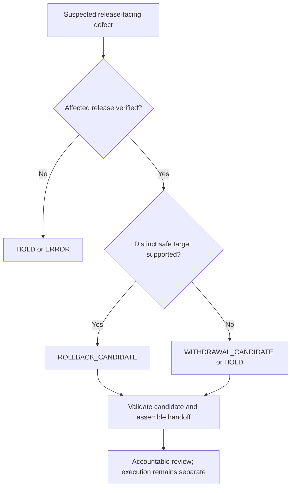

<!-- [KFM_META_BLOCK_V2]
doc_id: kfm://doc/runbook/roads-rail-trade/rollback
title: Roads, Rail, and Trade Rollback Preflight Runbook
type: runbook
version: v2.0
prior_state: proposal-heavy operational rollback procedure with unverified release records, commands, owners, invalidation surfaces, and public runtime behavior
status: draft; repository-grounded; ROLLBACK_CANDIDATE_PREFLIGHT_ONLY; OPERATIONAL_ROLLBACK_HELD; NON_RELEASE; NON_DEPLOYMENT; NON_PROMOTION; NON_PUBLICATION
owners:
  - "@bartytime4life — verified GitHub review route"
  - "NEEDS VERIFICATION — accountable Roads/Rail/Trade, release, rollback, evidence, policy, rights, sensitivity, correction, operations, and communications assignments"
created: 2026-05-12
updated: 2026-08-29
policy_label: repository-facing; infrastructure-sensitive; historic and cultural corridor precision-sensitive; fail-closed
current_path: docs/runbooks/roads-rail-trade/ROLLBACK_RUNBOOK.md
owning_root: docs/
responsibility: human rollback-candidate preflight and accountable-review handoff for the Roads/Rail/Trade lane
truth_posture: cite-or-abstain
authority_class: explanatory operational documentation
authority_rank: subordinate to accepted doctrine and ADRs, contracts, schemas, source records, evidence, policy, review, release, correction, rollback, and official authorities
evidence_snapshot:
  repository: bartytime4life/Kansas-Frontier-Matrix
  base_ref: main
  base_commit: 702d61158d601ab12ef3c7b4d5e83fd0636ae9d5
  target_before_update_blob: a097a2aa95bda465227a4103aa5da7416a72622d
  lane_readme_blob: 964d3f7ec2409d01b1cd40fd84403a69f5950b56
  promotion_runbook_blob: 3425d1d64994861ee98acdfbcff0c9a6b3b39c22
  no_network_runbook_blob: 0f35d67dda52c89086c76e18a551ea8687f63d9d
  domain_workflow_blob: 391fead3fdd0d7ecead6464be7946cbaf68247e0
  candidate_lane_readme_blob: c989bf2bed10472bc46a168231b2269f17bbda48
  rollback_card_lane_readme_blob: 1ddc6fb9da9bf415984f2a3de3c1bf839e38334f
  rollback_card_contract_blob: c6d3c35c56b064e04c3a2532f4709d938d7b0c1a
  rollback_card_schema_blob: e0a9edf02dd5d6997eda60a054a5bf19636c3dd4
  rollback_card_validator_blob: 9e9ed5a92851935b41a36698e4bead13ef4edf57
  rollback_card_tests_blob: c8aeac6348127fb768981e2b5b5588c6a7bdeb78
  synthetic_rehearsal_helper_blob: a8f6bff350e79b453f425ebce9a9ded6801f8944
  synthetic_rehearsal_tests_blob: b644ca6c4185b3f81bc339c077eae85299833261
  rollback_drill_workflow_blob: 2d0c39fc6ff8e44bd9cf753ce546475079e8ffd5
  data_rollback_readme_blob: b3150170a870a64ad459ef8eb2b256e1bff8bd16
  directory_rules_blob: fd49a0b83e55cef52c1124281f093e263526898d
  candidate_records_observed: 0
  roads_rail_trade_rollback_card_instances_observed: 0
  roads_rail_trade_operational_rollback_profiles_observed: 0
related:
  - ./README.md
  - ./PROMOTION_RUNBOOK.md
  - ./NO_NETWORK_TEST_RUNBOOK.md
  - ../../domains/roads-rail-trade/README.md
  - ../../doctrine/directory-rules.md
  - ../../doctrine/lifecycle-law.md
  - ../../doctrine/trust-membrane.md
  - ../../adr/ADR-0029-adopt-directory-governance-standard-v2.md
  - ../../../contracts/release/rollback_card.md
  - ../../../schemas/contracts/v1/release/rollback_card.schema.json
  - ../../../fixtures/release/rollback_card/
  - ../../../tools/validators/release/validate_rollback_card.py
  - ../../../tests/validators/test_validate_rollback_card.py
  - ../../../tools/release/rollback_apply.py
  - ../../../tests/release/test_synthetic_rollback_rehearsal.py
  - ../../../release/rollback_cards/roads-rail-trade/README.md
  - ../../../release/candidates/roads-rail-trade/README.md
  - ../../../data/rollback/README.md
  - ../../../.github/workflows/rollback-drill.yml
  - ../../../.github/workflows/domain-roads-rail-trade.yml
notes:
  - "v2.0 replaces proposal-era production steps with a current-repository rollback-candidate preflight and accountable-review handoff."
  - "The generic RollbackCard profile is PROPOSED, fixture-first, and non-executing; a pass proves candidate shape and local consistency only."
  - "The generic rollback helper is marker-protected and synthetic-only; its plan or apply result is not Roads/Rail/Trade or production recovery proof."
  - "No Roads/Rail/Trade release, rollback target, rollback-card instance, domain rehearsal, production pipeline, invalidation executor, authenticated authority, or public-state mutation path was established."
  - "This document does not execute rollback, withdraw a release, mutate an alias, invalidate a cache, create a decision, release, deploy, promote, or publish."
[/KFM_META_BLOCK_V2] -->

<a id="top"></a>

# Roads, Rail, and Trade Rollback Preflight Runbook

Use this runbook to classify a suspected release-facing Roads/Rail/Trade defect,
freeze the exact evidence, prepare a non-executing `RollbackCard` candidate,
validate the repository's bounded control surfaces, and hand the packet to
accountable reviewers.

> [!WARNING]
> KFM is not a navigation, dispatch, traffic-control, railroad-operating,
> bridge-safety, emergency-routing, legal-access, right-of-way, regulatory, or
> current-closure authority. If public material could be mistaken for current
> safe-passage, legal-access, infrastructure-condition, or emergency guidance,
> notify the official authority and the accountable KFM release operator. Do
> not improvise a production rollback from this document.

> [!IMPORTANT]
> **Current result: `HOLD`.** The repository can validate the shape and local
> consistency of a proposed `RollbackCard` and can rehearse a generic synthetic
> alias change in a marker-protected temporary workspace. It does not establish
> a Roads/Rail/Trade release, prior safe target, domain rollback fixture,
> production rollback pipeline, invalidation executor, authenticated release
> authority, or public mutation path.

**Quick navigation:** [goal](#1-goal-and-scope) ·
[current state](#3-current-repository-disposition) ·
[outcomes](#4-finite-outcomes) · [procedure](#7-preflight-procedure) ·
[validation](#9-repository-native-validation) ·
[handoff](#11-accountable-review-handoff) ·
[stop conditions](#12-mandatory-stop-conditions) ·
[maintenance](#16-runbook-maintenance-and-documentation-rollback)

## 1. Goal and scope

This runbook governs **preflight before a possible rollback or withdrawal** of a
release-facing Roads/Rail/Trade record. It does not perform that transition.

### In scope

- identifying the exact affected release reference and inspected commit;
- classifying a public-facing defect without exposing restricted detail;
- deciding whether the bounded candidate disposition is
  `ROLLBACK_CANDIDATE`, `WITHDRAWAL_CANDIDATE`, `HOLD`, or `ERROR`;
- binding a distinct prior target when admissible evidence supports one;
- inventorying evidence, policy, review, correction, invalidation,
  restoration, timing, and lineage references;
- validating a proposed `RollbackCard` against the repository's proposed
  release contract, schema, validator, and fixtures;
- replaying generic synthetic and `CorridorRoute` regression checks without
  treating them as operational proof; and
- producing a reference-only packet for accountable review.

### Out of scope

- retrieving or activating live transport sources;
- deciding that a road, rail line, bridge, crossing, ferry, facility, route,
  restriction, or corridor is open, safe, passable, lawful, or current;
- creating or changing route, segment, membership, operator, restriction,
  legal-status, alignment, graph, or facility truth;
- changing RAW, WORK, QUARANTINE, PROCESSED, CATALOG/TRIPLET, PUBLISHED,
  receipt, proof, release, correction, or rollback state;
- running `tools/release/rollback_apply.py` against real, external, published,
  or non-synthetic data;
- mutating an alias, cache, index, catalog, tile, graph, API, UI, deployment, or
  public carrier;
- authenticating reviewers or issuing an operational policy/release decision;
  and
- releasing, deploying, promoting, publishing, or executing rollback.

## 2. Authority and terminal boundary

Accepted [ADR-0029](../../adr/ADR-0029-adopt-directory-governance-standard-v2.md)
adopts the [Directory Rules](../../doctrine/directory-rules.md). Those rules
place human operational procedures under `docs/runbooks/`, release-governance
records under `release/`, and data-plane recovery support under
`data/rollback/` while preserving each authority boundary.

This file explains a human procedure. It is not a `RollbackCard`, release
manifest, policy decision, review record, correction notice, withdrawal notice,
invalidation receipt, proof, signature, published carrier, or rollback command.
Path placement and a green check do not create truth or authority.

The highest result this runbook may produce is:

```text
READY_FOR_ACCOUNTABLE_ROLLBACK_REVIEW
```

That result means the candidate packet is coherent enough for separately
authenticated reviewers. It does not mean `APPROVED`, `ROLLED_BACK`,
`WITHDRAWN`, `RELEASED`, `DEPLOYED`, `PROMOTED`, or `PUBLISHED`.

## 3. Current repository disposition

The following evidence is bound to the commit and blobs in the metadata block.
Re-inspect after any relevant repository change.

| Surface | Current evidence | Bounded conclusion |
|---|---|---|
| Runbook path | This file exists below `docs/runbooks/roads-rail-trade/` | **CONFIRMED.** Same-path replacement preserves the established documentation home. |
| Domain release candidate | `release/candidates/roads-rail-trade/` contains guidance but no candidate record was observed | **ABSENT / HOLD.** There is no candidate or manifest handoff to reverse. |
| Domain rollback-card lane | `release/rollback_cards/roads-rail-trade/README.md` exists; no card instance was observed | **DRAFT GUIDANCE / HOLD.** No domain rollback candidate is established. |
| Generic `RollbackCard` profile | Proposed contract, closed schema, three valid fixtures, six invalid fixtures, validator, and focused tests exist | **EXECUTABLE / NON-EXECUTING.** A pass proves candidate shape and local consistency only. |
| Generic synthetic rehearsal | `tools/release/rollback_apply.py` requires a synthetic marker and `synthetic: true`; eight focused tests exercise plan, apply, preservation, and denials | **EXECUTABLE / SYNTHETIC-ONLY.** It cannot establish a Roads/Rail/Trade or production rollback. |
| Rollback workflow | `.github/workflows/rollback-drill.yml` has read-only contents permission and confirms current holds | **READ-ONLY READINESS CHECK.** It emits no target, card, receipt, proof, signature, alias change, invalidation, release transition, or publication. |
| Production rollback pipeline | The rollback workflow asserts `pipelines/rollback/main.py` remains the exact greenfield placeholder | **ABSENT / HOLD.** No production executor is established. |
| Roads/Rail/Trade validation | One synthetic no-network `CorridorRoute` contract/schema/fixture/validator profile exists | **BOUNDED REGRESSION EVIDENCE.** It does not prove a release, target, evidence closure, policy decision, or rollback. |
| Proof and policy | The domain workflow and lane docs keep broader proof production, policy runtime, and release dry-run on hold | **PARTIAL / HOLD.** Presence of files is not candidate-bound closure. |
| Review routing | `CODEOWNERS` routes repository review to `@bartytime4life` | **CONFIRMED ROUTE / INSUFFICIENT AUTHORITY.** Routing is not domain, rights-holder, sensitivity, rollback, or release approval. |
| Operational rollback | No affected release, distinct safe target, domain rehearsal, executor, invalidation integration, authenticated authority, or public mutation path was established | **UNKNOWN / HOLD.** Do not execute a lifecycle or public-state transition. |

### Current finite result

```yaml
work_state: HOLD
reason_codes:
  - RRT_AFFECTED_RELEASE_UNESTABLISHED
  - RRT_PRIOR_SAFE_TARGET_UNESTABLISHED
  - RRT_ROLLBACK_CARD_INSTANCE_ABSENT
  - RRT_DOMAIN_REHEARSAL_ABSENT
  - RRT_OPERATIONAL_EXECUTOR_ABSENT
  - RRT_INVALIDATION_INTEGRATION_UNVERIFIED
  - RRT_ACCOUNTABLE_ROLLBACK_AUTHORITY_UNVERIFIED
terminal_boundary: ACCOUNTABLE_ROLLBACK_REVIEW_HANDOFF_ONLY
rollback_execution: NOT_PERFORMED
release: NOT_PERFORMED
deployment: NOT_PERFORMED
promotion: NOT_PERFORMED
publication: NOT_PERFORMED
```

## 4. Finite outcomes

Keep validator result, candidate disposition, work state, review state, release
state, and public state separate.

| Outcome | Meaning here | Authority effect |
|---|---|---|
| `PASS` | The invoked validator found no violation in its declared profile | No review, release, or public-state change |
| `FAIL` | A schema, semantic, fixture-polarity, or test expectation failed | Candidate cannot advance |
| `ROLLBACK_CANDIDATE` | Proposed restoration to a distinct prior release with required evidence and policy references | Candidate plan only |
| `WITHDRAWAL_CANDIDATE` | Proposed withdrawal without selecting a prior release | Candidate plan only |
| `HOLD` | Target, support, authority, safety, execution, or another prerequisite is unresolved | Preserve current state and escalate |
| `ERROR` | Valid evaluation could not complete | Result is unusable until repaired and rerun |
| `READY_FOR_ACCOUNTABLE_ROLLBACK_REVIEW` | The reference-only packet is complete and locally coherent | Still not approval or execution |

The exact proposed `RollbackCard` dispositions are
`ROLLBACK_CANDIDATE`, `WITHDRAWAL_CANDIDATE`, `HOLD`, and `ERROR`.
Do not replace them with informal success language.

## 5. When to start this preflight

Begin preflight when a release-facing Roads/Rail/Trade record may have a defect
that makes continued exposure materially worse than a fail-closed hold.

| Trigger family | Safe initial posture | Required evidence before a stronger candidate |
|---|---|---|
| Evidence contradiction or source withdrawal | Mark for review; preserve the affected reference | Resolved EvidenceBundle references and a distinct supported prior target |
| Rights or license change | Restrict and escalate | Current rights record, source role, policy decision, and correction path |
| Sensitivity or sovereignty discovery | Prefer hold, redaction, generalization, or withdrawal review | Accountable cultural/rights review and current public-safe geometry decision |
| Validation or policy failure | Stop stronger claims | Exact failing profile, inputs, findings, candidate-bound policy references |
| Security or harmful-precision concern | Escalate through protected channels; keep public text non-sensitive | Authorized incident record and sanitized reason code |
| Operational or public-surface failure | Record the exact observed surface without claiming cause | Affected release, consumer inventory, invalidation plan, and accountable operator |
| Insufficient evidence or invalid input | `HOLD` or `ERROR` | Corrected evidence and a repeatable evaluation |

The generic schema includes public-safe reason codes such as
`EVIDENCE_CONTRADICTION`, `RIGHTS_CHANGE`, `SENSITIVITY_DISCOVERY`,
`VALIDATION_FAILURE`, `SOURCE_WITHDRAWAL`, `POLICY_FAILURE`,
`SECURITY_ISSUE`, `OPERATIONAL_FAILURE`, `EMERGENCY_HOLD`,
`INSUFFICIENT_EVIDENCE`, and `INPUT_INVALID`. Do not place exploit detail,
credentials, protected coordinates, or private review text in the card.

## 6. Preconditions

Before drafting a candidate:

- [ ] Record the repository URL, exact commit, and pre-existing worktree state.
- [ ] Identify one exact affected release reference. A mutable `latest` alias is insufficient.
- [ ] Confirm the affected record is actually release-facing; otherwise route the issue to candidate repair, validation, or source quarantine.
- [ ] Identify a distinct prior target for `ROLLBACK_CANDIDATE`, or select `WITHDRAWAL_CANDIDATE`, `HOLD`, or `ERROR` honestly.
- [ ] Resolve evidence, policy, review, correction, timing, lineage, restoration, and invalidation references as far as current evidence permits.
- [ ] Confirm rights, sensitivity, sovereignty, cultural review, temporal scope, geometry lineage, and harmful-precision posture.
- [ ] Verify the accountable rollback and release authorities; `CODEOWNERS`, CI, a PR, or a merge is insufficient.
- [ ] Confirm no secret, credential, private endpoint, exploit detail, restricted payload, or unsafe coordinate will enter repository content or logs.
- [ ] Confirm this run ends at candidate preflight and review handoff.

If the affected release or a safe target cannot be resolved, return `HOLD`.
Do not invent a manifest, digest, proof, owner, route, cache, or command.

## 7. Preflight procedure

### Step 1 — Freeze exact evidence

Record the repository commit, affected surface, observation time, and source of
the report. Preserve the original record and capture only public-safe detail in
the repository-facing packet.

**Exit:** the issue is tied to immutable references and no unsupported cause is
presented as fact.

### Step 2 — Classify the affected state

Confirm whether the object is a candidate, internal lifecycle object, release
record, or released public-safe carrier. If it is not release-facing, this is
not an operational rollback case.

**Exit:** the owning authority and current state are known, or the result is
`HOLD`.

### Step 3 — Select the bounded disposition

- Use `ROLLBACK_CANDIDATE` only when a distinct prior release reference exists
  and evidence and policy reference arrays are non-empty.
- Use `WITHDRAWAL_CANDIDATE` when continued exposure should be reviewed but no
  prior target is selected.
- Use `HOLD` when support, target, authority, or safety is unresolved.
- Use `ERROR` when the evaluation itself is invalid or incomplete.

**Exit:** one schema-supported disposition is recorded without implying action.

### Step 4 — Build the support inventory

Record immutable references for:

- the affected release and proposed target;
- EvidenceBundles, policy decisions, and review records;
- correction or withdrawal notice;
- invalidation classes and known consumers;
- restoration validation requirements;
- detected, decided, and proposed effective times; and
- supersession lineage.

Unknown consumers or invalidation surfaces are blockers, not optional blanks.
The generic schema's invalidation vocabulary includes `API_CACHE`, `CDN`,
`TILES`, `CATALOG`, `TRIPLETS`, `SEARCH_INDEX`, `VECTOR_INDEX`, `AI_CACHE`, and
`DOWNSTREAM_DERIVATIVES`; list only supported affected classes.

### Step 5 — Draft a non-authoritative RollbackCard

Use the existing Roads/Rail/Trade review-card lane only after confirming the
task owns the card and does not overlap active work. Follow the proposed
contract and schema exactly.

Every candidate must retain the non-authority boundary:

```json
{
  "authority_created": false,
  "policy_evaluated": false,
  "review_completed": false,
  "rollback_executed": false,
  "public_state_mutated": false,
  "release_ref": null
}
```

Do not set a flag to `true` to make a candidate look complete. Those state
changes belong to separate authenticated systems and records.

### Step 6 — Run focused validation

Run the commands in [§9](#9-repository-native-validation). Preserve exact
commit, command, exit code, and result. A generic fixture pass or synthetic
rehearsal pass does not validate the facts or authority of a real candidate.

### Step 7 — Apply Roads/Rail/Trade safety checks

Review the candidate against [§10](#10-roadsrailtrade-specific-boundaries).
Any unsafe precision, unresolved source role, collapsed time, or cross-domain
authority conflict returns `HOLD` or a more restrictive candidate.

### Step 8 — Assemble the accountable-review packet

Complete the packet in [§11](#11-accountable-review-handoff). Stop before any
alias, cache, index, artifact, deployment, or public mutation.


```mermaid
flowchart TD
  A["Suspected release-facing defect"] --> B{"Affected release verified?"}
  B -- No --> H["HOLD or ERROR"]
  B -- Yes --> C{"Distinct safe target supported?"}
  C -- Yes --> R["ROLLBACK_CANDIDATE"]
  C -- No --> W["WITHDRAWAL_CANDIDATE or HOLD"]
  R --> V["Validate candidate and assemble handoff"]
  W --> V
  V --> E["Accountable review; execution remains separate"]
```

## 8. Candidate packet contract

| Packet element | Minimum content | Stop condition |
|---|---|---|
| Identity | Candidate ID/version, exact inspected commit, deterministic `spec_hash` | Mutable or placeholder identity |
| Trigger | Public-safe reason code and timezone-aware detection time | Cause is speculative or sensitive detail would be exposed |
| Affected release | Immutable release reference and observed public surface | Release cannot be resolved |
| Target | Distinct prior release, withdrawal, or hold posture | Target equals affected release or is unsupported |
| Evidence | Resolvable EvidenceBundle references and limitations | Rollback candidate lacks evidence support |
| Policy | Candidate-bound policy decision references | Rights, sensitivity, or public posture unresolved |
| Review | Required reviewer classes and existing review references | Accountable authority absent |
| Correction/notice | Correction reference when public notice is required | Public notice required but no correction reference exists |
| Invalidations | Supported affected classes and consumer inventory | Unknown or incomplete affected consumer set |
| Restoration | Exact intended target and mandatory validation | Target/restoration mismatch |
| Timing | Detection, decision, and proposed effective time in valid order | Decision predates detection or effect predates decision |
| Lineage | Supersedes/superseded-by references | Self-supersession or broken chain |
| Governance | All candidate non-authority flags false; `release_ref: null` | Candidate claims approval, execution, or public mutation |

## 9. Repository-native validation

Run from a clean, dedicated checkout or worktree at the exact reviewed commit.
Bootstrap dependencies separately using the repository's declared test profile;
dependency installation is not part of the no-network proof.

### Validate the proposed generic RollbackCard profile

```bash
KFM_NO_NETWORK=1 PYTHONDONTWRITEBYTECODE=1 PYTHONHASHSEED=0 TZ=UTC \
  python -m pytest -q -p no:cacheprovider \
  tests/validators/test_validate_rollback_card.py

KFM_NO_NETWORK=1 PYTHONDONTWRITEBYTECODE=1 PYTHONHASHSEED=0 TZ=UTC \
  python tools/validators/release/validate_rollback_card.py --fixtures
```

Expected at the evidence snapshot: the focused tests pass, three valid
candidate fixtures validate, six invalid candidates match their declared
findings, and fixture replay exits `0`. This proves the proposed generic profile
only.

Validate a separately authorized candidate file with:

```bash
python tools/validators/release/validate_rollback_card.py <card-path>
```

The validator returns `PASS` or `FAIL`. A `PASS` does not resolve referenced
evidence, evaluate operational policy, complete review, or execute rollback.

### Replay the generic synthetic rehearsal tests

```bash
KFM_NO_NETWORK=1 PYTHONDONTWRITEBYTECODE=1 PYTHONHASHSEED=0 TZ=UTC \
  python -m pytest -q -p no:cacheprovider \
  tests/release/test_synthetic_rollback_rehearsal.py
```

The helper denies non-synthetic input and workspaces without the exact marker.
Do not invoke its `--apply` mode against real, external, release, or public
paths. The eight tests operate in temporary synthetic workspaces and establish
no Roads/Rail/Trade recovery capability.

### Replay the bounded Roads/Rail/Trade regression profile

Follow [NO_NETWORK_TEST_RUNBOOK.md](./NO_NETWORK_TEST_RUNBOOK.md), including
explicit shared Python-guard injection, then run:

```bash
python -m pytest -q -p no:cacheprovider \
  tests/schemas/test_corridor_route_contract.py

python \
  tools/validators/domains/roads-rail-trade/validate_corridor_route.py \
  --fixtures
```

At the evidence snapshot, fourteen focused tests, one `PASS` fixture, one
`ABSTAIN` fixture, and eight expected `DENY` fixtures form the bounded profile.
They are synthetic regression evidence, not release or rollback proof.

### Review the read-only workflow boundary

The `rollback-drill` workflow verifies current upstream control surfaces and
their holds. A green job means the declared inspection and synthetic checks
completed at that SHA. It does not mean a production rollback drill ran.

Record inherited or unrelated failures separately. Do not relabel them as
introduced, and do not widen this runbook update to repair them.

## 10. Roads/Rail/Trade-specific boundaries

### Source role and legal status

OSM, GNIS, archival maps, narrative accounts, and generated projections do not
become legal designation, ownership, access, operating, or current-status
authority through rollback. Source role remains fixed by admission evidence.

### Historic and Indigenous corridors

Historic, trade, treaty, oral-history, and Indigenous mobility corridors carry
uncertainty, rights, sovereignty, and stewardship constraints. Do not restore
finer public geometry merely because an earlier candidate contained it. Apply
the current supported generalization or restriction posture.

### Infrastructure and safe passage

Transport-side references to bridges, ferries, crossings, depots, yards,
sidings, and other facilities do not absorb Infrastructure, Hydrology, Hazards,
regulatory, operator, or emergency authority. Precise vulnerability or
condition detail stays restricted unless separately authorized.

### Time

Keep source, observed, valid, retrieval, build, release, detection, decision,
effective, correction, and withdrawal times distinct. A prior release is not
safe merely because it is older.

### Geometry and graph projections

Routes are not segments, route memberships, embedded geometries, or graph
edges. Generalized public geometry does not replace restricted canonical
geometry. A derived graph cannot become canonical or operational routing truth
during recovery.

### AI, maps, and derived carriers

Maps, tiles, catalogs, graphs, search indexes, Evidence Drawer projections,
Focus Mode output, generated text, and CI results are not sovereign truth.
When their evidence or release binding is withdrawn, downstream derivatives
must be included in the review and invalidation inventory.

## 11. Accountable-review handoff

The handoff packet must contain:

- exact repository commit and candidate digest;
- affected release reference and sanitized observed defect;
- proposed disposition and reason code;
- distinct target reference or explicit withdrawal/hold posture;
- EvidenceBundle, policy, review, and correction references;
- rights, sensitivity, sovereignty, geometry, time, and source-role posture;
- affected public interfaces and supported invalidation inventory;
- validator commands, exit codes, and result files;
- explicit non-claims and unresolved blockers;
- proposed verification, correction, communication, and rollback-of-the-change
  plan; and
- separately authenticated reviewer and operator assignments.

The handoff may return `READY_FOR_ACCOUNTABLE_ROLLBACK_REVIEW` only when every
applicable item is supported. Reviewers may still return `HOLD`, `DENY`,
withdrawal review, correction review, or a request for a different target.

## 12. Mandatory stop conditions

Stop and preserve the prior state when any of the following is unresolved:

- exact affected release, immutable target, artifact digest, or release chain;
- evidence, source role, rights, license, policy, review, or correction support;
- cultural, sovereignty, privacy, safety, or infrastructure-precision review;
- temporal scope, geometry lineage, generalization, or graph derivation;
- cache, tile, catalog, triplet, search, vector, AI, or downstream consumer
  inventory;
- production executor, signatures, access controls, receipts, monitoring,
  communication, or restoration verification;
- accountable rollback/release authority or separation of duties;
- concurrent work, repository revision, or candidate ownership; or
- any request to use the synthetic helper on non-synthetic data.

If harmful public exposure is suspected, escalate to the accountable platform
and release operators through approved protected channels. This repository
runbook cannot substitute for live incident authority.

## 13. Failure diagnosis

| Failure | Meaning | Response |
|---|---|---|
| Candidate validator returns `FAIL` | Shape or local semantic invariant failed | Preserve findings; repair the candidate; do not advance |
| Fixture profile polarity mismatch | Validator, schema, fixtures, or expected findings drifted | Treat as `ERROR`; reconcile the complete profile |
| Synthetic helper denies marker/input | Safety guard worked | Do not bypass or weaken it |
| Synthetic rehearsal passes | Temporary toy alias, history, correction, and invalidation behavior matched tests | Do not report production or domain rollback proof |
| `CorridorRoute` profile returns `ABSTAIN` | Required support is unresolved | Preserve uncertainty; do not convert to `PASS` |
| `CorridorRoute` negative fixture returns expected `DENY` | Fail-closed case behaved as declared | Batch may pass while this individual fixture correctly denies |
| Workflow is green | Named checks completed at one SHA | Do not infer authority, release, or public-state mutation |
| No safe target exists | Rollback is not supportable | Use withdrawal review or `HOLD`; do not roll back blind |
| Invalidation inventory is incomplete | Recovery would be partial | Stop; resolve consumers before execution review |
| Review route exists but authority is unverified | Repository routing only | Obtain accountable domain, rights/sensitivity, release, and operations review |

## 14. Verification and review checklist

- [ ] Exact repository commit and affected release are recorded.
- [ ] Active work and path overlap were checked.
- [ ] Disposition is one of the proposed schema's finite values.
- [ ] Rollback target is distinct, immutable, evidence-supported, and policy-supported, or the packet uses withdrawal/hold/error honestly.
- [ ] Candidate non-authority flags remain false and `release_ref` remains null.
- [ ] Correction notice is linked when public notice is required.
- [ ] Invalidations are supported by a verified consumer inventory.
- [ ] Rights, sensitivity, sovereignty, time, geometry, source role, and cross-domain ownership are explicit.
- [ ] Generic RollbackCard validator and tests pass at the exact commit.
- [ ] Generic synthetic rehearsal results are labeled synthetic-only.
- [ ] Roads/Rail/Trade regression results are labeled bounded and non-release.
- [ ] Introduced, inherited, pending, skipped, and unavailable checks are distinguished.
- [ ] Accountable review and operator assignments are verified separately from `CODEOWNERS`.
- [ ] No release, alias, cache, artifact, deployment, promotion, publication, or public state was changed by preflight.

## 15. Related repository surfaces and open gaps

| Surface | Current role | Open gap |
|---|---|---|
| [`contracts/release/rollback_card.md`](../../../contracts/release/rollback_card.md) | Proposed semantic contract for non-executing candidates | Accountable acceptance and operational composition remain absent |
| [`schemas/contracts/v1/release/rollback_card.schema.json`](../../../schemas/contracts/v1/release/rollback_card.schema.json) | Closed proposed machine shape | Valid shape is not approval or execution |
| [`fixtures/release/rollback_card/`](../../../fixtures/release/rollback_card/) | Generic positive and negative candidate fixtures | No Roads/Rail/Trade domain card fixture exists |
| [`tools/validators/release/validate_rollback_card.py`](../../../tools/validators/release/validate_rollback_card.py) | No-network candidate validator | Does not resolve refs, evaluate policy, review, or execute rollback |
| [`tools/release/rollback_apply.py`](../../../tools/release/rollback_apply.py) | Marker-protected generic synthetic rehearsal helper | Production use is denied and unestablished |
| [`release/rollback_cards/roads-rail-trade/`](../../../release/rollback_cards/roads-rail-trade/) | Domain rollback-card guidance | No card instance was observed |
| [`release/candidates/roads-rail-trade/`](../../../release/candidates/roads-rail-trade/) | Pre-publication candidate guidance | No candidate record was observed |
| [`data/rollback/`](../../../data/rollback/) | Data-plane recovery support boundary | Writers, consumers, retention, invalidation, runtime, and drills remain unverified |
| [`.github/workflows/rollback-drill.yml`](../../../.github/workflows/rollback-drill.yml) | Read-only readiness and synthetic-control workflow | Production pipeline remains a placeholder |
| [`.github/workflows/domain-roads-rail-trade.yml`](../../../.github/workflows/domain-roads-rail-trade.yml) | Bounded synthetic `CorridorRoute` checks and explicit holds | No domain rollback, proof, or release job |

Before operational rollback could be considered, a separately governed change
would need at least: an actual release and immutable target, accepted
candidate/decision composition, domain fixture and negative cases, accountable
review and separation of duties, production-safe executor, access controls,
complete invalidation integrations, durable receipts, monitoring, restoration
verification, communication, and an independently reviewed drill. This runbook
authorizes none of that work.

## 16. Runbook maintenance and documentation rollback

Update this runbook when the `RollbackCard` contract/schema/validator changes,
a Roads/Rail/Trade card or release appears, the domain gains a rehearsal or
executor, invalidation integrations change, an accountable authority is
established, or the release/correction topology is accepted.

For this documentation change:

- before merge, close the draft pull request and delete only its task-owned
  branch if the update should be abandoned;
- after an authorized merge, revert the merge commit or restore this file and
  the directly synchronized lane-index text from the recorded prior blobs; and
- do not use documentation rollback as evidence that any release or public
  state changed.

---

<sub>**Last updated:** 2026-08-29 · **Doc id:** `kfm://doc/runbook/roads-rail-trade/rollback` · **Status:** repository-grounded draft; operational rollback held · [Back to top](#top)</sub>
