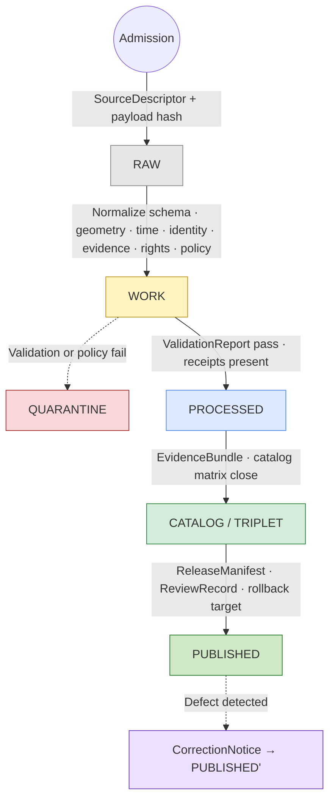

```mermaid
flowchart LR
    subgraph Upstream["Upstream sources (DOM-ROADS)"]
        KDOT[KDOT / KanPlan / KanDrive / KS GIS]:::ext
        TIGER[Census TIGER/Line roads]:::ext
        HPMS[FHWA HPMS / NHFN]:::ext
        WZDx[WZDx feeds]:::ext
        BRIDGE[County/state bridge & restriction]:::ext
        GNIS[GNIS names]:::ext
        OSM[OpenStreetMap]:::ext
        HIST[Historical maps · trail archives]:::ext
        STEWARD[Steward sources<br/>sensitive cultural corridors]:::sens
    end

    subgraph Connectors["connectors/domains/roads-rail-trade/  (PROPOSED)"]
        WATCH[Watcher · conditional GET]:::kfm
        FETCH[Fetcher · spec_hash + HEAD proof]:::kfm
    end

    subgraph Lifecycle["data/  (lifecycle invariant)"]
        RAW[(data/raw/<br/>roads-rail-trade)]:::raw
        WORK[(data/work/<br/>roads-rail-trade)]:::work
        QUAR[(data/quarantine/<br/>roads-rail-trade)]:::quar
        PROC[(data/processed/<br/>roads-rail-trade)]:::proc
        CAT[(data/catalog/domain/<br/>roads-rail-trade)]:::cat
        PUB[(data/published/layers/<br/>roads-rail-trade)]:::pub
    end

    subgraph Release["release/  (decisions)"]
        MAN[ReleaseManifest]:::rel
        ROLL[RollbackCard]:::rel
        CORR[CorrectionNotice]:::rel
    end

    Upstream --> WATCH --> FETCH --> RAW --> WORK --> PROC --> CAT --> PUB
    WORK -. fail-closed .-> QUAR
    CAT --> MAN --> PUB
    PUB -. when defects found .-> CORR
    PUB -. when defects found .-> ROLL

    classDef ext fill:#eef5ff,stroke:#5b8def,color:#1a3a8a
    classDef sens fill:#f8e3e3,stroke:#b54242,color:#7a1f1f
    classDef kfm fill:#fff7e0,stroke:#caa54b,color:#5a4310
    classDef raw fill:#e6e6e6,stroke:#888,color:#333
    classDef work fill:#fff3c2,stroke:#bb9a26,color:#5a4310
    classDef quar fill:#f8d7da,stroke:#a33,color:#7a1f1f
    classDef proc fill:#dde9ff,stroke:#5b8def,color:#1a3a8a
    classDef cat fill:#d4edda,stroke:#3c8a4a,color:#1c4d28
    classDef pub fill:#cfe9c6,stroke:#2e7d32,color:#1a4d1a
    classDef rel fill:#ede0ff,stroke:#6f42c1,color:#3b1a78
```

<!-- [KFM_META_BLOCK_V2]
doc_id: kfm://doc/runbooks/roads-rail-trade/source-refresh
title: Roads, Rail, and Trade Routes — Source Refresh Runbook
type: standard
version: v0.1
status: draft
owners: TODO — Roads/Rail domain steward; Docs steward; Sources steward
created: 2026-05-12
updated: 2026-05-12
policy_label: public
related:
  - docs/doctrine/directory-rules.md
  - docs/doctrine/lifecycle-law.md
  - docs/doctrine/trust-membrane.md
  - docs/domains/roads-rail-trade/README.md            # PROPOSED
  - docs/sources/SOURCE_DESCRIPTOR_STANDARD.md         # PROPOSED
  - docs/runbooks/roads-rail-trade/VALIDATION.md       # PROPOSED sibling
  - docs/runbooks/roads-rail-trade/ROLLBACK.md         # PROPOSED sibling
  - docs/adr/ADR-watcher-non-publisher.md              # PROPOSED
tags: [kfm, runbook, roads-rail-trade, sources, refresh, governed-pipeline]
notes:
  - All repo paths are PROPOSED until verified against mounted-repo evidence.
  - Source-family inventory CONFIRMED via DOM-ROADS / ENCY; cadence and rights NEEDS VERIFICATION per-source.
[/KFM_META_BLOCK_V2] -->

# 🛤️ Roads, Rail, and Trade Routes — Source Refresh Runbook

> **Operational procedure for refreshing modern and historical transport sources into the KFM Roads/Rail/Trade Routes lane — without bypassing evidence, policy, review, or release controls.**


<!-- All badges above are decorative until wired to Shields.io endpoints; targets are TODO. -->

| | |
|---|---|
| **Status** | `draft` |
| **Owners** | TODO — Roads/Rail domain steward · Docs steward · Sources steward |
| **Last updated** | 2026-05-12 |
| **Authority** | This runbook OPERATIONALIZES doctrine; it does not override `docs/doctrine/lifecycle-law.md`, Directory Rules, or `policy/`. |
| **Repo verification** | UNKNOWN — no mounted repo this session. All paths PROPOSED. |

---

## 📑 Contents

1. [Purpose & non-purpose](#1-purpose--non-purpose)
2. [Repo fit](#2-repo-fit)
3. [Prerequisites](#3-prerequisites)
4. [Source family inventory](#4-source-family-inventory)
5. [Refresh cadence & triggers](#5-refresh-cadence--triggers)
6. [Lifecycle walkthrough · RAW → PUBLISHED](#6-lifecycle-walkthrough--raw--published)
7. [Promotion gates (A–G)](#7-promotion-gates-ag)
8. [Sensitivity, rights, and generalization](#8-sensitivity-rights-and-generalization)
9. [Stale-state and supersession](#9-stale-state-and-supersession)
10. [Negative paths & quarantine reasons](#10-negative-paths--quarantine-reasons)
11. [Validation hooks](#11-validation-hooks)
12. [Correction & rollback](#12-correction--rollback)
13. [Receipts & emitted artifacts](#13-receipts--emitted-artifacts)
14. [Failure modes & anti-patterns](#14-failure-modes--anti-patterns)
15. [FAQ](#15-faq)
16. [Related docs](#16-related-docs)
17. [Appendix · pseudocode and command stubs](#17-appendix--pseudocode-and-command-stubs)

---

## 1. Purpose & non-purpose

CONFIRMED doctrine basis: Roads/Rail/Trade Routes is a governed domain lane that owns modern roads, historic roads, wagon/military/emigrant/stage/cattle trails, rail corridors, depots, sidings, yards, crossings, bridges, ferries, river crossings, freight corridors, and derived network graph projections; **it must not expose culturally sensitive corridors or confuse route narrative with surveyed alignment** (DOM-ROADS / ENCY).

This runbook describes **how to refresh upstream source data into that lane** while preserving the lifecycle invariant **RAW → WORK / QUARANTINE → PROCESSED → CATALOG / TRIPLET → PUBLISHED**.

> [!IMPORTANT]
> **A refresh is not a publish.** Promotion across phases is a governed state transition supported by receipts, validators, and review — **never a file move, mirror, or watcher auto-publish**.

### Out of scope

- Defining object meaning. That lives in `contracts/domains/roads-rail-trade/` (PROPOSED).
- Defining object shape. That lives in `schemas/contracts/v1/domains/roads-rail-trade/` (PROPOSED).
- Deciding allow / deny / restrict. That lives in `policy/domains/roads-rail-trade/` (PROPOSED).
- Public render styling, MapLibre style packs, or 3D scene assembly.
- Live operational alerting. KFM is never an alert authority.

---

## 2. Repo fit

> [!NOTE]
> All paths below are **PROPOSED** until verified against mounted-repo evidence. Convention conflict flagged: prior Whole-UI Expansion Report uses flat `docs/runbooks/<subsystem>_<phase>.md`; Directory Rules §12 favors a domain segment. This file uses the §12 form. Reconcile via ADR if the repo uses a single canonical pattern.

```text
docs/runbooks/roads-rail-trade/
├── SOURCE_REFRESH_RUNBOOK.md      # ← this file
├── VALIDATION.md                  # PROPOSED sibling — validation runs
├── ROLLBACK.md                    # PROPOSED sibling — rollback drills
└── LOCAL_DEV.md                   # PROPOSED sibling — local fixture setup
```



<sub>Diagram reflects doctrine (lifecycle-law.md, DOM-ROADS, watcher-as-non-publisher). Path names PROPOSED.</sub>

[⤴ Back to top](#-roads-rail-and-trade-routes--source-refresh-runbook)

---

## 3. Prerequisites

Before you run a refresh, confirm:

- [ ] `SourceDescriptor` exists for each source you will touch, with **source role**, **authority**, **rights / SPDX**, **sensitivity class**, **cadence**, **steward**, and **release class** populated (CONFIRMED doctrine; per-source values **NEEDS VERIFICATION**).
- [ ] You have **read** access to the source endpoints. Do **not** request elevated/secret credentials to refresh a public-safe layer.
- [ ] A current `ReviewRecord` is on file for any source feeding a **sensitive** lane (cultural corridors, historic route claims, critical facilities). Refresh is **deny-by-default** without it.
- [ ] CI runners for the Roads/Rail promotion workflow are healthy (`gate_a_identity_integrity` through `gate_g_release` — PROPOSED job names).
- [ ] Cosign / DSSE signing keys are reachable to the runner (or the run is a **dry-run** that explicitly skips signing and is **forbidden from promotion**).
- [ ] No active kill-switch is set for Roads/Rail map promotion.

> [!CAUTION]
> If any prerequisite is **UNKNOWN**, treat the run as a dry-run, emit a `RunReceipt` with `outcome: ABSTAIN`, and do not write anything past `data/work/roads-rail-trade/`.

---

## 4. Source family inventory

Source families and roles are **CONFIRMED** via DOM-ROADS / ENCY. Rights, cadence, and current API surfaces are per-source and **NEEDS VERIFICATION** before activation.

| Source family | Typical role | Sensitivity defaults | Cadence (PROPOSED) | Rights / SPDX |
|---|---|---|---|---|
| **KDOT / KanPlan / KanDrive / Kansas GIS** | authority (state roads, restrictions) | public-safe; restrictions may be operationally sensitive | quarterly + event-driven WZDx | NEEDS VERIFICATION |
| **Census TIGER/Line roads** | authority / observation (admin geometry) | public-safe | annual (TIGER vintage) | US Public Domain (NEEDS VERIFICATION) |
| **FHWA HPMS** | authority (highway performance) | public-safe (aggregate) | annual | NEEDS VERIFICATION |
| **FHWA National Highway Freight Network** | authority (freight designation) | public-safe | annual | NEEDS VERIFICATION |
| **WZDx work-zone feeds** | observation (status / events) | public-safe; transient | live / 5–300 s debounce | NEEDS VERIFICATION |
| **County / state bridge & restriction data** | authority / observation | mixed; weight/closure can be sensitive | varies | NEEDS VERIFICATION per county |
| **GNIS names** | observation / context (gazetteer) | public-safe | low-cadence | US Public Domain (NEEDS VERIFICATION) |
| **OpenStreetMap (OSM)** | observation / context (community) | public-safe; **NOT legal/regulatory authority** | continuous; sample on cadence | ODbL (NEEDS VERIFICATION) |
| **County atlases · historical maps · trail archives** | context / source-of-claim (historic) | uncertainty + generalization required | one-shot per scan vintage | per-archive |
| **Military · emigrant · stage · cattle trail sources** | source-of-claim (historic) | **sensitive when overlapping Indigenous corridors** | per-archive | per-archive |
| **Bridges / ferries / river-crossing records** | authority / observation | mixed | per-source | per-source |
| **Steward sources for sensitive cultural corridors** | source-of-claim under stewardship | **default DENY public exposure; generalized geometry only** | by steward consent | restricted |

> [!WARNING]
> **OSM and GNIS are observation/context, not legal authority.** Validators MUST refuse to promote OSM- or GNIS-derived claims that imply legal road status, jurisdictional ownership, or freight designation. (PROPOSED test: *OSM/GNIS legal-status denial.*)

[⤴ Back to top](#-roads-rail-and-trade-routes--source-refresh-runbook)

---

## 5. Refresh cadence & triggers

Three trigger classes apply. Each emits a `RunReceipt` regardless of outcome.

| Trigger class | When it fires | Required guards |
|---|---|---|
| **Scheduled** | Per-source cadence from `SourceDescriptor` (e.g. KDOT quarterly, TIGER annual) | Conditional GET (ETag / Last-Modified); no-change → heartbeat receipt only |
| **Event-driven** | Upstream notification (WZDx push, partner webhook, change-data-capture stream) | Debounce/coalesce window per source class; aggregate to delta manifest |
| **Manual / steward-initiated** | Steward correction, rights change, or rollback rehearsal | Justification in PR body; full receipt chain |

**Debounce windows (PROPOSED starting points, from KFM ingestion doctrine):**

| Source class | Window | Notes |
|---|---|---|
| High-churn (WZDx live events) | 5–30 s | Aggregate to delta manifest; emit only if `spec_hash` changes |
| Moderate (KanDrive incident feeds) | 30–120 s | Same |
| Heavy batch (KDOT vintage, TIGER, HPMS) | 120–300 s (or per-batch) | Materialize only on `spec_hash` change |

> [!TIP]
> **Unchanged sources must not invalidate caches or emit new catalog entities.** A no-change poll should emit a heartbeat receipt and nothing else. This protects downstream tile / style caches from churn.

[⤴ Back to top](#-roads-rail-and-trade-routes--source-refresh-runbook)

---

## 6. Lifecycle walkthrough · RAW → PUBLISHED

CONFIRMED doctrine: every Roads/Rail refresh traverses the lifecycle invariant. Each transition has a gate; **no gate, no transition**.



### Phase responsibilities

| Phase | What happens | What gets emitted | Failure-closed outcome |
|---|---|---|---|
| **RAW** | Capture immutable payload (or reference) + source-role, rights, sensitivity, citation, time, hash. | `SourceDescriptor`, raw payload, fetch `RunReceipt`. | Source not admitted; logged as candidate awaiting steward. |
| **WORK** | Normalize schema · geometry · time · identity · evidence · rights · policy. | `TransformReceipt`, `ValidationReport` (working set), `PolicyDecision`. | **Quarantine** with structured reason; **never silently promote**. |
| **QUARANTINE** | Hold failing records; record why. | Quarantine entry with reason class (license, schema, policy, sensitivity, hash mismatch, …). | Stay until steward disposition (refresh / supersede / mark stale). |
| **PROCESSED** | Emit validated normalized objects + public-safe candidates. | `EvidenceRef` resolves, `ValidationReport` pass, `RedactionReceipt` if sensitivity applies. | Stay in WORK; structured FAIL. |
| **CATALOG / TRIPLET** | Catalog records + `EvidenceBundle` + graph/triplet projections + release candidates. | `CatalogMatrix` entry, `EvidenceBundle`, graph projection. | HOLD at PROCESSED; no public edge. |
| **PUBLISHED** | Serve released public-safe artifacts through governed APIs / manifests. | `ReleaseManifest`, rollback target, correction path, `ReviewRecord` where required. | HOLD at CATALOG; no public surface change. |

> [!IMPORTANT]
> **Watcher-as-non-publisher.** Connectors and watchers emit candidates and receipts only. They MUST NOT publish, mutate canonical records, mutate the graph projection, or invalidate map caches without going through the release path.

[⤴ Back to top](#-roads-rail-and-trade-routes--source-refresh-runbook)

---

## 7. Promotion gates (A–G)

CONFIRMED doctrine basis: KFM uses default-deny promotion gates with signed receipts and a deterministic `spec_hash`. The seven gates apply uniformly to Roads/Rail.

| Gate | Name | Primary check | Fail-closed result |
|---|---|---|---|
| **A** | Identity & Integrity | `spec_hash` computed via JCS-canonicalized JSON; HEAD probe with ETag + Last-Modified + Content-Length | Block; emit `RunReceipt(status=quarantine, reason=identity_integrity)` |
| **B** | License & Provenance | SPDX in allowlist; rights status resolves; provenance chain present | Quarantine if SPDX absent / ambiguous; restricted-with-obligations if conditional |
| **C** | Schema & Shape | Validate against `schemas/contracts/v1/domains/roads-rail-trade/*.schema.json` (PROPOSED home) | Quarantine with schema-diff diagnostic |
| **D** | Sensitivity & Generalization | Per-policy check for cultural/Indigenous corridor exposure, historic overprecision, critical-facility detail | DENY public path; route to steward review |
| **E** | Evidence Closure | Every consequential claim has a resolving `EvidenceRef → EvidenceBundle` | ABSTAIN; record gap in `VERIFICATION_BACKLOG` |
| **F** | Steward Review | `ReviewRecord` present where required by source role or sensitivity tier | HOLD; emit review-pending receipt |
| **G** | Release Authority | `ReleaseManifest` issued; **release authority distinct from author** when materiality applies; rollback target named | HOLD at CATALOG; no public surface change |

**Validator commands** (PROPOSED — verify names against the repo before quoting them in PRs):

```bash
# PROPOSED — actual tool names NEEDS VERIFICATION
tools/validators/identity/compute_spec_hash.py --spec spec.json
tools/validators/license/check_spdx.py        --descriptor source_descriptor.yaml
tools/validators/schemas/validate_jsonschema.py \
    --schema schemas/contracts/v1/domains/roads-rail-trade/road_segment.schema.json \
    --instance data/work/roads-rail-trade/road_segment.candidate.json
tools/validators/sensitivity/check_generalization.py --layer roads-rail-trade
tools/validators/evidence/verify_evidence_refs.py    --bundle evidence_bundle.json
tools/validators/release/check_release_manifest.py   --manifest release/manifests/roads-rail-trade-<vintage>.yaml
```

> [!WARNING]
> The fail-closed posture means **absence of evidence blocks promotion**. A missing `ReviewRecord`, an unresolvable `EvidenceRef`, or an unknown SPDX is *enough* to quarantine — even if everything else looks fine.

[⤴ Back to top](#-roads-rail-and-trade-routes--source-refresh-runbook)

---

## 8. Sensitivity, rights, and generalization

CONFIRMED doctrine: Indigenous trade and mobility corridors, oral history, treaty, cultural, and interpretive evidence default to **steward review and generalized public geometry**. Critical transport facilities require review.

### Per-class refresh posture

| Sensitivity class | Default public posture | Refresh-time requirement |
|---|---|---|
| **Public-safe modern road / rail geometry** | Public layer + Evidence Drawer | Standard gates A–G |
| **Operator status / restriction event (WZDx, KanDrive)** | Public, time-aware | Gate A integrity proof; honor source freshness markers |
| **Historic route claim (low-uncertainty)** | Public with uncertainty class + generalization receipt | Gate C must include `RouteUncertaintyProfile` (PROPOSED) |
| **Historic route claim (high-uncertainty / multi-source disagreement)** | Generalized corridor view only | Steward review (Gate F); explicit generalization transform receipt |
| **Indigenous / culturally sensitive corridor** | **DENY exact geometry by default**; generalized corridor only with steward consent | Steward review **mandatory**; rights status must explicitly authorize the granularity |
| **Critical transport facility (exact)** | **DENY exact precision by default** | Steward review; published only after threat-model check |

### Generalization receipts

When geometry is generalized for public release, the transform MUST emit a `GeneralizationReceipt` recording: input bundle digest, transform parameters (snap distance, simplification tolerance, corridor buffer), output digest, justification, and reviewer. The receipt resolves through `EvidenceRef → EvidenceBundle`.

> [!CAUTION]
> Do **not** publish raw historic-trail geometry derived from archival scans without a generalization step. *Historic overprecision denial* is a PROPOSED required validator for this lane.

[⤴ Back to top](#-roads-rail-and-trade-routes--source-refresh-runbook)

---

## 9. Stale-state and supersession

CONFIRMED doctrine: a **stale** claim has aged past declared tolerance; a **wrong** claim is substantively incorrect. Both have visible markers.

Refresh time is when stale-state is discovered. The runbook MUST check the following markers and act:

| Marker | What to do |
|---|---|
| **Source freshness expired** (cadence in `SourceDescriptor` passed without a new admission) | Re-admit; if upstream is gone, supersede or mark dependents stale |
| **Schema version drift** (object schema upgraded past the published claim's schema version) | Migrate, re-validate, re-release; or mark stale with migration ADR link |
| **Geography version drift** (`GeographyVersion` replaced; published claim still bound to prior version) | Rebind, re-release; or mark stale |
| **Time-scope outside support** | Mark stale; do not silently refresh |
| **Rights status changed** | Re-evaluate tier; emit `CorrectionNotice` if needed; potentially downgrade public access |
| **Policy version changed** | Re-run Gate D / F; potentially supersede release |
| **Review aged out** (`ReviewRecord` past tolerance for a sensitive lane) | Trigger steward review; potentially downgrade tier |

Supersession lineage MUST be preserved: prior `SourceDescriptor`, `EvidenceBundle`, schema, and `ReleaseManifest` versions remain queryable with forward links.

[⤴ Back to top](#-roads-rail-and-trade-routes--source-refresh-runbook)

---

## 10. Negative paths & quarantine reasons

Refresh runs that **must quarantine** rather than promote:

| Condition | Quarantine reason class |
|---|---|
| Missing or invalid signature on a candidate `RunReceipt` | `signature_invalid` |
| DSSE envelope malformed | `dsse_invalid` |
| Unknown / disallowed SPDX | `license_unknown` |
| `EvidenceRef` does not resolve | `evidence_missing` |
| Policy decision returns DENY | `policy_mismatch` |
| `spec_hash` re-computation does not match signed payload | `hash_mismatch` |
| Source-role conflict (OSM-derived claim asserting legal authority) | `role_overreach` |
| Historic geometry exceeds documented precision support | `overprecision` |
| Sensitive lane lacks steward consent | `sensitivity_unresolved` |
| Source freshness expired beyond stale tolerance | `freshness_expired` |

Each quarantine MUST emit a `RunReceipt(status=quarantine, reason=<class>, actor=<who>)` and a structured note for the steward queue.

> [!NOTE]
> **Validators MUST include negative fixtures.** A validator that has never seen a deny case has not been proven to deny. Fixtures live under `tests/fixtures/domains/roads-rail-trade/` (PROPOSED).

[⤴ Back to top](#-roads-rail-and-trade-routes--source-refresh-runbook)

---

## 11. Validation hooks

PROPOSED Roads/Rail-specific validators (DOM-ROADS / ENCY):

- **Route membership and designation separation tests** — a freight designation MUST NOT be inferred from observation-only sources (OSM, GNIS).
- **Operator / status temporal tests** — operator-of-record and status events have distinct, non-overlapping time scopes per segment.
- **OSM / GNIS legal-status denial** — claims of legal road status, jurisdiction, or designation derived from observation sources fail closed.
- **Historic overprecision denial** — historic geometry whose declared precision exceeds source support fails closed.
- **Public generalization receipt tests** — every public-sensitive layer release has a matching `GeneralizationReceipt`.
- **Transport graph projection rollback tests** — graph projections can be rolled back without orphaning canonical records.

CI should also run the shared promotion-pipeline checks (Gates A–G), STAC / DCAT / PROV catalog validation, and tile-artifact digest checks where the refresh feeds map tiles.

See the sibling [VALIDATION runbook](./VALIDATION.md) (PROPOSED) for execution details.

[⤴ Back to top](#-roads-rail-and-trade-routes--source-refresh-runbook)

---

## 12. Correction & rollback

CONFIRMED doctrine: a released claim, layer, catalog record, artifact, or answer MUST have a visible correction path and rollback target before it is treated as safely publishable.

| Defect class | Correction posture | Rollback posture |
|---|---|---|
| Evidence gap | ABSTAIN or withdraw unsupported claim; emit `CorrectionNotice` | Restore prior evidence-supported release |
| Source-role overreach (e.g. OSM-as-authority) | Re-classify source role; supersede `SourceDescriptor`; emit notice | Restore prior release that respected role |
| Rights change | Tier downgrade or withdrawal; notice with rationale | Restore prior compliant release |
| Sensitivity exposure (cultural corridor leak) | Immediate withdrawal; redaction receipt; steward notice | Restore prior generalized release |
| Geometry / temporal error | Republish corrected; notice with diff | Restore prior release |
| Policy version change | Re-run gates; possibly supersede | Restore prior policy-aligned release |
| Render / API regression | Forward fix preferred; rollback if regression is material | Restore prior `ReleaseManifest` + invalidate caches |
| AI-output defect | Receipt-level correction; new `AIReceipt`, never retroactive overwrite | N/A — AI output is not source truth |

Rollback steps (operational summary):

1. Identify the affected `ReleaseManifest` and its declared rollback target.
2. Verify digests on the rollback target (no silent file-copy rollbacks).
3. Disable / withdraw the affected public surface (layer, manifest entry, API route).
4. Restore the rollback target through the **same governed release path**.
5. Invalidate downstream caches; emit a cache-invalidation record.
6. Mark UI state stale / withdrawn; preserve audit receipts.

See the sibling [ROLLBACK runbook](./ROLLBACK.md) (PROPOSED) for the rehearsal procedure.

[⤴ Back to top](#-roads-rail-and-trade-routes--source-refresh-runbook)

---

## 13. Receipts & emitted artifacts

Each refresh leaves a paper trail. **Every** outcome (APPROVE, QUARANTINE, ABSTAIN, DENY, ERROR) emits at least one receipt.

| Object | Purpose | Proposed home |
|---|---|---|
| `SourceDescriptor` | Source identity, role, rights, sensitivity, cadence, steward | `data/registry/sources/roads-rail-trade/` |
| `RunReceipt` | Per-run evidence: source URL, ETag, `spec_hash`, artifacts, actor, outcome | `data/receipts/roads-rail-trade/` |
| `ValidationReport` | Pass/fail per validator with fixture binding | `data/receipts/roads-rail-trade/validation/` |
| `PolicyDecision` | ALLOW / DENY / ABSTAIN / ERROR + policy version | `data/receipts/roads-rail-trade/policy/` |
| `TransformReceipt` | Normalization transforms applied | `data/receipts/roads-rail-trade/transform/` |
| `GeneralizationReceipt` | Public-safe geometry transform (sensitive lanes) | `data/receipts/roads-rail-trade/generalization/` |
| `RedactionReceipt` | Sensitivity redactions applied | `data/receipts/roads-rail-trade/redaction/` |
| `EvidenceBundle` | Resolved support package for claims | `data/proofs/roads-rail-trade/` |
| `CatalogMatrix` entry | Catalog membership and digest closure | `data/catalog/domain/roads-rail-trade/` |
| `ReviewRecord` | Steward review state | `data/receipts/roads-rail-trade/review/` |
| `ReleaseManifest` | Release decision, rollback target, correction path | `release/manifests/roads-rail-trade/` |
| `CorrectionNotice` | Public notice of a corrected claim | `release/correction_notices/roads-rail-trade/` |
| `RollbackCard` | Rollback decision artifact | `release/rollback_cards/roads-rail-trade/` |

> [!NOTE]
> All paths above are **PROPOSED**. Verify against Directory Rules §6 / §12 and the current `data/`, `release/`, and `data/registry/` layouts before committing.

[⤴ Back to top](#-roads-rail-and-trade-routes--source-refresh-runbook)

---

## 14. Failure modes & anti-patterns

> [!WARNING]
> If you find yourself doing any of these, **stop the refresh and re-plan.**

- **Watcher auto-publish.** A connector or watcher writes directly to `data/published/` or to the live tile cache. Watchers are non-publishers.
- **OSM-as-authority.** Promoting an OSM-derived claim as legal road status, jurisdictional ownership, or freight designation.
- **Generalization skip.** Releasing raw historic-trail geometry from archival scans without a `GeneralizationReceipt`.
- **Cultural-corridor leak.** Releasing exact Indigenous / cultural corridor geometry without explicit steward consent at the requested granularity.
- **Operator-status retro-overwrite.** Silently mutating a prior `OperatorStatus` event instead of superseding it.
- **Stale-without-marker.** Letting a source age past its cadence without either re-admission or a stale marker on dependents.
- **Cache invalidation on no-change.** Emitting tile / style cache invalidations on a heartbeat poll.
- **Polished-but-unreceipted refresh.** Producing a beautiful run with no `RunReceipt`, no `ValidationReport`, no `PolicyDecision`.
- **Graph as truth.** Treating the derived transport-network graph as the canonical record rather than as a derivative of released objects.

[⤴ Back to top](#-roads-rail-and-trade-routes--source-refresh-runbook)

---

## 15. FAQ

**Q. Can I refresh a single source by hand without going through CI?**
A. You can fetch and inspect locally. You cannot promote anything past `data/work/roads-rail-trade/`. Any promotion requires CI-signed receipts and a `ReleaseManifest`.

**Q. WZDx is live and noisy. How do I avoid cache thrash?**
A. Use the debounce/coalesce window for the source class (5–30 s for high-churn). Materialize only when `spec_hash` changes. Heartbeat receipts emit on no-change without invalidating caches.

**Q. A county sent a corrected bridge restriction. What do I do?**
A. Treat it as a corrective refresh: re-run Gates A–G; if it materially changes a published claim, issue a `CorrectionNotice`, supersede the affected `ReleaseManifest`, and invalidate caches.

**Q. An OSM contributor relabeled a road as US-50 Business; should we publish?**
A. No. OSM is **observation/context**, not legal authority. The *role-overreach* validator should refuse. If a separate authoritative source (KDOT) confirms, refresh from that source instead.

**Q. The historic-trail scan shows exact alignment. Why can't I publish that?**
A. Source precision rarely supports it, and the corridor may overlap a sensitive Indigenous mobility line. Default to a generalized corridor view; require steward review and a `GeneralizationReceipt`.

**Q. What if the upstream source disappears?**
A. Mark dependents stale. Open a supersession entry in the source register. Decide via steward whether to withdraw the affected releases or to preserve them as historic claims with a stale-source badge.

[⤴ Back to top](#-roads-rail-and-trade-routes--source-refresh-runbook)

---

## 16. Related docs

- `docs/doctrine/directory-rules.md` — placement and authority roots
- `docs/doctrine/lifecycle-law.md` — RAW → PUBLISHED invariant
- `docs/doctrine/trust-membrane.md` — public-client boundary
- `docs/domains/roads-rail-trade/README.md` *(PROPOSED — domain landing page)*
- `docs/sources/SOURCE_DESCRIPTOR_STANDARD.md` *(PROPOSED — descriptor fields)*
- `docs/runbooks/roads-rail-trade/VALIDATION.md` *(PROPOSED sibling)*
- `docs/runbooks/roads-rail-trade/ROLLBACK.md` *(PROPOSED sibling)*
- `docs/runbooks/roads-rail-trade/LOCAL_DEV.md` *(PROPOSED sibling)*
- `docs/adr/ADR-watcher-non-publisher.md` *(PROPOSED — codifies the non-publisher rule)*
- `docs/registers/VERIFICATION_BACKLOG.md` — open verification items for this lane

[⤴ Back to top](#-roads-rail-and-trade-routes--source-refresh-runbook)

---

## 17. Appendix · pseudocode and command stubs

<details>
<summary><strong>A. Watcher → proposal → human gate → attestation → promotion (fail-closed)</strong></summary>

<sub>Doctrinal sketch from KFM ingestion notes. Function names PROPOSED. The shape is the point, not the names.</sub>

```python
# PROPOSED — pseudocode; verify tool paths before adopting.
def watcher_tick(source):
    manifest = fetch_manifest(source)                 # ETag/Last-Modified or event payload
    new_fp = content_fingerprint(manifest)            # sha256 over normalized content
    old_fp = load_last_fingerprint(source)
    if new_fp == old_fp:
        emit_heartbeat_receipt(source); return        # no-change; do NOT invalidate caches

    delta = compute_delta(load_snapshot(source), manifest)
    spec_hash = sha256(JCS(serialize_delta_record(delta)))

    proposed = {
        "decision_id": uuid4(),
        "spec_hash": spec_hash,
        "delta": delta,
        "source_refs": build_source_refs(manifest),
        "ingest_lane": "RAW→WORK",
    }
    score, explain = ai_change_scorer(proposed,
                        context=source_policy_context(source))   # advisory only
    proposal_ref = write_to_WORK(proposed, score=score, explain=explain)
    notify_steward(proposal_ref, score=score, explain=explain)   # human review required


def steward_decision(proposal_ref, approve: bool, reason: str | None):
    proposed = read_WORK(proposal_ref)
    if not approve:
        mark_status(proposal_ref, status="quarantine", reason=reason)
        emit_run_receipt(decision_id=proposed["decision_id"],
                         status="quarantine", reason=reason, actor="steward")
        return ABSTAIN

    evidence = buildEvidenceBundle(
        proposed,
        run_metadata=collect_run_metadata(),
        policy_label=resolve_policy_label(proposed),
        rights_status=resolve_rights(proposed),
        sensitivity=resolve_sensitivity(proposed),
    )
    signed_att = dsse_sign_or_cosign(evidence)
    emit_run_receipt(decision_id=proposed["decision_id"],
                     spec_hash=proposed["spec_hash"],
                     attestation_ref=signed_att.ref,
                     timestamps=now_iso(), actor="steward")
    promote(record=proposed, status="active",
            attestation_ref=signed_att.ref,
            lane="WORK→PROCESSED→CATALOG/TRIPLET→PUBLISHED")
    return ANSWER
```

</details>

<details>
<summary><strong>B. Gate A · identity & integrity (POSIX shell sketch)</strong></summary>

<sub>Adapted from KFM promotion-gate notes. Tooling presence in the repo is **NEEDS VERIFICATION**.</sub>

```bash
# PROPOSED — verify against actual workflow files before quoting in PRs.
set -euo pipefail
HEADERS=$(mktemp)
curl -sI "$SOURCE_URL" > "$HEADERS"
ETAG=$(awk         '/ETag/{print $2}'         "$HEADERS" | tr -d '\r"')
LAST_MODIFIED=$(awk -F": " '/Last-Modified/{print $2}'   "$HEADERS" | tr -d '\r')
CONTENT_LENGTH=$(awk -F": " '/Content-Length/{print $2}' "$HEADERS" | tr -d '\r')

SPEC_HASH=$(python3 - <<'PY'
import json, hashlib
with open("spec.json", "r", encoding="utf-8") as f:
    payload = json.dumps(json.load(f), sort_keys=True, separators=(",", ":"))
print(hashlib.sha256(payload.encode()).hexdigest())
PY
)

test -n "$ETAG" -a -n "$LAST_MODIFIED" -a -n "$SPEC_HASH"
echo "spec_hash=$SPEC_HASH"
```

</details>

<details>
<summary><strong>C. DSSE / cosign verification on a run receipt</strong></summary>

```bash
# PROPOSED — keys and paths NEEDS VERIFICATION against repo conventions.
cosign verify-blob \
  --key cosign.pub \
  --signature run_receipt.sig \
  envelope.json
```

DSSE structural checks the validator MUST make: `payload` exists, `payloadType` matches, `signatures` array exists, signature count ≥ 1.

</details>

<details>
<summary><strong>D. Truth-label legend used in this runbook</strong></summary>

| Label | Meaning |
|---|---|
| **CONFIRMED** | Verified this session against attached KFM doctrine documents |
| **PROPOSED** | Design / path / placement not yet verified in mounted-repo evidence |
| **NEEDS VERIFICATION** | Checkable, but not yet checked strongly enough to act as fact |
| **UNKNOWN** | Not resolvable without more evidence |
| **EXTERNAL** | Sourced from authoritative external research (not used in this file) |

</details>

[⤴ Back to top](#-roads-rail-and-trade-routes--source-refresh-runbook)

---

**Related docs:** [Directory Rules](../../doctrine/directory-rules.md) · [Lifecycle Law](../../doctrine/lifecycle-law.md) · [Trust Membrane](../../doctrine/trust-membrane.md) · [Roads/Rail Domain README](../../domains/roads-rail-trade/README.md) *(PROPOSED)* · [Source Descriptor Standard](../../sources/SOURCE_DESCRIPTOR_STANDARD.md) *(PROPOSED)*

**Last updated:** 2026-05-12 · **Version:** v0.1 (draft) · **Status:** awaiting Roads/Rail steward + repo verification

[⤴ Back to top](#-roads-rail-and-trade-routes--source-refresh-runbook)
