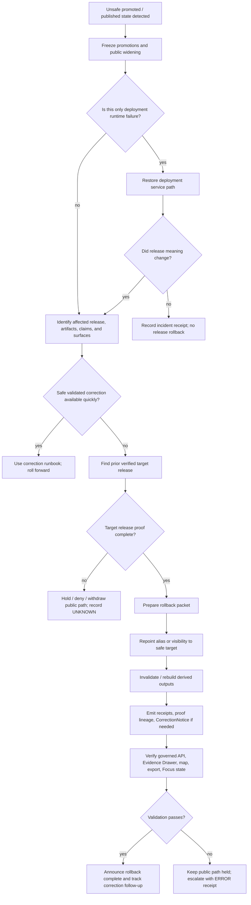

<!-- [KFM_META_BLOCK_V2]
doc_id: kfm://doc/NEEDS_VERIFICATION__docs_runbooks_rollback
title: Rollback Runbook
type: standard
version: v1
status: draft
owners: @bartytime4life
created: NEEDS_VERIFICATION__YYYY-MM-DD
updated: 2026-04-28
policy_label: NEEDS_VERIFICATION__public_or_restricted
related: [
  ./correction.md,
  ../../data/README.md,
  ../../data/receipts/README.md,
  ../../data/proofs/README.md,
  ../../data/catalog/README.md,
  ../../data/published/README.md,
  ../../contracts/README.md,
  ../../schemas/README.md,
  ../../schemas/contracts/v1/correction/README.md,
  ../../policy/README.md,
  ../../tests/README.md,
  ../../tests/e2e/README.md,
  ../../.github/CODEOWNERS,
  ../../.github/PULL_REQUEST_TEMPLATE.md,
  ../../.github/workflows/README.md
]
tags: [kfm, runbook, rollback, correction, release, proof, receipts, publication, governance]
notes: [
  Owner is grounded in current public CODEOWNERS coverage for /docs/runbooks/; narrower release/correction ownership remains NEEDS VERIFICATION.
  This revision upgrades the existing thin rollback runbook into a governed rollback and correction-lineage procedure.
  doc_id, created date, final policy label, repo-native rollback command names, workflow wiring, and active-branch proof object inventory remain NEEDS VERIFICATION.
]
[/KFM_META_BLOCK_V2] -->

<a id="top"></a>

# Rollback Runbook

Return KFM public or release-facing state to a safer verified release without deleting proof, hiding correction lineage, or bypassing the governed truth path.

> [!IMPORTANT]
> **Status:** active runbook · **Document state:** draft  
> **Owners:** `@bartytime4life` *(current broad fallback owner; verify narrower release/correction ownership before merge)*  
> **Path:** `docs/runbooks/rollback.md`  
> **Quick jumps:** [Scope](#scope) · [Trigger](#trigger) · [Decision flow](#decision-flow) · [Procedure](#procedure) · [Rollback packet](#rollback-packet) · [Validation](#validation-checklist) · [Exit criteria](#exit-criteria) · [Appendix](#appendix)


> [!CAUTION]
> A rollback is not a hidden ops trick. In KFM, rollback is a governed release-state transition that leaves visible lineage, proof, receipts, and reviewer context.

---

## Scope

Use this runbook when a promoted or published KFM release, artifact, runtime surface, map layer, export, or evidence-backed claim must be returned to a previously verified safe state.

Rollback may involve:

| Rollback class | Use when | Minimum posture |
|---|---|---|
| **Release alias rollback** | A `current`, public, or semi-public alias points to an unsafe release. | Repoint only to a prior verified release; emit rollback record and receipt. |
| **Artifact withdrawal** | A release cannot safely remain visible and no safe prior release exists. | Remove or hide public access while preserving evidence and audit links. |
| **Projection rollback** | Tiles, graphs, summaries, scenes, exports, or caches were built from a bad release. | Invalidate derived outputs and rebuild from the verified target release. |
| **Correction rollback** | A correction introduced new unsafe meaning or broke citation/proof closure. | Restore prior safe state and publish a follow-up `CorrectionNotice`. |
| **Deployment restore** | Runtime deployment failed, but release truth is not necessarily wrong. | Restore service separately; do not rewrite release meaning unless proof scope changed. |

### Not this runbook

| Need | Use instead | Why |
|---|---|---|
| Correct a published error while keeping the newer release | [`./correction.md`](./correction.md) | Roll-forward correction is preferred when it can be validated quickly. |
| Admit or reject a source | Source admission / registry docs | Source trust is upstream of rollback. |
| Decide rights, sovereignty, privacy, or sensitivity from scratch | Policy and steward review | Rollback can contain impact, not invent authority. |
| Delete raw, work, processed, proof, or receipt history | Never as part of rollback | KFM preserves lineage and auditability. |
| Emergency public-safety instructions | Official emergency or alerting systems | KFM is a governed knowledge system, not an emergency alert service. |

[Back to top](#top)

---

## Operating rule

Rollback preserves the KFM truth path:

```text
RAW -> WORK / QUARANTINE -> PROCESSED -> CATALOG / TRIPLET -> PUBLISHED
```

A valid rollback should preserve these boundaries:

| Boundary | Rule |
|---|---|
| **Raw and work material** | Never mutate source-native or unpublished evidence to “make rollback true.” |
| **Processed releases** | Treat immutable published versions as immutable by content identity or release identity. |
| **Receipts** | Store process memory: what ran, what was checked, what was held, and what changed. |
| **Proofs** | Store release-significant evidence: why a release was trusted, corrected, withdrawn, superseded, or rolled back. |
| **Published scope** | Update public aliases or visibility only after proof and review gates support the transition. |
| **Runtime/UI** | Governed APIs, Evidence Drawer, Focus Mode, maps, exports, and stories must show correction or rollback state when it affects meaning. |

> [!NOTE]
> If proof is missing, do not “smooth” the rollback into a success story. Mark the outcome `UNKNOWN`, `ABSTAIN`, `DENY`, or `ERROR` as appropriate, and keep the unsafe public path closed.

[Back to top](#top)

---

## Trigger

Start this runbook when one or more of the following is true.

| Trigger | Severity hint | First action |
|---|---:|---|
| Post-release validation finds material proof, catalog, schema, policy, or citation breakage. | High | Freeze promotion and identify affected release scope. |
| A public map layer, API payload, Evidence Drawer, Focus answer, export, story, or published artifact points to unsupported or unsafe meaning. | High | Hide or stale-mark the public surface while evidence is reviewed. |
| Rights, sensitivity, sovereignty, cultural, privacy, or precise-location constraints were missed. | High | Deny public access to affected material and route to policy/steward review. |
| A derived artifact was built from the wrong release, stale source basis, wrong time basis, or wrong transformation. | Medium | Invalidate projection and rebuild from the verified target release. |
| Runtime reliability falls below release-critical thresholds after a promotion. | Medium | Restore service, but keep release truth separate from deployment state. |
| A correction cannot be validated quickly enough to keep the current public state safe. | Medium / High | Roll back to last known-good release, then continue correction work. |

### Stop conditions

Stop the rollback and escalate if:

- no prior verified target release can be identified;
- the proposed target release has unresolved rights, sensitivity, catalog, or proof gaps;
- rollback would expose raw, work, quarantine, restricted, or unpublished material;
- reviewer ownership is unclear for a policy-significant release;
- the rollback path depends on unverified command names, workflows, credentials, or host state;
- affected public surfaces cannot show stale, withdrawn, corrected, or rollback state.

[Back to top](#top)

---

## Decision flow



[Back to top](#top)

---

## Accepted inputs

The rollback operator should gather these before making any public-facing change.

| Input | Why it matters | Expected home |
|---|---|---|
| Affected `release_id`, `subject_ref`, content hash, or artifact digest | Defines what is unsafe. | `data/proofs/`, release manifest, published manifest |
| Candidate last known-good release | Defines rollback target. | `data/proofs/`, `data/published/`, release index |
| Release proof and catalog closure for both current and target | Prevents rollback to an unverifiable state. | `data/proofs/`, `data/catalog/` |
| Run receipts, validation reports, and failed checks | Explains why rollback is needed. | `data/receipts/` |
| Policy or review decision | Establishes allow, deny, hold, or abstain state. | `policy/`, review records, proof bundle |
| Public surface inventory | Lists API, map, Evidence Drawer, Focus, export, story, and cache impact. | governed API docs, UI/layer registries, published artifacts |
| Reviewer summary | Records who approved rollback and what remains unresolved. | proof pack, receipt, PR, changelog |

### Exclusions

| Do not use rollback to store or create | Where it belongs instead |
|---|---|
| Raw source-native files or source screenshots | `data/raw/` or controlled intake evidence |
| Working scratch, partial transforms, or dirty exports | `data/work/` |
| Blocked, sensitive, invalid, or rights-unclear material | `data/quarantine/` |
| Shared schemas, OpenAPI, JSON Schema, or Rego policy | `schemas/`, `contracts/`, `policy/` |
| Secrets, tokens, private keys, service credentials, or host-local dumps | approved secret management, outside repo content |
| Free-form model explanation without EvidenceBundle support | governed API / runtime envelope with `ABSTAIN` if unsupported |

[Back to top](#top)

---

## Procedure

### 0. Declare rollback posture

1. Name the affected release or public surface.
2. Assign an incident lead, release reviewer, and evidence/proof reviewer.
3. Record initial truth label: `CONFIRMED`, `PROPOSED`, `UNKNOWN`, or `NEEDS_VERIFICATION`.
4. Freeze public widening, scheduled promotions, and automated source publication for the affected scope.

> [!IMPORTANT]
> Freezing promotion is not the same as deleting the release. Preserve evidence first.

### 1. Inspect current branch and adjacent authority surfaces

Run read-only inspection before changing anything.

```bash
# Start from the active checkout.
git status --short
git branch --show-current
git rev-parse --show-toplevel

# Read the rollback/correction docs and owner surfaces.
sed -n '1,260p' docs/runbooks/rollback.md 2>/dev/null || true
sed -n '1,260p' docs/runbooks/correction.md 2>/dev/null || true
sed -n '1,220p' .github/CODEOWNERS 2>/dev/null || true
sed -n '1,220p' .github/PULL_REQUEST_TEMPLATE.md 2>/dev/null || true

# Inspect release, proof, receipt, catalog, and published surfaces.
find data/proofs data/receipts data/catalog data/published -maxdepth 5 -type f 2>/dev/null | sort

# Find release/correction/rollback references without assuming exact object names.
grep -RIn \
  "ReleaseManifest\|ReleaseProofPack\|EvidenceBundle\|DecisionEnvelope\|CorrectionNotice\|RollbackRecord\|rollback_ref\|supersedes\|superseded_by\|withdrawn\|stale" \
  data docs contracts schemas policy tests tools .github 2>/dev/null | sed -n '1,240p'
```

### 2. Identify affected scope

Create a short affected-scope summary.

| Field | Required? | Notes |
|---|---:|---|
| `affected_release_ref` | Yes | Release ID, manifest path, tag, content hash, or published alias. |
| `affected_artifact_refs` | Yes | Include API payloads, map layers, tiles, exports, stories, summaries, graph projections, and scenes if affected. |
| `affected_claim_refs` | When relevant | Include EvidenceRefs, claim IDs, drawer payload IDs, or dossier/story nodes. |
| `affected_time_window` | When relevant | Include valid time, release time, issue time, and public exposure window. |
| `affected_public_surfaces` | Yes | API, Evidence Drawer, Focus Mode, map popup, export, static page, public tile, story, or catalog. |
| `risk_class` | Yes | `proof_gap`, `policy_gap`, `rights_gap`, `sensitivity_gap`, `runtime_failure`, `projection_stale`, `semantic_error`, or `unknown`. |

### 3. Verify the rollback target

The target release must be safer and more verifiable than the current release.

Check:

- target release manifest exists and resolves;
- target proof pack or proof-equivalent support exists;
- target catalog closure is not broken;
- target policy and sensitivity posture is acceptable;
- target published artifacts point back to proof;
- target EvidenceBundle support covers public claims;
- target is not already superseded, withdrawn, stale, or under correction hold;
- target has a clear rollback/correction note if it previously moved state.

> [!WARNING]
> Do not roll back to a release merely because it is older. Roll back only to a release that is still inspectably safe.

### 4. Prepare the rollback packet

Before any alias, route, layer, or published artifact changes, assemble a rollback packet.

Minimum packet:

| Object | Status | Purpose |
|---|---:|---|
| `RollbackRecord` / `rollback_ref` | PROPOSED unless active schema proves exact name | Names from-release, target-release, reason, reviewer, affected surfaces, and execution time. |
| `RollbackReceipt` | PROPOSED | Process memory for what changed and what commands/checks ran. |
| `CorrectionNotice` | Required when public meaning changed | Makes rollback, withdrawal, correction, or supersession visible. |
| `DiffReport` | Required for material data or artifact changes | Shows what changed between current and target states. |
| `ReviewerSummary` | Required for release-significant rollback | Records decision, obligations, unknowns, and public consequence. |
| Updated `ReleaseManifest` or release index | Required when alias or public scope changes | Keeps release inventory and alias target inspectable. |
| Changelog entry | Required only when evidence is complete | Summarizes release-significant user-visible change. |

Illustrative packet shape:

```yaml
# Illustrative only. Use active branch schemas and field names when verified.
rollback_id: "rbk-REVIEW_REQUIRED"
status: "PROPOSED"
from_release_ref: "REVIEW_REQUIRED"
to_release_ref: "REVIEW_REQUIRED"
affected_surfaces:
  - "api:REVIEW_REQUIRED"
  - "map-layer:REVIEW_REQUIRED"
  - "evidence-drawer:REVIEW_REQUIRED"
reason_code: "REVIEW_REQUIRED"
public_summary: "REVIEW_REQUIRED"
policy_decision_ref: "REVIEW_REQUIRED"
proof_refs:
  - "data/proofs/REVIEW_REQUIRED"
receipt_refs:
  - "data/receipts/REVIEW_REQUIRED"
correction_notice_ref: "REVIEW_REQUIRED"
review:
  requested_by: "REVIEW_REQUIRED"
  reviewed_by: "REVIEW_REQUIRED"
  reviewed_at: "REVIEW_REQUIRED"
open_unknowns:
  - "REVIEW_REQUIRED"
```

### 5. Execute repo-native rollback action

Use the active branch’s verified release/publish mechanism. Do not invent command names during an incident.

```bash
# PLACEHOLDER ONLY — NEEDS VERIFICATION.
# Replace with the repo-native rollback/promotion/publish action after tooling is inspected.
# Do not run in production without target release proof and reviewer sign-off.

: "rollback action intentionally omitted until active repo tooling is verified"
```

If the active branch exposes a verified rollback workflow or command, record:

| Required execution record | Example value |
|---|---|
| Command or workflow name | `REVIEW_REQUIRED` |
| Actor | `REVIEW_REQUIRED` |
| From release | `REVIEW_REQUIRED` |
| Target release | `REVIEW_REQUIRED` |
| Proof packet path | `REVIEW_REQUIRED` |
| Receipt path | `REVIEW_REQUIRED` |
| Result | `PASS`, `HOLD`, `DENY`, `ABSTAIN`, or `ERROR` |

### 6. Invalidate derived outputs

After alias or visibility changes, derived surfaces must not silently continue to show the rolled-back release.

Check and update as applicable:

- vector tiles, PMTiles, COGs, GeoJSON exports, static JSON snapshots;
- graph/triplet projections;
- search indexes;
- summary and dossier caches;
- Evidence Drawer payload caches;
- Focus Mode retrieval context;
- MapLibre layer manifests or layer-source aliases;
- Cesium/3D scene references when applicable;
- public documentation, stories, screenshots, or examples tied to the bad release.

> [!NOTE]
> Derived layers are rebuildable projections. They should never silently replace canonical release truth.

### 7. Publish visible rollback state

The public or semi-public experience must not pretend nothing happened.

At minimum:

- affected release is marked `rolled_back`, `withdrawn`, `superseded`, `stale`, or `corrected` as appropriate;
- current public alias points to the verified target release or is held;
- Evidence Drawer shows correction/rollback state for affected claims;
- governed API response includes correction, stale, withdrawal, or rollback cue where relevant;
- Focus Mode answers from affected scope cite target release evidence or abstain;
- map popups and exports do not cite the unsafe release as current truth;
- correction notice links backward and forward across release lineage.

### 8. Validate recovery

Run validation against the rollback target and visible surfaces.

```bash
# Non-destructive discovery and smoke checks.
find data/proofs data/receipts data/catalog data/published -maxdepth 5 -type f 2>/dev/null | sort

# NEEDS VERIFICATION: use repo-native test targets when present.
# Examples below are intentionally guarded.
test -f tests/e2e/README.md && sed -n '1,220p' tests/e2e/README.md || true
test -f tests/README.md && sed -n '1,220p' tests/README.md || true

# Search for stale references to the rolled-back release.
grep -RIn "REPLACE_WITH_ROLLED_BACK_RELEASE_ID" data docs contracts schemas policy tests tools apps packages web ui 2>/dev/null || true
```

[Back to top](#top)

---

## Rollback packet

### Minimum fields

| Field | Why it is needed |
|---|---|
| `rollback_id` | Stable handle for audit, receipt, proof, PR, and changelog references. |
| `from_release_ref` | The unsafe or disputed release state. |
| `to_release_ref` | The verified target release or hold/withdraw state. |
| `affected_artifacts` | Material scope of changed public or derived outputs. |
| `affected_claims` | Consequential claims whose support or public meaning changed. |
| `reason_code` and `reason` | Reviewable cause, not narrative-only explanation. |
| `policy_decision_ref` | Links rollback to allow, deny, hold, abstain, or error reasoning. |
| `evidence_refs` | Proof and EvidenceBundle support for target state. |
| `receipt_refs` | Process memory for execution and validation. |
| `diff_ref` | Human and machine review of changed release state. |
| `reviewer` and `reviewed_at` | Separation of duty and review timing. |
| `public_summary` | What maintainers can show users without exposing sensitive internals. |
| `open_unknowns` | Honest unresolved issues that remain after rollback. |

### Visibility rules

| Situation | Required visibility |
|---|---|
| Current release was never public | Keep rollback internal but preserve receipt/proof trail. |
| Public meaning changed | Publish `CorrectionNotice` or equivalent visible correction state. |
| Public artifact withdrawn | Keep previous artifact discoverable for audit where policy permits; public access may be denied. |
| Sensitive content was exposed | Deny or generalize public surface; route details through policy/steward/security process. |
| Runtime only failed | Record service restore separately; do not imply evidence release was wrong unless proven. |
| Target release has gaps | Do not publish target as “known-good”; hold public path or mark `UNKNOWN`. |

[Back to top](#top)

---

## Validation checklist

Before declaring rollback complete:

- [ ] The affected release, artifact, claim, and public surface scope is recorded.
- [ ] Promotion and public widening are frozen for the affected scope.
- [ ] The target release is verified, not merely older.
- [ ] The target release resolves to release proof, catalog closure, and EvidenceBundle support where claims are public.
- [ ] No raw, work, quarantine, restricted, or rights-unclear material became public through rollback.
- [ ] A rollback receipt or process-memory object records what happened.
- [ ] A rollback proof or release-state object records why the target is admissible.
- [ ] `CorrectionNotice`, withdrawal notice, stale-visible cue, or supersession link exists when public meaning changed.
- [ ] Derived graph, tile, summary, scene, export, and cache outputs are invalidated or rebuilt.
- [ ] Governed API responses point to the target release or safely abstain.
- [ ] Evidence Drawer shows rollback/correction state for affected claims.
- [ ] Focus Mode cannot answer from the unsafe release context.
- [ ] Public messaging is consistent with policy and does not expose restricted detail.
- [ ] Changelog entry is added only if release evidence is complete.
- [ ] Follow-up root-cause and correction work is tracked.
- [ ] Remaining unknowns are explicit.

[Back to top](#top)

---

## Exit criteria

Rollback is complete only when all of these are true:

| Exit criterion | Evidence expected |
|---|---|
| Public state is safe or held. | Alias target, route state, map layer state, or withdrawal record. |
| Target release is inspectable. | Release proof, catalog closure, EvidenceBundle support, or documented hold reason. |
| Old state remains auditable. | Prior release refs, proofs, receipts, and correction lineage preserved. |
| Derived outputs no longer show the bad release as current. | Rebuild receipts, invalidation reports, or stale-visible UI proof. |
| Review state is recorded. | Reviewer summary, PR notes, decision envelope, or policy decision. |
| User-facing state is truthful. | API, Evidence Drawer, map popup, export, story, and Focus Mode checks. |
| Follow-up exists. | Correction issue, root-cause task, source/policy/schema fix, or release hardening task. |

> [!TIP]
> Close the rollback only after the evidence trail can answer: “What was unsafe, what changed, why is the new state safer, and where can a reviewer verify it?”

[Back to top](#top)

---

## Roll-forward versus rollback

Prefer roll-forward correction when:

- the corrected release can be validated quickly;
- public exposure is low or can be safely stale-marked;
- the correction preserves or improves proof closure;
- sensitivity and rights posture remain safe.

Prefer rollback when:

- correction cannot be validated quickly enough;
- public meaning is unsafe;
- policy, rights, sensitivity, or evidence support is broken;
- derived outputs are spreading the wrong release state;
- the safest target is a prior verified release or public hold.

When neither is safe, withdraw or hold affected public surfaces and record `ABSTAIN`, `DENY`, or `ERROR` rather than forcing a false recovery state.

[Back to top](#top)

---

## Communication

Use short, evidence-bounded language.

### Internal note

```text
Rollback declared for <release/surface>.
Reason: <reason_code> — <one sentence>.
From: <from_release_ref>.
Target or hold state: <to_release_ref or HOLD>.
Affected surfaces: <api/map/export/story/focus/catalog/etc>.
Proof packet: <path/ref>.
Receipt: <path/ref>.
Reviewer: <name/team>.
Remaining unknowns: <list>.
```

### Public-safe note

```text
KFM has restored the affected <surface> to a previously verified state while a correction is reviewed.
The affected release remains preserved for audit and is linked through correction lineage where policy permits.
```

Do not include secrets, private host details, sensitive exact locations, restricted cultural context, living-person data, or unreviewed source terms in public notes.

[Back to top](#top)

---

## Open verification backlog

- [ ] Resolve `doc_id`, `created`, and final `policy_label`.
- [ ] Verify active branch ownership for release/correction runbooks beyond broad fallback `@bartytime4life`.
- [ ] Verify whether rollback object naming is `RollbackRecord`, `RollbackCard`, `rollback_ref`, `rollback_manifest`, or another repo-native contract.
- [ ] Verify canonical schema home for correction and rollback contracts.
- [ ] Verify active release alias mechanism and whether it is file-based, workflow-based, deployment-based, or API-mediated.
- [ ] Verify whether workflow gates are merge-blocking, manual, advisory, or absent.
- [ ] Verify exact tests for release assembly, correction lineage, runtime proof, catalog closure, and derived-output invalidation.
- [ ] Verify retention and archival rules for superseded, withdrawn, or rolled-back releases.
- [ ] Add one fixture-backed rollback drill before relying on this runbook for semi-public release.

[Back to top](#top)

---

## Appendix

<details>
<summary><strong>Reviewer prompts</strong></summary>

Ask these before approving rollback:

- What exact release, artifact, or claim is unsafe?
- Is the proposed target release truly verified?
- Does the rollback preserve proof, receipts, and prior release auditability?
- Are catalog, proof, published, receipt, and policy surfaces still distinct?
- Did any raw, work, quarantine, sensitive, or rights-unclear material become public?
- Are public API, Evidence Drawer, Focus Mode, map, export, and story states aligned?
- Are graph, tile, summary, scene, and search projections invalidated or rebuilt?
- Is a `CorrectionNotice`, stale-visible cue, withdrawal record, or supersession link required?
- Are unknowns visible rather than converted into confident language?
- Can a future maintainer reconstruct the rollback without private memory?

</details>

<details>
<summary><strong>Common anti-patterns</strong></summary>

Avoid these patterns:

- deleting the failed release instead of linking it as superseded or rolled back;
- rewriting old proof packs in place;
- treating a deployment rollback as proof that release evidence is correct;
- treating a passing smoke test as a complete release proof;
- publishing a target release with unresolved EvidenceRefs;
- letting map tiles, graph edges, summaries, or AI answers become the rollback authority;
- hiding policy or rights gaps behind a generic “fixed” note;
- using `data/proofs/` as a raw-data or schema storage area;
- using `data/receipts/` as public truth;
- failing to update public correction, stale, or withdrawal cues.

</details>

<details>
<summary><strong>Definition of done template</strong></summary>

```text
Rollback ID:
From release:
Target release or hold state:
Affected surfaces:
Reason code:
Public summary:
Proof refs:
Receipt refs:
CorrectionNotice / withdrawal / supersession refs:
Derived outputs invalidated:
Governed API verified:
Evidence Drawer verified:
Focus Mode verified:
Reviewer:
Remaining unknowns:
Follow-up correction/root-cause task:
```

</details>

[Back to top](#top)
