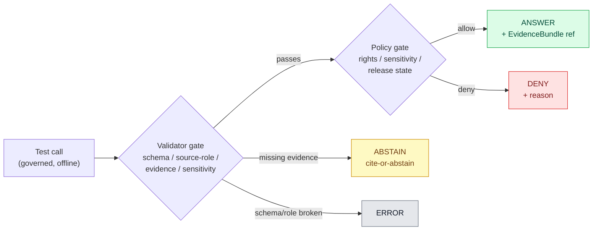

<!-- [KFM_META_BLOCK_V2]
doc_id: kfm://doc/runbook/settlements-infrastructure/no-network-test
title: No-Network Test Runbook — Settlements / Infrastructure
type: standard
version: v0.1
status: draft
owners: Docs steward + Settlements/Infrastructure subsystem owner + QA steward (PLACEHOLDER, confirm CODEOWNERS)
created: 2026-05-12
updated: 2026-05-12
policy_label: public
related:
  - docs/doctrine/directory-rules.md
  - docs/domains/settlements-infrastructure/README.md (PROPOSED, NEEDS VERIFICATION)
  - schemas/contracts/v1/domains/settlements-infrastructure/ (PROPOSED per ADR-0001)
  - tests/domains/settlements-infrastructure/ (PROPOSED)
  - fixtures/domains/settlements-infrastructure/ (PROPOSED)
  - policy/domains/settlements-infrastructure/ (PROPOSED)
  - pipelines/domains/settlements-infrastructure/ (PROPOSED)
  - tools/validators/ (PROPOSED)
  - docs/runbooks/README.md (PROPOSED, NEEDS VERIFICATION)
tags: [kfm, runbook, settlements, infrastructure, no-network, fail-closed, fixtures]
notes:
  - Path is PROPOSED per Directory Rules §12 (Domain Placement Law); confirm against mounted repo before merge.
  - All command paths PROPOSED until repo state is verified.
  - Sensitive-infrastructure fixtures must be public-safe synthetic, never real geometry.
[/KFM_META_BLOCK_V2] -->

# No-Network Test Runbook — Settlements / Infrastructure

Run the **Settlements / Infrastructure** validators, fixtures, and proof-pack drills with **all network egress blocked** so that the lane's first-slice gates (schema, source-role, evidence closure, sensitivity, policy deny, release closure) are exercised deterministically, offline, and fail-closed — before any live source is activated.


| Field | Value |
|---|---|
| **Document type** | Runbook (operational) |
| **Status** | Draft — `NEEDS VERIFICATION` against mounted repo |
| **Owners** | Docs steward + Settlements/Infrastructure subsystem owner + QA steward (PLACEHOLDER) |
| **Last updated** | 2026-05-12 |
| **Authority of doctrine cited** | `CONFIRMED` |
| **Authority of any concrete path / command** | `PROPOSED` until verified against mounted-repo evidence |
| **Lifecycle covered** | `RAW → WORK / QUARANTINE → PROCESSED → CATALOG / TRIPLET → PUBLISHED` (offline fixtures only) |

> [!IMPORTANT]
> No-network execution is a **safety property**, not a convenience. If any step in this runbook reaches the network — DNS, HTTPS, package index, model endpoint, telemetry — that is a **runbook failure**, not a test failure, and must be filed in `docs/registers/DRIFT_REGISTER.md` (PROPOSED path).

---

## Quick jump

- [1. Purpose & scope](#1-purpose--scope)
- [2. Truth labels & evidence basis](#2-truth-labels--evidence-basis)
- [3. Preconditions](#3-preconditions)
- [4. What "no-network" means here](#4-what-no-network-means-here)
- [5. Fixture inventory](#5-fixture-inventory)
- [6. Test families & expected outcomes](#6-test-families--expected-outcomes)
- [7. Runbook — the actual steps](#7-runbook--the-actual-steps)
- [8. Interpreting results](#8-interpreting-results)
- [9. Failure modes & triage](#9-failure-modes--triage)
- [10. CI integration](#10-ci-integration)
- [11. Rollback & cleanup](#11-rollback--cleanup)
- [12. Sensitivity & publication posture](#12-sensitivity--publication-posture)
- [13. Open verification items](#13-open-verification-items)
- [14. Appendix — illustrative fixtures](#14-appendix--illustrative-fixtures)
- [15. Related docs](#15-related-docs)

---

## 1. Purpose & scope

`CONFIRMED` doctrine, `PROPOSED` implementation.

The Settlements / Infrastructure lane's first deliverable is **schema-and-fixture-first**: source descriptors, deterministic identity, validators, deny policies, no-network fixtures, and proof-pack / promotion fixtures **before** any live source is activated. This runbook is the operational handle for that first slice.

It covers:

- Bringing up an **offline** test environment that cannot reach the public internet, package registries, model endpoints, or live source APIs.
- Running the **validators** (schema, source-role, evidence closure, temporal, geometry, sensitivity, policy, release).
- Driving the **fixture catalog** through the lifecycle:
  `RAW → WORK / QUARANTINE → PROCESSED → CATALOG / TRIPLET → PUBLISHED`.
- Producing a **proof pack** (receipts, validation reports, policy decisions, release manifest, rollback target) that downstream gates can consume.
- Verifying **finite outcomes** — `ANSWER`, `ABSTAIN`, `DENY`, `ERROR` — for every governed call.

It does **not** cover:

- Live-source ingestion, watcher activation, or any test that requires real authoritative APIs (KDOT, FEMA NFHL, USGS, Census TIGER, state municipal registries, utility operators, etc.). Those belong in a separate live-source runbook gated behind this one.
- Cesium / 3D rendering, MapLibre adapter component tests, or browser e2e. Map-shell tests live in `docs/runbooks/ui_VALIDATION.md` (PROPOSED path, NEEDS VERIFICATION).
- Authority-laden release decisions. Releases are governed by `release/` and the release runbook; this runbook only proves the fixtures pass the gates.

[Back to top](#no-network-test-runbook--settlements--infrastructure)

---

## 2. Truth labels & evidence basis

| Label | Use |
|---|---|
| `CONFIRMED` | Verified in the attached KFM doctrine (`directory-rules.md`, Domains Culmination Atlas ch. 14, Unified Implementation Manual §6.9, KFM Encyclopedia §K, Whole-UI Expansion Report §20). |
| `PROPOSED` | Concrete path, command, or fixture name not yet verified against a mounted repository. |
| `NEEDS VERIFICATION` | Checkable but unchecked this session — e.g., exact validator entry point, test framework, CI runner. |
| `UNKNOWN` | Not resolvable without more evidence — e.g., final auth model for governed API in this lane. |

> [!NOTE]
> Memory is not evidence. Where this runbook quotes paths like `tools/validators/...` or commands like `pytest tests/domains/settlements-infrastructure/...`, treat them as `PROPOSED` until you've confirmed them with `ls` and a grep through the mounted repo. The **shape** of the runbook is doctrine-bound; the **specific incantations** are placeholders.

### What is `CONFIRMED` doctrine

- The lifecycle invariant `RAW → WORK / QUARANTINE → PROCESSED → CATALOG / TRIPLET → PUBLISHED` and promotion as a **governed state transition, not a file move**.
- The cite-or-abstain truth posture; AI never sits at the root of truth.
- The fixture rule: every major object family must have at least one valid, one invalid, one denied, one abstention, and one rollback/correction fixture. Sensitive lanes must use public-safe transforms in place of real exact locations.
- The test catalogue named in the Encyclopedia §K: schema validation, source descriptor validation, rights validation, sensitivity validation, evidence closure, temporal logic, geometry validity, policy deny, citation validation, release manifest validation, rollback drill, **no-network fixtures**, non-regression.
- The Settlements / Infrastructure object families: `Settlement`, `Municipality`, `CensusPlace`, `Townsite`, `GhostTown`, `Fort`, `Mission`, `ReservationCommunity`, `InfrastructureAsset`, `NetworkNode`, `NetworkSegment`, `Facility`, `ServiceArea`, `Operator`, `ConditionObservation`, `Dependency`, plus `EvidenceBundle` and `ReleaseManifest`.
- The sensitivity posture: critical infrastructure, bridge/condition/inspection details, private or security-sensitive assets, and exact vulnerable facility geometry default to **policy gate, generalization, staged access, or denial**.

[Back to top](#no-network-test-runbook--settlements--infrastructure)

---

## 3. Preconditions

You need all of the following true before starting. If any item is `UNKNOWN`, stop and resolve it before running the suite — a partial run produces misleading receipts.

| # | Precondition | Verify with | Status when missing |
|---|---|---|---|
| 1 | Repository cloned at a known commit | `git rev-parse HEAD` | `ERROR` — do not proceed |
| 2 | Branch is clean (or dirty state recorded in the receipt) | `git status --short` | record in the run receipt |
| 3 | Per-root README contracts satisfied for affected lanes | manual review (§15 of Directory Rules) | `PROPOSED` |
| 4 | Schema home confirmed (`schemas/contracts/v1/domains/settlements-infrastructure/`) per **ADR-0001** | `ls schemas/contracts/v1/domains/settlements-infrastructure/` | `PROPOSED` — open ADR drift entry if absent |
| 5 | Fixture home present (`fixtures/domains/settlements-infrastructure/`) | `ls fixtures/domains/settlements-infrastructure/` | `PROPOSED` |
| 6 | Policy home present (`policy/domains/settlements-infrastructure/`) | `ls policy/domains/settlements-infrastructure/` | `PROPOSED` |
| 7 | Validator tools installed (no-network) | `tools/validators/...` is invokable from a clean shell | `PROPOSED` |
| 8 | No real secrets in `configs/test/` | `grep -R` for token patterns | **security incident** if found — escalate per `docs/runbooks/` (PROPOSED) |
| 9 | Network kill-switch active | see §4 below | hard stop |

> [!CAUTION]
> If precondition 8 fails — a real secret in `configs/` or a fixture — treat it as a security incident: **rotate, audit, and file a runbook entry**. Do **not** continue the suite until the secret is purged from git history and the new credential issued.

[Back to top](#no-network-test-runbook--settlements--infrastructure)

---

## 4. What "no-network" means here

`CONFIRMED` posture / `PROPOSED` mechanism.

"No-network" is a **deny-by-default egress posture** for the duration of the test run. The exact enforcement mechanism is environment-specific; pick **one** of the following and record which in the receipt:

1. **Container/sandbox with no networking.** Run the test container with no network namespace or with an explicit `--network none` flag (or equivalent).
2. **Egress firewall.** Block all outbound DNS, TCP, and UDP except `127.0.0.1` and the test process's UNIX sockets.
3. **Python socket guard.** A pytest plugin or `conftest.py` that monkey-patches `socket.socket` and `socket.getaddrinfo` to raise on any non-loopback address. `PROPOSED`; treat as a **defence in depth** layer, not a substitute for OS-level isolation.
4. **DNS sinkhole.** Resolve all hostnames to `127.0.0.1`. Weakest option; only acceptable layered behind one of the above.

> [!WARNING]
> A passing run under "Python socket guard" alone is **not sufficient** for a release-bearing receipt. If a validator inadvertently uses a subprocess, native extension, or HTTP client that bypasses `socket.socket`, the guard will not fire. Use OS-level isolation for any receipt that will be cited downstream.

### Egress allowlist

Loopback only. No DNS. No package install during the run.

| Destination | Permitted | Notes |
|---|---|---|
| `127.0.0.1`, `::1` | Yes | local test harness, file-backed mock catalog |
| Project workspace filesystem | Yes | fixtures and emitted artifacts |
| Public DNS / HTTPS | **No** | any hit is a runbook failure |
| Package indices (PyPI, npm, conda-forge, GHCR) | **No** | install before isolation |
| Model endpoints (Ollama remote, OpenAI, etc.) | **No** | `MockAdapter` only |
| Telemetry endpoints | **No** | record disabled state in the receipt |

[Back to top](#no-network-test-runbook--settlements--infrastructure)

---

## 5. Fixture inventory

`PROPOSED` paths / `CONFIRMED` rule: every major object family must have at least one **valid**, one **invalid**, one **denied**, one **abstention**, and one **rollback / correction** fixture. Sensitive object families must use public-safe synthetic data, never real exact geometry.

```text
fixtures/domains/settlements-infrastructure/                  # PROPOSED root
├── README.md
├── sources/
│   ├── municipal_legal_source.valid.json
│   ├── census_place_source.valid.json
│   ├── operator_source.unknown_rights.invalid.json
│   └── critical_infra_source.restricted.json
├── objects/
│   ├── settlement/
│   │   ├── valid.json
│   │   ├── invalid_missing_evidence.json
│   │   ├── denied_unreleased.json
│   │   ├── abstain_uncited.json
│   │   └── rollback_prior_lineage.json
│   ├── municipality/        # legal-source-role tests live here
│   ├── census_place/        # census-vs-municipality distinction
│   ├── townsite/
│   ├── ghost_town/
│   ├── fort/
│   ├── mission/
│   ├── reservation_community/
│   ├── infrastructure_asset/
│   ├── network_node/
│   ├── network_segment/
│   ├── facility/
│   ├── service_area/
│   ├── operator/
│   ├── condition_observation/   # observed_at temporal tests
│   └── dependency/
├── evidence/
│   ├── evidence_bundle.valid.json
│   ├── evidence_ref.unresolved.invalid.json
│   └── evidence_bundle.spec_hash_mismatch.invalid.json
├── policy/
│   ├── deny_restricted_geometry.json
│   ├── deny_unknown_rights.json
│   ├── deny_source_role_mismatch.json
│   └── allow_public_safe_aggregate.json
├── release/
│   ├── release_manifest.valid.json
│   ├── release_manifest.missing_rollback.invalid.json
│   └── rollback_card.valid.json
└── runtime/
    ├── decision_envelope.answer.valid.json
    ├── decision_envelope.abstain.valid.json
    ├── decision_envelope.deny.valid.json
    └── decision_envelope.error.valid.json
```

> [!NOTE]
> Fixtures **must be public-safe synthetic**. A fixture for `InfrastructureAsset` representing a real bridge with real coordinates is a sensitivity-leak risk even inside the repo. Use Kansas-plausible **but generated** coordinates and explicit `"synthetic": true, "do_not_release": true` markers.

[Back to top](#no-network-test-runbook--settlements--infrastructure)

---

## 6. Test families & expected outcomes

`CONFIRMED` doctrine / `PROPOSED` placement.

The following families are required for this lane. Each row is paired with the doctrine source. Place each family under `tests/domains/settlements-infrastructure/<family>/` (PROPOSED).

| # | Test family | What it asserts | Sample fixture(s) | Pass outcome |
|---|---|---|---|---|
| T-01 | **Schema validation** | Required fields and versions present per `schemas/contracts/v1/domains/settlements-infrastructure/`. | `objects/**/valid.json` | `ANSWER` |
| T-02 | **Source descriptor validation** | Source role, rights, sensitivity, citation, time, and hash recorded. | `sources/*.valid.json` | `ANSWER` |
| T-03 | **Rights validation** | Unknown rights deny release. | `sources/*.unknown_rights.invalid.json` | `DENY` |
| T-04 | **Sensitivity validation** | Critical-infrastructure / exact-facility geometry are not promoted public. | `policy/deny_restricted_geometry.json` | `DENY` |
| T-05 | **Source-role mismatch denial** | A source isn't used outside its authority (e.g., census source used to assert legal municipality). | `objects/municipality/invalid_*.json` + `objects/census_place/*` | `DENY` |
| T-06 | **Census-vs-municipality distinction** | `CensusPlace` and `Municipality` cannot be silently merged; legal status events have distinct evidence. | `objects/municipality/*`, `objects/census_place/*` | `ANSWER` (positive) / `DENY` (cross-contamination) |
| T-07 | **Infrastructure topology** | `NetworkNode` ↔ `NetworkSegment` ↔ `Facility` connectivity is consistent. | `objects/network_*/*`, `objects/facility/*` | `ANSWER` |
| T-08 | **Condition `observed_at` temporal** | `ConditionObservation` carries distinct source, observed, valid, retrieval, release, and correction times where material. | `objects/condition_observation/*` | `ANSWER` |
| T-09 | **Evidence closure** | `EvidenceRef` resolves to an `EvidenceBundle` or the call abstains. | `evidence/*.valid.json`, `evidence/evidence_ref.unresolved.invalid.json` | `ANSWER` / `ABSTAIN` |
| T-10 | **Citation validation** | Every claim that depends on evidence cites it; uncited claims abstain. | `runtime/decision_envelope.abstain.valid.json` | `ABSTAIN` |
| T-11 | **Restricted-geometry no-leak** | Public-safe layer artifacts contain no exact restricted geometry; tile/vector outputs respect generalization receipts. | `policy/deny_restricted_geometry.json` | `DENY` |
| T-12 | **Policy deny tests** | Unknown rights, unresolved source role, missing evidence, unresolved sensitivity, or absent release state **block** public promotion. | `policy/deny_*.json` | `DENY` |
| T-13 | **Catalog / proof / release closure** | `EvidenceBundle`, catalog record, `ReleaseManifest`, correction path, and rollback target all exist for a publishable candidate. | `release/release_manifest.valid.json`, `release/rollback_card.valid.json` | `ANSWER` |
| T-14 | **Release manifest validation** | Missing rollback target denies. | `release/release_manifest.missing_rollback.invalid.json` | `DENY` |
| T-15 | **Rollback drill** | Restoring a prior `ReleaseManifest` is exercised end-to-end against fixtures. | `objects/*/rollback_prior_lineage.json` | `ANSWER` |
| T-16 | **Non-regression** | Prior lineage / scaffold semantics are preserved; renamed or deprecated objects keep working aliases. | `objects/*/rollback_prior_lineage.json` | `ANSWER` |
| T-17 | **AI boundary (`MockAdapter`)** | The Focus runtime cannot answer without admissible evidence; uses `MockAdapter` only, no live model. | `runtime/decision_envelope.{answer,abstain,deny,error}.valid.json` | `ANSWER` / `ABSTAIN` / `DENY` / `ERROR` |

### Finite outcomes (recap)



> [!NOTE]
> Diagram reflects `CONFIRMED` doctrine for finite outcomes (`ANSWER` / `ABSTAIN` / `DENY` / `ERROR`). Specific validator entry points are `PROPOSED` until verified against the mounted repo.

[Back to top](#no-network-test-runbook--settlements--infrastructure)

---

## 7. Runbook — the actual steps

`PROPOSED` commands. Replace every `tools/...`, `pytest ...`, and `conftest ...` invocation below with the verified equivalent from the mounted repo's `Makefile`, `pyproject.toml`, or `package.json` scripts. Where this runbook commits to a name, treat the **shape** as authoritative and the **string** as a placeholder.

### Step 0 — Record the run header

Before isolating the network, capture the run identity so the receipt is reconstructable.

```bash
# PROPOSED — adapt to the repo's actual receipt helper.
mkdir -p data/receipts/runs/settlements-infrastructure/
cat > data/receipts/runs/settlements-infrastructure/run_header.json <<'EOF'
{
  "lane": "settlements-infrastructure",
  "run_kind": "no-network-suite",
  "isolation_mode": "<container|firewall|socket-guard|sinkhole>",
  "git_sha": "$(git rev-parse HEAD)",
  "git_dirty": "$(git status --short)",
  "started_at": "<ISO-8601 timestamp>",
  "spec_normalization_set": "v1",
  "operator": "<your handle>"
}
EOF
```

### Step 1 — Enter the offline environment

Pick one. Do not stack two enforcement modes by accident; choose explicitly.

```bash
# Option A — container with no networking (preferred)
# PROPOSED — replace image and entrypoint with the verified repo equivalents.
docker run --rm -it \
  --network none \
  -v "$PWD:/work" -w /work \
  kfm/test-runner:offline \
  bash

# Option B — host shell behind an egress firewall
# PROPOSED — the firewall recipe lives in infra/firewall/ per Directory Rules §10.2.
sudo /usr/local/bin/kfm-egress-deny
trap 'sudo /usr/local/bin/kfm-egress-restore' EXIT
```

### Step 2 — Sanity-check that the network really is down

> [!IMPORTANT]
> Do this **before** you start running anything that emits a receipt. A "passing" suite under a quietly-online environment is a worse outcome than a failing suite under a verifiably offline one.

```bash
# All three of these MUST fail or hang within a short timeout.
getent hosts example.com           ; echo "exit=$?"      # expect non-zero
python3 -c "import socket; socket.create_connection(('1.1.1.1',53),timeout=2)" ; echo "exit=$?"   # expect non-zero
curl --max-time 3 https://pypi.org ; echo "exit=$?"      # expect non-zero
```

### Step 3 — Schema and contract layer

```bash
# PROPOSED — adapt to whatever the repo actually uses (ajv / jsonschema / check-jsonschema).
tools/validators/schema/check_dir.py \
  --schema-root schemas/contracts/v1/domains/settlements-infrastructure/ \
  --fixture-root fixtures/domains/settlements-infrastructure/ \
  --emit-report data/receipts/runs/settlements-infrastructure/schema_report.json \
  --fail-on-warning
```

Expected: every `*.valid.json` passes; every `*.invalid.json` fails with a named error. Mixed results indicate fixture drift.

### Step 4 — Source descriptor, rights, and source-role tests

```bash
# T-02 / T-03 / T-05
pytest tests/domains/settlements-infrastructure/sources/ \
  -m "no_network" \
  --maxfail=0 \
  --junitxml=data/receipts/runs/settlements-infrastructure/sources.junit.xml
```

### Step 5 — Object-family suite (legal vs. census distinction, topology, observed_at)

```bash
# T-06 / T-07 / T-08
pytest tests/domains/settlements-infrastructure/objects/ \
  -m "no_network and not live_source" \
  --junitxml=data/receipts/runs/settlements-infrastructure/objects.junit.xml
```

### Step 6 — Evidence closure and citation validation

```bash
# T-09 / T-10
pytest tests/domains/settlements-infrastructure/evidence/ \
  -m "no_network" \
  --junitxml=data/receipts/runs/settlements-infrastructure/evidence.junit.xml
```

### Step 7 — Sensitivity, restricted-geometry no-leak, and policy denials

```bash
# T-04 / T-11 / T-12
conftest test \
  -p policy/domains/settlements-infrastructure/ \
  --data data/registry/sensitivity/ \
  --fixtures fixtures/domains/settlements-infrastructure/policy/ \
  --output json \
  > data/receipts/runs/settlements-infrastructure/policy.json
```

Expected: every fixture under `policy/deny_*.json` returns `deny`; `policy/allow_public_safe_aggregate.json` returns `allow`.

### Step 8 — Release manifest, rollback drill, and non-regression

```bash
# T-13 / T-14 / T-15 / T-16
pytest tests/domains/settlements-infrastructure/release/ \
  -m "no_network" \
  --junitxml=data/receipts/runs/settlements-infrastructure/release.junit.xml
```

### Step 9 — Governed-AI boundary (`MockAdapter` only)

```bash
# T-17 — Focus Mode evidence/citation/policy validation with MockAdapter.
# Live providers (Ollama, OpenAI, etc.) MUST remain disabled.
KFM_AI_PROVIDER=mock pytest tests/domains/settlements-infrastructure/runtime/ \
  -m "no_network" \
  --junitxml=data/receipts/runs/settlements-infrastructure/runtime.junit.xml
```

### Step 10 — Emit the run receipt

```bash
# PROPOSED — adapt to the repo's actual receipt builder; doctrine source: New_Ideas_5-8-26.pdf, run receipt schema.
tools/attest/scripts/make_run_receipt.py \
  --lane settlements-infrastructure \
  --inputs data/receipts/runs/settlements-infrastructure/*.{json,xml} \
  --network-mode "<container|firewall|socket-guard|sinkhole>" \
  --out data/receipts/runs/settlements-infrastructure/run_receipt.json
```

> [!NOTE]
> The receipt **must** record `network_mode`, `spec_hash`, `git_sha`, the schema-validation, policy, and release reports, and a `verdict ∈ {ANSWER, ABSTAIN, DENY, ERROR}` for the suite as a whole. Anything less is not a release-bearing receipt.

[Back to top](#no-network-test-runbook--settlements--infrastructure)

---

## 8. Interpreting results

Use the table below as the canonical reading. **Do not** promote a suite verdict on a partial run.

| Suite verdict | Means | Allowed next step |
|---|---|---|
| **`ANSWER`** | All required validators passed; all denial / abstention fixtures denied / abstained as expected; receipt is complete. | Lane is eligible for the **next gate** (review, promotion). Not "publish." |
| **`ABSTAIN`** | At least one required claim could not be supported by the present fixtures (e.g., missing `EvidenceBundle`). | Add the missing evidence fixture; rerun. Do not relax the gate. |
| **`DENY`** | A policy gate blocked release — for the right reason in negative tests, or for the wrong reason on a positive fixture. | If on a negative fixture: that is success. If on a positive fixture: triage per §9. |
| **`ERROR`** | Tooling broke (schema validator crash, network leak detected, non-deterministic serialization, hash algo drift). | Stop. File a drift entry. Receipt is **not** release-bearing. |

> [!TIP]
> A run that completes too fast is suspicious. If the test count drops between runs without a code change, your collection is silently filtering — investigate before trusting the receipt.

[Back to top](#no-network-test-runbook--settlements--infrastructure)

---

## 9. Failure modes & triage

<details>
<summary><strong>9.1 — Network leak detected (`ERROR`)</strong></summary>

**Symptom.** A test or subprocess reached a non-loopback address; the socket guard fired, or the firewall logged egress.

**Triage.**

1. Identify the call site (stack trace, audit log).
2. Quarantine the offending test until refactored to use a local fixture.
3. File a drift entry in `docs/registers/DRIFT_REGISTER.md` (PROPOSED).
4. Do **not** count this run as a passing no-network suite.

</details>

<details>
<summary><strong>9.2 — Positive fixture denied (`DENY` on `*.valid.json`)</strong></summary>

**Symptom.** A `valid.json` fixture is denied by policy.

**Triage.**

1. Inspect the denial reason in the policy report.
2. If the reason is `unknown_rights`, `sensitivity_unresolved`, `source_role_mismatch`, or `missing_evidence`, the fixture is the bug — fix the fixture.
3. If the reason is structural (schema, hash, normalization), the validator or schema is the bug — fix per ADR-required path; do not silently relax the policy.

</details>

<details>
<summary><strong>9.3 — Negative fixture accepted (`ANSWER` on `*.invalid.json`)</strong></summary>

**Symptom.** An `invalid.json` or `deny_*.json` fixture was **not** rejected.

**Triage.**

1. This is the **most dangerous** failure mode for a fail-closed system — a gate that doesn't gate.
2. Quarantine the lane from release until resolved.
3. Reproduce the validator decision on the fixture in isolation.
4. Open a drift entry. Add a regression test pinning the negative fixture's expected denial reason.

</details>

<details>
<summary><strong>9.4 — Non-deterministic <code>spec_hash</code> (`ERROR`)</strong></summary>

**Symptom.** Same logical record yields different `spec_hash` across machines or runs.

**Triage.**

1. Surface a `NormalizationError.nondeterministic_serialization` from the validator.
2. Re-canonicalize per the project's documented JSON canonicalization rule (sorted keys, UTF-8, compact separators, normalized floats).
3. Verify the hash across at least two runtimes / containers.
4. Do not publish anything depending on the affected receipt until determinism is restored.

</details>

<details>
<summary><strong>9.5 — Missing rollback target (`DENY` on release manifest)</strong></summary>

**Symptom.** `release_manifest.missing_rollback.invalid.json` rightly denies; a previously-passing manifest now denies for the same reason.

**Triage.**

1. Verify the rollback card exists and is reachable from the release manifest.
2. If the prior release omitted rollback, treat as a `CONFIRMED` invariant violation and open a correction notice rather than relaxing the gate.

</details>

[Back to top](#no-network-test-runbook--settlements--infrastructure)

---

## 10. CI integration

`PROPOSED`. Wire the suite into CI as a **required check** for any PR touching `schemas/contracts/v1/domains/settlements-infrastructure/`, `policy/domains/settlements-infrastructure/`, `fixtures/domains/settlements-infrastructure/`, `pipelines/domains/settlements-infrastructure/`, or `release/candidates/settlements-infrastructure/`.

```yaml
# .github/workflows/settlements-infrastructure-no-network.yml   (PROPOSED)
name: settlements-infrastructure / no-network
on:
  pull_request:
    paths:
      - "schemas/contracts/v1/domains/settlements-infrastructure/**"
      - "policy/domains/settlements-infrastructure/**"
      - "fixtures/domains/settlements-infrastructure/**"
      - "tests/domains/settlements-infrastructure/**"
      - "pipelines/domains/settlements-infrastructure/**"
      - "release/candidates/settlements-infrastructure/**"
  push:
    branches: [main]

jobs:
  no-network:
    runs-on: ubuntu-latest
    timeout-minutes: 20
    container:
      image: kfm/test-runner:offline   # PROPOSED — replace with verified image
      options: --network none           # ENFORCE no-network at the container layer
    steps:
      - uses: actions/checkout@v4
      - name: Verify network is denied
        run: |
          ! getent hosts example.com
          ! python3 -c "import socket; socket.create_connection(('1.1.1.1',53),timeout=2)"
      - name: Run no-network suite
        run: bash docs/runbooks/settlements-infrastructure/no_network_suite.sh   # PROPOSED
      - name: Upload receipt
        if: always()
        uses: actions/upload-artifact@v4
        with:
          name: run_receipt
          path: data/receipts/runs/settlements-infrastructure/run_receipt.json
```

> [!IMPORTANT]
> The `--network none` container option is the **enforcement** of the no-network contract. Any test framework that requires network access at install time must perform the install in a **previous** layer / step, with isolation switched on **after** install. If install is the bottleneck, that is an `infra/` problem, not a runbook problem.

[Back to top](#no-network-test-runbook--settlements--infrastructure)

---

## 11. Rollback & cleanup

This runbook does not publish anything by itself; rollback here means **restoring the developer environment** and **discarding any partial receipts** that would otherwise be misleading.

| Condition | Action |
|---|---|
| Suite ended in `ANSWER` | Keep receipt under `data/receipts/runs/settlements-infrastructure/`. Optionally promote into `data/receipts/published/...` per the release runbook. |
| Suite ended in `ABSTAIN` / `DENY` on a negative fixture | Keep receipt; it is a valid record of a working gate. |
| Suite ended in `ERROR` or network leak | **Delete or quarantine** the receipt; do not let it be cited downstream. File a drift entry. |
| Containerized run | `docker rm` the test container; nothing to undo on the host. |
| Host firewall run | Restore egress with the `trap` handler from §7 Step 1; verify with `getent hosts example.com`. |
| Socket-guard run | No host changes; ensure the next shell session does not inherit the guard. |

> [!CAUTION]
> Do not "fix" a failing no-network run by allowing network access "just for this PR." The next PR will inherit a hole that nobody documented. If a fixture genuinely cannot be made offline, the fixture is in the wrong runbook.

[Back to top](#no-network-test-runbook--settlements--infrastructure)

---

## 12. Sensitivity & publication posture

`CONFIRMED` doctrine.

The Settlements / Infrastructure lane carries elevated sensitivity. Even **inside** offline fixtures, treat real-world exact geometry, condition reports, inspection details, operator records, and dependency graphs of utility / public-safety / critical infrastructure as **review-restricted**.

- **No real exact geometry in fixtures.** Use synthetic Kansas-plausible coordinates and explicit `"synthetic": true, "do_not_release": true` markers.
- **No living-person data, no archaeological coordinates, no rare-species locations** from sibling lanes leaking through cross-relations. The cross-lane relations (Roads/Rail, Hazards, Hydrology, People/Land) are defined in doctrine but constrained to ownership-preserving relations only.
- **Public-safe outputs only.** The PUBLISHED stage emits aggregate views, service-area summaries, public-safe asset views — never restricted internal review views. Restricted views may exist in fixtures but **must** be denied by policy when promoted.
- **Unknown rights, unresolved source role, missing evidence, unresolved sensitivity, or absent release state blocks public promotion.** This is `CONFIRMED` doctrine and is enforced by Step 7 of the runbook.

> [!WARNING]
> A passing no-network suite is necessary but **not sufficient** for publication. It exercises the gates; it does not stand in for steward review, rights review, sensitivity review, or release sign-off.

[Back to top](#no-network-test-runbook--settlements--infrastructure)

---

## 13. Open verification items

These items are `NEEDS VERIFICATION` against the mounted repository. The runbook is operational once each is resolved; until then, treat the commands as `PROPOSED`.

| # | Item | What would settle it |
|---|---|---|
| OV-01 | Confirm `schemas/contracts/v1/domains/settlements-infrastructure/` is the canonical schema home (per ADR-0001). | Mounted-repo inspection; ADR file. |
| OV-02 | Confirm test home `tests/domains/settlements-infrastructure/` and the `no_network` pytest marker exist. | `pytest --collect-only -m no_network`. |
| OV-03 | Confirm fixture home and the five-fixture rule (valid / invalid / denied / abstain / rollback) per object family. | Repository scan; fixture coverage report. |
| OV-04 | Confirm policy home `policy/domains/settlements-infrastructure/` and the conftest invocation pattern. | Mounted-repo inspection. |
| OV-05 | Confirm validator entry points (schema, source descriptor, evidence closure, release manifest). | Repository scan of `tools/validators/`. |
| OV-06 | Confirm the `MockAdapter` is wired and that `KFM_AI_PROVIDER=mock` is the correct env var. | Mounted-repo inspection of `runtime/mock/`. |
| OV-07 | Confirm the CI image `kfm/test-runner:offline` (or its real equivalent) and the workflow path. | `.github/workflows/`. |
| OV-08 | Confirm the run-receipt builder path and field set. | `tools/attest/` inspection. |
| OV-09 | Confirm whether the runbook's path (`docs/runbooks/settlements-infrastructure/`) or a flat alternative (`docs/runbooks/settlements-infrastructure_NO_NETWORK_TEST_RUNBOOK.md`) is the project's adopted convention. | `docs/runbooks/README.md`; PR review. |
| OV-10 | Confirm whether a per-domain `docs/runbooks/<domain>/README.md` index is required by the runbooks-folder contract. | `docs/runbooks/README.md`. |

[Back to top](#no-network-test-runbook--settlements--infrastructure)

---

## 14. Appendix — illustrative fixtures

> [!NOTE]
> These are **illustrative** shapes drawn from KFM doctrine. They are **not** drawn from the mounted repo and must be reconciled with the actual schemas at `schemas/contracts/v1/domains/settlements-infrastructure/` before use. Fields with `...` are abbreviated.

<details>
<summary><strong>14.1 — <code>SourceDescriptor</code> (valid, public)</strong></summary>

```json
{
  "schema_version": "v1",
  "object_type": "SourceDescriptor",
  "source_id": "src.kansas.municipal.legal.synthetic.001",
  "source_role": "legal",
  "rights_status": "public",
  "rights_spdx": "CC0-1.0",
  "sensitivity": "public",
  "citation": "Synthetic municipal legal source — fixture, do not release",
  "coverage_scope": "KS",
  "times": {
    "source_time": "2024-06-01",
    "observed_at": "2024-06-01",
    "retrieved_at": "2026-05-12T00:00:00Z"
  },
  "content_hash": "sha256:0000...",
  "spec_hash": "sha256:0000...",
  "synthetic": true,
  "do_not_release": true
}
```
</details>

<details>
<summary><strong>14.2 — <code>InfrastructureAsset</code> (denied — restricted geometry)</strong></summary>

```json
{
  "schema_version": "v1",
  "object_type": "InfrastructureAsset",
  "asset_kind": "bridge",
  "geometry_precision": "exact",
  "sensitivity": "restricted",
  "rights_status": "unknown",
  "evidence_ref": null,
  "synthetic": true,
  "do_not_release": true,
  "_expected_outcome": "DENY",
  "_expected_reasons": ["sensitivity_restricted", "rights_unknown", "missing_evidence"]
}
```
</details>

<details>
<summary><strong>14.3 — <code>EvidenceRef</code> (unresolved → ABSTAIN)</strong></summary>

```json
{
  "schema_version": "v1",
  "object_type": "EvidenceRef",
  "ref_id": "evref.settle.synthetic.unresolved",
  "spec_hash": "sha256:1111...",
  "_expected_outcome": "ABSTAIN",
  "_expected_reasons": ["evidence_bundle_missing"]
}
```
</details>

<details>
<summary><strong>14.4 — <code>DecisionEnvelope</code> shapes (one per outcome)</strong></summary>

```json
[
  {"outcome": "ANSWER",  "answer": "...", "citations": ["evref.settle.synthetic.valid"], "policy_decision": "allow"},
  {"outcome": "ABSTAIN", "reason": "missing_evidence"},
  {"outcome": "DENY",    "reason": "sensitivity_restricted", "remediation": "request_steward_review"},
  {"outcome": "ERROR",   "error_kind": "non_deterministic_serialization"}
]
```
</details>

[Back to top](#no-network-test-runbook--settlements--infrastructure)

---

## 15. Related docs

- `docs/doctrine/directory-rules.md` — placement law for runbooks and lanes.
- `docs/architecture/settlements-infrastructure/README.md` — lane architecture (`PROPOSED`, `NEEDS VERIFICATION`).
- `docs/domains/settlements-infrastructure/README.md` — domain dossier (`PROPOSED`).
- `docs/runbooks/README.md` — runbooks index and contract (`PROPOSED`).
- `docs/runbooks/release_RUNBOOK.md` — release flow this runbook feeds (`PROPOSED`).
- `docs/runbooks/rollback_RUNBOOK.md` — rollback flow this runbook references (`PROPOSED`).
- `docs/runbooks/governed_ai_VALIDATION.md` — `MockAdapter` boundary for T-17 (`PROPOSED`).
- `docs/adr/ADR-0001-schema-home.md` — schema home authority (`PROPOSED` reference name).
- `docs/registers/DRIFT_REGISTER.md` — where drift entries land (`PROPOSED`).
- `docs/registers/VERIFICATION_BACKLOG.md` — where OV-01 … OV-10 are tracked (`PROPOSED`).

---

**Last updated:** 2026-05-12 · **Doctrine status:** `CONFIRMED` · **Implementation status:** `PROPOSED` / `NEEDS VERIFICATION` · [Back to top](#no-network-test-runbook--settlements--infrastructure)
