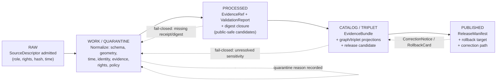
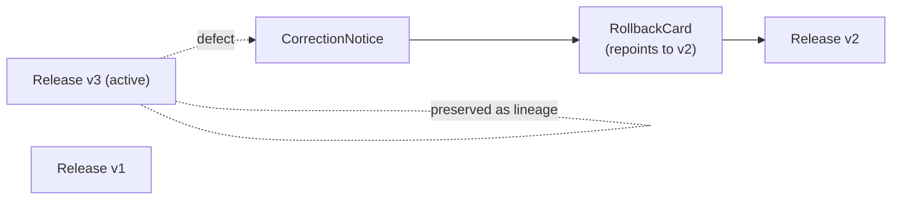

<!-- [KFM_META_BLOCK_V2]
doc_id: kfm://doc/runbook-settlements-infrastructure-promotion
title: Settlements & Infrastructure — Promotion Runbook
type: standard
version: v0.1
status: draft
owners: <docs steward + Settlements/Infrastructure lane owner — NEEDS VERIFICATION>
created: 2026-05-12
updated: 2026-05-12
policy_label: public
related:
  - docs/domains/settlements-infrastructure/README.md
  - docs/doctrine/directory-rules.md
  - docs/doctrine/lifecycle-law.md
  - docs/doctrine/trust-membrane.md
  - contracts/release/promotion_decision.md
  - contracts/release/release_manifest.md
  - schemas/contracts/v1/release/
  - policy/promotion/
  - policy/domains/settlements-infrastructure/
  - release/candidates/settlements-infrastructure/
tags: [kfm, runbook, promotion, settlements, infrastructure, governance, fail-closed]
notes:
  - All repo-specific paths are PROPOSED until verified against mounted-repo evidence.
  - Doctrine claims are CONFIRMED from the KFM corpus; lane application is PROPOSED.
[/KFM_META_BLOCK_V2] -->

<a id="top"></a>

# Settlements & Infrastructure — Promotion Runbook

> Step-by-step operational procedure for promoting Settlements / Infrastructure objects through the KFM lifecycle — **RAW → WORK / QUARANTINE → PROCESSED → CATALOG / TRIPLET → PUBLISHED** — under evidence-first, fail-closed governance.

<p align="center">
  <b>Evidence-first · Cite-or-Abstain · Promotion is a governed state transition, not a file move</b>
</p>


| Field | Value |
|---|---|
| **Doc class** | Standard / Operational Runbook |
| **Authority** | Doctrine claims **CONFIRMED**; lane-specific implementation paths **PROPOSED / NEEDS VERIFICATION** |
| **Owners** | Docs steward + Settlements / Infrastructure lane owner *(NEEDS VERIFICATION — populate from `CODEOWNERS`)* |
| **Reviewers required** | Release manager · Domain steward · Policy admin *(per Master Action Matrix)* |
| **Last reviewed** | 2026-05-12 |
| **Supersedes** | None — first lane-specific promotion runbook |

> [!IMPORTANT]
> **Promotion is a governed state transition, not a file move.** No object reaches `PUBLISHED` without an explicit `PromotionDecision`, a verifiable evidence chain, a passing policy gate, a `ReleaseManifest`, and a recorded rollback target. If any required artifact is missing or unverifiable, the gate **MUST** fail closed.

---

## Quick Links

- [1. Purpose & Scope](#1-purpose--scope)
- [2. Doctrinal Anchors](#2-doctrinal-anchors)
- [3. Domain Scope & Sensitivity Posture](#3-domain-scope--sensitivity-posture)
- [4. Lifecycle Pipeline](#4-lifecycle-pipeline)
- [5. Promotion Gates A–G — Domain Application](#5-promotion-gates-ag--domain-application)
- [6. Sensitive / Deny-by-Default Register (Lane Slice)](#6-sensitive--deny-by-default-register-lane-slice)
- [7. Procedure — RAW to PUBLISHED](#7-procedure--raw-to-published)
- [8. Validators, Fixtures, and CI Hooks](#8-validators-fixtures-and-ci-hooks)
- [9. Decision Envelope & Receipt Shapes](#9-decision-envelope--receipt-shapes)
- [10. Correction, Rollback, and Stale-State](#10-correction-rollback-and-stale-state)
- [11. Negative-Path Catalog (Fail-Closed Examples)](#11-negative-path-catalog-fail-closed-examples)
- [12. FAQ & Common Pitfalls](#12-faq--common-pitfalls)
- [13. Open Verification Backlog](#13-open-verification-backlog)
- [14. Related Documents](#14-related-documents)
- [Appendix A — Object Family Inventory](#appendix-a--object-family-inventory)
- [Appendix B — Cross-Lane Relations](#appendix-b--cross-lane-relations)
- [Appendix C — Glossary](#appendix-c--glossary)

---

## 1. Purpose & Scope

This runbook is the operational procedure for moving Settlements / Infrastructure objects from admitted source material to released public-safe artifacts. It exists so that any reviewer, steward, release manager, or domain editor can execute and audit a promotion without re-deriving doctrine from scratch.

**In scope.** The lifecycle path for objects owned by the Settlements / Infrastructure lane, the gate set that must be satisfied at each stage, the sensitivity posture that constrains what can become public-safe, and the receipts and manifests emitted along the way.

**Out of scope.** Source-descriptor authoring (see `docs/sources/`), schema authoring (see `schemas/`), policy authoring (see `policy/`), and cross-lane relation governance (touched only where it gates this domain's promotion). Transport routes are owned by Roads / Rail; hydrologic evidence by Hydrology; living-person and parcel ownership data by People / Land; hazard events and warnings by Hazards. *(CONFIRMED non-ownership boundaries; status **CONFIRMED**.)*

> [!NOTE]
> This is a **lane-specific** runbook. Cross-cutting promotion mechanics — receipt schema, DSSE / cosign signing, OPA bundle digest pinning, two-key approval — live in the repo-wide promotion runbook and policy documents. This file specializes those mechanics to the Settlements / Infrastructure objects, gates, and sensitivity defaults.

---

## 2. Doctrinal Anchors

Promotion in this lane inherits the following invariants. They are **CONFIRMED** from the KFM corpus and are non-negotiable.

| Invariant | Source | Effect on this runbook |
|---|---|---|
| Lifecycle law: `RAW → WORK / QUARANTINE → PROCESSED → CATALOG / TRIPLET → PUBLISHED` | Directory Rules; Encyclopedia | Every stage in §4 is a state, not a folder destination. |
| Promotion is a governed state transition, not a file move | Directory Rules | `PromotionDecision` is the unit of work, not a `git mv`. |
| Cite-or-abstain truth posture | Encyclopedia; Governed AI doctrine | An `EvidenceRef` MUST resolve to an `EvidenceBundle` before public claim authority. |
| Trust membrane | Directory Rules; Whole-UI report | Public clients consume governed APIs and released artifacts only — never `RAW`, `WORK`, `QUARANTINE`, canonical stores, or unverified candidates. |
| Fail-closed defaults | Master Action Matrix; Pass 10 (C5-02) | Absence of evidence, rights, or release state blocks promotion. |
| Promotion Gate Matrix **A–G** | Pass 10 (C5-01) | Seven named gates; auto-merge fires only when all seven pass. |
| Critical infrastructure default to restricted / review | Settlements dossier; Encyclopedia §13 | Exact facility geometry, conditions, dependencies, operator-sensitive details are restricted by default. |
| Two-key separation of duties for release | Master Action Matrix | Domain steward + release manager (where maturity justifies). |

---

## 3. Domain Scope & Sensitivity Posture

### 3.1 Owned object families (CONFIRMED doctrine; PROPOSED schema realization)

`Settlement` · `Municipality` · `CensusPlace` · `Townsite` · `GhostTown` · `Fort` · `Mission` · `ReservationCommunity` · `InfrastructureAsset` · `NetworkNode` · `NetworkSegment` · `Facility` · `ServiceArea` · `Operator` · `ConditionObservation` · `Dependency` · `AnnexationEvent` · `UrbanGrowthObservation`

### 3.2 Explicit non-ownership

| Object class | Owning lane |
|---|---|
| Transport routes / rail lines / trade corridors | Roads / Rail |
| Surface and groundwater evidence | Hydrology |
| Hazard events, declarations, warnings | Hazards |
| Living-person data, parcel ownership, residence ties | People / Land |

### 3.3 Default sensitivity posture (CONFIRMED)

> [!WARNING]
> **Critical infrastructure, utilities, condition observations, dependencies, operator-sensitive details, and exact facility geometry default to `RESTRICTED` or `REVIEW`.** Unclear rights, unresolved source role, missing evidence, unresolved sensitivity, or absent release state **blocks public promotion** outright.

The default-restricted classes most often hit in this lane:

- Exact geometry of vulnerable facilities (water, wastewater, energy, communications, transport-critical bridges).
- Condition observations and inspection records.
- Dependency relations that map cascading failure surfaces.
- Operator identity and contact details when rights are unclear.

Public-safe outputs in this lane are typically: settlement timelines, place-identity reconciliation, public-safe asset views (generalized), service-area aggregates without precise node enumeration, and historic-place views where rights are clear.

---

## 4. Lifecycle Pipeline

The lifecycle below is **CONFIRMED doctrine**; the specific gate artifacts and validators referenced are **PROPOSED** until verified against mounted-repo evidence.



| Stage | Required input | Gate condition | Emitted artifact(s) | Status |
|---|---|---|---|---|
| **RAW** | Immutable source payload (or reference) under approved `SourceDescriptor`: role, rights, sensitivity, citation, time, hash. | `SourceDescriptor` exists and is admissible. | `RawCaptureReceipt`, `RunReceipt` | PROPOSED implementation |
| **WORK / QUARANTINE** | RAW reference. Apply normalization for schema, geometry, time, identity, evidence, rights, and policy. | Validation + policy gate pass — **or** quarantine reason recorded. | `ValidationReport`, quarantine record | PROPOSED implementation |
| **PROCESSED** | Validated normalized objects, public-safe candidates. | `EvidenceRef` resolves to `EvidenceBundle`; `ValidationReport` clean; digest closure holds. | `RunReceipt`, `ValidationReport`, `EvidenceBundle` candidate | PROPOSED implementation |
| **CATALOG / TRIPLET** | Processed candidates. | Catalog / proof closure passes; graph/triplet projections produced; release candidate assembled. | `EvidenceBundle`, catalog records, release candidate | PROPOSED implementation |
| **PUBLISHED** | Approved release candidate. | `ReleaseManifest`, review state (where required), correction path, rollback target all exist; release-gate policy passes. | `ReleaseManifest`, `PromotionDecision`, `RollbackCard` | PROPOSED implementation |

---

## 5. Promotion Gates A–G — Domain Application

The seven-gate matrix is **CONFIRMED** from the KFM corpus (Pass 10 §C5-01). The table below specializes each gate to settlements / infrastructure concerns. The check column points to the *kind* of machinery that satisfies the gate; concrete tool names, policy bundle paths, and CI workflow IDs are **PROPOSED** until verified against the mounted repo.

| Gate | Human intent | Machine check (general) | Settlements / Infrastructure specialization |
|---|---|---|---|
| **A — Structure & Metadata** | MetaBlock present; zone correctness | `check_structure` | Doc / artifact carries KFM Meta Block; object identifiers map to permitted families (§3.1); temporal fields populated. |
| **B — Schemas & Contracts** | Object shape valid | JSON Schema + OpenAPI validation against `schemas/contracts/v1/...` | `Settlement`, `InfrastructureAsset`, `ConditionObservation`, etc. validate against their `schemas/contracts/v1/domains/settlements-infrastructure/*.schema.json` (**PROPOSED** path). |
| **C — Policy Parity** | CI policy equals runtime policy | Conftest / OPA decisions against pinned `policy-bundle.json` | `policy/domains/settlements-infrastructure/` bundle digest matches the runtime PDP digest; admissions evaluated identically. |
| **D — Security & Sensitivity** | Sensitivity, rights, and license posture acceptable | Sensitivity scan; SPDX allowlist; geoprivacy transform check | Critical-infrastructure precision-class enforced; exact facility geometry blocked from public payloads unless explicit release support recorded; operator identity gated. |
| **E — Data Quality** | Profilers / assertions meet thresholds | DQ profilers + threshold assertions | Place-identity reconciliation passes; census-vs-municipality distinction holds; topology assertions on networks/nodes/segments; `observed_at` present on `ConditionObservation`. |
| **F — Provenance & Lineage** | Receipt + lineage validate | Receipt validator + OpenLineage events | `RunReceipt` is cosign-verifiable; `EvidenceRef → EvidenceBundle` resolves; source role distinctions (legal vs. census vs. modeled vs. historic) preserved. |
| **G — Reviewability** | Two-key human approval | CODEOWNERS-enforced human approval + policy approval | Domain steward + release manager sign-off; restricted-class objects require additional sensitivity-review record. |

> [!TIP]
> The promotion gate is **fail-closed by construction**: any missing required field, unverifiable signature, absent Rekor proof, or undefined policy label blocks promotion and sets the candidate to `QUARANTINE` with reason. Treat ambiguous gate output as a deny.

---

## 6. Sensitive / Deny-by-Default Register (Lane Slice)

This is the Settlements / Infrastructure slice of the cross-cutting Sensitive Register (CONFIRMED doctrine; specific identifiers are **PROPOSED** placeholders until inventoried).

| Class | Examples | Default outcome | Required controls |
|---|---|---|---|
| Critical infrastructure | Exact facilities, dependency relations, condition observations | `RESTRICT` / `DENY` public precision | Public-safe aggregation; role-based access; geoprivacy transform receipt |
| Operator-sensitive | Operator identity / contacts when rights unclear | `DENY` public | Rights register; attribution; no public derivative if barred |
| Vulnerable-facility geometry | Pump stations, substations, choke-point bridges | `DENY` exact point publicly | Generalization to service area; sensitivity transform receipt |
| Cross-lane spillover (archaeology, living-person, sacred) | Fort sites with cultural overlay; reservation-community residence ties | Defer to owning lane's deny rules | Cultural / privacy review; staged access; suppression |
| Source-rights-limited records | Licensed municipal records, no-redistribution feeds | `DENY` public release until terms resolved | Rights register entry; rights-checked attribution |

---

## 7. Procedure — RAW to PUBLISHED

The procedure below is the **operational ordering** of work for a single object family (e.g., `InfrastructureAsset`) advancing through the lifecycle. Multiple object families in a release candidate are advanced together only after each has satisfied gates A–F individually; gate G binds them at release time.

### 7.1 Pre-flight (before opening a promotion PR)

1. **Confirm the source descriptor exists.** Verify `SourceDescriptor` is admitted under an approved source role (e.g., Census/TIGER, GNIS, state/local GIS, municipal records, historical gazetteer, operator record). If unclear, halt and resolve via `docs/sources/SOURCE_DESCRIPTOR_STANDARD.md`. *(PROPOSED path; NEEDS VERIFICATION.)*
2. **Confirm rights and sensitivity classification.** Look up the source in the rights register; classify the candidate against §6. If any class is unresolved → **STOP, quarantine, escalate to policy admin.**
3. **Confirm schema home.** Each emitted object must validate against a schema under `schemas/contracts/v1/domains/settlements-infrastructure/`. *(PROPOSED per Directory Rules §6.4 and ADR-0001; verify the schema exists before continuing.)*
4. **Confirm policy bundle pin.** Note the digest of `policy/domains/settlements-infrastructure/` in the PR description. *(PROPOSED path.)*

### 7.2 RAW → WORK / QUARANTINE

1. Run the ingest connector under its `SourceDescriptor`. Emit `RawCaptureReceipt` and `RunReceipt` (signed, cosign-verifiable).
2. Apply normalization: schema validation, geometry repair, temporal alignment, identity assignment using the proposed deterministic basis (`source_id + object_role + temporal_scope + normalized_digest`).
3. If any normalizer fails, route the candidate to `QUARANTINE` with a recorded reason. **Do not silently retry; do not promote.**
4. Run policy gate **C (Policy Parity)** against the WORK candidate. Any deny outcome → keep in `QUARANTINE`, emit `DecisionEnvelope { outcome: "DENY", reasons: [...] }`.

### 7.3 WORK → PROCESSED

1. Confirm `EvidenceRef` resolves to a complete `EvidenceBundle` (no dangling refs).
2. Confirm `ValidationReport` is clean — including lane-specific checks: legal-municipality evidence, census-vs-municipality distinction, infrastructure topology coherence, `ConditionObservation.observed_at` present.
3. Confirm **digest closure**: re-canonicalize the spec, recompute hash, compare to the `RunReceipt.spec_hash` field.
4. Mark the object family `PROCESSED`. Public-safe candidates may now be derived; they are **not yet published**.

### 7.4 PROCESSED → CATALOG / TRIPLET

1. Assemble the `EvidenceBundle` for each object, attaching: source descriptors, validation report, run receipts, policy decisions, sensitivity transforms (with receipt), rights statement.
2. Run **restricted-geometry no-leak** assertions on any derived public-safe layer. Failure here is a hard fail-closed — exact precision must never reach a publishable artifact unless explicit release support is recorded.
3. Emit graph/triplet projections, taking care to preserve source-role distinctions across cross-lane edges (see Appendix B).
4. Assemble the release candidate. The candidate references the bundle by digest; it does not copy it.

### 7.5 CATALOG / TRIPLET → PUBLISHED

1. Run gate **G (Reviewability)**. Obtain two-key approval: domain steward + release manager. For any restricted-class object reaching this stage with explicit release support, attach the `ReviewRecord` reference.
2. Build the `ReleaseManifest`. It MUST bind: digests, evidence bundle reference, policy posture, sensitivity posture, rights status, review record, correction path, and **rollback target** (the prior release manifest reference).
3. Verify signatures end-to-end. Re-verify the receipt envelope; verify the `ReleaseManifest` signature; confirm Rekor proof is present.
4. Emit `PromotionDecision { outcome: "ANSWER", gate: "G.publish", spec_hash, attestation_ref, manifest_ref }`.
5. Publish through the governed API surface (e.g., the Settlements / Infrastructure feature/detail resolver, the layer manifest resolver). Never expose canonical or `RAW` stores directly. *(Routes **PROPOSED**; concrete route names UNKNOWN until verified.)*
6. Record the published artifact in `data/published/layers/settlements-infrastructure/` (or equivalent — **PROPOSED** path per Directory Rules §4 Step 3).

### 7.6 Post-publication

1. Open the release in the weekly material-change report (Friday cadence).
2. Confirm the new release is referenced in `release/candidates/settlements-infrastructure/` history (or equivalent — **PROPOSED**).
3. Add an entry to the lane's correction-path register so a future `CorrectionNotice` has a defined return path.

[⬆ Back to top](#top)

---

## 8. Validators, Fixtures, and CI Hooks

The validator and fixture list is **PROPOSED** for this lane per the Settlements / Infrastructure dossier (§K). Concrete file paths, tool names, and CI workflow IDs are **NEEDS VERIFICATION** until checked against the mounted repo.

### 8.1 Required validator families

- **Legal-municipality evidence tests** — verify that any object labeled `Municipality` carries the source-role evidence and temporal scope required for legal status assertions.
- **Census-vs-municipality distinction** — block conflation of `CensusPlace` and `Municipality`; assert source-role separation.
- **Infrastructure topology tests** — verify `NetworkSegment` endpoints resolve to declared `NetworkNode` ids; no orphan segments.
- **Condition `observed_at` tests** — every `ConditionObservation` carries an `observed_at` timestamp distinct from retrieval / release time.
- **Restricted-geometry no-leak tests** — assert that public-safe layers contain no exact-precision points from restricted classes.
- **Catalog / proof / release closure tests** — for any release candidate, every referenced bundle, receipt, and policy decision exists and verifies.

### 8.2 Negative fixtures (expected DENY)

| Fixture | Expected outcome | Why |
|---|---|---|
| `missing_spec_hash.json` | `DENY` | Receipt cannot bind candidate to inputs. |
| `unresolved_evidence.json` | `DENY` | `EvidenceRef` does not resolve. |
| `restricted_exact_geometry.json` | `DENY` | Public-safe candidate contains exact restricted-class point. |
| `stale_evidence.json` | `DENY` | Bundle exceeds staleness threshold. |
| `unknown_policy_label.json` | `DENY` | Policy label not defined in access policy. |
| `publication_before_review.json` | `DENY` | Restricted object reached release without `ReviewRecord`. |
| `census_promoted_as_municipality.json` | `DENY` | Source-role conflation. |
| `orphan_network_segment.json` | `DENY` | Topology invariant violated. |
| `missing_observed_at_on_condition.json` | `DENY` | Temporal invariant violated. |

### 8.3 CI ordering (recommended)

> [!NOTE]
> Recommended ordering, drawn from KFM doctrine. Concrete workflow names are **PROPOSED**.

1. `opa fmt --fail .` and `opa check .` — policy lint before evaluation.
2. JSON Schema validation against `schemas/contracts/v1/...`.
3. Policy unit tests.
4. Negative-path fixtures (§8.2).
5. Promotion dry-run (`conftest test receipts/promotion_input.json --policy policy/`).
6. Release-manifest validation.
7. Cosign signature verification on `RunReceipt` and `ReleaseManifest`.

---

## 9. Decision Envelope & Receipt Shapes

The shapes below are **CONFIRMED grammar** (ANSWER / ABSTAIN / DENY / ERROR) with **PROPOSED** field realization. Treat field names as illustrative until verified against the schemas.

### 9.1 `DecisionEnvelope` (promotion-gate output)

```json
{
  "decision_id": "dec-2026-05-12-001",
  "outcome": "DENY",
  "policy_family": "promotion",
  "gate": "D.security_sensitivity",
  "domain": "settlements-infrastructure",
  "reasons": [
    "restricted_exact_geometry",
    "missing_sensitivity_transform_receipt"
  ],
  "obligations": [
    { "type": "hold", "op": "steward_review" },
    { "type": "transform", "op": "generalize_to_service_area" }
  ],
  "evidence_refs": ["evbundle://settle-asset-117@v3"],
  "evaluated_at": "2026-05-12T00:00:00Z"
}
```

### 9.2 Minimal `decision_log` entry (CI emit)

```json
{
  "decision_id": "<uuid>",
  "policy_id": "gate.D.security_sensitivity",
  "spec_hash": "<sha256>",
  "input_digest": "<sha256>",
  "result": "deny",
  "obligations": ["steward_review"],
  "evidence_refs": ["evbundle://settle-asset-117@v3"],
  "timestamp": "<ISO8601>",
  "job_run_id": "<CI_RUN_ID>"
}
```

> [!CAUTION]
> Use `decision_id` as the join key across OPA decision logs, `RunReceipt`, attestations, and the published manifest. Streaming each gate event as JSONL into an append-only audit ledger is the recommended pattern; tampering with the chain breaks rollback drill replay.

---

## 10. Correction, Rollback, and Stale-State

### 10.1 Correction

When a published Settlements / Infrastructure artifact is found to be wrong (data error, source revocation, sensitivity reclassification, rights change):

1. Open a `CorrectionNotice` referencing the offending `ReleaseManifest` by digest.
2. Determine whether the fix is **forward-only** (issue a new release) or **rollback-required** (the current release is unsafe to leave in place).
3. For rollback-required corrections, also issue a `RollbackCard` (§10.2).
4. Re-run gates A–G on the corrected candidate. **A correction does not bypass gates.**

### 10.2 Rollback

Rollback **repoints current release state**. The prior published artifact is preserved as lineage; the active manifest pointer moves backward to a known-good `ReleaseManifest`.



> [!WARNING]
> Rollback **MUST** be drillable. Replay verification must demonstrate that the prior root hash and manifest are recoverable. Untested rollback paths are not rollback paths.

### 10.3 Stale-state

Settlements / Infrastructure objects degrade differently:

- `Municipality` boundary changes via `AnnexationEvent` → republish required.
- `ConditionObservation` ages → mark `stale` after the lane-specific window (NEEDS VERIFICATION).
- `Operator` rights renewal lapses → demote to `RESTRICTED` until renewed.

Stale-state badging is a cross-cutting viewing concern (`Evidence Drawer`, trust badges). The runbook's responsibility is to **trigger republication** when staleness thresholds are crossed.

---

## 11. Negative-Path Catalog (Fail-Closed Examples)

> [!IMPORTANT]
> Each row below is a documented refusal pattern. The promotion attempt is **denied**; the reviewer's job is not to soften the deny but to remediate the underlying gap.

| Scenario | Failing gate | Required remediation |
|---|---|---|
| Operator-sensitive details in a public-safe layer payload | D (Security & Sensitivity) | Remove operator identity; re-derive public-safe view; attach sensitivity transform receipt. |
| `Municipality` claim asserted from a single census-derived source | F (Provenance & Lineage) | Add a legal-municipality source; re-resolve `EvidenceRef`; rerun census-vs-municipality validator. |
| `NetworkSegment` referencing missing `NetworkNode` | E (Data Quality) | Repair topology in WORK; re-run topology validator; do not promote until clean. |
| `ConditionObservation` without `observed_at` | E (Data Quality) | Reject candidate; revisit normalizer; ensure temporal extraction from source. |
| `ReleaseManifest` produced without a `rollback target` | G (Reviewability) + release-gate policy | Block release; add explicit rollback target; rerun release-manifest validation. |
| Promotion candidate using a `policy_label` undefined in access policy | C (Policy Parity) | Define the label in access policy; refresh policy bundle digest; rerun parity check. |
| Object family attempted via direct file move into `data/published/` | Lifecycle invariant | Reject the PR; promotion is a state transition, not a file move. |

---

## 12. FAQ & Common Pitfalls

<details>
<summary><b>Can I promote a "low-risk" infrastructure asset without a sensitivity transform receipt?</b></summary>

No. The default sensitivity posture for infrastructure assets is `RESTRICTED` / `REVIEW`. A receipt-less promotion is exactly the failure mode the gate set is designed to prevent. If you believe an asset is genuinely low-risk and qualifies for public-safe precision, the burden is on the candidate to carry an explicit, reviewer-approved sensitivity transform receipt — not on the gate to assume good faith.

</details>

<details>
<summary><b>The connector emits a candidate that fails gate C. Can I run gate D anyway to "save time"?</b></summary>

No. Gates are **fail-closed and ordered**. A failing gate routes the candidate to `QUARANTINE` with a reason. Running downstream gates against a denied candidate generates misleading audit signal. Remediate at the failing gate.

</details>

<details>
<summary><b>Do I need to re-resolve <code>EvidenceRef</code> if I'm only adjusting display text?</b></summary>

Yes, if the adjustment is part of a release candidate. Re-resolution is cheap; trusting a previously-resolved reference across releases is exactly how stale or revoked evidence leaks into a manifest. The gate F requirement is *closure*, not *closure-once*.

</details>

<details>
<summary><b>The CI bundle digest doesn't match the runtime PDP. Is that OK if "it's just a small bump"?</b></summary>

No — gate C is **policy parity**. CI and runtime must evaluate against the same pinned bundle digest. A drift is a deny, even if the substantive policy is unchanged, because the parity invariant is what makes the policy machinery trustworthy in the first place.

</details>

<details>
<summary><b>An AI assistant summarized an unpublished candidate as if it were public. Is that a runbook concern?</b></summary>

Yes — it is a **trust-membrane violation**. Generated language is interpretive and never sovereign truth. Any AI surface in this lane MUST ABSTAIN where evidence is insufficient and DENY where policy, rights, sensitivity, or release state blocks the request. Treat the leak as an incident; record it; revisit the adapter boundary.

</details>

---

## 13. Open Verification Backlog

The items below are **NEEDS VERIFICATION**. Closing each requires inspecting actual repo evidence — files, schemas, policy bundles, CI workflows, runtime artifacts.

| Item | Evidence that would settle it | Status |
|---|---|---|
| Verify source rights and municipal legal-source roles for this lane | Mounted-repo source descriptors, rights register | NEEDS VERIFICATION |
| Verify critical-infrastructure policy bundle exists and is digest-pinned | Mounted policy/, OPA bundle, runtime PDP config | NEEDS VERIFICATION |
| Verify public-safe layer registry for Settlements / Infrastructure | `data/registry/`, `data/published/layers/`, layer descriptors | NEEDS VERIFICATION |
| Verify governed-API and Focus Mode auth/policy behavior in this lane | App route table, runtime test logs, e2e fixtures | NEEDS VERIFICATION |
| Verify exact `schemas/contracts/v1/domains/settlements-infrastructure/` layout under ADR-0001 | Mounted `schemas/` tree, ADR-0001 status | NEEDS VERIFICATION |
| Verify CODEOWNERS lane assignment for two-key approval | `CODEOWNERS` (root or `.github/`) | NEEDS VERIFICATION |
| Verify rollback drill cadence and replay tooling | `infra/`, `tools/`, CI workflows | NEEDS VERIFICATION |

[⬆ Back to top](#top)

---

## 14. Related Documents

> Paths below are **PROPOSED** per the canonical structure in `docs/doctrine/directory-rules.md`. Replace `TODO` entries once verified.

- `docs/doctrine/directory-rules.md` — placement law and lifecycle invariant *(CONFIRMED)*
- `docs/doctrine/lifecycle-law.md` — `RAW → PUBLISHED` doctrine *(PROPOSED path)*
- `docs/doctrine/trust-membrane.md` — public-surface containment *(PROPOSED path)*
- `docs/domains/settlements-infrastructure/README.md` — lane overview *(PROPOSED — TODO)*
- `contracts/release/promotion_decision.md` — `PromotionDecision` object meaning *(PROPOSED)*
- `contracts/release/release_manifest.md` — `ReleaseManifest` object meaning *(PROPOSED)*
- `schemas/contracts/v1/release/` — release schemas *(PROPOSED — ADR-0001)*
- `schemas/contracts/v1/domains/settlements-infrastructure/` — domain schemas *(PROPOSED — ADR-0001)*
- `policy/promotion/` — promotion-gate policy bundle *(PROPOSED)*
- `policy/domains/settlements-infrastructure/` — lane sensitivity & admissibility policy *(PROPOSED)*
- `docs/adr/ADR-0001-schema-home.md` — schema home decision *(CONFIRMED reference)*
- `docs/runbooks/` — sibling runbooks (UI, governed-AI, ingest lanes) *(CONFIRMED canonical root)*

---

## Appendix A — Object Family Inventory

<details>
<summary><b>Full object family list with notes (click to expand)</b></summary>

| Family | One-line role | Sensitivity default |
|---|---|---|
| `Settlement` | Generic temporal place; bounded by source role and evidence | Public-safe (where rights clear) |
| `Municipality` | Legal municipal entity | Public-safe with legal-source evidence |
| `CensusPlace` | Census-defined place | Public-safe; distinct from `Municipality` |
| `Townsite` | Platted or historically recorded townsite | Public-safe (historical) |
| `GhostTown` | Abandoned settlement | Public-safe (historical) |
| `Fort` | Historic / current fort | Mostly public-safe; cultural overlay possible |
| `Mission` | Religious mission settlement | Cultural review recommended |
| `ReservationCommunity` | Tribal reservation community | Cultural / sovereignty review required |
| `InfrastructureAsset` | Discrete asset (facility / structure) | `RESTRICTED` / `REVIEW` by default |
| `NetworkNode` | Topology node | `RESTRICTED` (exact); aggregate OK |
| `NetworkSegment` | Topology edge | `RESTRICTED` (exact); aggregate OK |
| `Facility` | Functional facility (water plant, depot, etc.) | `RESTRICTED` / `REVIEW` |
| `ServiceArea` | Aggregate coverage polygon | Typically public-safe |
| `Operator` | Owning / operating entity | Rights-gated; `RESTRICTED` if unclear |
| `ConditionObservation` | Inspection / condition record | `RESTRICTED` by default |
| `Dependency` | Inter-asset dependency relation | `RESTRICTED` (cascade risk) |
| `AnnexationEvent` | Boundary-change event | Public-safe |
| `UrbanGrowthObservation` | Growth-trend observation | Public-safe (aggregate) |

</details>

---

## Appendix B — Cross-Lane Relations

<details>
<summary><b>Cross-lane edges this domain participates in (click to expand)</b></summary>

Promotion in this lane must preserve **ownership, source role, sensitivity, and EvidenceBundle support** across every cross-lane edge.

| With | Relation types | Constraint |
|---|---|---|
| Roads / Rail | depot, bridge, crossing, transport facility | Transport identity stays with Roads / Rail; settlement-side preserves facility identity. |
| Hazards | exposure, resilience, warnings, declarations | KFM is never an alert authority; hazard records are cited, not authored. |
| Hydrology | water, wastewater, stormwater, floodplain, drainage | Hydrology owns water evidence; settlements cite. |
| People / Land | residence, ownership, parcel, migration context | Living-person and parcel ownership stay with People / Land; restrictions apply. |
| Archaeology | cultural temporal period / survey context | Cultural review; exact site coords denied. |

</details>

---

## Appendix C — Glossary

<details>
<summary><b>KFM terms used in this runbook (click to expand)</b></summary>

| Term | Meaning |
|---|---|
| **EvidenceRef** | Reference that must resolve to an `EvidenceBundle` before public claim authority. |
| **EvidenceBundle** | Resolved evidence package for a claim. |
| **Governed API** | Interface enforcing evidence, policy, release, finite outcomes, and audit. |
| **Promotion** | Governed release transition. *Not* a file movement. |
| **PromotionDecision** | Governed state-transition record enumerating gates A–G as auditable promotion memory. |
| **ReleaseManifest** | Record of published artifact set, digests, policy posture, release state, correction path, and rollback target. |
| **RollbackCard** | Rollback target and drill object that preserves history while repointing current release state. |
| **RunReceipt** | Execution record pinning inputs, outputs, hashes, tool versions, timestamps, failures, policy posture, and evidence refs. |
| **Redaction Receipt** | Record of a public-safe field or geometry transformation. |
| **Runtime Response Envelope** | Finite-outcome envelope (ANSWER / ABSTAIN / DENY / ERROR) for AI and runtime surfaces. |
| **Trust membrane** | Doctrine boundary preventing raw, unreviewed, restricted, or generated state from becoming public truth. |

</details>

---

> **Related docs:** [Directory Rules](../../doctrine/directory-rules.md) · [Domain lane README](../../domains/settlements-infrastructure/README.md) *(PROPOSED)* · [Sibling runbooks](../) · [ADR-0001 Schema home](../../adr/ADR-0001-schema-home.md)
>
> **Last updated:** 2026-05-12 · **Doc class:** Standard / Operational Runbook · **Status:** draft
>
> [⬆ Back to top](#top)
