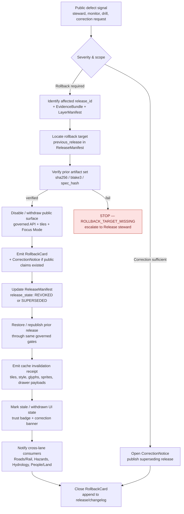

<!-- [KFM_META_BLOCK_V2]
doc_id: kfm://doc/runbook/settlements-infrastructure/rollback
title: Settlements / Infrastructure — Rollback Runbook
type: standard
version: v1
status: draft
owners: Settlements/Infrastructure domain steward · Release steward · Docs steward
created: 2026-05-12
updated: 2026-05-12
policy_label: public
related:
  - kfm://doctrine/lifecycle-law
  - kfm://doctrine/trust-membrane
  - kfm://doctrine/directory-rules
  - kfm://schema/ReleaseManifest
  - kfm://schema/RollbackCard
  - kfm://schema/CorrectionNotice
  - kfm://domain/settlements-infrastructure
tags: [kfm, runbook, rollback, settlements, infrastructure, release, governance]
notes:
  - Path docs/runbooks/settlements-infrastructure/ROLLBACK_RUNBOOK.md is PROPOSED; prior expansion plan used flat docs/runbooks/<subsystem>_ROLLBACK.md naming. See §3.
  - All routes, validators, reason codes, and schema homes remain PROPOSED until mounted-repo verification.
[/KFM_META_BLOCK_V2] -->

# Settlements / Infrastructure — Rollback Runbook

> Governed procedure for withdrawing, reverting, or superseding a **Settlements / Infrastructure** release whose claims, geometry, sensitivity posture, or supporting evidence is no longer safe to keep public.

<!-- Badges: targets are placeholders until CI/release workflows are verified in the mounted repo. -->


<!-- TODO Shields: replace with real CI / last-updated badges once `.github/workflows/release-*.yml` is confirmed. -->

| Field | Value |
|---|---|
| **Status** | `draft` — operational doctrine **CONFIRMED**; this runbook's implementation hooks **PROPOSED** |
| **Owners** | Settlements/Infrastructure domain steward · Release steward · Docs steward |
| **Last updated** | 2026-05-12 |
| **Applies to** | All released artifacts under the Settlements / Infrastructure lane (settlements, municipalities, census places, townsites, ghost towns, forts, missions, reservation communities, infrastructure assets, networks, nodes, segments, facilities, service areas, operators, condition observations, dependencies) |
| **Lifecycle action** | A governed state transition — **PUBLISHED → prior PUBLISHED** (or withdrawal). Not a file move. |
| **Pairs with** | `RELEASE_RUNBOOK.md` *(PROPOSED, NEEDS VERIFICATION)*, `VALIDATION_RUNBOOK.md` *(PROPOSED, NEEDS VERIFICATION)*, `CORRECTION_RUNBOOK.md` *(PROPOSED, NEEDS VERIFICATION)* |

---

## 🔎 Quick jump

- [1. Purpose & scope](#1-purpose--scope)
- [2. Doctrinal invariants](#2-doctrinal-invariants)
- [3. Repo fit & path basis](#3-repo-fit--path-basis)
- [4. When to roll back](#4-when-to-roll-back)
- [5. Defect classes & postures](#5-defect-classes--postures)
- [6. Rollback flow (diagram)](#6-rollback-flow-diagram)
- [7. Step-by-step procedure](#7-step-by-step-procedure)
- [8. Artifacts emitted](#8-artifacts-emitted)
- [9. Domain-specific scenarios](#9-domain-specific-scenarios)
- [10. Cross-lane impact](#10-cross-lane-impact)
- [11. UI & governed-AI behavior during rollback](#11-ui--governed-ai-behavior-during-rollback)
- [12. Validation, drills, and dry-runs](#12-validation-drills-and-dry-runs)
- [13. Anti-patterns](#13-anti-patterns)
- [14. Open verification items](#14-open-verification-items)
- [15. Related docs](#15-related-docs)

---

## 1. Purpose & scope

This runbook tells a steward, release operator, or on-call reviewer **how to safely withdraw or revert a Settlements / Infrastructure release** when the released artifact, claim, manifest, or AI surface should no longer be in public circulation.

It is **CONFIRMED doctrine** in KFM that:

- A released claim, layer, catalog record, artifact, or answer **must have a visible correction path and rollback target before it is treated as safely publishable**.
- Rollback is a **governed state transition**, not a file copy, not a silent overwrite, not a CDN-only purge.
- The durable public unit is the **inspectable claim** — every rollback preserves the original release record and emits a new, superseding decision.

> [!IMPORTANT]
> Settlements / Infrastructure has the highest sensitivity surface of the place-and-asset lanes: **critical infrastructure, utilities, condition observations, dependencies, operator-sensitive details, and exact facility geometry default to restricted or review.** When a rollback is in doubt, **fail closed** — disable the public surface first, decide the rollback target second.

**In scope.** Rollback of `PUBLISHED` Settlements / Infrastructure artifacts, manifests, layer descriptors, Evidence Drawer payloads, Focus Mode answers, and downstream tile / catalog / triplet projections derived from them.

**Out of scope.** Source-side ingestion errors (handled in `VALIDATION_RUNBOOK.md`, PROPOSED), schema migration (handled by ADRs and `migrations/`), and pre-publication review rejections (handled by the review console). Those defects do not require a public rollback because the affected artifact never reached `PUBLISHED`.

---

## 2. Doctrinal invariants

The rollback procedure below exists to preserve these invariants — **never to bypass them**.

| Invariant | What rollback must preserve | Source |
|---|---|---|
| **Lifecycle law** | `RAW → WORK / QUARANTINE → PROCESSED → CATALOG / TRIPLET → PUBLISHED`. Rollback re-enters `PUBLISHED` via the same governed gates, with a prior release as the target. | CONFIRMED doctrine (Directory Rules; Domain Atlas §H) |
| **Trust membrane** | Public clients, normal UI, and released AI surfaces never reach `RAW`, `WORK`, `QUARANTINE`, canonical/internal stores, graph internals, vector indexes, or model runtimes — **during a rollback either**. | CONFIRMED doctrine (Map-Master §10; Encyclopedia) |
| **Watcher-as-non-publisher** | Workers, watchers, and pipelines emit receipts and candidates; they do **not** publish a rollback. A human-governed release path executes the transition. | CONFIRMED doctrine (Directory Rules §7.3; Build Manual §6.9) |
| **Cite-or-abstain** | A rollback that leaves residual public claims must accompany them with a `CorrectionNotice`; otherwise the AI / Evidence Drawer surface **must ABSTAIN**. | CONFIRMED doctrine (GAI; Encyclopedia §I) |
| **Deterministic identity** | Rollback targets are pinned by **digest** (sha256 / blake3) and `release_id`, not by mutable paths. | CONFIRMED doctrine (Map-Master §9, ReleaseManifest) |
| **Auditability** | Every rollback produces a `RollbackCard`, a `CorrectionNotice` (when public claims existed), and a cache-invalidation receipt. Nothing is deleted; superseded releases retain `release_state: SUPERSEDED` or `REVOKED`. | CONFIRMED doctrine (Build Manual §20; ReleaseManifest schema) |

> [!NOTE]
> If a step in §7 appears to require violating one of these invariants, **stop**. The correct action is to disable the affected public surface, open a `RollbackCard` in `pending` state, and escalate to the Release steward before proceeding.

---

## 3. Repo fit & path basis

**Proposed path:** `docs/runbooks/settlements-infrastructure/ROLLBACK_RUNBOOK.md` — **PROPOSED / NEEDS VERIFICATION** against mounted-repo runbook naming.

Two precedents coexist in project evidence:

1. **Flat naming** (from the Whole-UI + Governed AI expansion plan): `docs/runbooks/ui_ROLLBACK.md`, `docs/runbooks/governed_ai_ROLLBACK.md`. Subsystem prefix; no per-lane subdirectory.
2. **Per-domain subdirectory** (consistent with Directory Rules §4 Step 3 — *"the domain appears as a **segment** inside the responsibility root"*): `docs/runbooks/<domain>/ROLLBACK_RUNBOOK.md`.

Both satisfy the Directory Rules `docs/` root responsibility. The per-domain subdirectory pattern (used here) scales better when each lane needs its own `RELEASE`, `VALIDATION`, `CORRECTION`, and `ROLLBACK` runbooks. **An ADR or a `docs/runbooks/README.md` should freeze one convention** before more lanes land.

```text
docs/
└── runbooks/
    ├── README.md                                   # PROPOSED — declare naming convention
    └── settlements-infrastructure/
        ├── README.md                               # PROPOSED — lane runbook index
        ├── RELEASE_RUNBOOK.md                      # PROPOSED, NEEDS VERIFICATION
        ├── VALIDATION_RUNBOOK.md                   # PROPOSED, NEEDS VERIFICATION
        ├── CORRECTION_RUNBOOK.md                   # PROPOSED, NEEDS VERIFICATION
        └── ROLLBACK_RUNBOOK.md                     # this file
```

> [!CAUTION]
> No statement here implies the above tree exists in the mounted repo. Treat every path as **PROPOSED** until verified.

---

## 4. When to roll back

Use this decision matrix. **Roll back when public exposure is unsafe and re-validation cannot resolve the defect inside the existing release window.** Otherwise, prefer a correction (`PUBLISHED → PUBLISHED'`) or a withdrawal (set `release_state: REVOKED`).

| Signal | Severity | Action |
|---|---|---|
| Exact facility geometry leaked (e.g., utility node, substation, water intake) | **Critical** | Rollback + immediate cache invalidation + `RedactionReceipt` + steward notify |
| Operator-sensitive details exposed (ownership, condition, inspection, vulnerability) | **Critical** | Rollback + withdrawal of affected artifact set |
| Critical-infrastructure asset misclassified as public-safe | **High** | Rollback to prior generalized release; re-run policy gate |
| Condition observation `observed_at` corrupted (stale or future-dated) | **High** | Correction first; rollback if downstream graphs already consumed it |
| Legal municipality boundary cited the wrong source role (e.g., `model` upcast to `authority`) | **High** | Rollback; re-emit with correct `source_role` |
| Census-place geography conflated with municipal boundary | **Medium** | Correction; rollback only if Focus Mode answers were generated |
| Historic townsite / ghost-town identity reconciliation produced wrong predecessor link | **Medium** | Correction with `CorrectionNotice`; rollback if multi-domain downstream |
| Tile digest mismatch on a published layer | **High** | Rollback to prior `MapReleaseManifest`; cache invalidation receipt mandatory |
| Cross-lane derivative (e.g., Hazards exposure layer) used a withdrawn Infrastructure layer | **High** | Rollback infrastructure release **and** invalidate every cited derivative |

> [!TIP]
> When a defect is **borderline correction-vs-rollback**, ask: *"Did any public claim, AI answer, or downstream lane consume the bad artifact?"* If yes, rollback the underlying release and emit a `CorrectionNotice`. If no, correct in place with a superseding release.

[Back to top ↑](#-quick-jump)

---

## 5. Defect classes & postures

**CONFIRMED doctrine** (Build Manual §20; defect-class table). The correction posture is for in-place repair; the rollback posture is for withdrawing a bad public surface.

| Defect class | Correction posture | Rollback posture |
|---|---|---|
| **Evidence gap** | ABSTAIN or withdraw unsupported claim | Restore prior evidence-supported release |
| **Rights defect** | DENY public use; quarantine source / artifact | Withdraw affected artifacts |
| **Sensitivity leak** | Redact / generalize; emit `RedactionReceipt`; notify stewards | **Immediate public disablement** |
| **Geometry defect** | Rebuild derivative layer and evidence payload | Restore previous digest-pinned artifact |
| **Temporal defect** | Correct `valid_time` / `source_time` / `retrieval_time` / `release_time` | Mark stale until rebuilt |
| **Policy defect** | Re-run policy and `DecisionEnvelope` | Disable route / layer if gate failed |
| **AI answer defect** | Invalidate `AIReceipt` and response envelope | Remove answer; preserve `EvidenceBundle` |
| **Catalog defect** | Re-emit catalog closure after proof repair | Restore previous catalog state |

**Reason codes** that should appear on a Settlements / Infrastructure `RollbackCard` (**PROPOSED catalog** from the gate-failure registry):

`MISSING_EVIDENCE` · `MISSING_RECEIPT` · `MISSING_REVIEW` · `SCHEMA_MISMATCH` · `CONTRACT_DRIFT` · `RIGHTS_UNKNOWN` · `SENSITIVITY_UNRESOLVED` · `ROLE_COLLAPSE` · `ROLE_DOWNCAST_FORBIDDEN` · `REVIEW_NEEDED` · `REVIEW_INSUFFICIENT` · `REVIEW_REJECTED` · `RELEASE_MANIFEST_INVALID` · `ROLLBACK_TARGET_MISSING`

---

## 6. Rollback flow (diagram)

The diagram below reflects the **CONFIRMED doctrinal flow** (Build Manual §20; ReleaseManifest schema; Map-Master rollback target). Routes and validator names are **PROPOSED**.



> [!NOTE]
> If the mounted-repo flow diverges, this diagram is the **doctrinal reference**; update it via PR rather than diverging silently.

[Back to top ↑](#-quick-jump)

---

## 7. Step-by-step procedure

> [!WARNING]
> **Do not perform any step that touches a public surface without an open `RollbackCard` in `pending` state.** A rollback executed without a card is, by doctrine, a hidden file copy — and is forbidden.

### Step 1 — Acknowledge and bound the defect

- Open a `RollbackCard` *(PROPOSED schema home: `schemas/contracts/v1/release/RollbackCard.schema.json` — NEEDS VERIFICATION)*.
- Record: `defect_class` (§5), `reason_code` (§5), `release_id`, `affected_artifacts[]`, `discovered_by`, `discovered_at`, `public_claims_exist: bool`.
- Set initial state to `pending`.

### Step 2 — Identify the affected release

- Resolve the affected `ReleaseManifest` by `release_id`.
- Enumerate downstream artifacts: `LayerManifest`, `StyleManifest`, `TileArtifactManifest`, `MapReleaseManifest`, derived `triplets/`, and any cited `EvidenceBundle` projections.
- Cross-reference `release/changelog/` for releases that consumed this one as a dependency.

### Step 3 — Locate the rollback target

The target is the **previous safe release**, identified by `ReleaseManifest.rollback.previous_release`. **CONFIRMED schema** (excerpt):

```json
{
  "rollback": {
    "rollback_supported": true,
    "previous_release": "rel-settlements-infra-2026-005",
    "rollback_plan_ref": "release/rollback_cards/rel-settlements-infra-2026-007.json"
  }
}
```

> [!CAUTION]
> If `rollback_supported` is `false` or `previous_release` is `null`, **stop** with reason code `ROLLBACK_TARGET_MISSING`. The release should never have been published; escalate, open a correction notice, and treat the affected surface as withdrawn until a manual recovery plan is approved.

### Step 4 — Verify the prior artifact set

For every artifact referenced by the prior `ReleaseManifest`:

- Verify `sha256` (and `blake3` where present).
- Verify `spec_hash` continuity.
- Verify `evidence_refs[]` still resolve to extant `EvidenceBundle`s.
- Verify `policy_label`, `rights_status`, and `sensitivity` still satisfy the gate that admitted the prior release.

If any verification fails, **abort the automatic path**. Open a manual recovery plan with the Release steward.

### Step 5 — Disable / withdraw the public surface

- Set the affected `LayerManifest` to a non-public state via the governed release path (not by editing files).
- Withdraw the affected tile set from the CDN by emitting a **cache invalidation receipt** (see §8). Do **not** rely on TTL alone.
- Force the Settlements / Infrastructure Evidence Drawer payload resolver to return `DENY` for the affected `release_id` until the rollback closes.
- Cause Focus Mode to **ABSTAIN** on any prompt whose retrieved context cites the withdrawn release.

### Step 6 — Update the `ReleaseManifest`

- Set `release_state` on the affected manifest to `REVOKED` (if no replacement) or `SUPERSEDED` (if a corrected release replaces it).
- **Never mutate `release_id`, `spec_hash`, or original artifact digests.** The historical record stays intact.
- Append a `correction_lineage` entry pointing at the new `RollbackCard` and any `CorrectionNotice`.

### Step 7 — Restore / republish the rollback target

- The prior release re-enters `PUBLISHED` **through the same governed gates** that admitted it originally — admission, schema, validation, rights, sensitivity, source-role, review, catalog closure, release.
- If any gate now fails (e.g., a referenced source has since been revoked), **do not publish the prior release**. Open a fresh release candidate against the now-current source posture.

### Step 8 — Cache invalidation & UI stale-state

- Emit a `cache invalidation record` covering tiles (PMTiles / MVT), styles, sprites, glyphs, drawer payloads, and any Focus Mode response caches.
- The map UI must display a **stale or withdrawn trust badge** on affected layers until the cache invalidation receipt is observed.

### Step 9 — Cross-lane notification

See §10. A Settlements / Infrastructure rollback almost always touches Roads/Rail, Hazards, Hydrology, or People/Land derivatives.

### Step 10 — Close the `RollbackCard`

- State → `closed`.
- Append to `release/changelog/`.
- Link the closing `CorrectionNotice` and the cache invalidation receipt.

[Back to top ↑](#-quick-jump)

---

## 8. Artifacts emitted

Every Settlements / Infrastructure rollback produces these governed records. **PROPOSED schema homes** unless explicitly verified.

| Artifact | Purpose | Proposed schema home | Status |
|---|---|---|---|
| `RollbackCard` | Decision record: who, why, what, when, target | `schemas/contracts/v1/release/RollbackCard.schema.json` | PROPOSED |
| `CorrectionNotice` | Public-facing notice for any claims that escaped | `schemas/contracts/v1/release/CorrectionNotice.schema.json` | PROPOSED |
| Updated `ReleaseManifest` | `release_state` flipped to `REVOKED` / `SUPERSEDED`, `correction_lineage` appended | `schemas/contracts/v1/release/ReleaseManifest.schema.json` | CONFIRMED schema shape |
| `cache invalidation record` | Records what was invalidated and why; consumed by CDN / tile host | `schemas/contracts/v1/release/CacheInvalidationRecord.schema.json` | PROPOSED |
| `RedactionReceipt` | Required when the defect was a sensitivity leak | `schemas/contracts/v1/receipts/RedactionReceipt.schema.json` | PROPOSED |
| `AIReceipt` invalidation | Marks Focus Mode answers built on the withdrawn release as invalid | `schemas/contracts/v1/receipts/AIReceipt.schema.json` | PROPOSED |
| `ReviewRecord` (when policy demanded review) | Steward sign-off on the rollback itself | `schemas/contracts/v1/review/ReviewRecord.schema.json` | PROPOSED |

**CONFIRMED** `ReleaseManifest.rollback` shape (from project evidence):

```json
{
  "rollback": {
    "rollback_supported": true,
    "previous_release": "rel-settlements-infra-2026-005",
    "rollback_plan_ref": "release/rollback_cards/rel-settlements-infra-2026-007.json"
  }
}
```

`release_state` enum (**CONFIRMED**): `DRAFT` · `REVIEW` · `PUBLISHED` · `REVOKED` · `SUPERSEDED`.

---

## 9. Domain-specific scenarios

<details>
<summary><b>9.1 Critical-infrastructure precision leak (utility, substation, water intake)</b></summary>

**Trigger.** A published infrastructure layer exposed exact geometry that should have been generalized or restricted (Settlements / Infrastructure default for `InfrastructureAsset` critical detail is `T4` — denied by default; `T1` only via generalized footprint).

**Posture.** *Sensitivity leak* → immediate public disablement.

**Procedure.**
1. **Disable first, decide second.** Step 5 of §7 executes before steps 1–4 in this case; the `RollbackCard` is opened in parallel.
2. Emit `RedactionReceipt` documenting which fields and geometry were exposed.
3. Restore the prior generalized footprint release (if one exists). If none exists, the rollback target is **no public layer** — set the layer's public state to `withdrawn` indefinitely until a properly generalized release is admitted.
4. Notify Hazards lane stewards (exposure derivatives may have consumed the precise geometry).
5. `CorrectionNotice` is **mandatory** and **public**.

</details>

<details>
<summary><b>9.2 Operator-sensitive condition observation exposed</b></summary>

**Trigger.** A `ConditionObservation` for a bridge, dam, plant, or utility asset reached `PUBLISHED` with operator-sensitive fields (inspection findings, vulnerability flags) intact.

**Posture.** *Rights defect* + *Sensitivity leak*.

**Procedure.** Withdraw the affected artifacts; rebuild the public-safe derivative without the sensitive fields; restore prior release if available. Steward review **required**.

</details>

<details>
<summary><b>9.3 Legal-municipality source-role upcast (e.g., model → authority)</b></summary>

**Trigger.** A municipal boundary was published with `source_role: authority` but the supporting evidence is a modeled or candidate derivation.

**Posture.** *Role collapse* (`ROLE_COLLAPSE`) — the source-role discipline forbids upcast to `authority`.

**Procedure.** Roll back to the last release that correctly carried `source_role: model` (or `candidate`); emit `CorrectionNotice` flagging the role correction; re-emit downstream legal-status-event views with the corrected role label.

</details>

<details>
<summary><b>9.4 Historic townsite / ghost-town identity reconciliation error</b></summary>

**Trigger.** A historical-identity comparison view linked a present-day settlement to the wrong predecessor townsite, or merged two distinct ghost towns under one identity.

**Posture.** *Catalog defect* — affects identity reconciliation and place-identity aliases.

**Procedure.** Roll back the affected catalog records; rebuild the historical identity comparison view; emit `CorrectionNotice` with `AnnexationEvent` / identity-alias correction lineage.

</details>

<details>
<summary><b>9.5 Tile digest mismatch on a published Settlements / Infrastructure layer</b></summary>

**Trigger.** A `TileArtifactManifest` digest no longer matches the served PMTiles bytes (e.g., post-CDN corruption, accidental rebuild, swapped artifact).

**Posture.** *Geometry defect* / integrity failure.

**Procedure.** Roll back to the previous `MapReleaseManifest`; verify prior PMTiles by sha256 and blake3; emit cache invalidation receipt; re-run runtime probes (decode, hash throughput, heap soak) before re-promoting.

</details>

<details>
<summary><b>9.6 Focus Mode answer cited a withdrawn release</b></summary>

**Trigger.** A Focus Mode `AIReceipt` references a Settlements / Infrastructure `EvidenceBundle` whose underlying release has been rolled back.

**Posture.** *AI answer defect*.

**Procedure.** Invalidate the `AIReceipt`; force ABSTAIN on the next request matching the same context envelope; preserve the `EvidenceBundle` for audit (do not delete); attach the invalidation to the closing `RollbackCard`.

</details>

[Back to top ↑](#-quick-jump)

---

## 10. Cross-lane impact

**CONFIRMED / PROPOSED** cross-lane relations from the Domain Atlas. Every Settlements / Infrastructure rollback must check these neighbors.

| Adjacent lane | Relation | What to invalidate |
|---|---|---|
| **Roads / Rail** | depot, bridge, crossing, transport-facility relation | Any transport-graph projection that consumed the withdrawn `Facility` or `NetworkNode` |
| **Hazards** | exposure, resilience, warnings, declarations | Exposure derivatives, resilience views, declared-disaster overlays referencing the withdrawn asset |
| **Hydrology** | water, wastewater, stormwater, floodplain, drainage | Service-area aggregates, drainage dependency graphs, water-system dependency views |
| **People / Land** | residence, ownership, parcel, migration context (with restrictions) | Living-person joins (must remain restricted); parcel-residence rollups; migration-context summaries |

> [!IMPORTANT]
> If a cross-lane derivative cannot be invalidated through the governed API, **escalate** rather than leaving the derivative live. A stale derivative built on a withdrawn release is a public claim without evidence — the cite-or-abstain rule demands ABSTAIN until the derivative is rebuilt.

---

## 11. UI & governed-AI behavior during rollback

| Surface | Required behavior during rollback |
|---|---|
| **Map layer** | Trust badge flips to `stale` or `withdrawn`; layer either disappears (revoked) or renders the prior release (superseded). |
| **Evidence Drawer** | Resolves to a `DENY` envelope for the withdrawn `release_id`, with a human-readable correction message and a link to the `CorrectionNotice`. |
| **Focus Mode** | **MUST ABSTAIN** on any prompt whose evidence retrieval depends on the withdrawn release. Cited prior answers display a stale-citation banner. |
| **Story Nodes / exports** | Any export, screenshot, or Story Node citing the withdrawn release shows a correction banner; new exports refuse to cite it. |
| **Review console** | The rollback is visible end-to-end: `RollbackCard`, prior `ReleaseManifest`, target `ReleaseManifest`, `CorrectionNotice`, cache invalidation receipt, cross-lane notifications. |
| **CDN / tile host** | Cache invalidation receipt consumed; bytes for the withdrawn artifact return `404` or the prior release's bytes. **Never** serve mismatched bytes under the withdrawn `release_id`. |

> [!NOTE]
> The trust membrane is preserved **during** rollback: public clients still go through the governed API, never the canonical / internal store, even when the artifact they want has been withdrawn.

---

## 12. Validation, drills, and dry-runs

**PROPOSED** validation surface for this runbook. Each item should land as a test or fixture once the lane is wired in the mounted repo.

| Validation | What it proves | Status |
|---|---|---|
| Rollback drill — happy path | Prior release restores cleanly through governed gates | PROPOSED — `tests/runtime_proof/settlements-infrastructure/rollback_happy_path.*` |
| Rollback drill — `ROLLBACK_TARGET_MISSING` | Procedure aborts safely, surface stays disabled | PROPOSED |
| Rollback drill — sensitivity leak | Disable-first ordering is honored | PROPOSED |
| Rollback drill — cross-lane invalidation | Roads/Rail, Hazards, Hydrology, People/Land derivatives detect and invalidate | PROPOSED |
| Schema validation — `RollbackCard` | Card validates against schema; reason codes enumerated | PROPOSED |
| Schema validation — `ReleaseManifest.rollback` block | `previous_release`, `rollback_supported`, `rollback_plan_ref` required where applicable | CONFIRMED schema shape; runtime presence NEEDS VERIFICATION |
| Cache invalidation receipt — no-change deny | Invalidation receipts are not emitted for no-op rollbacks | PROPOSED |
| Focus Mode ABSTAIN — withdrawn-release fixture | ABSTAIN on retrieved evidence whose release is `REVOKED` / `SUPERSEDED` | PROPOSED |
| UI stale-state — withdrawn layer fixture | Trust badge renders `stale` / `withdrawn` | PROPOSED |
| Replay verification | Restored release reproduces prior root hash and manifest | PROPOSED (per `ML-058-043`) |

> [!TIP]
> Run a **scheduled monthly rollback drill** on a low-risk synthetic Settlements / Infrastructure release. The drill should cover at least one of: §9.1 sensitivity leak, §9.5 tile-digest mismatch, §9.6 AI citation invalidation.

[Back to top ↑](#-quick-jump)

---

## 13. Anti-patterns

> [!WARNING]
> These are doctrinal failure modes. None of them are acceptable, even under pressure.

- **Hidden file copy.** Rolling back by overwriting a CDN object or replacing artifact bytes without emitting `RollbackCard`, updated `ReleaseManifest`, and cache invalidation receipt.
- **Silent overwrite.** Mutating a prior `ReleaseManifest` in place rather than emitting a superseding release with `correction_lineage`.
- **Cache-only purge.** Relying on CDN TTL or a one-off purge instead of an emitted invalidation receipt.
- **Skipping cross-lane notification.** Withdrawing a Settlements / Infrastructure release while leaving Roads/Rail, Hazards, Hydrology, or People/Land derivatives that consumed it live.
- **AI continues to answer.** Allowing Focus Mode to ANSWER from a withdrawn `EvidenceBundle` because the bundle still resolves.
- **Style-hidden sensitive geometry.** Pretending exact restricted geometry is "rolled back" by hiding it with a style filter while the bytes remain in the tile set.
- **Document-only rollback.** Updating `release/changelog/` without flipping `release_state`. Doctrine: *if no receipt exists, the operation did not happen in the governed sense.*
- **One-person rollback for policy-significant content.** When materiality applies, the release authority for the rollback **MUST** be distinct from the original release author.

---

## 14. Open verification items

These are the items this runbook **cannot resolve** without mounted-repo evidence. They are tracked here so reviewers can close them in order.

| Item | Evidence that would settle it | Status |
|---|---|---|
| Final path: `docs/runbooks/settlements-infrastructure/ROLLBACK_RUNBOOK.md` vs. flat `docs/runbooks/settlements_infrastructure_ROLLBACK.md` | `docs/runbooks/README.md` or naming-convention ADR | NEEDS VERIFICATION |
| Schema home for `RollbackCard`, `CorrectionNotice`, `CacheInvalidationRecord` | `schemas/contracts/v1/release/...` presence | NEEDS VERIFICATION |
| Reason-code registry binding to validators | `tools/validators/release/` or equivalent | NEEDS VERIFICATION |
| Governed-API routes for layer disable / withdraw | `apps/governed-api/` route inspection | UNKNOWN |
| `tests/runtime_proof/settlements-infrastructure/` presence | Mounted repo | NEEDS VERIFICATION |
| Cache invalidation receipt consumer (CDN / tile host) | `infra/` and `release/` workflow inspection | UNKNOWN |
| Domain steward CODEOWNERS for Settlements / Infrastructure | `.github/CODEOWNERS` | UNKNOWN |
| Existence of paired `RELEASE_RUNBOOK.md`, `VALIDATION_RUNBOOK.md`, `CORRECTION_RUNBOOK.md` | Mounted repo | PROPOSED |

Add or close items via `docs/registers/VERIFICATION_BACKLOG.md`.

---

## 15. Related docs

- `docs/doctrine/lifecycle-law.md` *(PROPOSED)* — RAW → PUBLISHED state-transition law
- `docs/doctrine/trust-membrane.md` *(PROPOSED)* — public surfaces vs. canonical stores
- `docs/doctrine/directory-rules.md` — placement authority *(CONFIRMED rules, PROPOSED presence)*
- `docs/domains/settlements-infrastructure/README.md` *(PROPOSED)* — domain ownership and object families
- `docs/runbooks/settlements-infrastructure/RELEASE_RUNBOOK.md` *(PROPOSED)*
- `docs/runbooks/settlements-infrastructure/CORRECTION_RUNBOOK.md` *(PROPOSED)*
- `docs/runbooks/settlements-infrastructure/VALIDATION_RUNBOOK.md` *(PROPOSED)*
- `schemas/contracts/v1/release/ReleaseManifest.schema.json` — release decision shape *(CONFIRMED shape, PROPOSED location)*
- `release/rollback_cards/` — emitted decision records
- `release/correction_notices/` — emitted public notices
- `release/changelog/` — release-level changelog
- `docs/adr/ADR-runbook-naming-convention.md` *(PROPOSED)* — freeze flat vs. per-domain pattern

---

<sub>**Last updated:** 2026-05-12 · **Doc id:** `kfm://doc/runbook/settlements-infrastructure/rollback` · **Status:** draft · **Authority:** doctrine CONFIRMED, implementation hooks PROPOSED · [Back to top ↑](#settlements--infrastructure--rollback-runbook)</sub>
