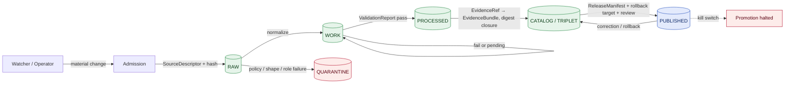

<!-- [KFM_META_BLOCK_V2]
doc_id: kfm://doc/runbook/settlements-infrastructure/source-refresh
title: Settlements / Infrastructure — Source Refresh Runbook
type: standard
version: v0.1
status: draft
owners: Settlements/Infrastructure domain steward, Source steward, Release steward
created: 2026-05-12
updated: 2026-05-12
policy_label: public
related:
  - docs/doctrine/directory-rules.md
  - docs/doctrine/lifecycle-law.md
  - docs/doctrine/trust-membrane.md
  - docs/domains/settlements-infrastructure/README.md
  - docs/sources/SOURCE_DESCRIPTOR_STANDARD.md
  - docs/runbooks/README.md
  - docs/registers/VERIFICATION_BACKLOG.md
tags: [kfm, runbook, settlements, infrastructure, source-refresh, governance]
notes:
  - Path PROPOSED until verified against mounted repo evidence.
  - Implementation maturity UNKNOWN; gates and validators are PROPOSED unless verified.
[/KFM_META_BLOCK_V2] -->

# Settlements / Infrastructure — Source Refresh Runbook

Operational procedure for refreshing settlements and infrastructure source data through KFM's governed `RAW → PUBLISHED` lifecycle, with critical-infrastructure sensitivity gates and PR-first promotion.


| Field | Value |
|---|---|
| **Document type** | Operations runbook |
| **Status** | `draft` — PROPOSED until verified against mounted repo evidence |
| **Authority** | Doctrine CONFIRMED; implementation paths PROPOSED / NEEDS VERIFICATION |
| **Domain** | `settlements-infrastructure` |
| **Owners** | Settlements/Infrastructure steward · Source steward · Release steward |
| **Last updated** | 2026-05-12 |
| **Schema home (default)** | `schemas/contracts/v1/...` per ADR-0001 (verify against repo) |

> [!IMPORTANT]
> This domain owns critical-infrastructure context. Bridge / condition / inspection details, private or security-sensitive assets, and exact vulnerable facility geometry **default to restricted, generalized, staged, or denied** — never to "publish unless flagged." Default deny is the floor, not the ceiling.

---

## Contents

1. [Scope and boundary](#1-scope-and-boundary)
2. [When to run this runbook](#2-when-to-run-this-runbook)
3. [Preflight checks](#3-preflight-checks)
4. [Lifecycle map](#4-lifecycle-map)
5. [Source family reference](#5-source-family-reference)
6. [Refresh procedure](#6-refresh-procedure)
7. [Sensitivity, rights, and publication posture](#7-sensitivity-rights-and-publication-posture)
8. [Validation gates](#8-validation-gates)
9. [Receipts and proof objects emitted](#9-receipts-and-proof-objects-emitted)
10. [Failure modes and rollback](#10-failure-modes-and-rollback)
11. [Verification backlog](#11-verification-backlog)
12. [Related docs](#12-related-docs)
13. [Appendix A — Domain object families](#appendix-a--domain-object-families)
14. [Appendix B — Path-by-path placement notes](#appendix-b--path-by-path-placement-notes)

---

## 1. Scope and boundary

**CONFIRMED doctrine / PROPOSED implementation.** This runbook governs the periodic refresh of source data feeding the **Settlements / Infrastructure** lane: legal municipalities, census places, historic townsites, ghost towns, forts, missions, reservation communities, infrastructure assets, networks, nodes, segments, facilities, service areas, operators, condition observations, dependencies, and the public-safe representations derived from them.

**In scope**

- Periodic and event-driven refresh of admitted Settlements / Infrastructure sources.
- Promotion of refreshed material through `RAW → WORK / QUARANTINE → PROCESSED → CATALOG / TRIPLET → PUBLISHED`.
- Sensitivity, rights, and review gates specific to critical infrastructure.
- Receipts, manifests, correction, and rollback artifacts produced by the refresh.

**Out of scope (owned elsewhere)**

| Concern | Owner | Why excluded here |
|---|---|---|
| Transport route geometry, depots, crossings | Roads / Rail / Trade Routes lane | Facility identity is settlement-owned; **route geometry is not** |
| Living-person ownership and parcel privacy | People / Genealogy / DNA / Land lane | Settlements does not own person-level data |
| Hazard event records and warnings | Hazards lane | KFM is **never** an alert authority |
| Water, wastewater, hydrology evidence | Hydrology lane | Cross-lane relation only |
| Archaeological site coordinates | Archaeology / Cultural Heritage lane | Sites denied at exact coords; settlements may reference generalized context |

> [!NOTE]
> Cross-lane relations (depot/crossing, exposure, water/wastewater, parcel context) **must preserve ownership, source role, sensitivity, and EvidenceBundle support** even when this runbook touches data that crosses a lane boundary. PROPOSED.

[↑ Back to top](#contents)

---

## 2. When to run this runbook

Trigger this runbook for any of the following, **and only after** a watcher or operator has produced a material-change signal — never as a standing background "always-on publish."

| Trigger | Description | Default cadence | Status |
|---|---|---|---|
| **Authoritative vintage release** | New Census/TIGER vintage; GNIS bulk update; KDOT bridge inventory release. | Source-specific (annual / quarterly) | PROPOSED |
| **Watcher delta detected** | Watcher (`stac` / `gtfs` / `tile` / `file` / `api` family) reports a material change against signed prior state. | Event-driven | PROPOSED |
| **Operator submission** | Steward or operator-supplied municipal record, annexation, or facility update with rights documented. | Event-driven | PROPOSED |
| **Correction request** | Verified correction against a published settlement, place, or facility. | Event-driven | PROPOSED |
| **Scheduled review drill** | Quarterly steward-led drill exercising rollback and policy gates without changing public artifacts. | Quarterly | PROPOSED |

> [!CAUTION]
> **Do not run a refresh** purely because the calendar says it is time. A no-change poll **MUST NOT** emit new catalog entities, manifests, or cache invalidations. CONFIRMED doctrine from the watcher / no-change posture.

[↑ Back to top](#contents)

---

## 3. Preflight checks

Before any RAW admission, confirm every item below. If any item is **NO** or **UNKNOWN**, stop and route to the correct register (`VERIFICATION_BACKLOG.md`, `DRIFT_REGISTER.md`, or a steward review issue).

- [ ] **SourceDescriptor exists** for each source in scope (role, authority, rights, sensitivity, cadence, license, payload hash or reference). PROPOSED — verify against `data/registry/` and `docs/sources/`.
- [ ] **Source role is set** (authority / observation / context / model). Mixed-role payloads are split before admission.
- [ ] **Rights and license are current.** License travels with deltas; unknown license → fail closed.
- [ ] **Sensitivity class set.** Critical infrastructure, condition, inspection, operator-sensitive, or exact vulnerable geometry → default deny on public detail.
- [ ] **Cadence and freshness window** declared; stale-source threshold known.
- [ ] **No direct route from this refresh to PUBLISHED.** Promotion is a governed state transition, not a file move.
- [ ] **Rollback target identified** for any path that could reach a public surface.
- [ ] **Kill-switch** state checked (refresh halts if asserted).
- [ ] **No browser / public client touches `RAW`, `WORK`, `QUARANTINE`, canonical stores, or unpublished candidates.** CONFIRMED doctrine.
- [ ] **Configs are non-secret.** Real secrets MUST NOT live under `configs/` — even for "test" or "local."

> [!WARNING]
> If a real secret is found anywhere in `configs/` during preflight, treat it as a **security incident**: rotate, audit, and open an entry in `docs/runbooks/` (per `directory-rules.md` §10.3).

[↑ Back to top](#contents)

---

## 4. Lifecycle map

**CONFIRMED doctrine:** every refresh follows the lifecycle invariant. Promotion between phases is a **governed state transition** — it requires the artifacts listed in §8 and §9, not a file move.



Per-phase posture:

| Phase | Handling | Gate (must pass) | Default failure |
|---|---|---|---|
| **Admission → RAW** | Capture immutable payload or reference with source role, rights, sensitivity, citation, time, and hash. | `SourceDescriptor` exists. | Reject; log candidate. |
| **WORK / QUARANTINE** | Normalize schema, geometry, time, identity, evidence, rights, policy. Hold failures. | Validation + policy gate pass, or quarantine reason recorded. | Quarantine with reason. |
| **PROCESSED** | Emit validated, normalized objects, receipts, and public-safe candidates. | `EvidenceRef`, `ValidationReport`, and digest closure exist. | Stay in WORK. |
| **CATALOG / TRIPLET** | Emit catalog records, `EvidenceBundle`, graph/triplet projections, release candidates. | Catalog / proof closure passes. | Hold at PROCESSED. |
| **PUBLISHED** | Serve released public-safe artifacts through the governed API and manifests. | `ReleaseManifest`, correction path, rollback target, review/policy state present. | Hold at CATALOG. |

> [!NOTE]
> Settlements / Infrastructure first-slice posture is **schema-and-fixture-first**: source descriptors, deterministic identity, validators, deny policies, no-network fixtures, and proof-pack / promotion fixtures should land **before** any live source is activated. PROPOSED.

[↑ Back to top](#contents)

---

## 5. Source family reference

Source families admitted into the Settlements / Infrastructure lane. Roles, rights, and freshness are source-specific — the table below names the **family** and the burden the runbook places on it. Specific authorities, endpoints, and license text are tracked in `data/registry/sources/` and the source descriptors (PROPOSED).

| Source family | Typical role | Sensitivity default | Freshness cadence | Status |
|---|---|---|---|---|
| Census TIGER / Census Place geography | authority / observation | T0 aggregate; restricted joins | Decennial + annual | CONFIRMED doctrine, PROPOSED impl |
| GNIS and historical gazetteers | authority (place names) / observation | T0 | Periodic | CONFIRMED doctrine, PROPOSED impl |
| State / local GIS (Kansas Geoportal-style) | authority / observation / context | Source-specific | Source-specific | PROPOSED |
| Municipal and local legal records | authority (legal place) | T0 / T1 where draft | Event-driven | PROPOSED |
| Historical gazetteers and maps | context / observation | T0 generalized | Vintage-specific | PROPOSED |
| Infrastructure operators and providers | authority / observation | **T2–T4** (default restricted) | Operator-specific | PROPOSED |
| KDOT / bridge / facility sources | authority / observation | T2–T4 for condition, inspection | Periodic | PROPOSED |
| FEMA / hazards / resilience context | context only (Hazards owns events) | T0 context | Event-driven | PROPOSED |
| Roads / rail records (facility identity only) | context (Roads/Rail owns route) | T0 facility identity | Periodic | PROPOSED |
| Fort / mission / reservation community archives | authority / context | Steward-reviewed | Source-specific | PROPOSED |

> [!IMPORTANT]
> **Sensitive joins fail closed.** A refresh that would combine, for example, infrastructure asset condition with operator identity and exact geometry must produce **no public artifact** until policy, review, and generalization gates have signed off. PROPOSED implementation; CONFIRMED doctrine.

[↑ Back to top](#contents)

---

## 6. Refresh procedure

The procedure is **PR-first**. Detected material change → branch + PR with machine-readable manifests + required checks → human review → governed promotion. Direct publication from a watcher or refresh job is forbidden.

### 6.1 Detect and capture (Admission → RAW)

> [!NOTE]
> Connectors and watchers **do not publish**. Their output goes to `data/raw/<domain>/<source_id>/<run_id>/` or `data/quarantine/...` only. CONFIRMED placement rule.

1. Watcher (or operator) records: source URL, ETag, `spec_hash`, license, version, retrieved_at, payload digest. This becomes the basis of the `RunReceipt`.
2. Confirm the **SourceDescriptor** for this source is current (role, rights, sensitivity, cadence). If drift is detected, update the descriptor in its own PR before admitting payload.
3. Compute deterministic identity per object. PROPOSED basis for this domain: `source_id + object_role + temporal_scope + normalized_digest`.
4. Compare against signed prior state. If response is "no change," **emit a heartbeat only** and stop — no new catalog entities, no manifest churn, no cache invalidation.

<details>
<summary><strong>Example — SourceDescriptor fields commonly recorded</strong> (illustrative; verify against schema)</summary>

```text
source_id            : <stable id>
source_family        : census_tiger | gnis | kdot_bridge | municipal_legal | ...
role                 : authority | observation | context | model
authority            : <issuing body>
rights               : <license / terms / use posture>
sensitivity_class    : T0 | T1 | T2 | T3 | T4
cadence              : <annual | quarterly | event-driven | ...>
retrieved_at         : <ISO 8601>
etag / version       : <provider value>
payload_digest       : <sha256 of payload or reference>
notes                : <free text>
```

The list above is illustrative. The authoritative shape lives in `schemas/contracts/v1/source/source_descriptor.schema.json` (PROPOSED home — verify against `directory-rules.md` §6.1 and ADR-0001).
</details>

### 6.2 Normalize and validate (RAW → WORK / QUARANTINE → PROCESSED)

1. Normalize schema, geometry, time, identity, evidence, rights, and policy.
2. Run gates in cheap-to-expensive order (see §8). Hold any failure as `QUARANTINE` with a structured reason.
3. Emit `TransformReceipt` and `ValidationReport`. If sensitivity applies, emit `RedactionReceipt`. If aggregation applies, emit `AggregationReceipt`.
4. Distinguish **observed**, **valid**, **retrieval**, **release**, and **correction** times where material — they are kept distinct, never collapsed.

### 6.3 Catalog and bundle (PROCESSED → CATALOG / TRIPLET)

1. Resolve every `EvidenceRef` to an `EvidenceBundle` and prove digest closure.
2. Emit catalog records and graph/triplet projections.
3. Open a PR with the manifest diff. Required checks include OPA / Conftest policy gates, signature verification, citation validation, and acceptance harness checks (STAC / DCAT / PROV where applicable).
4. Do **not** treat catalog, graph, triplet, or vector index as sovereign truth — they are derivative indexes built from released or review-authorized evidence.

### 6.4 Promote (CATALOG / TRIPLET → PUBLISHED)

1. Confirm the release authority is **distinct from the author** when materiality applies (separation of duties).
2. `ReleaseManifest` MUST include: linked `EvidenceBundle`, `PolicyDecision`, `PromotionDecision`, `RunReceipt(s)`, rollback target, correction path, and review state where required.
3. Run the Promotion Gate Summary. Any negative outcome fails closed.
4. On merge, post-promotion jobs update STAC / DCAT / PROV records, graph deltas, API indices, Story Nodes, and Focus diffs — strictly downstream of the release manifest. PROPOSED implementation.

### 6.5 Refresh-complete checklist

- [ ] No direct route from connector / watcher to `data/published/` or to public routes.
- [ ] All RAW payloads recorded with descriptor + digest; nothing admitted without a `SourceDescriptor`.
- [ ] No-change polls emitted heartbeats only.
- [ ] All gates in §8 passed or failed-closed with reason.
- [ ] `ReleaseManifest` carries proof, correction path, and rollback target.
- [ ] Critical-infrastructure precision audit ran and recorded its result.
- [ ] Update-propagation matrix items handled (Object Map, fixtures, runbooks, continuity notes, rollback notes, verification backlog).

[↑ Back to top](#contents)

---

## 7. Sensitivity, rights, and publication posture

**Default posture for this domain is restrictive.** Critical infrastructure, condition observations, inspection data, dependencies, operator-sensitive details, and exact facility geometry default to restricted or review.

| Concern | Default | Acceptable transforms before public release |
|---|---|---|
| Exact geometry of vulnerable facilities | **Deny** on public detail | Generalize, redact, or staged access only |
| Bridge / inspection / condition records | **Restricted / review** | Aggregate or steward-approved generalization |
| Operator identity tied to asset condition | **Restricted** | Generalized footprint; operator id withheld or staged |
| Living-person ownership joined to facility | **Deny** | Owned by People/Land lane — not this runbook |
| Critical infrastructure dependency graphs | **Restricted / review** | Aggregate, anonymized, steward-approved publication |
| Historic forts / missions (non-sensitive) | T0 with provenance | Standard publication path |

> [!WARNING]
> **Unclear rights, unresolved source role, missing evidence, unresolved sensitivity, or absent release state blocks public promotion.** This is a doctrinal stop, not a warning. CONFIRMED doctrine.

Cross-lane sensitivity reminders:

- **Hazards** owns hazard events. Settlements may carry exposure context only; never present settlement data as a life-safety alert.
- **People / Land** owns living-person privacy. Joining facility records to person-level data MUST follow that lane's rules.
- **Archaeology** owns cultural sensitivity. Settlement history that touches sacred or sensitive sites must follow archaeology's denial / generalization rules.

[↑ Back to top](#contents)

---

## 8. Validation gates

Validation is a **promotion boundary, not a cleanup pass.** Run gates in cheap-to-expensive order; fail closed on the first definitive failure.

| Order | Gate family | Must answer | Default failure |
|---|---|---|---|
| 1 | **Shape** | Does each object match its schema and required version? | `ERROR` / quarantine |
| 2 | **Meaning** | Does it conform to contract and vocabulary (legal place vs census place vs historic place)? | `ERROR` / review |
| 3 | **Source** | Is source role, rights, cadence, and sensitivity known and current? | `DENY` / quarantine |
| 4 | **Evidence** | Do `EvidenceRef`s resolve to `EvidenceBundle`s? | `ABSTAIN` |
| 5 | **Policy** | Is exposure allowed for this user, purpose, and release class? | `DENY` |
| 6 | **Lifecycle** | Is object in the correct phase along `RAW → PUBLISHED`? | `DENY` |
| 7 | **Receipt** | Are `RunReceipt`, `PromotionReceipt`, decision logs present? | `ERROR` |
| 8 | **Release** | Does the manifest include proof, correction path, and rollback target? | `ERROR` |

Domain-specific validators (PROPOSED — verify against `tests/` and `tools/validators/`):

- Legal municipality evidence test (legal place ↔ source role correctness).
- Census-vs-municipality distinction test (no silent collapse).
- Infrastructure topology test (nodes / segments / facilities consistent).
- `condition.observed_at` temporal field test (observed time preserved separately from retrieval and release time).
- Restricted geometry no-leak test (precision audit; sensitive geometry never appears in public artifacts).
- Catalog / proof / release closure test.

Cross-cutting validators (PROPOSED):

- `SourceDescriptor` schema validation.
- OPA / Conftest policy-as-code on run manifests (fail closed on missing fields, rights, sensitivity, or release state).
- Cosign / Rekor attestation check; UUID recorded back into the run manifest.
- Acceptance harness for STAC / DCAT / PROV closure before release.
- `spec_hash` reproducibility gate (drift blocks promotion).

[↑ Back to top](#contents)

---

## 9. Receipts and proof objects emitted

A successful refresh produces, at minimum, the artifacts below. Specific shapes live in `schemas/contracts/v1/...` (PROPOSED home; verify against ADR-0001).

| Artifact | Purpose | Where it lives | Status |
|---|---|---|---|
| `SourceDescriptor` | Source identity, role, rights, sensitivity, cadence. | `data/registry/sources/<domain>/` (PROPOSED) | PROPOSED |
| `RunReceipt` | Pipeline run inputs/outputs/`spec_hash`/timestamp/operator/result. | `data/receipts/` | PROPOSED |
| `TransformReceipt` | Per-transform inputs, outputs, tool versions. | `data/receipts/` | PROPOSED |
| `ValidationReport` | Pass/fail per gate; structured reasons. | `data/proofs/` | PROPOSED |
| `EvidenceBundle` | Closed evidence for public claims. | `data/catalog/` projection | PROPOSED |
| `RedactionReceipt` | Records generalization / redaction transforms and reasons. | `data/receipts/` | PROPOSED |
| `PolicyDecision` | Allow / deny / restrict / abstain with rule ids. | `data/proofs/` | PROPOSED |
| `PromotionDecision` | Gate results, proof, review state, target release, rollback target. | `release/` | PROPOSED |
| `ReleaseManifest` | Coordinates layer / style / tile / catalog release and rollback. | `release/` | PROPOSED |
| `CorrectionNotice` | Correction path for any released artifact. | `release/` | PROPOSED |
| `RollbackCard` | Reversal anchor restoring prior manifest and invalidating caches. | `release/rollback/` | PROPOSED |

> [!TIP]
> Trust-bearing artifacts (receipts, proofs, manifests, release decisions) **do not** belong in `artifacts/`. Per `directory-rules.md` §8, `artifacts/` is build / docs / qa / temporary only.

[↑ Back to top](#contents)

---

## 10. Failure modes and rollback

Common failure modes and their default response. Every public release MUST have a rollback target before promotion.

| Failure mode | Where it surfaces | Default response |
|---|---|---|
| **Unknown or expired license** on a refreshed source | Source / policy gate | `DENY` — block layer admission; license-deny policy fixture asserts |
| **Sensitive geometry attempt to publish** | Policy / precision audit | `DENY` — fail closed; emit `RedactionReceipt` if generalized re-attempt is permitted |
| **Stale source** beyond declared threshold | Source / freshness check | UI stale badge; `ABSTAIN` on dependent claims; **never** rebrand as denial |
| **Unsigned artifact** (tile / catalog / style / manifest) | Signature / Cosign / Rekor gate | `DENY` — unsigned artifact deny fixture asserts |
| **Missing `RunReceipt` or `PromotionReceipt`** | Receipt gate | `ERROR` — promotion blocked |
| **Catalog / proof closure fails** | Catalog closure gate | Hold at `PROCESSED`; no public edge |
| **Kill switch asserted** | Promotion aggregator | Promotion fails closed; merge blocked |
| **Released artifact found defective post-publication** | Correction path | Emit `CorrectionNotice`; execute rollback; invalidate caches with `cache invalidation record` |

Rollback drill (PROPOSED steps):

1. Identify the prior `ReleaseManifest` and its referenced artifact digests.
2. Restore prior manifest; revert layer / tile / style / catalog references.
3. Issue `cache invalidation record` (no no-change invalidations).
4. Emit a **rollback attestation** linking the prior release.
5. Update the verification backlog and any affected continuity notes.
6. Run the rollback replay test to prove the restored state matches the prior digest.

> [!CAUTION]
> Rollback is a **first-class release operation**, not an emergency improvisation. If a rollback path cannot be drawn, the release is not ready to publish. CONFIRMED doctrine.

[↑ Back to top](#contents)

---

## 11. Verification backlog

These items are explicitly **not resolved** by this runbook and SHOULD be tracked in `docs/registers/VERIFICATION_BACKLOG.md`.

| Item | Evidence that would settle it | Status |
|---|---|---|
| Exact schema home for `SourceDescriptor`, `RunReceipt`, `ReleaseManifest`, `EvidenceBundle` in mounted repo | Mounted `schemas/`, ADR-0001, per-root README | NEEDS VERIFICATION |
| Connector module names and locations for Settlements / Infrastructure sources | Mounted `connectors/` and per-source README | UNKNOWN |
| CI workflow names enforcing the gates in §8 | Mounted `.github/workflows/` | UNKNOWN |
| Current Settlements / Infrastructure source rights and license text | `data/registry/sources/<domain>/` evidence | NEEDS VERIFICATION |
| Validator names and entry points for the domain-specific tests in §8 | Mounted `tools/validators/` and `tests/` | NEEDS VERIFICATION |
| Critical-infrastructure precision-audit tool name and thresholds | Mounted tool + threshold config | UNKNOWN |
| Stale-source threshold values per source family | Source registry + `policy/` | UNKNOWN |
| Whether `docs/runbooks/` uses flat `<subsystem>_TOPIC.md` or domain-segmented layout | Mounted `docs/runbooks/` listing + any local README | NEEDS VERIFICATION |

[↑ Back to top](#contents)

---

## 12. Related docs

> [!NOTE]
> Links below are relative paths that assume the doc tree described in `directory-rules.md` §6.1. Verify against the mounted repo before relying on a specific target. Targets marked `TODO` indicate files not yet confirmed present.

- [`docs/doctrine/directory-rules.md`](../../doctrine/directory-rules.md) — placement law and lifecycle invariant.
- [`docs/doctrine/lifecycle-law.md`](../../doctrine/lifecycle-law.md) — `RAW → PUBLISHED` invariant. `TODO` confirm.
- [`docs/doctrine/trust-membrane.md`](../../doctrine/trust-membrane.md) — public client posture. `TODO` confirm.
- [`docs/doctrine/truth-posture.md`](../../doctrine/truth-posture.md) — cite-or-abstain. `TODO` confirm.
- [`docs/domains/settlements-infrastructure/README.md`](../../domains/settlements-infrastructure/README.md) — domain lane overview. `TODO` confirm.
- [`docs/sources/SOURCE_DESCRIPTOR_STANDARD.md`](../../sources/SOURCE_DESCRIPTOR_STANDARD.md) — source descriptor contract. `TODO` confirm.
- [`docs/runbooks/README.md`](../README.md) — runbook index. `TODO` confirm.
- [`docs/registers/VERIFICATION_BACKLOG.md`](../../registers/VERIFICATION_BACKLOG.md) — open verification items.
- [`docs/registers/DRIFT_REGISTER.md`](../../registers/DRIFT_REGISTER.md) — drift entries (e.g., runbook-layout convention).
- [`docs/adr/`](../../adr/) — ADRs, including ADR-0001 (schema home) and any future Settlements / Infrastructure ADRs.

[↑ Back to top](#contents)

---

## Appendix A — Domain object families

PROPOSED object families owned by the Settlements / Infrastructure lane. Identity rule defaults shown for each.

<details>
<summary><strong>Object families and identity rule defaults</strong></summary>

| Object | Purpose | PROPOSED identity basis |
|---|---|---|
| `Settlement` | Generic settlement evidence or derivative. | `source_id + object_role + temporal_scope + normalized_digest` |
| `Municipality` | Legal municipality. | same pattern |
| `CensusPlace` | Census-defined place. | same pattern |
| `Townsite` | Historic townsite. | same pattern |
| `GhostTown` | Abandoned / non-extant place. | same pattern |
| `Fort` | Military fort, historic. | same pattern |
| `Mission` | Historic mission. | same pattern |
| `ReservationCommunity` | Reservation community context. | same pattern; steward review burden |
| `InfrastructureAsset` | Infrastructure asset evidence or derivative. | same pattern; **default restricted** |
| `NetworkNode` | Network node evidence or derivative. | same pattern; **default restricted** |
| `NetworkSegment` | Network segment evidence or derivative. | same pattern; **default restricted** |
| `Facility` | Facility evidence or derivative. | same pattern |
| `ServiceArea` | Service area aggregate. | same pattern; aggregate preferred for publication |
| `Operator` | Operator identity. | same pattern; **default restricted** |
| `ConditionObservation` | Condition / inspection observation. | same pattern; **default restricted** |
| `Dependency` | Dependency relation. | same pattern; **default restricted** |
| `AnnexationEvent` | Annexation event. | same pattern |
| `UrbanGrowthObservation` | Urban-growth observation derivative. | same pattern |

Temporal handling for all of the above: **observed**, **valid**, **retrieval**, **release**, and **correction** times stay distinct where material. CONFIRMED doctrine.

</details>

[↑ Back to top](#contents)

---

## Appendix B — Path-by-path placement notes

PROPOSED placements for files this runbook touches. Each row should be verified against `directory-rules.md` and the mounted repo. Do not treat as the current tree.

<details>
<summary><strong>Placement table (PROPOSED — verify against repo)</strong></summary>

| Path | Action | Status | Directory Rules basis |
|---|---|---|---|
| `docs/runbooks/settlements-infrastructure/SOURCE_REFRESH_RUNBOOK.md` | CREATE | PROPOSED | §6.1 `docs/runbooks/`; §4 Step 3 domain-as-segment |
| `docs/domains/settlements-infrastructure/README.md` | CREATE if absent | PROPOSED | §6.1 `docs/domains/<domain>/` |
| `data/registry/sources/settlements-infrastructure/` | POPULATE per source | PROPOSED | §6.1 / §10.1; lifecycle and source-registry rules |
| `connectors/<source>/` | EXTEND per source family | PROPOSED | §7.3 — connectors output to `data/raw/...` or `data/quarantine/...` only |
| `schemas/contracts/v1/source/source_descriptor.schema.json` | CONFIRM | NEEDS VERIFICATION | ADR-0001 schema-home default |
| `policy/domains/settlements-infrastructure/` | CREATE if absent | PROPOSED | §4 Step 3 domain-as-segment |
| `tests/domains/settlements-infrastructure/` | CREATE if absent | PROPOSED | §4 Step 3 |
| `fixtures/domains/settlements-infrastructure/` | CREATE if absent | PROPOSED | §4 Step 3 |
| `release/candidates/settlements-infrastructure/` | CREATE if absent | PROPOSED | §4 Step 3 |
| `tools/validators/domains/settlements-infrastructure/` | CREATE if absent | PROPOSED | §7.5 |

</details>

[↑ Back to top](#contents)

---

### Last reviewed

`2026-05-12` — initial draft. Older than 6 months → flag for review (per `directory-rules.md` §15).

### Related docs

See [§12](#12-related-docs) above.

[↑ Back to top](#contents)
