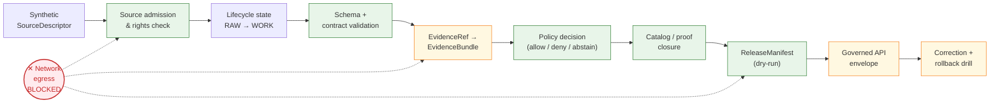

<!-- [KFM_META_BLOCK_V2]
doc_id: kfm://doc/runbooks/soil/no-network-test-runbook
title: Soil — No-Network Test Runbook
type: standard
version: v1
status: draft
owners: <Docs steward + Soil domain owner — PLACEHOLDER>
created: 2026-05-12
updated: 2026-05-12
policy_label: public
related:
  - docs/doctrine/directory-rules.md
  - docs/domains/soil/README.md
  - docs/runbooks/ROLLBACK.md
  - schemas/contracts/v1/source/source-descriptor.json
  - tests/fixtures/domains/soil/
  - policy/domains/soil/
tags: [kfm, runbook, soil, testing, no-network, phase-0]
notes:
  - "Path is PROPOSED until verified against mounted repo and Directory Rules §12."
  - "Implementation status of every referenced validator, schema, and fixture remains PROPOSED."
  - "Replaces no prior runbook in this session; treat as Phase-0 'Build first' deliverable."
[/KFM_META_BLOCK_V2] -->

# 🌱 Soil — No-Network Test Runbook

> Deterministic, evidence-first procedure for exercising the **Soil** trust spine against synthetic fixtures, with **zero outbound network traffic**, before any live-source code is admitted.


| | |
|---|---|
| **Status** | `draft` · PROPOSED implementation |
| **Owners** | Docs steward + Soil domain owner — *placeholder, NEEDS VERIFICATION* |
| **Last reviewed** | 2026-05-12 |
| **Authority of these rules** | CONFIRMED doctrine (derived from KFM Encyclopedia, Domains Atlas, Unified Manual) |
| **Authority of every concrete path / fixture name** | **PROPOSED** until mounted-repo evidence confirms it |
| **Supersedes** | None — first runbook in `docs/runbooks/soil/` |

---

## Quick jump

- [1. Purpose](#1-purpose)
- [2. Why this runbook exists first](#2-why-this-runbook-exists-first)
- [3. Path placement & Directory Rules basis](#3-path-placement--directory-rules-basis)
- [4. Preconditions](#4-preconditions)
- [5. Trust spine the test must prove](#5-trust-spine-the-test-must-prove)
- [6. Inputs — synthetic Soil fixtures](#6-inputs--synthetic-soil-fixtures)
- [7. Procedure](#7-procedure)
- [8. Validators invoked](#8-validators-invoked)
- [9. Pass / fail / abstain / deny outcomes](#9-pass--fail--abstain--deny-outcomes)
- [10. Soil-specific assertions](#10-soil-specific-assertions)
- [11. Failure modes and rollback](#11-failure-modes-and-rollback)
- [12. CI binding](#12-ci-binding)
- [13. Open verification items](#13-open-verification-items)
- [14. FAQ](#14-faq)
- [Related docs](#related-docs)

---

## 1. Purpose

This runbook describes how an operator **runs the deterministic, no-network test suite for the Soil domain** against synthetic fixtures. It is the *first* test gate in the Soil lane — it must pass before any live SSURGO, SDA, Kansas Mesonet, SCAN, USCRN, or SMAP connector is admitted, before any catalog record is emitted, and before any layer is promoted to a release candidate.

The procedure exercises — without touching the network — the same trust spine that production Soil publication will eventually exercise: source admission → lifecycle state → validation → evidence resolution → policy decision → catalog/proof closure → release decision → governed API/UI payload → correction → rollback.

> [!IMPORTANT]
> **No-network is not a performance optimization.** It is a *governance* invariant. If this runbook's steps require outbound traffic to pass, the test has crossed the trust membrane and the result is not admissible as proof.

[↑ Back to top](#-soil--no-network-test-runbook)

---

## 2. Why this runbook exists first

The KFM Encyclopedia lists **"Soil source registry + no-network fixture"** under the *Build first* group of the Soil feature backlog (PROPOSED). The Unified Manual's PROPOSED test pyramid puts deterministic no-network fixture tests at the **base** of the test pyramid — ahead of schema, contract, validator, policy, evidence-resolution, lifecycle-state, receipt/proof, release-manifest, governed-API-envelope, UI-trust-state, and live-source tests.

The Encyclopedia's Phase-0 PR plan likewise opens with `PR-00 no-network fixture` — "*create synthetic fixtures for SourceDescriptor, EvidenceBundle, LayerManifest, ReleaseManifest and one [domain] object*". For Soil, this runbook is the operator-facing surface of that PR.

| Source (doctrine) | What it establishes | Confidence |
|---|---|---|
| KFM Encyclopedia §K — Tests and validators | `no-network fixtures` is a required validator family | **CONFIRMED doctrine** |
| KFM Encyclopedia §L — Soil feature backlog | "Soil source registry + no-network fixture" is *Build first* | **CONFIRMED doctrine** / PROPOSED implementation |
| Unified Manual §26 — Testing strategy | No-network fixture tests sit at the base of the test pyramid | **CONFIRMED doctrine** / PROPOSED implementation |
| Encyclopedia §14 — Implementation Roadmap | `PR-00 no-network fixture` is the first reversible PR | **CONFIRMED doctrine** |
| Domains Atlas §Soil.H — Pipeline shape | Soil follows `RAW → WORK/QUARANTINE → PROCESSED → CATALOG/TRIPLET → PUBLISHED` | **CONFIRMED doctrine** |

> [!NOTE]
> Every concrete validator name, fixture path, CI job name, or schema home referenced below remains **PROPOSED** until inspected against the mounted repository. Doctrine is the load-bearing claim; implementation depth is not asserted by this runbook.

[↑ Back to top](#-soil--no-network-test-runbook)

---

## 3. Path placement & Directory Rules basis

- **Owning root:** `docs/` — the canonical, human-facing control plane that owns doctrine, ADRs, runbooks, and registers (Directory Rules §5).
- **Lane within root:** `docs/runbooks/` — established by the Whole-UI / Governed-AI expansion register (e.g., `docs/runbooks/ui_LOCAL_DEV.md`, `governed_ai_VALIDATION.md`).
- **Domain segment:** `soil/` — per Directory Rules §12 (Domain Placement Law), a domain MUST appear as a **segment inside a responsibility root**, never as a root folder.
- **Filename:** `NO_NETWORK_TEST_RUNBOOK.md` — `SCREAMING_SNAKE_CASE` matches the runbook precedent (`ui_LOCAL_DEV.md`, `ui_VALIDATION.md`).

> [!WARNING]
> An **alternative flat form** — `docs/runbooks/soil_NO_NETWORK_TEST_RUNBOOK.md` — would also be Directory-Rules-conformant and matches the verbatim precedent from the Whole-UI report. The folder-segment form chosen here keeps Soil's growing runbook set (validation, rollback, correction drill, etc.) collected. If the mounted repo already uses the flat form, file a `docs/registers/DRIFT_REGISTER.md` entry rather than silently mirror it. **Placement is PROPOSED until verified.**

[↑ Back to top](#-soil--no-network-test-runbook)

---

## 4. Preconditions

```text
[ ] Local workspace checked out at a known commit (CONFIRMED requirement; commit SHA = NEEDS VERIFICATION)
[ ] No environment variables present that point validators at live sources
    (NRCS_SDA_URL, KSMESONET_KEY, AIRNOW_KEY, SMAP_TOKEN, etc.)
[ ] Outbound network blocked at the test-runner level (firewall, container netns,
    or pytest plugin — implementation choice PROPOSED)
[ ] The Soil synthetic fixture set is present at the path listed in §6
[ ] All schema files referenced in §8 resolve from disk (no remote $ref pulls)
[ ] No cached HTTP responses are reachable from the test process
```

> [!CAUTION]
> If the test runner can reach the public internet **at all** during execution, the run is invalid regardless of its pass/fail signal. The no-network constraint is enforced **at the runner boundary**, not by good intentions inside test code.

[↑ Back to top](#-soil--no-network-test-runbook)

---

## 5. Trust spine the test must prove



> [!NOTE]
> The diagram is illustrative of the **doctrinal** trust spine. The names and exact ordering of validator stages are **PROPOSED** and may be adjusted to match repo evidence once mounted.

[↑ Back to top](#-soil--no-network-test-runbook)

---

## 6. Inputs — synthetic Soil fixtures

Per the Unified Manual's PROPOSED fixture rule, every major Soil object family receives **five** fixtures: valid, invalid, denied, abstention, and rollback/correction. Sensitive lanes use *public-safe transformed* fixtures — never real exact farm-owner or pedon coordinates.

| Object family | Fixture root *(PROPOSED)* | Valid | Invalid | Denied | Abstain | Rollback |
|---|---|:-:|:-:|:-:|:-:|:-:|
| `SoilMapUnit` | `tests/fixtures/domains/soil/map_unit/` | ✅ | ✅ | ✅ | ✅ | ✅ |
| `SoilComponent` | `tests/fixtures/domains/soil/component/` | ✅ | ✅ | ✅ | ✅ | ✅ |
| `Horizon` | `tests/fixtures/domains/soil/horizon/` | ✅ | ✅ | ✅ | ✅ | ✅ |
| `SoilProperty` | `tests/fixtures/domains/soil/property/` | ✅ | ✅ | ✅ | ✅ | ✅ |
| `HydrologicSoilGroup` | `tests/fixtures/domains/soil/hsg/` | ✅ | ✅ | ✅ | ✅ | ✅ |
| `SoilMoistureObservation` | `tests/fixtures/domains/soil/moisture/` | ✅ | ✅ | ✅ | ✅ | ✅ |
| `Pedon` | `tests/fixtures/domains/soil/pedon/` | ✅ | ✅ | ✅ | ✅ | ✅ |
| `ComponentHorizonJoin` | `tests/fixtures/domains/soil/chj/` | ✅ | ✅ | ✅ | ✅ | ✅ |
| `LayerManifest` (Soil layer) | `tests/fixtures/domains/soil/layer_manifest/` | ✅ | ✅ | ✅ | — | ✅ |
| `ReleaseManifest` (Soil) | `tests/fixtures/domains/soil/release_manifest/` | ✅ | ✅ | ✅ | — | ✅ |
| `EvidenceBundle` (Soil) | `tests/fixtures/domains/soil/evidence_bundle/` | ✅ | ✅ | — | ✅ | ✅ |

> [!IMPORTANT]
> The KFM Encyclopedia names the **canonical Soil thin slice**: *"one county SSURGO fixture with map units, components, horizons, HSG, one soil-moisture station sample, profile view and EvidenceBundle-backed layer manifest."* The fixtures above MUST collectively realize that slice — but must do so with **synthesized** identifiers and **public-safe** geometry, not a verbatim county extract.

The synthetic fixture set MUST include at least one example per *source role* enumerated in the SourceDescriptor schema — `observed`, `regulatory`, `modeled`, `aggregate`, `administrative`, `candidate`, `synthetic` — even where the role is implausible for Soil in production, so that source-role-mismatch denial is exercisable.

[↑ Back to top](#-soil--no-network-test-runbook)

---

## 7. Procedure

> [!NOTE]
> Commands below are **illustrative**. Concrete test commands depend on the chosen test runner (`pytest`, `vitest`, `go test`, etc.), which is **UNKNOWN** in this session. Adapt to the repo's actual `Makefile` / `package.json` / `pyproject.toml` once mounted.

### Step 1 — Confirm network is denied

```bash
# Illustrative — verify the runner cannot reach common Soil endpoints.
# Each MUST fail (non-zero exit) before proceeding.
curl --max-time 2 https://sdmdataaccess.nrcs.usda.gov/ && echo "FAIL: network reachable"
curl --max-time 2 https://mesonet.k-state.edu/ && echo "FAIL: network reachable"
```

If either succeeds, **abort the run** and re-establish the runner's no-network boundary.

### Step 2 — Resolve schemas from disk

```bash
# Illustrative — validators MUST load schemas from local paths only.
export KFM_SCHEMA_ROOT="$(pwd)/schemas/contracts/v1"   # PROPOSED per ADR-0001
export KFM_DISABLE_NET_FETCH=1                          # PROPOSED env var
```

### Step 3 — Run the deterministic suite

```bash
# Illustrative — replace with the repo's actual invocation.
make test-soil-no-network
# or, equivalently:
pytest tests/domains/soil/no_network/ -m "no_network"
```

### Step 4 — Inspect the generated receipt

A passing run MUST emit a deterministic, signable receipt at a **PROPOSED** local-only location, e.g.:

```text
data/proofs/test/soil/no_network/<run_id>/run_receipt.json
data/proofs/test/soil/no_network/<run_id>/validation_report.json
```

The `run_id` MUST be derived from `(spec_hash, fixture_set_hash, tool_versions)` — never from `time.now()` — so that re-running on identical inputs produces identical receipts (cross-run determinism).

### Step 5 — Diff against the golden receipt

```bash
# Illustrative.
diff -u \
  tests/fixtures/domains/soil/golden/no_network_receipt.json \
  data/proofs/test/soil/no_network/<run_id>/run_receipt.json
```

Any diff is a **failure**, even if every individual assertion passed. Determinism is part of the test.

[↑ Back to top](#-soil--no-network-test-runbook)

---

## 8. Validators invoked

The runbook exercises — at minimum — every validator family the KFM Encyclopedia §K names as required.

| Validator family *(per Encyclopedia §K)* | Exercised by | Expected outcome on `*_invalid` fixtures |
|---|---|---|
| Schema validation | Every fixture | **deny** (schema error) |
| Source descriptor validation | `SourceDescriptor.*` fixtures | **deny** for unknown source / role / rights |
| Rights validation | Fixtures with missing/ambiguous license | **deny** (rights-unknown) |
| Sensitivity validation | Fixtures with farm-owner / pedon coords | **deny** until generalized |
| Evidence closure | `EvidenceBundle.*` fixtures | **abstain** when `EvidenceRef` unresolved |
| Temporal logic | Fixtures crossing `observed/valid/retrieval` boundaries | **deny** on improper collapse |
| Geometry validity | `SoilMapUnit.*` fixtures | **deny** on invalid topology |
| Policy deny | Sensitive / unreleased fixtures | **deny** (policy outcome) |
| Citation validation | `EvidenceBundle.*` fixtures | **deny** on uncited claim |
| Release manifest validation | `ReleaseManifest.*` fixtures | **deny** on missing proof / rollback target |
| Rollback drill | `rollback.*` fixtures | **must successfully replay prior manifest** |
| **No-network fixtures** | The runbook itself | **all of the above, with zero egress** |
| Non-regression | Golden receipts | **byte-identical** to prior recorded state |

> [!TIP]
> The PROPOSED Soil-specific validators — `MUKEY/COKEY/CHKEY` lineage tests, horizon-depth sanity, soil-moisture unit/depth/QC, support-type separation denial, dual-hash stability, catalog closure and Evidence Drawer tests — plug into the families above. They are **domain refinements**, not replacements for the standard set.

[↑ Back to top](#-soil--no-network-test-runbook)

---

## 9. Pass / fail / abstain / deny outcomes

Every Soil test assertion resolves to **one of four** finite outcomes — the same set the governed API envelope uses in production. Any other state (silent skip, "warning", "TODO") is a runbook failure.

| Outcome | Meaning in this runbook | Example trigger |
|---|---|---|
| **ANSWER** | Trust spine closed: schema OK, evidence resolved, policy allow, catalog closed, manifest dry-runnable. | `SoilMapUnit_valid_county.json` |
| **ABSTAIN** | Inputs syntactically valid but evidence is missing, stale, or ambiguous. | `EvidenceBundle_unresolved_ref.json` |
| **DENY** | Policy, rights, sensitivity, or source-role forbids progression. | `SoilMoistureObservation_owner_geometry.json` |
| **ERROR** | Something the test cannot adjudicate — treat as failure. | Schema file missing, runner crashed, network reached. |

> [!IMPORTANT]
> **`DENY` is a passing test outcome** when the fixture is a `*_denied.json` or `*_invalid.json` case. The runbook fails when a *denied* fixture *answers*, or a *valid* fixture *errors*. Negative-path coverage is mandatory.

[↑ Back to top](#-soil--no-network-test-runbook)

---

## 10. Soil-specific assertions

Each MUST be exercised by at least one fixture in §6.

1. **MUKEY / COKEY / CHKEY lineage**. Map-unit, component, and component-horizon keys MUST chain consistently; broken lineage is a `DENY`.
2. **Horizon depth sanity**. `hzdept_r < hzdepb_r` for every horizon; overlapping horizons within a component is a `DENY`.
3. **Soil-moisture unit / depth / QC**. Volumetric water content carries units, depth (cm), and a QA flag; mixed units across a station series is a `DENY`.
4. **Support-type separation**. Static survey, gridded derivative, station reading, satellite grid, pedon evidence, and interpretation MUST NOT be presented as a single surface — attempting to do so is a `DENY`.
5. **Dual-hash stability**. Canonical row hash + tile/bundle hash MUST be reproducible across runs given identical inputs (cross-run determinism).
6. **Catalog closure**. Every `release candidate` fixture MUST carry an `EvidenceBundle`, a `ValidationReport`, a digest, and a rollback target — missing any one is a `DENY`.
7. **Source-role mismatch denial**. A `regulatory` SourceDescriptor used as an `observed` source MUST `DENY` at admission.
8. **Public-safe transformation**. Fixtures containing farm-specific, owner-specific, or operational sensor geometry MUST be generalized/redacted before release — un-generalized fixtures `DENY` at the publication gate.
9. **Stale-state handling**. A fixture flagged stale beyond its source cadence MUST surface a stale badge **and** still produce a finite outcome.
10. **Non-regression for prior lineage**. Renaming or re-keying any Soil object MUST be accompanied by a continuity entry; bare rename `DENY`s.

[↑ Back to top](#-soil--no-network-test-runbook)

---

## 11. Failure modes and rollback

| Failure mode | Likely cause | Action |
|---|---|---|
| Test runner can reach `*.usda.gov`, `*.k-state.edu`, etc. | Network isolation not enforced | Re-establish runner boundary; **discard the run** |
| `golden/no_network_receipt.json` diff | Non-determinism in run_id / tool versions / clock | Pin tool versions; remove time-based identity; re-run |
| `EvidenceRef` resolves to nothing | Synthetic fixture missing companion `EvidenceBundle` | Add the bundle fixture; rerun |
| Schema `$ref` fetch attempt | Schema authored with remote `$ref` | Localize the `$ref` to `schemas/contracts/v1/...`; rerun |
| Valid fixture returns `DENY` | Policy bundle over-restrictive **or** fixture under-spec'd | File `docs/registers/VERIFICATION_BACKLOG.md` entry; do **not** weaken policy |
| Denied fixture returns `ANSWER` | Policy gate not wired | **Block the PR.** Open a drift entry and fail the build |

### Rollback path

This runbook produces **no** public artifacts. Rollback for a failed run is:

1. Discard the run's `run_id` directory under `data/proofs/test/soil/no_network/`.
2. Do not promote any fixture, schema, or policy change merged in a PR whose no-network run failed.
3. Open a `docs/registers/DRIFT_REGISTER.md` entry if the failure indicates a schema/policy/contract drift rather than a fixture bug.

[↑ Back to top](#-soil--no-network-test-runbook)

---

## 12. CI binding

> [!NOTE]
> The exact CI job name, workflow file, and reviewer policy are **UNKNOWN** in this session. Names below are **PROPOSED**.

PROPOSED CI shape (illustrative `.github/workflows/test-soil-no-network.yml`):

```yaml
name: test-soil-no-network
on:
  pull_request:
    paths:
      - 'tests/fixtures/domains/soil/**'
      - 'schemas/contracts/v1/**'
      - 'policy/domains/soil/**'
      - 'docs/runbooks/soil/NO_NETWORK_TEST_RUNBOOK.md'
jobs:
  no-network:
    runs-on: ubuntu-latest
    steps:
      - uses: actions/checkout@v4
      - name: Deny network egress
        run: |
          sudo iptables -A OUTPUT -m owner --uid-owner $(id -u) -j REJECT \
            || echo "PROPOSED: choose network-isolation strategy"
      - name: Run soil no-network suite
        env:
          KFM_DISABLE_NET_FETCH: "1"
        run: make test-soil-no-network
      - name: Verify golden receipt
        run: |
          diff -u tests/fixtures/domains/soil/golden/no_network_receipt.json \
                  data/proofs/test/soil/no_network/*/run_receipt.json
```

The CI job MUST be a **required check** on PRs that touch any of the paths above. Without that branch-protection binding, the runbook documents a wish, not an enforced gate.

[↑ Back to top](#-soil--no-network-test-runbook)

---

## 13. Open verification items

| # | Item | Evidence that would settle it | Status |
|---|---|---|---|
| 1 | Confirm chosen test runner (pytest / vitest / go test / …) for Soil. | Mounted repo `Makefile` or runner config. | NEEDS VERIFICATION |
| 2 | Confirm Soil fixture root path (`tests/fixtures/domains/soil/` vs alternative). | Mounted repo evidence; Directory Rules §4 application. | NEEDS VERIFICATION |
| 3 | Confirm the SourceDescriptor schema home (`schemas/contracts/v1/source/source-descriptor.json` per ADR-0001). | Mounted repo + accepted ADR-0001. | NEEDS VERIFICATION |
| 4 | Confirm whether `docs/runbooks/soil/<NAME>.md` (folder) or `docs/runbooks/soil_<NAME>.md` (flat) is the local convention. | Mounted repo `docs/runbooks/` listing. | NEEDS VERIFICATION |
| 5 | Identify the deterministic `run_id` formula in use (PROPOSED: `(spec_hash, fixture_set_hash, tool_versions)`). | Mounted repo validator code. | NEEDS VERIFICATION |
| 6 | Confirm the network-isolation strategy (iptables / netns / pytest-socket / container). | Mounted repo CI config. | NEEDS VERIFICATION |
| 7 | Verify Kansas Mesonet, NRCS SCAN, USCRN, SMAP, SSURGO/SDA rights for any *eventual* live ingest. | Source registry entries with rights notes. | NEEDS VERIFICATION |
| 8 | Confirm reviewer identity for Soil runbook PRs (CODEOWNERS). | `.github/CODEOWNERS`. | NEEDS VERIFICATION |

[↑ Back to top](#-soil--no-network-test-runbook)

---

## 14. FAQ

<details>
<summary><strong>Why no real SSURGO data, even read-only from a local cache?</strong></summary>

Because the no-network runbook is also a *governance* runbook. Even a local cache of SSURGO is a non-synthetic artifact with rights, vintage, and sensitivity considerations that must be carried through a SourceDescriptor. The synthetic fixtures let the trust spine close *without* pulling those obligations into a unit test. The cached-SSURGO scenario belongs in a later **integration** runbook, not this one.

</details>

<details>
<summary><strong>Can a fixture include real Kansas county geometry?</strong></summary>

Real *administrative* geometry (county outlines from Census TIGER) is generally public-safe and may be used. Real **soil polygon** geometry tied to a real survey area is also generally public-safe — but combining it with farm-owner names, operational sensor coordinates, or anything that re-identifies a parcel is **not**. When in doubt, generalize and label the fixture as transformed.

</details>

<details>
<summary><strong>What if a validator legitimately needs a remote vocabulary (e.g., a SKOS file)?</strong></summary>

Vendor the vocabulary into `schemas/contracts/v1/vocab/` (PROPOSED path) and version it. The no-network runbook does not relax to accommodate "but it's just a vocabulary"; remote `$ref` and remote vocabulary fetches are equally disqualifying.

</details>

<details>
<summary><strong>How does this runbook interact with the Soil Evidence Drawer and Focus Mode runbooks?</strong></summary>

This runbook is **upstream** of both. The Evidence Drawer inspector and Focus Mode mock-adapter runbooks (each PROPOSED, not yet present) consume the fixtures and golden receipts produced here. A break in the no-network suite invalidates any downstream UI/AI fixture run that depended on it.

</details>

<details>
<summary><strong>Is "no-network" the same as "offline"?</strong></summary>

No. "Offline" usually means "the *user's* machine is disconnected." "No-network" here means the *test process* cannot reach any external endpoint — including loopback proxies that might tunnel out. The constraint is enforced at the runner boundary so it survives a developer's local environment.

</details>

[↑ Back to top](#-soil--no-network-test-runbook)

---

## Related docs

- `docs/doctrine/directory-rules.md` — placement authority for this file (CONFIRMED rule; presence PROPOSED).
- `docs/domains/soil/README.md` — Soil domain index *(PROPOSED — NEEDS VERIFICATION)*.
- `docs/runbooks/soil/VALIDATION.md` — Soil validation runbook *(PROPOSED, not yet created)*.
- `docs/runbooks/soil/ROLLBACK.md` — Soil rollback drill runbook *(PROPOSED, not yet created)*.
- `docs/adr/ADR-0001-schema-home.md` — schema-home authority *(PROPOSED — NEEDS VERIFICATION)*.
- `docs/registers/DRIFT_REGISTER.md` — where to log placement/convention drift.
- `docs/registers/VERIFICATION_BACKLOG.md` — where to log open verification items.
- `schemas/contracts/v1/source/source-descriptor.json` — canonical SourceDescriptor schema *(PROPOSED)*.
- `tests/fixtures/domains/soil/` — Soil fixture root *(PROPOSED)*.
- `policy/domains/soil/` — Soil policy bundle *(PROPOSED)*.

---

**Last updated:** 2026-05-12  ·  **Status:** `draft`  ·  **Authority:** CONFIRMED doctrine / PROPOSED implementation

[↑ Back to top](#-soil--no-network-test-runbook)
