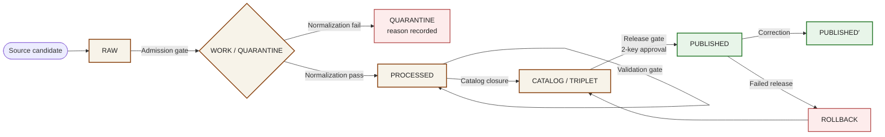
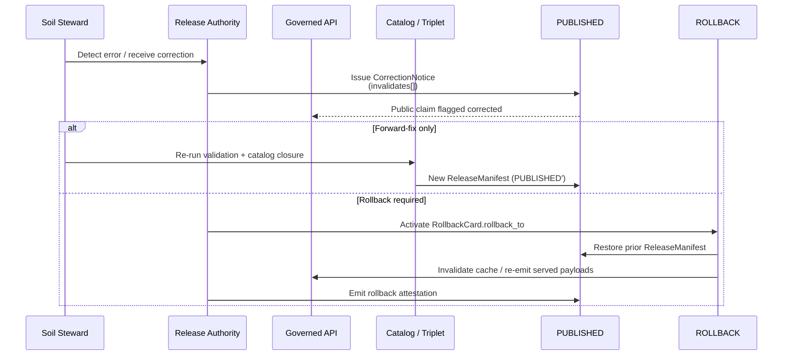

<!-- [KFM_META_BLOCK_V2]
doc_id: kfm://doc/runbooks/soil/promotion-runbook
title: Soil Promotion Runbook
type: standard
version: v0.1
status: draft
owners: [Soil domain steward, Release authority, Docs steward]
created: 2026-05-12
updated: 2026-05-12
policy_label: public
related:
  - docs/doctrine/directory-rules.md
  - docs/doctrine/lifecycle-law.md
  - docs/doctrine/truth-posture.md
  - docs/domains/soil/README.md
  - docs/runbooks/soil/ROLLBACK_RUNBOOK.md
  - docs/runbooks/soil/VALIDATION_RUNBOOK.md
  - contracts/domains/soil/README.md
  - schemas/contracts/v1/domains/soil/
  - policy/domains/soil/
  - release/README.md
tags: [kfm, soil, runbook, promotion, lifecycle, governance]
notes:
  - File placement is PROPOSED; nested-domain pattern under docs/runbooks/ may be revised to a flat
    soil_PROMOTION.md naming once a docs/runbooks/README.md convention is established.
  - Tool commands shown are illustrative; verify against the mounted repo before relying on them.
[/KFM_META_BLOCK_V2] -->

# 🌱 Soil Promotion Runbook

> Operational procedure for promoting Soil-domain candidates through the KFM lifecycle:
> **RAW → WORK / QUARANTINE → PROCESSED → CATALOG / TRIPLET → PUBLISHED.**
> Promotion is a **governed state transition**, not a file move.

<!-- Badges are PLACEHOLDERS until the mounted repo confirms CI workflow names, branch protection rules,
     and release-manifest endpoints. Replace targets when verified. -->


| Field | Value |
|---|---|
| **Status** | `draft` — PROPOSED implementation; doctrine CONFIRMED |
| **Owners** | Soil domain steward · Release authority · Docs steward |
| **Reviewers required** | Soil steward + Release authority (two-key, separation of duties) |
| **Last updated** | 2026-05-12 |
| **Truth posture** | cite-or-abstain · finite outcomes: `ANSWER` / `ABSTAIN` / `DENY` / `ERROR` |
| **Lifecycle invariant** | RAW → WORK / QUARANTINE → PROCESSED → CATALOG / TRIPLET → PUBLISHED |
| **Authority basis** | Directory Rules §0, §3 (Lifecycle invariant); Master Pipeline Gate Reference; Soil domain dossier (Atlas §5, Encyclopedia §7.3) |

---

## 📑 Contents

1. [Purpose & Scope](#1-purpose--scope)
2. [Repo Fit](#2-repo-fit)
3. [Preconditions](#3-preconditions)
4. [Promotion Flow Overview](#4-promotion-flow-overview)
5. [Gate-by-Gate Procedure](#5-gate-by-gate-procedure)
6. [The Promotion Gate Matrix A–G](#6-the-promotion-gate-matrix-ag)
7. [Soil-Specific Validators & Fixtures](#7-soil-specific-validators--fixtures)
8. [Rights, Sensitivity & Support-Type Separation](#8-rights-sensitivity--support-type-separation)
9. [Quarantine Handling](#9-quarantine-handling)
10. [Receipts, Manifests & Audit Trail](#10-receipts-manifests--audit-trail)
11. [Rollback & Correction Path](#11-rollback--correction-path)
12. [Decision Outcomes & Failure Modes](#12-decision-outcomes--failure-modes)
13. [Steward Checklist](#13-steward-checklist)
14. [Common Failure Modes & Remediation](#14-common-failure-modes--remediation)
15. [FAQ](#15-faq)
16. [Related Docs](#16-related-docs)
17. [Appendix](#17-appendix)

---

## 1. Purpose & Scope

This runbook tells a Soil-domain steward, release authority, or on-call reviewer **how to move a Soil candidate from admission to publication safely**, and **how to refuse to move it** when the evidence, rights, sensitivity, or release state cannot justify exposure.

**In scope.** Promotion of Soil objects across the five lifecycle phases, the seven Promotion Gates (A–G), Soil-specific validators (MUKEY/COKEY/CHKEY lineage, horizon depth, support-type separation, soil-moisture QC, dual-hash stability, catalog closure), the receipts and manifests required at each gate, and the rollback / correction paths bound to each release.

**Out of scope.** Source registration intake (see `docs/sources/SOURCE_DESCRIPTOR_STANDARD.md` — *PROPOSED*); raw connector implementation (see `connectors/`); cross-domain analytical joins (governed by the consuming domain's runbook); UI rendering of soil layers (see Map Shell architecture).

**Soil objects in scope (CONFIRMED object-family spine / PROPOSED implementation):**

`SoilMapUnit` · `SoilComponent` · `Horizon` · `SoilProperty` · `HydrologicSoilGroup` · `SoilMoistureObservation` · `ErosionRisk` · `SuitabilityRating` · `Pedon` · `SoilProfileView` · `ComponentHorizonJoin` · `SoilTimeCaveat`

> [!IMPORTANT]
> **Promotion is a governed state transition, not a file move.** A directory move that bypasses validators, policy gates, EvidenceBundle creation, catalog closure, and release-decision recording is a violation of the lifecycle invariant regardless of where the bytes ended up. If you find yourself reaching for `mv`, stop and consult §5.

[⬆ Back to top](#-soil-promotion-runbook)

---

## 2. Repo Fit

This runbook lives under the human-facing control plane (`docs/`), inside the runbooks branch that holds ops procedures, rollback drills, and validation runs.

**Path (PROPOSED — see Notes):** `docs/runbooks/soil/PROMOTION_RUNBOOK.md`

**Upstream doctrine (read first):**

- `docs/doctrine/directory-rules.md` — placement and lifecycle authority
- `docs/doctrine/lifecycle-law.md` — RAW → PUBLISHED invariant
- `docs/doctrine/truth-posture.md` — cite-or-abstain
- `docs/doctrine/trust-membrane.md` — watcher-as-non-publisher

**Sibling runbooks (PROPOSED):**

- `docs/runbooks/soil/VALIDATION_RUNBOOK.md`
- `docs/runbooks/soil/ROLLBACK_RUNBOOK.md`
- `docs/runbooks/soil/CORRECTION_RUNBOOK.md`

**Downstream consumers (must read for cross-domain promotions touching Soil):**

- `docs/runbooks/agriculture/PROMOTION_RUNBOOK.md` *(PROPOSED)*
- `docs/runbooks/hydrology/PROMOTION_RUNBOOK.md` *(PROPOSED)*
- `docs/runbooks/habitat/PROMOTION_RUNBOOK.md` *(PROPOSED)*

**Machine-readable anchors:**

| Concern | Where it lives |
|---|---|
| Soil object **meaning** | `contracts/domains/soil/` *(PROPOSED)* |
| Soil object **shape** | `schemas/contracts/v1/domains/soil/` *(PROPOSED)* per ADR-0001 |
| Soil **admissibility / policy** | `policy/domains/soil/` *(PROPOSED)* |
| Soil **tests & fixtures** | `tests/domains/soil/`, `fixtures/domains/soil/` *(PROPOSED)* |
| Soil **lifecycle data** | `data/{raw,work,quarantine,processed}/soil/...` |
| Soil **release decisions** | `release/candidates/soil/`, `release/manifests/` |
| Soil **rollback artifacts** | `data/rollback/soil/<release_id>/` |

[⬆ Back to top](#-soil-promotion-runbook)

---

## 3. Preconditions

Do not begin a promotion attempt unless the following are present **and verifiable**.

> [!CAUTION]
> Default-deny is in force. Any unresolved item below halts the promotion and produces a structured `DENY` or `ABSTAIN`. Do not "fix it later" — fix it before re-running.

### 3.1 Source-side preconditions

- [ ] `SourceDescriptor` exists for every contributing source (SSURGO, gSSURGO, SDA, Mesonet, SCAN, USCRN, SMAP, NASIS-derived tables, etc.) — covers `source_id`, `source_role`, `authority`, `rights`, `sensitivity`, `cadence`, `ingest_hash`, `citation`, `time`.
- [ ] Rights and terms for each source are recorded and currently valid. **Unknown rights fail closed.**
- [ ] Source role is unambiguous — authority / observation / context / model / synthetic / candidate — and is not invented by AI.
- [ ] Raw payload or reference is captured under `data/raw/soil/<source_id>/<run_id>/` with checksum.

### 3.2 Candidate-side preconditions

- [ ] Candidate carries normalized schema, geometry, time, identity, evidence, rights, and policy attributes.
- [ ] `EvidenceRef`s are present for every consequential claim and resolve to admissible `EvidenceBundle`s.
- [ ] Required receipts for the target phase are emitted (see §10).
- [ ] Determinism: `spec_hash`, `content_hash`, and `geometry_hash` are computable and stable across a clean rebuild.

### 3.3 Reviewer-side preconditions

- [ ] Soil domain steward is available; release authority is **distinct** from the original author when materiality applies (two-key).
- [ ] Open `ReviewRecord` queue is workable (no blocking unresolved corrections on prior releases).
- [ ] Rollback target for the current `PUBLISHED` baseline is known and drilled.

[⬆ Back to top](#-soil-promotion-runbook)

---

## 4. Promotion Flow Overview

The Soil lane follows the KFM lifecycle invariant. Every arrow below is a **governed transition**, not a path move.



> [!NOTE]
> The diagram represents the **doctrinal** flow described in the Atlas §8 Master Pipeline Gate Reference and the Soil pipeline-shape table. Exact tool entrypoints and CI workflow names are NEEDS VERIFICATION — see §17.

[⬆ Back to top](#-soil-promotion-runbook)

---

## 5. Gate-by-Gate Procedure

Each subsection covers one lifecycle transition: **what it requires**, **what you do**, **how it can fail**, and **what receipts must exist when it succeeds**.

### 5.1 Admission — (— → `RAW`)

**Goal.** Capture an immutable source-native payload (or reference) with enough provenance that nothing downstream has to guess.

**Inputs.** A registered `SourceDescriptor`; the source payload or pointer; minimal rights and source-role intent.

**Actions.**

1. Verify the source is in the **approved** state in `data/registry/sources/` *(PROPOSED)*. Retired or quarantined sources cannot admit.
2. Compute the payload hash (or reference hash).
3. Land the raw bytes under `data/raw/soil/<source_id>/<run_id>/` and emit `SourceDescriptor` and the admission receipt.

**Failure-closed outcome.** Source not admitted; logged as a candidate awaiting steward.

**Required artifacts on success.** `SourceDescriptor` · raw capture receipt with hash.

> [!WARNING]
> **No public RAW access.** RAW is never reachable from the public client, the governed API surface, the Evidence Drawer, or Focus Mode. If a route serves bytes out of `data/raw/`, escalate as a trust-membrane incident.

### 5.2 Normalization — (`RAW` → `WORK` / `QUARANTINE`)

**Goal.** Normalize schema, geometry, time, identity, evidence linkage, rights, and policy. Hold every failure in `QUARANTINE` with a recorded reason.

**Inputs.** RAW payload; soil-domain schemas; soil-domain policy bundle.

**Actions.**

1. Run schema validation against `schemas/contracts/v1/domains/soil/` *(PROPOSED)*.
2. Apply geometry normalization (reprojection, generalization, snap) and emit `TransformReceipt` for each step.
3. Resolve identity: `MUKEY` / `COKEY` / `CHKEY` lineage must be coherent for SSURGO / gSSURGO derivatives (see §7).
4. Run the source / rights / sensitivity policy gate.

**Failure-closed outcome.** Quarantine with structured reason under `data/quarantine/soil/<reason>/<run_id>/`. **Never silently promote.**

**Required artifacts on success.** `TransformReceipt`(s) · `ValidationReport` (working set) · `PolicyDecision`.

### 5.3 Validation — (`WORK` → `PROCESSED`)

**Goal.** Prove the normalized object passes deterministic validation, sensitivity transforms, and aggregation rules (where applicable), and that public-safe candidate fields are ready.

**Inputs.** WORK candidate; soil validator suite (§7); applicable fixtures.

**Actions.**

1. Run the layered soil validator suite (Shape → Meaning → Source → Evidence → Policy → Lifecycle → Receipt → Release pre-flight).
2. Apply `RedactionReceipt` if sensitivity transforms apply (rare for soil; common where pedon owner-identifying fields exist).
3. Apply `AggregationReceipt` if the candidate aggregates station observations to public-safe units (e.g., decadal county roll-up).
4. Confirm `EvidenceRef`s resolve to admissible `EvidenceBundle`s.

**Failure-closed outcome.** Stay in WORK with a structured `FAIL` outcome attached to the run.

**Required artifacts on success.** `ValidationReport` with `passes` and zero blocking `failures` · `RedactionReceipt` / `AggregationReceipt` where applied · `EvidenceRef`s.

### 5.4 Catalog Closure — (`PROCESSED` → `CATALOG` / `TRIPLET`)

**Goal.** Bind every published-candidate artifact to a catalog record, an `EvidenceBundle`, and (when applicable) a graph/triplet projection. **No orphan artifacts.**

**Inputs.** PROCESSED candidates; catalog matrix; evidence resolver.

**Actions.**

1. Emit `CatalogRecord` / `CatalogMatrix` entries referencing source, schema, validation, policy, and release metadata.
2. Resolve `EvidenceRef` → `EvidenceBundle` and persist the bundle under `data/proofs/evidence_bundle/`.
3. Compute graph/triplet projection if the candidate participates in cross-lane relations (Soil ↔ Agriculture, Soil ↔ Hydrology, Soil ↔ Habitat, Soil ↔ Geology).
4. Run **catalog closure validation** — every candidate dataset/layer carries source, schema, validation, policy, and release metadata.

**Failure-closed outcome.** HOLD at `PROCESSED`; structured `FAIL`; no public edge.

**Required artifacts on success.** `CatalogMatrix` entry · `EvidenceBundle` · `GraphDelta` / `Triplet` if applicable.

### 5.5 Release — (`CATALOG` / `TRIPLET` → `PUBLISHED`)

**Goal.** Move a release-candidate behind a `ReleaseManifest` with a known rollback target, a correction path, and a `ReviewRecord` where required. Two-key approval applies when materiality justifies it.

**Inputs.** Catalog-closed candidate; `EvidenceBundle`; rollback target; review queue.

**Actions.**

1. Open a `ReviewRecord` and complete steward + release-authority review (two-key for material releases).
2. Bind the release into a `ReleaseManifest` (`release_id`, `contents[]`, `digests`, `evidence_refs[]`, `rollback_target`, `time`).
3. Run the **Promotion Gate Matrix A–G** (§6). Any deny → `DENY`, surface remediation.
4. Sign the release receipt (cosign / DSSE expected; verify against `policy/release/` *(PROPOSED)*).
5. Publish via the **governed API**, not by directory move. Public clients read released payloads only.

**Failure-closed outcome.** HOLD at `CATALOG`; no public surface change; reviewer surface shows the gate failures with remediation.

**Required artifacts on success.** `ReleaseManifest` · `ReviewRecord` (when required) · signed release receipt · `RollbackCard` (registered, even if rollback is "not safe to roll back; forward-fix only" with reason) · `CorrectionNotice` template prepared.

### 5.6 Correction — (`PUBLISHED` → `PUBLISHED′`)

**Goal.** When a published soil claim is wrong, **publish the correction**, invalidate downstream derivatives, and (if necessary) roll back. Corrections are governance events, not patches.

**Inputs.** Detected error or new evidence; downstream derivative inventory.

**Actions.** See `docs/runbooks/soil/CORRECTION_RUNBOOK.md` *(PROPOSED)*. Summary: open `ReviewRecord`, issue `CorrectionNotice` referencing the prior release, identify invalidated derivatives, optionally roll back via `RollbackCard`.

[⬆ Back to top](#-soil-promotion-runbook)

---

## 6. The Promotion Gate Matrix A–G

CONFIRMED doctrine: every dataset entering `PUBLISHED` passes these seven gates. **Auto-merge fires only when all seven pass. Any failure blocks the merge until remediation.** The Soil lane uses the same matrix as every other domain; remediation guidance below is Soil-specific where relevant.

| Gate | Human-facing intent | Machine check (PROPOSED) | Required evidence | Common Soil failure |
|---|---|---|---|---|
| **A — Structure & Metadata** | The artifact is well-formed and self-describing. | `check_structure` (Meta-Block presence, zone correctness, file layout). | Meta block, path conformance. | Pedon dataset emitted to wrong lifecycle phase. |
| **B — Schemas & Contracts** | Shape matches the contract; vocabulary is honored. | JSON Schema + OpenAPI validation. | `ValidationReport`, schema digest. | `Horizon.depth_top` exceeds `depth_bottom`; missing `HydrologicSoilGroup` enum. |
| **C — Policy Parity** | CI policy result equals runtime policy result. | Conftest/OPA bundle pinned by digest; same bundle in CI and at runtime. | `PolicyDecision`, policy digest. | Rego bundle drift between CI and PDP — release blocked. |
| **D — Security & Sensitivity** | Rights are allowlisted; sensitive geometry is generalized. | Sensitivity scan; license SPDX allowlist; rights register. | `RedactionReceipt`, `PolicyDecision`. | Pedon owner-identifying field present; rights status unknown for a derived layer. |
| **E — Data Quality** | DQ thresholds pass; assertions hold. | DQ profilers/assertions with thresholds. | DQ report, `ValidationReport`. | Soil-moisture station with > N% gaps in window; support-type masquerade detected (see §7). |
| **F — Provenance & Lineage** | Every claim is traceable to a receipt and a source. | Receipt presence + lineage validation; `EvidenceRef` → `EvidenceBundle` round-trip. | `EvidenceBundle`, `RunReceipt`, `TransformReceipt`. | Missing `spec_hash`; unresolved `EvidenceRef`. |
| **G — Reviewability** | A human + policy approval is on record (two-key). | CODEOWNERS-enforced human approval + policy approval. | `ReviewRecord`. | Author and approver are the same identity; release authority absent. |

> [!IMPORTANT]
> **Policy Parity (Gate C) is the bedrock.** The same OPA bundle (pinned by digest) MUST run in CI (Conftest) and at runtime (PDP / Gatekeeper). A diverging bundle is a release-blocking incident.

**Default-deny posture.** Promotion is denied unless: `spec_hash` is present and matches a recomputation; the run receipt is cosign-signed and verifiable; SPDX rights are in the allowlist; at least one attestation bundle is published; and every DQ check has `status: pass`. **Absence of evidence blocks promotion.**

[⬆ Back to top](#-soil-promotion-runbook)

---

## 7. Soil-Specific Validators & Fixtures

The Soil domain carries six PROPOSED validator families. All are `PROPOSED implementation / CONFIRMED doctrine` until mounted-repo evidence confirms them.

| Validator family | What it proves | Default failure | Status |
|---|---|---|---|
| **MUKEY / COKEY / CHKEY lineage** | SSURGO and gSSURGO derivatives carry coherent map-unit / component / horizon key chains; no orphan COKEYs. | `ERROR` / quarantine | PROPOSED |
| **Horizon depth sanity** | `depth_top < depth_bottom`; horizons of a given pedon are non-overlapping and ordered. | `ERROR` / quarantine | PROPOSED |
| **Soil-moisture unit / depth / QC** | Station observations carry units (VWC % or fraction), standardized depth (5 / 10 / 20 / 50 cm or documented), and QC flag passes. | `ERROR` / quarantine | PROPOSED |
| **Support-type separation denial** | Static survey, gridded derivative, station reading, satellite grid, pedon evidence, and interpretation cannot masquerade as a single surface. | `DENY` | PROPOSED |
| **Dual-hash stability** | `spec_hash` and `content_hash` are stable across clean rebuilds; receipts pin both. | `ERROR` / release block | PROPOSED |
| **Catalog closure + Evidence Drawer** | Every released soil feature resolves to an `EvidenceBundle` and renders in the Evidence Drawer with citations. | `ABSTAIN` (Drawer) / `DENY` (release) | PROPOSED |

> [!TIP]
> **Support-type separation is the load-bearing Soil validator.** A 30-meter gNATSGO raster, a 1-km SMAP grid, a Kansas Mesonet station reading, an SSURGO polygon, and a pedon profile are not interchangeable. Any candidate that mixes them into a single surface without an explicit `RepresentationReceipt` and a Reality Boundary Note fails the gate.

**Resolution-tagging convention (Soil-specific).** When a derived product mixes resolutions (10 m SSURGO vs 30 m gNATSGO vs 250 m SoilGrids vs 1 km SMAP), each derived value MUST carry the source resolution and resampling method as exposed catalog tags. Silent resampling that conflates resolutions is a release-blocking violation.

[⬆ Back to top](#-soil-promotion-runbook)

---

## 8. Rights, Sensitivity & Support-Type Separation

CONFIRMED doctrine: **unclear rights, unresolved source role, missing evidence, unresolved sensitivity, or absent release state blocks public promotion.**

### 8.1 Rights posture

| Source family | Rights status (per dossier) | Promotion behavior |
|---|---|---|
| NRCS SSURGO / gSSURGO / gNATSGO / SDA | NEEDS VERIFICATION — sensitive joins fail closed | Confirm current terms before public release |
| Kansas Mesonet soil moisture | NEEDS VERIFICATION — written consent / attribution may apply | Confirm REST feed terms; record attribution in `ReleaseManifest` |
| NRCS SCAN · NOAA USCRN | NEEDS VERIFICATION | Confirm terms; record attribution |
| NASA SMAP | NEEDS VERIFICATION | Confirm Earthdata terms; record attribution |
| NASIS-derived tables | NEEDS VERIFICATION — may carry owner-identifying fields | Default to redaction; review pedon owner fields |

### 8.2 Sensitivity posture

Soil sensitivity is generally lower than fauna/flora/archaeology, but the following raise the bar:

- **Pedon owner-identifying fields** (landowner, site descriptor, exact coordinates) — redact or generalize.
- **Field-level joins with private agricultural operations** — these belong to the Agriculture domain's sensitive lane, not to Soil; refer the request rather than absorbing it.
- **Cross-lane joins** with Habitat / Fauna / Flora must preserve `rare-location` controls owned by those lanes; Soil never publishes rare-location coordinates as a side effect of substrate context.

> [!WARNING]
> **Default-DENY:** Unreviewed exact sensitive Soil locations or private data MUST NOT publish for a public visitor. Policy approval + redaction receipt are mandatory before any restricted-to-public elevation.

### 8.3 Support-type separation (CONFIRMED / PROPOSED)

This is the Soil domain's signature publication discipline. The six support types are:

1. `static_survey_soil` — SSURGO map-unit polygons, NASIS pedon descriptors.
2. `gridded_derivative_soil` — gSSURGO / gNATSGO rasters.
3. `station_soil_moisture` — Mesonet / SCAN / USCRN observations.
4. `satellite_grid_soil` — SMAP and similar.
5. `pedon_evidence` — individual pedon descriptors.
6. `interpretation` — Soil/Crop Suitability, Hydrologic Soil Group, Erosion Risk.

They **must not masquerade as one surface**. Each released layer carries a support-type badge; mixed-support products require a `RepresentationReceipt` and a `RealityBoundaryNote`.

[⬆ Back to top](#-soil-promotion-runbook)

---

## 9. Quarantine Handling

Quarantine is **not a publishable staging area**. Anything in `data/quarantine/soil/<reason>/<run_id>/` is held until either: (a) the failure is repaired upstream and the candidate is re-admitted through Normalization; or (b) the candidate is rejected and the entry deprecated.

**Common quarantine reasons (Soil):**

- `rights_unknown` — source terms not yet recorded.
- `support_type_masquerade` — candidate mixes support types without a `RepresentationReceipt`.
- `mukey_lineage_break` — orphan COKEY or CHKEY; broken SSURGO chain.
- `horizon_depth_invalid` — overlapping / inverted horizons.
- `unit_mismatch` — soil-moisture observation lacks unit or depth.
- `sensitivity_unresolved` — pedon owner-identifying field present without a redaction plan.

**Workflow.** A quarantined candidate gets a `PolicyDecision` with reason; the Soil steward reviews; remediation either lands as a re-ingest with a fresh `run_id` or a deprecation entry under `release/deprecation_register.yaml` *(PROPOSED)*.

> [!NOTE]
> Quarantine is governance memory. Do not delete quarantine entries; deprecate them. A quarantined run that is later understood to have been a false-positive on a validator should remain visible as a lineage receipt — the validator is the artifact that learned.

[⬆ Back to top](#-soil-promotion-runbook)

---

## 10. Receipts, Manifests & Audit Trail

CONFIRMED doctrine: **if no receipt exists, the operation did not happen in the governed sense.**

| Receipt / artifact | Triggered by | Phase emitted | Soil-specific notes |
|---|---|---|---|
| `SourceDescriptor` | Source admission | all | One per soil source family; never invented by AI. |
| `TransformReceipt` | Geometry / projection / generalization | RAW → WORK · WORK → PROCESSED · PROCESSED → CATALOG | Pin reprojection (e.g., to `EPSG:5070`) and any generalization tolerance. |
| `RedactionReceipt` | Sensitivity transform | WORK · PROCESSED · CATALOG · PUBLISHED | Required for pedon owner-identifying fields. |
| `AggregationReceipt` | Aggregation roll-up | WORK · PROCESSED · CATALOG · PUBLISHED | Required for county-year / HUC roll-ups; pins geometry scope, time scope, suppression rule. |
| `ModelRunReceipt` | Model-derived output | WORK · PROCESSED · CATALOG · PUBLISHED | Required for SuitabilityRating, ErosionRisk modeled surfaces. |
| `RepresentationReceipt` | Representation step where surface fidelity ≠ evidence fidelity | PROCESSED · CATALOG · PUBLISHED | **Mandatory for mixed-support products and 3D scenes.** |
| `ValidationReport` | Validator run | WORK · PROCESSED · CATALOG | Carries the six Soil validator families' results (§7). |
| `PolicyDecision` | Every gate | all | `ANSWER` / `ABSTAIN` / `DENY` / `ERROR`. |
| `EvidenceBundle` | Catalog closure | PROCESSED · CATALOG · PUBLISHED | Content-addressed by `spec_hash`. |
| `CatalogMatrix` | Catalog closure | CATALOG | Soil entry must link source, schema, validation, policy, release metadata. |
| `ReviewRecord` | Two-key review | WORK · PROCESSED · CATALOG · PUBLISHED | Required for material soil releases. |
| `ReleaseManifest` | Release decision | CATALOG · PUBLISHED | Binds `release_id`, contents, digests, evidence refs, **rollback_target**, time. |
| `RollbackCard` | Failed release / correction | CATALOG · PUBLISHED | Required for **every** soil release, even when forward-fix-only. |
| `CorrectionNotice` | Post-publication correction | PUBLISHED | Names what changed, why, and which derivatives are invalidated. |
| `AIReceipt` | Focus Mode answer over soil evidence | PUBLISHED (Focus only) | AI never root truth; must cite released `EvidenceBundle`s. |

[⬆ Back to top](#-soil-promotion-runbook)

---

## 11. Rollback & Correction Path

CONFIRMED doctrine: **rollback untested is not reliable.** Every soil release has a `RollbackCard` and an executed rollback drill on record.



**Rollback rules.**

1. The rollback target is the prior `ReleaseManifest` and its digests; **not** a directory snapshot.
2. A rollback emits its own attestation (a rollback receipt) and is reviewable.
3. Derived layers (PMTiles, GeoParquet, tile caches, vector indexes, graph projections) MUST regenerate from the restored manifest; do not promote a stale derived artifact.
4. The rollback drill is **rehearsed**, not theoretical — see `docs/runbooks/soil/ROLLBACK_RUNBOOK.md` *(PROPOSED)*.

**Correction rules.**

1. Always permitted; downgrade (`PUBLISHED` → restricted) requires only `CorrectionNotice` + `ReviewRecord`. Upgrade requires both a transform receipt and a review record.
2. Corrections name the **derivative invalidation set**. Downstream consumers (Agriculture suitability, Hydrology soil-moisture joins, Habitat substrate context) MUST be notified.
3. `CorrectionNotice` is published with the corrected claim; it does not silently overwrite.

[⬆ Back to top](#-soil-promotion-runbook)

---

## 12. Decision Outcomes & Failure Modes

CONFIRMED doctrine: every governed surface returns a finite outcome.

| Outcome | When it applies in Soil promotion | Consequence |
|---|---|---|
| **ANSWER** | All gates pass; release admitted. | `PUBLISHED` transition recorded; `ReleaseManifest` available; public clients can resolve via the governed API. |
| **ABSTAIN** | Material temporal scope missing; `EvidenceRef` does not resolve; identity ambiguity (e.g., MUKEY crosswalk uncertain); stale-source threshold reached. | No public claim; reviewer surface shows abstain reason. |
| **DENY** | Rights unknown; support-type masquerade; sensitive geometry public-exposure attempt; policy bundle mismatch (Gate C). | Release blocked; remediation surfaced. |
| **ERROR** | Validator failure (Gate B / E); receipt absent (Gate F); structural failure (Gate A). | Stay in current phase; structured FAIL outcome attached to the run. |

[⬆ Back to top](#-soil-promotion-runbook)

---

## 13. Steward Checklist

Use this as the PR / promotion checklist. **Every box must be checked or explicitly labeled `N/A — <reason>` before the release authority signs.**

**Source & rights**

- [ ] `SourceDescriptor` present and current for every contributing source.
- [ ] Source role unambiguous (authority / observation / context / model / synthetic).
- [ ] Rights status confirmed and SPDX-allowlisted.
- [ ] Stale-source check passes against expected cadence.

**Shape & meaning**

- [ ] Schema validation passes against `schemas/contracts/v1/domains/soil/` *(PROPOSED)*.
- [ ] Contract vocabulary honored (no silent renaming of `MUKEY`, `HydrologicSoilGroup`, etc.).
- [ ] MUKEY / COKEY / CHKEY lineage validator passes.
- [ ] Horizon depth sanity validator passes.

**Evidence & lineage**

- [ ] `EvidenceRef`s resolve to admissible `EvidenceBundle`s.
- [ ] `spec_hash` and `content_hash` recompute identically on a clean rebuild.
- [ ] `RunReceipt` cosign signature verifies.
- [ ] At least one attestation bundle published.

**Policy & sensitivity**

- [ ] Soil policy bundle (Conftest/OPA) passes; CI digest matches runtime digest (Gate C).
- [ ] Support-type separation denial fixture passes; mixed-support products carry `RepresentationReceipt`.
- [ ] Sensitivity transforms applied where pedon owner-identifying fields exist.
- [ ] Resolution-tagging present on any multi-resolution derived product.

**Data quality**

- [ ] DQ thresholds met for soil-moisture observations (unit, depth, QC flag).
- [ ] Aggregation suppression rule applied where county-year roll-ups exist.
- [ ] No silent resampling between support types.

**Catalog & release**

- [ ] `CatalogMatrix` entry references source, schema, validation, policy, release metadata.
- [ ] `EvidenceBundle` persisted under `data/proofs/evidence_bundle/`.
- [ ] `ReleaseManifest` includes `rollback_target`, `correction_path`, `evidence_refs[]`.
- [ ] `RollbackCard` registered; drill rehearsed or scheduled.

**Review & two-key**

- [ ] `ReviewRecord` open; steward + release-authority identities are distinct.
- [ ] CODEOWNERS-enforced approval applied.
- [ ] Branch-protection / required-checks rollup is green.

[⬆ Back to top](#-soil-promotion-runbook)

---

## 14. Common Failure Modes & Remediation

| Failure mode | Likely gate | Remediation |
|---|---|---|
| MUKEY orphan / COKEY without parent map unit | B, F | Re-ingest SSURGO snapshot; verify SDA pull integrity; fix join. |
| Horizon depths overlap or invert | B, E | Reject candidate at WORK; surface as quarantine reason `horizon_depth_invalid`. |
| Soil-moisture observation lacks unit or depth | B, E | Reject at WORK; reason `unit_mismatch`. |
| Mixed-resolution product without resolution tags | E, F | Emit `RepresentationReceipt`; add resolution tags to catalog; or split into per-resolution layers. |
| Pedon owner-identifying field reaches PROCESSED | D | Apply `RedactionReceipt` or quarantine with reason `sensitivity_unresolved`. |
| OPA bundle digest in CI ≠ runtime | C | Block release; rebuild bundle from canonical source; re-run promotion. |
| Missing `RollbackCard` at release | G | Block release; either register card or document `forward_fix_only` reason. |
| `EvidenceRef` resolves to a stale bundle | F | Re-run catalog closure; refresh `EvidenceBundle`; verify content-address. |
| Stale source (cadence breach) | D, E | Surface stale badge in UI; emit `ABSTAIN` on Focus Mode answers; do not publish derived layer. |
| Author = approver | G | Reassign release authority to a distinct identity. |

[⬆ Back to top](#-soil-promotion-runbook)

---

## 15. FAQ

**Q. Can I promote a Soil candidate by moving files between `data/work/` and `data/processed/`?**
No. Promotion is a governed state transition. A directory move that bypasses validators, policy, EvidenceBundle creation, and catalog closure is a lifecycle-invariant violation regardless of where the bytes ended up.

**Q. My candidate passes every validator but rights status is "NEEDS VERIFICATION". Can I publish behind a "preliminary" badge?**
No. Default-deny applies. Unknown rights fail closed. Confirm terms first; either elevate to a restricted tier with `RedactionReceipt` + `PolicyDecision`, or keep at `CATALOG` until rights resolve.

**Q. We need to ship a Soil layer that mixes gSSURGO and SMAP. How?**
Emit a `RepresentationReceipt` documenting method and inputs, attach a `RealityBoundaryNote` to the layer, carry resolution tags on every derived value, and pass the support-type separation validator (the validator must distinguish the support types, not deny their composition outright when documented).

**Q. Focus Mode answered a soil question without citing a `EvidenceBundle`. Is that allowed?**
No. AI is never root truth. Focus Mode must `ABSTAIN` if `EvidenceRef`s do not resolve. Uncited answers are a release-class defect — file under `AIReceipt` failures.

**Q. Author and approver are the same person — small team. What do I do?**
Material releases require distinct identities. For non-material updates, document the materiality reasoning in the `ReviewRecord`. If materiality is genuinely material and no second identity is available, the release does not promote. Two-key is the bedrock of Gate G.

**Q. We've corrected a soil claim; do I have to roll back?**
Not always. `CorrectionNotice` + new `ReleaseManifest` (`PUBLISHED′`) is sufficient when the correction is additive or the prior claim is superseded cleanly. Roll back only when prior claims must be withdrawn or when downstream derivatives cannot be safely re-synthesized.

[⬆ Back to top](#-soil-promotion-runbook)

---

## 16. Related Docs

**Doctrine**

- `docs/doctrine/directory-rules.md` — placement and lifecycle authority *(CONFIRMED)*
- `docs/doctrine/lifecycle-law.md` *(PROPOSED)*
- `docs/doctrine/truth-posture.md` *(PROPOSED)*
- `docs/doctrine/trust-membrane.md` *(PROPOSED)*

**Domain**

- `docs/domains/soil/README.md` *(PROPOSED)*
- `contracts/domains/soil/` *(PROPOSED)*
- `schemas/contracts/v1/domains/soil/` *(PROPOSED)*
- `policy/domains/soil/` *(PROPOSED)*

**Runbooks (siblings)**

- `docs/runbooks/soil/VALIDATION_RUNBOOK.md` *(PROPOSED)*
- `docs/runbooks/soil/ROLLBACK_RUNBOOK.md` *(PROPOSED)*
- `docs/runbooks/soil/CORRECTION_RUNBOOK.md` *(PROPOSED)*

**Cross-lane**

- `docs/runbooks/agriculture/PROMOTION_RUNBOOK.md` *(PROPOSED)*
- `docs/runbooks/hydrology/PROMOTION_RUNBOOK.md` *(PROPOSED)*

**Registers**

- `control_plane/policy_gate_register.yaml` *(PROPOSED)*
- `control_plane/release_state_register.yaml` *(PROPOSED)*
- `docs/registers/VERIFICATION_BACKLOG.md` *(PROPOSED)*

[⬆ Back to top](#-soil-promotion-runbook)

---

## 17. Appendix

<details>
<summary><strong>A. Verification backlog (open items)</strong></summary>

| Item | What would settle it | Status |
|---|---|---|
| Exact runbook filename convention under `docs/runbooks/` (nested `soil/` vs flat `soil_PROMOTION.md`) | mounted-repo evidence; `docs/runbooks/README.md` convention | NEEDS VERIFICATION |
| Soil schema home (`schemas/contracts/v1/domains/soil/`) | mounted-repo file presence; ADR-0001 confirmation | NEEDS VERIFICATION |
| Soil policy bundle home (`policy/domains/soil/`) | mounted-repo file presence | NEEDS VERIFICATION |
| Soil validator implementations (MUKEY lineage, horizon depth, support-type separation, dual-hash, soil-moisture QC, catalog closure) | mounted-repo tests + fixtures | NEEDS VERIFICATION |
| CI workflow names for Soil promotion (e.g., `.github/workflows/promotion-soil.yml`) | mounted-repo `.github/workflows/` | NEEDS VERIFICATION |
| Release manifest schema location | mounted-repo `schemas/contracts/v1/release/` | NEEDS VERIFICATION |
| Cosign / DSSE attestation toolchain in CI | mounted-repo CI evidence | NEEDS VERIFICATION |
| Rights register entries for SSURGO, gSSURGO, SDA, Mesonet, SCAN, USCRN, SMAP | mounted-repo `data/registry/rights/` | NEEDS VERIFICATION |
| SPDX allowlist (CC0-1.0, CC-BY-4.0 mentioned; ODC-By, PDDL, US-PD open) | mounted-repo `policy/release/` or ADR | NEEDS VERIFICATION |
| Two-key approval enforcement (CODEOWNERS + branch protection) | mounted-repo `.github/CODEOWNERS` + branch protection settings | NEEDS VERIFICATION |

</details>

<details>
<summary><strong>B. Illustrative tool commands (PROPOSED — verify before use)</strong></summary>

> [!WARNING]
> The commands below are **illustrative pseudocode**. Tool names, flags, paths, and workflow IDs are PROPOSED and must be verified against the mounted repository before execution. Do not run these in production without confirming each invocation.

```bash
# Validate a soil candidate at WORK before requesting promotion to PROCESSED
kfm validate soil --candidate <candidate_id> --phase work
# expected exit codes: 0 PASS, 2 ABSTAIN, 3 DENY, 4 ERROR
```

```bash
# Recompute spec_hash and verify against the run receipt
kfm verify spec-hash --receipt receipts/run_<run_id>.json
```

```bash
# Run the Soil policy bundle locally; CI uses the same pinned digest
conftest test release/candidates/soil/<candidate_id>/decision_input.json \
  --policy policy/domains/soil/
```

```bash
# Open a release candidate for two-key review
kfm release open-candidate --domain soil --candidate <candidate_id>
```

```bash
# Activate the registered RollbackCard for a soil release
kfm rollback activate --release <release_id>
```

</details>

<details>
<summary><strong>C. Doctrine quick-reference (citations)</strong></summary>

- **Lifecycle invariant** — Directory Rules §0 and §9.1; Atlas §8 Master Pipeline Gate Reference.
- **Soil domain spine** — Encyclopedia §7.3 (Mission, sources, object families, pipeline); Atlas §5 (Soil — domain identity, sources, object families, pipeline shape, validators).
- **Promotion Gate Matrix A–G** — Components Pass 10 §6.5.1, idea C5-01.
- **Default-deny via signed receipts and DQ pass** — Components Pass 10 idea C5-02.
- **Policy parity (CI = runtime)** — Components Pass 10 idea C5-03.
- **Support-type separation (Soil-specific)** — Atlas §5.I; Encyclopedia §7.3 boundary statement.
- **Watcher-as-non-publisher** — Directory Rules §19 (terms reference).
- **Receipt families** — Atlas §24.2.1 (Master Receipt Catalog).
- **Finite outcomes** — Atlas §24.3 (Master Decision Outcome Envelope Reference).

</details>

<details>
<summary><strong>D. Glossary of Soil-runbook terms</strong></summary>

| Term | Meaning |
|---|---|
| **MUKEY / COKEY / CHKEY** | SSURGO identifiers for map unit / component / horizon. Their lineage is a Soil validator family. |
| **Support type** | The evidentiary class of a soil value: static survey, gridded derivative, station reading, satellite grid, pedon, interpretation. |
| **Support-type separation** | The discipline that forbids different support types from masquerading as a single surface without a `RepresentationReceipt`. |
| **Dual-hash stability** | The property that `spec_hash` and `content_hash` recompute identically on a clean rebuild. |
| **Reality Boundary Note** | A public-facing or steward-facing statement that a carrier is synthetic or reconstructed and not direct evidence. |
| **Two-key approval** | Gate G enforcement: steward identity and release-authority identity must be distinct for material releases. |
| **Stale-source rule** | The cadence-based check that ABSTAINs or applies a stale badge when a source has not refreshed within its expected window. |
| **Forward-fix only** | A `RollbackCard` posture where rollback is not safe; the only recovery is a forward correction. |

</details>

[⬆ Back to top](#-soil-promotion-runbook)

---

**Related docs:** [Directory Rules](../../doctrine/directory-rules.md) · [Soil VALIDATION Runbook](./VALIDATION_RUNBOOK.md) *(PROPOSED)* · [Soil ROLLBACK Runbook](./ROLLBACK_RUNBOOK.md) *(PROPOSED)* · [Verification Backlog](../../registers/VERIFICATION_BACKLOG.md) *(PROPOSED)*

*Last updated: 2026-05-12 · Status: draft · Doctrine CONFIRMED · Implementation PROPOSED*

[⬆ Back to top](#-soil-promotion-runbook)
