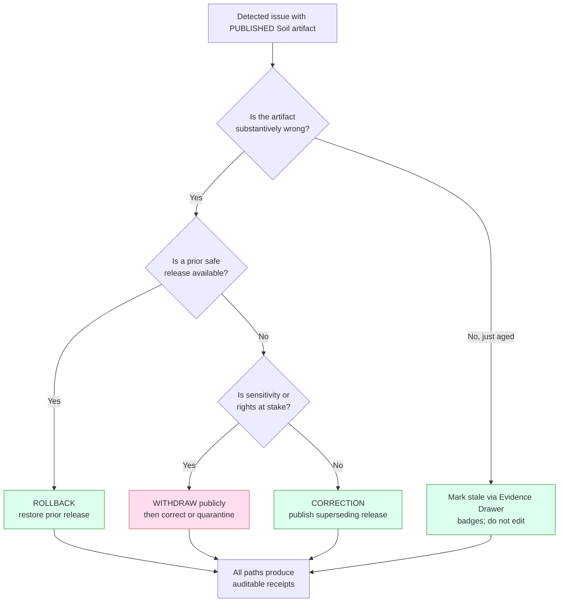

<!-- [KFM_META_BLOCK_V2]
doc_id: kfm://doc/runbook/soil/rollback
title: Soil Rollback Runbook
type: standard
version: v1
status: draft
owners: TBD — Release authority + Domain steward (Soil) + Correction reviewer; verify in CODEOWNERS
created: 2026-05-12
updated: 2026-05-12
policy_label: public
related:
  - docs/doctrine/directory-rules.md
  - docs/domains/soil/README.md
  - docs/runbooks/ui_ROLLBACK.md            # NEEDS VERIFICATION — flat-naming sibling
  - docs/runbooks/governed_ai_ROLLBACK.md   # NEEDS VERIFICATION — flat-naming sibling
  - release/rollback_cards/                 # PROPOSED — RollbackCard home
  - release/manifests/                      # PROPOSED — ReleaseManifest home
  - release/correction_notices/             # PROPOSED — CorrectionNotice home
  - schemas/contracts/v1/release/           # PROPOSED — release-object schemas
  - data/rollback/                          # PROPOSED — alias-revert receipts (data plane)
tags: [kfm, runbook, soil, rollback, governance, release]
notes:
  - Authority of doctrine: CONFIRMED.
  - Authority of repo-shaped paths quoted here: PROPOSED until verified against mounted repo.
  - Owners block is reviewable placeholder until CODEOWNERS and release-authority registry are inspected.
[/KFM_META_BLOCK_V2] -->

# Soil Rollback Runbook

> Step-by-step procedure for reversing or withdrawing a **PUBLISHED** Soil release through the governed release path — never by hidden file copy, never bypassing the trust membrane.

<!-- Badges: TODO targets — replace once CI workflow names, branch policies, and release-state register URIs are verified. -->


| Field | Value |
|---|---|
| **Status** | `draft` |
| **Owners (placeholder)** | Release authority + Domain steward (Soil) + Correction reviewer — verify against `CODEOWNERS` |
| **Last updated** | 2026-05-12 |
| **Authority of doctrine** | CONFIRMED — sourced from KFM doctrine bundle |
| **Authority of paths quoted here** | PROPOSED — repository not mounted in this drafting session |

---

## Quick jump

- [1. Purpose & scope](#1-purpose--scope)
- [2. Doctrine anchors](#2-doctrine-anchors)
- [3. Soil lane — what we are rolling back](#3-soil-lane--what-we-are-rolling-back)
- [4. Roll back, correct, or mark stale?](#4-roll-back-correct-or-mark-stale)
- [5. Defect class → rollback posture](#5-defect-class--rollback-posture)
- [6. Roles & separation of duties](#6-roles--separation-of-duties)
- [7. End-to-end rollback flow (diagram)](#7-end-to-end-rollback-flow-diagram)
- [8. The procedure](#8-the-procedure)
- [9. Artifacts a rollback must emit](#9-artifacts-a-rollback-must-emit)
- [10. Rollback drill (test it before you need it)](#10-rollback-drill-test-it-before-you-need-it)
- [11. Soil-specific notes (PMTiles, COG, MUKEY, cross-lane)](#11-soil-specific-notes-pmtiles-cog-mukey-cross-lane)
- [12. Failure modes & fail-closed behaviors](#12-failure-modes--fail-closed-behaviors)
- [13. Verification backlog](#13-verification-backlog)
- [14. Related docs](#14-related-docs)

---

## 1. Purpose & scope

This runbook describes how to **reverse or withdraw** a previously **PUBLISHED** Soil artifact — a `LayerManifest`, a `ReleaseManifest`, a tile or COG, a catalog record, an Evidence Drawer payload, or an AI answer that depended on Soil evidence — and **restore a prior safe release** through the same governed release path that produced it.

**In scope:** Soil domain releases at the lifecycle boundary `CATALOG / TRIPLET → PUBLISHED → prior release`, including derivatives that visibly cite Soil evidence (e.g., soil-crop suitability, hydrologic group views).

**Out of scope:** routine corrections that supersede with a new release (see `CorrectionNotice` flow), promotions from PROCESSED to PUBLISHED (see promotion runbook — PROPOSED), and AI-only answer withdrawals that do not touch Soil release manifests (see `docs/runbooks/governed_ai_ROLLBACK.md` — NEEDS VERIFICATION).

> [!IMPORTANT]
> **Rollback is a governed state transition, not a file move.** A `RollbackCard` MUST be authored, reviewed, and bound to a `ReleaseManifest`. Manually copying a previous tile, deleting a manifest, or pointing a CDN alias without a receipt is a doctrine violation — not a rollback.

[Back to top](#soil-rollback-runbook)

---

## 2. Doctrine anchors

**CONFIRMED doctrine** carried in from the KFM build manual, encyclopedia, Atlas v1.1, and Directory Rules:

- **Lifecycle invariant:** `RAW → WORK / QUARANTINE → PROCESSED → CATALOG / TRIPLET → PUBLISHED`. Promotion and rollback are both **governed state transitions**, not file moves.
- **Trust membrane:** public clients, normal UI surfaces, and released AI surfaces never reach RAW, WORK, QUARANTINE, canonical/internal stores, graph internals, vector indexes, source APIs, or direct model runtimes. The governed API is the only public route.
- **Cite-or-abstain:** if rolling back removes the evidence-supported claim, the surface either restores a prior evidence-supported release or **ABSTAINs** — it does not silently revert to an uncited approximation.
- **Correction ≠ rollback:** correction publishes a **superseding release** that preserves the original record; rollback **restores a prior release** as the active head. Both leave the public record inspectable.
- **Rollback flow (CONFIRMED doctrine):** identify the affected release → locate the prior safe artifact set → verify digests and manifests → disable or withdraw affected public surfaces → preserve audit receipts → mark stale or withdrawn UI state → restore or republish the rollback target through the same governed release path.

> [!NOTE]
> KFM separates **stale** (evidence/freshness aged out) from **wrong** (substance incorrect). This runbook governs the **wrong** path. Stale-state propagation is handled by stale-state markers in the Evidence Drawer; see §11 for soil-specific stale signals.

[Back to top](#soil-rollback-runbook)

---

## 3. Soil lane — what we are rolling back

A Soil release may bind any combination of the following object families (PROPOSED inventory, drawn from the Soil domain atlas):

| Object family | Examples | Identity basis (PROPOSED) |
|---|---|---|
| `SoilMapUnit` | SSURGO / gSSURGO / gNATSGO map units | source id + MUKEY + temporal scope + normalized digest |
| `SoilComponent` | components within a map unit | source id + MUKEY + COKEY + digest |
| `SoilComponentHorizonJoin` | component–horizon relations | source id + COKEY + CHKEY + digest |
| `gridded_derivative_soil` | SoilGrids 250 m, gNATSGO 30 m rasters | source id + grid spec + temporal scope + digest |
| `station_soil_moisture` | Kansas Mesonet, NRCS SCAN, NOAA USCRN observations | source id + station id + depth + time + digest |
| `pedon / profile evidence` | pedon descriptions, lab profiles | source id + pedon id + digest |
| `satellite_grid_soil` | NASA SMAP daily 1 km | source id + grid spec + acquisition time + digest |
| `interpretation / suitability` | hydrologic group, suitability derivatives | derivative spec + upstream digests |

> [!WARNING]
> **Support-type separation is mandatory.** Static survey, gridded derivative, station reading, satellite grid, pedon evidence, and interpretation cannot masquerade as one surface in the rolled-back state any more than in the published state. A rollback that collapses support types is itself a defect.

**Sources of authority (CONFIRMED families, PROPOSED current terms):** NRCS SSURGO, USDA NRCS Soil Data Access, NRCS gSSURGO, NRCS gNATSGO, ISRIC SoilGrids, Kansas Mesonet (soil moisture), NRCS SCAN, NOAA USCRN, NASA SMAP. Rights and current terms for each source: **NEEDS VERIFICATION** per the Soil source-authority register.

[Back to top](#soil-rollback-runbook)

---

## 4. Roll back, correct, or mark stale?

Choose the right action before opening any change. The wrong choice is itself a governance defect.



> [!TIP]
> If the issue is **rights** (changed source terms), **sensitivity** (operator-identifying, exact rare-species join, infrastructure-precise location), or **policy** (an OPA gate that should have denied), default to **withdraw first, then choose correction or rollback** after triage. Public exposure of unresolved rights or sensitivity is the highest-priority failure class.

[Back to top](#soil-rollback-runbook)

---

## 5. Defect class → rollback posture

CONFIRMED matrix from the KFM correction-and-rollback model, scoped to the Soil lane.

| Defect class | Soil example | Correction posture | Rollback posture |
|---|---|---|---|
| **Evidence gap** | Suitability layer cites a `SoilMapUnit` whose `EvidenceBundle` no longer resolves | ABSTAIN or withdraw the unsupported claim | Restore prior evidence-supported release |
| **Rights defect** | Source terms changed for a Soil source family | DENY public use; quarantine source/artifact | Withdraw affected artifacts |
| **Sensitivity leak** | Farm/operator-identifying join surfaced in a public derivative | Redact / generalize and notify stewards | **Immediate public disablement** |
| **Geometry defect** | Bad reprojection of gNATSGO; PMTiles geometry deformed | Rebuild derivative layer and Evidence payload | Restore previous digest-pinned artifact |
| **Temporal defect** | Soil-moisture series mislabeled `valid_time`, or station depth mis-ascribed | Correct valid/source/retrieval/release time | Mark stale until rebuilt |
| **Policy defect** | OPA/Rego gate failed but release was promoted | Re-run policy and decision envelope | Disable route/layer if gate failed |
| **AI answer defect** | Focus Mode summary made a Soil claim not in the released `EvidenceBundle` | Invalidate the `AIReceipt` and response envelope | Remove the answer; preserve the `EvidenceBundle` |
| **Catalog defect** | STAC/DCAT/PROV closure broken on a Soil collection | Re-emit catalog closure after proof repair | Restore previous catalog state |

> [!CAUTION]
> A **sensitivity leak** in farm-, operator-, owner-, or precise-location data is not a routine rollback. Trigger immediate withdrawal of the affected public surface **before** authoring the `RollbackCard`. The card documents the action and the recovery — it does not gate the disablement.

[Back to top](#soil-rollback-runbook)

---

## 6. Roles & separation of duties

CONFIRMED doctrine: when materiality applies, the **author of a release is not the approver of its rollback**. Soil rollbacks routinely meet that bar because they affect a public layer or cross-lane derivative (Agriculture, Hydrology, Habitat, Geology).

| Action | Author may also approve? | Required separation (PROPOSED) |
|---|---|---|
| Detect a Soil defect | Yes | Any actor; recorded in `docs/registers/DRIFT_REGISTER.md` |
| Author a `RollbackCard` | Yes | Domain steward (Soil) or release authority |
| Approve the `RollbackCard` | **No** | Correction reviewer **+** release authority |
| Sensitive-lane Soil rollback (operator-identifying or precise location) | **No** | Correction reviewer **+** release authority **+** sensitivity reviewer **+** rights-holder rep where applicable |
| Re-publish the rollback target | **No** | Release authority distinct from original author |
| Invalidate dependent AI answers | **No** | AI surface steward **+** correction reviewer |
| Update docs / runbooks post-rollback | Yes | Docs steward |

> [!NOTE]
> Maturity note (CONFIRMED doctrine): separation of duties is **maturity-dependent**. Early-stage doctrine work may be authored and approved by the same actor when materiality is low. As the public trust surface expands, separation MUST be enforced through tooling (branch protection, required reviewers, signed `ReleaseManifest`), not custom.

[Back to top](#soil-rollback-runbook)

---

## 7. End-to-end rollback flow (diagram)

```mermaid
flowchart LR
    subgraph Detect["1. Detect & triage"]
        D1[Issue detected:<br/>monitoring · review ·<br/>user report]
        D2[Triage:<br/>defect class · severity ·<br/>blast radius]
    end

    subgraph Author["2. Author RollbackCard"]
        A1[Identify affected<br/>ReleaseManifest]
        A2[Locate prior safe release<br/>verify digests]
        A3[Draft RollbackCard:<br/>reason · target · scope ·<br/>downstream invalidation]
    end

    subgraph Approve["3. Review & approve"]
        R1[Correction reviewer]
        R2[Release authority]
        R3[Sensitivity reviewer<br/>if applicable]
    end

    subgraph Act["4. Execute"]
        E1[Withdraw public surfaces:<br/>layer registry · CDN alias ·<br/>catalog visibility]
        E2[Restore prior release<br/>through governed API]
        E3[Mark stale/withdrawn<br/>UI state · badges ·<br/>tombstone records]
    end

    subgraph Close["5. Close the loop"]
        C1[Emit receipts:<br/>RollbackCard · CorrectionNotice ·<br/>updated ReleaseManifest]
        C2[Invalidate dependents:<br/>AIReceipts · derivatives ·<br/>cross-lane joins]
        C3[Verify · communicate ·<br/>update registers]
    end

    D1 --> D2 --> A1 --> A2 --> A3
    A3 --> R1 --> R2
    A3 -.if sensitive.-> R3 --> R2
    R2 --> E1 --> E2 --> E3
    E3 --> C1 --> C2 --> C3
```



[Back to top](#soil-rollback-runbook)

---

## 8. The procedure

Each step lists **inputs**, **actions**, and **exit artifacts**. Run the steps in order. If any step cannot close, **stop** — do not advance to public republication.

### Step 1 — Detect and triage

- **Inputs:** monitoring alert, review finding, drift-register entry, or external report identifying a Soil artifact at fault.
- **Actions:**
  1. Open a triage entry in `docs/registers/DRIFT_REGISTER.md` (PROPOSED home). Record the artifact identity (`ReleaseManifest` id, layer name, MUKEY range, temporal scope) and the defect class from §5.
  2. Assess **blast radius**: which cross-lane derivatives depend on this artifact? (Soil → Agriculture suitability, Hydrology hydrologic group, Habitat substrate, Geology parent-material relation.)
  3. Decide between rollback, correction, withdrawal, or stale-marking using the §4 decision tree.
- **Exit artifacts:** triage entry; chosen action; preliminary downstream-impact list.

### Step 2 — Author the `RollbackCard`

- **Inputs:** triage entry; current `ReleaseManifest`; target prior `ReleaseManifest` (the rollback destination).
- **Actions:**
  1. Verify the prior release is **safe**: digests resolve, `EvidenceBundle` resolves, policy decision still valid, rights still current, no superseded sensitivity tier.
  2. Draft the `RollbackCard` with at minimum (PROPOSED fields — verify against `schemas/contracts/v1/release/rollback_card.schema.json` when mounted):
     - `affected_release_manifest_id`
     - `rollback_target_release_manifest_id`
     - `defect_class` (from §5)
     - `defect_summary` and `evidence_refs`
     - `downstream_invalidation` (list of dependent layers, catalog records, AI answers)
     - `withdrawal_scope` (public layers, CDN aliases, catalog visibility, drawer payloads)
     - `reviewers_required`
     - `expected_public_state_post_rollback`
- **Exit artifacts:** `RollbackCard` draft (PROPOSED home: `release/rollback_cards/`).

### Step 3 — Review and approve

- **Inputs:** `RollbackCard` draft.
- **Actions:**
  1. Correction reviewer signs off on defect classification, downstream invalidation list, and chosen target.
  2. Release authority signs off on the rollback decision and binds it to a new `ReleaseManifest` revision (the **restored** state).
  3. Sensitivity reviewer signs off when the defect is rights- or sensitivity-related, or when a sensitive lane (operator-identifying, precise location) is touched.
- **Exit artifacts:** signed `RollbackCard`; reviewer signatures recorded against the release ledger.

> [!WARNING]
> If a required signature cannot be obtained but the defect is a **sensitivity leak**, proceed directly to Step 4 withdrawal under the **fail-closed** posture. Recover the signatures asynchronously and back-fill the audit trail. **Never** delay public disablement on sensitivity grounds for a missing signature.

### Step 4 — Withdraw affected public surfaces

- **Actions:**
  1. Remove or flip the affected Soil layer from the **public layer registry** (PROPOSED home: `data/registry/layers/`).
  2. Invalidate CDN aliases for affected PMTiles / COG / GeoParquet artifacts. **Do not delete** the underlying immutable artifacts — they remain referenced by their digest in the historical `ReleaseManifest`.
  3. Tombstone the affected catalog record (STAC / DCAT) so it disappears from public catalog views while remaining auditable.
  4. Update Evidence Drawer payloads to show **withdrawn-state badges** for the affected `EvidenceRef`s.
- **Exit artifacts:** withdrawal receipts; tombstone records; updated badge state for affected drawer payloads.

### Step 5 — Restore the prior safe release

- **Actions:**
  1. Re-emit the public layer registry entry binding to the **rollback target** `ReleaseManifest`.
  2. Re-enable CDN aliases pointing to the prior digest-pinned PMTiles / COG / GeoParquet.
  3. Restore the prior catalog record visibility.
  4. The governed API now serves the prior release; verify via finite-outcome envelope (`ANSWER` for valid queries; `ABSTAIN` where evidence was withdrawn and not restored).
- **Exit artifacts:** updated `ReleaseManifest` (the restored head); refreshed alias receipts (PROPOSED home: `data/rollback/` for alias-revert receipts in the data plane).

### Step 6 — Invalidate dependents

- **Actions:**
  1. **AI surface:** invalidate any `AIReceipt` whose answer cited the withdrawn Soil `EvidenceBundle`. Remove the answer; preserve the underlying bundle reference and emit a fresh receipt where re-answer is appropriate.
  2. **Cross-lane derivatives:** Agriculture suitability, Hydrology hydrologic group, Habitat substrate, Geology parent-material — mark affected derivative releases as **dependent-stale** and queue their own rollback or correction decision.
  3. **Stories / exports / screenshots:** if any export receipt cites the withdrawn release, mark the export as superseded.
- **Exit artifacts:** invalidation list; per-dependent rollback or stale-marking decisions.

### Step 7 — Emit the `CorrectionNotice`

- **Actions:** publish a `CorrectionNotice` (PROPOSED home: `release/correction_notices/`) that:
  - links the original `ReleaseManifest` and the rollback target
  - states the defect class and a public-safe summary
  - declares the new active head
  - exposes a stable URL for downstream consumers
- **Exit artifacts:** `CorrectionNotice` (public-facing).

### Step 8 — Verify

- **Actions:**
  1. Re-run the Soil validator suite against the restored head (PROPOSED suite: MUKEY/COKEY/CHKEY lineage tests; horizon depth sanity; soil-moisture unit/depth/QC; support-type separation; dual-hash stability; catalog closure; Evidence Drawer).
  2. Verify the governed API returns the expected envelope outcomes for representative queries — including `ABSTAIN` for queries that previously relied on the withdrawn evidence.
  3. Verify badges and stale-state indicators surface correctly in the Evidence Drawer.
  4. Verify the public catalog reflects the restored state and the tombstoned/withdrawn records remain auditable but not public.
- **Exit artifacts:** validation report against the restored head; envelope-outcome smoke results; UI snapshot evidence.

### Step 9 — Communicate and document

- **Actions:**
  1. Update `docs/registers/DRIFT_REGISTER.md` with the closed triage entry pointing at the `RollbackCard` and `CorrectionNotice`.
  2. Cross-link from `docs/domains/soil/README.md` if the rollback touched a documented authoritative claim.
  3. Add or update entries in `docs/registers/VERIFICATION_BACKLOG.md` for any open items (e.g., upstream source review pending).
  4. If this rollback exposed a doctrine or schema gap, file an ADR per Directory Rules §2.4.
- **Exit artifacts:** updated registers; ADR draft if applicable.

[Back to top](#soil-rollback-runbook)

---

## 9. Artifacts a rollback must emit

A Soil rollback closes only when **every** required artifact below exists and resolves what it depends on. Missing any of these means the transition fails closed and the prior state is preserved.

| Artifact | PROPOSED home | Purpose |
|---|---|---|
| `RollbackCard` | `release/rollback_cards/` | The rollback **decision** |
| Updated `ReleaseManifest` | `release/manifests/` | The new active head (binds the restored set) |
| `CorrectionNotice` | `release/correction_notices/` | Public-facing record of the change |
| Alias-revert receipts | `data/rollback/` | Data-plane record of CDN / layer registry flips |
| Validation report (post-restore) | `data/proofs/` (PROPOSED) | Evidence that the restored head still passes the Soil validator suite |
| `ReviewRecord`(s) | Per governance home | Reviewer signatures (correction reviewer, release authority, sensitivity reviewer if applicable) |
| Dependent `AIReceipt` invalidations | Per AI receipt home | Removes the affected answers; preserves bundle traceability |
| Drift-register update | `docs/registers/DRIFT_REGISTER.md` | Closes the triage loop |

> [!NOTE]
> Directory Rules treats `data/rollback/` and `release/rollback_cards/` as **distinct planes**: the **data plane** records the alias / file-level revert; the **release plane** records the decision. Both are kept; neither replaces the other. An ADR may consolidate them later (Directory Rules §18 — OPEN question).

[Back to top](#soil-rollback-runbook)

---

## 10. Rollback drill (test it before you need it)

> [!IMPORTANT]
> **Untested rollback is unreliable rollback.** Every Soil release SHOULD be paired with a passing rollback drill against a dry-run release, mirroring the §8 procedure end-to-end. Drill receipts live alongside release receipts.

PROPOSED drill (verify against `tests/domains/soil/` and `fixtures/domains/soil/` when mounted):

<details>
<summary><strong>Soil rollback drill — step-by-step (PROPOSED)</strong></summary>

```text
1. Stand up a dry-run release that publishes:
   - One SoilMapUnit layer (gSSURGO subset, county-scale)
   - One gridded_derivative_soil COG (gNATSGO 30 m subset)
   - One station_soil_moisture series (Kansas Mesonet, single station)
   - One soil-crop suitability derivative depending on the above
2. Author a synthetic RollbackCard with defect_class = "geometry defect"
   targeting the gridded_derivative_soil COG.
3. Run §8 Steps 3–9 end-to-end against the dry-run environment.
4. Assert:
   - The public layer registry no longer references the affected COG digest.
   - The PMTiles / COG aliases now serve the prior digest.
   - The Evidence Drawer shows a withdrawn-state badge for the affected EvidenceRef.
   - The suitability derivative is marked dependent-stale.
   - The CorrectionNotice resolves and is reachable from the prior release's lineage.
   - The validator suite passes against the restored head.
   - The governed API ABSTAINs for queries that previously cited the withdrawn evidence
     and were not re-answered.
5. Capture all receipts; record the drill outcome in the release ledger.
```

</details>

[Back to top](#soil-rollback-runbook)

---

## 11. Soil-specific notes (PMTiles, COG, MUKEY, cross-lane)

### 11.1 PMTiles and COG immutability

- **Avoid in-place COG updates.** Treat raster updates as new immutable artifacts, not mutable overwrites. A rollback flips the **alias / registry pointer**; the underlying digest-addressed COG is never re-written.
- **Tippecanoe parameters are release-significant.** A change to tippecanoe parameters requires a version bump and a fresh `TileArtifactManifest`. A rollback that crosses a parameter change is a rollback **across a version boundary** — note this on the `RollbackCard`.
- **Range / CORS / cache headers** matter at the moment of rollback. The restored digest must serve correctly via HTTP range reads; verify with `pmtiles inspect` for tiles and `gdalinfo` / cloud-optimized checks for COGs.
- **Materiality triggers** for a Soil release (PROPOSED): source version change, centroid shift past threshold, polygon area delta past threshold, numeric median change past threshold. Rolling back across a material change requires a recomputation pass on dependents.

### 11.2 Identity: MUKEY / COKEY / CHKEY

- Soil identity flows MUKEY → COKEY → CHKEY (map unit → component → horizon). A rollback must preserve this lineage. If the prior release used a different MUKEY vintage, the `RollbackCard` MUST note the vintage difference and downstream join surfaces (Agriculture suitability is the most common consumer).

### 11.3 Stale signals to watch for after rollback

Even a successful rollback can introduce **stale-state** in the surrounding system. Watch for these markers and resolve them in the registers, not silently:

| Marker | Triggered by | UI signal |
|---|---|---|
| Source freshness expired | Cadence in `SourceDescriptor` passed without re-admission | Stale source badge in Evidence Drawer |
| Schema version drift | Schema upgraded past the restored claim's version | Schema-drift badge |
| Geography version drift | `GeographyVersion` replaced; restored claim bound to prior version | Geography-version banner |
| Time-scope outside support | Claim's temporal scope now outside the data support window | Time-out-of-support indicator |
| Rights changed | Source rights or terms changed since restored release | Rights-changed badge |
| Policy version changed | Policy referenced by the restored decision was superseded | Policy-version badge |

### 11.4 Cross-lane impact map

| Restored Soil change | Dependent lane | Likely action |
|---|---|---|
| MUKEY-bearing release | Agriculture (suitability, soil-crop joins) | Re-validate suitability derivative; mark dependent-stale if needed |
| Hydrologic group derivative | Hydrology (infiltration, runoff context) | Re-bind hydrologic group view; verify cross-lane EvidenceBundle |
| Substrate / moisture context | Habitat / Fauna / Flora | Verify no rare-location exposure was introduced or re-exposed |
| Parent material relation | Geology | Confirm Geology lithology truth is not displaced by the soil relation |

[Back to top](#soil-rollback-runbook)

---

## 12. Failure modes & fail-closed behaviors

PROPOSED reason codes carried over from the master gate-failure catalog, scoped to rollback:

| Failure | Reason code (PROPOSED) | Fail-closed behavior |
|---|---|---|
| Rollback target manifest missing or unresolved | `ROLLBACK_TARGET_MISSING` | Hold at current state; do not advance public state |
| Restored `EvidenceBundle` does not resolve | `MISSING_EVIDENCE` | Restore deferred; `ABSTAIN` at the API surface for affected queries |
| Policy decision absent or stale on restored release | `POLICY_DECISION_INVALID` | Re-run policy gate; do not flip the alias until decision is recorded |
| Reviewer signatures incomplete on non-sensitive rollback | `REVIEW_INSUFFICIENT` | Block the alias flip until signatures present |
| Sensitive lane rollback without sensitivity reviewer | `SENSITIVITY_REVIEW_MISSING` | Hold; escalate; **but proceed with Step 4 withdrawal under fail-closed if a leak is active** |
| Catalog closure broken on restored head | `CATALOG_CLOSURE_FAIL` | Hold the public catalog visibility flip; keep the prior head |
| Cross-lane dependent invalidation incomplete | `DEPENDENT_INVALIDATION_PENDING` | Mark dependents as `dependent-stale`; do not consider the rollback closed |

> [!CAUTION]
> A rollback that **partially** completes — alias flipped but `CorrectionNotice` missing, or registers updated but `AIReceipt`s not invalidated — is a **defect**, not a successful rollback. The release ledger should record incomplete rollbacks distinctly so they cannot be mistaken for a closed loop.

[Back to top](#soil-rollback-runbook)

---

## 13. Verification backlog

Open items to confirm against the mounted repository or to resolve via ADR:

- [ ] **NEEDS VERIFICATION** — Existence and exact path of `release/rollback_cards/`, `release/manifests/`, `release/correction_notices/`, `data/rollback/`. Directory Rules treats these as canonical homes; presence in the repo is PROPOSED.
- [ ] **NEEDS VERIFICATION** — Whether sibling runbooks follow the **subfolder** convention (`docs/runbooks/soil/ROLLBACK_RUNBOOK.md`) or the **flat-name** convention seen in the UI/AI expansion plan (`docs/runbooks/ui_ROLLBACK.md`, `docs/runbooks/governed_ai_ROLLBACK.md`). If the repo settles the flat convention, this file may need to migrate to `docs/runbooks/soil_ROLLBACK.md` with a redirect note.
- [ ] **NEEDS VERIFICATION** — Schema home for `RollbackCard`, `CorrectionNotice`, `ReleaseManifest` under `schemas/contracts/v1/release/`. Per ADR-0001 (schema home), default is `schemas/contracts/v1/<…>`.
- [ ] **NEEDS VERIFICATION** — `CODEOWNERS` entries naming the **release authority**, **correction reviewer**, **sensitivity reviewer**, and **Soil domain steward**. Owners block at top of this runbook is a placeholder until confirmed.
- [ ] **NEEDS VERIFICATION** — Whether `docs/registers/DRIFT_REGISTER.md` and `docs/registers/VERIFICATION_BACKLOG.md` are the live triage homes.
- [ ] **UNKNOWN** — Whether CI workflows enforce a Soil rollback drill (e.g., as part of `tests/domains/soil/`). Badge targets at top are TODO until this is confirmed.
- [ ] **OPEN** — Should `data/rollback/` (data-plane alias-revert receipts) and `release/rollback_cards/` (release-plane decisions) be consolidated under one tree? Tracked as a Directory Rules §18 OPEN question.
- [ ] **OPEN** — Cross-lane stale-state propagation: when a Soil rollback occurs, how is `dependent-stale` propagated to Agriculture / Hydrology / Habitat / Geology derivatives — by tooling or by manual register entry? Likely ADR candidate.

[Back to top](#soil-rollback-runbook)

---

## 14. Related docs

> Placeholders below are linked to **proposed** repo homes; verify before publishing.

- **Doctrine**
  - [Directory Rules](../../doctrine/directory-rules.md) — placement and lifecycle authority
  - [Lifecycle law](../../doctrine/lifecycle-law.md) — `RAW → … → PUBLISHED` invariant *(NEEDS VERIFICATION)*
  - [Trust membrane](../../doctrine/trust-membrane.md) — what the public path may and may not reach *(NEEDS VERIFICATION)*
  - [Authority ladder](../../doctrine/authority-ladder.md) *(NEEDS VERIFICATION)*
- **Domain**
  - [Soil domain README](../../domains/soil/README.md) *(NEEDS VERIFICATION)*
  - Adjacent domains potentially impacted: `docs/domains/agriculture/`, `docs/domains/hydrology/`, `docs/domains/habitat/`, `docs/domains/geology/` *(NEEDS VERIFICATION)*
- **Sibling runbooks**
  - `docs/runbooks/ui_ROLLBACK.md` — UI rollback, feature flag, and schema deprecation *(NEEDS VERIFICATION)*
  - `docs/runbooks/governed_ai_ROLLBACK.md` — AI adapter rollback and kill switch *(NEEDS VERIFICATION)*
- **Schemas & contracts**
  - `schemas/contracts/v1/release/rollback_card.schema.json` *(PROPOSED)*
  - `schemas/contracts/v1/release/release_manifest.schema.json` *(PROPOSED)*
  - `schemas/contracts/v1/correction/correction_notice.schema.json` *(PROPOSED)*
- **Registers**
  - `docs/registers/DRIFT_REGISTER.md` *(NEEDS VERIFICATION)*
  - `docs/registers/VERIFICATION_BACKLOG.md` *(NEEDS VERIFICATION)*
- **ADRs**
  - `docs/adr/ADR-0001-schema-home.md` — schema-home convention *(NEEDS VERIFICATION)*

---

<details>
<summary><strong>Appendix A — Glossary (placement-relevant)</strong></summary>

| Term | Short definition |
|---|---|
| **RollbackCard** | The rollback **decision** artifact. Proposed home: `release/rollback_cards/`. Distinct from data-plane alias-revert receipts in `data/rollback/`. |
| **ReleaseManifest** | The release decision artifact binding the active set of public-safe artifacts and a rollback target. Proposed home: `release/manifests/`. |
| **CorrectionNotice** | Public-facing notice of a corrected or rolled-back claim. Proposed home: `release/correction_notices/`. |
| **EvidenceBundle** | Resolved support package for claims. References resolve from `EvidenceRef`. Proposed home for bundles: `data/proofs/`. |
| **Stale vs. wrong** | Stale = evidence/freshness aged past tolerance. Wrong = substance incorrect. Rollback governs the wrong path; stale-state markers cover the other. |
| **Trust membrane** | The boundary preventing raw / unreviewed / model-generated / internal state from becoming public truth. Operational form: governed API. |
| **Support type** | Static survey · gridded derivative · station reading · satellite grid · pedon evidence · interpretation. These cannot be conflated in any release — or in any rollback. |
| **Dependent-stale** | A derivative whose upstream was rolled back or corrected and whose own freshness/correctness needs re-evaluation. |

</details>

<details>
<summary><strong>Appendix B — Public-facing rollback announcement template (PROPOSED)</strong></summary>

```text
[Soil release CorrectionNotice]

Affected release:    <ReleaseManifest id>
Action:              ROLLBACK to <prior ReleaseManifest id>
Effective:           <UTC timestamp>
Defect class:        <evidence | rights | sensitivity | geometry | temporal | policy | AI | catalog>
Public-safe summary: <one or two sentences; no sensitive detail>
Active head:         <new ReleaseManifest id>
Lineage:             <link to RollbackCard> · <link to validation report>
Contact:             <release authority / docs steward>
```

</details>

<details>
<summary><strong>Appendix C — What this runbook deliberately does not do</strong></summary>

- It does **not** publish a new claim. A rollback restores a prior published claim; new claims go through the promotion runbook.
- It does **not** modify canonical RAW, WORK, QUARANTINE, or PROCESSED state.
- It does **not** bypass the governed API or the trust membrane to "fix" a rendered surface directly.
- It does **not** authorize hidden file edits, silent CDN swaps, or undocumented rollbacks. Every action emits a receipt.

</details>

---

**Last updated:** 2026-05-12  
**Next review:** when the Soil release-state register lands, when `release/rollback_cards/` schemas are published, or when a Soil rollback is executed for real.

[Back to top](#soil-rollback-runbook)
