<!-- [KFM_META_BLOCK_V2]
doc_id: kfm://doc/runbook/soil/source-refresh
title: Soil Domain — Source Refresh Runbook
type: standard
version: v1.0-draft
status: draft
owners: Soil domain steward + Sources steward + Docs steward
created: 2026-05-12
updated: 2026-05-12
policy_label: public
related:
  - docs/runbooks/README.md
  - docs/domains/soil/README.md
  - docs/sources/SOURCE_DESCRIPTOR_STANDARD.md
  - docs/doctrine/lifecycle-law.md
  - docs/doctrine/directory-rules.md
  - docs/standards/SMART_SYNC.md
  - control_plane/source_authority_register.yaml
  - schemas/contracts/v1/domains/soil/
  - policy/domains/soil/
tags: [kfm, runbook, soil, sources, refresh, watcher, lifecycle]
notes:
  - PROPOSED canonical home; verify against mounted repo before merge.
  - All specific repo paths are PROPOSED until verified.
  - External soil-data facts (SSURGO/Mesonet/SMAP/SoilGrids etc.) are sourced from KFM project knowledge, which itself cites publisher documentation.
[/KFM_META_BLOCK_V2] -->

# 🪨 Soil Domain — Source Refresh Runbook

> Operational procedure for **refreshing soil sources** (SSURGO, gSSURGO, SoilGrids, Kansas Mesonet soil moisture, NRCS SCAN / NOAA USCRN, NASA SMAP, and related feeds) through KFM's governed RAW → PUBLISHED lifecycle, without bypassing evidence, policy, validation, release, correction, or rollback controls.

<!-- Top-of-file badges (placeholders; replace once CI and policy lanes are wired) -->


| Field | Value |
|---|---|
| **Status** | `draft` — pending mounted-repo verification and steward review |
| **Doc type** | KFM standard runbook (operational procedure) |
| **Owners** | Soil domain steward · Sources steward · Docs steward |
| **Last updated** | 2026-05-12 |
| **Lifecycle target** | RAW → WORK / QUARANTINE → PROCESSED → CATALOG / TRIPLET → PUBLISHED |
| **Truth posture** | CONFIRMED doctrine / PROPOSED implementation paths / NEEDS VERIFICATION repo state |

> [!IMPORTANT]
> This runbook is **CONFIRMED doctrine** for the procedure shape and gates, and **PROPOSED implementation** for every specific file path, package name, validator filename, watcher filename, route, branch, and CI workflow it references. No path here may be cited as repo fact until verified against mounted-repo evidence.

---

## 🧭 Quick jump

- [1. Goal & one-line policy](#1-goal--one-line-policy)
- [2. Scope, inputs, exclusions](#2-scope-inputs-exclusions)
- [3. Soil source families in scope](#3-soil-source-families-in-scope)
- [4. Repo fit & placement](#4-repo-fit--placement)
- [5. The refresh model (watcher-first, never publisher)](#5-the-refresh-model-watcher-first-never-publisher)
- [6. Lifecycle & promotion gates](#6-lifecycle--promotion-gates)
- [7. Step-by-step procedure](#7-step-by-step-procedure)
- [8. Validation, fixtures, and CI](#8-validation-fixtures-and-ci)
- [9. Outputs: GeoParquet · COG · PMTiles · STAC](#9-outputs-geoparquet--cog--pmtiles--stac)
- [10. Sensitivity, CARE, and deny-by-default joins](#10-sensitivity-care-and-deny-by-default-joins)
- [11. Correction & rollback](#11-correction--rollback)
- [12. Failure modes & remediation](#12-failure-modes--remediation)
- [13. Dry-run / no-network mode](#13-dry-run--no-network-mode)
- [14. Open questions & verification backlog](#14-open-questions--verification-backlog)
- [Appendix · Reference material](#appendix--reference-material)
- [Related docs](#related-docs)

---

## 1. Goal & one-line policy

**Goal.** Move a soil-source change — whether a new SSURGO state package, a fresh gSSURGO release, a SoilGrids point update, a Kansas Mesonet hourly batch, an SCAN station reading, or a daily NASA SMAP grid — from publisher to KFM **PUBLISHED** state under deterministic identity, policy gates, evidence closure, and reversible release semantics.

**One-line policy.** *KFM source watchers detect material change and open reviewed PRs or review packets; they never publish refreshed artifacts directly.* **CONFIRMED doctrine.**

> [!NOTE]
> If you are about to run a refresh that would skip a gate "just this once" — stop. Promotion is a **governed state transition, not a file move.** A bypass is a doctrine violation regardless of which directory the bytes land in.

[⬆ Back to top](#-quick-jump)

---

## 2. Scope, inputs, exclusions

### 2.1 In scope

- Discovery of material change in admitted soil sources.
- Conditional fetch and admission into `data/raw/soil/<source_id>/<run_id>/`.
- Normalization into `data/processed/soil/<dataset_id>/<version>/`.
- Catalog closure (STAC / DCAT / PROV) and EvidenceBundle production.
- Tile/raster build (GeoParquet → PMTiles for vectors; COG for rasters).
- Release decision, signature, rollback target, and correction path.

### 2.2 Out of scope

| Out of scope | Lives where |
|---|---|
| Soil **schema / contract authority** | `contracts/domains/soil/` + `schemas/contracts/v1/domains/soil/` |
| Soil **policy decisions** (allow / deny / restrict / abstain) | `policy/domains/soil/` |
| Soil **domain explanation** (mission, object families, viewing modes) | `docs/domains/soil/` |
| **Source descriptor standard** (fields, rights, sensitivity) | `docs/sources/SOURCE_DESCRIPTOR_STANDARD.md` |
| Adding a **new** soil source family | Source-descriptor PR + ADR if it changes lane structure |
| **Rendering / UI** of soil layers | `docs/architecture/ui/` + MapLibre adapter lane |
| **Focus Mode / Governed AI** behavior over soil | `docs/runbooks/governed_ai_*` |
| **Generic** runbook scaffolding | `docs/runbooks/README.md` |

> [!TIP]
> If a step you need is not in this file, it is almost certainly in one of the homes above. This runbook is the *operational seam*; it does not own meaning, shape, or policy.

[⬆ Back to top](#-quick-jump)

---

## 3. Soil source families in scope

The KFM soil domain ingests several heterogeneous sources at different cadences, resolutions, and rights postures. **CONFIRMED via KFM doctrine** that each source is admitted independently under its own receipt envelope and anchored to the publishing agency's identifiers.

| Source family | Type | Resolution / depth | Cadence (PROPOSED) | Rights / sensitivity | Notes |
|---|---|---|---|---|---|
| **NRCS SSURGO** | Vector (map units) + attribute tables | ~10 m / county packages | Periodic, publisher-driven (NEEDS VERIFICATION) | Public; verify publisher terms | County-level vector + tabular SSURGO Portal / Web Soil Survey packages. |
| **NRCS gSSURGO** | Raster mosaic of SSURGO | 30 m (CONUS) | Periodic (NEEDS VERIFICATION) | Public; verify terms | EPSG:5070 useful for state/CONUS analysis. |
| **USDA NRCS Soil Data Access (SDA)** | REST/SQL/WFS | Same as SSURGO | On-demand | Public; rate-limit awareness | The official query API for SSURGO/STATSGO. |
| **ISRIC SoilGrids** | Raster (global) | 250 m | Static between releases | CC-BY-4.0 (NEEDS VERIFICATION at refresh time) | Globally consistent comparison baseline. |
| **Kansas Mesonet — soil moisture** | Station observations | 5 / 10 / 20 / 50 cm depths | Hourly / 5-min REST CSV | Verify written-consent / attribution terms | Volumetric water content + percent saturation. |
| **NRCS SCAN** | Station observations | Multi-depth, hourly | Hourly | Verify terms | Soil climate stations nationwide. |
| **NOAA USCRN** | Station observations | Reference monitors | Hourly | Verify terms | Reference climate observing network. |
| **NASA SMAP (derived 1 km)** | Raster | ~1 km / daily | Daily | Earthdata credentials required | Surface soil moisture; verify product family at refresh. |
| **NASIS / pedon databases** | Tabular profiles | Profile-level | Periodic | Verify terms | Component / horizon attribution. |

> [!WARNING]
> **Resolution mismatch is the classic soil-stack pitfall.** ~10 m SSURGO vs ~30 m gNATSGO/gSSURGO vs ~250 m SoilGrids vs ~1 km SMAP cannot be silently resampled to a single canonical grid. Soil products MUST tag each derived value with source resolution and resampling method, and that tag MUST surface in the catalog. **CONFIRMED doctrine; PROPOSED implementation.**

### 3.1 What this runbook does **not** own

- The **list of admitted sources** — owned by `control_plane/source_authority_register.yaml` and per-source `SourceDescriptor` records under `data/registry/sources/soil/`.
- The **SourceDescriptor fields and shape** — owned by `docs/sources/SOURCE_DESCRIPTOR_STANDARD.md` and `schemas/contracts/v1/source_descriptor.schema.json`.
- **Rights / sensitivity / cadence values** for any specific source — owned by the SourceDescriptor, not by this prose.

[⬆ Back to top](#-quick-jump)

---

## 4. Repo fit & placement

This document is a **runbook**, owned by `docs/`, the human-facing control plane.

```text
docs/
└── runbooks/
    ├── README.md
    └── soil/
        ├── README.md                          # PROPOSED: lane index
        ├── SOURCE_REFRESH_RUNBOOK.md          # ← this file (PROPOSED canonical home)
        ├── VALIDATION_RUNBOOK.md              # PROPOSED
        ├── ROLLBACK_RUNBOOK.md                # PROPOSED
        └── CORRECTION_RUNBOOK.md              # PROPOSED
```

**Directory Rules basis (CONFIRMED):**

- §4 *Placement Protocol* — runbooks are explanatory ops procedure → `docs/`.
- §6.1 — `docs/runbooks/` is the canonical home for "ops procedures, rollback drills, validation runs".
- §4 Step 3 *Identify the domain* — domain appears as a **segment inside the responsibility root**, never as a new root. Hence `docs/runbooks/soil/`, never `soil/` at repo root.
- **No new canonical root or compatibility root required.** No ADR required for this file.

> [!NOTE]
> If the mounted repo uses the flat `docs/runbooks/<domain>_<verb>.md` form (as some prior reports propose for the UI lane), open a **drift entry** in `docs/registers/DRIFT_REGISTER.md` and reconcile via a small ADR before merging. Do not silently switch this file's home.

[⬆ Back to top](#-quick-jump)

---

## 5. The refresh model (watcher-first, never publisher)

KFM's refresh model is **detect → propose → review → release**, not **detect → publish**. **CONFIRMED doctrine.**

```mermaid
flowchart LR
  A["📡 Watcher<br/>(conditional GET<br/>ETag · Last-Modified · digest)"] -->|material change| B["🪪 Pre-RAW<br/>event_envelope<br/>prefilter_output<br/>event_run_receipt"]
  B --> C["📥 RAW<br/>data/raw/soil/&lt;source_id&gt;/&lt;run_id&gt;"]
  C --> D["🔧 WORK / QUARANTINE<br/>normalize · validate · classify defects"]
  D --> E["✅ PROCESSED<br/>GeoParquet · COG · normalized tables"]
  E --> F["🗂 CATALOG / TRIPLET<br/>STAC · DCAT · PROV · EvidenceBundle"]
  F --> G["🚦 Release decision<br/>gates A–G · DSSE · ReleaseManifest"]
  G --> H["🌐 PUBLISHED<br/>data/published/layers/soil"]
  G -.->|fail closed| Q["🛑 QUARANTINE<br/>with reason · review queue"]
  H -.->|defect / correction| K["🩹 CorrectionNotice<br/>+ derivative invalidation"]
  H -.->|failed release| R["⏮ RollbackCard<br/>→ prior ReleaseManifest"]

  classDef gov fill:#fff7e6,stroke:#d97706,color:#7c2d12;
  classDef pub fill:#ecfdf5,stroke:#059669,color:#065f46;
  classDef warn fill:#fef2f2,stroke:#dc2626,color:#7f1d1d;
  class B,F,G gov;
  class H pub;
  class Q,K,R warn;
```



**Why watchers do not publish.** A direct watcher → publish path collapses validation, policy, evidence closure, review, and release authority into one unreviewed step — exactly the failure mode KFM's promotion gate matrix exists to prevent.

**What watchers DO emit.**

- `event_envelope` — what was seen.
- `prefilter_output` — what passed admission filters.
- `event_run_receipt` — the attempt's audit record, *before* RAW admission. **PROPOSED pre-RAW edge per BLD-GREEN v1.1.**
- On material change: a **review packet** or a **PR** (per `docs/standards/SMART_SYNC.md`, PROPOSED).
- On no change: a lightweight **heartbeat**, not a contentful STAC/DCAT/PROV entity. **CONFIRMED doctrine.**

### 5.1 Conditional fetch (smart sync)

| Layer | Mechanism | Purpose |
|---|---|---|
| Layer 1 | HTTP validators (`If-None-Match` / `If-Modified-Since`) | Skip download on 304. |
| Layer 2 | Manifest checksum (SHA-256) | Catch publishers who rebuild without changing bytes or who strip validators. |
| Layer 3 | Object-store events (S3 / GCS) where applicable | Push-driven freshness. |
| Layer 4 | Debounce / coalesce | Batch volatile streams (Mesonet) into delta packets before triggering downstream work. |

Each layer is **CONFIRMED doctrine**. **PROPOSED** that the watcher implementation lives under `connectors/soil/` and / or `tools/ingest/watchers/`; final home is decided by ADR-soil-watcher-home (does not yet exist — NEEDS VERIFICATION).

[⬆ Back to top](#-quick-jump)

---

## 6. Lifecycle & promotion gates

The lifecycle invariant is **non-negotiable**:

> **RAW → WORK / QUARANTINE → PROCESSED → CATALOG / TRIPLET → PUBLISHED**

A path-level move that bypasses validators, policy gates, evidence-bundle creation, catalog closure, and release-decision recording is a violation of the invariant regardless of which directory the bytes ended up in. **CONFIRMED doctrine (`docs/doctrine/lifecycle-law.md`, Directory Rules §9.1).**

### 6.1 The seven promotion gates (A – G)

| Gate | What it checks | Default failure | Evidence required (PROPOSED minimum) |
|---|---|---|---|
| **A · Structure & Metadata** | MetaBlock presence, zone correctness, deterministic name | ERROR / quarantine | `RunReceipt`, dataset_id / run_id derived from source hashes |
| **B · Schemas & Contracts** | JSON Schema + OpenAPI validation; soil-specific shapes | ERROR / review | Schema test pass, contract conformance |
| **C · Policy Parity** | Same OPA bundle (pinned by digest) in CI (Conftest) and runtime | DENY | `PolicyDecision`, bundle digest |
| **D · Security & Sensitivity** | License scan, CARE label resolution, deny-by-default on sensitive joins | DENY | `RedactionReceipt` if sensitivity applies, license SPDX |
| **E · Data Quality** | DQ profilers / assertions with thresholds (geometry validity, CRS, attribute domain) | HOLD at WORK | `ValidationReport` pass, fixtures green |
| **F · Provenance & Lineage** | `EvidenceRef` resolves to `EvidenceBundle`; `RunReceipt` chain; PROV-O lineage | ABSTAIN | `EvidenceBundle`, PROV activity |
| **G · Reviewability & Sign-off** | CODEOWNERS-enforced human approval; release authority distinct from author when materiality applies | HOLD at CATALOG | `ReviewRecord`, `PromotionDecision` |

> [!IMPORTANT]
> **Auto-merge fires only when all seven pass.** Any failure blocks merge until remediation. **No silent promotion.** **CONFIRMED doctrine — C5-01 Gate Matrix A–G; C5-02 Default-Deny Promotion.**

### 6.2 Lifecycle gate transitions (universal artifacts per gate)

| Transition | Required artifacts (PROPOSED minimum) | Failure-closed outcome |
|---|---|---|
| Admission (— → RAW) | `SourceDescriptor` (role, authority, rights, sensitivity, cadence); payload hash or reference | Not admitted; logged as candidate awaiting steward |
| Normalization (RAW → WORK / QUARANTINE) | `TransformReceipt`; `ValidationReport` (working); `PolicyDecision`; quarantine entry for failures | Quarantine with reason — never silent promotion |
| Validation (WORK → PROCESSED) | `ValidationReport` pass; `RedactionReceipt` if sensitivity applies; `AggregationReceipt` if applies | Stay in WORK; structured FAIL outcome |
| Catalog closure (PROCESSED → CATALOG / TRIPLET) | `CatalogMatrix` entry; `EvidenceBundle`; graph / triplet projections if applicable | HOLD at PROCESSED; no public edge |
| Release (CATALOG / TRIPLET → PUBLISHED) | `ReleaseManifest`; rollback target; correction path; `ReviewRecord` if required | HOLD at CATALOG; no public surface change |
| Correction (PUBLISHED → PUBLISHED′) | `CorrectionNotice`; downstream-derivative invalidation list | (See §11) |

[⬆ Back to top](#-quick-jump)

---

## 7. Step-by-step procedure

> [!NOTE]
> Commands below use **illustrative names** (e.g., `kfm-tools`, `tools/ingest/watchers/soil_*`). They are **PROPOSED**, not verified repo facts. Substitute real names once the mounted repo and `tools/` layout are known.

### 7.1 Pre-flight (you, the operator)

1. Confirm you are running against a **clean rebuild environment** with pinned tool versions (tippecanoe, GDAL, pmtiles, OPA, conftest, cosign). Reproducible builds are required so artifacts are *reconstructable*; unreconstructable artifacts cannot defend truth claims. **CONFIRMED doctrine.**
2. Verify you have **read** rights to source endpoints and **no write** rights to `data/published/` or `release/manifests/` from the operator role. Publication must remain a separate-duty event.
3. Confirm the relevant `SourceDescriptor` exists in `data/registry/sources/soil/` and is current. If not, open a source-descriptor PR first; **stop**.

### 7.2 Trigger the watcher

```bash
# PROPOSED — verify name / location before use
kfm-tools watcher run \
  --lane soil \
  --source <ssurgo|gssurgo|sda|soilgrids|mesonet|scan|smap|...> \
  --since <iso8601-or-checkpoint> \
  --emit event_envelope,prefilter_output,event_run_receipt \
  --dry-run     # default for first verification pass
```

Expected outputs:

- `event_envelope` — descriptor of the observation (URL, headers seen, validators).
- `prefilter_output` — pass / fail of the conditional fetch (304 → heartbeat; 200 → admission candidate).
- `event_run_receipt` — pre-RAW audit record, regardless of outcome.

### 7.3 RAW admission (if material change)

```bash
kfm-tools ingest admit \
  --lane soil \
  --source <id> \
  --target data/raw/soil/<source_id>/<run_id>/ \
  --immutable \
  --emit RunReceipt,SourceDescriptor-ref
```

- RAW preserves the admitted source material under source identity. RAW is **not** a public surface; UI / AI / external clients MUST NOT read from it.
- Generate **deterministic** `dataset_id` / `run_id` derived from canonicalized source hashes plus date. **CONFIRMED soil-runbook idea (ML-057-028).**

### 7.4 Normalization (RAW → WORK / QUARANTINE)

```bash
kfm-tools transform run \
  --lane soil \
  --pipeline normalize \
  --inputs data/raw/soil/<source_id>/<run_id>/ \
  --target data/work/soil/<run_id>/ \
  --emit TransformReceipt,ValidationReport,PolicyDecision
```

Vector branch (e.g., SSURGO map units):

1. Normalize geometry (EPSG declaration explicit; reproject deliberately, never silently).
2. Canonicalize row hash (canonical geometry + sorted attributes). **CONFIRMED idea ML-057-022.**
3. Produce GeoParquet as the **neutral pre-tile artifact**. **CONFIRMED ML-057-026.**

Raster branch (e.g., gSSURGO, SoilGrids, SMAP):

1. Reproject deliberately; preserve `proj:*` and `raster:bands` metadata where known. **CONFIRMED ML-057-032.**
2. Produce COG with compression, block size, and overviews for HTTP range reads. **CONFIRMED ML-057-027.**

Anything failing schema, geometry validity, rights resolution, sensitivity, source-role coherence, temporal coherence, or evidence closure → **`data/quarantine/soil/<reason>/<run_id>/`**, never silent forward motion. **CONFIRMED doctrine.**

### 7.5 Validation (WORK → PROCESSED)

| Validator | Checks | Failure |
|---|---|---|
| Schema (JSON Schema for soil objects) | `SoilMapUnit`, `SoilComponent`, `Horizon`, `SoilProperty`, `HydrologicSoilGroup`, `SoilMoistureObservation`, etc. | ERROR |
| Geometry / CRS | Valid geometry, declared CRS, no silent resample | ERROR |
| COG profile | Block size, overviews, internal tiling, range-read capable | ERROR |
| Rights / license | SPDX identifier on every artifact | DENY |
| Sensitivity | Deny-by-default on sensitive joins (private parcel × soil property, etc.) | DENY |
| Deterministic `run_id` parity | Same inputs → same `run_id` | ERROR |
| Tippecanoe parameters pinned | Param change requires version bump | ERROR |

> [!CAUTION]
> **Tippecanoe parameter changes are release-significant.** Any change to tile-generalization parameters requires a version bump and a regression diff against fixtures. **CONFIRMED ML-057-029.**

### 7.6 Catalog closure (PROCESSED → CATALOG / TRIPLET)

Each PROCESSED artifact gets:

- **STAC Item** — including assets with appropriate roles. PMTiles asset uses `type: application/vnd.pmtiles` and `roles: ["tiles"]`. **CONFIRMED ML-057-030.** COG asset includes `raster:bands` / `proj:*` / `eo:*` fields when known.
- **DCAT Distribution** — dataset-level metadata.
- **PROV activity** — tile-generation activity records source GeoParquet, `software:tippecanoe`, `software:pmtiles` for vector tiles; comparable PROV for COGs. **CONFIRMED ML-057-031.**
- **EvidenceBundle** — content-addressed (JSON-LD), referenced by `EvidenceRef`.

```bash
kfm-tools catalog close \
  --lane soil \
  --inputs data/processed/soil/<dataset_id>/<version>/ \
  --emit StacItem,DcatDistribution,ProvActivity,EvidenceBundle
```

### 7.7 Release decision (CATALOG → PUBLISHED)

```bash
# CI runs in order: schema → fixture → policy (Conftest) → evidence resolution → signature verify
kfm-tools release propose \
  --lane soil \
  --catalog-ref <stac-item-id> \
  --evidence-bundle <bundle-digest> \
  --gates A,B,C,D,E,F,G \
  --emit PromotionDecision

cosign verify-blob --key cosign.pub \
  --signature release_manifest.sig release_manifest.json
```

A release MUST include:

- `ReleaseManifest` with digests, evidence refs, rollback target, correction path. **CONFIRMED doctrine.**
- DSSE-signed `RunReceipt` and `PromotionReceipt`. **CONFIRMED ML-063-054, ML-063-055.**
- `verify-attestation` pass before promotion. **CONFIRMED ML-057-038.**
- `ReviewRecord` when materiality applies.

> [!IMPORTANT]
> **Promotion is a governed state transition, not a file move.** A release MUST NOT be performed by moving files into `data/published/`. The release lives in `release/manifests/` (decision) and the artifacts in `data/published/` (bytes). Mixing the two is one of the four classic drift patterns. **CONFIRMED doctrine.**

[⬆ Back to top](#-quick-jump)

---

## 8. Validation, fixtures, and CI

### 8.1 Required test families

| Family | Minimum test |
|---|---|
| Schema validation | `SourceDescriptor`, soil object schemas, `LayerManifest`, `TileArtifactManifest`, `MapReleaseManifest`, `RunReceipt`, Watcher schema |
| Determinism | Same inputs ⇒ same `run_id` / `spec_hash`; reordered inputs ⇒ same canonical hash |
| Conditional fetch | 304 emits heartbeat only; 200 emits full record; missing validators fall back to checksum |
| Geometry | Validity, CRS declaration, no silent resampling across resolutions |
| COG | `gdalinfo` checks + COG profile validate; HTTP range read works |
| PMTiles | `pmtiles inspect` passes; tile asset role/type correct |
| Policy parity | Same OPA bundle digest in CI and runtime; deny on missing `spec_hash` / unapproved provider |
| Sensitive geometry | Sensitive private joins fail closed; aggregations admitted |
| Negative fixtures | `missing_spec_hash.json`, `unresolved_evidence.json`, `restricted_join_exact_geometry.json`, `stale_evidence.json`, `unknown_policy_label.json`, `publication_before_review.json` all deny |
| Rollback rehearsal | Replay of a prior `ReleaseManifest` restores expected state and invalidates caches |

### 8.2 CI ordering (PROPOSED safe sequence)

```text
1. opa fmt --fail        (style)
2. opa check             (compile)
3. schema validation     (cheap deterministic)
4. fixture validation    (cheap deterministic)
5. source-role validation
6. EvidenceRef → EvidenceBundle resolution
7. policy & sensitivity decision (Conftest)
8. lifecycle-state validation
9. receipt / proof validation (DSSE, spec_hash parity)
10. catalog-closure validation
11. release-manifest validation
12. public-surface validation (no raw / no restricted exact geometry)
```

Cheap deterministic checks run **before** evidence, policy, catalog, signing, or UI checks so the failure mode is fast and inexpensive.

[⬆ Back to top](#-quick-jump)

---

## 9. Outputs: GeoParquet · COG · PMTiles · STAC

| Output | Role | Where it lives (PROPOSED) | Notes |
|---|---|---|---|
| GeoParquet | Canonical vector pre-tile artifact | `data/processed/soil/<dataset_id>/<version>/*.parquet` | Neutral; carries source lineage. |
| COG | Raster delivery (range-read) | `data/processed/soil/<dataset_id>/<version>/*.tif` | Compression + overviews + internal tiling. |
| PMTiles | Public vector tile delivery | `data/published/pmtiles/soil/<release_id>/...` | Checksum-addressed; cache-invalidation aware. |
| STAC Item / Collection | Catalog membership | `data/catalog/stac/soil/...` | PMTiles + COG + GeoParquet asset roles declared. |
| DCAT Distribution | Catalog distribution | `data/catalog/dcat/soil/...` | Dataset-level metadata. |
| PROV activity | Provenance | `data/catalog/prov/soil/...` | Includes software / source lineage. |
| EvidenceBundle | Evidence closure | `data/proofs/evidence_bundle/soil/...` | Content-addressed; resolves `EvidenceRef`. |
| RunReceipt | Run audit | `data/receipts/pipeline/soil/...` | URL, ETag, Last-Modified, spec_hash, artifacts, provider. |
| ReleaseManifest | Release decision | `release/manifests/soil/<release_id>.json` | Digest set, evidence refs, rollback target, correction path. |
| Signatures | Tamper-evidence | `release/signatures/soil/...` | DSSE / cosign; optional Rekor. |

### 9.1 Artifact governance checklist (per release)

- [ ] Immutable inputs.
- [ ] Explicit CRS (no silent reprojection).
- [ ] Deterministic names (`dataset_id` / `run_id` from canonicalized source hashes + date).
- [ ] STAC + PROV sidecars present.
- [ ] Digest log written.
- [ ] License / attribution recorded (SPDX).
- [ ] Tippecanoe parameters pinned; version bump if changed.
- [ ] Source rights & cadence current on `SourceDescriptor`.
- [ ] CARE / sovereignty fields populated where applicable.
- [ ] `verify-attestation` pass.

[⬆ Back to top](#-quick-jump)

---

## 10. Sensitivity, CARE, and deny-by-default joins

Soil data is **mostly public**, but several joins make it **sensitive-by-default**:

| Joined object | Why sensitive | Default outcome |
|---|---|---|
| Soil × private parcel boundary | Owner identity / operations | **DENY** exact public combination unless rights resolved |
| Soil × archaeology site | Site-location leakage | **DENY** exact public combination; generalize or restrict |
| Soil × rare-species nest / den / spawning | Geoprivacy of species | **DENY** exact public; generalized public products only |
| Soil × infrastructure asset | Critical-infrastructure precision | **RESTRICT / DENY** public precision |

> [!CAUTION]
> **Style filters are not policy.** Hiding restricted geometry only via MapLibre style filters is a doctrine violation. Sensitive geometry MUST be masked, generalized, denied, or moved to a restricted tier *before* public tile generation. **CONFIRMED doctrine.**

### 10.1 CARE-tagged soil derivatives

When a derivative carries indigenous, marginalized-community, or sovereignty-implicating relevance, the `MetaBlock v2` CARE fields apply (`steward_org`, `authority_to_control`, `consent`, `obligations`, `benefit_commitments`). Default-deny on publication unless the named authority's consent grant is present, valid, and unrevoked. **CONFIRMED — C15-01, C15-03.**

### 10.2 Required transforms

- `RedactionReceipt` whenever generalization, masking, or suppression is applied.
- `AggregationReceipt` whenever a private join is admitted in aggregate-only form.
- `ReviewRecord` for any tier upgrade (toward more public).

[⬆ Back to top](#-quick-jump)

---

## 11. Correction & rollback

### 11.1 Correction (PUBLISHED → PUBLISHED′)

When a defect, rights change, or upstream correction is detected:

1. Emit a `CorrectionNotice` referencing the prior `ReleaseManifest`.
2. **Enumerate downstream derivatives** that must be invalidated (tiles, COGs, indices, search projections, graph triples).
3. Re-run the refresh procedure from the relevant lifecycle phase; do not bypass gates.
4. Issue the corrected release; preserve the corrected `ReleaseManifest` history.

> [!IMPORTANT]
> The corpus treats **"derivative-invalidation coverage"** as a governance health indicator — corrections that fail to name and invalidate downstream derivatives are a defect, not an inconvenience. Approach 100% coverage. **CONFIRMED doctrine.**

### 11.2 Rollback (PUBLISHED → prior release)

When a release is found unsafe:

1. Issue a `RollbackCard` naming the failed release and the prior `ReleaseManifest` to restore.
2. Restore the prior manifest; **invalidate caches and CDN copies**.
3. Emit a rollback receipt (attestation included). **CONFIRMED ML-Q-029-style rollback attestation.**
4. Update `data/registry/...` so downstream readers see the corrected pointer.

### 11.3 Rehearsal

Periodic, scheduled rollback rehearsals against dry-run releases are a healthy posture. Record the rehearsal receipt in `data/receipts/release/soil/rehearsals/`.

[⬆ Back to top](#-quick-jump)

---

## 12. Failure modes & remediation

| Symptom | Likely cause | Remediation |
|---|---|---|
| Watcher fires every poll even when source is unchanged | Publisher strips ETag or rebuilds without content change | Fall back to manifest checksum (SHA-256) before promoting any work. |
| Quarantine fills with "schema_version_drift" | Soil object schema upgraded past published claim's version | Migrate → re-validate → re-release, or mark stale. **CONFIRMED stale-marker doctrine.** |
| Two releases share a `run_id` | Determinism violation (env drift, tool version) | Pin tooling; investigate environment; never reuse `run_id`. |
| Tile change with no source change | Tippecanoe params changed without version bump | Revert params or bump version + diff fixtures. **CONFIRMED ML-057-029.** |
| Public PMTiles serves restricted geometry | Style-only filter (anti-pattern) | Re-generate tiles from generalized / masked inputs; treat current public artifact as defective and rollback. |
| `EvidenceRef` does not resolve | Bundle missing or moved | **ABSTAIN** at runtime; open correction; do not load the layer. |
| Publisher rights changed | Source rights register / `SourceDescriptor` stale | Re-evaluate tier; potentially downgrade; emit `CorrectionNotice` if necessary. |
| Stale-source badge on a layer | `SourceDescriptor` cadence passed without admission | Steward reviews → refresh, supersede, or mark stale. |

[⬆ Back to top](#-quick-jump)

---

## 13. Dry-run / no-network mode

The **first** implementation cut MUST be **no-network and deterministic**. **CONFIRMED ML-063-057.**

A dry-run stack:

- Reads only from `tests/fixtures/domains/soil/` or `fixtures/domains/soil/` (PROPOSED home).
- Emits the same receipts (`event_run_receipt`, `RunReceipt`, `TransformReceipt`, `ValidationReport`, `PromotionDecision`) as a live run.
- Validates structure without live ports or network side effects.
- Provides the fixtures used by CI's negative-path tests.

```bash
# PROPOSED
kfm-tools watcher run --lane soil --source ssurgo --dry-run --fixtures tests/fixtures/domains/soil/
```

> [!TIP]
> A dry-run failure is a successful test outcome when the fixture is negative. The validator must **fail closed** on each negative fixture; a green negative fixture is a doctrine violation.

[⬆ Back to top](#-quick-jump)

---

## 14. Open questions & verification backlog

| Item | Status | Next action |
|---|---|---|
| Canonical resolution for derived KFM soil products (30 m gNATSGO-aligned vs finer) | UNKNOWN | Pilot multi-resolution view on one county; document tagging convention. |
| Exact mounted-repo home of soil watchers (`connectors/soil/` vs `tools/ingest/watchers/`) | UNKNOWN | Verify against mounted repo; ADR if conflict. |
| Soil-specific OPA policy bundle digest | UNKNOWN | Build minimal policy bundle; pin digest; test parity. |
| Kansas Mesonet data-use terms (written consent / attribution) | NEEDS VERIFICATION | Resolve before automating bulk pulls. |
| AirNow-style bulk-access constraints for any soil-adjacent feeds | NEEDS VERIFICATION | Document per source. |
| SSURGO provenance & consistency for county aggregates | NEEDS VERIFICATION | Document map-unit derivation; define defensible aggregation. |
| MLT vs MVT/PMTiles parity for soil layers | NEEDS VERIFICATION | Treat MLT as pilot; do not change default tile format. |
| 3D / Cesium overlays of soil profile data | DEFERRED | Conditional on 2D release maturity. |

[⬆ Back to top](#-quick-jump)

---

## Appendix · Reference material

<details>
<summary><b>A. SourceDescriptor & RunReceipt — minimum fields used by this runbook</b></summary>

> **PROPOSED minimums; authoritative shape lives in `schemas/contracts/v1/`.** This list exists so reviewers can sanity-check that nothing essential is missing.

**SourceDescriptor (soil source)**

- `source_id`, `source_family`, `publisher`, `role` (authority / observation / context / model)
- `rights` (SPDX + terms), `sensitivity_class`
- `cadence` (expected refresh interval)
- `endpoint`, `auth_required`
- `last_admitted_run_id`, `last_admitted_at`
- `supersedes` (if newer descriptor)

**RunReceipt**

- `run_id` (deterministic from canonical inputs + date)
- `source_url`, `etag`, `last_modified`
- `spec_hash` (canonicalized config hash)
- `artifacts` (digests + roles)
- `provider`, `provenance`
- `policy_decision_ref`, `evidence_refs[]`
- `started_at`, `completed_at`, `outcome` (ANSWER / ABSTAIN / DENY / ERROR)

</details>

<details>
<summary><b>B. Tooling allowlist (PROPOSED — pin per release)</b></summary>

- **Spatial tooling:** GDAL (incl. `gdalinfo` for COG checks), tippecanoe, pmtiles
- **Catalog:** STAC (1.0 or 1.1 — verify per release), DCAT, PROV-O
- **Policy:** OPA, Conftest
- **Signing:** cosign, DSSE, optional Rekor
- **Lineage:** OpenLineage
- **Determinism:** JCS (RFC 8785) canonicalization where JSON is hashed; SHA-256 or BLAKE3 for content addressing

Every release pins versions. Unpinned tooling is a determinism defect.

</details>

<details>
<summary><b>C. Stale-state markers relevant to soil</b></summary>

| Marker | Trigger | Required action |
|---|---|---|
| Source freshness expired | Cadence passed without admission | Re-admit / supersede / mark dependent claims stale |
| Schema version drift | Soil object schema upgraded past published claim's version | Migrate → re-validate → re-release, or mark stale |
| Geography version drift | `GeographyVersion` replaced; published claim still bound to prior | Rebind to current version; re-release; or mark stale |
| Review aged out | Sensitive-lane review past tolerance | Trigger steward review; potentially downgrade tier |
| Rights status changed | Publisher terms changed | Re-evaluate tier; potentially downgrade; emit `CorrectionNotice` |
| Policy version changed | Referenced policy superseded | Re-run gate; potentially supersede release |

KFM separates **stale** from **wrong**. Both have visible markers and traceable lifecycles. **CONFIRMED doctrine.**

</details>

<details>
<summary><b>D. Anti-patterns this runbook refuses</b></summary>

- Watcher → direct publish (skipping review).
- File-move "promotion" (moving bytes between `data/` phases without governed state transition).
- Style-only sensitivity hiding (geometry must be transformed before tile generation, not hidden by renderer rules).
- Silent resampling across resolutions (10 m / 30 m / 250 m / 1 km).
- Auto-merge on partial gate pass (A–G must all pass).
- Tippecanoe parameter change without version bump.
- Reusing `run_id` across runs with different inputs.
- Releasing without a rollback target.
- Treating tiles, search indices, or graph projections as authoritative source-of-truth.
- Quoting any path in this file as repo fact before verifying against the mounted repo.

</details>

[⬆ Back to top](#-quick-jump)

---

## Related docs

- `docs/runbooks/README.md` — runbook lane index (PROPOSED)
- `docs/runbooks/soil/VALIDATION_RUNBOOK.md` — companion: validation runs (PROPOSED)
- `docs/runbooks/soil/ROLLBACK_RUNBOOK.md` — companion: rollback drills (PROPOSED)
- `docs/runbooks/soil/CORRECTION_RUNBOOK.md` — companion: corrections (PROPOSED)
- `docs/domains/soil/README.md` — soil domain explanation (PROPOSED)
- `docs/sources/SOURCE_DESCRIPTOR_STANDARD.md` — source descriptor fields & rights posture (PROPOSED)
- `docs/standards/SMART_SYNC.md` — conditional GET, manifest checksum, debounce / coalesce (PROPOSED)
- `docs/doctrine/lifecycle-law.md` — RAW → PUBLISHED invariant
- `docs/doctrine/directory-rules.md` — placement authority
- `docs/doctrine/trust-membrane.md` — public surfaces consume governed APIs, not raw
- `docs/architecture/governed-api.md` — release-only public surface (PROPOSED)
- `control_plane/source_authority_register.yaml` — admitted source ledger
- `schemas/contracts/v1/domains/soil/` — soil object shape (PROPOSED home)
- `policy/domains/soil/` — soil policy bundle (PROPOSED home)

---

<sub>**Last updated:** 2026-05-12 · **Doc id:** `kfm://doc/runbook/soil/source-refresh` · **Status:** draft · **Owners:** Soil domain steward · Sources steward · Docs steward · [⬆ Back to top](#-quick-jump)</sub>
