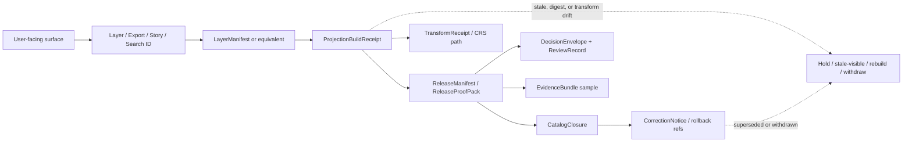

<!-- [KFM_META_BLOCK_V2]
doc_id: kfm://doc/TODO-NEEDS-UUID
title: Stale Projection Runbook
type: standard
version: v1
status: draft
owners: TODO-NEEDS-OWNER
created: 2026-04-28
updated: 2026-04-28
policy_label: TODO-NEEDS-POLICY-LABEL
related: [TODO-NEEDS-RELATED-PATHS]
tags: [kfm, runbook, stale-projection, derived-projection, maplibre, release, correction]
notes: [New standard runbook for docs/runbooks/stale_projection.md. Owners, doc UUID, policy label, related repo links, exact validator commands, stale thresholds, and CI wiring still need mounted-repo verification.]
[/KFM_META_BLOCK_V2] -->

<a id="top"></a>

# Stale Projection Runbook

Restore trust when a derived projection, layer, tile, graph, cache, export, or scene no longer matches its declared release, freshness, transform, policy, or correction state.


> [!IMPORTANT]
> **Status:** draft  
> **Owners:** `TODO-NEEDS-OWNER`  
> **Path:** `docs/runbooks/stale_projection.md`  
> **Operating posture:** make stale state visible, rebuild only from governed release scope, and preserve correction lineage.  
> **Quick jumps:** [Scope](#scope) · [Repo fit](#repo-fit) · [Inputs](#inputs) · [Exclusions](#exclusions) · [What counts as stale](#what-counts-as-stale) · [Severity](#severity) · [Triage](#triage) · [Decision matrix](#decision-matrix) · [Validation](#validation) · [Rollback](#rollback) · [Definition of done](#definition-of-done) · [Open verification](#open-verification)

> [!WARNING]
> A stale projection is not fixed by hiding the warning badge, patching a tile by hand, or republishing from `RAW`, `WORK`, or `QUARANTINE`. In KFM, stale-visible, withdrawn, denied, and abstained states are valid trust-preserving outcomes when the system fails closed.

---

## Scope

This runbook is for **derived projection staleness** in KFM.

In this document, **projection** means a rebuildable downstream surface or retrieval layer, such as:

- map tiles, PMTiles, MVT, COG previews, style/layer manifests, or rendered layer bundles;
- search indexes, graph/triplet projections, vector indexes, dashboard extracts, story scenes, or exports;
- MapLibre-visible layers, Evidence Drawer payloads, Focus context, or export previews that rely on a released projection.

This runbook also covers **CRS / transform drift** when a coordinate reference system, datum, projection, support, resolution, or transformation path change makes a derived projection unsafe to present as current.

### Use this runbook when

- a projection exceeds its declared `stale_after`, freshness window, or release-scope tolerance;
- a `LayerManifest`, `ReleaseManifest`, `ProjectionBuildReceipt`, `CatalogClosure`, or artifact digest no longer agrees;
- a correction, rollback, withdrawal, supersession, rights change, sensitivity change, or source update affects a published projection;
- MapLibre, Focus Mode, Evidence Drawer, export, story, or compare views show a layer whose trust state is unclear;
- a validator, CI gate, user report, reviewer, or source watcher flags `SOURCE_STALE`, `STALE_PROJECTION`, `RELEASE_WITHDRAWN`, `DIGEST_MISMATCH`, `CRS_TRANSFORM_DRIFT`, or an equivalent repo-native state.

### Success looks like

A maintainer can answer, from artifacts rather than memory:

1. Which outward surfaces were affected?
2. Which release and projection receipt did they rely on?
3. Why is the projection stale or unsafe?
4. Was it rebuilt, marked stale-visible, withheld, withdrawn, or corrected?
5. What evidence, policy, review, and audit objects now prove the disposition?

<p align="right"><a href="#top">Back to top ↑</a></p>

---

## Repo fit

| Field | Value |
|---|---|
| **Path** | `docs/runbooks/stale_projection.md` |
| **Doc class** | Standard runbook requiring KFM Meta Block V2 |
| **Primary upstream surfaces** | `ReleaseManifest`, `ReleaseProofPack`, `ProjectionBuildReceipt`, `LayerManifest`, `CatalogClosure`, `DecisionEnvelope`, `EvidenceBundle`, `CorrectionNotice` |
| **Primary downstream surfaces** | MapLibre shell, layer catalog, Evidence Drawer, Focus Mode, compare, story, export, published artifacts |
| **Trust boundary** | Public clients and ordinary UI surfaces must use governed APIs and released artifacts, not canonical/internal stores |
| **Current implementation posture** | `NEEDS VERIFICATION`: exact repo paths, validators, CI jobs, owners, thresholds, and emitted artifact names are not confirmed in this session |

> [!NOTE]
> This runbook intentionally avoids hard-linking to neighboring repo files until the mounted checkout confirms their paths. Add relative links during implementation review once the actual `docs/`, `schemas/`, `policy/`, `tools/`, `tests/`, `data/`, and release/proof homes are verified.

<p align="right"><a href="#top">Back to top ↑</a></p>

---

## Inputs

Accepted inputs are the smallest artifacts needed to determine whether a derived projection remains safe to use.

| Input | What to capture | Required posture |
|---|---|---|
| Alert or report | Who noticed it, surface, layer/export/story/search ID, timestamp, screenshot or log ref | `CONFIRMED` during incident |
| Projection identity | `projection_id`, `layer_id`, `projection_type`, `surface_class`, artifact refs | `CONFIRMED` from manifest/receipt |
| Release identity | `release_id`, `release_state`, `supersedes`, `rollback_ref`, published alias | `CONFIRMED` from release/proof object |
| Build proof | `ProjectionBuildReceipt`, build time, release ref, stale basis, artifact digest | `CONFIRMED` if artifact exists, otherwise `UNKNOWN` |
| Source and evidence refs | `SourceDescriptor`, `DatasetVersion`, `EvidenceBundle`, transform receipt refs | `CONFIRMED` or `UNKNOWN`; do not infer |
| Policy and review refs | `DecisionEnvelope`, review record, rights/sensitivity state, obligations | `CONFIRMED` or fail closed |
| Temporal basis | observation time, source publication time, KFM fetch time, promotion time, projection build time, stale-after time | must remain separated |
| CRS / transform basis | source CRS, working CRS, display CRS, transform chain, support/resolution notes | required when geometry changed or alignment is suspect |

### Minimal incident header

```text
incident_id: TODO
reported_at: TODO-ISO-8601
reported_by: TODO
surface: map_layer | export | story | focus | compare | search | graph | dashboard | other
layer_or_projection_id: TODO
release_id: TODO
symptom: TODO
initial_state: current | stale-visible | withdrawn | denied | unknown
risk_class: P0 | P1 | P2 | P3 | unknown
```

<p align="right"><a href="#top">Back to top ↑</a></p>

---

## Exclusions

This runbook is **not** a substitute for the following workflows.

| Excluded work | Use instead |
|---|---|
| Canonical data repair | Domain repair workflow or canonical-builder runbook |
| Source onboarding or live connector activation | Source registry / intake runbook |
| Rights, sensitivity, sovereignty, or exact-location adjudication | Policy/steward review workflow |
| Emergency public-safety alerting | Official source guidance and alerting systems |
| Manual tile or cache patching | Rebuild from released scope and emit receipt |
| AI-only explanation of staleness | Evidence-backed diagnosis with `EvidenceBundle` / receipts |
| Hidden UI-only suppression | Governed surface-state update with audit linkage |

> [!CAUTION]
> Do not use this runbook to “fix” a layer by editing public artifacts directly. KFM projection recovery is a governed state transition: inspect, decide, rebuild or withhold, validate, emit proof, and preserve lineage.

<p align="right"><a href="#top">Back to top ↑</a></p>

---

## What counts as stale

A projection is stale when it can no longer be presented as current for its declared purpose, scope, audience, or release.

| Stale class | Typical signal | Required first response |
|---|---|---|
| **Freshness expired** | `stale_after` elapsed, source cadence exceeded, release age warning | Mark stale-visible or withhold current claims until rebuilt |
| **Release drift** | projection receipt points to older `release_id` than public alias | Compare release chain; rebuild or route to correction |
| **Digest drift** | artifact digest differs from receipt or manifest | Withhold; investigate provenance and rebuild |
| **Catalog closure drift** | STAC/DCAT/PROV/internal refs no longer resolve together | Block publish-path use; repair closure before release |
| **CRS / transform drift** | source CRS, working CRS, display CRS, or transform changed | Verify control points; rebuild with retained transform path |
| **Support / resolution drift** | layer support no longer matches claim support | Generalize, withhold, or rebuild with correct support note |
| **Policy or rights drift** | rights, sensitivity, visibility, or review obligations changed | Deny, generalize, redact, or withhold as policy requires |
| **Correction drift** | affected release has `CorrectionNotice`, withdrawal, supersession, or rollback | Update outward state and invalidate derived artifacts |
| **UI trust drift** | Map shows layer but freshness/review/correction cues are missing | Treat as trust-surface defect; do not hide state |
| **Runtime evidence drift** | Focus/Evidence Drawer cannot resolve supporting bundle | ABSTAIN, DENY, or ERROR; no confident answer |

### Distinguish these two “projection” meanings

| Term | Meaning here | Why it matters |
|---|---|---|
| Derived projection | Downstream rebuildable layer/index/cache/graph/export/scene | Must remain tied to release and freshness basis |
| CRS / cartographic projection | Spatial reference transformation for geometry or measurement | May trigger stale derived projections if changed, unclear, or unverified |

<p align="right"><a href="#top">Back to top ↑</a></p>

---

## Severity

Use the narrowest severity that protects public trust.

| Severity | Condition | Public posture | Required action |
|---|---|---|---|
| **P0 — block / withdraw** | Evidence missing, wrong release, digest mismatch, policy denial, sensitive exposure, unsafe CRS/transform, or withdrawn release | Remove current claim path; deny/withhold/withdraw as needed | Freeze affected outward surface, notify steward, issue correction or rollback path |
| **P1 — stale-visible** | Projection is stale beyond declared tolerance but not known unsafe or sensitive | Show stale cue; do not make current claims | Rebuild from governed release or schedule review with visible warning |
| **P2 — rebuild queue** | Projection is approaching stale threshold or internal build lag exists with no outward current claim | Keep current state only if within tolerance | Rebuild and compare receipts |
| **P3 — monitor** | Freshness concern is early, bounded, or diagnostic only | No public change unless thresholds require | Add watch item and confirm cadence/thresholds |

> [!IMPORTANT]
> If severity is unclear, treat it as **P1 stale-visible** unless there is any evidence, rights, sensitivity, release, digest, or CRS uncertainty. Under those uncertainties, escalate to **P0 block / withdraw** until proof exists.

<p align="right"><a href="#top">Back to top ↑</a></p>

---

## Triage

### 1. Contain the trust risk

1. Record an incident header.
2. Identify every outward surface using the projection.
3. Preserve current manifests, receipts, logs, screenshots, and public aliases.
4. Stop automatic republish/rebuild jobs for the affected projection if they could widen harm.
5. Add or confirm a visible stale/hold/deny cue before users can mistake the surface for current truth.

### 2. Trace the projection chain



### 3. Classify the trigger

| Trigger question | Evidence to inspect | Outcome |
|---|---|---|
| Has the source or canonical dataset changed? | `SourceDescriptor`, source receipt, `DatasetVersion`, validation report | Rebuild or hold if source state unresolved |
| Has the release changed? | `ReleaseManifest`, public alias, supersession, rollback refs | Rebuild or update alias/correction path |
| Has a correction affected this surface? | `CorrectionNotice`, affected surface classes, public note | Update outward lineage and invalidate stale artifacts |
| Has the policy posture changed? | `DecisionEnvelope`, review record, rights/sensitivity obligation | Deny, generalize, redact, withhold, or rebuild |
| Has the transform path changed? | `TransformReceipt`, CRS metadata, control-point checks | Rebuild or reject ambiguous geometry |
| Has the artifact drifted? | artifact digest, byte size, manifest ref, storage pointer | Withhold and rebuild from known release scope |
| Has UI hidden stale state? | surface-state registry, MapLibre layer metadata, Drawer payload | Treat as trust-surface failure |

### 4. Decide disposition

Choose exactly one primary disposition for the incident record.

| Disposition | Use when | Required proof |
|---|---|---|
| `REBUILD` | projection is stale but release remains publishable | new `ProjectionBuildReceipt`, digest checks, catalog/release linkage |
| `STALE_VISIBLE` | surface can remain visible only with explicit stale state | surface-state update, reason, stale timestamp, next review/rebuild target |
| `WITHHOLD` | current status is unknown or proof is incomplete | policy/review note and no-current-claim guarantee |
| `WITHDRAW` | projection is unsafe, wrong, unauthorized, or tied to withdrawn release | `CorrectionNotice` or rollback record, public/steward note |
| `GENERALIZE_OR_REDACT` | visibility/precision must change by policy | transform/redaction receipt, policy obligation, updated evidence drawer state |
| `ABSTAIN_OR_DENY_RUNTIME` | Focus/Evidence Drawer cannot support a trust-bearing answer | finite runtime outcome with reason/obligation code |

<p align="right"><a href="#top">Back to top ↑</a></p>

---

## Decision matrix

| Finding | Do not do | Do this |
|---|---|---|
| `stale_after` expired but release and policy are otherwise valid | Silently leave layer marked current | Mark stale-visible, rebuild from release scope, emit receipt |
| Projection digest differs from receipt | Patch file or update digest by hand | Withhold, preserve evidence, rebuild, compare artifacts |
| Release alias points to superseded release | Keep alias because map “looks right” | Repoint through release/correction workflow or withdraw |
| CRS claim is missing or ambiguous | Trust on-the-fly alignment | Reject or quarantine until CRS and transform path are verified |
| Source update arrived but validation failed | Publish newest available file | Keep prior released projection or mark stale-visible; quarantine failed candidate |
| Rights/sensitivity posture changed | Rely on client-side filter | Deny/generalize/redact server-side through governed API and record obligation |
| Evidence Drawer cannot resolve bundle | Show uncited summary | Runtime ABSTAIN/ERROR; fix resolver or proof object before confident output |
| Correction affects published feature | Overwrite public artifact quietly | Emit visible correction/rollback lineage and rebuild affected projections |
| UI hides stale state | Treat as cosmetic bug | Treat as trust-surface bug; fix badges/drawer/export state before release |

<p align="right"><a href="#top">Back to top ↑</a></p>

---

## Validation

### Minimum checks

| Check | Pass condition |
|---|---|
| Release linkage | projection receipt points to the intended `release_id` |
| Freshness basis | `stale_after`, source cadence, or freshness policy is declared and evaluated |
| Artifact integrity | digest, byte size, media type, and storage ref match manifest |
| Catalog closure | STAC/DCAT/PROV/internal refs resolve and agree on identifiers |
| Evidence resolution | representative feature/claim resolves `EvidenceRef → EvidenceBundle` |
| Policy state | rights, sensitivity, review, and obligations permit the intended surface |
| CRS / transform | source CRS, working CRS, display CRS, support, and transform path are documented |
| Correction state | supersession, withdrawal, rollback, or correction references are visible |
| UI state | freshness/review/correction cue appears in layer metadata, drawer, export, or Focus where relevant |
| Negative outcomes | ABSTAIN, DENY, HOLD, WITHDRAW, or ERROR is visible where proof is incomplete |

### Proposed command shapes

The exact commands below are **PROPOSED** and must be adapted to repo-native validators after checkout inspection.

```bash
# NEEDS VERIFICATION: replace with repo-native validator names and paths.
python tools/validators/validate_release_manifest.py --release "$RELEASE_ID"
python tools/validators/validate_layer_manifest.py --layer "$LAYER_ID"
python tools/validators/check_projection_freshness.py --projection "$PROJECTION_ID"
python tools/validators/validate_catalog_closure.py --release "$RELEASE_ID"
python tools/validators/validate_evidence_bundle.py --sample "$FEATURE_OR_CLAIM_ID"
python tools/validators/validate_transform_receipt.py --projection "$PROJECTION_ID"
```

### Rebuild acceptance

A rebuilt projection is acceptable only when all of these are true:

- [ ] Built from a governed release or approved release candidate, not from raw/private candidate data.
- [ ] Emits a new or updated `ProjectionBuildReceipt`.
- [ ] Preserves release linkage, artifact digest, build time, transform path, freshness basis, and stale-after policy.
- [ ] Does not bypass policy, review, catalog closure, or evidence resolution.
- [ ] Updates visible surface state and correction lineage where needed.
- [ ] Leaves prior receipts/proofs available for audit rather than deleting them.

<p align="right"><a href="#top">Back to top ↑</a></p>

---

## Rollback

Rollback is a trust-state repair, not a cleanup script.

Use rollback when a projection was published or made visible with the wrong release, wrong transform, missing proof, bad digest, unsafe policy posture, or broken correction lineage.

### Rollback sequence

1. Preserve the faulty projection artifacts and receipts for audit.
2. Identify the last known valid release/projection pair.
3. Withdraw or stale-mark the faulty public alias.
4. Repoint public alias only through the release/correction workflow.
5. Invalidate downstream caches, search indexes, graph projections, exports, and saved views affected by the faulty projection.
6. Emit or update `CorrectionNotice`, rollback reference, and surface-state cues.
7. Run validation on the restored projection chain.
8. Close the incident with proof refs and any docs/tests changed.

### Rollback record fields

```json
{
  "rollback_id": "TODO",
  "affected_projection_id": "TODO",
  "affected_release_id": "TODO",
  "prior_release_id": "TODO",
  "reason": "stale_projection | digest_mismatch | policy_change | crs_transform_drift | correction | other",
  "decision_ref": "TODO",
  "correction_notice_ref": "TODO",
  "aliases_to_repoint": [],
  "tiles_or_indexes_to_invalidate": [],
  "executed_by": "TODO",
  "executed_at": "TODO-ISO-8601",
  "audit_ref": "TODO"
}
```

<p align="right"><a href="#top">Back to top ↑</a></p>

---

## Evidence Drawer and Focus behavior

A stale projection must travel with visible trust state.

| Surface | Required behavior |
|---|---|
| **Map layer panel** | show freshness cue, release ID, stale/correction marker, source/support summary |
| **Feature click** | resolve through governed API before consequential claim text appears |
| **Evidence Drawer** | show release version, freshness class/timestamp, review state, correction state, transform summary, audit linkage |
| **Focus Mode** | echo scope; answer only with resolved evidence; otherwise ABSTAIN, DENY, or ERROR |
| **Compare mode** | preserve asymmetry: each side carries its own release, support, time, and freshness state |
| **Export/share** | carry stale/correction/release metadata; never strip trust cues |
| **Saved view/deep link** | rehydrate through current policy/release mediation; may reopen as generalized, restricted, or stale-visible |

<p align="right"><a href="#top">Back to top ↑</a></p>

---

## Communication

### Public or steward note template

```text
Projection status changed

Surface: <map layer/export/story/search/focus>
Projection: <projection_id>
Release: <release_id>
Current state: <stale-visible | withheld | withdrawn | rebuilt | corrected>
Reason: <plain-language cause>
What changed: <release/freshness/policy/transform/correction summary>
User impact: <what can still be trusted, if anything>
Next action: <rebuild/review/rollback/monitor>
Audit reference: <audit_ref>
```

### Communication rules

- Say **what is stale** and **what remains supported**.
- Do not imply canonical truth changed unless canonical proof says so.
- Do not blame “the map” when the actual failure is release, transform, policy, catalog, or evidence resolution.
- Do not expose restricted details while explaining why a surface was generalized, withheld, or denied.
- Prefer a small factual notice over a polished but unsupported explanation.

<p align="right"><a href="#top">Back to top ↑</a></p>

---

## Definition of done

The incident can close only when:

- [ ] Affected outward surfaces are listed.
- [ ] Current disposition is one of `REBUILD`, `STALE_VISIBLE`, `WITHHOLD`, `WITHDRAW`, `GENERALIZE_OR_REDACT`, `ABSTAIN_OR_DENY_RUNTIME`, or repo-native equivalent.
- [ ] Release, projection, catalog, policy, review, correction, and evidence refs are recorded where applicable.
- [ ] Any rebuild has a new or verified `ProjectionBuildReceipt`.
- [ ] Any correction/withdrawal has visible lineage.
- [ ] MapLibre/Evidence Drawer/Focus/export surfaces show trust state correctly.
- [ ] Validators pass or failures are explicitly retained as fail-closed outcomes.
- [ ] No public client path reaches `RAW`, `WORK`, `QUARANTINE`, canonical/internal stores, proof-pack internals, or model runtime directly.
- [ ] Documentation, tests, manifests, fixtures, and runbook deltas are updated when behavior changed.
- [ ] Remaining unknowns are assigned to an owner or review queue.

<p align="right"><a href="#top">Back to top ↑</a></p>

---

## Open verification

These items must be resolved against the mounted repository before this runbook should be marked `review` or `published`.

| Item | Status |
|---|---|
| Doc UUID | `TODO-NEEDS-UUID` |
| Owners / CODEOWNERS coverage | `TODO-NEEDS-OWNER` |
| Policy label | `TODO-NEEDS-POLICY-LABEL` |
| Related runbooks and architecture docs | `NEEDS VERIFICATION` |
| Actual artifact homes for releases/proofs/receipts/published projections | `NEEDS VERIFICATION` |
| Exact schema names and homes for `ProjectionBuildReceipt`, `LayerManifest`, `ReleaseManifest`, and `CorrectionNotice` | `NEEDS VERIFICATION` |
| Repo-native validator commands | `NEEDS VERIFICATION` |
| CI jobs or required status checks | `NEEDS VERIFICATION` |
| Lane-specific freshness thresholds | `NEEDS VERIFICATION` |
| Surface-state vocabulary and enum names | `NEEDS VERIFICATION` |
| MapLibre layer registry wiring | `NEEDS VERIFICATION` |
| Evidence Drawer and Focus payload contract examples | `NEEDS VERIFICATION` |

<details>
<summary><strong>Appendix — incident worksheet</strong></summary>

```text
Incident
--------
incident_id:
opened_at:
opened_by:
severity:
surface:
projection_id:
layer_or_export_id:
release_id:
public_alias:
symptom:

Evidence chain
--------------
layer_manifest_ref:
projection_build_receipt_ref:
release_manifest_ref:
release_proof_pack_ref:
catalog_closure_ref:
decision_envelope_ref:
review_record_ref:
evidence_bundle_sample_ref:
transform_receipt_ref:
correction_notice_ref:

Diagnosis
---------
stale_class:
trigger:
first_drifted_field:
affected_surfaces:
affected_artifacts:
policy_or_sensitivity_issue:
crs_or_transform_issue:
catalog_or_digest_issue:
runtime_evidence_issue:

Disposition
-----------
primary_disposition:
user_visible_state:
rebuild_required:
withdraw_required:
generalize_or_redact_required:
runtime_negative_outcome_required:
rollback_required:

Validation
----------
validators_run:
validators_passed:
validators_failed:
accepted_fail_closed_outcomes:
audit_ref:

Closure
-------
closed_at:
closed_by:
docs_updated:
tests_updated:
remaining_unknowns:
next_review_date:
```

</details>

<p align="right"><a href="#top">Back to top ↑</a></p>
