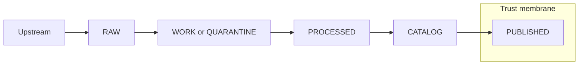

<!-- [KFM_META_BLOCK_V2]
doc_id: kfm://doc/2f42f9a4-31f1-4a4b-81ea-2c39125438f2
title: Runbook Templates
type: standard
version: v1
status: draft
owners: KFM Maintainers
created: 2026-03-02
updated: 2026-03-02
policy_label: restricted
related:
  - docs/runbooks/
  - docs/runbooks/templates/
  - TODO: link to Promotion Contract (truth path promotion gates)
  - TODO: link to Trust Membrane + policy labeling docs
tags: [kfm, runbooks, templates, governance]
notes:
  - This folder contains *templates only*. Instance runbooks should live in docs/runbooks/.
  - Keep templates evidence-first, reversible, and policy-aware.
[/KFM_META_BLOCK_V2] -->

# Runbook Templates

> Standard templates for operating and governing KFM (pipelines, catalogs, APIs, UI, policy). **Evidence-first**, **reversible**, **auditable**.


## Quick navigation

- [What belongs here](#what-belongs-here)
- [How to use a template](#how-to-use-a-template)
- [Template registry](#template-registry)
- [Required template structure](#required-template-structure)
- [Quality gates](#quality-gates)
- [Proposed directory layout](#proposed-directory-layout)
- [Authoring rules](#authoring-rules)
- [Appendix: skeleton snippets](#appendix-skeleton-snippets)

---

## What belongs here

This directory is for **copyable templates** used to create **instance runbooks**.

### Acceptable inputs

- Markdown templates for:
  - **Operations** (pipelines, scheduled jobs, rebuilds, deploys)
  - **Governance** (promotion, policy changes, redaction decisions)
  - **Incidents** (outages, data-quality events, security events)
  - **Verification** (gate checks, smoke tests, rollback drills)
- Small helper assets **only if** they are template-related:
  - Example JSON/YAML payloads that illustrate a template section
  - Checklists (e.g., Promotion Gate DoD)

### Exclusions

- ❌ Completed/real runbooks (put those in `docs/runbooks/`)
- ❌ Secrets, tokens, API keys, internal endpoints, or anything environment-specific
- ❌ Exact coordinates or targetable details for sensitive/vulnerable sites (keep templates safe by default)
- ❌ One-off notes, meeting notes, or ADRs (use their proper locations)

[Back to top](#runbook-templates)

---

## How to use a template

1. **Copy** the appropriate template into `docs/runbooks/` (or your team’s runbook folder).
2. **Assign a new `doc_id`** (UUID) in the MetaBlock.
3. Fill in **Scope**, **Owners**, **On-call**, **Policy label**, and **Evidence links**.
4. Execute the runbook.
5. Attach artifacts (logs, receipts, diffs, checksums) and complete the **Post-run review**.

### Template selection guide

- If you are changing **data lifecycle state** (RAW → WORK → PROCESSED → PUBLISHED): use **Promotion Runbook**.
- If you are changing **policy rules** (OPA/Rego, obligations, redaction): use **Policy Change Runbook**.
- If something is broken or user-impacting: use **Incident Runbook**.
- If you are running a routine job (rebuild index, regenerate tiles, backfill): use **Operational Procedure Runbook**.

[Back to top](#runbook-templates)

---

## Template registry

> This registry is intentionally small. Add templates when a pattern repeats **and** the template reduces risk.

| Template file (in this folder) | Use when | Primary outputs | Notes |
|---|---|---|---|
| `incident.runbook.template.md` | Outage / degraded service / security or data-quality incident | Timeline, impact, mitigations, evidence bundle, follow-ups | Keep comms + ownership explicit |
| `promotion.runbook.template.md` | Promoting data across lifecycle zones | Run receipt, validation report, catalog updates, checksums | Must include gate results |
| `pipeline.runbook.template.md` | Running/repairing an ingest/catalog/index pipeline | Run receipt, logs, diffs, artifact hashes | Focus on idempotence + rollback |
| `policy-change.runbook.template.md` | Changing policy rules/obligations/redaction | Policy diff, tests, approval record | Default-deny when uncertain |
| `release.runbook.template.md` | Shipping a versioned release (API/UI/indexers) | Release notes, build artifacts, rollback plan | Keep changes reversible |
| `verification.checklist.md` | Pre-flight / post-flight checks | Completed checklist attached to runbook | Keep it short and automatable |

**NOTE:** The filenames above are a **PROPOSED** starting set (not confirmed in repo). If the folder already contains different templates, update this table to match reality.

[Back to top](#runbook-templates)

---

## Required template structure

All templates in this folder **SHOULD** include the same core sections so that runbooks are comparable and reviewable.

### 1) MetaBlock v2 (required)

Every template/runbook begins with the `KFM_META_BLOCK_V2` header.

Minimum fields to populate in instance runbooks:

- `doc_id` (new UUID)
- `status` (`draft` → `review` → `published`)
- `owners` (team + named DRI)
- `policy_label` (e.g., `public`, `restricted`)
- `related` links (contracts, datasets, pipelines, policies)

### 2) Purpose and scope

- **Purpose:** one paragraph.
- **Scope in / out:** bullet lists.
- **Non-goals:** explicitly list what this does *not* do.

### 3) Preconditions

- Required access (roles, approvals)
- Environment requirements (dev/stage/prod)
- Known-safe window / expected duration (optional)

### 4) Inputs

- Dataset IDs / pipeline IDs / service names
- Commit SHAs / release tags
- Config files changed (paths)

### 5) Procedure

- Step-by-step commands (copy/paste)
- For each step: expected output + failure modes

### 6) Validation

- What “good” looks like
- How to verify (tests, queries, UI checks)
- Required evidence artifacts

### 7) Rollback

- Fast rollback plan (minutes)
- Full rollback plan (hours)
- “Stop the line” criteria

### 8) Evidence and receipts

- Run receipt(s)
- Checksums / content hashes
- Links to logs
- Policy decisions + redaction notes

### 9) Post-run review

- What changed
- What to monitor
- Follow-up tasks / tickets

[Back to top](#runbook-templates)

---

## Quality gates

Templates should make it *easy* to do the right thing.

### Runbook Definition of Done

- [ ] Contains **Purpose**, **Scope**, **Procedure**, **Validation**, **Rollback**
- [ ] Names a single **DRI** + secondary reviewer
- [ ] Includes an **Evidence** section with links/placeholders for receipts
- [ ] Includes a **Risk** section with failure modes and mitigations
- [ ] Uses **explicit dates** (YYYY-MM-DD) when referencing “today/yesterday/this week”
- [ ] Uses governed APIs and policy boundaries (no direct storage access in instructions)

### Promotion / publication (when applicable)

If a runbook results in any dataset being (re)published, the runbook must collect enough evidence to satisfy the **Promotion Contract** gates (identity, license, sensitivity, catalog validation, integrity checks, audit record). If any gate is unknown, the runbook must **fail closed**.

[Back to top](#runbook-templates)

---

## Proposed directory layout

> **PROPOSED** layout (update to match the real repo).

```text
docs/runbooks/templates/                                 # Runbook templates (copy/paste starters; consistent structure)
├─ README.md                                             # Template index + how to use + required customization checklist
├─ incident.runbook.template.md                          # Incident runbook template (triage, comms, evidence capture, closeout)
├─ promotion.runbook.template.md                         # Promotion runbook template (gates, approvals, receipts, rollback/supersede)
├─ pipeline.runbook.template.md                          # Pipeline runbook template (prechecks, run, verify, troubleshoot, receipts)
├─ policy-change.runbook.template.md                     # Policy change runbook template (fixtures, parity, rollout, verification)
├─ release.runbook.template.md                           # Release runbook template (what ships, checks, artifacts, rollback)
├─ verification.checklist.md                             # Generic verification checklist (DoD, links to receipts, signoff)
└─ _snippets/                                            # Reusable sections to keep runbooks consistent
   ├─ evidence-section.md                                # Evidence capture section (EvidenceRefs, receipts, screenshots policy)
   ├─ rollback-section.md                                # Rollback/supersede section (when allowed, steps, verification)
   └─ validation-section.md                              # Validation section (checks to run, expected outputs, failure handling)
```

[Back to top](#runbook-templates)

---

## Authoring rules

### Keep templates environment-agnostic

Templates must be usable across environments without leaking details:

- Prefer placeholders like `${ENV}`, `${DATASET_ID}`, `${PIPELINE_NAME}`.
- Do not hardcode cluster names, bucket names, internal hostnames, or credentials.

### Evidence-first by design

If the runbook produces a claim (“dataset X was validated”, “policy Y denies access”), it must specify **where the evidence lives** and how to reproduce it.

### Reversible increments

Templates should bias toward small, rollbackable changes:

- Include a *fast rollback* path.
- Prefer additive changes over destructive changes.

[Back to top](#runbook-templates)

---

## Appendix: skeleton snippets

### Minimal runbook header

```markdown
<!-- [KFM_META_BLOCK_V2]
doc_id: kfm://doc/<uuid>
title: <Runbook title>
type: standard
version: v1
status: draft
owners: <team + DRI>
created: YYYY-MM-DD
updated: YYYY-MM-DD
policy_label: public|restricted|...
related:
  - <links>
tags: [kfm, runbook]
notes:
  - <notes>
[/KFM_META_BLOCK_V2] -->
```

### Mermaid: “truth path” reminder diagram



[Back to top](#runbook-templates)
