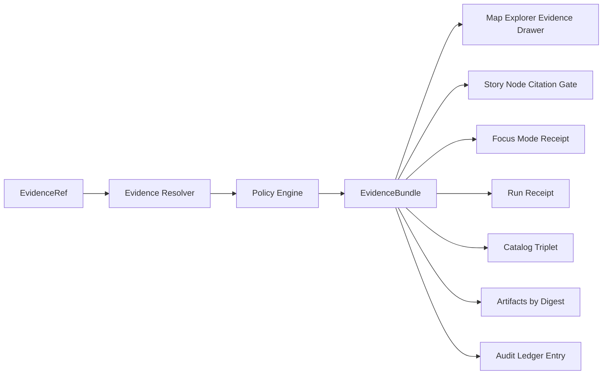

<!-- [KFM_META_BLOCK_V2]
doc_id: kfm://doc/00000000-0000-0000-0000-000000000000
title: Evidence Bundle Template
type: standard
version: v1
status: draft
owners: <team-or-names>
created: 2026-03-02
updated: 2026-03-02
policy_label: public
related:
  - kfm://spec/evidence_bundle@v1
  - kfm://runbook/promotion_contract@v1
  - kfm://runbook/citation_verification@v1
tags:
  - kfm
  - evidence
  - governance
notes:
  - Copy this template when defining the EvidenceBundle JSON contract and/or a concrete bundle example.
[/KFM_META_BLOCK_V2] -->

# Evidence Bundle Template

**One-line purpose:** A copy-paste template for a policy-safe, inspectable **EvidenceBundle** that backs a claim, feature, Story Node citation, or Focus Mode citation.


**Applies to:** Evidence resolver output, Story Node citation gates, Focus Mode receipts, steward review workflows.

---

## Quick navigation

- [Purpose](#purpose)
- [Hard rules](#hard-rules)
- [EvidenceRef inputs](#evidenceref-inputs)
- [EvidenceBundle JSON template](#evidencebundle-json-template)
- [Evidence cards template](#evidence-cards-template)
- [Artifact inventory](#artifact-inventory)
- [Policy decision and obligations](#policy-decision-and-obligations)
- [Provenance and reproducibility](#provenance-and-reproducibility)
- [Checks and citation gate checklist](#checks-and-citation-gate-checklist)
- [EvidenceRef examples](#evidenceref-examples)
- [Implementation notes](#implementation-notes)

---

## Purpose

An **EvidenceBundle** is the resolved, policy-filtered packet of metadata + artifacts + provenance used to **inspect and reproduce** a claim.

KFM treats citations as **EvidenceRefs** that resolve into **EvidenceBundles** (not free-form URLs). The EvidenceBundle is what the UI renders in the evidence drawer and what reviewers use to audit claims.



---

## Hard rules

> ✅ **Fail closed**: if a ref cannot be resolved, or policy denies it, do not return partial evidence.

- **Bundles are immutable by digest.** Once the bundle digest is computed, the bundle content must not change.
- **Bundles must not include restricted artifacts for unauthorized roles.**
- **EvidenceRefs must be parseable without network calls.**

---

## EvidenceRef inputs

Fill at least one of these:

- `requested_ref` (string): the EvidenceRef being resolved (preferred)
- `dataset_version_id` (string): explicit dataset version (if already known)
- `feature_id` (string): stable feature identifier, if the claim is about a feature
- `doc_span` (object): for scanned docs (page + span offsets)

---

## EvidenceBundle JSON template

> This is the **machine** contract. Treat it like an API response body. Keep it JSON.

```json
{
  "kfm_evidence_bundle_version": "v1",

  "bundle_id": "sha256:<bundle_digest>",
  "bundle_digest": "sha256:<bundle_digest>",

  "requested_ref": "<EvidenceRef string>",

  "title": "<Human title for UI>",
  "summary": "<1–3 sentence human summary of what this evidence supports>",

  "dataset_version_id": "<dataset_version_id>",

  "policy": {
    "decision": "allow|deny",
    "policy_label": "public|restricted|...",
    "decision_id": "kfm://policy_decision/<id>",

    "obligations_applied": [
      {
        "type": "generalize_geometry",
        "min_cell_size_m": 5000,
        "evidence": {
          "artifact": "kfm://artifact/sha256:<digest>",
          "note": "<what was generalized; how; where to verify>"
        }
      },
      {
        "type": "remove_attributes",
        "fields": ["<field>", "<field>"]
      }
    ],

    "reason_codes": ["<optional reason codes for audit/UX>"]
  },

  "rights": {
    "spdx": "<SPDX identifier, if applicable>",
    "attribution": "<required attribution text>",
    "terms_snapshot_ref": "<ref/path to stored upstream terms snapshot>",
    "notes": "<any usage constraints, e.g. non-commercial, no-derivatives>"
  },

  "provenance": {
    "run_id": "kfm://run/<run_id>",
    "promotion_manifest_ref": "<ref/path to promotion manifest if published>",

    "catalog_refs": {
      "dcat": "dcat://@<dataset_slug>@<dataset_version_id>",
      "stac": "stac:///<collection_or_item_id>",
      "prov": "prov://<prov_entity_or_activity_id>"
    }
  },

  "artifacts": [
    {
      "artifact_id": "kfm://artifact/sha256:<digest>",
      "zone": "raw|work|processed|catalog|published",
      "href": "<relative-path-or-governed-url>",
      "digest": "sha256:<digest>",
      "media_type": "<mime>",
      "role": "primary|supporting|qa_report|terms_snapshot|doc_page_image|ocr_text",
      "description": "<short human description>"
    }
  ],

  "checks": {
    "catalog_valid": true,
    "links_ok": true,
    "rights_ok": true,
    "policy_ok": true
  },

  "audit_ref": "kfm://audit/entry/<id>",

  "timestamps": {
    "created_at": "YYYY-MM-DDThh:mm:ssZ",
    "resolved_at": "YYYY-MM-DDThh:mm:ssZ"
  }
}
```

---

## Evidence cards template

> This is the **human rendering** layer (the evidence drawer). The *existence* of cards is required; the precise card schema is implementation-defined.

```json
{
  "cards": [
    {
      "card_id": "card:<stable-id>",
      "card_type": "dataset|asset|doc_span|run_receipt|qa_report|policy_decision",
      "title": "<UI title>",
      "subtitle": "<optional>",
      "body_markdown": "<short markdown with key facts and constraints>",
      "primary_artifact_id": "kfm://artifact/sha256:<digest>",
      "links": [
        {"rel": "open", "href": "<governed url>", "label": "Open"},
        {"rel": "lineage", "href": "<governed url>", "label": "Lineage"}
      ],
      "badges": ["policy:public", "license:CC-BY-4.0", "version:<dataset_version_id>"]
    }
  ]
}
```

---

## Artifact inventory

Use this table format when documenting a *concrete* bundle (handwritten or generated).

| Role | Zone | Href/Path | Digest | Media type | Why included | Policy notes |
|---|---|---|---|---|---|---|
| primary | processed | `data/processed/<dataset>/<version>/<file>` | `sha256:...` | `...` | ... | ... |
| qa_report | work | `data/work/<dataset>/<version>/qa.json` | `sha256:...` | `application/json` | ... | ... |
| terms_snapshot | raw | `data/raw/<dataset>/<date>/terms.html` | `sha256:...` | `text/html` | ... | ... |

---

## Policy decision and obligations

**Decision**

- `decision_id`: `kfm://policy_decision/<id>`
- `policy_label`: `public|restricted|...`
- `decision`: `allow|deny`
- `reason_codes`: `[...]`

**Obligations checklist**

- [ ] Geometry generalized as required (and *verified*):
  - Method: `grid|admin_unit|bbox_only|...`
  - Parameter(s): `min_cell_size_m=...`
  - Evidence: `artifact_id=...`
- [ ] Attributes removed/suppressed as required:
  - Removed fields: `[...]`
  - Evidence: QA report / diff artifact digest `sha256:...`
- [ ] Rights constraints surfaced in the bundle (SPDX + attribution + terms snapshot)

---

## Provenance and reproducibility

Link evidence back to:

- **Run receipt** (`run_id`) that captures inputs, outputs, environment, validation, and policy decisions.
- **Promotion manifest** (if applicable) and catalog cross-links.

### Minimal reproduction record

```text
Reproduce on: <dev|ci|prod>
Git commit: <commit>
Container image digest: sha256:<image>
Parameters digest: sha256:<params>
Run receipt: kfm://run/<run_id>
QA report digest: sha256:<qa>
```

---

## Checks and citation gate checklist

These checks should pass before this bundle can be used to support a Story Node or Focus Mode claim:

- [ ] **EvidenceRef syntax** is valid
- [ ] **Evidence resolver** can resolve the ref in a test environment
- [ ] **Policy** allows the bundle for the request context (and does not leak restricted metadata)
- [ ] **Rights metadata** exists for included media
- [ ] **Links** resolve (catalog ↔ artifacts ↔ provenance)

---

## EvidenceRef examples

> **NOTE:** The resolver should be able to parse these without network calls.

- DCAT dataset reference:
  - `dcat://@<dataset_slug>@<dataset_version_id>`
- STAC asset reference:
  - `stac:///<item_or_collection_id>#asset=<asset_key>`
- PROV reference:
  - `prov://<prov_entity_or_activity_id>`
- Document span reference (page + text span offsets):
  - `doc://sha256:<doc_digest>#page=<n>&span=<start>:<end>`
- Graph reference:
  - `graph://<node_or_edge_id>`

---

## Implementation notes

### Suggested file layout (PROPOSED)

```text
# Example (not enforced by this template)
data/
  evidence/
    bundles/
      sha256/<bundle_id>.json
```

### What to log (PROPOSED)

- `requested_ref`
- request context (principal/role/policy intent)
- `bundle_digest`
- `audit_ref`

---

## Template maintenance

- **Do not change** field meaning without version bump (`kfm_evidence_bundle_version`).
- Keep this doc additive; avoid breaking downstream parsers.

---

<a id="top"></a>
**Back to top:** [Evidence Bundle Template](#evidence-bundle-template)
