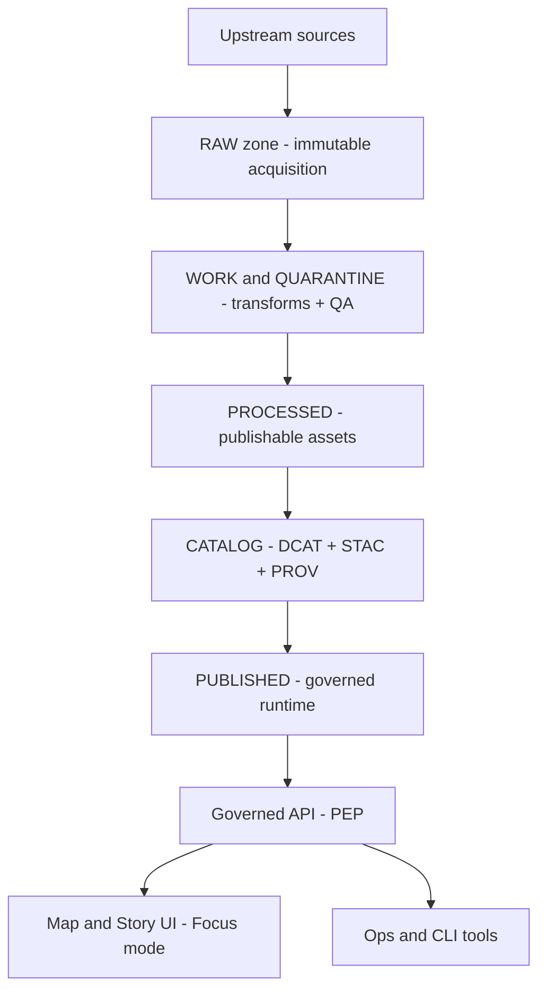
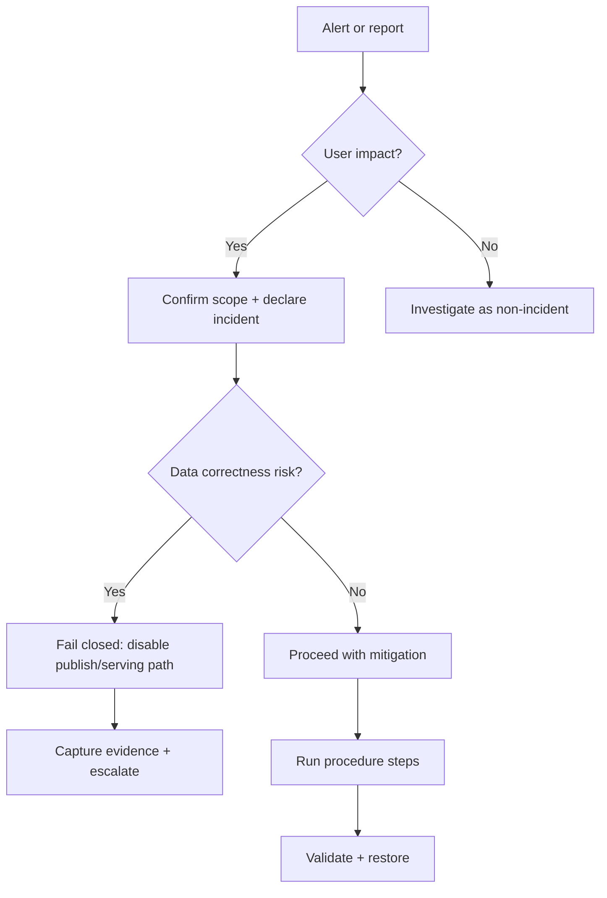

<!-- [KFM_META_BLOCK_V2]
doc_id: kfm://doc/<uuid>
title: Runbook Template
type: standard
version: v1
status: template
owners: <team-or-names>
created: YYYY-MM-DD
updated: YYYY-MM-DD
policy_label: <public|restricted|...>
related:
  - <paths-or-kfm://-ids>
tags: [kfm, runbook, template]
notes:
  - Copy this file, then replace all <> placeholders.
  - Keep the trust membrane: clients never hit storage directly.
[/KFM_META_BLOCK_V2] -->

# Runbook: <RUNBOOK_TITLE>

> **Purpose:** <One sentence on what this runbook helps operators do.>  
> **Applies to:** `<service>/<pipeline>/<dataset>` • **Environment:** `<dev|stage|prod>` • **Policy:** `<public|restricted|...>`  
> **Owner:** `<team>` • **On-call:** `<rotation/link>` • **Last reviewed:** `YYYY-MM-DD`

 <!-- TODO: replace with repo badge -->
 <!-- TODO -->
 <!-- TODO -->

---

## Navigation

- [What this runbook is for](#what-this-runbook-is-for)
- [Safety, governance, and access](#safety-governance-and-access)
- [System context](#system-context)
- [Triggers and symptoms](#triggers-and-symptoms)
- [Decision flow](#decision-flow)
- [Prerequisites](#prerequisites)
- [Procedure](#procedure)
- [Validation](#validation)
- [Rollback and recovery](#rollback-and-recovery)
- [Evidence and audit trail](#evidence-and-audit-trail)
- [Communications](#communications)
- [Post-incident actions](#post-incident-actions)
- [Change log](#change-log)

---

## What this runbook is for

**Use this runbook when:**  
- <Primary trigger 1>  
- <Primary trigger 2>  
- <Primary trigger 3>

**Do not use this runbook for:**  
- <Out of scope 1>  
- <Out of scope 2>

**Definition of done:**  
- Service/pipeline restored to expected SLOs  
- Evidence captured + linked (receipts, logs, decisions)  
- Follow-up ticket(s) filed (if required)  
- Runbook updated (if gap discovered)

---

## Safety, governance, and access

> [!WARNING]
> **Default-deny:** If you are unsure about data sensitivity, permissions, or impact, stop and escalate.  
> Never exfiltrate restricted data to unmanaged locations. Record policy decisions.

### Policy label

- **Policy label:** `<public|restricted|...>`
- **Redaction obligations:** `<what must be redacted; e.g., precise site locations, PII>`
- **Allowed disclosure:** `<what can be shared in incidents / tickets>`

### Trust membrane rules

- **Clients MUST use governed APIs.** Do not instruct consumers to query storage/databases directly.
- **Break-glass access** (if applicable) MUST be: approved, time-bounded, audited, and followed by remediation.

### Time-aware truth path (KFM)

Use these terms precisely when describing impact and recovery:

`UPSTREAM → RAW → WORK/QUARANTINE → PROCESSED → CATALOG (DCAT+STAC+PROV) → PUBLISHED` :contentReference[oaicite:0]{index=0}

**Identify impacted zone(s):** `<RAW|WORK|PROCESSED|CATALOG|PUBLISHED>`  
**Impact scope:** `<dataset(s) / service(s) / indices / UI features>`

---

## System context

### What this controls

- **Service/pipeline:** `<name>`
- **Primary responsibilities:** `<ingestion|catalog|policy|indexing|api|ui>`
- **Key contracts:** `<OpenAPI / JSON Schemas / registry entries>`
- **Critical invariants:**  
  - Evidence-first: user-facing claims are traceable to evidence  
  - Governed access via policy boundary  
  - Promotion requires passing gates (identity, validation, provenance, policy)

### Architecture sketch



> [!NOTE]
> Replace this diagram with the specific components for the service/pipeline.

---

## Triggers and symptoms

### Primary alerts

- **Alert name:** `<pager/monitor name>`
- **Severity:** `<SEV-1|SEV-2|SEV-3>`
- **SLO impacted:** `<latency|freshness|availability|correctness>`

### User-visible symptoms

- <Symptom 1>
- <Symptom 2>

### Operator-visible symptoms

- <Log/error signature>
- <Metric anomaly>

---

## Decision flow



---

## Prerequisites

### Access and credentials

- [ ] `<SSO/VPN>`  
- [ ] `<Kubernetes/Cloud>`  
- [ ] `<DB/warehouse>` (if applicable; do not bypass policy boundary for client workflows)  
- [ ] `<Object store>` (admin-only)

### Tooling

- [ ] `kubectl` / `oc` (if applicable)
- [ ] `psql` (if applicable)
- [ ] `kfm` CLI (if applicable)
- [ ] Log access: `<Grafana/Datadog/ELK/etc.>`
- [ ] Ticketing + incident channel access

### Known-good references

- **Run receipt schema:** `<path>`
- **Promotion contract gates:** `<path>`
- **Policy bundle / Rego tests:** `<path>`
- **OpenAPI / contract:** `<path>`

---

## Procedure

> [!TIP]
> Keep a running timeline in the incident doc: timestamps, actions, outcomes, and links to evidence.

### 0) Stabilize and contain

- [ ] Confirm current time window of impact: `<start/end>`  
- [ ] If correctness risk exists: **disable serving path** (fail closed)  
  - How: `<feature flag / config / route / policy switch>`
- [ ] Capture initial state:
  - Dashboard snapshot: `<link>`
  - Key logs: `<link>`

### 1) Classify the failure mode

Pick the best match and follow the corresponding branch:

- [ ] **A. Upstream unavailable / rate-limited**
- [ ] **B. Ingest pipeline failing**
- [ ] **C. Validation / QA gate failing**
- [ ] **D. Catalog build failing (STAC/DCAT/PROV)**
- [ ] **E. Index/tiles rebuild failing**
- [ ] **F. Policy change blocking access**
- [ ] **G. API/UI regression**

---

### Branch A: Upstream unavailable / rate-limited

**Goal:** preserve last-known-good data, avoid repeated thrash, document upstream status.

1. Verify upstream status  
   - Check: `<upstream status page / endpoint>`
2. Apply backoff / disable retrier  
   - Change: `<config>`
3. If freshness SLO is impacted: communicate expected staleness  
4. Record upstream evidence  
   - Links, timestamps, response codes, headers

**Exit criteria:** upstream recovered OR system safely serving cached last-known-good.

---

### Branch B: Ingest pipeline failing

**Goal:** restore ingestion without violating immutability of RAW.

1. Identify failing stage(s)  
   - `job/pod`: `<name>`  
   - `run_id`: `<id>`
2. Pull logs and extract the **first** root error  
3. Common fixes (choose only what applies):
   - Credentials expired → rotate (record who/when)
   - Schema drift in upstream → quarantine and update registry/spec
   - Infra capacity → scale worker
4. Re-run ingestion with **new run id**  
   - Do not mutate RAW artifacts; write a new DatasetVersion / run receipt

**Exit criteria:** ingestion runs green; new receipt emitted; downstream gates unblocked.

---

### Branch C: Validation / QA gate failing

**Goal:** fail closed; decide whether to fix data, adjust thresholds, or quarantine.

1. Identify which gate failed  
   - `<Gate name>` (e.g., schema, checksums, spatial bounds, null-rate, CRS)
2. Decide action:
   - **Fix transform** (preferred)  
   - **Update dataset spec** (only if justified)  
   - **Quarantine dataset version**
3. Re-run validation and capture results

> [!WARNING]
> Do not “lower the gate” without documenting tradeoffs and approval.

---

### Branch D: Catalog build failing (STAC/DCAT/PROV)

**Goal:** restore catalog integrity; avoid publishing assets without metadata/provenance.

1. Identify failing artifact  
   - STAC: `<collection|item>`  
   - DCAT: `<dataset>`  
   - PROV: `<activity|entity>`
2. Validate locally (or in CI job)  
   - Command: `<validator>`
3. Fix at source (metadata generation), rebuild catalog
4. Re-run and ensure catalog is internally consistent

**Exit criteria:** validators pass; catalog published; API serving references correct.

---

### Branch E: Index/tiles rebuild failing

**Goal:** restore index/tiles from PROCESSED / CATALOG without changing canonical truth.

1. Identify indexer job and scope  
2. Confirm source of truth inputs (DatasetVersion IDs)
3. Rebuild index/tiles  
4. Verify query performance and correctness

---

### Branch F: Policy change blocking access

**Goal:** restore expected access while preserving security obligations.

1. Identify policy decision output  
   - Which rule, which obligation, which inputs?
2. Determine if the block is:
   - intended (security fix)  
   - unintended regression
3. If regression:
   - rollback policy bundle (approved path) OR
   - hotfix with test coverage
4. Validate with policy tests + a minimal end-to-end request

**Exit criteria:** expected access restored; no over-broad permission introduced.

---

### Branch G: API/UI regression

**Goal:** quickly restore serving path, then root cause.

1. Identify last known good deploy  
2. Roll back / feature-flag off  
3. Confirm API contracts still match clients  
4. Validate UI critical paths

---

## Validation

### Technical validation

- [ ] Health checks OK
- [ ] Error rate normal
- [ ] Latency within SLO
- [ ] Freshness within expected window
- [ ] Sample queries correct (include evidence links)

### Data correctness validation (if data touched)

- [ ] DatasetVersion IDs confirmed
- [ ] Checksums verified
- [ ] Schema validation passed
- [ ] Spatial/temporal extents correct
- [ ] Catalog references resolvable

---

## Rollback and recovery

### Rollback options

- **Config rollback:** `<how>`
- **Deploy rollback:** `<how>`
- **Policy rollback:** `<how>`
- **Data rollback:** Prefer “roll forward” with a corrected DatasetVersion; do not mutate immutable artifacts.

### Recovery steps

1. <Step>
2. <Step>
3. <Step>

---

## Evidence and audit trail

> [!IMPORTANT]
> This runbook produces governed artifacts. Treat evidence as a first-class output.

### Minimum evidence set

- [ ] Incident timeline (timestamps + actions)
- [ ] Links to dashboards and logs
- [ ] Run receipt(s) for any pipeline runs
- [ ] DatasetVersion IDs (before/after)
- [ ] Policy decisions and approvals (if any)
- [ ] Commands executed (copy/paste)

### Run receipts

- **Run receipt ID(s):** `<id>`
- **Input artifacts:** `<checksums/URIs>`
- **Tool versions:** `<commit SHA / container image>`
- **Outputs:** `<paths>`

### Evidence references

Capture evidence in a bundle that can be resolved later:

- `EvidenceRef:` `<kfm://evidence/...>`
- `EvidenceBundle:` `<kfm://evidence-bundle/...>`

---

## Communications

### Channels

- **Incident channel:** `<#channel>`
- **Stakeholders:** `<names/teams>`
- **Status page:** `<link>`

### Update cadence

- SEV-1: every 15 minutes
- SEV-2: every 30–60 minutes
- SEV-3: as needed

### Message template

```text
[<SEV>] <RUNBOOK_TITLE> — <short status>
Impact: <who/what>
Start: <time>  Current: <time>
Mitigation: <what we did>
Next: <next step + ETA if known>
Evidence: <links>
```

---

## Post-incident actions

- [ ] Open follow-up issue(s) with owners and due dates
- [ ] Add/adjust alerting if needed
- [ ] Add regression test(s)
- [ ] Update this runbook with lessons learned
- [ ] If policy/permissions changed: complete governance review

---

## Change log

| Date | Change | Author | Ticket/PR | Notes |
|------|--------|--------|-----------|-------|
| YYYY-MM-DD | Initial template | <name> | <link> | <notes> |

---

<details>
<summary>Appendix: Quick commands (template)</summary>

### Kubernetes

```bash
kubectl -n <namespace> get pods
kubectl -n <namespace> logs deploy/<name> --since=30m
kubectl -n <namespace> describe pod/<pod>
```

### Postgres/PostGIS

```sql
-- Active sessions
SELECT * FROM pg_stat_activity WHERE state <> 'idle';

-- Long-running queries
SELECT now()-query_start AS runtime, pid, usename, query
FROM pg_stat_activity
WHERE state = 'active'
ORDER BY runtime DESC;
```

### API smoke test

```bash
curl -sS -H "Authorization: Bearer <token>" \
  "<base_url>/api/v1/health" | jq .
```

</details>
