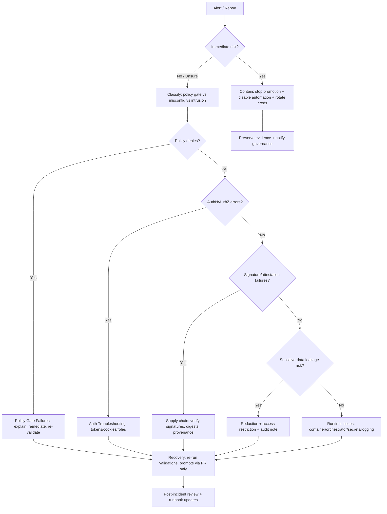

# Security Troubleshooting Runbooks 🔐


This folder contains **security-focused troubleshooting and incident-response runbooks** for Kansas Frontier Matrix (KFM).

> [!IMPORTANT]
> **KFM non-negotiables (operational):**
> 1) **Evidence-first**: every claim/action should be traceable to a log/event/run receipt/audit reference (or explicitly marked “unknown”).  
> 2) **Fail-closed**: if policy gates fail, we treat it as a *stop-the-line* condition until proven safe.  
> 3) **Trust membrane stays intact**: clients/UI never touch storage directly—no “quick fixes” that bypass governed APIs/policy boundaries.
>
> If you suspect active compromise, treat as **SEV0** and follow containment steps immediately.

---

## Governance metadata

| Field | Value |
|---|---|
| Doc type | Runbooks / Troubleshooting / Security |
| Status | Draft (governed artifact) |
| Owners | Platform/SRE (TBD) + Governance/Compliance (TBD) |
| Audience | On-call engineers, pipeline operators, security reviewers |
| Confidentiality | **Internal** (redact before sharing externally) |
| Change control | PR-required, reviewed, auditable |
| Primary goal | Restore safety + trust while preserving KFM invariants |

---

## Scope

This README is the **index + operating rules** for security troubleshooting across the KFM spine:

- **Governed APIs** (authn/authz, rate limits, policy enforcement)
- **CI / GitOps** (policy gates, signing/attestation, promotion lane)
- **Pipelines** (ingest, validate, transform, catalog, promote)
- **Catalog & provenance** (STAC/DCAT/PROV, run receipts, audit trail)
- **Runtime** (containers, orchestration, secrets, observability)

Non-goals:
- This folder is *not* a general security textbook.
- This folder is *not* authorization to bypass policy, provenance, or audit rules.

---

## Directory layout

> [!NOTE]
> Files listed as “planned” are **placeholders** for future runbooks. Avoid adding links until those files exist to keep link-check clean.

```text
docs/
└─ runbooks/
   └─ troubleshooting/
      └─ security/
         ├─ README.md                       # you are here
         ├─ (planned) incident-triage.md
         ├─ (planned) authn-authz-401-403.md
         ├─ (planned) policy-gate-failures-conftest-opa.md
         ├─ (planned) signature-attestation-failures.md
         ├─ (planned) secrets-leak-rotation.md
         ├─ (planned) data-sensitivity-redaction.md
         ├─ (planned) audit-log-gaps.md
         └─ (planned) container-runtime-hardening.md
```

---

## Fast triage checklist (first 10 minutes)

- [ ] **Confirm impact surface**: public API, internal CI, ingestion lane, catalog, UI, or storage.
- [ ] **Time window**: when did the symptom start? (UTC + local)
- [ ] **Identifiers** *(capture immediately)*:
  - [ ] request_id / correlation_id (API gateway)
  - [ ] audit_ref (if present in the platform)
  - [ ] pipeline run_id / run receipt id (if ingestion-related)
  - [ ] dataset version / artifact digest (if promotion-related)
- [ ] **Is this a security incident or a governance gate working?**
  - If **policy denies**: treat as “stop-the-line,” proceed to “Policy Gate Failures.”
  - If **suspicious access / exfil**: treat as incident, proceed to containment.
- [ ] **Containment** (if suspicious):
  - [ ] Stop promotion lane (kill-switch / freeze promotion) *(implementation TBD)*
  - [ ] Disable automation/watchers *(if applicable)*
  - [ ] Rotate relevant secrets/keys *(if exposure suspected)*
- [ ] **Preserve evidence**:
  - [ ] Export relevant logs (API, policy decisions, CI logs)
  - [ ] Snapshot receipts/attestations/provenance bundles
  - [ ] Record actions taken (who/when/why) with an audit reference

---

## Incident triage flow



---

## Troubleshooting matrix

| Category | Common symptoms | First checks | “Do NOT” actions |
|---|---|---|---|
| Policy gate failures | CI blocks merge/promotion; Conftest denies | Identify which rule denied; confirm policy bundle version; confirm required metadata/PROV present | Don’t “temporarily bypass” gates; don’t merge unreviewed policy changes |
| AuthN/AuthZ | 401/403 spikes; users lose access; service-to-service calls fail | Token/session validity; clock skew; role bindings; policy decision logs | Don’t grant broad admin to “fix quickly” |
| Signing/attestation | Cosign/Sigstore verification fails; digest mismatch | Verify artifact by digest; verify attestation chain; check CI OIDC permissions | Don’t switch to unsigned artifacts; don’t trust tags over digests |
| Secrets | Unexpected rotations; leaked secret in logs; missing env vars | Secret store health; last rotation; access logs | Don’t paste secrets into tickets/chat |
| Data sensitivity | Restricted datasets visible; precise locations leak | CARE/consent metadata; policy rules; redaction/generalisations applied | Don’t publish sensitive coordinates; don’t “hotfix” by editing raw artifacts |
| Audit logging gaps | Missing audit trail for access or promotion | Validate audit pipeline; retention; integrity checks | Don’t proceed without reconstructing minimum evidence |
| Container runtime | Privileged pods; unexpected root; host socket exposure | SecurityContext; host mounts; docker.sock/podman socket access | Don’t add privileged mode as first fix |

---

## Common “security ≠ outage” reality check

Sometimes the system is **correctly blocking unsafe promotion**.

Signals it’s working as designed:
- A CI policy gate denies due to **missing license/provenance/required metadata**.
- Signature verification fails because the artifact was rebuilt without re-attesting.
- A CARE/consent label requires steward review before distribution.

Treat these as **governance enforcement**—not as “availability incidents.”

---

## Evidence pack (minimum fields)

> [!TIP]
> You can paste this structure into an internal incident ticket as a starting point.

```yaml
evidence_pack:
  opened_at_utc: "YYYY-MM-DDTHH:MM:SSZ"
  incident_id: "inc_..."           # (not confirmed in repo)
  severity: "SEV0|SEV1|SEV2|SEV3"  # local convention
  reporter: "name/handle"
  system_surface: "api|ci|pipeline|catalog|storage|ui"
  environment: "prod|stage|dev"
  ids:
    request_id: "..."
    correlation_id: "..."
    audit_ref: "..."              # expected to exist in KFM spine (not confirmed in repo)
    run_id: "..."
    dataset_version: "..."
    artifact_digest: "sha256:..."
  policy:
    bundle_version: "..."
    deny_reason: "..."
  actions_taken:
    - at_utc: "..."
      actor: "..."
      action: "..."
      justification: "..."
  artifacts_collected:
    - type: "logs"
      location: "..."
    - type: "run_receipt"
      location: "..."
    - type: "prov_bundle"
      location: "..."
    - type: "attestation"
      location: "..."
```

---

## Data sensitivity handling during troubleshooting

**Security troubleshooting can leak sensitive information** if we are careless with logs/screenshots/tickets.

Rules of thumb:
- Prefer **structural metadata** (hashes, IDs, digests) over content.
- Never paste:
  - secrets/tokens,
  - restricted coordinates,
  - culturally restricted site identifiers,
  - raw record payloads unless explicitly permitted.
- If you must share an example:
  - use **redacted fields**, or
  - use a **synthetic sample** that still reproduces the validation failure.

---

## Adding a new runbook

<details>
<summary><strong>Runbook template (copy/paste)</strong></summary>

### Title

**Status:** draft/active/deprecated  
**Owners:** (TBD)  
**Last updated:** YYYY-MM-DD

#### Symptoms
- …

#### Preconditions / Safety
- [ ] Trust membrane preserved
- [ ] Evidence pack started
- [ ] No secrets copied into tickets

#### Steps
1. …
2. …

#### Verification
- Expected signals:
  - …
- Rollback signals:
  - …

#### Rollback / Containment
- …

#### Evidence & provenance to attach
- logs:
- run receipt:
- PROV bundle:
- attestation:

#### Notes / tradeoffs
- …

</details>

---

## Source anchors

These are the upstream design references this README aligns to (keep updated as the repo evolves):

- KFM integration pack guidance: evidence-first, fail-closed gates, trust membrane, CI policy gate, signing/attestations, audit expectations.
- KFM data-source integration blueprint: clean layers + policy-as-code at the trust membrane.
- Developer security guidance: secure session/token handling, cookie flags, XSS defenses, and storage risk tradeoffs.
- Container security guidance: rootless-by-default posture, avoid host socket escalation patterns.

---

## Definition of Done (DoD) for changes in this folder

- [ ] Runbook changes are made by PR (reviewed by owners + governance).
- [ ] No secrets added; no restricted location details added.
- [ ] Steps are reproducible and include **verification** signals.
- [ ] Any new “break-glass” procedure includes **auditability** and explicit approvals *(not confirmed in repo; required if introduced)*.
- [ ] CI/link checks remain clean (no dead relative links).

---
