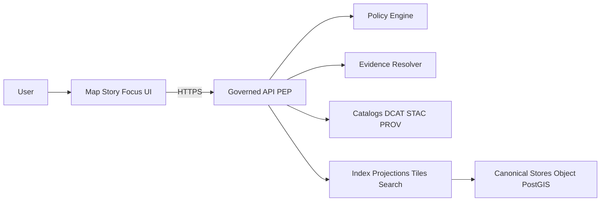

<!-- [KFM_META_BLOCK_V2]
doc_id: kfm://doc/3e5a2b9f-9f0d-4dd8-8ef6-0f5a6f0d8c2e
title: UI Runbooks (Map/Story/Focus)
type: standard
version: v1
status: draft
owners: UI + Platform Ops (TODO: name the team)
created: 2026-03-02
updated: 2026-03-02
policy_label: public
related:
  - docs/runbooks/README.md (TODO)
  - docs/runbooks/api/README.md (TODO)
  - docs/runbooks/policy/README.md (TODO)
tags: [kfm, runbook, ui, operations]
notes:
  - This is a runbook index + operating playbook for KFM UI surfaces (Map, Story, Focus).
  - Commands are intentionally “fail-closed”: replace TODOs with repo-confirmed scripts.
[/KFM_META_BLOCK_V2] -->

# KFM UI Runbooks (Map/Story/Focus)

**Purpose:** Operational playbooks for running, shipping, and troubleshooting KFM’s user interfaces—without breaking the trust membrane.

> **Non‑negotiable:** the UI is **not** a privileged client. It must only interact with KFM through **governed APIs** and must never read from storage/DB directly.

---

## Quick nav
- [Where this fits](#where-this-fits)
- [What belongs here / what doesn’t](#what-belongs-here--what-doesnt)
- [UI architecture (trust surfaces)](#ui-architecture-trust-surfaces)
- [Runbook index](#runbook-index)
- [Golden workflows](#golden-workflows)
- [Troubleshooting cookbook](#troubleshooting-cookbook)
- [Release & rollback](#release--rollback)
- [Incident templates](#incident-templates)
- [Appendix: minimum verification steps](#appendix-minimum-verification-steps)

---

## Where this fits
This directory is **UI operations documentation** under `docs/runbooks/ui/`.

It complements:
- **Platform runbooks** (cluster, databases, object store, CI/CD)
- **API runbooks** (governed endpoints, evidence resolver, tiles)
- **Policy runbooks** (OPA/Rego posture, obligations, audits)

Back to top ↑

---

## What belongs here / what doesn’t

### ✅ Belongs here
- Step-by-step procedures to **operate and recover** UI surfaces
- **Release checklists** (preflight gates, rollback steps)
- **Troubleshooting** symptom → diagnosis → fix → verification
- **On-call** quick checks (dashboards/log queries, common alerts)
- **UI-specific security** gotchas (tokens, caching, redaction behavior)

### ❌ Does *not* belong here
- Product specs, roadmaps, or UX research writeups (put those in `docs/`)
- API design details (put those in `contracts/` or API docs)
- Any instructions that bypass policy controls (“just query the DB” is a hard no)

Back to top ↑

---

## UI architecture (trust surfaces)

**UI trust surfaces (must be visible):**
- dataset version + freshness
- license/rights
- policy label + any applied obligations
- one-click evidence (EvidenceRef → EvidenceBundle)
- provenance/run receipts when available

Back to top ↑

---

## Runbook index

| ID | Runbook | When to use | Owner | Status |
|---:|---|---|---|---|
| UI-001 | Local dev start/stop | dev server won’t boot, env mismatch | UI Eng | TODO |
| UI-002 | Evidence drawer missing/empty | feature click shows no evidence | UI+API | TODO |
| UI-003 | “Cite-or-abstain” failures in Focus | Focus answers abstain unexpectedly | UI+Evidence | TODO |
| UI-004 | Tiles slow / blank | map renders but layers don’t | UI+Platform | TODO |
| UI-005 | Policy regression in UI | restricted data appears or over-blocks | Policy | TODO |
| UI-006 | Story publish blocked | citations fail to resolve or review state missing | UI+Steward | TODO |
| UI-007 | Cache poisoning / wrong policy cached | users see each other’s results | Platform Sec | TODO |

> Create each runbook as `docs/runbooks/ui/UI-0xx-<slug>.md` and link it above.

Back to top ↑

---

## Golden workflows

### 1) Start UI locally (fail-closed template)
> Replace **TODO** commands with the repo’s actual scripts (e.g., `pnpm dev`, `npm run dev`, etc.).

1. **Confirm prerequisites**
   - Node version: `node -v` (TODO: pin via `.nvmrc` / `volta` / `asdf`)
   - Package manager: `pnpm|npm|yarn` (TODO: confirm)
2. **Install deps**
   - `TODO: <package-manager> install`
3. **Set environment**
   - Copy template: `TODO: cp configs/ui/.env.example apps/ui/.env.local`
   - Required env (minimum):
     - `KFM_API_BASE_URL` (governed API)
     - `KFM_AUTH_MODE` (anonymous/dev/oauth) (TODO)
     - `KFM_BUILD_SHA` (optional)
4. **Run**
   - `TODO: <package-manager> run dev`
5. **Verify**
   - UI loads
   - Network tab shows calls only to **governed API**, not directly to storage/DB endpoints.

### 2) “Evidence-first” feature inspection (expected UX)
**Expected:** clicking a feature opens an inspector with an **Evidence** affordance (drawer/panel) that shows:
- dataset_version_id
- license/rights
- policy badge
- resolvable EvidenceRefs (openable)

**If missing:** jump to UI-002.

### 3) Focus Mode behavior (expected)
- If citations **verify**, answer includes citations.
- If citations **cannot** verify or policy denies, Focus **abstains or narrows scope** (this is not a bug).

Back to top ↑

---

## Troubleshooting cookbook

### Symptom: Map loads, but layers are blank
**Likely causes**
- tiles endpoint error
- bbox/time query returns empty
- policy denies layer (expected for restricted)

**Fast checks**
1. UI devtools → Network: inspect tile requests
2. Confirm API base URL correct (env)
3. Try a known-public dataset/layer (TODO: name one once verified)

**Fix**
- If HTTP 401/403: auth or policy (UI-005)
- If 404: layer id mismatch (verify catalog)
- If 5xx: platform incident (UI-004)

---

### Symptom: Evidence drawer empty for a feature
**Likely causes**
- UI not requesting evidence resolver endpoint
- EvidenceRef not present in feature payload
- Catalog cross-links broken

**Fix**
- Confirm UI calls `POST /evidence/resolve` (or equivalent)
- If EvidenceRef present but resolve fails: check evidence service logs; treat as **hard gate** issue (UI-002)

---

### Symptom: Focus Mode abstains “too often”
**This is often correct.** Treat as a bug only if:
- evidence exists and is allowed, but verifier fails, or
- retrieval is missing expected datasets

**Fix**
- confirm policy pre-check outcome
- confirm evidence retrieval returns bundles
- run golden queries (UI-003)

Back to top ↑

---

## Release & rollback

### Pre-release checklist (UI)
- [ ] UI only calls governed API (static scan + runtime smoke)
- [ ] Evidence drawer works via keyboard navigation
- [ ] Story publish gates enforced (cannot publish with unresolvable citations)
- [ ] Focus Mode passes golden query suite (no citation regressions)
- [ ] Caching varies by auth/policy context (no cross-user leakage)
- [ ] Source maps + build SHA visible for debugging

### Rollback checklist (UI)
- [ ] Identify last known good build SHA
- [ ] Roll back UI deployment (TODO: command/helm/kustomize)
- [ ] Verify with:
  - one map layer
  - one story
  - one focus query
- [ ] Confirm policy boundary still intact post-rollback

Back to top ↑

---

## Incident templates

### UI Incident Report (copy/paste)
- **Incident ID:** UI-INC-YYYYMMDD-###
- **Start time (UTC):**
- **Detected by:** (alert/user/on-call)
- **User impact:** (map/story/focus)
- **Severity:** P0/P1/P2
- **Blast radius:** (anon users/auth users/specific roles)
- **Suspected cause:** (tiles/evidence/policy/deploy/cache)
- **Mitigation applied:**
- **Evidence:** links to logs/dashboards/receipts (TODO)
- **Next steps / follow-ups:**

### Postmortem DoD (UI)
- [ ] Root cause identified
- [ ] Regression test added (unit/e2e/golden query)
- [ ] Runbook updated
- [ ] Policy implications reviewed (default-deny confirmed)
- [ ] Backfill or user comms completed (if needed)

Back to top ↑

---

## Appendix: minimum verification steps
Because this README is designed to be safe without guessing repo details, do these checks and then replace TODOs:

1. Capture repo context:
   - `git rev-parse HEAD`
   - `tree -L 4 apps/ui docs/runbooks`
2. Confirm UI scripts:
   - inspect `apps/ui/package.json` scripts
   - record the canonical dev/build/test commands here
3. Confirm governed endpoints used by UI:
   - evidence resolve endpoint
   - datasets/catalog endpoints
   - tiles endpoints
4. Confirm CI gates that block UI merges:
   - typecheck, lint, unit tests, e2e, golden Focus queries (if present)
5. Add one “known-good” public layer and one “known-good” story for smoke tests.

Back to top ↑
