<!-- [KFM_META_BLOCK_V2]
doc_id: kfm://doc/7b4df9a6-6c9e-4a0b-9b3d-2c4a8e81f3f4
title: UI Deployment Runbook
type: standard
version: v1
status: draft
owners: ui-platform (TBD)
created: 2026-03-02
updated: 2026-03-02
policy_label: restricted
related:
  - docs/runbooks/README.md
  - docs/runbooks/api/rb-api-deploy.md
  - docs/runbooks/infra/rb-gitops-sync.md
  - policy/
  - contracts/
tags: [kfm, runbook, ui, deploy]
notes:
  - Rollback-first and PR preview oriented.
  - Defaults to governed-API + Evidence Resolver architecture; verify repo reality before first prod use.
[/KFM_META_BLOCK_V2] -->

# UI Deployment Runbook

> **Purpose:** Safely deploy the KFM Map/Story UI while preserving the trust membrane (policy-enforced access, resolvable evidence, and rollback-first operations).


> TODO: Replace badges with real workflow / environment badges once `.github/workflows/*ui*` and deployment targets are confirmed.

## Quick navigation

- [Scope](#scope)
- [Trust membrane invariants](#trust-membrane-invariants)
- [Deployment model](#deployment-model)
- [Release flow](#release-flow)
- [Procedures](#procedures)
  - [PR Preview deploy](#pr-preview-deploy)
  - [Staging deploy](#staging-deploy)
  - [Production deploy](#production-deploy)
  - [Rollback](#rollback)
- [Post-deploy verification](#post-deploy-verification)
- [Monitoring](#monitoring)
- [Common failures and fixes](#common-failures-and-fixes)
- [Repo verification checklist](#repo-verification-checklist)

---

## Scope

### In scope

- Deploying the KFM UI surface(s): Map Explorer, Stories, Focus Mode UI, and shared **Evidence Drawer** / **Provenance surfaces**.
- Deploy-time checks required to ensure:
  - UI uses governed APIs (PEP) and does not bypass policy.
  - EvidenceRefs resolve into EvidenceBundles/EvidenceBundles show license + version.
  - End-to-end flows still pass (layer toggle → evidence drawer; story publish gate; focus ask gate).

### Out of scope

- API deployment (see `docs/runbooks/api/rb-api-deploy.md`)
- Data pipeline promotion / ETL runs (see data/pipeline runbooks)
- Infra provisioning (Terraform, cluster creation) (see `docs/runbooks/infra/*`)

### Where this doc fits

- **Path:** `docs/runbooks/ui/rb-ui-deploy.md`
- **Audience:** Operators / maintainers performing releases and rollbacks.
- **Acceptable inputs:** Verified environment URLs, image digests, release tags, CI run links, and change tickets.
- **Exclusions:** Secrets, raw tokens, partner data URLs, or any restricted coordinates.

---

## Trust membrane invariants

These are non-negotiable deployment constraints. If any fail, **stop** and rollback.

- **UI only talks to governed APIs** (PEP + evidence resolver). No direct DB/storage calls.
- **Citations are EvidenceRefs**, not pasted URLs. The UI must render evidence by resolving EvidenceRefs via the evidence resolver.
- **Fail closed:** If evidence cannot be resolved or is unauthorized, UI shows an explicit blocked/abstain state (no “best guess”).
- **Least privilege:** UI must not receive privileged tokens beyond what is required for the user session.
- **Sensitive location protection:** Public UI must not leak restricted precise geometry; public tiles must be policy-safe.

---

## Deployment model

> This section is intentionally written as **"PROPOSED defaults"** until the repo’s live infra and workflows are verified.

### Proposed default deployment topology

- UI shipped as a versioned artifact (typically a container image or static bundle).
- GitOps-managed delivery (e.g., a cluster reconciler applying manifests/Helm values from Git).
- Environment tiers:
  - **PR Preview**: ephemeral per PR, isolated config and endpoints.
  - **Staging**: long-lived, release-candidate validation.
  - **Production**: governed public surface.

### Artifact and supply-chain expectations

For each UI release, produce:

| Artifact | Why we require it | Where it should live (example) |
|---|---|---|
| UI build output | Deterministic deployable UI | CI artifact store or image registry |
| Container image digest OR static bundle hash | Immutable rollback target | Container registry / object store |
| SBOM | Dependency transparency | Attached to build or registry |
| Build provenance / attestation | Verifiable link build → artifact | Attestation store (keyless signing if used) |
| Release manifest | Records what was promoted | `releases/` or Git tag notes |

---

## Release flow

```mermaid
flowchart LR
  pr[Pull request] --> ci[CI gates]
  ci --> build[Build UI artifact]
  build --> attest[SBOM and provenance]
  attest --> sign[Sign and verify]
  sign --> preview[Deploy PR preview]
  preview --> review[Review and attest]
  review --> merge[Merge to main]
  merge --> promote[Promote to staging then prod]
  promote --> verify[Smoke and trust checks]
  verify --> monitor[Monitor and alert]
```



### CI gates

Minimum expectations (adapt to what exists in repo):

- Lint + unit tests
- UI e2e tests for trust surfaces (Evidence Drawer + Story citations)
- Contract checks against governed API endpoints (evidence resolver, datasets, stac, story, focus)
- Supply chain verification (SBOM/provenance) when enabled

---

## Procedures

### PR Preview deploy

**Goal:** Every PR produces an isolated UI preview with an explicit rollback path.

#### Inputs

- PR number: `<PR_NUMBER>`
- Commit SHA: `<GIT_SHA>`
- Preview base URL: `https://<preview-host>/pr-<PR_NUMBER>/`
- Preview API base URL: `https://<preview-api-host>/`

#### Steps (template)

1. **Confirm CI is green** for:
   - UI build + unit tests
   - e2e trust tests
   - (optional) SBOM + attestation generation
2. **Build preview artifact** (example placeholders):

   ```bash
   # choose the repo’s actual package manager + build tool
   <pkgmgr> install
   <pkgmgr> test
   <pkgmgr> build
   ```

3. **Publish preview artifact**:

   - If container-based: push image by **digest**.
   - If static hosting: publish immutable build output and record a **content hash**.

4. **Deploy preview** via your reconciler:

   ```bash
   # GitOps pattern: commit an env/preview values change referencing the new digest
   git checkout -b preview/pr-<PR_NUMBER>
   # edit infra values/manifest: set ui.image.digest = <DIGEST>
   git commit -am "preview ui pr <PR_NUMBER> @ <DIGEST>"
   git push
   ```

5. **Verify preview** using [Post-deploy verification](#post-deploy-verification).

> NOTE: If your system supports data preview branches (e.g., `preview-<PR_NUMBER>`), ensure the UI points at the preview API/data branch for end-to-end evidence correctness.

---

### Staging deploy

**Goal:** Promote a reviewed build to a stable staging environment.

#### Steps (template)

1. Select release candidate:
   - Prefer a signed image digest (or static bundle hash) that already passed preview checks.
2. Update staging deployment references (GitOps preferred):

   ```bash
   # update staging values/manifest
   # set ui.image.digest = <DIGEST>
   git commit -am "stage ui @ <DIGEST>"
   git push
   ```

3. Wait for reconciler sync (or apply manifests directly if that is your current reality).
4. Run [Post-deploy verification](#post-deploy-verification) + staging-specific scenarios.

---

### Production deploy

**Goal:** Promote a staging-verified build to production with rollback-first safety.

#### Pre-flight checklist

- [ ] Release ticket exists and links: PRs, CI runs, artifact digest/hash, and verification notes.
- [ ] Evidence resolver and governed API are healthy.
- [ ] No pending incidents affecting auth, tiles, or evidence services.
- [ ] Rollback target is identified **before** deploying.

#### Deploy steps (template)

1. Pin the production deployment to the approved digest/hash.
2. Execute deployment via GitOps (preferred).
3. Run [Post-deploy verification](#post-deploy-verification).
4. Monitor for at least one full cache cycle / user session cycle.

---

### Rollback

**Trigger:** Any trust membrane invariant fails, or user-visible regression impacts correctness, security, or availability.

#### Rollback-first posture

- Rollback is a **primary** operation, not an emergency hack.
- The rollback path must be tested (ideally automated).

#### Steps (template)

1. Identify rollback target:
   - Last known good image digest / static bundle hash: `<LAST_GOOD_DIGEST>`
2. Revert production deployment reference:

   ```bash
   # GitOps revert
   git revert <commit-that-bumped-ui-digest>
   git push
   ```

3. Confirm rollback complete (pods/assets updated; caches warmed).
4. Re-run [Post-deploy verification](#post-deploy-verification).
5. Open/Update an incident record with:
   - What changed
   - Why rollback was required
   - Evidence of recovery

---

## Post-deploy verification

> This is a **release gate**. If you cannot complete it, do not promote.

### Smoke checks

- [ ] UI loads without console errors.
- [ ] Map renders (base layer + at least one overlay).
- [ ] Dataset discovery UI loads and lists datasets/versions.
- [ ] Layer toggle works.
- [ ] Feature click opens **Evidence Drawer**.
- [ ] Evidence Drawer shows **license + version** and is keyboard navigable.

### Trust checks

- [ ] Evidence resolution calls succeed via governed API (no direct object-store URLs in client).
- [ ] Unauthorized evidence fails closed (blocked message; no partial data leak).
- [ ] Story view: citations resolve; evidence drawer opens from citations.
- [ ] Focus Mode: responses cite-or-abstain; receipts/audit references appear where expected.

### Regression checks (minimum)

- [ ] Accessibility regression scan (keyboard nav + focus trapping on drawers/modals).
- [ ] Performance sanity: first load time, map interaction responsiveness, tile request rate.

---

## Monitoring

### Golden signals (start here)

- Availability: UI served (HTTP 200), low 5xx
- Latency: p50/p95 page load and API calls
- Errors: evidence/resolve failures, auth failures, tile failures
- Saturation: CDN / ingress saturation, browser error budgets

### Logs and traces (recommended)

- UI error reporting (RUM or client error capture) with scrubbed payloads
- Correlation IDs propagated to API logs

---

## Common failures and fixes

> Keep this list tight and operator-oriented. Add entries only after a real incident or drill.

### UI loads but map is blank

**Symptoms**
- Basemap missing; layers don’t render

**Likely causes**
- Wrong API base URL
- Tile endpoint blocked by CORS/CSP
- Policy denies tile access

**Actions**
- Check UI config points to expected environment
- Verify `/api/v1/tiles/...` and `/api/v1/datasets` health
- If policy denies: treat as governance issue; do not bypass

### Evidence Drawer fails to resolve

**Symptoms**
- Evidence panel shows “unresolvable” or spins

**Likely causes**
- Evidence resolver service down
- Contract mismatch between UI and `/api/v1/evidence/resolve`

**Actions**
- Confirm resolver health
- Check recent API contract changes
- Rollback UI if contract mismatch was introduced

### Auth redirect loop

**Actions**
- Confirm OIDC client config matches environment
- Verify cookie/domain settings for the deployed host

---

## Repo verification checklist

Before using this runbook for a real production deployment:

- [ ] Capture repo commit hash and root directory tree (`git rev-parse HEAD`, `tree -L 3`).
- [ ] Confirm which UI work packages exist (Map Explorer, Evidence Drawer, Story renderer).
- [ ] Extract CI gate list from `.github/workflows` and document which checks block merges.
- [ ] Confirm where deployment config actually lives (`infra/`, Helm charts, Terraform, or external).
- [ ] Validate UI cannot bypass the PEP (static analysis + network policies where applicable).
- [ ] Confirm EvidenceRefs resolve end-to-end in Map Explorer and Story publishing.

---

### Appendix: placeholders to replace once verified

| Placeholder | Replace with |
|---|---|
| `<pkgmgr>` | `npm` / `pnpm` / `yarn` (verify in `apps/ui/package.json`) |
| `<preview-host>` | Preview hosting domain |
| `<preview-api-host>` | Preview API domain |
| `<DIGEST>` | Container digest or bundle hash |
| `<LAST_GOOD_DIGEST>` | Last known good rollback target |
