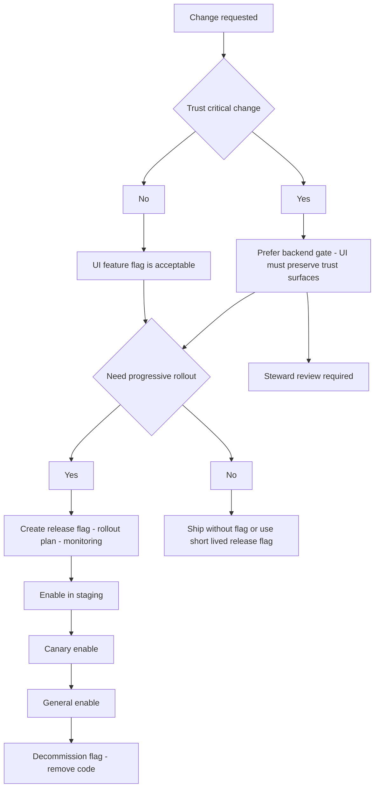

<!-- [KFM_META_BLOCK_V2]
doc_id: kfm://doc/7f8f2c22-94a3-4d3f-93e9-28fb11f8c7f4
title: UI Runbook — Feature Flags
type: runbook
version: v1
status: draft
owners: ui-team (TBD)
created: 2026-03-02
updated: 2026-03-02
policy_label: restricted
related:
  - docs/runbooks/ui/README.md
  - docs/runbooks/README.md
tags: [kfm, runbook, ui, feature-flags, governance, release]
notes:
  - Feature flags are *not* authorization; policy is enforced server-side.
  - Fail-closed defaults; flags must have an expiry date and a removal plan.
  - TODO: confirm policy_label and related paths are correct for this repo.
[/KFM_META_BLOCK_V2] -->

# UI Runbook: Feature Flags
**Purpose:** Safely ship, validate, and (if needed) instantly roll back UI changes **without** weakening KFM’s trust membrane, evidence surfaces, or policy posture.


> **WARNING**
> Feature flags must never be used to bypass policy enforcement, show restricted “ghost metadata,” or disable required trust surfaces (license/version/policy notices) except under an explicit incident response plan.

---

## Quick navigation
- [Scope](#scope)
- [Non-negotiable invariants](#non-negotiable-invariants)
- [Flag taxonomy](#flag-taxonomy)
- [Decision tree](#decision-tree)
- [Procedures](#procedures)
  - [Add a new flag](#procedure-add-a-new-flag)
  - [Enable a flag](#procedure-enable-a-flag)
  - [Disable / rollback](#procedure-disable--rollback)
  - [Decommission a flag](#procedure-decommission-a-flag)
- [Testing & CI expectations](#testing--ci-expectations)
- [Monitoring & incident response](#monitoring--incident-response)
- [Appendix: templates](#appendix-templates)

---

## Scope
### What this runbook covers
- UI feature flags (a.k.a. feature toggles) controlling:
  - Rendering, navigation, and UI workflows
  - Progressive rollout (staging → canary → general)
  - Emergency rollback (“kill switch” behavior for a UI feature)

### What this runbook does **not** cover
- **Authorization / data access control.** Access must be enforced by the governed API and evidence resolver, not by the UI.
- Backend rollout strategies (those belong in API/infra runbooks)
- Dataset promotion gates (those belong in data pipeline runbooks)

### Where it fits in the repo
- Path: `docs/runbooks/ui/rb-ui-feature-flag.md`
- This is an operations + engineering runbook intended for:
  - UI engineers
  - Operators on-call
  - Stewards reviewing risk for public-facing rollouts

**Acceptable inputs**
- A specific feature change request (PR / issue link)
- Flag metadata (name, owner, expiry, risk)
- Rollout plan + monitoring plan

**Exclusions**
- Any procedure that requires client-side access to restricted data
- Any workaround that removes evidence/attribution surfaces from the user experience

---

## Non-negotiable invariants
These are KFM “trust membrane” constraints that feature flags must **not** compromise.

### 1) The UI is a governed client
- UI renders what the governed API returns.
- UI **must not embed privileged credentials** or directly access storage/DBs.
- UI shows trust surfaces (dataset version, license/rights, policy notices, evidence access) as first-class UI elements.

### 2) Evidence-first UX remains available
- Evidence is accessible from map interactions, story claims, and Focus Mode responses.
- Story publishing and Focus Mode must continue to require resolvable citations (EvidenceRefs → EvidenceBundles), or the system abstains / narrows scope.

### 3) Fail closed
If flag configuration is missing/invalid/unreachable:
- Default to the **safer** behavior (usually “feature OFF”)
- Preserve core UX flows (Map Explorer, Evidence Drawer, Story reading) even if the new feature is disabled

---

## Flag taxonomy
Use a consistent taxonomy so everyone understands the risk and intended lifetime.

| Type | Name prefix (recommended) | Default | Intended lifetime | Examples |
|---|---|---:|---|---|
| Release flag | `ui.release.*` | OFF | days–weeks | New panel, new flow, new map renderer |
| Ops kill switch | `ui.ops.*` | ON (for stable feature) | long | Disable a feature that is causing incidents |
| Experiment / A-B | `ui.exp.*` | OFF | days–weeks | Alternate legend layout (non-trust-critical only) |
| Performance guard | `ui.perf.*` | ON/OFF | long | Disable expensive layer effect on low-end devices |
| Internal-only | `ui.internal.*` | OFF | days–months | Steward tooling behind internal routes |

> **TIP**
> If the flag protects a trust-critical surface (evidence drawer, license/version badges, policy notice), treat it as an **ops kill switch** with an explicit incident playbook and steward sign-off.

---

## Decision tree


---

## Procedures

### Procedure: Add a new flag
**Goal:** Introduce a flag that is discoverable, owned, testable, and safe-by-default.

1) **Choose a flag name**
   - Use `ui.<type>.<area>.<feature>`
   - Avoid generic names like `newUI`, `testFlag`
   - Include an expiry date and removal ticket in the PR description

2) **Write flag metadata (required)**
   - Owner (person/team)
   - Risk class: `low | medium | high`
   - Expiry date
   - “Trust impact” statement:
     - Does this affect evidence, attribution, policy notices, story publishing, or Focus Mode?

3) **Implement a typed flag reader**
   - Fail closed on missing keys, invalid types, or network failure.
   - Cache with a short TTL if the source is remote.

4) **Wrap the feature with a safe fallback**
   - The fallback must preserve navigation and evidence flows.
   - If the feature adds a new route, ensure the old route still exists while the flag is OFF.

5) **Add tests**
   - Unit test: flag OFF renders fallback
   - Unit test: flag ON renders new feature
   - E2E test: core “trust surfaces” still work (evidence drawer, policy notices, story publish gate if applicable)

> **NOTE**
> If the flagged feature changes how citations/evidence are displayed, add a regression test that verifies “citations resolve and open evidence” still works.

---

### Procedure: Enable a flag
**Goal:** Turn on a feature safely with governance visibility and rollback readiness.

**Prereqs**
- Backend support is already deployed (if required)
- Monitoring is in place (see [Monitoring & incident response](#monitoring--incident-response))
- Steward sign-off if trust-critical or public-facing

**Steps**
1) Enable in **staging** first
2) Validate the acceptance checklist:
   - [ ] Map Explorer loads
   - [ ] Evidence drawer opens from a feature click
   - [ ] License/version info is visible in evidence surfaces
   - [ ] Policy notices behave correctly (no restricted leakage)
3) Enable in **canary** (small percentage or internal cohort)
4) Enable for **general** users
5) Record the change (who/when/why) in the deploy notes (and audit system if available)

---

### Procedure: Disable / rollback
**Goal:** Stop harm quickly.

**When to rollback**
- Elevated UI error rate / crash loop
- Evidence drawer fails to open
- Policy notice regression or restricted leakage risk
- Story publish or Focus Mode citation resolution fails

**Steps**
1) Set the flag to OFF (or activate the ops kill switch)
2) Confirm behavior:
   - UI renders fallback
   - Trust surfaces still accessible
3) Open an incident ticket with:
   - Flag name + last-known values
   - Affected environments
   - Screenshots / console logs
   - Any `audit_ref` (if provided by the API)

---

### Procedure: Decommission a flag
**Goal:** Remove the flag to avoid long-term complexity.

**Do this when**
- Feature is stable and fully rolled out, or permanently cancelled.

**Steps**
1) Flip flag to ON for all cohorts (if it’s a release flag) and monitor for one release cycle
2) Remove:
   - Flag checks
   - Old fallback code paths
   - Flag metadata entry
3) Delete or archive any dashboards tied only to the flag
4) Add a regression test that validates the new default path

---

## Testing & CI expectations
Feature flags must not undermine KFM’s merge gates or trust-critical UI acceptance criteria.

### Minimum test matrix
| Layer | Test | What it protects |
|---|---|---|
| Unit | OFF path renders safe fallback | fail-closed behavior |
| Unit | ON path renders new feature | feature correctness |
| Integration | Flag config parsing/validation | no “undefined flag” surprises |
| E2E | Feature click → evidence drawer opens | evidence-first UX |
| E2E | Story publish gate (if touched) | citations must resolve |
| E2E | Focus Mode (if touched) | cite-or-abstain behavior |

### “Trust surface” regression checklist
- [ ] Layer panel shows dataset version + policy badge where applicable
- [ ] Evidence drawer is reachable via keyboard
- [ ] Policy notices are explicit and policy-safe
- [ ] No restricted existence leakage via 403/404 UX differences
- [ ] Export/report flows include citations + audit reference when present

---

## Monitoring & incident response
### What to monitor during rollout
- UI error rate (JS exceptions)
- API error rate (especially evidence resolve endpoints)
- Evidence drawer open rate / failure rate
- Story publish failures (citation resolution errors)
- Performance: map FPS / load time deltas for the flagged path

### Incident severity guide (UI feature flags)
| Severity | Example | Immediate action |
|---|---|---|
| SEV-1 | Potential restricted leakage, broken trust surface, broken story publish gate | Disable flag immediately; notify steward |
| SEV-2 | Major UX regression, widespread crashes | Disable flag; open incident; prepare hotfix |
| SEV-3 | Minor regression, low-impact error | Can roll back or fix-forward |

---

## Appendix: templates

### Flag registry entry (template)
```yaml
# ui.feature_flags.yaml  (PATH TBD)
- key: ui.release.map.layerPanelV2
  type: release
  owner: ui-team
  risk: medium
  default: false
  expires: 2026-05-01
  trust_impact:
    affects_evidence: false
    affects_policy_notice: false
    affects_story_publishing: false
    affects_focus_mode: false
  links:
    pr: <PR URL>
    issue: <Issue URL>
    runbook: docs/runbooks/ui/rb-ui-feature-flag.md
```

### React hook example (optional pattern)
```ts
// NOTE: example only; adjust to your actual config system.
// Fail closed: unknown -> false.
export function useFeatureFlag(key: string): boolean {
  const flags = useFlagsState(); // e.g., from context
  return flags?.[key] === true;
}
```

### Rollback announcement (copy/paste)
```text
[UI Feature Flag Rollback]
Flag: <flag-key>
Env(s): <staging|canary|prod>
Action: DISABLED
Reason: <short reason>
Impact: <who/what impacted>
Next: <ticket link + owner>
```

---

## Back to top
⬆️ [Back to top](#ui-runbook-feature-flags)
