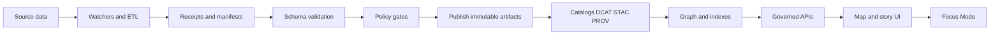

<!-- [KFM_META_BLOCK_V2]
doc_id: kfm://doc/ee2281f3-ccce-4dbb-bf79-e6bd1caed499
title: Schemas
type: standard
version: v1
status: draft
owners: KFM Maintainers (TODO: set team)
created: 2026-02-24
updated: 2026-03-01
policy_label: public
related:
  - ../../schemas/
  - ../MASTER_GUIDE_v13.md
tags: [kfm, schemas]
notes:
  - This README is intentionally conservative: it documents expected contracts and gates without assuming repo wiring beyond what is standard in KFM v13 docs.
  - Expanded directory layout to reflect the v13 repo structure standard and common KFM “drop-in” integration artifacts (schemas + policy gates + CI workflows).
  - TODO: Confirm whether canonical machine-readable schemas live in /schemas/ (repo root) or in docs/schemas/ for this repo, then update links + CI paths.
  - TODO: Confirm whether registry-entry schemas live under data/registry/schemas/ (monorepo variant) and add cross-links here.
[/KFM_META_BLOCK_V2] -->

<a id="schemas"></a>

# Schemas

Schema contracts and documentation that keep KFM **contract-first**, **evidence-first**, and **fail-closed**.


 <!-- TODO: replace with real workflow badge URL -->


> **NOTE**
> The KFM v13 layout expects canonical machine-readable schemas under **`/schemas/`** at the repo root.  
> This `docs/schemas/` folder is the **human-facing documentation** and “how to use them” index.
>
> If your repo stores schemas elsewhere, update:
> 1) the `related:` links in the MetaBlock,  
> 2) all relative links below, and  
> 3) CI gate paths (schema validation + policy checks).

---

## Navigation

- [Why schemas exist in KFM](#why-schemas-exist-in-kfm)
- [Where this fits in the repo](#where-this-fits-in-the-repo)
- [Directory layout](#directory-layout)
  - [KFM v13 repo map (expected)](#kfm-v13-repo-map-expected)
  - [Canonical schemas (machine-readable): `/schemas/`](#canonical-schemas-machine-readable-schemas)
  - [Schema docs + fixtures: `docs/schemas/`](#schema-docs--fixtures-docsschemas)
  - [Variant: monorepo contracts + registry schemas](#variant-monorepo-contracts--registry-schemas)
- [Schema registry](#schema-registry)
- [Conventions](#conventions)
- [Validation and gates](#validation-and-gates)
- [Definition of done for schema changes](#definition-of-done-for-schema-changes)
- [Troubleshooting](#troubleshooting)
- [References](#references)

---

## Why schemas exist in KFM

KFM’s “trust membrane” depends on **contracts**:

- **Catalog contracts:** DCAT / STAC / PROV must validate under KFM profiles before anything is promoted into runtime surfaces.
- **Run evidence contracts:** every pipeline run emits typed artifacts (for example `run_receipt` and `run_manifest`) that are schema-validated and policy-gated.
- **Automation allow-lists:** watchers and other automations are enabled only through typed, reviewed, and (where applicable) signed allow-lists.
- **UI + API contracts:** evidence surfaces and governed APIs are contract-tested so downstream clients don’t “guess”.

In practice, KFM’s governance loop is:

**watch → hash → emit receipts → validate + attest → fail-closed gates → publish immutable artifacts → surface provenance in UI**

<a href="#schemas">Back to top ↑</a>

---

## Where this fits in the repo

Schemas sit *between* pipelines and everything downstream:



<a href="#schemas">Back to top ↑</a>

---

## Directory layout

This section is the **fully expanded** layout reference for:
- where schema files live,
- where human docs live,
- and where enforcement usually happens (policy + CI).

### KFM v13 repo map (expected)

> **NOTE**
> This is the **v13 standard “map”** of the repo with emphasis on schema-adjacent directories.  
> If your repo differs, keep the intent, update the paths.

```text
repo-root/
├─ data/                                        # Domain data zones + mapping docs (raw/work/processed)
│  ├─ <domain>/                                 # e.g. hydrology/, air-quality/, historical/
│  │  ├─ raw/                                   # Immutable upstream payloads + checksums (read-only)
│  │  ├─ work/                                  # Quarantine transforms + QA reports
│  │  ├─ processed/                              # Publishable standardized artifacts + digests
│  │  ├─ mappings/                               # Dataset → DCAT/STAC/PROV mapping docs (optional)
│  │  └─ README.md                               # Domain runbook
│  └─ README.md                                  # Global data catalog README
│
├─ docs/                                        # Human docs, standards, ADRs, governance
│  ├─ MASTER_GUIDE_v13.md
│  ├─ glossary.md
│  ├─ architecture/
│  │  ├─ diagrams/
│  │  └─ adr/
│  ├─ standards/                                 # STAC/DCAT/PROV profiles + repo structure standard
│  ├─ templates/                                 # Universal Doc / Story Node / API contract templates
│  ├─ governance/                                # Ethics, sovereignty, review gates, etc
│  └─ reports/
│     └─ story_nodes/
│        ├─ templates/
│        ├─ draft/
│        └─ published/
│           └─ <story_slug>/
│              ├─ story.md
│              └─ assets/
│
├─ docs/schemas/                                 # ✅ THIS FOLDER: schema documentation + fixtures
│
├─ mcp/                                         # Runs + experiments (Focus/automation harnesses)
│  ├─ runs/
│  └─ experiments/
│
├─ schemas/                                     # ✅ Canonical machine-readable schemas (contracts)
│  ├─ stac/
│  ├─ dcat/
│  ├─ prov/
│  ├─ storynodes/
│  ├─ ui/
│  └─ telemetry/
│
├─ src/                                         # Pipelines, server, graph (implementation)
│  ├─ pipelines/
│  ├─ graph/
│  └─ server/
│
├─ tools/                                       # Validators, spec-hash tools, link-checkers
├─ tests/                                       # Contract tests + fixtures (schema/policy/UI/API)
├─ web/                                         # Map/Story/Focus UI
├─ releases/                                    # Immutable release manifests + artifacts (if used)
│
└─ .github/workflows/                            # CI gates (schema, policy, link-check, etc)
```

<a href="#schemas">Back to top ↑</a>

---

### Canonical schemas (machine-readable): `/schemas/`

> **RULE**
> If a schema is enforced by CI or consumed downstream, it belongs in **`/schemas/`** (or a single, clearly documented canonical location).

#### Minimum expected structure

```text
schemas/
├─ run_receipt.v1.schema.json                    # Per-run evidence (receipt)
├─ run_manifest.v1.schema.json                   # Per-run evidence (manifest)
├─ watcher.v1.schema.json                        # Signed/allow-listed automation registry entry
│
├─ stac/                                         # STAC core + KFM profile(s)/extensions
├─ dcat/                                         # DCAT exports (JSON-LD) + KFM profile(s)
├─ prov/                                         # PROV bundles (JSON-LD) + KFM profile(s)
├─ storynodes/                                   # Story Node v3 schema(s)
├─ ui/                                           # UI-facing payload contracts (Evidence surfaces)
└─ telemetry/                                    # Telemetry event schemas (no PII)
```

#### Fully expanded (recommended) structure

This version adds:
- explicit “shared defs”,
- per-family READMEs,
- fixture placement guidance,
- and space for KFM-specific profiles/extensions.

```text
schemas/
├─ README.md                                     # What is canonical here + versioning rules
├─ _shared/                                      # Reusable defs (digests, timestamps, refs, policy labels)
│  ├─ digest.schema.json
│  ├─ evidence_ref.schema.json
│  ├─ policy_label.schema.json
│  └─ uri.schema.json
│
├─ run_receipt.v1.schema.json
├─ run_manifest.v1.schema.json
├─ watcher.v1.schema.json
│
├─ promotion_manifest.v1.schema.json             # (RECOMMENDED) Release-level manifest for reproducibility
│
├─ catalogs/                                     # (OPTIONAL) If you group catalog contracts as a family
│  ├─ dcat/
│  ├─ stac/
│  └─ prov/
│
├─ stac/
│  ├─ README.md                                  # KFM STAC profile + extension policy
│  ├─ profile/                                   # KFM-required fields (strict validation)
│  ├─ extensions/                                # KFM extensions (e.g., CARE policy hints) if used
│  ├─ vendored/                                  # Optional pinned upstream STAC schemas/extensions
│  └─ fixtures/                                  # Optional family-local fixtures
│
├─ dcat/
│  ├─ README.md
│  ├─ profile/
│  ├─ contexts/                                  # JSON-LD contexts if maintained here
│  └─ fixtures/
│
├─ prov/
│  ├─ README.md
│  ├─ profile/
│  ├─ contexts/
│  └─ fixtures/
│
├─ storynodes/
│  ├─ README.md
│  ├─ story_node.v3.schema.json
│  └─ fixtures/
│
├─ ui/
│  ├─ README.md
│  ├─ evidence_bundle.v1.schema.json             # Evidence resolver output (human+machine+digests)
│  ├─ receipt_card.v1.schema.json                # UI card rendering contract (optional)
│  └─ fixtures/
│
└─ telemetry/
   ├─ README.md
   ├─ event.v1.schema.json
   └─ fixtures/
```

> **TIP**
> Keep vendor/upstream spec schemas (WZDx, GTFS-RT, SensorThings, etc.) *close to the tool or pipeline* that uses them:
> - `tools/<tool>/schemas/` or `src/pipelines/<pipeline>/schemas/`
>
> Keep KFM’s cross-cutting platform contracts in `/schemas/`.

<a href="#schemas">Back to top ↑</a>

---

### Schema docs + fixtures: `docs/schemas/`

`docs/schemas/` is **documentation-first**: explanations, invariants, and examples that teach.

```text
docs/
└─ schemas/
   ├─ README.md                                  # ✅ This file: how to use schema contracts
   │
   ├─ registry/                                  # Human index of schema families + versions
   │  ├─ index.md                                # “Schema catalog”: family → versions → links
   │  ├─ mappings.csv                            # Crosswalks: old → new fields, schema family map
   │  └─ dependency_graph.md                     # Optional: which contracts reference others
   │
   ├─ families/                                  # Human docs per contract family
   │  ├─ run_evidence/
   │  │  ├─ README.md                            # What receipts/manifests mean + invariants
   │  │  ├─ versioning.md                        # When to bump v1 → v2
   │  │  └─ examples.md                          # Common patterns + pitfalls
   │  ├─ automation/
   │  │  ├─ README.md                            # Watchers registry + allow-list rules
   │  │  └─ security.md                          # Signature/spec_hash expectations
   │  ├─ catalogs/
   │  │  ├─ README.md                            # Triplet expectations (DCAT/STAC/PROV) + cross-links
   │  │  ├─ dcat.md
   │  │  ├─ stac.md
   │  │  └─ prov.md
   │  ├─ storynodes/
   │  │  ├─ README.md                            # Story Node schema + citation invariants
   │  │  └─ publish_gate.md                      # Publish gate: citations resolvable, policy-safe
   │  ├─ ui/
   │  │  ├─ README.md                            # Evidence surfaces + payload contracts
   │  │  └─ receipt_viewer_contract.md
   │  └─ telemetry/
   │     ├─ README.md                            # Event shapes (no PII) + retention hints
   │     └─ redaction_rules.md
   │
   ├─ fixtures/                                  # Examples used in docs and/or CI
   │  ├─ valid/                                  # Must pass schema validation
   │  │  ├─ run_receipt/
   │  │  ├─ run_manifest/
   │  │  ├─ watcher/
   │  │  ├─ dcat/
   │  │  ├─ stac/
   │  │  ├─ prov/
   │  │  ├─ storynodes/
   │  │  └─ ui/
   │  └─ invalid/                                # Must fail (teaches common mistakes)
   │     ├─ run_receipt/
   │     ├─ watcher/
   │     └─ catalogs/
   │
   ├─ howto/                                     # “How do I…?” playbooks
   │  ├─ authoring.md                            # Writing strict schemas (additionalProperties, $id, etc.)
   │  ├─ references.md                           # $ref patterns, shared defs, bundling
   │  ├─ canonicalization.md                     # Hashing + JSON canonicalization rules
   │  ├─ validation.md                           # Local validation + CI expectations
   │  └─ migrations.md                           # Breaking change playbook + consumer updates
   │
   ├─ adr/                                       # ADRs for schema boundary decisions
   │  ├─ ADR-0001-schema-versioning.md
   │  └─ ADR-0002-evidence-ref-schemes.md
   │
   ├─ templates/                                 # Copy/paste templates
   │  ├─ TEMPLATE__SCHEMA_JSONSCHEMA_2020_12.json
   │  ├─ TEMPLATE__FIXTURE_VALID.json
   │  └─ TEMPLATE__FIXTURE_INVALID.json
   │
   └─ diagrams/
      ├─ schema_boundary.mmd                     # Diagrams that explain the boundary
      └─ schema_lifecycle.mmd
```

<a href="#schemas">Back to top ↑</a>

---

### Variant: monorepo contracts + registry schemas

Some KFM repos also colocate schemas next to registries and API contracts. If so, **cross-link them here** and ensure CI validates both locations.

```text
repo-root/
├─ contracts/
│  └─ openapi/                                   # OpenAPI specs (governed API surface)
│
├─ data/
│  └─ registry/
│     ├─ <dataset>.yaml                          # Registry entries (license, cadence, ownership, etc)
│     └─ schemas/
│        └─ dataset_entry.schema.json            # Contract for dataset registry YAML entries
│
├─ policy/
│  └─ opa/                                       # Rego + gates (deny-by-default)
│
├─ schemas/                                      # Still keep the cross-cutting platform schemas here
└─ tests/                                        # Contract tests and fixtures
```

> **WARNING**
> Do not claim specific packages/apps/modules exist until verified in the live repo.
> Prefer documenting the **contract surfaces** (schemas + policies + CI gates) and then linking to
> whichever implementation paths exist in *this* repository.

<a href="#schemas">Back to top ↑</a>

---

## Schema registry

> **NOTE**
> The schema file paths below assume the v13 default (`/schemas/...`).  
> If your repo stores schemas elsewhere, change the link targets (not the contract names).

| Contract area | Canonical contracts (examples) | Canonical location | Primary consumers | Primary gate |
|---|---|---|---|---|
| Run evidence | `run_receipt.v1`, `run_manifest.v1` | `../../schemas/` | Pipelines, CI, auditors, UI evidence surfaces | Schema validation + policy pack |
| Promotion manifest | `promotion_manifest.v1` (recommended) | `../../schemas/` | Release tooling, auditors, reproducibility | Schema + link-check |
| Automation allow-list | `watcher.v1` | `../../schemas/` | Watcher runners, CI, Focus allow/deny | Schema + signature/spec_hash rules |
| STAC | STAC core + KFM profile + extensions | `../../schemas/stac/` | Catalog builders, validators, UI | STAC validation + profile checks |
| DCAT | DCAT (JSON-LD) + KFM profile | `../../schemas/dcat/` | Catalog builders, validators | DCAT validation + rights/policy checks |
| PROV | PROV bundles + receipt linkage | `../../schemas/prov/` | Lineage pipeline, graph ingest, UI | PROV validation + policy checks |
| Story nodes | Story Node v3 + citation payloads | `../../schemas/storynodes/` | Story compiler, UI, Focus Mode | Schema + citation resolution checks |
| UI payloads | Evidence surfaces + receipt cards | `../../schemas/ui/` | Web UI, API boundary | Contract tests |
| Telemetry | Event logs (no PII) | `../../schemas/telemetry/` | Observability, ops acceptance gate | Schema + redaction rules |

<a href="#schemas">Back to top ↑</a>

---

## Conventions

### Schema dialect

- Prefer **JSON Schema draft 2020-12** (explicit `$schema`).
- Every schema should have a stable `$id` and a human-readable `title`.

### Naming and versioning

Use **explicit major versions in filenames**:

- `name.v1.schema.json`
- `name.v2.schema.json` (breaking changes only)

Avoid “silent” breaking changes in-place.

### Design rules

- `additionalProperties: false` on externally consumed schemas.
- Prefer `required` + narrow types over permissive schemas.
- Put “policy-relevant” fields in the contract (e.g., `spec_hash`, `artifact_digest`, `signature_ref`) so gates can reason deterministically.

<a href="#schemas">Back to top ↑</a>

---

## Validation and gates

Schemas are only useful if they’re enforced.

### Promotion contract (minimum fail-closed gates)

When a dataset version moves into runtime surfaces, promotion is blocked unless at least:

- **Identity & versioning:** deterministic `dataset_version_id` + `spec_hash`; promotion manifest exists.
- **Artifacts:** processed artifacts exist; each has a digest; predictable paths; media types recorded.
- **Catalogs:** DCAT/STAC/PROV are schema-valid under profile.
- **Cross-links:** all links resolve; asset hrefs exist; EvidenceRefs resolve.
- **Policy:** policy label assigned; obligations applied; default-deny tests pass.
- **QA:** validation reports exist; failures quarantined.
- **Audit:** run receipt emitted; audit ledger append; approvals captured where required.

### Local checks

Run schema + policy checks locally before opening a PR.

Example Conftest invocation (adjust file paths to match your repo layout):

```bash
conftest test path/to/run_receipt.json -p policy/opa
```

### CI expectations (minimum)

Recommended gate ordering:

1. **Schema compile / lint** (fail fast on malformed schemas).
2. **Schema validation of fixtures** (`valid/*` must pass, `invalid/*` must fail).
3. **Policy gate** (deny-by-default; only allow promotion if required evidence is present).
4. **Signature verification** where applicable (watchers registry, signed receipts/attestations).
5. **Catalog linkage checks** (DCAT/STAC/PROV must cross-link to receipts/PROV where required).

> **WARNING**
> If a schema or policy gate is ambiguous: **deny promotion** and require an explicit review/exception.

<a href="#schemas">Back to top ↑</a>

---

## Definition of done for schema changes

When you change a schema, it is not “done” until it is enforced and safe to consume.

- [ ] Update the schema file (new major version if breaking).
- [ ] Add/refresh **fixtures**: at least one valid + one invalid example.
- [ ] Ensure **CI fails** on invalid examples and **passes** on valid examples.
- [ ] Update any **OPA/Rego** policies that rely on the changed fields.
- [ ] Update downstream contracts (API payloads, UI components like ReceiptViewer) if they embed schema expectations.
- [ ] Document the invariant you are enforcing and why it matters (one paragraph minimum).

<a href="#schemas">Back to top ↑</a>

---

## Troubleshooting

### “Schema validates locally but fails in CI”

Common causes:

- Different JSON Schema engine/version in CI (pin versions to avoid drift).
- CI runs additional policy gates (Conftest/OPA) that your local run skipped.
- Fixtures in CI include additional samples you didn’t validate locally.

### “Receipt renders as untrusted in the UI”

Expected reasons:

- Schema validation failed.
- Signature verification failed or is missing.
- Policy gate marked the artifact as unsafe or incomplete.

<a href="#schemas">Back to top ↑</a>

---

## References

- Repo structure expectations and directory roles: `docs/MASTER_GUIDE_v13.md` (or equivalent).
- Schema directory expectations (v13): `schemas/` with `stac/`, `dcat/`, `prov/`, `storynodes/`, `ui/`, `telemetry/`.
- Canonical schema files: `../../schemas/`
- Policy-as-code gate pack (expected): `policy/opa/` (verify in repo)
- Evidence surface component (expected): `web/src/components/ReceiptViewer/` (verify in repo)