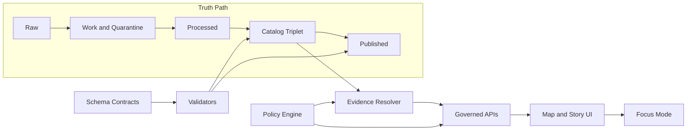

# Schemas

Contract-first schema registry and conventions for Kansas Frontier Matrix (KFM).

`contract-first` `evidence-first` `policy-enforced` `time-aware`

**Purpose:** Keep machine-validated contracts (catalogs, provenance, policy, story sidecars, and API DTOs) in one place so every pipeline + UI surface can be validated and governed.  
**Status:** Draft (update as schemas land in-repo)  
**Owners:** KFM Engineering • KFM Governance

## Quick navigation

- [What lives here](#what-lives-here)
- [How schemas fit the truth path](#how-schemas-fit-the-truth-path)
- [Schema families](#schema-families)
- [Conventions](#conventions)
- [Validation and promotion gates](#validation-and-promotion-gates)
- [Making schema changes](#making-schema-changes)
- [Definition of Done](#definition-of-done)
- [Appendix](#appendix)

---

## What lives here

This directory is the **documentation entrypoint** for the schemas that define KFM’s contract surfaces:

- **Catalog triplet profiles** (DCAT + STAC + PROV)
- **Core domain DTOs** (Dataset, DatasetVersion, Artifact, RunReceipt)
- **Evidence** (EvidenceRef, EvidenceBundle)
- **Policy** (policy labels, allow/deny decisions, obligations)
- **Story bindings** (Story Node v3 sidecar: map state + citations)
- **API boundary DTOs** (OpenAPI/GraphQL models, error shapes)
- **Telemetry schemas** (if/when needed for run-level observability)

> **NOTE**
> The v13 reference layout places machine-readable schemas at repo root in `schemas/`.
> If your repo follows that layout, treat `docs/schemas/` as *the human-facing map* and keep
> actual JSON schema files under `../../schemas/`.

---

## How schemas fit the truth path

KFM’s ordering is contract-first: schemas validate what gets promoted, published, and cited.



**Key implication:** if it isn’t represented in a schema (and validated), it is not safe to promote or to present as evidence.

---

## Schema families

| Family | What it governs | Primary consumers | Where to look |
|---|---|---|---|
| Catalog triplet | Discovery + cross-linkable metadata and lineage | Pipelines, validators, evidence resolver, UI evidence drawer | `../standards/` (profiles) and `../../schemas/` (schema files, if present) |
| Core domain DTOs | Stable IDs, versioning, artifact manifests | Pipeline runner, dataset registry, catalog generator | `../../schemas/domain/` (recommended) |
| Evidence | EvidenceRefs and resolved EvidenceBundles | Evidence resolver, Focus Mode, Story Nodes | `../../schemas/evidence/` (recommended) |
| Policy | Classification, allow/deny, obligations and reasons | Policy engine, governed API boundary, UI notices | `../../schemas/policy/` (recommended) |
| Story bindings | Story Node v3 sidecar map state + citations | Story renderer, publishing pipeline | `../templates/TEMPLATE__STORY_NODE_V3.md` and `../../schemas/story/` |
| API boundary | OpenAPI components + GraphQL schema | Server implementation, client SDKs | `src/server/` + `contracts/` (if present) |
| Telemetry | Run-level events for ops + audit | CI + observability tooling | `../../schemas/telemetry/` (recommended) |

<details>
<summary><strong>Proposed on-disk layout</strong> (adjust to repo reality)</summary>

```text
docs/schemas/
  README.md                 # this file
  examples/                 # minimal payload examples that MUST validate
    evidence_bundle.json
    story_node_sidecar.v3.json

schemas/                    # machine-readable schemas (recommended location)
  catalog/
    dcat/
    stac/
    prov/
  domain/
    dataset.schema.json
    dataset_version.schema.json
    artifact.schema.json
    run_receipt.schema.json
  evidence/
    evidence_ref.schema.json
    evidence_bundle.schema.json
  policy/
    policy_decision.schema.json
    obligations.schema.json
  story/
    story_node_sidecar.v3.schema.json
    map_state.schema.json
  api/
    openapi.components.schema.json
```

</details>

---

## Conventions

### Contract-first and deterministic outputs

Schemas are first-class artifacts:

- Changes to schemas **trigger versioning and compatibility checks**.
- Pipelines are expected to be **idempotent and reproducible**: same inputs + same spec ⇒ same outputs, plus an audit record.

### Deterministic identity and hashing

KFM relies on stable identity:

- **Artifacts and evidence bundles are addressed by digest** (for caching, reproducibility, and verification).
- **DatasetVersion identity should be derived from a canonical spec hash** (avoid “hash drift”).  
  Recommended pattern: canonical JSON hashing (RFC 8785 JCS).

**Rule of thumb:** if two promoted outputs are meaningfully different, they must have different `dataset_version_id` and a different `spec_hash`.

### Time axes

When a schema models time, prefer an explicit separation:

- **Event time:** when something happened.
- **Transaction time:** when KFM acquired/published the record.
- **Valid time (optional):** when a statement is considered true.

### Policy label and obligations

Every contract surface that can be shown to users (or used in Focus Mode) should be policy-aware:

- Include a `policy_label` (classification).
- Policy evaluation produces `allow/deny` plus **obligations** (e.g., generalize geometry; remove attributes) and reason codes.
- When obligations alter a dataset, the evidence view must surface that as a user-visible notice.

### EvidenceRef schemes

EvidenceRefs must be explicit and resolvable without guessing. The minimum supported schemes are:

- `dcat://...` dataset/distribution metadata
- `stac://...` collection/item/asset metadata
- `prov://...` run lineage (activities/entities/agents)
- `doc://...` governed docs and story citations
- `graph://...` entity relations (if enabled)

### JSON Schema dialect

- Use **JSON Schema draft-07** for STAC extensions when ecosystem compatibility matters.
- For internal DTOs, choose a single project-wide draft and enforce it consistently (document the choice here once decided).

---

## Validation and promotion gates

KFM promotion is gated. At minimum, the “Promotion Contract v1” requires gates for:

- **Identity and versioning**
- **Licensing and rights metadata**
- **Sensitivity classification and redaction plan**
- **Catalog triplet validation** (DCAT + STAC + PROV)

### Publishing gate: citations must resolve

Story Nodes (and any user-facing claim) are only publishable if every cited EvidenceRef resolves via the evidence resolver endpoint.

---

## Making schema changes

### When you MUST update a schema

Update (and revalidate) schemas whenever you change:

- Any **catalog/profile field** that affects DCAT/STAC/PROV or cross-links
- Any **API DTO** exposed to clients (OpenAPI/GraphQL)
- Any **policy label/decision shape** or obligation semantics
- Any **Story Node sidecar** structure or citation model
- Any **RunReceipt** / audit record fields used for provenance or reproducibility

### Change checklist

1. **Identify the contract surface** (catalog, policy, evidence, story, API).
2. **Edit the schema** and bump its version (semantic versioning strongly recommended).
3. **Update examples** under `docs/schemas/examples/` (examples MUST validate).
4. **Update validators and fixtures** (including policy tests).
5. If the change touches runtime endpoints, add an **API Contract Extension** doc:  
   `../templates/TEMPLATE__API_CONTRACT_EXTENSION.md`
6. Run validation locally and in CI.
7. Add migration notes (if any) and open a PR.

> **WARNING**
> A “small” schema change can be a **breaking change to trust** (evidence drawer, citations, policy decisions).
> Treat it like an API change: review, test, and gate.

---

## Definition of Done

- [ ] Schema has a stable identifier (`$id` or equivalent) and a declared version
- [ ] Compatibility impact is documented (breaking vs additive)
- [ ] Examples are updated and validate against the schema
- [ ] Cross-links (DCAT↔STAC↔PROV) remain valid where applicable
- [ ] Policy label impacts and obligations are documented (and tested)
- [ ] Validation steps are repeatable (local + CI)
- [ ] If user-facing, evidence drawer fields are supported (dataset version, license, policy, provenance, checksums)

---

## Appendix

### Example: Story Node v3 sidecar citations (illustrative)

```json
{
  "kfm_story_node_version": "v3",
  "story_id": "kfm://story/<uuid>",
  "version_id": "v1",
  "status": "draft",
  "policy_label": "public",
  "map_state": {
    "bbox": [-102.0, 36.9, -94.6, 40.0],
    "zoom": 6,
    "layers": [
      { "layer_id": "noaa_storm_events", "dataset_version_id": "2026-02.abcd1234" }
    ],
    "time_window": { "start": "1950-01-01", "end": "2024-12-31" }
  },
  "citations": [
    { "ref": "dcat://noaa_ncei_storm_events@2026-02.abcd1234", "kind": "dcat" },
    { "ref": "prov://run/2026-02-20T12:34Z...", "kind": "prov" }
  ]
}
```

### Example: EvidenceBundle shape (illustrative)

```json
{
  "bundle_id": "kfm://evidence_bundle/<id>",
  "digest": "sha256:<digest>",
  "policy": {
    "decision": "allow",
    "policy_label": "public",
    "obligations": []
  },
  "cards": [
    {
      "title": "NOAA Storm Events",
      "description": "Storm event summaries for Kansas",
      "dataset_version_id": "2026-02.abcd1234",
      "license": "TBD",
      "artifacts": [
        { "href": "s3://.../storms.pmtiles", "digest": "sha256:..." }
      ]
    }
  ]
}
```

<p align="right"><a href="#schemas">Back to top</a></p>
