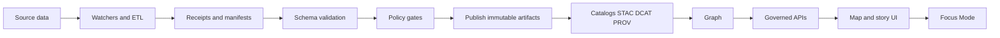

<!-- [KFM_META_BLOCK_V2]
doc_id: kfm://doc/ee2281f3-ccce-4dbb-bf79-e6bd1caed499
title: Schemas
type: standard
version: v1
status: draft
owners: KFM Maintainers (TODO: set team)
created: 2026-02-24
updated: 2026-02-24
policy_label: public
related:
  - ../../schemas/
  - ../MASTER_GUIDE_v13.md
tags: [kfm, schemas]
notes:
  - This README is intentionally conservative: it documents expected contracts and gates without assuming repo wiring beyond what is standard in KFM v13 docs.
  - TODO: Confirm whether canonical machine-readable schemas live in /schemas/ (repo root) or in docs/schemas/ for this repo, then update links + CI paths.
[/KFM_META_BLOCK_V2] -->

# Schemas

Schema contracts and documentation that keep KFM **contract-first**, **evidence-first**, and **fail-closed**.


> **NOTE**
> The v13 repository layout expects machine-readable schemas under **`/schemas/`** at the repo root (with subfolders like `stac/`, `dcat/`, `prov/`, `storynodes/`, `ui/`, `telemetry/`).  
> This `docs/schemas/` folder is the human-facing documentation and “how to use them” index. If your repo stores schemas elsewhere, update the links and CI commands below accordingly.

---

## Navigation

- [Why schemas exist in KFM](#why-schemas-exist-in-kfm)
- [Where this fits in the repo](#where-this-fits-in-the-repo)
- [Directory contents](#directory-contents)
- [Schema registry](#schema-registry)
- [Conventions](#conventions)
- [Validation and gates](#validation-and-gates)
- [Definition of done for schema changes](#definition-of-done-for-schema-changes)
- [Troubleshooting](#troubleshooting)
- [References](#references)

---

## Why schemas exist in KFM

KFM’s “trust membrane” depends on contracts:

- **Catalog contracts:** STAC / DCAT / PROV must validate before anything is promoted or shown as trustworthy.
- **Run evidence contracts:** Every ingestion/transform run emits typed artifacts (for example a `run_receipt` and `run_manifest`) that are schema-validated and used as inputs to policy gates.
- **Automation contracts:** Watchers and other automations are enabled only through typed, signed allow-lists.

In practice, KFM’s governance loop is: **watch → hash → emit receipts → validate + attest → fail-closed gates → publish immutable artifacts → surface provenance in UI**.

<a href="#schemas">Back to top ↑</a>

---

## Where this fits in the repo

This directory is documentation for the schema boundary that sits *between* pipelines and everything downstream:



<a href="#schemas">Back to top ↑</a>

---

## Directory contents

### Purpose

Provide a clear, governed “front door” for anyone who needs to **read**, **author**, or **validate** KFM schemas.

### Expected layout

`docs/schemas/` is documentation-first. It may also host fixture samples for CI.

```text
docs/
└─ schemas/                                      # Human-facing schema docs (not the canonical machine schemas)
   ├─ README.md                                  # How to navigate schema docs + where the real schemas live
   │
   ├─ fixtures/                                  # Optional: example payloads used for documentation/tests
   │  ├─ valid/                                  # Valid examples (should pass validation)
   │  └─ invalid/                                # Invalid examples (should fail; illustrates common mistakes)
   │
   └─ registry/                                  # Optional: human index/mapping helpers
      ├─ index.md                                # Schema catalog (links to families/versions + brief notes)
      └─ mappings.csv                            # Crosswalks/mappings (e.g., old → new fields, schema family map)
```

The canonical machine-readable schema files are expected at repo root under `schemas/`:

```text
schemas/
├── run_receipt.v1.schema.json
├── run_manifest.v1.schema.json
├── watcher.v1.schema.json
├── stac/
├── dcat/
├── prov/
├── storynodes/
├── ui/
└── telemetry/
```

### Acceptable inputs

- Markdown docs explaining schema intent, invariants, and “what breaks if you change this”.
- Schema registry tables or indexes that point to the canonical machine-readable schema files.
- Fixture examples (`valid/` + `invalid/`) used for CI validation **if your repo keeps fixtures under docs**.

### Exclusions

- No raw datasets or derived data products.
- No secrets, tokens, keys, or signature material.
- No “ad hoc” schema variants embedded in pipeline code without going through this contract boundary.

> **TIP**
> If you need a schema “just for one pipeline”, that’s a signal you probably need either:
> 1) a new schema version with backwards compatibility, or  
> 2) a pipeline-local intermediate type that never crosses the promotion boundary.

<a href="#schemas">Back to top ↑</a>

---

## Schema registry

> **NOTE**
> The concrete schema file paths below are written using the v13 default (`/schemas/...`).  
> If your repo stores schemas under `docs/schemas/`, change the link targets (not the contract names).

| Contract area | Examples | Canonical location | Primary consumers | Primary gate |
|---|---|---|---|---|
| Run evidence | `run_receipt.v1`, `run_manifest.v1` | `../../schemas/` | Pipelines, CI, auditors, UI evidence surfaces | Schema compile + Conftest/OPA policy |
| Automation allow-list | `watcher.v1` registry entry | `../../schemas/` | Watcher runners, CI, Focus Mode allow/deny | Schema + signature/spec_hash verification |
| STAC | STAC 1.1.0 core + extensions (Raster/Projection/Datacube as applicable) | `../../schemas/stac/` | Catalog builders, validators, UI | Schema + STAC profile checks |
| DCAT | DCAT exports (JSON-LD) | `../../schemas/dcat/` | Dataset catalog builders, validators | Schema + policy checks (rights, sensitivity) |
| PROV | PROV bundles + receipt linkage | `../../schemas/prov/` | Provenance pipeline, graph ingest, UI timeline | Schema + policy checks |
| Story nodes | Narrative structures + citation payloads | `../../schemas/storynodes/` | Story compiler, UI, Focus Mode | Schema + citation checks |
| UI payloads | Evidence surface API payload contracts | `../../schemas/ui/` | Web frontend, API boundary | Contract tests |
| Telemetry | Structural event logs (no PII) | `../../schemas/telemetry/` | Observability, ops acceptance gate | Schema + redaction rules |

<a href="#schemas">Back to top ↑</a>

---

## Conventions

### Schema dialect

- Prefer **JSON Schema draft 2020-12** (explicit `$schema`).
- Every schema should have a stable `$id` and a human-readable `title`.

### Naming and versioning

Use **explicit major versions in filenames**:

- `name.v1.schema.json`
- `name.v2.schema.json` (breaking changes only)

Avoid “silent” breaking changes in-place.

### Design rules

- `additionalProperties: false` on externally consumed schemas.
- Prefer `required` + narrow types over permissive schemas.
- Put “policy-relevant” fields in the contract (e.g., `spec_hash`, `artifact_digest`, `signature_ref`) so gates can reason deterministically.

### STAC metadata locking

When generating STAC items/collections for published assets:

- Use **STAC 1.1.0** core plus extensions as applicable (for example Raster, Projection, Datacube).
- Set `stac_version` explicitly.
- When computing `spec_hash` or other integrity hashes, hash only **canonicalized JSON** (stable key order, normalized nulls, etc.).

<details>
<summary><strong>Minimal field expectations</strong></summary>

- A minimal `prov:run_receipt` shape should require at least: `@type`, `spec_hash`, `fetched_at`, `accessURL`, `artifact_digest`.
- A watcher registry entry should require fields such as: `watcher_id`, `endpoint`, `poll.interval_seconds`, `schema_url`, `spec_hash`, `signature_ref`.

(See canonical schema files for the exact definitions.)

</details>

<a href="#schemas">Back to top ↑</a>

---

## Validation and gates

Schemas are only useful if they are enforced.

### Local checks

Run schema + policy checks locally before opening a PR.

Example Conftest invocation (adjust file paths to match your repo layout):

```bash
conftest test path/to/run_receipt.json -p policy/opa
```

### CI requirements

#### Minimum policy checks that should exist

At minimum, policy gates should be able to reject:

- Missing `artifact_digest`
- Insecure `accessURL` values (for example `http://...`)
- Missing rights fields (license and CARE-style constraints) when required by policy
- Missing or unapproved `provider` identifiers (if your policy pack uses an allow-list)

Recommended gate ordering:

1. **Schema compilation / validation** (fail fast on malformed JSON Schema).
2. **Schema validation of fixtures** (`valid/*` must pass, `invalid/*` must fail).
3. **Policy gate** (deny-by-default; only allow promotion if all required evidence is present).
4. **Signature verification** where applicable (watchers registry, signed receipts/attestations).
5. **Catalog linkage checks** (DCAT/STAC must link to receipts/PROV where required).

> **WARNING**
> If a schema or policy gate is ambiguous, choose the safer behavior:
> **deny promotion** and require an explicit review/exception.

<a href="#schemas">Back to top ↑</a>

---

## Definition of done for schema changes

When you change a schema, it is not “done” until it is enforced and safe to consume.

- [ ] Update the schema file (new major version if breaking).
- [ ] Add/refresh **fixtures**: at least one valid + one invalid example.
- [ ] Ensure **CI fails** on invalid examples and **passes** on valid examples.
- [ ] Update any **OPA/Rego** policies that rely on the changed fields.
- [ ] Update downstream contracts (API payloads, UI components like ReceiptViewer) if they embed schema expectations.
- [ ] Document the invariant you are enforcing and why it matters (one paragraph minimum).

<a href="#schemas">Back to top ↑</a>

---

## Troubleshooting

### “Schema validates locally but fails in CI”

Common causes:

- Different JSON Schema engine/version in CI (pin versions to avoid drift).
- CI runs additional policy gates (Conftest/OPA) that your local run skipped.
- Fixtures in CI include additional samples you didn’t validate locally.

### “Receipt renders as untrusted in the UI”

Expected reasons:

- Schema validation failed.
- Signature verification failed or is missing.
- Policy gate marked the artifact as unsafe or incomplete.

<a href="#schemas">Back to top ↑</a>

---

## References

- Repo structure expectations and directory roles: `docs/MASTER_GUIDE_v13.md` (or equivalent in your repo).
- Canonical schema files: `../../schemas/`
- Policy-as-code gate pack (expected): `policy/opa/` (verify in repo)
- Evidence surface component (expected): `web/src/components/ReceiptViewer/` (verify in repo)
