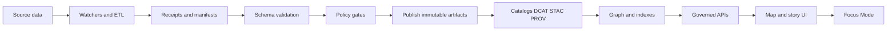

<!-- [KFM_META_BLOCK_V2]
doc_id: kfm://doc/ee2281f3-ccce-4dbb-bf79-e6bd1caed499
title: Schemas
type: standard
version: v1.1
status: draft
owners: KFM Maintainers (TODO: set team)
created: 2026-02-24
updated: 2026-03-05
policy_label: public
related:
  - ../../schemas/
  - ../MASTER_GUIDE_v13.md
tags: [kfm, schemas]
notes:
  - This README is intentionally conservative and repo-agnostic: it documents contract surfaces, conventions, and fail-closed gates without asserting which directories/files exist in your local repo.
  - All example paths and filenames are PROPOSED templates until verified against the actual repository tree.
  - TODO: Confirm the canonical machine-readable schema location for this repo (commonly /schemas/ at repo root) and update links + CI paths accordingly.
  - TODO: Confirm whether dataset-registry entry schemas exist in this repo (e.g., under data/registry/schemas/) and add cross-links if present.
[/KFM_META_BLOCK_V2] -->

<a id="schemas"></a>

# Schemas

Schema contracts and documentation that keep KFM **contract-first**, **evidence-first**, and **fail-closed**.

> **IMPACT**
> **Status:** draft · **Owners:** KFM Maintainers (TODO) · **Policy:** public  
> **This directory:** human documentation and examples for schema contracts  
> **Canonical schemas:** typically `../../schemas/` (verify for this repo)
>
> 
> 
> 
> 
>  <!-- TODO: replace with real workflow badge URL -->
> 
>
> **Quick links:** [Why](#why-schemas-exist-in-kfm) · [Where it fits](#where-this-fits-in-the-repo) ·
> [What belongs here](#what-belongs-in-docsschemas) · [Conventions](#conventions) ·
> [Validation and gates](#validation-and-gates) · [Definition of done](#definition-of-done-for-schema-changes)

---

## Evidence status

This README is guidance, not a repo inventory.

- **CONFIRMED:** KFM governance expects **fail-closed** behavior at contract boundaries (schema validation + policy gates).  
- **UNKNOWN:** Which of the example directories/files exist in *this* repository.  
- **PROPOSED:** All directory trees, filenames, and CI commands below are templates you should adapt.

**Smallest verification steps to make UNKNOWN → CONFIRMED**
1. Run `git ls-tree -r HEAD` (or browse the repo tree) and confirm the real locations of:
   - canonical machine-readable schemas (often `/schemas/`)
   - docs (often `/docs/`)
   - policy packs (often `/policy/` or `/policy/opa/`)
   - tests/fixtures (often `/tests/`)
2. Update links in this file to match confirmed paths.
3. Ensure CI gates validate the confirmed canonical locations (not the example ones).

<a href="#schemas">Back to top ↑</a>

---

## Navigation

- [Why schemas exist in KFM](#why-schemas-exist-in-kfm)
- [Where this fits in the repo](#where-this-fits-in-the-repo)
- [What belongs in docs/schemas](#what-belongs-in-docsschemas)
- [Directory layout](#directory-layout)
- [Schema registry](#schema-registry)
- [Conventions](#conventions)
- [Validation and gates](#validation-and-gates)
- [Definition of done for schema changes](#definition-of-done-for-schema-changes)
- [Troubleshooting](#troubleshooting)
- [References](#references)

---

## Why schemas exist in KFM

KFM’s “trust membrane” depends on **typed contracts** that are validated and gated.

Schemas exist to make these guarantees **deterministic**:

- **Catalog contracts:** dataset catalogs and lineage bundles validate under KFM profiles before anything is promoted into runtime surfaces.
- **Run evidence contracts:** each pipeline run emits typed artifacts (for example `run_receipt` and `run_manifest`) that are schema-validated and policy-gated.
- **Automation allow-lists:** watchers and other automations are enabled only through typed, reviewed allow-lists.
- **UI and API contracts:** governed APIs and UI evidence surfaces are contract-tested so downstream clients don’t “guess.”

**Governance loop (conceptual):**  
**watch → hash → emit receipts → validate + attest → fail-closed gates → publish immutable artifacts → surface provenance**

<a href="#schemas">Back to top ↑</a>

---

## Where this fits in the repo

Schemas sit *between* pipelines and everything downstream.


```mermaid
flowchart LR
  S[Source data] --> W[Watchers and ETL]
  W --> R[Receipts and manifests]
  R --> V[Schema validation]
  V --> G[Policy gates]
  G --> P[Publish immutable artifacts]
  P --> C[Catalogs DCAT STAC PROV]
  C --> N[Graph and indexes]
  N --> A[Governed APIs]
  A --> U[Map and story UI]
  U --> F[Focus Mode]
```

<a href="#schemas">Back to top ↑</a>

---

## What belongs in docs/schemas

### Acceptable inputs

This directory is **documentation-first**. Typical contents:

- Human-facing READMEs describing contract intent, invariants, and versioning rules
- Examples and fixtures (valid + invalid) used for learning and CI gates
- How-to playbooks for authoring, referencing, canonicalization, and migrations
- ADRs about schema boundary decisions
- Diagrams that explain contract boundaries and lifecycle

### Exclusions

Do **not** put these in `docs/schemas/`:

- Canonical machine-readable schemas used by pipelines/CI (put those in the repo’s **canonical schema location**, often `/schemas/`)
- Generated artifacts (build outputs, compiled bundles)
- Large datasets or “real” production exports (put in data zones: raw/work/processed or published)
- Secrets, keys, tokens, credentials (never commit)

<a href="#schemas">Back to top ↑</a>

---

## Directory layout

> **IMPORTANT**
> The trees below are **PROPOSED templates**. Update them to match your repo.

### Recommended repository map for schema-adjacent paths

<details>
<summary>Show a schema-adjacent repo map template</summary>

```text
repo-root/
├─ data/                                        # Domain data zones (raw/work/processed) and mappings
├─ docs/                                        # Human docs, standards, ADRs, governance
│  └─ schemas/                                  # ✅ THIS FOLDER: docs + fixtures + playbooks
├─ schemas/                                     # ✅ Typical canonical machine-readable schema location (verify)
├─ policy/                                      # Policy-as-code (OPA/Rego or equivalent) (verify)
├─ tools/                                       # Validators, spec-hash tools, link-checkers (verify)
├─ tests/                                       # Contract tests + fixtures (schema/policy/UI/API) (verify)
└─ .github/workflows/                            # CI gates (schema, policy, link-check) (verify)
```

</details>

<a href="#schemas">Back to top ↑</a>

---

### Canonical schemas directory

> **RULE (PROPOSED)**
> If a schema is enforced by CI or consumed downstream, it belongs in the **canonical schema location** for this repo.

#### Minimal structure template

```text
schemas/
├─ run_receipt.v1.schema.json
├─ run_manifest.v1.schema.json
├─ watcher_allowlist.v1.schema.json
├─ catalogs/
│  ├─ stac/
│  ├─ dcat/
│  └─ prov/
├─ storynodes/
├─ ui/
└─ telemetry/
```

#### Expanded structure template

<details>
<summary>Show an expanded canonical schemas layout template</summary>

```text
schemas/
├─ README.md
├─ _shared/
│  ├─ digest.schema.json
│  ├─ evidence_ref.schema.json
│  ├─ policy_label.schema.json
│  └─ uri.schema.json
│
├─ run_receipt.v1.schema.json
├─ run_manifest.v1.schema.json
├─ watcher_allowlist.v1.schema.json
├─ promotion_manifest.v1.schema.json
│
├─ catalogs/
│  ├─ stac/
│  │  ├─ README.md
│  │  ├─ profile/
│  │  ├─ extensions/
│  │  ├─ vendored/
│  │  └─ fixtures/
│  ├─ dcat/
│  │  ├─ README.md
│  │  ├─ profile/
│  │  ├─ contexts/
│  │  └─ fixtures/
│  └─ prov/
│     ├─ README.md
│     ├─ profile/
│     ├─ contexts/
│     └─ fixtures/
│
├─ storynodes/
│  ├─ README.md
│  ├─ story_node.vX.schema.json
│  └─ fixtures/
│
├─ ui/
│  ├─ README.md
│  ├─ evidence_bundle.v1.schema.json
│  └─ fixtures/
│
└─ telemetry/
   ├─ README.md
   ├─ event.v1.schema.json
   └─ fixtures/
```

</details>

> **TIP (PROPOSED)**
> Keep vendored/upstream schemas (WZDx, GTFS-RT, SensorThings, etc.) close to the tool/pipeline that uses them:
> `tools/<tool>/schemas/` or `src/pipelines/<pipeline>/schemas/`.

<a href="#schemas">Back to top ↑</a>

---

### Docs and fixtures directory

`docs/schemas/` is the **human-facing index**: explanations, invariants, and examples.

<details>
<summary>Show a docs/schemas layout template</summary>

```text
docs/
└─ schemas/
   ├─ README.md
   ├─ registry/
   │  ├─ index.md
   │  ├─ mappings.csv
   │  └─ dependency_graph.md
   │
   ├─ families/
   │  ├─ run_evidence/
   │  ├─ automation/
   │  ├─ catalogs/
   │  ├─ storynodes/
   │  ├─ ui/
   │  └─ telemetry/
   │
   ├─ fixtures/
   │  ├─ valid/
   │  └─ invalid/
   │
   ├─ howto/
   │  ├─ authoring.md
   │  ├─ references.md
   │  ├─ canonicalization.md
   │  ├─ validation.md
   │  └─ migrations.md
   │
   ├─ adr/
   │  ├─ ADR-0001-schema-versioning.md
   │  └─ ADR-0002-evidence-ref-schemes.md
   │
   ├─ templates/
   │  ├─ TEMPLATE__SCHEMA_JSONSCHEMA_2020_12.json
   │  ├─ TEMPLATE__FIXTURE_VALID.json
   │  └─ TEMPLATE__FIXTURE_INVALID.json
   │
   └─ diagrams/
      ├─ schema_boundary.mmd
      └─ schema_lifecycle.mmd
```

</details>

<a href="#schemas">Back to top ↑</a>

---

### Monorepo variant for contracts

Some repos colocate OpenAPI specs, registry-entry schemas, or policy packs in additional directories. If so:

- Cross-link those locations here.
- Ensure CI validates **all** canonical contract locations.

```text
repo-root/
├─ contracts/                                   # OpenAPI, GraphQL, or other API contracts (verify)
├─ data/registry/                               # Dataset registry entries (verify)
│  └─ schemas/                                  # Registry-entry schema contracts (verify)
├─ policy/                                      # Policy packs (OPA/Rego or equivalent) (verify)
└─ schemas/                                     # Cross-cutting platform schemas (verify)
```

> **WARNING**
> Do not claim specific directories exist until verified in the repo tree.

<a href="#schemas">Back to top ↑</a>

---

## Schema registry

> **NOTE**
> The paths below are **examples**. Update them to match the confirmed canonical locations.

Blank line before table for GitHub Markdown rendering.

| Contract area | Canonical contracts (examples) | Canonical location (example) | Primary consumers | Primary gate |
|---|---|---|---|---|
| Run evidence | `run_receipt.v1`, `run_manifest.v1` | `../../schemas/` | Pipelines, CI, auditors, UI evidence surfaces | Schema validation + policy pack |
| Promotion manifest | `promotion_manifest.v1` | `../../schemas/` | Release tooling, auditors, reproducibility | Schema validation + link-check |
| Automation allow-list | `watcher_allowlist.v1` | `../../schemas/` | Watcher runners, CI, Focus allow/deny | Schema validation + signature/spec_hash policy |
| STAC | STAC core + KFM profile | `../../schemas/catalogs/stac/` | Catalog builders, validators, UI | STAC validation + profile checks |
| DCAT | DCAT JSON-LD + KFM profile | `../../schemas/catalogs/dcat/` | Catalog builders, validators | DCAT validation + rights/policy checks |
| PROV | PROV bundle + receipt linkage | `../../schemas/catalogs/prov/` | Lineage pipeline, graph ingest, UI | PROV validation + policy checks |
| Story nodes | Story node schema (versioned) | `../../schemas/storynodes/` | Story compiler, UI, Focus Mode | Schema validation + citation resolution |
| UI payloads | Evidence surface payloads | `../../schemas/ui/` | Web UI, API boundary | Contract tests |
| Telemetry | Event logs with no PII | `../../schemas/telemetry/` | Observability, ops | Schema validation + redaction rules |

<a href="#schemas">Back to top ↑</a>

---

## Conventions

### Schema dialect

**PROPOSED defaults:**
- Prefer **JSON Schema draft 2020-12** (explicit `$schema`).
- Every schema has a stable `$id` and a human-readable `title`.
- Use `$defs` and shared definitions to avoid drift.

### Naming and versioning

**PROPOSED rule:** explicit major versions in filenames.

- `name.v1.schema.json`
- `name.v2.schema.json` (breaking change only)

Avoid “silent” breaking changes in place.

### Design rules

**PROPOSED rules for externally consumed contracts:**
- Use `additionalProperties: false` where consumers must not “guess.”
- Prefer `required` + narrow types over permissive schemas.
- Put policy-relevant fields in the contract (examples: `spec_hash`, `artifact_digest`, `signature_ref`) so gates can reason deterministically.

<a href="#schemas">Back to top ↑</a>

---

## Validation and gates

Schemas are only useful if they’re enforced.

### Promotion gates

**PROPOSED minimum fail-closed gates** when a dataset version moves into runtime surfaces:

- **Identity and versioning:** deterministic dataset/version IDs and a frozen processing spec hash.
- **Artifacts:** processed artifacts exist; each has a digest; predictable paths; media types recorded.
- **Catalogs:** DCAT/STAC/PROV validate under the repo’s KFM profiles.
- **Cross-links:** hrefs resolve; EvidenceRefs resolve; catalogs link back to run evidence.
- **Policy:** policy label assigned; obligations applied; default-deny tests pass.
- **QA:** validation reports exist; failures quarantined.
- **Audit:** a run receipt is emitted and retained as evidence.

### Local checks

Pick a validator toolchain that matches your repo. Examples:

**Option A (Rego/OPA with Conftest)**
```bash
# PROPOSED example: validate a JSON instance against policy gates
conftest test path/to/instance.json -p policy/
```

**Option B (Node AJV)**
```bash
# PROPOSED example: validate a JSON instance against a JSON Schema
npx ajv-cli validate -s schemas/run_receipt.v1.schema.json -d path/to/receipt.json
```

**Option C (Python jsonschema)**
```bash
# PROPOSED example: validate using Python's jsonschema (adjust to your installed tooling)
python -m jsonschema -i path/to/receipt.json schemas/run_receipt.v1.schema.json
```

### CI expectations

**PROPOSED gate ordering:**
1. **Schema lint/compile** (fail fast on malformed schemas).
2. **Fixture validation**
   - `fixtures/valid/**` must pass
   - `fixtures/invalid/**` must fail
3. **Policy gates** (deny-by-default; allow only if required evidence exists).
4. **Signature verification** where applicable (allow-lists, attestations).
5. **Linkage checks** (catalogs must cross-link to evidence; hrefs must resolve).

> **WARNING**
> If a schema or policy gate is ambiguous: **deny promotion** and require an explicit review or a documented exception mechanism.

<a href="#schemas">Back to top ↑</a>

---

## Definition of done for schema changes

When you change a schema, it is not “done” until it is enforced and safe to consume.

- [ ] Update the schema file (new major version if breaking).
- [ ] Add/refresh fixtures: at least one valid + one invalid example.
- [ ] Ensure CI fails on invalid examples and passes on valid examples.
- [ ] Update policy logic that relies on changed fields (OPA/Rego or equivalent).
- [ ] Update downstream contracts (API payloads, UI evidence renderers) if they embed schema expectations.
- [ ] Document the invariant you are enforcing and why it matters (one paragraph minimum).
- [ ] Add a rollback note: how to keep older consumers working during migration.

<a href="#schemas">Back to top ↑</a>

---

## Troubleshooting

### Schema validates locally but fails in CI

Common causes:

- Different JSON Schema engine/version in CI (pin versions to avoid drift).
- CI runs additional policy gates that your local run skipped.
- CI validates more fixtures than you validated locally.

### Evidence renders as untrusted in the UI

Typical reasons:

- Schema validation failed.
- Signature verification failed or is missing.
- Policy gate marked the artifact as unsafe or incomplete.

<a href="#schemas">Back to top ↑</a>

---

## References

**Repo-local references (verify paths in this repo):**
- Master guide for repo structure and directory roles: `docs/MASTER_GUIDE_v13.md` (or equivalent)
- Canonical schema directory: `schemas/` (or the confirmed canonical location)
- Policy pack directory: `policy/` (or the confirmed policy location)
- Tests and fixtures: `tests/` (or the confirmed tests location)

**External standards (informational):**
- JSON Schema (draft 2020-12)
- STAC / DCAT / PROV specifications (as adopted by your KFM profiles)
