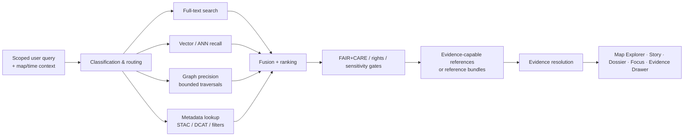

<!-- [KFM_META_BLOCK_V2]
doc_id: kfm://doc/<NEEDS_VERIFICATION_UUID>
title: Kansas Frontier Matrix — Search System Overview
type: standard
version: v1
status: review
owners: @bartytime4life
created: <NEEDS VERIFICATION: YYYY-MM-DD>
updated: 2026-04-06
policy_label: public
related: [docs/README.md, docs/search/semantic-search.md, docs/search/query-language.md, docs/search/index-architecture.md, docs/search/faircare-search-rules.md, docs/search/drift/README.md, docs/search/drift/stac/README.md, docs/search/drift/graph-queries/README.md, docs/search/drift/examples/README.md, docs/search/drift/hyde/README.md, docs/search/drift/embeddings/README.md]
tags: [kfm, search, drift, focus-mode, faircare]
notes: [Grounded in the checked-in public-main docs/search tree plus the preserved 2025-12-13 search baseline and March–April 2026 KFM doctrine; baseline-only DRIFT companions workflows/synthesis/provenance are not visible on current public main; search-specific schemas, tests, workflow wiring, and deployed runtime behavior remain NEEDS VERIFICATION.]
[/KFM_META_BLOCK_V2] -->

# 🔍 Kansas Frontier Matrix — Search System Overview

Governed search and discovery for release-scoped documents, datasets, metadata, graph context, spatial layers, and Focus Mode retrieval.

> **Status:** active *(current public subtree is visible; runtime wiring still requires review)*  
> **Owners:** `@bartytime4life`  
> **Path:** `docs/search/README.md`  
>        
> **Quick jumps:** [Scope](#scope) · [Repo fit](#repo-fit) · [Accepted inputs](#accepted-inputs) · [Exclusions](#exclusions) · [Directory tree](#directory-tree) · [Quickstart](#quickstart) · [Usage](#usage) · [Diagram](#diagram) · [Tables](#tables) · [Review & definition of done](#review--definition-of-done) · [FAQ](#faq) · [Appendix](#appendix)

> [!IMPORTANT]
> Search in KFM is a **derived, rebuildable discovery layer**. It improves recall, routing, ranking, and navigation, but it does **not** become sovereign truth. Consequential claims still resolve through governed APIs, evidence resolution, policy checks, release state, and visible correction lineage.

> [!NOTE]
> This revision is grounded in three layers at once: the **checked-in public `main` `docs/search/` tree**, the **preserved 2025-12-13 search baseline**, and **March–April 2026 KFM doctrine**. That is stronger than the earlier PDF-only posture, but it still does **not** prove hidden GitHub settings, non-public branches, workflow enforcement, schemas, tests, or deployed runtime behavior.

> [!NOTE]
> **Truth posture in this file:** **CONFIRMED** = grounded in the current public repo tree or the attached doctrinal corpus; **INFERRED** = conservative structural completion; **PROPOSED** = recommended direction not yet proven in implementation; **UNKNOWN** / **NEEDS VERIFICATION** = not directly reverified on the exact working branch or runtime.

> [!WARNING]
> Do not read this file as proof of deployed engine mix, merge-enforced CI, hidden workflow YAMLs, or runtime telemetry wiring. Those areas remain explicitly **NEEDS VERIFICATION** or **UNKNOWN** unless surfaced in the exact branch or environment under review.

## Scope

`docs/search/README.md` is the entrypoint for KFM’s **Search & Discovery System**.

Its job is to define how KFM discovers release-scoped material while preserving the project’s governing rules:

- search stays **downstream** of authoritative truth
- search remains **map-first** and **time-aware**
- search participates in **FAIR+CARE**, rights, sensitivity, and sovereignty controls
- search supports **Map Explorer**, **Story**, **Dossier**, **Focus Mode**, and the **Evidence Drawer** without bypassing evidence resolution
- search hands off **evidence-capable references** or **reference bundles**, not detached claims
- search remains **inspectable**, **rebuildable**, and **deterministic where required**

In practice, this directory covers unified discovery across:

- historical documents
- datasets and metadata
- Story Nodes
- Focus Mode entities
- STAC catalog assets
- knowledge-graph relationships
- spatial layers and temporal events

KFM search is therefore about **discovery, routing, contextual expansion, and explainable handoff**. It is not the place where truth silently migrates.

[Back to top](#-kansas-frontier-matrix--search-system-overview)

## Repo fit

### Current checked-in fit

| Direction | Path | Role | Status |
|---|---|---|---|
| This file | `docs/search/README.md` | Search-system entrypoint | **CONFIRMED** current public `main` |
| Sibling | [`./semantic-search.md`](./semantic-search.md) | Semantic/vector-oriented search companion | **CONFIRMED** current public `main` |
| Sibling | [`./query-language.md`](./query-language.md) | Query grammar / structured-search companion | **CONFIRMED** current public `main` |
| Sibling | [`./index-architecture.md`](./index-architecture.md) | Index-family and index-design companion | **CONFIRMED** current public `main` |
| Sibling | [`./faircare-search-rules.md`](./faircare-search-rules.md) | Search-policy / FAIR+CARE companion | **CONFIRMED** current public `main` |
| Downstream | [`./drift/README.md`](./drift/README.md) | DRIFT hybrid retrieval architecture | **CONFIRMED** current public `main` |
| Downstream | [`./drift/stac/README.md`](./drift/stac/README.md) | Retrieval-episode STAC / evidence-bundle surface | **CONFIRMED** current public `main` |
| Downstream | [`./drift/graph-queries/README.md`](./drift/graph-queries/README.md) | Bounded Neo4j/Cypher precision layer | **CONFIRMED** current public `main` |
| Downstream | [`./drift/examples/README.md`](./drift/examples/README.md) | Redaction-safe examples and golden fixtures | **CONFIRMED** current public `main` |
| Downstream | [`./drift/hyde/README.md`](./drift/hyde/README.md) | Governed HyDE expansion layer | **CONFIRMED** current public `main` |
| Downstream | [`./drift/embeddings/README.md`](./drift/embeddings/README.md) | Governed embedding layer | **CONFIRMED** current public `main` |
| Upstream | [`../README.md`](../README.md) | Docs root / parent landing page | **CONFIRMED** current public `main` |

### Evidence boundary used in this revision

| Evidence layer | What this README treats as settled |
|---|---|
| **CONFIRMED doctrine** | Search, graph, vector, ranking, and similar retrieval accelerators remain **derived**, subordinate to evidence, policy, release state, and correction discipline. |
| **CONFIRMED current public tree** | The public `docs/search/` subtree exists on `main`, with its root companion docs and the current `drift/` subdirectories visible in the checked-in listing. |
| **CONFIRMED current ownership** | Public `/.github/CODEOWNERS` routes `/docs/` to `@bartytime4life`, which is the strongest public owner signal presently visible. |
| **UNKNOWN / NEEDS VERIFICATION** | Search-specific schemas, fixtures, workflow gates, hidden GitHub settings, non-public branches, engine mix, runtime telemetry, and deployed indexing services. |

<details>
<summary><strong>Baseline-only companions that are not currently visible on public <code>main</code></strong></summary>

The preserved 2025-12-13 search bundle names three additional DRIFT companion paths:

- `docs/search/drift/workflows/README.md`
- `docs/search/drift/synthesis/README.md`
- `docs/search/drift/provenance/README.md`

Treat those as **CONFIRMED baseline lineage**. Treat them as **not currently visible on public `main`** until the exact working branch or another checked-in surface proves otherwise.

</details>

## Accepted inputs

This directory belongs to **governed search inputs and search-system documentation**, including:

| Input family | What belongs here |
|---|---|
| Search doctrine | Search scope, routing rules, explainability posture, derived-layer limits |
| Retrieval architecture | Hybrid search, DRIFT, graph traversal constraints, vector recall, metadata lookup |
| Search governance | FAIR+CARE retrieval rules, sovereignty-aware search behavior, sensitivity controls |
| Search outputs | Result-shape guidance, retrieval-episode packaging, provenance expectations, evidence handoff requirements |
| Validation material | Golden fixtures, leakage checks, determinism checks, ranking/regression notes |
| Search operations | Reindex triggers, freshness expectations, telemetry, provenance emission expectations |
| Surface handoff rules | How search feeds Map Explorer, Story, Dossier, Focus Mode, and the Evidence Drawer |
| Search-adjacent packaging | Search STAC items, evidence manifests, provenance assets, redaction-safe examples |

## Exclusions

This directory should **not** become a dumping ground for broader architecture or speculative product material.

| Does **not** belong here | Goes there instead |
|---|---|
| Canonical truth modeling or lifecycle law as the primary topic | Master doctrine / canonical working manual |
| RAW storage policy, ingestion mechanics, or catalog governance as the primary topic | Ingestion, evidence, and catalog docs |
| Free-form AI product design detached from retrieval and evidence | Focus Mode / AI governance docs |
| Unbounded graph exploration or graph-as-truth language | Rejected; bounded graph retrieval only |
| Direct-client bypass patterns to canonical stores, raw buckets, model runtimes, or search internals | Rejected; governed API boundary only |
| Sensitive-location disclosure, re-identifying joins, or unsafe retrieval examples | Rejected; use redaction-safe fixtures only |
| Runtime certainty not backed by repo evidence | Rejected; mark as **NEEDS VERIFICATION** or **UNKNOWN** |

## Directory tree

### Current public `main` snapshot

```text
docs/search/
├── README.md
├── semantic-search.md
├── query-language.md
├── index-architecture.md
├── faircare-search-rules.md
└── drift/
    ├── README.md
    ├── embeddings/
    │   └── README.md
    ├── examples/
    │   └── README.md
    ├── graph-queries/
    │   └── README.md
    ├── hyde/
    │   └── README.md
    └── stac/
        └── README.md
```

> [!TIP]
> The tree above is the **current public listing**, not a reconstruction from older doctrine. Keep branch-local or private-tree additions separate until they are verified in the exact checkout being merged.

<details>
<summary><strong>Preserved baseline companions not shown in the current public listing</strong></summary>

These paths are part of preserved search-baseline lineage, but they are **not** visible in the current public `docs/search/drift/` listing:

- `docs/search/drift/workflows/README.md`
- `docs/search/drift/synthesis/README.md`
- `docs/search/drift/provenance/README.md`

Do not move them back into the main tree diagram unless the exact working branch proves their presence.

</details>

## Quickstart

Use this README as the maintainer’s fast orientation before changing search behavior, search docs, or search-adjacent contracts.

### Fast inspection path

```bash
# 0) Start from the repo root
git rev-parse --show-toplevel 2>/dev/null || pwd

# 1) Inventory the visible search subtree
find docs/search -maxdepth 2 -type f | sort

# 2) Re-read the core companion docs in the exact branch you are changing
sed -n '1,240p' docs/search/README.md
sed -n '1,240p' docs/search/semantic-search.md
sed -n '1,240p' docs/search/query-language.md
sed -n '1,240p' docs/search/index-architecture.md
sed -n '1,240p' docs/search/faircare-search-rules.md

# 3) Recheck the current DRIFT subtree
find docs/search/drift -maxdepth 2 -type f | sort
```

### Minimal maintainer checklist

```text
[ ] Search path is release-scoped
[ ] FAIR+CARE / rights / sensitivity filters are applied
[ ] Graph traversal is bounded
[ ] Query expansion is explainable and logged where required
[ ] Result objects can hand off to evidence resolution
[ ] Sensitive examples are redaction-safe
[ ] Derived layers remain rebuildable
[ ] Focus-oriented paths still permit ANSWER / ABSTAIN / DENY / ERROR outcomes downstream
[ ] This README matches the exact branch tree, not just public main or baseline memory
```

### Illustrative routing request

```json
{
  "q": "dust bowl migration in southwest kansas",
  "time_range": ["1930-01-01", "1940-12-31"],
  "bbox": [-103.0, 36.9, -98.5, 39.0],
  "include": ["full_text", "metadata", "graph", "vector"],
  "mode": "hybrid",
  "release_scope": "published_only"
}
```

### Illustrative handoff fragment

```json
{
  "results": [
    {
      "kind": "dataset",
      "title": "Example result",
      "policy_label": "public",
      "release_scope": "published_only",
      "evidence_ref": "evidence:...",
      "dataset_version_id": "dataset_version:..."
    }
  ]
}
```

> [!TIP]
> The request and result fragments above are **illustrative shapes**, not verified live contracts. Keep them that way unless route docs, schemas, or tests directly confirm the exact payloads.

[Back to top](#-kansas-frontier-matrix--search-system-overview)

## Usage

### Public discovery

Search supports the visible discovery path for:

- map layer lookup and toggling
- dataset and catalog discovery
- historical document lookup
- Story-linked evidence discovery
- place- and time-constrained exploration
- crosswalks between metadata, graph context, and release-safe assets

Search should preserve **geographic** and **temporal** context instead of flattening everything into text-only relevance.

### DRIFT and hybrid retrieval

Within this subtree, DRIFT is the documented hybrid retrieval pattern that combines global recall with more local precision stages.

At the documentation level, that means:

- full-text search handles lexical discovery
- vector search improves semantic recall
- graph retrieval sharpens local precision through **bounded traversals**
- metadata/STAC/DCAT lookup preserves catalog-aware reproducibility
- routing and rank fusion stay **explainable**, **policy-shaped**, and **replayable where required**

### Focus Mode retrieval

Search can enrich Focus Mode, but only as a **retrieval stage** inside a governed evidence workflow.

The safe pattern is:

1. classify and bound the request
2. route across search components
3. gather ranked candidates
4. keep only policy-allowed, release-scoped references
5. resolve support objects through evidence handling
6. synthesize only after evidence resolution and citation validation
7. preserve downstream finite outcomes such as **ANSWER**, **ABSTAIN**, **DENY**, or **ERROR**

Search should therefore help Focus Mode find the right evidence faster, not quietly turn retrieval outputs into truth.

### Maintenance and reindexing

The preserved baseline names these reindex triggers:

- dataset updates
- Story Node updates
- graph migrations
- embedding/model upgrades *(governed)*
- release promotions *(staging → production in baseline language)*

The same baseline distinguishes:

- **full reindex**: monthly or upon breaking change
- **partial reindex**: continuous / event-driven

Treat those as **CONFIRMED baseline guidance**. Treat current scheduling, workflow wiring, and telemetry enforcement as **NEEDS VERIFICATION** until they are rechecked in the working branch or runtime.

### Steward and maintainer review

Search docs, retrieval fixtures, and retrieval-episode records should support review of:

- bounded traversal behavior
- leakage and redaction safety
- determinism where promised
- provenance emission for retrieval episodes
- regression behavior when ranking, routing, templates, or redaction rules change
- whether evidence still stays one hop from the user-facing claim surface

## Diagram



### Reading the diagram

The architectural move that matters most is the handoff from **ranked retrieval** to **evidence-capable references**, and then from those references into **evidence resolution**. Search does not end in a claim surface that is already treated as authoritative. That handoff preserves the trust membrane.

[Back to top](#-kansas-frontier-matrix--search-system-overview)

## Tables

### Search component matrix

| Component | Primary job | Typical value | Hard boundary |
|---|---|---|---|
| Full-text search | Lexical discovery, faceting, ranked document lookup | Fast recall across documents and metadata | Not authoritative truth |
| Semantic vector search | Similarity recall / semantic neighborhood | Natural-language discovery and retrieval grounding | Derived accelerator, never sovereign |
| Knowledge graph search | Contextual expansion, relationship traversal, multi-hop precision | Connects entities, datasets, provenance, and story context | Traversals must be bounded and policy-gated |
| Metadata / STAC / DCAT search | Dataset type, bbox, time range, catalog-property lookup | Strong reproducibility and catalog-aware discovery | Does not replace evidence resolution |
| Hybrid routing + fusion | Combines retrieval modes by query type and context | Better recall/precision balance than one-engine forcing | Must stay explainable |
| DRIFT integration | Global→local hybrid retrieval with governed expansion | Strong for complex discovery and Focus-oriented retrieval | Must preserve provenance-first, CARE-aware behavior |

### Surface handoff matrix

| Surface | Search responsibility | What must remain visible |
|---|---|---|
| Map Explorer | Layer lookup, feature discovery, time-aware search | Layer status, evidence opener, release-safe results |
| Story surfaces | Narrative support and citation-linked lookup | Source linkage, no prose-only detached truth |
| Dossier | Object-centric discovery and contextual drill-through | Release basis, rights, provenance, correction path |
| Focus Mode | Retrieval support for bounded Q&A | Citations, narrowing, abstention path, visible scope |
| Evidence Drawer | Open from search-linked claims or features | Version, rights, provenance, redactions, safe previews |
| Steward / review paths | Fixture, provenance, and policy inspection | What changed, what was filtered, why it is safe |

### Baseline service objectives

> [!NOTE]
> The targets below are **CONFIRMED in the preserved 2025-12-13 baseline**. Their **current live values and enforcement paths** remain **NEEDS VERIFICATION**.

| Metric | Baseline target | Current posture |
|---|---|---|
| Precision@10 | ≥ 0.88 | **CONFIRMED** baseline target; live tuning **NEEDS VERIFICATION** |
| Recall@50 | ≥ 0.92 | **CONFIRMED** baseline target; live tuning **NEEDS VERIFICATION** |
| Latency (p95) | < 450 ms | **CONFIRMED** baseline target; runtime enforcement **NEEDS VERIFICATION** |
| Ethical compliance | 100% | **CONFIRMED** baseline target; current gate implementation **NEEDS VERIFICATION** |
| Index freshness | < 10 minutes | **CONFIRMED** baseline target; live scheduler / telemetry path **NEEDS VERIFICATION** |

### Verification posture matrix

| Statement | Status |
|---|---|
| Search is a derived, rebuildable discovery layer | **CONFIRMED** |
| Search may combine full-text, vector, graph, and metadata retrieval | **CONFIRMED** |
| Current public `docs/search/` visibly contains `README.md`, `semantic-search.md`, `query-language.md`, `index-architecture.md`, `faircare-search-rules.md`, and `drift/` | **CONFIRMED** |
| Current public `docs/search/drift/` visibly contains `README.md`, `embeddings/`, `examples/`, `graph-queries/`, `hyde/`, and `stac/` | **CONFIRMED** |
| Preserved-baseline companions `workflows/`, `synthesis/`, and `provenance/` are **not** visible in the current public `docs/search/drift/` listing | **CONFIRMED** current public snapshot |
| Current public `CODEOWNERS` coverage for `/docs/` resolves to `@bartytime4life` | **CONFIRMED** |
| Exact deployed engine mix and runtime wiring | **UNKNOWN** |
| Current search-specific merge-blocking workflow, schema, fixture, and telemetry enforcement | **NEEDS VERIFICATION** |

## Review & definition of done

This README is ready to ship when the search subtree is both readable and governable.

### Definition of done

- [ ] The file states plainly that search is **derived**, not sovereign
- [ ] Repo fit matches the exact branch tree being merged
- [ ] Current public `docs/search/` and `docs/search/drift/` inventory is reflected accurately, or the README was updated in the same change
- [ ] Baseline-only companions are not described as live unless branch evidence proves them
- [ ] Inputs and exclusions are explicit
- [ ] The hybrid pipeline is diagrammed
- [ ] FAIR+CARE / sovereignty / sensitivity constraints are documented
- [ ] Focus Mode handoff is evidence-bounded, not chatbot-shaped
- [ ] Runtime, workflow, schema, and SLO uncertainty remains visible where direct proof is absent
- [ ] Long reference material is tucked into appendices or details blocks

### Review gates

| Gate | Review question |
|---|---|
| Trust gate | Could a reader mistake search for canonical truth after reading this file? |
| Boundary gate | Does this README imply any direct bypass of governed APIs, evidence handling, or policy enforcement? |
| Surface gate | Does the file connect search to Map, Story, Dossier, Focus, and Evidence instead of treating search as a detached subsystem? |
| Drift gate | Does the doc confuse preserved baseline topology with current public or branch-local reality? |
| Safety gate | Are graph expansion, HyDE, embeddings, examples, and retrieval episodes described with explicit limits? |
| Evidence gate | Are **CONFIRMED**, **NEEDS VERIFICATION**, and **UNKNOWN** areas visible enough for a reviewer to challenge? |

[Back to top](#-kansas-frontier-matrix--search-system-overview)

## FAQ

### Is search the source of truth?

No. Search is for discovery, routing, and contextual recall. Canonical truth stays in stronger layers, and consequential claims still need governed evidence handling.

### Does Focus Mode answer directly from search results?

Not safely. Search can supply candidates and hints, but Focus Mode remains a governed evidence workflow with citation verification, scope control, and abstention behavior.

### Is DRIFT required for every query?

This subtree treats DRIFT as the documented hybrid retrieval architecture for search work in this area. Exact routing can still vary by deployment, but the governing rule is the same: retrieval modes remain policy-shaped, explainable, and subordinate to evidence resolution.

### Can graph retrieval expand without limits?

No. Bounded traversals are a non-negotiable rule for the documented DRIFT graph layer.

### Are embeddings allowed to become the main truth surface?

No. Embeddings are useful for recall and similarity, but they remain derived accelerators and never sovereign truth.

### Are `workflows/`, `synthesis/`, and `provenance/` live companion docs on current public `main`?

No current public `docs/search/drift/` listing shows them. They remain useful baseline lineage, but they should not be documented as active checked-in companions unless the exact branch under review proves their presence.

### Should this README document the exact live search stack?

Only where directly verified. This file may document doctrine, checked-in public tree shape, and preserved baseline lineage, but it must not invent deployment reality.

## Appendix

<details>
<summary><strong>Glossary</strong></summary>

| Term | Meaning in this subtree |
|---|---|
| **Derived layer** | A rebuildable acceleration or discovery surface that remains downstream of stronger truth |
| **DRIFT** | The documented hybrid retrieval pattern used in this subtree for global→local search behavior |
| **EvidenceRef / EvidenceBundle** | The governed citation and resolution model used for inspectable support |
| **Evidence-capable reference** | A search result object that can still hand off into evidence resolution rather than ending as detached prose |
| **FAIR+CARE** | Combined metadata and stewardship posture for discoverability, interoperability, rights, and community-sensitive governance |
| **Focus Mode** | Evidence-bounded synthesis surface for governed Q&A |
| **Reference bundle** | A minimally safe result bundle returned from governed retrieval stages, typically with stable IDs and policy-safe fields |
| **Release scope** | The published/promoted boundary within which search results may safely operate |

</details>

<details>
<summary><strong>Current public-main snapshot used for this revision</strong></summary>

Confirmed current public `docs/search/` listing:

- `README.md`
- `semantic-search.md`
- `query-language.md`
- `index-architecture.md`
- `faircare-search-rules.md`
- `drift/`

Confirmed current public `docs/search/drift/` listing:

- `README.md`
- `embeddings/README.md`
- `examples/README.md`
- `graph-queries/README.md`
- `hyde/README.md`
- `stac/README.md`

Confirmed current owner signal:

- `/.github/CODEOWNERS` routes `/docs/` to `@bartytime4life`

Use the exact branch under review to override this snapshot when it differs.

</details>

<details>
<summary><strong>Preserved baseline lineage</strong></summary>

| Baseline version | Date | What it contributes here |
|---|---|---|
| `v11.2.2` | 2025-11-27 | Initial preserved release of the Search System Overview |
| `v11.2.6` | 2025-12-13 | Preserved root search overview, root companion docs, DRIFT subtree docs, and baseline search SLO targets |
| `2026-04-06` | 2026-04-06 | Current public-main verification revision: owner signal, current tree inventory, and baseline-only companion separation refreshed |

</details>

<details>
<summary><strong>Open verification items</strong></summary>

1. Confirm the original `created:` date and stable `doc_id` before commit.
2. Confirm whether the working branch adds `docs/search/drift/workflows/`, `synthesis/`, or `provenance/` beyond the current public snapshot.
3. Confirm current schema and fixture paths for any search-specific contracts, telemetry, or retrieval-episode artifacts.
4. Confirm the deployed engine mix for full-text, vector, graph, and metadata search.
5. Confirm whether any search-specific CI, regression harnesses, or merge-blocking validations are checked in outside the currently visible public docs tree.
6. Confirm whether baseline service objectives are enforced in code, dashboards, or workflow gates, or remain documentary targets only.
7. Confirm whether branch-local ownership, CODEOWNERS granularity, or steward routing differs from the public fallback.

</details>

<details>
<summary><strong>Maintainer note on wording and scope</strong></summary>

When editing this subtree, prefer:

- explicit boundaries over feature slogans
- governed examples over abstract promises
- redaction-safe fixtures over realistic-but-risky samples
- “derived and rebuildable” language whenever a result might otherwise sound authoritative
- stable terminology: Search, DRIFT, Focus Mode, Evidence Drawer, FAIR+CARE, release scope

Avoid:

- “AI search” phrasing that collapses retrieval and truth
- unbounded graph or free-form expansion claims
- direct-store or direct-model bypass suggestions
- runtime certainty you cannot verify from the exact branch or runtime in hand

</details>

---

**Search should help people find the right thing faster. In KFM, it should also help them understand what that thing is, why it is visible, and how far they should trust it.**