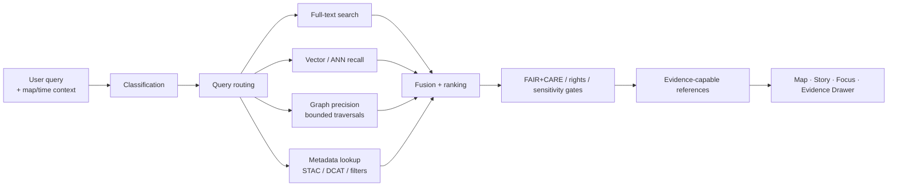

<!-- [KFM_META_BLOCK_V2]
doc_id: kfm://doc/<NEEDS_VERIFICATION_UUID>
title: Kansas Frontier Matrix — Search System Overview
type: standard
version: v1
status: review
owners: <NEEDS VERIFICATION>
created: <NEEDS VERIFICATION: YYYY-MM-DD>
updated: 2026-03-16
policy_label: public
related: [docs/search/drift/README.md, docs/search/drift/graph-queries/README.md, docs/search/drift/examples/README.md, docs/search/drift/hyde/README.md, docs/search/drift/embeddings/README.md]
tags: [kfm, search, drift, focus-mode, faircare]
notes: [Grounded in mounted KFM documentation corpus; repo tree was not directly mounted in this session, so owners, doc_id, created date, and some sibling paths need verification.]
[/KFM_META_BLOCK_V2] -->

# 🔍 Kansas Frontier Matrix — Search System Overview

Governed search and discovery for release-scoped documents, datasets, metadata, graph context, spatial layers, and Focus Mode retrieval.

> **Status:** active *(source-reported in the mounted search baseline; direct repo verification still needed)*  
> **Owners:** `<NEEDS VERIFICATION>`  
>       
> **Quick jumps:** [Scope](#scope) · [Repo fit](#repo-fit) · [Accepted inputs](#accepted-inputs) · [Exclusions](#exclusions) · [Quickstart](#quickstart) · [Usage](#usage) · [Diagram](#diagram) · [Tables](#tables) · [Review & definition of done](#review--definition-of-done) · [FAQ](#faq) · [Appendix](#appendix)

> [!IMPORTANT]
> Search in KFM is a **derived, rebuildable discovery layer**. It improves recall, routing, ranking, and navigation, but it does **not** become sovereign truth. Consequential claims still resolve through governed APIs, EvidenceRef/EvidenceBundle handling, policy checks, and release state.

> [!NOTE]
> This README is grounded in mounted KFM documentation, not a directly mounted repo checkout. Exact owners, some sibling paths, current schemas, workflow files, and current implementation status remain **NEEDS VERIFICATION**.

## Scope

`docs/search/README.md` is the entrypoint for the KFM **Search & Discovery System**.

Its job is to define how KFM performs search across promoted, policy-safe, release-scoped material while preserving the project’s core invariants:

- search stays **downstream** of authoritative truth
- search supports **map-first** and **time-aware** exploration
- search participates in **FAIR+CARE**, rights, and sensitivity controls
- search can enrich **Focus Mode**, **Story**, **Map Explorer**, and related surfaces without bypassing evidence resolution
- search remains **inspectable**, **deterministic where required**, and **rebuildable** from stronger sources when practical

In KFM terms, search is for **discovery, routing, contextual expansion, and explainable handoff**. It is not the place where truth silently migrates.

[Back to top](#-kansas-frontier-matrix--search-system-overview)

## Repo fit

| Direction | Link / path | Role | Confidence |
|---|---|---|---|
| This file | `docs/search/README.md` | Search-system entrypoint | **CONFIRMED** |
| Downstream | [`./drift/README.md`](./drift/README.md) | DRIFT hybrid retrieval overview | **CONFIRMED** |
| Downstream | [`./drift/graph-queries/README.md`](./drift/graph-queries/README.md) | Bounded graph/Cypher precision layer | **CONFIRMED** |
| Downstream | [`./drift/examples/README.md`](./drift/examples/README.md) | Golden fixtures and redaction-safe examples | **CONFIRMED** |
| Downstream | [`./drift/hyde/README.md`](./drift/hyde/README.md) | Governed HyDE query expansion | **CONFIRMED** |
| Downstream | [`./drift/embeddings/README.md`](./drift/embeddings/README.md) | Embedding-oriented retrieval notes | **CONFIRMED** |
| Upstream | `../README.md` | Parent docs index / docs landing page | **NEEDS VERIFICATION** |

### Historical sibling docs mentioned in the mounted search baseline

The mounted search baseline also names these paths as part of the broader `docs/search/` surface. Treat them as **historical or expected siblings** until the repo tree is re-verified:

- `docs/search/semantic-search.md`
- `docs/search/query-language.md`
- `docs/search/index-architecture.md`
- `docs/search/faircare-search-rules.md`

## Accepted inputs

This directory belongs to **governed search inputs and search-system documentation**, including:

| Input family | What belongs here |
|---|---|
| Search doctrine | Search scope, routing rules, explainability posture, derived-layer limits |
| Retrieval architecture | Hybrid search, DRIFT, graph traversal constraints, vector recall, metadata lookup |
| Search-adjacent governance | FAIR+CARE retrieval rules, sovereignty-aware search behavior, redaction-safe examples |
| Search outputs | Result-shape guidance, retrieval episode documentation, provenance expectations, evidence-handoff requirements |
| Search validation | Golden fixtures, leakage checks, determinism checks, retrieval QA and regression notes |
| Surface handoff rules | How search feeds Map Explorer, Story, Focus Mode, Evidence Drawer, and steward-facing review paths |

## Exclusions

This directory should **not** become a dumping ground for broader architecture material.

| Does **not** belong here | Goes there instead |
|---|---|
| Canonical truth modeling, authority semantics, or lifecycle law | Central KFM doctrine / master manual |
| Direct raw-source storage, object-store policy, or catalog governance as primary topic | Ingestion, evidence, and catalog docs |
| Free-form AI product design detached from retrieval/evidence | Focus Mode / AI governance docs |
| Unbounded graph exploration or graph-as-truth language | Rejected; bounded graph retrieval only |
| Direct-client bypass patterns to raw stores, canonical DBs, or model runtimes | Rejected; governed API boundary only |
| Sensitive-location disclosure, re-identifying joins, or unsafe retrieval examples | Rejected; use redaction-safe fixtures only |

## Directory tree

```text
docs/search/
├── README.md                             # This file
├── drift/
│   ├── README.md                         # DRIFT search integration
│   ├── graph-queries/
│   │   └── README.md                     # Neo4j/Cypher bounded traversal layer
│   ├── examples/
│   │   └── README.md                     # Redaction-safe examples / golden fixtures
│   ├── hyde/
│   │   └── README.md                     # Governed query expansion
│   └── embeddings/
│       └── README.md                     # Embedding-oriented retrieval layer
├── semantic-search.md                    # NEEDS VERIFICATION in current repo
├── query-language.md                     # NEEDS VERIFICATION in current repo
├── index-architecture.md                 # NEEDS VERIFICATION in current repo
└── faircare-search-rules.md              # NEEDS VERIFICATION in current repo
```

<details>
<summary><strong>Why the tree is split between confirmed and needs-verification entries</strong></summary>

The mounted corpus directly supports the existence of `docs/search/README.md` and the DRIFT subtree listed above. The four sibling Markdown files at the root of `docs/search/` appear in the mounted search baseline but were not independently confirmed from a live repo tree in this session.

</details>

## Quickstart

Use this README as the maintainers’ fast orientation before touching search behavior.

1. Start with the governing rule: search is **derived** and **policy-gated**.
2. Confirm that the query path stays inside **release scope** and does not bypass governed evidence handling.
3. Route by intent instead of forcing every request through one engine.
4. Use graph and vector retrieval for **hints, expansion, and ranking**, not as sovereign truth.
5. For any consequential answer, export, or UI claim, ensure the path still lands on **evidence-capable references** and can narrow or abstain safely.

### Minimal maintainer checklist

```text
[ ] Search path is release-scoped
[ ] Rights / sensitivity / FAIR+CARE filters are applied
[ ] Graph traversal is bounded
[ ] Retrieval expansion is explainable
[ ] Result objects can hand off to evidence resolution
[ ] Sensitive examples are redaction-safe
[ ] Derived layers remain rebuildable
```

### Illustrative routing example

```json
{
  "q": "dust bowl migration in southwest kansas",
  "time_range": ["1930-01-01", "1940-12-31"],
  "bbox": [-103.0, 36.9, -98.5, 39.0],
  "include": ["full_text", "metadata", "graph", "vector"],
  "mode": "hybrid",
  "release_scope": "published_only"
}
```

> [!TIP]
> Treat the example above as an **illustrative request shape**, not a verified live API contract.

[Back to top](#-kansas-frontier-matrix--search-system-overview)

## Usage

### Public discovery

Search supports the visible discovery path for:

- map layer lookup and toggling
- dataset and catalog discovery
- historical document lookup
- story-linked evidence discovery
- place/time-constrained exploration

Search should preserve **geographic** and **temporal** context instead of flattening everything into text-only relevance.

### Focus Mode retrieval

Search can enrich Focus Mode, but it does so as a **retrieval stage**, not as a truth override.

The safe pattern is:

1. classify the question and scope
2. route across search components
3. gather ranked candidates
4. hand off only policy-allowed, release-scoped references
5. let downstream evidence resolution and citation verification decide whether the system can answer

### Steward and maintainer review

Search docs and search fixtures should support review of:

- bounded traversal behavior
- leakage and redaction safety
- determinism where promised
- provenance emission for retrieval episodes
- regression behavior when ranking, routing, or templates change

## Diagram



### Reading the diagram

The important architectural move is the last one. Search ends with **evidence-capable references**, not with a claim that is already treated as authoritative. That handoff preserves the trust membrane.

[Back to top](#-kansas-frontier-matrix--search-system-overview)

## Tables

### Search component matrix

| Component | Primary job | Typical value | Hard boundary |
|---|---|---|---|
| Full-text search | Lexical discovery, faceting, ranked document lookup | Fast recall across documents and metadata | Not authoritative truth |
| Semantic vector search | Similarity recall / semantic neighborhood | Useful for natural-language discovery and retrieval grounding | Derived and never sovereign |
| Knowledge graph search | Contextual expansion, relationship traversal, multi-hop precision | Helps connect entities, datasets, provenance, and story context | Traversals must be bounded and policy-gated |
| Metadata search | Dataset type, bbox, time range, catalog-property lookup | Strong for reproducibility and catalog-aware discovery | Does not replace evidence resolution |
| Hybrid routing + fusion | Combines engines by query type and context | Better recall/precision balance than one-engine forcing | Must stay explainable |
| DRIFT integration | Global→local hybrid retrieval with governed expansion | Strong for Focus Mode and complex discovery | Must preserve provenance-first, CARE-aware behavior |

### Surface handoff matrix

| Surface | Search responsibility | What must remain visible |
|---|---|---|
| Map Explorer | Layer lookup, feature discovery, time-aware search | Layer status, evidence opener, release-safe results |
| Story surfaces | Narrative support and citation-linked lookup | Source linkage, no detached prose-only truth |
| Focus Mode | Retrieval support for bounded Q&A | Citations, narrowing, abstention path |
| Evidence Drawer | Open from search-linked claims or features | Version, rights, provenance, redactions/caveats |
| Steward / review paths | Fixture, provenance, and policy inspection | What changed, what was filtered, why it is safe |

### Trust posture matrix

| Statement | Status |
|---|---|
| Search is a derived, rebuildable discovery layer | **CONFIRMED** |
| Search may combine lexical, vector, graph, and metadata retrieval | **CONFIRMED** |
| DRIFT is the governing hybrid search architecture for this subtree | **CONFIRMED** at documentation level |
| Exact deployed engine mix and current runtime wiring | **UNKNOWN** |
| Root-level sibling files beyond the DRIFT subtree | **NEEDS VERIFICATION** |

## Review & definition of done

This README is ready to ship when the search subtree is both readable and governable.

### Definition of done

- [ ] The file states plainly that search is **derived**, not sovereign
- [ ] Repo fit and subtree links are present
- [ ] Inputs and exclusions are explicit
- [ ] The hybrid pipeline is diagrammed
- [ ] FAIR+CARE / sovereignty / sensitivity constraints are documented
- [ ] Focus Mode handoff is evidence-bounded, not chatbot-shaped
- [ ] DRIFT links are present
- [ ] Long reference material is tucked into appendices or details blocks
- [ ] Open verification items remain visible rather than silently assumed away

### Review gates

| Gate | Review question |
|---|---|
| Trust gate | Could a reader mistake search for canonical truth after reading this file? |
| Boundary gate | Does this README imply any direct bypass of governed APIs, evidence handling, or policy enforcement? |
| Safety gate | Are graph expansion, HyDE, examples, and provenance described with explicit limits? |
| Surface gate | Does the file connect search to Map / Story / Focus / Evidence instead of treating search as a detached subsystem? |
| Documentation gate | Are confirmed vs. needs-verification areas visibly separated? |

[Back to top](#-kansas-frontier-matrix--search-system-overview)

## FAQ

### Is search the source of truth?

No. Search is for discovery, routing, and contextual recall. Canonical truth stays in stronger layers and consequential claims still need governed evidence handling.

### Does Focus Mode answer directly from search results?

Not safely. Search can supply candidates and hints, but Focus Mode still operates as a governed evidence workflow with citation verification and abstention behavior.

### Can graph retrieval expand without limits?

No. Bounded traversals are a non-negotiable rule for the documented DRIFT graph layer.

### Are vector embeddings allowed to become the main truth surface?

No. Embeddings are useful for recall and similarity, but they remain derived and never sovereign.

### Should this README document the exact live search stack?

Only where directly verified. This README is allowed to document doctrine and intended structure, but not to invent current deployment reality.

## Appendix

<details>
<summary><strong>Glossary</strong></summary>

| Term | Meaning in this subtree |
|---|---|
| **Derived layer** | A rebuildable acceleration or discovery surface that remains downstream of stronger truth |
| **DRIFT** | Dynamic Retrieval Inference Flow Technique; KFM’s documented hybrid retrieval pattern |
| **EvidenceRef / EvidenceBundle** | The governed citation/resolution model used for inspectable support |
| **FAIR+CARE** | Combined metadata and stewardship posture for discoverability, interoperability, and community-sensitive governance |
| **Focus Mode** | Evidence-bounded natural-language investigation surface |
| **Release scope** | The published/promoted boundary within which search results may safely operate |

</details>

<details>
<summary><strong>Open verification items</strong></summary>

1. Confirm current owners or CODEOWNERS coverage for `docs/search/`.
2. Confirm whether `semantic-search.md`, `query-language.md`, `index-architecture.md`, and `faircare-search-rules.md` still exist at the root of `docs/search/`.
3. Confirm current schema and SHACL paths referenced by the older search baseline.
4. Confirm whether the repo still uses the `v11.2.6` metadata/status language for this subtree.
5. Confirm the current deployed engine mix for full-text, vector, graph, and metadata search.
6. Confirm whether any public-facing search behavior has moved from documentation target state into mounted implementation.

</details>

<details>
<summary><strong>Maintainer note on writing style</strong></summary>

When editing this subtree, prefer:

- explicit boundaries over feature slogans
- governed examples over abstract promises
- redaction-safe fixtures over realistic-but-risky samples
- “derived and rebuildable” language whenever a result could otherwise sound authoritative
- stable terminology: Search, DRIFT, Focus Mode, Evidence Drawer, FAIR+CARE, release scope

Avoid:

- “AI search” language that collapses retrieval and truth
- unbounded graph or free-form expansion claims
- direct-store or direct-model bypass suggestions
- path certainty you cannot verify from the repo in hand

</details>

---

**Search should help users find the right thing faster. KFM requires that it also help them understand what that thing is, why it is visible, and how far they should trust it.**
