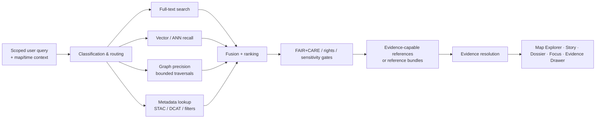

<!-- [KFM_META_BLOCK_V2]
doc_id: kfm://doc/<NEEDS_VERIFICATION_UUID>
title: Kansas Frontier Matrix — Search System Overview
type: standard
version: v1
status: review
owners: <NEEDS VERIFICATION: docs/search ownership / CODEOWNERS>
created: <NEEDS VERIFICATION: YYYY-MM-DD>
updated: 2026-03-16
policy_label: public
related: [docs/search/drift/README.md, docs/search/drift/stac/README.md, docs/search/drift/graph-queries/README.md, docs/search/drift/examples/README.md, docs/search/drift/hyde/README.md, docs/search/drift/embeddings/README.md]
tags: [kfm, search, drift, focus-mode, faircare]
notes: [Grounded in the source-visible docs/search baseline plus March 2026 KFM doctrine; repo support material corroborates docs/search/README.md and the main DRIFT subtree, but the live repo tree was not directly mounted in this session.]
[/KFM_META_BLOCK_V2] -->

# 🔍 Kansas Frontier Matrix — Search System Overview

Governed search and discovery for release-scoped documents, datasets, metadata, graph context, spatial layers, and Focus Mode retrieval.

> **Status:** active  
> **Owners:** `<NEEDS VERIFICATION>`  
> **Path:** `docs/search/README.md`  
>       
> **Quick jumps:** [Scope](#scope) · [Repo fit](#repo-fit) · [Accepted inputs](#accepted-inputs) · [Exclusions](#exclusions) · [Directory tree](#directory-tree) · [Quickstart](#quickstart) · [Usage](#usage) · [Diagram](#diagram) · [Tables](#tables) · [Review & definition of done](#review--definition-of-done) · [FAQ](#faq) · [Appendix](#appendix)

> [!IMPORTANT]
> Search in KFM is a **derived, rebuildable discovery layer**. It improves recall, routing, ranking, and navigation, but it does **not** become sovereign truth. Consequential claims still resolve through governed APIs, evidence resolution, policy checks, release state, and inspectable support.

> [!NOTE]
> This README is grounded in a source-visible `docs/search/README.md` baseline plus March 2026 KFM doctrine. Repo support material corroborates `docs/search/README.md` and the main DRIFT subtree, but the live repo tree itself was not directly mounted in this session.

> [!WARNING]
> Do not read this file as proof of live search runtime wiring, merge-enforced CI gates, or deployed engine mix. Where the project evidence stays documentary rather than executable, this README keeps those areas visible as **NEEDS VERIFICATION** or **UNKNOWN** instead of smoothing them into implementation fact.

## Scope

`docs/search/README.md` is the entrypoint for KFM’s **Search & Discovery System**.

Its job is to define how KFM discovers release-scoped material while preserving the project’s governing rules:

- search stays **downstream** of authoritative truth
- search remains **map-first** and **time-aware**
- search participates in **FAIR+CARE**, rights, sensitivity, and sovereignty controls
- search supports **Map Explorer**, **Story**, **Dossier**, **Focus Mode**, and the **Evidence Drawer** without bypassing evidence resolution
- search hands off **evidence-capable references** or **reference bundles**, not detached claims
- search remains **inspectable**, **rebuildable**, and **deterministic where required**

In practical terms, this documentation surface covers unified discovery across:

- historical documents
- datasets and metadata
- Story Nodes
- Focus Mode entities
- STAC catalog assets
- knowledge-graph relationships
- spatial layers and temporal events

KFM search is therefore about **discovery, routing, contextual expansion, and explainable handoff**. It is not the place where truth silently migrates.

[Back to top](#-kansas-frontier-matrix--search-system-overview)

## Repo fit

| Direction | Path | Role | Status |
|---|---|---|---|
| This file | `docs/search/README.md` | Search-system entrypoint | **CONFIRMED** |
| Downstream | [`./drift/README.md`](./drift/README.md) | DRIFT hybrid retrieval overview | **CONFIRMED** |
| Downstream | [`./drift/stac/README.md`](./drift/stac/README.md) | Retrieval-episode STAC / evidence-bundle surface | **CONFIRMED** |
| Downstream | [`./drift/graph-queries/README.md`](./drift/graph-queries/README.md) | Bounded graph/Cypher precision layer | **CONFIRMED** |
| Downstream | [`./drift/examples/README.md`](./drift/examples/README.md) | Redaction-safe examples and golden fixtures | **CONFIRMED** |
| Downstream | [`./drift/hyde/README.md`](./drift/hyde/README.md) | Governed HyDE query expansion | **CONFIRMED** |
| Downstream | [`./drift/embeddings/README.md`](./drift/embeddings/README.md) | Embedding-oriented retrieval layer | **CONFIRMED** |
| Upstream | `../README.md` | Parent docs index / docs landing page | **NEEDS VERIFICATION** |

### Baseline-indexed root docs still needing live-tree verification

The source-visible search baseline also names these root-level companions under `docs/search/`:

- `docs/search/semantic-search.md`
- `docs/search/query-language.md`
- `docs/search/index-architecture.md`
- `docs/search/faircare-search-rules.md`

These are **baseline-confirmed as named search docs**, but their current live-tree presence remains **NEEDS VERIFICATION** in this session.

## Accepted inputs

This directory belongs to **governed search inputs and search-system documentation**, including:

| Input family | What belongs here |
|---|---|
| Search doctrine | Search scope, routing rules, explainability posture, derived-layer limits |
| Retrieval architecture | Hybrid search, DRIFT, graph traversal constraints, vector recall, metadata lookup |
| Search governance | FAIR+CARE retrieval rules, sovereignty-aware search behavior, sensitivity controls |
| Search outputs | Result-shape guidance, retrieval episode packaging, provenance expectations, evidence handoff requirements |
| Validation material | Golden fixtures, leakage checks, determinism checks, ranking/regression notes |
| Surface handoff rules | How search feeds Map Explorer, Story, Dossier, Focus Mode, and the Evidence Drawer |
| Search-adjacent packaging | Search STAC items, evidence manifests, provenance assets, redaction-safe examples |

## Exclusions

This directory should **not** become a dumping ground for broader architecture or speculative product material.

| Does **not** belong here | Goes there instead |
|---|---|
| Canonical truth modeling or lifecycle law as the primary topic | Master doctrine / canonical working manual |
| RAW storage policy, ingestion mechanics, or catalog governance as the primary topic | Ingestion, evidence, and catalog docs |
| Free-form AI product design detached from retrieval and evidence | Focus Mode / AI governance docs |
| Unbounded graph exploration or graph-as-truth language | Rejected; bounded graph retrieval only |
| Direct-client bypass patterns to canonical stores, raw buckets, model runtimes, or search internals | Rejected; governed API boundary only |
| Sensitive-location disclosure, re-identifying joins, or unsafe retrieval examples | Rejected; use redaction-safe fixtures only |
| Runtime certainty not backed by repo evidence | Rejected; mark as **NEEDS VERIFICATION** or **UNKNOWN** |

## Directory tree

```text
docs/search/
├── README.md                             # This file
├── drift/
│   ├── README.md                         # DRIFT hybrid retrieval overview
│   ├── stac/
│   │   └── README.md                     # Retrieval-episode STAC / evidence-bundle docs
│   ├── graph-queries/
│   │   └── README.md                     # Bounded Neo4j/Cypher precision layer
│   ├── examples/
│   │   └── README.md                     # Redaction-safe runs / golden fixtures
│   ├── hyde/
│   │   └── README.md                     # Governed HyDE query expansion
│   └── embeddings/
│       └── README.md                     # Embedding-oriented retrieval layer
├── semantic-search.md                    # Baseline-indexed; live-tree verification pending
├── query-language.md                     # Baseline-indexed; live-tree verification pending
├── index-architecture.md                 # Baseline-indexed; live-tree verification pending
└── faircare-search-rules.md              # Baseline-indexed; live-tree verification pending
```

<details>
<summary><strong>Additional DRIFT companion docs named in source excerpts</strong></summary>

The broader search baseline also names companion DRIFT docs such as:

- `docs/search/drift/workflows/README.md`
- `docs/search/drift/synthesis/README.md`
- `docs/search/drift/provenance/README.md`

These are useful to keep in mind when reconciling this subtree, but they are **not promoted into the main tree above as current-path facts** because their live presence was not independently corroborated in the repo support material available during this session.

</details>

## Quickstart

Use this README as the maintainer’s fast orientation before changing search behavior, search docs, or search-adjacent contracts.

1. Start with the non-negotiable rule: search is **derived** and **policy-gated**.
2. Confirm that the query path stays inside **release scope** and does not bypass governed evidence handling.
3. Route by **query intent** instead of forcing every request through one retrieval mode.
4. Use graph and vector retrieval for **hints, expansion, and ranking**—not as sovereign truth.
5. End with **evidence-capable references**, then let downstream evidence resolution and citation verification decide whether the system can answer or should abstain.

### Minimal maintainer checklist

```text
[ ] Search path is release-scoped
[ ] FAIR+CARE / rights / sensitivity filters are applied
[ ] Graph traversal is bounded
[ ] Query expansion is explainable and logged where required
[ ] Result objects can hand off to evidence resolution
[ ] Sensitive examples are redaction-safe
[ ] Derived layers remain rebuildable
[ ] Focus-oriented paths still permit ANSWER / ABSTAIN / DENY / ERROR outcomes downstream
```

### Illustrative routing request

```json
{
  "q": "dust bowl migration in southwest kansas",
  "time_range": ["1930-01-01", "1940-12-31"],
  "bbox": [-103.0, 36.9, -98.5, 39.0],
  "include": ["full_text", "metadata", "graph", "vector"],
  "mode": "hybrid",
  "release_scope": "published_only"
}
```

### Illustrative handoff fragment

```json
{
  "results": [
    {
      "kind": "dataset",
      "title": "Example result",
      "policy_label": "public",
      "release_scope": "published_only",
      "evidence_ref": "evidence:...",
      "dataset_version_id": "dataset_version:..."
    }
  ]
}
```

> [!TIP]
> The request and result fragments above are **illustrative shapes**, not verified live contracts. Keep them that way unless and until route docs, schemas, or tests directly confirm the exact payloads.

[Back to top](#-kansas-frontier-matrix--search-system-overview)

## Usage

### Public discovery

Search supports the visible discovery path for:

- map layer lookup and toggling
- dataset and catalog discovery
- historical document lookup
- Story-linked evidence discovery
- place- and time-constrained exploration
- crosswalks between metadata, graph context, and release-safe assets

Search should preserve **geographic** and **temporal** context instead of flattening everything into text-only relevance.

### DRIFT and hybrid retrieval

Within this subtree, DRIFT is the documented hybrid retrieval pattern that combines global recall with more local precision stages.

At the documentation level, that means:

- full-text search handles lexical discovery
- vector search improves semantic recall
- graph retrieval sharpens local precision through **bounded traversals**
- metadata/STAC/DCAT lookup preserves catalog-aware reproducibility
- routing and rank fusion stay **explainable**, **policy-shaped**, and **replayable where required**

### Focus Mode retrieval

Search can enrich Focus Mode, but only as a **retrieval stage** inside a governed evidence workflow.

The safe pattern is:

1. classify and bound the request
2. route across search components
3. gather ranked candidates
4. keep only policy-allowed, release-scoped references
5. resolve support objects through evidence handling
6. synthesize only after evidence resolution and citation validation
7. preserve downstream finite outcomes such as **ANSWER**, **ABSTAIN**, **DENY**, or **ERROR**

Search should therefore help Focus Mode find the right evidence faster, not quietly turn retrieval outputs into truth.

### Steward and maintainer review

Search docs, retrieval fixtures, and retrieval episode records should support review of:

- bounded traversal behavior
- leakage and redaction safety
- determinism where promised
- provenance emission for retrieval episodes
- regression behavior when ranking, routing, templates, or redaction rules change
- whether evidence still stays one hop from the user-facing claim surface

## Diagram



### Reading the diagram

The key architectural move is the handoff from **ranked retrieval** to **evidence-capable references**, and then from those references into **evidence resolution**. Search does not end in a claim surface that is already treated as authoritative. That handoff preserves the trust membrane.

[Back to top](#-kansas-frontier-matrix--search-system-overview)

## Tables

### Search component matrix

| Component | Primary job | Typical value | Hard boundary |
|---|---|---|---|
| Full-text search | Lexical discovery, faceting, ranked document lookup | Fast recall across documents and metadata | Not authoritative truth |
| Semantic vector search | Similarity recall / semantic neighborhood | Natural-language discovery and retrieval grounding | Derived accelerator, never sovereign |
| Knowledge graph search | Contextual expansion, relationship traversal, multi-hop precision | Connects entities, datasets, provenance, and story context | Traversals must be bounded and policy-gated |
| Metadata search | Dataset type, bbox, time range, catalog-property lookup | Strong reproducibility and catalog-aware discovery | Does not replace evidence resolution |
| Hybrid routing + fusion | Combines retrieval modes by query type and context | Better recall/precision balance than one-engine forcing | Must stay explainable |
| DRIFT integration | Global→local hybrid retrieval with governed expansion | Strong for complex discovery and Focus-oriented retrieval | Must preserve provenance-first, CARE-aware behavior |

### Surface handoff matrix

| Surface | Search responsibility | What must remain visible |
|---|---|---|
| Map Explorer | Layer lookup, feature discovery, time-aware search | Layer status, evidence opener, release-safe results |
| Story surfaces | Narrative support and citation-linked lookup | Source linkage, no prose-only detached truth |
| Dossier | Object-centric discovery and contextual drill-through | Release basis, rights, provenance, correction path |
| Focus Mode | Retrieval support for bounded Q&A | Citations, narrowing, abstention path, visible scope |
| Evidence Drawer | Open from search-linked claims or features | Version, rights, provenance, redactions, safe previews |
| Steward / review paths | Fixture, provenance, and policy inspection | What changed, what was filtered, why it is safe |

### Verification posture matrix

| Statement | Status |
|---|---|
| Search is a derived, rebuildable discovery layer | **CONFIRMED** |
| Search may combine full-text, vector, graph, and metadata retrieval | **CONFIRMED** |
| The documented DRIFT subtree includes overview, STAC, graph queries, examples, HyDE, and embeddings docs | **CONFIRMED** |
| Root-level sibling docs such as `semantic-search.md` and `query-language.md` are named in the baseline | **CONFIRMED** |
| Those root-level sibling docs are currently present in the live repo tree | **NEEDS VERIFICATION** |
| Exact deployed engine mix and current runtime wiring | **UNKNOWN** |
| Current merge-blocking workflow, schema, and fixture enforcement for search | **NEEDS VERIFICATION** |

## Review & definition of done

This README is ready to ship when the search subtree is both readable and governable.

### Definition of done

- [ ] The file states plainly that search is **derived**, not sovereign
- [ ] Repo fit includes the corroborated DRIFT subtree
- [ ] Inputs and exclusions are explicit
- [ ] The hybrid pipeline is diagrammed
- [ ] FAIR+CARE / sovereignty / sensitivity constraints are documented
- [ ] Focus Mode handoff is evidence-bounded, not chatbot-shaped
- [ ] Baseline-indexed but unverified sibling docs are visibly separated from corroborated paths
- [ ] Long reference material is tucked into appendices or details blocks
- [ ] Open verification items remain visible instead of being silently assumed away

### Review gates

| Gate | Review question |
|---|---|
| Trust gate | Could a reader mistake search for canonical truth after reading this file? |
| Boundary gate | Does this README imply any direct bypass of governed APIs, evidence handling, or policy enforcement? |
| Safety gate | Are graph expansion, HyDE, embeddings, examples, and retrieval episodes described with explicit limits? |
| Surface gate | Does the file connect search to Map, Story, Dossier, Focus, and Evidence instead of treating search as a detached subsystem? |
| Evidence gate | Are corroborated paths distinguished from baseline-only or unmounted-path claims? |
| Documentation gate | Are **CONFIRMED**, **NEEDS VERIFICATION**, and **UNKNOWN** areas visible enough for a reviewer to challenge? |

[Back to top](#-kansas-frontier-matrix--search-system-overview)

## FAQ

### Is search the source of truth?

No. Search is for discovery, routing, and contextual recall. Canonical truth stays in stronger layers, and consequential claims still need governed evidence handling.

### Does Focus Mode answer directly from search results?

Not safely. Search can supply candidates and hints, but Focus Mode remains a governed evidence workflow with citation verification, scope control, and abstention behavior.

### Is DRIFT required for every query?

This subtree treats DRIFT as the documented hybrid retrieval architecture for search work in this area. Exact routing can still vary by deployment, but the governing rule is the same: retrieval modes remain policy-shaped, explainable, and subordinate to evidence resolution.

### Can graph retrieval expand without limits?

No. Bounded traversals are a non-negotiable rule for the documented DRIFT graph layer.

### Are embeddings allowed to become the main truth surface?

No. Embeddings are useful for recall and similarity, but they remain derived accelerators and never sovereign truth.

### Should this README document the exact live search stack?

Only where directly verified. This file is allowed to document doctrine, subtree intent, and corroborated doc topology, but not to invent current deployment reality.

## Appendix

<details>
<summary><strong>Glossary</strong></summary>

| Term | Meaning in this subtree |
|---|---|
| **Derived layer** | A rebuildable acceleration or discovery surface that remains downstream of stronger truth |
| **DRIFT** | The documented hybrid retrieval pattern used in this subtree for global→local search behavior |
| **EvidenceRef / EvidenceBundle** | The governed citation and resolution model used for inspectable support |
| **Evidence-capable reference** | A search result object that can still hand off into evidence resolution rather than ending as detached prose |
| **FAIR+CARE** | Combined metadata and stewardship posture for discoverability, interoperability, rights, and community-sensitive governance |
| **Focus Mode** | Evidence-bounded synthesis surface for governed Q&A |
| **Release scope** | The published/promoted boundary within which search results may safely operate |
| **Reference bundle** | A minimally safe result bundle returned from governed retrieval stages, typically with stable IDs and policy-safe fields |

</details>

<details>
<summary><strong>Open verification items</strong></summary>

1. Confirm current owners or CODEOWNERS coverage for `docs/search/`.
2. Reconcile the visible draft’s `updated: 2026-03-16` value with the repo support index date of `2025-12-13`.
3. Confirm whether `semantic-search.md`, `query-language.md`, `index-architecture.md`, and `faircare-search-rules.md` are still present at the root of `docs/search/`.
4. Confirm whether DRIFT companion docs such as `workflows/`, `synthesis/`, and `provenance/` are currently present in the live repo.
5. Confirm current schema and fixture paths for any search-specific contracts, telemetry, or retrieval-episode artifacts.
6. Confirm the deployed engine mix for full-text, vector, graph, and metadata search.
7. Confirm whether any search-specific CI, regression harnesses, or merge-blocking validations are already mounted in the repo.

</details>

<details>
<summary><strong>Maintainer note on wording and scope</strong></summary>

When editing this subtree, prefer:

- explicit boundaries over feature slogans
- governed examples over abstract promises
- redaction-safe fixtures over realistic-but-risky samples
- “derived and rebuildable” language whenever a result might otherwise sound authoritative
- stable terminology: Search, DRIFT, Focus Mode, Evidence Drawer, FAIR+CARE, release scope

Avoid:

- “AI search” phrasing that collapses retrieval and truth
- unbounded graph or free-form expansion claims
- direct-store or direct-model bypass suggestions
- runtime certainty you cannot verify from the repo in hand

</details>

---

**Search should help people find the right thing faster. In KFM, it should also help them understand what that thing is, why it is visible, and how far they should trust it.**
