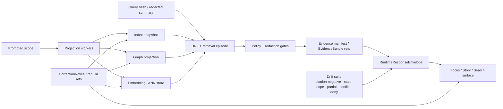

<!-- [KFM_META_BLOCK_V2]
doc_id: kfm://doc/REQUIRES-UUID
title: Search Drift
type: standard
version: v1
status: draft
owners: @bartytime4life
created: 2025-11-26
updated: 2026-04-06
policy_label: public
related: [docs/search/README.md, docs/search/drift/stac/README.md, docs/search/drift/graph-queries/README.md, docs/search/drift/hyde/README.md, docs/search/drift/embeddings/README.md, docs/search/drift/examples/README.md]
tags: [kfm, search, drift, retrieval, verification]
notes: [Created date grounded in first visible public commit for this path; updated date reflects this review draft; doc UUID is not visible in the current public tree; preserved-baseline DRIFT companions such as provenance/workflows/synthesis are not currently visible on public main.]
[/KFM_META_BLOCK_V2] -->

# Search Drift

Govern DRIFT and other search-derived surfaces so retrieval, ranking, graph expansion, and evidence bundling stay release-linked, evidence-resolvable, and visibly correctable.

> **Status:** experimental  
> **Owners:** `@bartytime4life` *(current public `/.github/CODEOWNERS` coverage for `/docs/`; narrower search-specific ownership can be added later if directly verified)*  
> **Path:** `docs/search/drift/README.md`  
>        
> **Quick jumps:** [Scope](#scope) · [Repo fit](#repo-fit) · [Accepted inputs](#accepted-inputs) · [Exclusions](#exclusions) · [Directory tree](#directory-tree) · [Quickstart](#quickstart) · [Usage](#usage) · [Diagram](#diagram) · [Tables](#tables) · [Definition of done](#definition-of-done) · [Task list](#task-list) · [FAQ](#faq) · [Appendix](#appendix)

> [!IMPORTANT]
> **Revision posture**
> This revision is grounded in the attached KFM corpus **and** direct inspection of the current public `main` `docs/search/` and `docs/search/drift/` trees plus public `/.github/CODEOWNERS`.
> That is stronger than the earlier PDF-only posture, but it still does **not** prove the exact working branch, hidden GitHub settings, merge-enforced checks, search-specific schemas/tests, or deployed runtime behavior.

## Truth legend

| Label | Meaning in this README |
|---|---|
| **CONFIRMED** | Directly supported by the attached KFM doctrine or the current public repo tree inspected for this revision |
| **INFERRED** | Conservative structural completion from confirmed doctrine or confirmed checked-in paths |
| **PROPOSED** | Recommended starter shape, control, or workflow not yet proven in checked-in implementation |
| **UNKNOWN** | Not supported strongly enough to present as current project fact |
| **NEEDS VERIFICATION** | Exact working-branch, hidden-platform, or runtime detail that still requires direct checkout or environment proof |

---

## Scope

KFM treats **search**, **graph**, **vector**, **tile**, **scene**, **cache**, and **summary** layers as **derived projections**, not sovereign truth. Search drift is therefore broader than “ranking got worse.” It is any divergence between a search-derived surface and the **released, policy-safe, evidence-resolvable scope** it is supposed to represent.

This README covers the governance problem sitting over search-derived behavior:

- release-linked search indexes
- graph expansion and related-document traversal
- embedding / ANN retrieval acceleration
- privacy-safe query representation
- retrieval-episode provenance
- stale, partial, conflicted, generalized, denied, or withdrawn output states
- correction, rollback, and rebuild expectations for search-derived layers

It does **not** redefine core KFM doctrine. It applies that doctrine specifically to retrieval and search-adjacent surfaces.

> [!NOTE]
> In the preserved search bundle, **DRIFT Search Integration** names the hybrid global → local retrieval pattern spanning semantic initialization, embedding/community retrieval, graph-local precision retrieval, and STAC/DCAT context ingestion. This README keeps that continuity, but centers the KFM governance problem that matters most: **drift in derived retrieval surfaces**.

### Search drift at a glance

| Question | Governing answer |
|---|---|
| What drifts? | Any derived retrieval or ranking surface that diverges from released, policy-safe, evidence-resolvable scope |
| What stays authoritative? | Released, evidence-backed truth — not search, graph, embedding, or cache layers |
| What must remain visible? | Freshness, provenance, policy state, correction lineage, and negative runtime outcomes |
| Who may serve outward search behavior? | Governed API and evidence resolver only |
| What happens on failure? | The system narrows, generalizes, abstains, denies, errors, or marks state visibly rather than bluffing |

[Back to top](#search-drift)

---

## Repo fit

`docs/search/drift/README.md` is the drift-governance entrypoint inside KFM’s Search & Discovery System. It should explain how derived retrieval stays subordinate to released evidence, policy, correction, and trust-visible runtime behavior.

### Current checked-in fit

| Direction | Path | Role | Status |
|---|---|---|---|
| This file | `docs/search/drift/README.md` | Drift-governance overview for the DRIFT subtree | **CONFIRMED** current public `main` |
| Upstream | [`../README.md`](../README.md) | Search-system entrypoint | **CONFIRMED** current public `main` |
| Upstream companions | [`../semantic-search.md`](../semantic-search.md) · [`../query-language.md`](../query-language.md) · [`../index-architecture.md`](../index-architecture.md) · [`../faircare-search-rules.md`](../faircare-search-rules.md) | Search doctrine, grammar, index architecture, and FAIR+CARE routing | **CONFIRMED** current public `main` |
| Downstream drift companions | [`./stac/README.md`](./stac/README.md) · [`./graph-queries/README.md`](./graph-queries/README.md) · [`./examples/README.md`](./examples/README.md) · [`./hyde/README.md`](./hyde/README.md) · [`./embeddings/README.md`](./embeddings/README.md) | Checked-in drift subdocs currently visible on public `main` | **CONFIRMED** current public `main` |
| Public owner signal | [`../../../.github/CODEOWNERS`](../../../.github/CODEOWNERS) | `/docs/` routed to `@bartytime4life` | **CONFIRMED** current public `main` |
| Preserved-baseline companions not currently visible on public `main` | `docs/search/drift/provenance/README.md` · `docs/search/drift/synthesis/README.md` · `docs/search/drift/workflows/README.md` | Earlier search-bundle lineage that should not be silently upgraded into current-tree fact | **CONFIRMED** baseline lineage · current tree **NEEDS VERIFICATION** |
| Operational companions | `data/stac/search/drift/` · `data/processed/search/drift/` · `data/processed/prov/search/drift/` · `mcp/runs/search/drift/` | Likely house paths for emitted search-drift artifacts and run traces | **INFERRED** |

### Evidence boundary used in this revision

| Evidence layer | What this README treats as settled |
|---|---|
| **CONFIRMED doctrine** | Search and graph remain derived, rebuildable accelerators; consequential runtime behavior still resolves through evidence, policy, release state, and correction lineage |
| **CONFIRMED current public tree** | `docs/search/` and `docs/search/drift/` exist on public `main`, with the currently visible companion docs listed above |
| **CONFIRMED public ownership signal** | Public `/.github/CODEOWNERS` routes `/docs/` to `@bartytime4life` |
| **UNKNOWN / NEEDS VERIFICATION** | Exact working-branch parity, hidden GitHub settings, required checks, search-specific schemas/tests/workflow YAMLs, runtime engine mix, telemetry, and deployed indexing services |

### Current fit statement

**CONFIRMED**

- KFM doctrine keeps search-derived layers subordinate to evidence, policy, release state, and correction lineage.
- Public `main` visibly places `docs/search/drift/README.md` inside a broader `docs/search/` subtree rather than as an orphaned document.
- Public `main` visibly includes checked-in drift companions for **STAC**, **graph queries**, **examples**, **HyDE**, and **embeddings**.

**INFERRED**

- This directory is the correct doctrinal seam for connecting those rules to DRIFT-style retrieval, graph expansion, index snapshots, and runtime drift handling.
- The preserved-but-not-currently-visible `provenance/`, `synthesis/`, and `workflows/` companions are still part of the search-document lineage and should be reconciled before any sweeping cleanup or renaming.

**NEEDS VERIFICATION**

- Exact working-branch file inventory
- Search-specific schemas, fixtures, reports, and runbooks
- Required checks, hidden GitHub rulesets, OIDC wiring, and workflow enforcement
- Current implementation stack and emitted runtime proof objects

[Back to top](#search-drift)

---

## Accepted inputs

Accepted here:

- drift classes for search-derived KFM surfaces
- release-linkage rules for search indexes, graph traversal, reranking, and embedding-backed retrieval
- privacy-safe query representation rules (`query_hash`, redacted summaries, retention limits)
- retrieval-episode identity and provenance expectations
- evidence-manifest / `EvidenceBundle` resolution expectations
- citation-negative, stale-scope, partial-coverage, conflict, and deny-path validation guidance
- correction, rebuild, rollback, and stale-visible runbooks
- trust-visible UI expectations for search-derived surface state
- registries, matrices, fixtures, and templates that help reviewers detect or explain drift

### Typical source objects

- promoted dataset or release references
- index snapshot references
- query hashes or redacted query summaries
- policy bundle hashes or decision references
- evidence manifests
- `EvidenceBundle` references
- validation logs and drift reports
- provenance bundles for retrieval episodes
- correction notices and rebuild references

[Back to top](#search-drift)

---

## Exclusions

This directory is **not** the place for:

- canonical truth authoring
- raw ingestion or source admission policy
- unrestricted storage of raw query text or precise sensitive geometry
- direct client-to-store search bypasses
- UI-only search polish detached from evidence behavior
- making graph, embeddings, or indexes the only place meaning survives
- uncited answer generation presented as truth
- speculative route names, DTOs, service names, workflow claims, or engine inventories presented as settled current fact

### Route elsewhere

| Does not belong here | Goes instead |
|---|---|
| Canonical entities, observations, or dataset versions | canonical data / contract surfaces |
| Rights or sensitivity adjudication | policy / review surfaces |
| Broader shell choreography beyond search-specific behavior | UI / shell doctrine docs |
| Model-runtime installation details | runtime / infrastructure docs |
| Standards-profile implementation details | contracts / profiles / validator docs |
| Hidden GitHub controls, required checks, or platform-only settings | direct platform inspection and steward review |
| Runtime certainty not backed by direct repo or environment evidence | mark as **UNKNOWN** or **NEEDS VERIFICATION** |

[Back to top](#search-drift)

---

## Directory tree

### Current public `main` subtree

```text
docs/search/drift/
├── README.md
├── embeddings/
│   └── README.md
├── examples/
│   └── README.md
├── graph-queries/
│   └── README.md
├── hyde/
│   └── README.md
└── stac/
    └── README.md
```

### Preserved-baseline lineage not currently visible on public `main`

```text
docs/search/drift/
├── provenance/
│   └── README.md
├── synthesis/
│   └── README.md
└── workflows/
    └── README.md
```

> [!NOTE]
> The first tree reflects the currently visible public `main` subtree.  
> The second reflects **preserved search-baseline lineage**, not current checked-in path proof.

### Inferred operational house paths

```text
data/stac/search/drift/
data/processed/search/drift/
data/processed/prov/search/drift/
mcp/runs/search/drift/
```

> [!WARNING]
> These house paths are still **INFERRED**. Keep them clearly labeled until the exact working branch or runtime proves them.

[Back to top](#search-drift)

---

## Quickstart

This quickstart avoids inventing repo-specific scripts or workflow names.

### 1) Verify exact working-branch reality first

```bash
git branch --show-current
git status --short

find docs/search/drift -maxdepth 2 -type f | sort
git log --oneline -- docs/search/drift/README.md | head -n 10

rg -n "Search Drift|DRIFT|EvidenceBundle|RuntimeResponseEnvelope|query_hash|episode_id" \
  docs contracts policy schemas tests .github
```

### 2) Reconcile branch-local reality against the confirmed public-main shape

Check these questions before editing prose as if it were settled fact:

1. Does the working branch still match the currently visible public `main` subtree?
2. Are `provenance/`, `synthesis/`, or `workflows/` present locally even though they are not visible on current public `main`?
3. Have search-specific schemas, fixtures, runbooks, or tests been added under `contracts/`, `schemas/`, `policy/`, or `tests/`?
4. Do any local files change the owner, status, or policy label assumptions used here?

### 3) Confirm every search-derived surface can answer the same trust questions

Before treating any search behavior as acceptable, confirm it can answer:

1. Which **released scope** or **index snapshot** did this run use?
2. Which **policy bundle** or decision grammar constrained it?
3. Can consequential outward claims still resolve to an admissible `EvidenceBundle`?
4. Is the result still within freshness, release, and correction tolerance?
5. If the result is partial, conflicted, generalized, stale-visible, abstained, or denied, does the surface say so plainly?

### 4) Run or define the minimum drift suite

At minimum, drift review should exercise:

- citation-negative behavior
- stale-scope behavior
- partial-coverage behavior
- corroboration-conflict behavior
- deny / abstain / error behavior
- query privacy / redaction behavior
- correction propagation behavior

### 5) Record drift as governed evidence

A drift review is not a private judgment call. Record:

- reviewed surface or workflow
- release / snapshot basis
- observed drift class
- supporting traces or manifests
- required rebuild / rollback / correction action
- reviewer, date, and verification outcome

[Back to top](#search-drift)

---

## Usage

### For maintainers

Use this directory to keep DRIFT and other search behavior subordinate to KFM law:

- no hidden bypass around governed APIs
- no search surface that outruns released scope
- no graph or embedding layer quietly becoming authority
- no query handling that leaks what policy required to hash, redact, or generalize
- no correction path that disappears behind cache convenience

### For reviewers

Use this README as the review frame when asking:

- Did retrieval outrun released scope?
- Did the result remain one hop from evidence?
- Did graph expansion cross into source-dependent or conflict-prone material without visible state?
- Did query handling preserve privacy, policy, and provenance?
- Can correction, supersession, or withdrawal propagate visibly to the outward surface?

### For UI / app engineers

Treat drift as a **surface-state problem**, not just a backend-quality problem. A technically correct backend paired with a bluffing UI is still a trust failure.

### For retrieval / platform engineers

Treat indexes, graph projections, embedding stores, rerankers, and query reformulation as **replaceable derived layers**. Even when a branch or local environment uses specific graph or embedding components, they remain bounded by release linkage, policy, and evidence resolution rather than becoming truth-bearing systems of record.

---

## Diagram



### Reading the diagram

- **Promoted scope** stays upstream.
- Search, graph, and embedding layers are **projection artifacts** built from promoted scope.
- A governed retrieval episode should enter through a privacy-safe query representation, not an undocumented opaque path.
- `EvidenceBundle` resolution and policy checks sit **before** outward runtime behavior.
- Correction must travel forward into every affected derived surface.

[Back to top](#search-drift)

---

## Tables

### Drift matrix

| Drift class | Typical symptom | Why it matters in KFM | Required visible signal | Default correction path |
|---|---|---|---|---|
| **Release drift** | Search or retrieval reflects older or mismatched promoted scope | Outward claims may look current while actually be stale | snapshot mismatch, stale flag, rebuild age | rebuild or relink to promoted scope |
| **Evidence drift** | Result can no longer resolve cleanly to admissible evidence | Violates cite-or-abstain and inspectability | failed `EvidenceRef` → `EvidenceBundle` resolution | abstain, deny, or correct |
| **Policy drift** | Output outruns rights, sensitivity, or review posture | Public-safe publication may be breached | policy mismatch, obligation failure | deny, narrow, generalize, or escalate |
| **Provenance drift** | Retrieval run lacks stable episode identity or lineage | Run becomes hard to audit or compare | missing `episode_id`, `query_hash`, snapshot ref, or validation log | fail closed and restore provenance completeness |
| **Query / privacy drift** | Raw query text, precise geometry, or restricted identifiers leak | Search becomes a data-governance breach | query redaction mismatch, leaked precision, missing summary-only path | hash, redact, withhold, or review |
| **Graph expansion drift** | Traversal crosses into source-dependent or conflicted relations without visible state | Expansion looks settled when it is not | source-dependent flag, conflict state, expansion history | label, narrow, or abstain |
| **Ranking drift** | Relevance changes degrade evidence quality or policy fit | Search becomes persuasive but less trustworthy | golden-query regression, evidence-quality regression | retune, rebuild, or narrow scope |
| **Embedding drift** | Embedding store semantics change independently of release-backed truth | Meaning may survive only in a derived layer | snapshot mismatch, low evidence-resolution rate | rebuild embeddings from promoted scope |
| **Correction drift** | Superseded or withdrawn material remains ranked as current | Breaks lineage and user trust | missing correction linkage, withdrawn-result leakage | propagate correction and rebuild affected layers |
| **Surface drift** | UI hides stale, partial, generalized, conflicted, denied, or withdrawn state | Trust fails even if backend is partly correct | absent chips, badges, or refusal cues | fix surface state and align runtime envelope |

### Minimum validation suite

| Test family | What it proves | Fail-closed behavior |
|---|---|---|
| **Citation-negative** | The system refuses or narrows when user-visible claims cannot be citation-verified | `ABSTAIN`, `DENY`, or `ERROR` |
| **Stale-scope** | Derived surfaces do not silently serve beyond declared freshness or release tolerance | visible `stale-visible` state or rebuild |
| **Partial-coverage** | Incomplete retrieval stays labeled incomplete instead of being smoothed into fluency | `partial` disclosure in-place |
| **Corroboration-conflict** | Conflict-prone expansion stays visibly source-dependent or conflicted | visible conflict state, review escalation, or abstention |
| **Deny / abstain / error** | Negative outcomes are first-class and testable, not embarrassing edge cases | explicit primary outcome in runtime envelope |
| **Query privacy / redaction** | Query handling respects classification, hashing, and geometry generalization rules | withhold raw query text and sensitive precision |
| **Correction propagation** | Supersession, withdrawal, or narrowing reaches every affected search-derived layer | rebuild refs + visible correction state |

> [!IMPORTANT]
> A smooth answer that cannot reconstruct its evidence path is a **failure**, even if the prose sounds plausible.

### Minimum governed artifact set

| Object | Minimum purpose | Minimum fields / state | Status |
|---|---|---|---|
| **Query representation** | Privacy-safe seed for reproducible retrieval | `query_hash`; optional redacted summary; raw text only when policy allows | **INFERRED** |
| **Episode identifier** | Stable identity for a governed retrieval run | deterministic `episode_id` derived from query + constraints + workflow + policy + snapshot basis | **INFERRED** |
| **Index snapshot reference** | Proves what the retrieval ran against | `index_snapshot_id` or equivalent lineage reference | **INFERRED** |
| **Evidence manifest / bundle refs** | Preserves drill-through to support | stable evidence refs, release linkage, rights/sensitivity state | **CONFIRMED doctrine / INFERRED packaging** |
| **Decision envelope ref** | Makes policy result machine-readable | subject, action, result, reason codes, obligation codes, audit ref | **CONFIRMED doctrine** |
| **Projection build receipt** | Proves a derived search / graph / embedding surface was built from known release scope | release ref, projection type, build time, freshness basis | **CONFIRMED doctrine** |
| **Runtime response envelope** | Makes outward runtime behavior accountable | surface class, surface state, result, citations check, decision ref, audit ref | **CONFIRMED doctrine** |
| **Validation log / drift report** | Shows which suites ran and what failed | test family list, subject refs, pass/fail, reviewer or runner | **PROPOSED packaging** |
| **Correction notice / rebuild refs** | Preserves visible lineage under change | affected surfaces, rebuild refs, replacement refs, public note | **CONFIRMED doctrine** |

#### Illustrative only — retrieval episode shape

The example below is a **shape illustration**, not a verified mounted schema.

```json
{
  "episode_id": "urn:kfm:search:drift:episode:0123abcd4567ef89",
  "query_hash": "sha256:…",
  "index_snapshot_id": "urn:kfm:search:index:snapshot:…",
  "surface_state": "stale-visible",
  "decision_ref": "urn:kfm:decision:…",
  "evidence_refs": ["urn:kfm:evidence:…"],
  "validation": ["citation-negative", "stale-scope"]
}
```

[Back to top](#search-drift)

---

## Search drift rules

### 1) Search is derived until proven otherwise

Search indexes, graph projections, embedding stores, rerankers, and summary surfaces are acceleration layers. They are valuable, but they are not authoritative truth.

### 2) Retrieval must stay one hop from evidence

A strong result is not merely relevant. It must remain reconstructable to inspectable support at the moment of use.

### 3) Release mismatch is a first-class failure

A result tied to the wrong snapshot or the wrong release window is not “close enough.” It is drift.

### 4) Privacy / redaction drift is still drift

A search surface that leaks raw query text, precise sensitive geometry, or restricted identifiers is not merely sloppy. It is policy drift with trust consequences.

### 5) Rebuild beats silent patching

Because search-derived surfaces are rebuildable by default, drift should usually be corrected by rebuild, relinking, or visible correction propagation rather than UI-only mitigation.

### 6) Negative outcomes are valid outcomes

A system that abstains, denies, or errors honestly when drift prevents a trustworthy answer is behaving correctly.

---

## Trust-visible surface states

A search surface is healthy when the user can tell, without guesswork:

- what release or snapshot basis they are reading from
- whether the result is promoted, generalized, partial, stale-visible, source-dependent, conflicted, withdrawn, denied, or abstained
- how to open the supporting evidence
- whether a correction, supersession, or narrowing has already occurred

| Surface cue | Meaning |
|---|---|
| **Promoted** | Result is within approved released scope |
| **Generalized** | Precision reduced for policy or publication reasons |
| **Partial** | Coverage incomplete or support not full |
| **Stale-visible** | Still shown, but not current enough to imply freshness |
| **Source-dependent** | Result depends on a source family or relation that remains context-sensitive |
| **Conflicted** | Independent sources disagree materially |
| **Withdrawn / superseded** | Replaced or removed with visible lineage |
| **Denied** | Policy blocks the requested surface or action |
| **Abstained** | Evidence path or citation checks were insufficient for a trustworthy answer |

> [!TIP]
> Search quality and search honesty are different things. KFM needs both.

---

## Definition of done

A search-drift revision is ready when all of the following are true:

- [ ] exact working-branch reality under `docs/search/drift/` has been reconciled against the current public-main subtree
- [ ] confirmed current-tree surfaces and preserved-baseline-only companions are clearly separated
- [ ] owner, policy label, and document UUID are either directly verified or explicitly left reviewable
- [ ] every governed retrieval run records a stable `episode_id` and privacy-safe query representation
- [ ] every search-derived surface names its release or snapshot basis
- [ ] consequential outward results still resolve to admissible evidence
- [ ] citation-negative and stale-scope tests fail closed
- [ ] partial, source-dependent, conflicted, denied, and abstained states remain visible at the surface
- [ ] correction lineage propagates into search, graph, and embedding outputs
- [ ] changed thresholds, fixtures, reports, or runbooks move with the behavior
- [ ] no section quietly upgrades unknown runtime or platform behavior into confident project fact

[Back to top](#search-drift)

---

## Task list

### Immediate

- [ ] verify exact working-branch contents of `docs/search/drift/` against the current public `main` tree
- [ ] confirm whether `provenance/`, `synthesis/`, and `workflows/` exist on the branch being edited or remain baseline-only lineage
- [ ] confirm final document UUID and whether `public` is the intended policy label for this path
- [ ] verify whether search-specific schemas, fixtures, reports, or tests now exist under `contracts/`, `schemas/`, `policy/`, `tests/`, or `.github/`

### Near-term

- [ ] define a golden-query set and a citation-negative set
- [ ] define stale / partial / conflicted / denied fixtures
- [ ] define a minimal retrieval-episode report or receipt shape
- [ ] align sibling drift docs so their evidence posture matches current public-tree reality instead of older PDF-only wording

### Later

- [ ] connect drift checks to correction workflows
- [ ] connect retrieval episodes to STAC / PROV outputs where that pattern is adopted
- [ ] align runtime response envelopes, surface-state chips, and reviewer runbooks
- [ ] add or restore branch-local companions such as provenance or workflows only when their paths and roles are directly proved

[Back to top](#search-drift)

---

## FAQ

### What counts as “drift” here?

Any mismatch between a search-derived surface and the released, policy-safe, evidence-resolvable scope it is supposed to represent.

### Is DRIFT the same thing as search drift?

No. In the preserved search docs, **DRIFT** names the retrieval architecture pattern. **Search drift** is the governance problem this README addresses across any such derived retrieval surface.

### Is low relevance enough to call something drift?

Not by itself. In KFM, drift matters most when it affects release linkage, evidence resolution, policy posture, provenance, correction lineage, or visible trust state.

### Can raw query text be stored?

Only when policy and classification explicitly allow it. The safer default in the preserved DRIFT lineage is hash-first representation plus an optional redacted summary.

### Are graph traversal and embeddings allowed?

Yes, as derived acceleration. They remain rebuildable and must not become the only place meaning survives.

### Can a drifted result still be shown?

Sometimes. KFM doctrine permits visible narrowed states such as generalized, partial, source-dependent, stale-visible, or withdrawn — provided those states are explicit and policy-safe.

### What is the safest fallback?

Prefer **abstain**, **deny**, **review**, or **visible narrowing** over persuasive overclaim.

---

## Appendix

<details>
<summary><strong>Status vocabulary</strong></summary>

| Label | Meaning in this README |
|---|---|
| **CONFIRMED** | Directly supported by attached KFM materials or by current public-tree inspection |
| **INFERRED** | Strongly implied by repeated doctrine or preserved search lineage, but not directly proven as exact working-branch reality |
| **PROPOSED** | Recommended starter shape, runbook, or artifact |
| **UNKNOWN** | Not verified strongly enough in the current session |
| **NEEDS VERIFICATION** | Should be checked against the exact working branch, schema inventory, workflows, or runtime before being treated as settled fact |

</details>

<details>
<summary><strong>Current public-main observations</strong></summary>

- `docs/search/drift/` is currently visible on public `main`.
- The currently visible checked-in companions are `embeddings/`, `examples/`, `graph-queries/`, `hyde/`, and `stac/`.
- Public `docs/search/README.md` positions DRIFT as part of the broader Search & Discovery System.
- Public `/.github/CODEOWNERS` routes `/docs/` to `@bartytime4life`.
- The public tree does **not** currently show `docs/search/drift/provenance/`, `docs/search/drift/synthesis/`, or `docs/search/drift/workflows/`, even though preserved search-lineage docs still name those paths.

</details>

<details>
<summary><strong>Open verification items</strong></summary>

The following remain open because public-tree inspection is stronger than the earlier PDF-only posture, but still weaker than direct checkout + runtime proof:

- whether the exact working branch matches public `main`
- whether branch-local `provenance/`, `synthesis/`, or `workflows/` docs exist
- search-specific schemas, fixtures, reports, and tests
- required checks, rulesets, OIDC wiring, and hidden GitHub approvals
- actual runtime engine mix, telemetry, and emitted proof packs
- whether retrieval episodes currently emit snapshot refs, provenance bundles, or validation logs as operational artifacts

</details>

<details>
<summary><strong>Name continuity: Search Drift vs DRIFT</strong></summary>

This README keeps both names on purpose.

- **Search Drift** is the governing KFM problem: derived retrieval surfaces diverging from released, policy-safe, evidence-resolvable scope.
- **DRIFT** is the directory-continuity term already used for the hybrid retrieval architecture under this path.

That lets the repo preserve older directory identity and adjacent documentation without losing the doctrinal center of gravity KFM actually cares about most.

</details>

<details>
<summary><strong>Suggested review questions</strong></summary>

1. Does this README keep search subordinate to KFM truth-path law?
2. Does it separate current public-tree facts from preserved-baseline lineage and from future proposals?
3. Does it avoid implying that public-main path visibility proves runtime wiring or deployment maturity?
4. Does it give maintainers concrete validation and artifact vocabulary rather than only conceptual prose?
5. Does it preserve DRIFT continuity without overclaiming missing `provenance/`, `synthesis/`, or `workflows/` surfaces?
6. Does anything here still need narrowing once the exact working branch is directly inspected?

</details>

---

**Current posture:** public-main-tree-grounded revision rooted in attached KFM doctrine and preserved DRIFT lineage; ready for exact-working-branch reconciliation before merge.

[docs-root]: ../../README.md
[search-root]: ../README.md
[semantic-search]: ../semantic-search.md
[query-language]: ../query-language.md
[index-architecture]: ../index-architecture.md
[faircare-search-rules]: ../faircare-search-rules.md
[drift-stac]: ./stac/README.md
[drift-graph-queries]: ./graph-queries/README.md
[drift-examples]: ./examples/README.md
[drift-hyde]: ./hyde/README.md
[drift-embeddings]: ./embeddings/README.md
