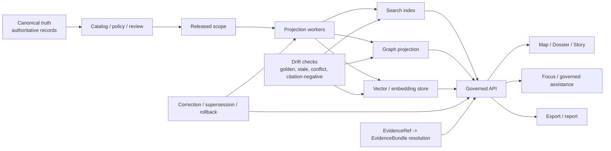

<!-- [KFM_META_BLOCK_V2]
doc_id: kfm://doc/REQUIRES-UUID
title: Search Drift
type: standard
version: v1
status: draft
owners: REQUIRES-OWNER-VERIFICATION
created: REQUIRES-DATE-VERIFICATION
updated: REQUIRES-DATE-VERIFICATION
policy_label: REQUIRES-POLICY-LABEL
related: [docs/search/drift/README.md, kfm://doc/REQUIRES-RELATED-ID]
tags: [kfm, search, drift, retrieval, verification]
notes: [Source-bounded draft; mounted repo tree was not directly visible in the current session.]
[/KFM_META_BLOCK_V2] -->

# Search Drift

Govern search-derived surfaces so ranking, retrieval, graph expansion, and embedding-backed results stay release-linked, evidence-resolvable, and visibly corrected rather than quietly becoming truth.

> [!IMPORTANT]
> **Source-bounded posture**
> This README is intentionally written for direct repo use, but the mounted repository tree was **not** directly visible in the current session. Any path, owner, script, workflow, or adjacency not explicitly confirmed in-project is marked **INFERRED**, **PROPOSED**, **UNKNOWN**, or **NEEDS VERIFICATION**.

## Impact block

**Status:** draft  
**Owners:** REQUIRES-OWNER-VERIFICATION  
**Path:** `docs/search/drift/README.md`


**Quick jump:** [Scope](#scope) · [Repo fit](#repo-fit) · [Inputs](#inputs) · [Exclusions](#exclusions) · [Directory tree](#directory-tree) · [Quickstart](#quickstart) · [Usage](#usage) · [Diagram](#diagram) · [Drift matrix](#drift-matrix) · [Task list](#task-list) · [FAQ](#faq) · [Appendix](#appendix)

---

## Scope

This directory documents how **search drift** is understood and governed inside KFM.

In KFM terms, drift is not only “relevance got worse.” It includes any way a **derived search surface** can diverge from the released, policy-safe, evidence-resolvable scope it is supposed to represent.

That means this README covers:

- release-linked search indexes
- retrieval-backed answer surfaces
- graph expansion and related-document traversal
- vector / embedding retrieval acceleration
- stale, partial, conflicted, generalized, withdrawn, or superseded result states
- rebuild, rollback, and correction expectations for search-derived layers

It does **not** redefine core KFM doctrine. It applies that doctrine specifically to search and retrieval behavior.

[Back to top](#search-drift)

## Repo fit

| Item | Value |
|---|---|
| **Path** | `docs/search/drift/README.md` |
| **Role** | README-like directory doc for search-drift concepts, controls, tests, and maintenance expectations |
| **Upstream** | **UNKNOWN** — mounted repo tree not directly visible |
| **Downstream** | **UNKNOWN** — mounted repo tree not directly visible |
| **Closest doctrinal neighbors** | Search, graph, vector, tile, and summary layers are treated as **derived** and **rebuildable by default**; outward search behavior must remain subordinate to evidence, policy, release state, and correction lineage |

### Current fit statement

**CONFIRMED:** KFM distinguishes authoritative truth from derived delivery layers and explicitly includes **search**, **graph**, **vector**, **tile**, **scene**, **dashboard**, and **summary** layers among the rebuildable accelerators that must not silently become sovereign truth.

**INFERRED:** A `docs/search/drift/` README belongs as the narrow operational guide for that rule, focused on how derived retrieval surfaces drift and how maintainers detect, explain, and correct that drift.

[Back to top](#search-drift)

## Inputs

Accepted here:

- definitions of drift classes for search-derived KFM surfaces
- release-linkage rules for search, graph, reranking, and embedding-backed retrieval
- golden-query and negative-query expectations
- stale-scope, partial-coverage, conflict, and correction test guidance
- operator runbooks for rebuild, rollback, and evidence-resolution verification
- trust-visible UX expectations for drifted or degraded search states
- registries, thresholds, and reporting formats for drift review **when they are repo-verified**

### Typical source objects

- promoted dataset versions
- catalog closures
- release manifests / proof objects
- EvidenceRef / EvidenceBundle resolution traces
- runtime response envelopes
- drift reports and evaluation snapshots
- golden queries and invalid fixtures
- policy reason / obligation registries

[Back to top](#search-drift)

## Exclusions

This directory is **not** the place for:

- canonical truth authoring
- direct publication policy decisions
- unpublished or quarantine-scope retrieval logic
- direct client-to-storage bypasses
- UI-only search polish detached from evidence behavior
- making a graph, vector, or embedding store the only place meaning survives
- generic search-engine tuning notes with no KFM trust consequence
- speculative route names, DTOs, workflow paths, or implementation claims presented as settled repo fact

### Route elsewhere

| Does not belong here | Belongs instead |
|---|---|
| Canonical entities, observations, claims | canonical data / contract surfaces |
| Rights or sensitivity adjudication | policy / review surfaces |
| Product-wide shell behavior | app / UI doctrine docs |
| Raw ingestion and source admission | source onboarding / intake docs |
| Concrete CI implementation details | verified workflow docs or repo automation surfaces |
| Mounted runtime specifics | direct repo/runtime evidence after verification |

[Back to top](#search-drift)

## Directory tree

**Starter tree — PROPOSED until the mounted repo is verified**

```text
docs/search/drift/
├── README.md
├── cases/                 # PROPOSED: golden, stale, conflicted, denied, withdrawn cases
├── fixtures/              # PROPOSED: release-linked query/result fixtures
├── reports/               # PROPOSED: recorded drift assessments and comparison outputs
├── policies/              # PROPOSED: thresholds, reason codes, obligation mappings
├── runbooks/              # PROPOSED: rebuild, rollback, correction, incident steps
└── examples/              # PROPOSED: trust-visible UI states and sample envelopes
```

> [!NOTE]
> The tree above is a **starter shape**, not a claim about current repository contents.

[Back to top](#search-drift)

## Quickstart

This quickstart is intentionally cautious. It avoids inventing scripts, paths, or workflow names that were not directly verified.

### 1) Verify what actually exists

```bash
# NEEDS VERIFICATION: run only after mounted repo access is available
tree docs/search
tree docs/search/drift
```

### 2) Confirm drift artifacts are release-linked

Check that every search-derived artifact you review can answer these questions:

1. Which released scope produced it?
2. Which policy posture applies to it?
3. Can its outward results resolve to an admissible `EvidenceBundle`?
4. Can correction, supersession, narrowing, or withdrawal propagate visibly?

### 3) Run or define minimum drift checks

At minimum, drift review should include:

- golden-query checks
- citation-negative checks
- stale-scope checks
- partial-coverage checks
- corroboration-conflict checks
- deny / abstain / error behavior checks

### 4) Record findings as governed evidence

Do not treat a drift review as a private judgment call. Record:

- reviewed release scope
- checked surfaces
- observed failure mode
- supporting traces
- required rebuild / rollback / correction action
- reviewer and date

[Back to top](#search-drift)

## Usage

### For maintainers

Use this directory to keep search behavior subordinate to the same laws as the rest of KFM:

- no hidden bypass around governed APIs
- no uncited answer path
- no derived layer quietly becoming truth
- no freshness claim without release linkage
- no correction without visible lineage

### For reviewers

Use this README as the review frame when asking:

- Did search results outrun released scope?
- Did retrieval collapse source context into unsupported prose?
- Did graph expansion cross into conflict-prone or source-dependent material without visible status?
- Did the UI conceal stale, partial, generalized, denied, or withdrawn state?
- Can every consequential result still drill into evidence?

### For UI / app engineers

Treat drift as a **surface-state problem**, not just a backend-quality problem. If drift is detected, the user should see that state plainly.

### For platform / retrieval engineers

Treat search, graph, and vector stores as **projection artifacts**. They should be rebuildable from promoted scope and never become the only place where meaning survives.

[Back to top](#search-drift)

## Diagram



### Reading the diagram

- **Authoritative truth** lives upstream.
- **Search**, **graph**, and **vector / embedding** layers are downstream projections.
- Drift checks sit on the projection layer, not on canonical truth.
- Outward-facing surfaces only read through the **governed API**.
- Correction travels forward; it does not disappear behind cache convenience.

[Back to top](#search-drift)

## Drift matrix

| Drift class | What changed | Why it matters in KFM | Required signal | Acceptable response |
|---|---|---|---|---|
| **Release drift** | Index or retrieval surface reflects older or mismatched released scope | Outward claims may appear current while actually being stale | release mismatch, stale projection flag, rebuild age | rebuild, stale-visible state, or hold |
| **Evidence drift** | Result can no longer resolve cleanly to admissible evidence | Violates cite-or-abstain and inspectability | failed EvidenceRef → EvidenceBundle resolution | abstain, deny, or correction |
| **Policy drift** | Search output outruns rights, sensitivity, or review state | Public-safe publication may be breached | policy mismatch, obligation failure | deny, narrow, or generalized output |
| **Conflict drift** | Graph/retrieval expansion crosses into unresolved conflict between source families | Can make synthesis look settled when it is not | corroboration-conflicted status, source-dependent flag | visible conflict state, abstain, or review escalation |
| **Correction drift** | Superseded or withdrawn material remains ranked as current | Breaks lineage and user trust | missing supersession linkage, withdrawn result leakage | correction propagation and visible lineage |
| **Surface drift** | UI hides partial, stale, generalized, denied, or withdrawn state | Trust failure can happen even if backend data is technically correct | missing surface-state indicators | trust-visible surface fix |
| **Ranking drift** | Relevance changes reorder results in a way that degrades evidence quality or policy fit | Search can become persuasive but less reliable | golden-query regression, evidence-quality regression | retune, rebuild, or narrow scope |
| **Embedding drift** | Vector store semantics change independently of release-backed truth | Meaning may survive only in a derived layer | retrieval mismatch, low evidence resolution rate | rebuild embeddings from promoted scope |
| **Source-role drift** | Documentary, modeled, or community-contributed material is blended as if it were direct observation | KFM requires source-role visibility | source-role loss in result summaries | restore source-role labeling and result constraints |

[Back to top](#search-drift)

## Search drift rules

### 1) Search is derived until proven otherwise

Search indexes, graph projections, and vector / embedding stores are acceleration layers. They are valuable, but they are not authoritative truth.

### 2) Retrieval must stay one hop from evidence

A strong search result is not merely relevant. It must remain resolvable to inspectable evidence at the point of use.

### 3) Drift is a first-class state

A drifted surface should not bluff. It should surface **stale**, **partial**, **generalized**, **source-dependent**, **conflicted**, **withdrawn**, **denied**, or **abstained** states clearly where appropriate.

### 4) Rebuild beats silent patching

Because search layers are derived, drift should usually be corrected by rebuild, release relinking, policy inheritance repair, or correction propagation rather than by ad hoc UI-only mitigation.

### 5) Negative outcomes are valid outcomes

A system that abstains or denies when drift prevents a trustworthy answer is behaving correctly.

[Back to top](#search-drift)

## Trust-visible UI expectations

A search or retrieval surface is healthy when the user can tell, without guesswork:

- what release scope they are reading from
- whether the result is current, stale-visible, generalized, partial, or conflicted
- whether the result is documentary, direct observational, modeled, or source-dependent
- how to open the supporting evidence
- whether the result is safe to export
- whether the result has been corrected, narrowed, superseded, or withdrawn

> [!TIP]
> Search quality and search honesty are different things. KFM needs both.

### Minimum visible chips or labels

| Surface cue | Meaning | Status |
|---|---|---|
| **Promoted** | Result is within released scope | CONFIRMED doctrine |
| **Stale-visible** | Still shown, but not current enough to imply freshness | INFERRED / PROPOSED implementation |
| **Generalized** | Precision reduced for safety/publication reasons | CONFIRMED doctrine |
| **Partial** | Coverage incomplete or support not full | CONFIRMED doctrine |
| **Conflicted** | Independent sources disagree materially | CONFIRMED doctrine |
| **Superseded / withdrawn** | Replaced or removed with visible lineage | CONFIRMED doctrine |
| **Abstained / denied / error** | Search-adjacent answer path failed closed | CONFIRMED doctrine |

[Back to top](#search-drift)

## Definition of done

A search-drift change is ready when all of the following are true:

- [ ] every reviewed derived surface names its release scope
- [ ] evidence resolution still works for consequential results
- [ ] stale-scope behavior is visible, not silent
- [ ] citation-negative tests fail closed
- [ ] conflict-prone results carry visible status
- [ ] correction lineage propagates into search output
- [ ] vector / embedding retrieval is rebuildable from promoted scope
- [ ] no direct client-to-store bypass is introduced
- [ ] any thresholds, registries, fixtures, or runbooks changed with the behavior
- [ ] repo paths, scripts, and workflow references are verified before they are documented as fact

[Back to top](#search-drift)

## Task list

### Immediate

- [ ] verify actual contents of `docs/search/drift/`
- [ ] identify whether drift reports, fixtures, or runbooks already exist
- [ ] link this README to adjacent verified docs once repo visibility is available

### Near-term

- [ ] define golden-query set
- [ ] define stale / partial / conflicted / denied fixture set
- [ ] define drift report schema or markdown template
- [ ] wire drift checks into verified CI only after paths and scripts are confirmed

### Longer-term

- [ ] connect drift checks to correction workflows
- [ ] connect retrieval evaluation to release proof objects
- [ ] align search drift reporting with Focus evaluation harnesses
- [ ] publish steward-facing incident and rollback runbooks

[Back to top](#search-drift)

## FAQ

### What counts as “drift” here?

Any mismatch between a search-derived surface and the released, policy-safe, evidence-resolvable scope it is supposed to represent.

### Is low relevance enough to call something drift?

Not by itself. In KFM, drift matters most when it affects release linkage, evidence resolution, policy posture, correction lineage, or visible trust state.

### Are embeddings allowed?

Yes, as derived acceleration. They must remain rebuildable and must never become the only place meaning survives.

### Is graph traversal allowed?

Yes, but graph expansion must carry provenance, release linkage, and visible status when relations are source-dependent or conflicted.

### Can a drifted result still be shown?

Sometimes. KFM doctrine allows visible narrowed states such as generalized, stale-visible, partial, superseded, or source-dependent when those states are explicit and policy-safe.

### What is the safest fallback?

Prefer **abstain**, **deny**, **review**, or **visible narrowing** over persuasive overclaim.

[Back to top](#search-drift)

## Appendix

<details>
<summary><strong>Status vocabulary</strong></summary>

| Label | Meaning in this README |
|---|---|
| **CONFIRMED** | Directly supported by the attached project corpus visible in this session |
| **INFERRED** | Strongly implied by repeated KFM doctrine, but not directly proven in mounted repo state |
| **PROPOSED** | Recommended starter shape or operating move |
| **UNKNOWN** | Not directly verified in the current session |
| **NEEDS VERIFICATION** | Should be checked against mounted repo/runtime evidence before being treated as settled repo fact |

</details>

<details>
<summary><strong>Open verification items</strong></summary>

The following remain open because the mounted repository tree was not directly visible:

- actual `docs/search/` and `docs/search/drift/` contents
- current owners for this directory
- adjacent README/doc conventions already in use
- active scripts, schema files, and fixtures
- CI workflow names and merge-gate behavior
- whether drift reports already exist as governed artifacts
- whether search/graph/vector evaluation currently emits proof objects
- whether route-family docs already define search-specific contracts in-repo

</details>

<details>
<summary><strong>Suggested review questions</strong></summary>

1. Does this README keep search subordinate to KFM truth-path law?
2. Does it avoid presenting derived retrieval layers as sovereign truth?
3. Does it stay honest about repo visibility gaps?
4. Does it give maintainers a usable review and drift vocabulary?
5. Does it preserve KFM’s trust-visible, fail-closed posture?
6. Does anything here need to be narrowed once the mounted repo is inspected?

</details>

---

**Current posture:** source-bounded draft, suitable for repo review after mounted-path verification.
