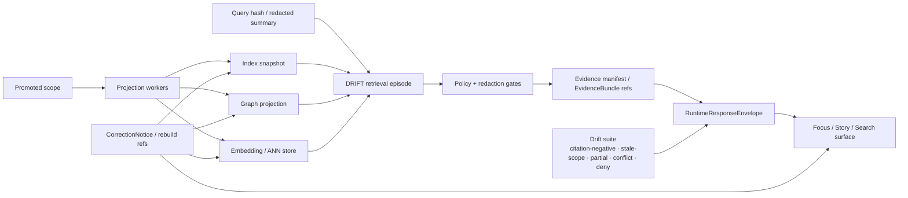

<!-- [KFM_META_BLOCK_V2]
doc_id: kfm://doc/REQUIRES-UUID
title: Search Drift
type: standard
version: v1
status: draft
owners: REQUIRES-OWNER-VERIFICATION
created: REQUIRES-DATE-VERIFICATION
updated: REQUIRES-DATE-VERIFICATION
policy_label: REQUIRES-POLICY-LABEL
related: [docs/search/drift/stac/README.md, docs/search/drift/provenance/README.md, REQUIRES-RELATED-ID-VERIFICATION]
tags: [kfm, search, drift, retrieval, verification]
notes: [Source-bounded draft; current-session workspace evidence remained PDF-only, and mounted repo paths/owners/dates still need direct verification; preserves prior DRIFT directory terminology found in attached search docs.]
[/KFM_META_BLOCK_V2] -->

# Search Drift

Govern DRIFT and other search-derived surfaces so retrieval, ranking, graph expansion, and evidence bundling stay release-linked, evidence-resolvable, and visibly correctable.

> [!IMPORTANT]
> **Source-bounded posture**
> This draft is grounded in the attached KFM corpus. The current session did **not** expose a mounted repo tree, workflow YAMLs, tests, manifests, or runtime logs, so file-level and implementation claims below are explicitly labeled **CONFIRMED**, **INFERRED**, **PROPOSED**, **UNKNOWN**, or **NEEDS VERIFICATION**.

## Impact block

**Status:** experimental  
**Owners:** REQUIRES-OWNER-VERIFICATION  
**Path:** `docs/search/drift/README.md`


**Quick jump:** [Scope](#scope) · [Repo fit](#repo-fit) · [Inputs](#inputs) · [Exclusions](#exclusions) · [Directory tree](#directory-tree) · [Quickstart](#quickstart) · [Usage](#usage) · [Diagram](#diagram) · [Tables](#tables) · [Task list](#task-list) · [FAQ](#faq) · [Appendix](#appendix)

## Truth legend

| Label | Meaning in this README |
|---|---|
| **CONFIRMED** | Directly supported by the attached KFM corpus visible in this session |
| **INFERRED** | Strongly implied by attached KFM doctrine or prior attached search docs, but not directly verified in a mounted repo |
| **PROPOSED** | Recommended starter shape, control, or workflow |
| **UNKNOWN** | Not supported strongly enough to present as current project fact |
| **NEEDS VERIFICATION** | Should be checked against the mounted repo, workflow inventory, schemas, or runtime before treating as settled |

---

## Scope

KFM treats **search**, **graph**, **vector**, **tile**, **scene**, **cache**, and **summary** layers as **derived projections**, not sovereign truth. Search drift is therefore broader than “ranking got worse.” It is any divergence between a search-derived surface and the **released, policy-safe, evidence-resolvable scope** it is supposed to represent.

This README covers the governance problem that sits over search-derived behavior:

- release-linked search indexes
- graph expansion and related-document traversal
- embedding / ANN retrieval acceleration
- privacy-safe query representation
- retrieval episode provenance
- stale, partial, conflicted, generalized, denied, or withdrawn output states
- correction, rollback, and rebuild expectations for search-derived layers

It does **not** redefine core KFM doctrine. It applies that doctrine specifically to retrieval and search-adjacent surfaces.

> [!NOTE]
> Attached search docs also describe this directory as **DRIFT Search Integration**: a hybrid global→local retrieval pattern spanning semantic initialization, embedding/community retrieval, graph-local precision retrieval, and STAC/DCAT context ingestion. This README keeps that continuity, but centers the governing KFM problem the doctrine cares most about: **drift in derived retrieval surfaces**.

### Search drift at a glance

| Question | Governing answer |
|---|---|
| What drifts? | Any derived retrieval or ranking surface that diverges from released, policy-safe, evidence-resolvable scope |
| What stays authoritative? | Released, evidence-backed truth — not search, graph, embedding, or cache layers |
| What must remain visible? | Freshness, provenance, policy state, correction lineage, and negative runtime outcomes |
| Who may serve outward search behavior? | Governed API and evidence resolver only |
| What happens on failure? | The system narrows, generalizes, abstains, denies, errors, or marks state visibly rather than bluffing |

[Back to top](#search-drift)

---

## Repo fit

| Item | Value |
|---|---|
| **Path** | `docs/search/drift/README.md` |
| **Role** | README-like directory doc for drift governance, DRIFT search continuity, validation expectations, and correction behavior |
| **Upstream** | [Docs root][docs-root] · [Semantic Search][semantic-search] · [Query Language][query-language] · [Index Architecture][index-architecture] · [FAIR+CARE Search Rules][faircare-search-rules] *(all INFERRED from attached search docs; verify in mounted repo)* |
| **Downstream** | [DRIFT STAC][drift-stac] · [DRIFT Provenance][drift-provenance] *(INFERRED from attached search docs; verify in mounted repo)* |
| **Operational companions** | `data/stac/search/drift/` · `data/processed/search/drift/` · `data/processed/prov/search/drift/` · `mcp/runs/search/drift/` *(INFERRED; verify in mounted repo)* |

### Current fit statement

**CONFIRMED**

- KFM doctrine keeps search-derived layers subordinate to evidence, policy, release state, and correction lineage.
- Focus Mode and related runtime surfaces must retrieve admissible evidence, resolve `EvidenceRef` to `EvidenceBundle`, apply policy, and emit only `ANSWER`, `ABSTAIN`, `DENY`, or `ERROR`.
- Trust-visible surfaces must expose provenance, freshness, review state, and policy context at the point of use.

**INFERRED**

- `docs/search/drift/` is the correct doctrinal seam for connecting those rules to DRIFT-style retrieval, graph expansion, index snapshots, and runtime drift handling.

**NEEDS VERIFICATION**

- Mounted repo ownership, actual file inventory, CI entrypoints, schema inventory, workflow names, and current implementation stack.

[Back to top](#search-drift)

---

## Inputs

Accepted here:

- drift classes for search-derived KFM surfaces
- release-linkage rules for search indexes, graph traversal, reranking, and embedding-backed retrieval
- privacy-safe query representation rules (`query_hash`, redacted summaries, retention limits)
- retrieval-episode identity and provenance expectations
- evidence manifest / `EvidenceBundle` resolution expectations
- citation-negative, stale-scope, partial-coverage, conflict, and deny-path validation guidance
- correction, rebuild, rollback, and stale-visible runbooks
- trust-visible UI expectations for search-derived surface state
- registries, matrices, fixtures, and templates that help reviewers detect or explain drift

### Typical source objects

- promoted dataset or release references
- index snapshot references
- query hashes or redacted query summaries
- policy bundle hashes or decision references
- evidence manifests
- `EvidenceBundle` references
- validation logs and drift reports
- provenance bundles for retrieval episodes
- correction notices and rebuild references

[Back to top](#search-drift)

---

## Exclusions

This directory is **not** the place for:

- canonical truth authoring
- raw ingestion or source admission policy
- unrestricted storage of raw query text or precise sensitive geometry
- direct client-to-store search bypasses
- UI-only search polish detached from evidence behavior
- making graph, embeddings, or indexes the only place meaning survives
- uncited answer generation presented as truth
- speculative route names, DTOs, service names, or workflow claims presented as settled repo fact

### Route elsewhere

| Does not belong here | Goes instead |
|---|---|
| Canonical entities, observations, or dataset versions | contract / canonical data surfaces |
| Rights or sensitivity adjudication | policy / review surfaces |
| Public shell choreography beyond search-specific behavior | UI / shell doctrine docs |
| Model-runtime installation details | runtime or infrastructure docs |
| Standards-profile implementation details | contracts / profiles / validator docs |
| Concrete CI wiring or workflow names | mounted workflow files after direct verification |

[Back to top](#search-drift)

---

## Directory tree

**INFERRED / PROPOSED starter tree based on attached DRIFT search docs**

```text
docs/search/drift/
├── README.md                               # this file
├── workflows/                              # INFERRED: global→local DRIFT execution
├── hyde/                                   # INFERRED: semantic/query reformulation
├── embeddings/                             # INFERRED: governed embedding artifacts or configs
├── graph-queries/                          # INFERRED: graph-local traversal/query templates
├── stac/
│   └── README.md                           # INFERRED: retrieval episode STAC guidance
├── provenance/
│   └── README.md                           # INFERRED: retrieval episode provenance guidance
├── fixtures/                               # PROPOSED: golden, stale, partial, conflicted, denied cases
├── reports/                                # PROPOSED: drift assessments and comparison outputs
└── runbooks/                               # PROPOSED: rebuild, rollback, stale-visible, correction
```

> [!NOTE]
> The tree above is a **review shape**, not a claim about current mounted repo contents. It preserves path continuity found in attached search docs while keeping unverified structure visible.

[Back to top](#search-drift)

---

## Quickstart

This quickstart avoids inventing repo-specific scripts or workflow names.

### 1) Verify the mounted structure first

```bash
# VERIFY actual mounted paths before treating any path here as current fact
tree docs/search
tree docs/search/drift

# FIND adjacent references before editing prose
rg -n "Search Drift|DRIFT Search|EvidenceBundle|RuntimeResponseEnvelope|Focus Mode" docs src tests .github
```

### 2) Confirm every search-derived surface can answer the same trust questions

Before treating any search behavior as acceptable, confirm it can answer:

1. Which **released scope** or **index snapshot** did this run use?
2. Which **policy bundle** or decision grammar constrained it?
3. Can consequential outward claims still resolve to an admissible `EvidenceBundle`?
4. Is the result still within freshness, release, and correction tolerance?
5. If the result is partial, conflicted, generalized, or denied, does the surface say so plainly?

### 3) Run or define the minimum drift suite

At minimum, drift review should exercise:

- citation-negative behavior
- stale-scope behavior
- partial-coverage behavior
- corroboration-conflict behavior
- deny / abstain / error behavior
- query privacy / redaction behavior
- correction propagation behavior

### 4) Record drift as governed evidence

A drift review is not a private judgment call. Record:

- reviewed surface or workflow
- release / snapshot basis
- observed drift class
- supporting traces or manifests
- required rebuild / rollback / correction action
- reviewer, date, and verification outcome

[Back to top](#search-drift)

---

## Usage

### For maintainers

Use this directory to keep DRIFT and other search behavior subordinate to KFM law:

- no hidden bypass around governed APIs
- no search surface that outruns released scope
- no graph or embedding layer quietly becoming authority
- no query handling that leaks what policy required to hash, redact, or generalize
- no correction path that disappears behind cache convenience

### For reviewers

Use this README as the review frame when asking:

- Did retrieval outrun released scope?
- Did the result remain one hop from evidence?
- Did graph expansion cross into source-dependent or conflict-prone material without visible state?
- Did query handling preserve privacy, policy, and provenance?
- Can correction, supersession, or withdrawal propagate visibly to the outward surface?

### For UI / app engineers

Treat drift as a **surface-state problem**, not just a backend-quality problem. A technically correct backend paired with a bluffing UI is still a trust failure.

### For retrieval / platform engineers

Treat indexes, graph projections, embedding stores, rerankers, and query reformulation as **replaceable derived layers**. If the current implementation still uses components such as Neo4j, ANN stores, or LlamaIndex-style retrieval, those remain bounded by release linkage, policy, and evidence resolution rather than becoming truth-bearing systems of record.

[Back to top](#search-drift)

---

## Diagram



### Reading the diagram

- **Promoted scope** stays upstream.
- Search, graph, and embedding layers are **projection artifacts** built from promoted scope.
- A governed retrieval episode should enter through a privacy-safe query representation, not an undocumented opaque path.
- `EvidenceBundle` resolution and policy checks sit **before** outward runtime behavior.
- Correction must travel forward into every affected derived surface.

[Back to top](#search-drift)

---

## Tables

### Drift matrix

| Drift class | Typical symptom | Why it matters in KFM | Required visible signal | Default correction path |
|---|---|---|---|---|
| **Release drift** | Search or retrieval reflects older or mismatched promoted scope | Outward claims may look current while actually being stale | snapshot mismatch, stale flag, rebuild age | rebuild or relink to promoted scope |
| **Evidence drift** | Result can no longer resolve cleanly to admissible evidence | Violates cite-or-abstain and inspectability | failed `EvidenceRef` → `EvidenceBundle` resolution | abstain, deny, or correct |
| **Policy drift** | Output outruns rights, sensitivity, or review posture | Public-safe publication may be breached | policy mismatch, obligation failure | deny, narrow, generalize, or escalate |
| **Provenance drift** | Retrieval run lacks stable episode identity or lineage | Run becomes hard to audit or compare | missing `episode_id`, `query_hash`, snapshot ref, or validation log | fail closed and restore provenance completeness |
| **Query / privacy drift** | Raw query text, precise geometry, or restricted identifiers leak | Search becomes a data-governance breach | query redaction mismatch, leaked precision, missing summary-only path | hash, redact, withhold, or review |
| **Graph expansion drift** | Traversal crosses into source-dependent or conflicted relations without visible state | Expansion looks settled when it is not | source-dependent flag, conflict state, expansion history | label, narrow, or abstain |
| **Ranking drift** | Relevance changes degrade evidence quality or policy fit | Search becomes persuasive but less trustworthy | golden-query regression, evidence-quality regression | retune, rebuild, or narrow scope |
| **Embedding drift** | Embedding store semantics change independently of release-backed truth | Meaning may survive only in a derived layer | snapshot mismatch, low evidence-resolution rate | rebuild embeddings from promoted scope |
| **Correction drift** | Superseded or withdrawn material remains ranked as current | Breaks lineage and user trust | missing correction linkage, withdrawn-result leakage | propagate correction and rebuild affected layers |
| **Surface drift** | UI hides stale, partial, generalized, conflicted, denied, or withdrawn state | Trust fails even if backend is partly correct | absent chips, badges, or refusal cues | fix surface state and align runtime envelope |

### Minimum validation suite

| Test family | What it proves | Fail-closed behavior |
|---|---|---|
| **Citation-negative** | The system refuses or narrows when user-visible claims cannot be citation-verified | `ABSTAIN`, `DENY`, or `ERROR` |
| **Stale-scope** | Derived surfaces do not silently serve beyond declared freshness or release tolerance | visible `stale-visible` state or rebuild |
| **Partial-coverage** | Incomplete retrieval stays labeled incomplete instead of being smoothed into fluency | `partial` disclosure in-place |
| **Corroboration-conflict** | Conflict-prone expansion stays visibly source-dependent or conflicted | visible conflict state, review escalation, or abstention |
| **Deny / abstain / error** | Negative outcomes are first-class and testable, not embarrassing edge cases | explicit primary outcome in runtime envelope |
| **Query privacy / redaction** | Query handling respects classification, hashing, and geometry generalization rules | withhold raw query text and sensitive precision |
| **Correction propagation** | Supersession, withdrawal, or narrowing reaches every affected search-derived layer | rebuild refs + visible correction state |

> [!IMPORTANT]
> A smooth answer that cannot reconstruct its evidence path is a **failure**, even if the prose sounds plausible.

### Minimum governed artifact set

| Object | Minimum purpose | Minimum fields / state | Status |
|---|---|---|---|
| **Query representation** | Privacy-safe seed for reproducible retrieval | `query_hash`; optional redacted summary; raw text only when policy allows | **INFERRED** from attached DRIFT docs |
| **Episode identifier** | Stable identity for a governed retrieval run | deterministic `episode_id` derived from query + constraints + workflow + policy + snapshot basis | **INFERRED** |
| **Index snapshot reference** | Proves what the retrieval ran against | `index_snapshot_id` or equivalent lineage reference | **INFERRED** |
| **Evidence manifest / bundle refs** | Preserves drill-through to support | stable evidence refs, release linkage, rights/sensitivity state | **CONFIRMED doctrine / INFERRED packaging** |
| **Decision envelope ref** | Makes policy result machine-readable | subject, action, result, reason codes, obligation codes, audit ref | **CONFIRMED doctrine** |
| **Projection build receipt** | Proves search / graph / embedding surface was built from known release scope | release ref, projection type, build time, freshness basis | **CONFIRMED doctrine** |
| **Runtime response envelope** | Makes outward runtime behavior accountable | surface class, surface state, result, citations check, decision ref, audit ref | **CONFIRMED doctrine** |
| **Provenance bundle** | Preserves run lineage | PROV-O JSON-LD; optional OpenLineage; policy-event summary | **INFERRED** from attached DRIFT provenance docs |
| **Validation log / drift report** | Shows which suites ran and what failed | test family list, subject refs, pass/fail, reviewer or runner | **PROPOSED packaging** |
| **Correction notice / rebuild refs** | Preserves visible lineage under change | affected surfaces, rebuild refs, replacement refs, public note | **CONFIRMED doctrine** |

#### Illustrative only — retrieval episode shape

The example below is a **shape illustration**, not a verified mounted schema.

```json
{
  "episode_id": "urn:kfm:search:drift:episode:0123abcd4567ef89",
  "query_hash": "sha256:…",
  "index_snapshot_id": "urn:kfm:search:index:snapshot:…",
  "surface_state": "stale-visible",
  "decision_ref": "urn:kfm:decision:…",
  "evidence_refs": ["urn:kfm:evidence:…"],
  "validation": ["citation-negative", "stale-scope"]
}
```

[Back to top](#search-drift)

---

## Search drift rules

### 1) Search is derived until proven otherwise

Search indexes, graph projections, embedding stores, rerankers, and summary surfaces are acceleration layers. They are valuable, but they are not authoritative truth.

### 2) Retrieval must stay one hop from evidence

A strong result is not merely relevant. It must remain reconstructable to inspectable support at the moment of use.

### 3) Release mismatch is a first-class failure

A result tied to the wrong snapshot or the wrong release window is not “close enough.” It is drift.

### 4) Privacy / redaction drift is still drift

A search surface that leaks raw query text, precise sensitive geometry, or restricted identifiers is not merely sloppy. It is policy drift with trust consequences.

### 5) Rebuild beats silent patching

Because search-derived surfaces are rebuildable by default, drift should usually be corrected by rebuild, relinking, or visible correction propagation rather than UI-only mitigation.

### 6) Negative outcomes are valid outcomes

A system that abstains, denies, or errors honestly when drift prevents a trustworthy answer is behaving correctly.

[Back to top](#search-drift)

---

## Trust-visible surface states

A search surface is healthy when the user can tell, without guesswork:

- what release or snapshot basis they are reading from
- whether the result is promoted, stale-visible, generalized, partial, conflicted, or withdrawn
- whether the result is source-dependent or modeled
- how to open the supporting evidence
- whether a correction, supersession, or narrowing has already occurred

| Surface cue | Meaning |
|---|---|
| **Promoted** | Result is within approved released scope |
| **Generalized** | Precision reduced for policy or publication reasons |
| **Partial** | Coverage incomplete or support not full |
| **Stale-visible** | Still shown, but not current enough to imply freshness |
| **Source-dependent** | Result depends on a source family or relation that remains context-sensitive |
| **Conflicted** | Independent sources disagree materially |
| **Withdrawn / superseded** | Replaced or removed with visible lineage |
| **Denied** | Policy blocks the requested surface or action |
| **Abstained** | Evidence path or citation checks were insufficient for a trustworthy answer |

> [!TIP]
> Search quality and search honesty are different things. KFM needs both.

[Back to top](#search-drift)

---

## Definition of done

A search-drift change is ready when all of the following are true:

- [ ] every governed retrieval run records a stable `episode_id` and privacy-safe query representation
- [ ] every search-derived surface names its release or snapshot basis
- [ ] consequential outward results still resolve to admissible evidence
- [ ] citation-negative and stale-scope tests fail closed
- [ ] partial, source-dependent, conflicted, denied, and abstained states remain visible at the surface
- [ ] correction lineage propagates into search, graph, and embedding outputs
- [ ] raw query text and precise geometry are stored only when policy explicitly allows it
- [ ] search, graph, vector, cache, or summary layers do not back-write authority
- [ ] changed thresholds, fixtures, reports, or runbooks move with the behavior
- [ ] owners, paths, workflow names, schemas, and CI references are verified before being documented as current repo fact

[Back to top](#search-drift)

---

## Task list

### Immediate

- [ ] verify actual contents of `docs/search/drift/`
- [ ] verify whether `stac/README.md` and `provenance/README.md` already exist
- [ ] identify current owners, review cadence, and policy label for this directory
- [ ] confirm whether the mounted implementation still uses the DRIFT naming and the same retrieval stack assumptions

### Near-term

- [ ] define a golden-query set and a citation-negative set
- [ ] define stale / partial / conflicted / denied fixtures
- [ ] define a minimal retrieval-episode report or receipt shape
- [ ] verify whether snapshot references, policy bundle hashes, and correction refs already exist somewhere else in the repo

### Later

- [ ] connect drift checks to correction workflows
- [ ] connect retrieval episodes to STAC / PROV outputs where that pattern is already adopted
- [ ] align runtime response envelopes, surface-state chips, and reviewer runbooks
- [ ] publish steward-facing stale-visible, rollback, and rebuild runbooks once mounted paths are known

[Back to top](#search-drift)

---

## FAQ

### What counts as “drift” here?

Any mismatch between a search-derived surface and the released, policy-safe, evidence-resolvable scope it is supposed to represent.

### Is DRIFT the same thing as search drift?

No. In the attached search docs, **DRIFT** names the retrieval architecture pattern and is expanded there as **Dynamic Retrieval Inference Flow Technique**. **Search drift** is the governance problem this README addresses across any such derived retrieval surface.

### Is low relevance enough to call something drift?

Not by itself. In KFM, drift matters most when it affects release linkage, evidence resolution, policy posture, provenance, correction lineage, or visible trust state.

### Can raw query text be stored?

Only when policy and classification explicitly allow it. The safer default described in attached DRIFT provenance guidance is hash-first representation plus an optional redacted summary.

### Are graph traversal and embeddings allowed?

Yes, as derived acceleration. They remain rebuildable and must not become the only place meaning survives.

### Can a drifted result still be shown?

Sometimes. KFM doctrine permits visible narrowed states such as generalized, partial, source-dependent, stale-visible, or withdrawn — provided those states are explicit and policy-safe.

### What is the safest fallback?

Prefer **abstain**, **deny**, **review**, or **visible narrowing** over persuasive overclaim.

[Back to top](#search-drift)

---

## Appendix

<details>
<summary><strong>Status vocabulary</strong></summary>

| Label | Meaning in this README |
|---|---|
| **CONFIRMED** | Directly supported by attached KFM materials visible in this session |
| **INFERRED** | Strongly implied by repeated doctrine or attached DRIFT search docs, but not directly proven in mounted repo state |
| **PROPOSED** | Recommended starter shape, runbook, or artifact |
| **UNKNOWN** | Not verified strongly enough in the current session |
| **NEEDS VERIFICATION** | Should be checked against the mounted repo, schema inventory, workflows, or runtime before being treated as settled fact |

</details>

<details>
<summary><strong>Open verification items</strong></summary>

The following remain open because workspace evidence stayed PDF-only:

- actual `docs/search/` and `docs/search/drift/` contents
- current owners, document UUID, dates, and policy label
- whether the upstream docs linked in older DRIFT headers still exist at the same relative paths
- whether `stac/README.md` and `provenance/README.md` are present in the mounted repo
- active schema files, fixtures, reports, and runbooks for retrieval drift
- CI workflow names and required checks
- whether the exact Neo4j / LlamaIndex / HyDE stack described in attached older search docs is still the mounted implementation
- whether retrieval episodes currently emit snapshot refs, provenance bundles, or validation logs as operational artifacts

</details>

<details>
<summary><strong>Name continuity: Search Drift vs DRIFT</strong></summary>

This README keeps both names on purpose.

- **Search Drift** is the governing KFM problem: derived retrieval surfaces diverging from released, policy-safe, evidence-resolvable scope.
- **DRIFT** is the directory-continuity term found in attached search docs for the retrieval architecture under this path.

That means maintainers can preserve older directory identity and adjacent docs without losing the doctrinal center of gravity KFM cares about most.

</details>

<details>
<summary><strong>Suggested review questions</strong></summary>

1. Does this README keep search subordinate to KFM truth-path law?
2. Does it preserve the authoritative-versus-derived split instead of letting retrieval layers quietly become truth?
3. Does it keep current-session verification limits visible?
4. Does it preserve prior DRIFT directory continuity without overclaiming mounted implementation?
5. Does it give maintainers a concrete validation and artifact vocabulary rather than only conceptual prose?
6. Does anything here need to be narrowed once the mounted repo is directly inspected?

</details>

---

**Current posture:** source-bounded draft rooted in attached KFM doctrine and prior DRIFT search docs; ready for mounted-repo verification and path reconciliation.

[docs-root]: ../README.md
[semantic-search]: semantic-search.md
[query-language]: query-language.md
[index-architecture]: index-architecture.md
[faircare-search-rules]: faircare-search-rules.md
[drift-stac]: stac/README.md
[drift-provenance]: provenance/README.md
