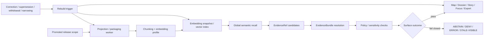

<!-- [KFM_META_BLOCK_V2]
doc_id: kfm://doc/NEEDS_VERIFICATION
title: Search Drift — Embeddings
type: standard
version: v1
status: draft
owners: NEEDS_VERIFICATION
created: NEEDS_VERIFICATION
updated: NEEDS_VERIFICATION
policy_label: NEEDS_VERIFICATION
related: [docs/search/README.md, docs/search/drift/README.md]
tags: [kfm, search, drift, embeddings]
notes: [Target file exists in task context as a scaffold replacement target; live repo values beyond current-session evidence still require verification.]
[/KFM_META_BLOCK_V2] -->

# Search Drift — Embeddings

Govern embedding-backed retrieval so vector recall stays release-linked, evidence-resolvable, policy-shaped, and rebuildable instead of becoming a hidden source of truth.

> [!IMPORTANT]
> This README is **doctrine-grounded but implementation-bounded**. It is written to replace the scaffold described in the task context without inventing mounted runtime details, concrete engine choices, or verified deployment behavior that are not directly visible in the current-session evidence.

| Field | Value |
|---|---|
| Status | **experimental** |
| Owners | **NEEDS VERIFICATION** |
| Target path | `docs/search/drift/embeddings/README.md` |
| Repo fit | Embedding-oriented search-drift guide for the governed retrieval stack |
| Upstream | **NEEDS VERIFICATION** — task context points to `../README.md` and `../../README.md` |
| Adjacent | **NEEDS VERIFICATION** — task context points to `../graph-queries/README.md`, `../hyde/README.md`, `../stac/README.md`, and related drift docs |


**Quick jump:** [Scope](#scope) · [Repo fit](#repo-fit) · [Accepted inputs](#accepted-inputs) · [Exclusions](#exclusions) · [Directory tree](#directory-tree) · [Quickstart](#quickstart) · [Usage](#usage) · [Diagram](#diagram) · [Tables](#tables) · [Embedding rules](#embedding-operating-rules) · [Task list](#task-list) · [FAQ](#faq) · [Appendix](#appendix)

---

## Scope

This directory governs **embedding-specific drift** inside KFM search.

Here, “drift” means any condition where an embedding-backed retrieval layer stops matching the **released, policy-safe, evidence-resolvable** scope it is supposed to accelerate. That includes:

- semantic recall that outlives a corrected release
- vector snapshots that still represent withdrawn or generalized material as if it were current
- model, dimension, chunking, masking, or fusion changes that alter retrieval behavior without a visible review trail
- runtime paths that let the embedding layer become the only place where meaning survives

This guide is about the **derived retrieval layer**, not the canonical truth plane.

### Core operating stance

Embedding-backed retrieval is useful when it helps the system:

- widen bounded recall over documentary, narrative, or mixed-format corpora
- route users toward evidence-resolvable records faster
- support governed synthesis surfaces without pretending semantic proximity is proof
- improve retrieval over release-backed material whose support can still be inspected

Embedding-backed retrieval is out of bounds when it:

- becomes a substitute for released evidence
- bypasses policy, review, or release linkage
- hides correction, supersession, or generalization state
- silently persists sensitive text, precise locations, or heritage context in public-safe artifacts
- acts like a direct truth surface

> [!NOTE]
> In this subtree, “embeddings” should be read broadly: vectorization, similarity search, semantic neighborhood search, candidate expansion, reranking support, and adjacent retrieval acceleration patterns. All remain downstream of promotion, policy, and evidence resolution.

[Back to top](#search-drift--embeddings)

---

## Repo fit

### Path

`docs/search/drift/embeddings/README.md`

### Why this file exists

This file exists to give the search-drift family an **embeddings-specific operating guide** that is consistent with KFM doctrine:

- derived layers stay derived
- outward meaning must still reconstruct to inspectable support
- runtime surfaces stay trust-visible
- negative outcomes remain first-class

### Evidence posture for this file

| Statement | Status | Why it matters |
|---|---|---|
| Search, graph, vector, and ranking layers must remain derived and rebuildable | **CONFIRMED** | This is the doctrinal floor for any embedding layer |
| This file should act as the embeddings-specific drift guide under `docs/search/drift/` | **INFERRED** | Fits the target path and local documentation role given in the task context |
| Exact sibling docs, subtree contents, tests, workflows, owners, and mounted commands | **NEEDS VERIFICATION** | No mounted repo tree was directly visible in the current session |

### Downstream / surface consumers

This guide matters wherever embedding-backed retrieval can change visible meaning in:

- **Map Explorer**
- **Timeline**
- **Dossier**
- **Story surface**
- **Evidence Drawer**
- **Focus Mode**
- **Compare**
- **Export**

The rule is consistent across all of them: the surface may benefit from embedding-backed recall, but the user still needs a **trust-visible route to evidence** and a stable surface state.

[Back to top](#search-drift--embeddings)

---

## Accepted inputs

This directory is the right place for material such as:

| Input class | What belongs here |
|---|---|
| Drift definitions | Embedding drift classes, failure modes, and trust consequences |
| Release linkage rules | How embedding snapshots attach to promoted scope, correction lineage, freshness basis, and rebuild triggers |
| Embedding profiles | Community/entity vector profiles or equivalent retrieval partitions, model/version metadata, dimensions, chunking, masking, and fusion notes |
| Retrieval metadata | `release_ref`, profile IDs, build time, stale-after policy, audit refs, policy posture, and rebuild triggers |
| Evaluation fixtures | Golden queries, citation-negative cases, stale-scope cases, policy-denied cases, correction propagation checks |
| Runbooks | Rebuild, rollback, supersession, stale-visible handling, generalized-vs-precise behavior |
| Surface expectations | What the UI must label when embedding-backed retrieval changes meaning |
| Review notes | Maintainer guidance for deciding whether an embedding layer can stay in service, must be rebuilt, or must fail closed |

### Typical artifact shapes

Accepted artifact shapes may include Markdown, JSON/YAML examples, fixture descriptions, evaluation notes, and runbook text.

Illustrative examples:

```text
embedding profile definitions
drift-class registries
release-linked embedding build receipts
golden-query fixture packs
surface-state expectation notes
correction propagation examples
```

[Back to top](#search-drift--embeddings)

---

## Exclusions

This directory is **not** the place for:

| Out of scope | Where it belongs instead |
|---|---|
| Canonical truth authoring for authoritative entities or observations | canonical data / contracts / schemas surfaces |
| Unpublished or quarantine retrieval over unreleased material | intake, work, quarantine, or policy/review lanes |
| Direct client-to-vector-store architecture | governed API and runtime boundary docs |
| Vendor-specific ANN tuning presented as settled KFM fact | implementation notes only after repo/runtime verification |
| Generic ML or embedding theory with no KFM consequence | research or background docs |
| Model fine-tuning strategy presented as the same thing as governed retrieval | model/runtime architecture docs |
| UI polish with no trust-state consequence | UI design docs |
| Public-safe artifacts that store raw sensitive text, precise restricted locations, or heritage-sensitive material | nowhere — reject or generalize before publication |
| Any design that lets semantic recall become the only place meaning survives | nowhere — reject it |

> [!WARNING]
> Do not place “semantic search works better” claims here unless they are tied to **release scope**, **policy posture**, **evidence handoff**, and **visible failure behavior**.

[Back to top](#search-drift--embeddings)

---

## Directory tree

The tree below is a **PROPOSED starter shape**, not a claim about mounted contents.

```text
docs/search/drift/embeddings/
├── README.md
├── fixtures/                 # golden queries, citation-negative cases, stale/correction cases
├── reports/                  # evaluation summaries and drift review notes
├── registries/               # embedding profiles, model/version metadata, drift codes
├── runbooks/                 # rebuild, rollback, supersession, stale-visible handling
└── examples/                 # illustrative retrieval and surface-state examples
```

If the mounted repo later proves a different layout, prefer the mounted structure and keep the doctrine from this file.

[Back to top](#search-drift--embeddings)

---

## Quickstart

### 1) Start with release linkage, not recall quality

Before reviewing retrieval quality, confirm that the embedding-backed artifact can answer:

1. **Which promoted release scope built this embedding snapshot or index?**
2. **Which policy posture applies to the recalled material?**
3. **Can every outward result still resolve to inspectable support?**
4. **Can correction, supersession, withdrawal, narrowing, or generalization propagate forward?**
5. **Is the layer visibly stale, partial, denied, generalized, or conflicted when it should be?**

### 2) Check the minimum proof objects

For embedding-backed retrieval, the minimum useful proof trail is usually:

- a release-linked build record such as a `ProjectionBuildReceipt` or equivalent
- visible linkage to the authoritative `DatasetVersion` or release scope it represents
- an `EvidenceBundle` path for any outward-facing answer, feature, or excerpt
- a `RuntimeResponseEnvelope` or equivalent auditable response contract for runtime surfaces
- a `CorrectionNotice` path when rebuilds or withdrawals change user-visible meaning

### 3) Run the minimum drift checks

Illustrative only — replace with verified repo commands when mounted paths are known:

```bash
# inspect the local subtree shape
find docs/search/drift -maxdepth 2 -type f | sort

# confirm release-linkage and profile metadata exist where expected
grep -R "release_ref" docs/search/drift/embeddings || true
grep -R "embedding_profile_id" docs/search/drift/embeddings || true
grep -R "audit_ref" docs/search/drift/embeddings || true
grep -R "stale_after" docs/search/drift/embeddings || true
```

Minimum review questions:

- Does the embedding snapshot point to a known release basis?
- Is the embedding profile versioned?
- Is model/version/dimension metadata visible?
- Can retrieved candidates still be resolved to evidence-bearing objects?
- Do citation-negative and stale-scope cases fail closed?
- Does correction state propagate without manual patch theater?
- Is any public-safe artifact free of raw sensitive text and exact restricted locations?

### 4) Treat these failures as merge-blocking drift signals

- retrieved item cannot be tied to promoted scope
- retrieved item resolves to no inspectable support
- recalled material ignores generalization/withhold obligations
- corrected or withdrawn material still ranks as current
- model/profile change occurred with no visible rebuild or review note
- UI presents semantic recall as settled fact instead of evidence-backed context
- public-safe embedding artifacts preserve sensitive raw text or precise restricted locations

[Back to top](#search-drift--embeddings)

---

## Usage

### For maintainers

Use this README when deciding whether an embedding-backed retrieval layer is:

- healthy and rebuildable
- stale but still safely labelable
- invalid and in need of rebuild
- unsafe for outward use until policy/evidence gaps are fixed

### For reviewers

Use this guide to review pull requests that touch:

- embedding or vector snapshot builds
- chunking and profile changes
- retrieval fusion logic
- runtime evidence handoff
- UI trust-state behavior for semantic recall

### For search / retrieval engineers

Use this guide to keep embedding work subordinate to:

- promoted release scope
- policy evaluation
- evidence resolution
- correction lineage
- finite outward outcomes

### For UI engineers

Use this guide when semantic retrieval changes what the user sees in:

- Focus Mode
- Dossier context panes
- Evidence Drawer launch paths
- result lists, ranking chips, stale/partial/conflict/generalized labels

[Back to top](#search-drift--embeddings)

---

## Diagram



### Reading note

The critical handoff is **not**:

`query -> vector hit -> answer`

The critical handoff is:

`query -> embedding-assisted candidate retrieval -> evidence resolution -> policy check -> trust-visible surface outcome`

That is where KFM stays KFM.

[Back to top](#search-drift--embeddings)

---

## Tables

### Embedding drift matrix

| Drift class | What changed | Why it matters | Expected response |
|---|---|---|---|
| Release drift | Embedding snapshot points to old or ambiguous release scope | Retrieval no longer reflects publishable truth basis | Rebuild from promoted scope |
| Evidence drift | Retrieved candidates cannot resolve to inspectable support | Semantic recall outruns trust | Fail closed or demote results |
| Policy drift | Recall surfaces content outside current rights/sensitivity posture | Unsafe outward exposure | Generalize, withhold, deny, or rebuild |
| Correction drift | Superseded/withdrawn material still ranks as current | Correction lineage is broken | Rebuild and surface visible correction state |
| Profile drift | Model, dimensions, chunking, masking, or fusion changed silently | Behavior shifted without reviewable provenance | Record profile change and rerun fixtures |
| Surface drift | UI hides stale/partial/conflict/generalized state | Users misread retrieval as settled fact | Add trust-visible labels in place |
| Source-role drift | Documentary, modeled, statutory, and community material collapse into one semantic bucket | Retrieval confuses evidence classes | Preserve source-role cues and ranking controls |
| Meaning-survival drift | Embedding store becomes the only place meaning can be reconstructed | Derived layer becomes accidental authority | Reject design; restore evidence-linked reconstruction |

### Minimum metadata expected for embedding-backed artifacts

| Field | Why it matters |
|---|---|
| `embedding_profile_id` | Stable handle for the retrieval profile under review |
| `release_ref` | Proves which promoted scope the embedding snapshot came from |
| `embedding_model_ref` | Makes model/version changes reviewable |
| `dimensions` | Prevents silent semantic/index incompatibility |
| `chunking_profile` | Retrieval behavior is partly a chunking decision, not just a model decision |
| `masking_or_generalization_profile` | Shows whether sensitive text/location reduction was part of the build |
| `build_time` | Needed for freshness and rollback reasoning |
| `freshness_basis` | Explains when stale-visible state should trigger |
| `stale_after` | Makes staleness policy explicit instead of implicit |
| `policy_posture` | Ties retrieval to current rights/sensitivity obligations |
| `audit_ref` | Joins retrieval behavior to logs, traces, and decisions |
| `rebuild_trigger` | Makes correction and supersession operational rather than ad hoc |

### Minimum KFM proof objects for embedding-backed retrieval

| Proof object | Why it belongs here |
|---|---|
| `ProjectionBuildReceipt` | Proves the embedding snapshot/index was built from known promoted scope |
| `DatasetVersion` | Ties the derived snapshot back to the authoritative subject set or release window |
| `EvidenceBundle` | Keeps outward claims, excerpts, and answers reconstructible |
| `RuntimeResponseEnvelope` | Makes answer/abstain/deny/error behavior auditable at runtime |
| `DecisionEnvelope` / `ReviewRecord` | Records policy or review significance when retrieval behavior changes outward meaning |
| `CorrectionNotice` | Preserves visible lineage when rebuild, withdrawal, or narrowing changes retrieval meaning |

### Surface-state expectations

| State | What the user must be able to tell |
|---|---|
| Promoted | This retrieval path is release-backed |
| Stale-visible | Retrieval may still be shown, but not as current |
| Generalized | Precision has been intentionally reduced |
| Partial | Coverage is incomplete |
| Conflicted | Sources disagree or comparability tests failed |
| Source-dependent | Meaning depends on a weaker or less stable support path |
| Superseded / withdrawn | Material remains visible only with correction lineage |
| Abstained / denied / error | No bluffing, no confident prose without support |

[Back to top](#search-drift--embeddings)

---

## Embedding operating rules

### 1) Embeddings are derived acceleration, not authority

An embedding store may accelerate retrieval. It may not quietly become the place where meaning survives.

### 2) Release linkage outranks recall quality

A “better semantic hit” that is not tied to promoted scope is worse than a weaker hit that stays within released, policy-safe boundaries.

### 3) Evidence resolution is the real pass/fail boundary

A recalled item is not good enough because it is semantically close. It is good enough when it can still resolve to inspectable support and survive citation checks.

### 4) Rebuild beats silent patching

When release, correction, or policy posture changes, prefer explicit rebuild and review over hidden mutation of embedding contents.

### 5) Embedding profile changes are governance events

Changing model family, dimensions, chunking profile, masking profile, reranker, or fusion logic changes retrieval behavior. Treat that as reviewable drift, not routine plumbing.

### 6) Negative outcomes are valid outcomes

If retrieval cannot produce policy-safe, evidence-resolvable support, the outward surface should remain in a finite, visible state such as:

- **ABSTAIN**
- **DENY**
- **ERROR**
- **STALE-VISIBLE**
- **PARTIAL**
- **CONFLICTED**

### 7) Public-safe artifacts must not become sensitive leakage

If an embedding pipeline touches restricted, exact-location, heritage-sensitive, or otherwise steward-reviewed material, public artifacts should store only policy-safe representations: generalized text, masked fields, hashed traces, or withheld references as required.

[Back to top](#search-drift--embeddings)

---

## Task list

### Definition of done for this subtree

- [ ] Replace the scaffold with a real operating README
- [ ] Verify actual subtree contents and update the tree section
- [ ] Confirm whether sibling docs named in the task context are present in the mounted repo
- [ ] Publish one reviewed embedding profile / metadata template
- [ ] Add one release-linked `ProjectionBuildReceipt` example
- [ ] Add golden-query, citation-negative, stale-scope, and correction-propagation fixture descriptions
- [ ] Add one rebuild/correction runbook
- [ ] Link to verified schemas, tests, or commands when they exist
- [ ] Add at least one trust-visible UI example for embedding-backed recall
- [ ] Confirm owners, dates, and policy label in the KFM meta block
- [ ] Re-check local links for drift once the repo tree is mounted
- [ ] Confirm whether this subtree remains `experimental` or should be promoted

### Review gates this file should eventually support

- [ ] release-linkage review
- [ ] evidence-resolution review
- [ ] policy/generalization review
- [ ] correction propagation review
- [ ] stale-scope visibility review
- [ ] surface-state review

[Back to top](#search-drift--embeddings)

---

## FAQ

### Are embeddings allowed in KFM?

Yes — as a **derived retrieval acceleration layer**. They are acceptable when they remain rebuildable, release-linked, policy-shaped, and subordinate to evidence resolution.

### Can a semantic hit be shown directly as an answer?

Not by itself. A semantic hit should route the system toward evidence-bearing records. Outward claims still need evidence resolution and trust-visible outcome handling.

### Does changing the embedding model count as drift?

Yes. A model/version/dimension/chunking/masking change can materially alter retrieval behavior. Treat it as a reviewable change.

### Can stale embeddings still be used?

Only under a clearly labeled, policy-safe posture. “Still works” is not enough if the surface implies freshness or settled support that no longer exists.

### Is one embedding engine or ANN strategy required here?

Not from current-session evidence. This README intentionally avoids asserting a mounted engine mix, model registry, or runtime topology that has not been directly verified.

### Does this file prove that embedding retrieval already exists in the live repo?

No. This is a **repo-ready control document**, not proof of mounted implementation.

### Why is this guide so strict about proof objects?

Because in KFM a derived retrieval layer may accelerate evidence resolution, but it must never outrun release scope, policy posture, or correction lineage.

[Back to top](#search-drift--embeddings)

---

## Appendix

<details>
<summary><strong>Evidence boundary and authoring notes</strong></summary>

This file is written under a narrow current-session evidence boundary.

- **CONFIRMED**: KFM doctrine treats search, graph, vector, tile, scene, and similar retrieval/delivery layers as **derived** rather than authoritative.
- **CONFIRMED**: KFM requires visible runtime outcomes, evidence resolution, and negative-path behavior.
- **CONFIRMED**: verification is cross-cutting and explicitly includes citation-negative, stale-scope, partial-coverage, and surface-state tests.
- **INFERRED**: this target file should act as the embeddings-specific drift guide for the `docs/search/drift/` family.
- **UNKNOWN / NEEDS VERIFICATION**: live repo subtree contents, engine choices, schema inventory, workflow names, tests, route tree, owners, and deployment depth.

Use this appendix to keep future revisions honest.

</details>

<details>
<summary><strong>Normalized terms used in this README</strong></summary>

| Term | Working meaning |
|---|---|
| Embedding drift | Any mismatch between embedding-backed retrieval behavior and released, policy-safe, evidence-resolvable scope |
| Release linkage | The explicit connection between a derived retrieval artifact and the promoted scope that built it |
| Evidence-resolvable support | A returned object that can still lead to inspectable support, not just semantic proximity |
| Meaning-survival risk | The anti-pattern where the embedding layer becomes the only usable reconstruction of meaning |
| Trust-visible state | A user-facing label or condition that changes interpretation: stale, generalized, partial, conflicted, withdrawn, etc. |
| Public-safe artifact | An artifact whose visible representation has already passed rights, sensitivity, precision, and audience checks |

</details>

<details>
<summary><strong>Illustrative review record fragment</strong></summary>

This is an **illustrative example**, not a confirmed mounted schema.

```json
{
  "object_type": "embedding_drift_review",
  "status": "illustrative",
  "embedding_profile_id": "NEEDS_VERIFICATION",
  "release_ref": "NEEDS_VERIFICATION",
  "audit_ref": "NEEDS_VERIFICATION",
  "checks": {
    "release_linkage": "pass|fail|needs_review",
    "evidence_resolution": "pass|fail|needs_review",
    "policy_posture": "pass|fail|needs_review",
    "correction_propagation": "pass|fail|needs_review",
    "surface_visibility": "pass|fail|needs_review"
  },
  "notes": "Replace with verified contract once mounted schema evidence exists."
}
```

</details>

---

## Maintainer note

This file intentionally upgrades the scaffold into an operating guide while refusing to bluff about mounted repo reality.

If later direct repo inspection proves a different local pattern, keep the doctrine, update the path-specific claims, and replace illustrative examples with real contracts, fixtures, tests, and runbooks.

[Back to top](#search-drift--embeddings)
