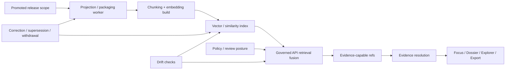

<!-- [KFM_META_BLOCK_V2]
doc_id: kfm://doc/NEEDS_VERIFICATION
title: Search Drift — Embeddings
type: standard
version: v1
status: draft
owners: NEEDS_VERIFICATION
created: NEEDS_VERIFICATION
updated: NEEDS_VERIFICATION
policy_label: NEEDS_VERIFICATION
related: [docs/search/README.md, docs/search/drift/README.md]
tags: [kfm, search, drift, embeddings]
notes: [Target file exists in the live repo as a scaffold only; values beyond visible repo evidence require verification.]
[/KFM_META_BLOCK_V2] -->

# Search Drift — Embeddings

Govern embedding-backed retrieval so vector recall stays release-linked, evidence-resolvable, policy-shaped, and rebuildable instead of becoming a hidden source of truth.

> [!IMPORTANT]
> This README is **repo-grounded but implementation-bounded**. It is designed to replace the current scaffold with a reviewable operating guide without inventing mounted runtime details, concrete engine choices, or verified deployment behavior that are not directly visible in the current repository evidence.

| Field | Value |
|---|---|
| Status | **experimental** |
| Owners | **NEEDS VERIFICATION** |
| Path | `docs/search/drift/embeddings/README.md` |
| Upstream | `../README.md`, `../../README.md` |
| Adjacent | `../graph-queries/README.md`, `../hyde/README.md`, `../stac/README.md`, `../examples/README.md` |
| Repo fit | Search-drift subguide for **embedding-oriented retrieval drift** inside the governed search stack |


**Quick jump:** [Scope](#scope) · [Repo fit](#repo-fit) · [Inputs](#accepted-inputs) · [Exclusions](#exclusions) · [Directory tree](#directory-tree) · [Quickstart](#quickstart) · [Usage](#usage) · [Diagram](#diagram) · [Tables](#tables) · [Task list](#task-list) · [FAQ](#faq) · [Appendix](#appendix)

---

## Scope

This directory documents **embedding-specific drift** inside KFM search.

Here, “drift” means any condition where an embedding-backed retrieval surface stops matching the **released, policy-safe, evidence-resolvable** scope it is supposed to accelerate. That includes semantic recall that outlives a corrected release, vector indexes that still represent withdrawn or generalized material as if it were current, chunking/model changes that alter retrieval behavior without visibility, or runtime paths that make the embedding layer the only place where meaning survives.

This guide is about the **derived retrieval layer**, not the canonical truth plane.

### Core operating stance

Embedding retrieval in KFM is useful when it helps the system:

- find likely supporting material faster
- route users toward evidence-capable references
- support bounded retrieval for governed synthesis
- improve recall over documentary, narrative, or mixed-format corpora

Embedding retrieval is **out of bounds** when it:

- becomes a substitute for released evidence
- bypasses policy, review, or release linkage
- hides correction, supersession, or generalization state
- acts like a direct truth surface

> [!NOTE]
> In this subtree, “embeddings” should be read as a **retrieval acceleration layer**: vectorization, similarity search, semantic neighborhood search, reranking support, or related mechanisms that remain downstream of promotion, policy, and evidence resolution.

[Back to top](#search-drift--embeddings)

---

## Repo fit

### Path

`docs/search/drift/embeddings/README.md`

### Why this file exists

`docs/search/README.md` already identifies `./drift/embeddings/README.md` as the embedding-oriented retrieval layer for the search system. This file fills that role with KFM-specific drift doctrine, review expectations, and implementation-safe guidance.

### Upstream relationships

- `../../README.md` — overall documentation index and evidence posture
- `../README.md` — search system overview and search-layer role
- `./` parent doctrine — search drift as a first-class operational concern

### Adjacent relationships

- `../graph-queries/README.md` — graph expansion and provenance traversal drift
- `../hyde/README.md` — query expansion and hypothesis-generation drift
- `../stac/README.md` — catalog/search drift at the metadata and discovery layer
- `../examples/README.md` — curated examples, fixtures, and testable cases

### Downstream consumers

This guide is written for work that eventually affects:

- Map Explorer
- Dossier
- Story surface
- Evidence Drawer
- Focus Mode
- Compare / Export / review surfaces where retrieval state changes visible meaning

[Back to top](#search-drift--embeddings)

---

## Accepted inputs

This directory is the right place for material such as:

| Input class | What belongs here |
|---|---|
| Drift definitions | Embedding drift classes, failure modes, and trust consequences |
| Release linkage rules | How vector artifacts attach to released scope, correction lineage, freshness basis, and rebuild triggers |
| Retrieval metadata | Model/version identifiers, dimensions, chunking profiles, build timestamps, release refs, audit refs |
| Evaluation fixtures | Golden queries, citation-negative cases, stale-scope cases, policy-denied cases, correction propagation checks |
| Runbooks | Rebuild, rollback, supersession, stale-visible handling, generalized-vs-precise behavior |
| Surface expectations | What the UI must label when embedding-backed retrieval changes meaning |
| Review notes | Maintainer guidance for deciding whether a vector layer can remain in service, must be rebuilt, or must fail closed |

### Typical artifact shapes

Accepted artifact shapes may include Markdown, JSON/YAML examples, fixture descriptions, evaluation notes, and runbook text.

Illustrative examples:

```text
embedding profile definitions
retrieval drift case catalogs
release-linked vector build records
golden-query fixture packs
surface-state expectation notes
```

[Back to top](#search-drift--embeddings)

---

## Exclusions

This directory is **not** the place for:

| Out of scope | Where it belongs instead |
|---|---|
| Canonical truth authoring or schema for authoritative entities | canonical data / contracts / schemas surfaces |
| Unpublished or quarantine retrieval over unreleased material | intake, work, quarantine, or policy/review lanes |
| Direct client-to-vector-store architecture | governed API and runtime boundary docs |
| Vendor-specific ANN tuning presented as settled KFM fact | implementation notes only after repo/runtime verification |
| Generic ML or embedding theory with no KFM consequence | research or background docs |
| Model fine-tuning strategy as if it were the same as governed retrieval | model/runtime architecture docs |
| UI polish without trust-state consequence | UI design docs |
| Any design that lets vector recall become the only place meaning survives | nowhere — reject it |

> [!WARNING]
> Do not place “semantic search works better” claims here unless they are tied to **release scope**, **policy posture**, **evidence handoff**, and **visible failure behavior**.

[Back to top](#search-drift--embeddings)

---

## Directory tree

The live repository currently verifies this README path, but does **not** verify a populated embeddings subtree beyond that scaffold. The tree below is therefore a **PROPOSED starter shape**, not a claim about mounted contents.

```text
docs/search/drift/embeddings/
├── README.md
├── fixtures/                 # golden queries, citation-negative cases, stale cases
├── reports/                  # evaluation summaries and drift review notes
├── registries/               # embedding profiles, model/version metadata, drift codes
├── runbooks/                 # rebuild, rollback, supersession, stale-visible operations
└── examples/                 # illustrative retrieval and surface-state examples
```

If the mounted repo later proves a different layout, prefer the mounted structure and keep the doctrine from this file.

[Back to top](#search-drift--embeddings)

---

## Quickstart

### 1) Start with release linkage, not recall quality

Before reviewing retrieval quality, confirm that the embedding-backed artifact can answer:

1. **Which promoted release scope built this vector artifact?**
2. **Which policy posture applies to the recalled material?**
3. **Can every outward result still resolve to inspectable evidence?**
4. **Can correction, supersession, withdrawal, or narrowing propagate forward?**

### 2) Run the minimum drift checks

Use this minimum check set even for a small slice:

```bash
# illustrative only — replace with verified repo commands when available
tree docs/search/drift
tree docs/search/drift/embeddings

# verify release linkage exists in the reviewed artifact set
grep -R "release_ref" docs/search/drift/embeddings || true
grep -R "audit_ref" docs/search/drift/embeddings || true
```

Minimum review questions:

- Does the vector artifact point to a known release basis?
- Is the embedding profile versioned?
- Is model/version/dimension metadata visible?
- Can retrieved candidates still be resolved to evidence-capable objects?
- Do citation-negative and stale-scope cases fail closed?
- Does correction state propagate without manual patch theater?

### 3) Treat these failures as merge-blocking drift signals

- retrieved item cannot be tied to promoted scope
- retrieved item resolves to no inspectable evidence
- recalled material ignores generalization/withhold obligations
- corrected or withdrawn material still ranks as current
- model/profile change occurred with no visible rebuild or review note
- UI presents semantic recall as settled fact instead of evidence-backed context

[Back to top](#search-drift--embeddings)

---

## Usage

### For maintainers

Use this README when deciding whether an embedding-backed retrieval layer is:

- healthy and rebuildable
- stale but still safely labelable
- invalid and in need of rebuild
- unsafe for outward use until policy/evidence gaps are fixed

### For reviewers

Use this guide to review pull requests that touch:

- vector index builds
- chunking and embedding profile changes
- retrieval fusion logic
- runtime evidence handoff
- UI trust-state behavior for semantic recall

### For platform and retrieval engineers

Use this guide to keep embedding work subordinate to:

- promoted release scope
- policy evaluation
- evidence resolution
- correction lineage
- finite outward outcomes

### For UI engineers

Use this guide when semantic retrieval affects what the user sees in:

- Focus Mode
- Dossier context panes
- Evidence Drawer launch paths
- result lists, ranking chips, stale/partial/conflict labels

[Back to top](#search-drift--embeddings)

---

## Diagram



### Reading note

The critical handoff is **not** `query -> vector hit -> answer`.

The critical handoff is:

`query -> vector-assisted candidate retrieval -> governed fusion -> evidence-capable refs -> evidence resolution -> trust-visible surface outcome`

That is where KFM stays KFM.

[Back to top](#search-drift--embeddings)

---

## Tables

### Embedding drift matrix

| Drift class | What changed | Why it matters | Expected response |
|---|---|---|---|
| Release drift | Vector artifact points to old or ambiguous release scope | Retrieval no longer reflects publishable truth basis | Rebuild from promoted scope |
| Evidence drift | Retrieved candidates cannot resolve to inspectable evidence | Semantic recall outruns trust | Fail closed or demote results |
| Policy drift | Recall surfaces content outside current rights/sensitivity posture | Unsafe outward exposure | Apply obligations, generalize, withhold, or deny |
| Correction drift | Superseded/withdrawn material still ranks as current | Correction lineage is broken | Rebuild and surface visible correction state |
| Profile drift | Model, dimensions, chunking, or reranker changed silently | Behavior shifted without reviewable provenance | Record profile change and rerun fixtures |
| Surface drift | UI hides stale/partial/conflict/generalized state | Users misread retrieval as settled fact | Add trust-visible labels in place |
| Source-role drift | Documentary, modeled, statutory, and community material collapse into one semantic bucket | Retrieval confuses evidence classes | Preserve source-role cues and ranking controls |
| Meaning-survival drift | Vector store becomes the only place meaning can be reconstructed | Derived layer becomes accidental authority | Reject design; restore evidence-linked reconstruction |

### Minimum metadata expected for embedding-backed artifacts

| Field | Why it matters |
|---|---|
| `embedding_profile_id` | Stable handle for the retrieval profile under review |
| `release_ref` | Proves which promoted scope the vector artifact came from |
| `embedding_model_ref` | Makes model/version changes reviewable |
| `dimensions` | Prevents silent semantic/index incompatibility |
| `chunking_profile` | Recall behavior is partly a chunking decision, not just a model decision |
| `build_time` | Needed for freshness and rollback reasoning |
| `freshness_basis` | Explains when stale-visible state should trigger |
| `policy_posture` | Ties retrieval to current rights/sensitivity obligations |
| `audit_ref` | Joins retrieval behavior to logs, traces, and decisions |
| `rebuild_trigger` | Makes correction and supersession operational rather than ad hoc |

### Surface-state expectations

| State | What the user must be able to tell |
|---|---|
| Promoted | This retrieval path is release-backed |
| Stale-visible | Retrieval may still be shown, but not as current |
| Generalized | Precision has been intentionally reduced |
| Partial | Coverage is incomplete |
| Conflicted | Sources disagree or comparability tests failed |
| Superseded / withdrawn | Material remains visible only with correction lineage |
| Abstained / denied / error | No bluffing, no confident prose without support |

[Back to top](#search-drift--embeddings)

---

## Embedding-specific operating rules

### 1) Embeddings are derived acceleration, not authority

A vector store may accelerate retrieval. It may not quietly become the place where meaning survives.

### 2) Release linkage outranks recall quality

A “better semantic hit” that is not tied to promoted scope is worse than a weaker hit that stays within released, policy-safe boundaries.

### 3) Evidence resolution is the real pass/fail boundary

A recalled item is not good enough because it is semantically close. It is good enough when it can still resolve to inspectable evidence and survive citation checks.

### 4) Rebuild beats silent patching

When release, correction, or policy posture changes, prefer explicit rebuild and review over hidden mutation of vector contents.

### 5) Embedding profile changes are governance events

Changing model family, dimensions, chunking profile, reranker, or fusion logic changes retrieval behavior. Treat that as reviewable drift, not routine plumbing.

### 6) Negative outcomes are valid outcomes

If retrieval cannot produce policy-safe, evidence-resolvable support, the outward surface should remain in a finite, visible state such as:

- **ABSTAIN**
- **DENY**
- **ERROR**
- **STALE-VISIBLE**
- **PARTIAL**
- **CONFLICTED**

[Back to top](#search-drift--embeddings)

---

## Task list

### Definition of done for this subtree

- [ ] Replace the scaffold with a real operating README
- [ ] Verify actual subtree contents and update the tree section
- [ ] Publish one reviewed embedding metadata/profile template
- [ ] Add golden-query and citation-negative fixture descriptions
- [ ] Add one rebuild/correction runbook
- [ ] Link to verified schemas, tests, or commands when they exist
- [ ] Add at least one trust-visible UI example for embedding-backed recall
- [ ] Confirm owners, dates, and policy label in the KFM meta block
- [ ] Re-check adjacent docs for link drift
- [ ] Confirm whether this subtree remains `experimental` or should be promoted

### Review gates this file should eventually support

- [ ] release-linkage review
- [ ] evidence-resolution review
- [ ] policy/generalization review
- [ ] correction propagation review
- [ ] stale-scope visibility review
- [ ] surface-state review

[Back to top](#search-drift--embeddings)

---

## FAQ

### Are embeddings allowed in KFM?

Yes — as a **derived retrieval acceleration layer**. They are acceptable when they remain rebuildable, release-linked, policy-shaped, and subordinate to evidence resolution.

### Can a semantic hit be shown directly as an answer?

Not by itself. A semantic hit should route the system toward evidence-capable references. Outward claims still need evidence resolution and trust-visible outcome handling.

### Does changing the embedding model count as drift?

Yes. A model/version/dimension/chunking change can materially alter recall behavior. Treat it as a reviewable change.

### Can stale embeddings still be used?

Only under a clearly labeled, policy-safe posture. “Still works” is not enough if the surface implies freshness or settled support that no longer exists.

### Is one vector engine or ANN strategy required here?

Not from current repo evidence. This README intentionally avoids asserting a mounted engine mix, model registry, or runtime topology that has not been directly verified.

### Is this file a proof that runtime embedding retrieval already exists?

No. This is a **repo-ready control document**, not proof of mounted implementation.

[Back to top](#search-drift--embeddings)

---

## Appendix

<details>
<summary><strong>Evidence boundary and authoring notes</strong></summary>

This file is written from a mixed evidence basis:

- **CONFIRMED**: the target file exists in the live repository, but currently as a scaffold
- **CONFIRMED**: the `docs/search` and `docs/search/drift` READMEs establish local doctrine, neighboring links, and subtree intent
- **INFERRED**: this subtree needs an embeddings-specific guide because the parent search and drift docs already name that concern explicitly
- **UNKNOWN / NEEDS VERIFICATION**: actual runtime engine choice, index implementation, embedding provider/model, dimensions in production, mounted test harness, workflow commands, and owners

Use this appendix to keep the file honest during future revision.

</details>

<details>
<summary><strong>Normalized terms used in this README</strong></summary>

| Term | Working meaning |
|---|---|
| Embedding drift | Any mismatch between embedding-backed retrieval behavior and released, policy-safe, evidence-resolvable scope |
| Release linkage | The explicit connection between a derived retrieval artifact and the promoted scope that built it |
| Evidence-capable ref | A returned object that can still lead to inspectable evidence, not just semantic proximity |
| Meaning-survival risk | The anti-pattern where the vector layer becomes the only usable reconstruction of meaning |
| Trust-visible state | A user-facing label or condition that changes interpretation: stale, generalized, partial, conflicted, withdrawn, etc. |

</details>

<details>
<summary><strong>Illustrative review record fragment</strong></summary>

This is an **illustrative example**, not a confirmed mounted schema.

```json
{
  "object_type": "embedding_drift_review",
  "status": "illustrative",
  "embedding_profile_id": "NEEDS_VERIFICATION",
  "release_ref": "NEEDS_VERIFICATION",
  "audit_ref": "NEEDS_VERIFICATION",
  "checks": {
    "release_linkage": "pass|fail|needs_review",
    "evidence_resolution": "pass|fail|needs_review",
    "policy_posture": "pass|fail|needs_review",
    "correction_propagation": "pass|fail|needs_review",
    "surface_visibility": "pass|fail|needs_review"
  },
  "notes": "Replace with verified contract once mounted schema evidence exists."
}
```

</details>

---

## Maintainer note

The current live file was only a scaffold. This replacement is intentionally structured to match the established `docs/README.md`, `docs/search/README.md`, and `docs/search/drift/README.md` rhythm: strong opener, repo fit, accepted inputs, exclusions, tree, quickstart, usage, diagram, tables, task list, FAQ, and a bounded appendix.

If the repo later mounts a verified embeddings implementation, update this document by **tightening placeholders**, not by weakening the trust posture.

[Back to top](#search-drift--embeddings)
