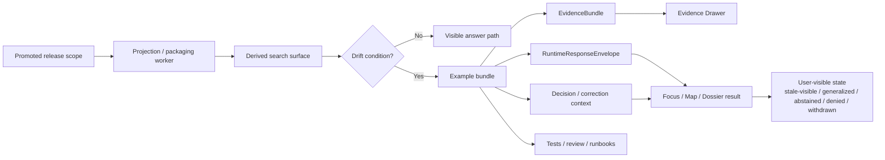

<!-- [KFM_META_BLOCK_V2]
doc_id: kfm://doc/<TODO-uuid>
title: Search Drift Examples
type: standard
version: v1
status: draft
owners: <TODO: verify owners>
created: <TODO: YYYY-MM-DD>
updated: <TODO: YYYY-MM-DD>
policy_label: <TODO: verify policy_label>
related: [<TODO: verify adjacent docs and related example/test paths>]
tags: [kfm, search, drift, examples]
notes: [Target path supplied by request; mounted repo tree was not directly verified in this session.]
[/KFM_META_BLOCK_V2] -->

# Search Drift Examples

Evidence-bounded example cases for detecting, explaining, and regression-testing drift in derived search surfaces.

> **Status:** experimental  
> **Owners:** `<TODO: verify owners>`  
>       
> **Quick jumps:** [Scope](#scope) · [Repo fit](#repo-fit) · [Inputs](#inputs) · [Directory tree](#proposed-starter-directory-tree) · [Quickstart](#quickstart) · [Usage](#usage) · [Diagram](#diagram) · [Drift scenario matrix](#drift-scenario-matrix) · [Definition of done](#definition-of-done) · [FAQ](#faq)

> [!IMPORTANT]
> This directory is for **derived-search drift examples** only. It is **not** a home for authoritative records, unrestricted evidence dumps, production indexes, or detached chatbot transcripts.

> [!NOTE]
> Truth posture used in this README: **CONFIRMED** for KFM doctrine reflected from the attached March 2026 manuals; **PROPOSED** for starter directory shape and example packaging; **UNKNOWN / NEEDS VERIFICATION** for mounted repo topology, neighboring links, owners, dates, and live test wiring.

---

## Scope

This directory exists to make **search drift** concrete and reviewable.

In KFM terms, search, graph, vector, tile, cache, scene, and ranking layers are derived accelerators. They can improve retrieval, but they must not quietly become sovereign truth. That means drift is not just a ranking problem. It is any case where a derived search-facing surface falls out of alignment with release scope, evidence state, correction state, freshness, or policy posture.

Examples here should therefore show:

- what drift occurred
- which surface exposed it
- what the user saw
- what remained one hop away in evidence
- which outcome was valid: `ANSWER`, `ABSTAIN`, `DENY`, or `ERROR`
- which visible surface state was expected: `promoted`, `generalized`, `partial`, `stale-visible`, `source-dependent`, `conflicted`, `withdrawn`, `denied`, or `abstained`

This directory is especially relevant to search-adjacent experiences that feed or influence:

- map-native discovery
- dossier lookup
- Focus Mode
- compare flows
- export previews
- evidence drill-through

---

## Repo fit

| Item | Value |
|---|---|
| Path | `docs/search/drift/examples/README.md` |
| Role | Example catalog and authoring guide for search-drift scenarios in **derived** search/retrieval surfaces |
| Upstream | `<TODO: verify upstream overview doc for search drift>` |
| Downstream | `<TODO: verify example folders, related tests, UI payload examples, and runbooks>` |
| Audience | Search/retrieval maintainers, API/runtime maintainers, policy reviewers, QA, UX reviewers, and stewards |
| Trust boundary | Examples document **behavior and expected visibility**; they do not define canonical truth or override contracts |

### Path logic

This README belongs under `docs/` because its job is explanatory and review-oriented. The examples it describes should remain tightly coupled to contracts, policy grammar, and trust-visible UI behavior, but the README itself should stay readable in GitHub and easy to diff during design review.

---

## Inputs

Accepted inputs for this directory are **small, reviewable, public-safe example bundles**.

| Accepted input | Why it belongs here | Minimum expectation |
|---|---|---|
| Example manifests | Declares the scenario, surface, drift class, and expected result | Small, text-diffable, human-readable |
| Example `EvidenceBundle` payloads | Proves what the surface is allowed to show and inspect | Release-scoped, public-safe, citation-bearing |
| Example `RuntimeResponseEnvelope` payloads | Makes runtime behavior accountable | Includes result, surface state, audit linkage placeholder, citation outcome |
| Example `DecisionEnvelope` or equivalent decision notes | Shows policy consequences where visibility changes | Reason/obligation context is explicit |
| Example freshness or projection metadata | Makes stale or rebuilt behavior testable | Clear release linkage or stale basis |
| Example correction/supersession cases | Keeps drift tied to correction lineage | Old/new release relation is visible |
| Thin-slice domain examples | Grounds examples in a real operating lane | Prefer hydrology-first cases before broader expansion |
| Review notes or screenshots | Makes trust-visible behavior inspectable | Must show user-facing meaning change, not decorative UI only |

---

## Exclusions

The following do **not** belong here:

| Exclusion | Why it does not belong here | Put it somewhere else |
|---|---|---|
| Canonical source captures or authoritative subject data | This directory must not become a second truth store | Canonical intake / truth planes |
| Unpublished, restricted, or exact-location-sensitive evidence | Search examples must stay public-safe or intentionally generalized | Review / quarantine / restricted steward flows |
| Production search indexes or live ranking stores | Examples should be tiny, reviewable, and rebuildable | Derived delivery / runtime infrastructure |
| Policy bundles as executable source of truth | This README may reference policy behavior, but not replace policy implementation | `policy/` or equivalent verified policy location |
| Detached UI mocks with no evidence state | Search drift is trust-visible behavior, not chrome | UI architecture docs or design exploration |
| Raw model prompts / hidden chain-of-thought | KFM’s runtime truth objects are envelopes, bundles, receipts, and visible outcomes | Governed runtime logging rules |
| Free-form benchmark dumps | Performance notes are useful, but drift examples are not a metrics landfill | Ops / benchmarking / observability docs |

> [!CAUTION]
> A helpful-looking example is still wrong if it hides release scope, freshness, evidence state, or policy context.

---

## Proposed starter directory tree

> [!NOTE]
> The structure below is a **PROPOSED starter shape**, not a claim about the mounted repo. Maintain or collapse it to match the real tree once the workspace is directly verified.

```text
docs/search/drift/examples/
├── README.md
├── _template/
│   ├── example.manifest.yaml
│   ├── notes.md
│   ├── expected/
│   │   ├── evidence_bundle.json
│   │   ├── runtime_response_envelope.answer.json
│   │   ├── runtime_response_envelope.abstain.json
│   │   ├── runtime_response_envelope.deny.json
│   │   └── runtime_response_envelope.error.json
│   └── assets/
│       └── surface-state.png
├── hydrology-first/
│   └── SRCH-DRIFT-001-stale-projection/
├── stale-projection/
│   └── SRCH-DRIFT-002-release-lag/
├── release-mismatch/
│   └── SRCH-DRIFT-003-old-index-new-release/
├── source-dependent-expansion/
│   └── SRCH-DRIFT-004-mirror-vs-authority/
├── corroboration-conflict/
│   └── SRCH-DRIFT-005-conflicted-support/
├── policy-generalization/
│   └── SRCH-DRIFT-006-generalized-vs-precise/
└── correction-supersession/
    └── SRCH-DRIFT-007-withdrawn-result/
```

### Suggested per-example shape

```text
SRCH-DRIFT-###-slug/
├── README.md
├── example.manifest.yaml
├── notes.md
├── expected/
│   ├── evidence_bundle.json
│   ├── runtime_response_envelope.<outcome>.json
│   ├── decision_envelope.json
│   └── projection_build_receipt.json
└── assets/
    └── surface-state.png
```

---

## Quickstart

### For maintainers adding a new example

1. Pick a **promoted-scope** case, not an unpublished one.
2. Name the drift class clearly.
3. State which surface is under test.
4. Add the smallest evidence-safe example bundle that still proves the behavior.
5. Record the expected runtime outcome.
6. Record the expected visible surface state.
7. Add notes describing what changed in meaning and why.
8. Link related tests or runbooks if they exist in the verified repo.
9. Keep the example diff-friendly and easy to review in GitHub.

### Minimal authoring checklist

- [ ] The example is **derived-surface** focused, not canonical-truth focused.
- [ ] Release scope is explicit.
- [ ] Freshness, correction, or policy state is visible.
- [ ] Evidence remains one hop away.
- [ ] The expected user-visible behavior is written down.
- [ ] The valid outcome is declared: `ANSWER`, `ABSTAIN`, `DENY`, or `ERROR`.
- [ ] Restricted or exact-location material is generalized or excluded.
- [ ] The example can be reviewed without hidden local context.

### Illustrative starter manifest

```yaml
# Illustrative example only — starter pattern, not a verified mounted schema
example_id: SRCH-DRIFT-001-stale-projection
status: PROPOSED
surface: focus
drift_class: stale_projection
domain_lane: hydrology
release_ref: rel://<TODO>
expected_surface_state: stale-visible
expected_primary_outcome: ABSTAIN
requires_evidence_bundle: true
requires_runtime_response_envelope: true
requires_decision_context: true
notes:
  - "Use public-safe evidence only."
  - "Do not imply canonical truth from search results."
```

---

## Usage

### What each example should prove

Every example should answer five questions:

| Question | Why it matters |
|---|---|
| What drift happened? | Prevents vague “search feels wrong” reports |
| Why does it matter to meaning? | KFM cares about claim integrity, not only ranking quality |
| What must remain visible? | Trust cues must travel with the surface |
| What is the valid fail-closed outcome? | Negative outcomes are part of the contract |
| What evidence path can still be inspected? | Search remains subordinate to evidence and release scope |

### Minimum example contents

| Artifact | Purpose | Minimum contents |
|---|---|---|
| `example.manifest.yaml` | Human-readable scenario header | ID, surface, drift class, release ref, expected outcome |
| `evidence_bundle.json` | Inspectable support package | Source basis, dataset refs, lineage summary, preview policy |
| `runtime_response_envelope.*.json` | Accountable runtime output | Result, surface state, citation check, audit placeholder |
| `decision_envelope.json` | Policy consequence where relevant | Subject, action, result, reason/obligation context |
| `projection_build_receipt.json` | Derived-build trace where freshness matters | Release ref, projection type, build time, stale basis |
| `notes.md` | Reviewer-facing explanation | What changed, what stayed visible, what must fail closed |
| `surface-state.png` *(optional but recommended)* | GitHub-visible proof of UI semantics | Trust cues visible in place |

### Naming pattern

Use stable, sortable IDs.

```text
SRCH-DRIFT-001-stale-projection
SRCH-DRIFT-002-release-lag
SRCH-DRIFT-003-source-dependent-expansion
```

Keep the slug descriptive, short, and tied to the drift class rather than to an ephemeral implementation detail.

---

## Diagram



This flow is the point of the directory: make derived-surface drift legible **without** breaking the trust membrane or hiding the evidence path.

---

## Tables

### Drift scenario matrix

| Drift class | Typical trigger | What must stay visible | Valid primary outcome(s) | Minimum artifacts |
|---|---|---|---|---|
| `stale_projection` | Search index or derived projection lags behind promoted release | Freshness cue, release scope, stale label | `ABSTAIN`, `ANSWER` with `stale-visible`, or `ERROR` | `projection_build_receipt`, `runtime_response_envelope`, notes |
| `release_mismatch` | Search surface points at old release while dossier/export points at newer one | Explicit release context on both sides | `ABSTAIN` or corrected `ANSWER` after narrowing | `evidence_bundle`, `runtime_response_envelope`, decision notes |
| `source_dependent_expansion` | Search/graph expansion relies on source-dependent relations | Source-dependent state, provenance hint, uncertainty | `ANSWER` only if labeled; otherwise `ABSTAIN` | `evidence_bundle`, notes |
| `corroboration_conflict` | Independent sources disagree materially | Conflict visible in place | `ABSTAIN`, bounded `ANSWER`, or `DENY` by policy | `evidence_bundle`, `decision_envelope`, notes |
| `policy_generalization` | A precise result cannot be shown on the requested surface | Generalized / redacted state | `ANSWER` with generalized output or `DENY` | `decision_envelope`, `runtime_response_envelope`, notes |
| `correction_supersession` | Prior result has been superseded or withdrawn | Correction state, replacement linkage | `ANSWER` to replacement, or `ABSTAIN` on withdrawn path | `correction_notice`, `runtime_response_envelope`, notes |

### Outcome matrix

| Primary outcome | When it is valid | Must never do |
|---|---|---|
| `ANSWER` | Evidence resolves, citations pass, scope is admissible | Smuggle uncertainty or hidden policy failure |
| `ABSTAIN` | Support is partial, unresolved, stale beyond tolerance, or conflict-prone | Fill the gap with persuasive prose |
| `DENY` | Policy blocks the surface, precision, or audience path | Leak blocked details through summaries |
| `ERROR` | Contract/runtime/infrastructure path failed | Masquerade as successful retrieval |

### Trust cues reviewers should expect

| Cue family | Minimum expectation in examples |
|---|---|
| Scope chips | Place, time, release, or audience boundary is visible |
| Freshness cue | Release age or stale basis is explicit |
| Evidence-state chip | Partial, source-dependent, disputed, or unavailable support is visible |
| Rights / sensitivity cue | Generalized, restricted, redacted, or review-required state is visible |
| Review / correction cue | Reviewed, promoted, superseded, or withdrawn state is visible |

---

## Definition of done

A drift example is done when all of the following are true:

- [ ] The example describes a **real meaning change**, not just a UI quirk.
- [ ] The example stays downstream of promoted scope.
- [ ] The example includes enough material to inspect evidence, outcome, and surface state together.
- [ ] The example makes the fail-closed path explicit.
- [ ] The example does not require private tribal knowledge to review.
- [ ] The example preserves geography/time context where that context matters.
- [ ] The example remains small enough to diff comfortably in a pull request.
- [ ] The example does not create a second undocumented schema universe.
- [ ] The example names any placeholder paths or contracts honestly.
- [ ] The example strengthens trust-visible behavior rather than simulating certainty.

### Review checks

- [ ] Does this example prove drift in a **derived** surface rather than confusing derived output with authority?
- [ ] Is evidence still one hop away?
- [ ] Is the visible state the smallest honest state?
- [ ] Would a reviewer know whether the right outcome is `ANSWER`, `ABSTAIN`, `DENY`, or `ERROR`?
- [ ] Are generalization, redaction, staleness, or correction states visible rather than implied away?
- [ ] Does the example stay public-safe?

---

## FAQ

### Why keep examples here instead of only in tests?

Because drift in KFM is not only a backend assertion. It is a trust-visible behavior problem. Reviewers need GitHub-readable examples that connect evidence, runtime outcome, and user-visible state in one place.

### Can examples include real unpublished or restricted material?

No. This directory is for public-safe or intentionally generalized examples. Restricted or exact-location-sensitive material belongs in governed review or quarantine flows.

### Why are search examples treated so cautiously?

Because KFM treats search, graph, ranking, vector, tile, and summary surfaces as derived accelerators. They help find evidence; they do not replace evidence.

### Why does Focus Mode appear in a search-drift README?

Because Focus Mode is one of the places where search-adjacent retrieval can become misleading if release scope, evidence state, or citation verification drift out of alignment.

### Why is hydrology-first called out repeatedly?

Because it is the most credible first thin slice for proving the architecture without immediately taking on the hardest sensitivity burdens.

### Should search end in detached result lists?

Preferably no. Search should land the user in geography, time, dossier, compare, or evidence context rather than in a disconnected list that sheds trust cues.

### Does every example need screenshots?

Not necessarily, but screenshots or small rendered captures are strongly encouraged when trust-visible behavior is part of the claim.

[Back to top](#search-drift-examples)

---

## Appendix

<details>
<summary><strong>Appendix A — Starter per-example README template</strong></summary>

```markdown
# SRCH-DRIFT-### — <slug>

## What this example proves
<one paragraph>

## Drift class
`stale_projection | release_mismatch | source_dependent_expansion | corroboration_conflict | policy_generalization | correction_supersession`

## Surface under test
`map | dossier | focus | compare | export | other`

## Expected visible state
`promoted | generalized | partial | stale-visible | source-dependent | conflicted | withdrawn | denied | abstained`

## Expected primary outcome
`ANSWER | ABSTAIN | DENY | ERROR`

## Included artifacts
- `example.manifest.yaml`
- `expected/evidence_bundle.json`
- `expected/runtime_response_envelope.<outcome>.json`
- `<optional additional artifacts>`

## Reviewer notes
<short explanation of what must remain visible>
```

</details>

<details>
<summary><strong>Appendix B — Suggested naming and packaging conventions</strong></summary>

| Convention | Pattern |
|---|---|
| Example ID | `SRCH-DRIFT-###-slug` |
| Manifest file | `example.manifest.yaml` |
| Envelope files | `runtime_response_envelope.<outcome>.json` |
| Bundle file | `evidence_bundle.json` |
| Decision file | `decision_envelope.json` |
| Correction file | `correction_notice.json` |
| Optional image | `surface-state.png` |

Keep names boring, sortable, and stable.

</details>

<details>
<summary><strong>Appendix C — Fast reviewer prompts</strong></summary>

1. What drift happened?
2. Which surface exposed it?
3. Is the evidence path still inspectable?
4. Is the release or freshness context visible?
5. Is the fail-closed outcome honest?
6. Does the example protect public-safe precision rules?
7. Would this example still make sense six months from now?

</details>

[Back to top](#search-drift-examples)
