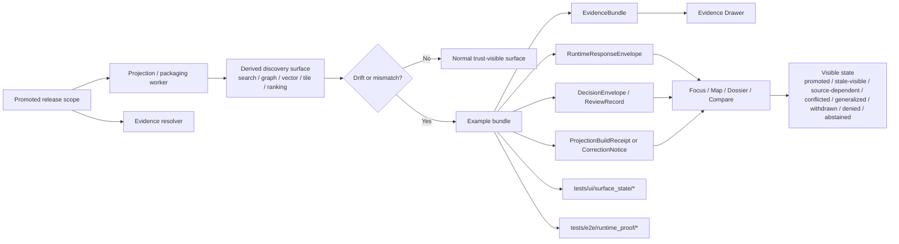

<!-- [KFM_META_BLOCK_V2]
doc_id: kfm://doc/<TODO-uuid>
title: Search Drift Examples
type: standard
version: v1
status: draft
owners: <TODO: verify owners>
created: <TODO: YYYY-MM-DD>
updated: <TODO: YYYY-MM-DD>
policy_label: <TODO: verify policy_label>
related: [<TODO: verify docs/runbooks/stale_projection.md>, <TODO: verify ui/trust_states.md>, <TODO: verify ui/focus_envelope_examples/>, <TODO: verify tests/ui/surface_state/>, <TODO: verify tests/e2e/runtime_proof/>]
tags: [kfm, search, drift, examples]
notes: [Target path is request-supplied; current-session workspace evidence was PDF-only, so repo topology, owners, dates, and adjacent mounted paths remain unverified.]
[/KFM_META_BLOCK_V2] -->

# Search Drift Examples

Evidence-bounded example cases for detecting, explaining, and regression-testing drift across derived discovery and retrieval surfaces.

> **Status:** experimental  
> **Owners:** `<TODO: verify owners>`  
>       
> **Quick jumps:** [Scope](#scope) · [Repo fit](#repo-fit) · [Inputs](#inputs) · [Directory tree](#proposed-starter-directory-tree) · [Quickstart](#quickstart) · [Usage](#usage) · [Diagram](#diagram) · [Tables](#tables) · [Definition of done](#definition-of-done) · [FAQ](#faq)

> [!IMPORTANT]
> This directory is for **derived-surface drift examples** only. It is **not** a home for canonical records, unrestricted evidence dumps, production indexes, raw model transcripts, or detached UX mockups.

> [!NOTE]
> Truth posture in this README: **CONFIRMED** for KFM doctrine reflected in the attached March 2026 manuals; **INFERRED** for the umbrella label **search drift**; **PROPOSED** for starter directory shape, example packaging, and companion paths; **UNKNOWN / NEEDS VERIFICATION** for mounted repo topology, neighboring files, owners, dates, and live test wiring.

---

## Scope

This directory exists to make **search drift** concrete, reviewable, and regression-testable.

In KFM terms, search, graph, vector, tile, scene, ranking, and summary layers are **derived accelerators**. They may speed retrieval or improve wayfinding, but they must not quietly become sovereign truth. Drift is therefore not just “ranking feels off.” It is any case where a **derived discovery or retrieval surface** stops matching promoted release scope, evidence state, freshness basis, correction lineage, or policy posture.

**Working definition used here (INFERRED):**  
**Search drift** is any user-visible discovery or retrieval behavior in a derived surface that diverges from promoted scope, evidence state, freshness basis, correction lineage, or policy-controlled visibility.

Examples here should therefore show:

- what drift occurred
- which derived surface exposed it
- what the user saw
- what remained one hop away in evidence
- which primary outcome was valid: `ANSWER`, `ABSTAIN`, `DENY`, or `ERROR`
- which visible surface state was expected: `promoted`, `generalized`, `partial`, `stale-visible`, `source-dependent`, `conflicted`, `withdrawn`, `denied`, or `abstained`

This directory is especially relevant to KFM surfaces that feed or influence:

- catalog and discovery results
- map-native layer search and contextual navigation
- Focus Mode
- dossier lookup
- compare flows
- export previews
- Evidence Drawer drill-through

### Why this matters in KFM

KFM’s doctrine is explicit that derived layers stay subordinate to promoted scope and governed evidence resolution. That makes drift examples a **trust artifact**, not just a QA convenience. A good example here should help reviewers answer, “Did the surface stay honest?” rather than only, “Did the query return something?”

---

## Repo fit

| Item | Value |
|---|---|
| Path | `docs/search/drift/examples/README.md` *(request-supplied target; mounted repo path not directly verified in this session)* |
| Role | Example catalog and authoring guide for drift in **derived** discovery and retrieval surfaces |
| Upstream | `<TODO: verify docs/runbooks/stale_projection.md>` · `<TODO: verify ui/trust_states.md>` |
| Downstream | `<TODO: verify ui/focus_envelope_examples/>` · `<TODO: verify tests/ui/surface_state/>` · `<TODO: verify tests/e2e/runtime_proof/>` |
| Audience | Search/retrieval maintainers, API/runtime maintainers, policy reviewers, QA, UX reviewers, and stewards |
| Trust boundary | Examples document expected behavior and visible trust cues; they do **not** redefine canonical truth or override contract families |

### Path logic

This README belongs under `docs/` because its job is explanatory, review-facing, and GitHub-readable.

The example bundles it describes should remain tightly coupled to contract families such as `EvidenceBundle`, `RuntimeResponseEnvelope`, `DecisionEnvelope`, `ProjectionBuildReceipt`, and `CorrectionNotice`, but this README should stay lightweight enough to review in a pull request without needing a running environment.

### Companion paths named in the March 2026 corpus

The attached March 2026 manuals name the following as plausible companion artifacts. They are useful anchors for this README, but they remain **PROPOSED / NEEDS VERIFICATION** until the mounted repo is directly checked:

- `docs/runbooks/stale_projection.md`
- `ui/trust_states.md`
- `ui/focus_envelope_examples/*`
- `tests/ui/surface_state/*`
- `tests/e2e/runtime_proof/*`

---

## Inputs

Accepted inputs for this directory are **small, reviewable, public-safe example bundles**.

| Accepted input | Why it belongs here | Minimum expectation |
|---|---|---|
| `example.manifest.yaml` | Declares the scenario, surface class, drift class, and expected result | Text-diffable, human-readable, stable ID |
| `release_manifest.json` or equivalent release linkage | Anchors the example to promoted scope instead of a free-floating surface | Release ref or equivalent outward scope reference |
| `evidence_bundle.json` | Proves what the surface is allowed to show and inspect | Source basis, dataset refs, lineage summary, preview policy |
| `runtime_response_envelope.*.json` | Makes outward runtime behavior accountable | Result, surface class, surface state, decision ref, citation check |
| `decision_envelope.json` | Shows policy consequence where visibility changes | Subject, action, result, reason codes, obligation codes |
| `projection_build_receipt.json` | Makes stale or rebuild-required behavior testable | Release ref, projection type, build time, freshness basis, stale-after policy |
| `correction_notice.json` | Makes supersession or withdrawal visible instead of implied | Affected releases, replacement linkage, rebuild refs, public note |
| Thin-slice domain examples | Grounds the examples in a credible operating lane | Prefer hydrology-first cases before broader expansion |
| Review screenshots or clipped captures | Shows user-visible meaning change in place | Trust cues must be visible, not just decorative UI chrome |

---

## Exclusions

The following do **not** belong here:

| Exclusion | Why it does not belong here | Put it somewhere else |
|---|---|---|
| Canonical source captures or authoritative subject data | This directory must not become a second truth store | Canonical intake / truth planes |
| Unpublished, restricted, or exact-location-sensitive evidence | Search examples must stay public-safe or intentionally generalized | Review / quarantine / restricted steward flows |
| Production search indexes, vector stores, graph projections, or ranking stores | Examples should be tiny, reviewable, and rebuildable | Derived delivery / runtime infrastructure |
| Policy bundles as the executable source of truth | This README may reference policy behavior, but not replace policy implementation | `policy/` or equivalent verified policy location |
| Detached UI mocks with no evidence state or release linkage | Drift is a trust-visible behavior problem, not just a visual design issue | UI architecture docs or design exploration |
| Raw model prompts or hidden chain-of-thought | KFM runtime truth objects are envelopes, bundles, receipts, and visible outcomes | Governed logging / audit rules |
| Free-form benchmark dumps | Drift examples are not a metrics landfill | Ops / benchmarking / observability docs |
| Search counts or denial patterns that leak restricted scope | KFM must fail closed without advertising hidden assets | Governed API behavior and policy tests |

> [!CAUTION]
> A helpful-looking example is still wrong if it hides release scope, freshness basis, evidence state, correction lineage, or policy narrowing.

---

## Proposed starter directory tree

> [!NOTE]
> The structure below is a **PROPOSED starter shape**, not a claim about the mounted repo. Keep, collapse, or remap it once the real tree is verified.

```text
docs/search/drift/examples/
├── README.md
├── _template/
│   ├── example.manifest.yaml
│   ├── notes.md
│   ├── expected/
│   │   ├── release_manifest.json
│   │   ├── evidence_bundle.json
│   │   ├── runtime_response_envelope.answer.json
│   │   ├── runtime_response_envelope.abstain.json
│   │   ├── runtime_response_envelope.deny.json
│   │   ├── runtime_response_envelope.error.json
│   │   ├── decision_envelope.json
│   │   ├── projection_build_receipt.json
│   │   └── correction_notice.json
│   └── assets/
│       └── surface-state.png
├── hydrology-first/
│   ├── SRCH-DRIFT-001-stale-projection/
│   └── SRCH-DRIFT-002-release-mismatch/
├── discovery/
│   ├── SRCH-DRIFT-003-source-dependent-expansion/
│   ├── SRCH-DRIFT-004-corroboration-conflict/
│   └── SRCH-DRIFT-005-citation-failure/
├── policy/
│   └── SRCH-DRIFT-006-generalized-vs-precise/
└── correction/
    └── SRCH-DRIFT-007-withdrawn-result/
```

### Suggested per-example shape

```text
SRCH-DRIFT-###-slug/
├── README.md
├── example.manifest.yaml
├── notes.md
├── expected/
│   ├── release_manifest.json                # preferred when release mismatch matters
│   ├── evidence_bundle.json
│   ├── runtime_response_envelope.<outcome>.json
│   ├── decision_envelope.json               # where policy or review result matters
│   ├── projection_build_receipt.json        # where freshness or stale-after matters
│   └── correction_notice.json               # where supersession or withdrawal matters
└── assets/
    └── surface-state.png
```

---

## Quickstart

### For maintainers adding a new example

1. Pick a **promoted-scope** case, not an unpublished one.
2. Name the drift class clearly.
3. State which surface is under test.
4. Make release linkage explicit.
5. Add the smallest public-safe evidence bundle that still proves the behavior.
6. Record the expected runtime outcome.
7. Record the expected visible surface state.
8. Record the relevant reason codes and obligation codes.
9. Add notes describing what changed in meaning and why.
10. Link companion tests or runbooks if they exist in the verified repo.

### Minimal authoring checklist

- [ ] The example is **derived-surface** focused, not canonical-truth focused.
- [ ] Release scope is explicit.
- [ ] Freshness, correction, or policy state is visible.
- [ ] Evidence remains one hop away.
- [ ] The expected user-visible behavior is written down.
- [ ] The primary outcome is declared: `ANSWER`, `ABSTAIN`, `DENY`, or `ERROR`.
- [ ] Relevant reason codes and obligation codes are present.
- [ ] Restricted or exact-location material is generalized or excluded.
- [ ] The example can be reviewed without hidden local context.
- [ ] The example stays small enough to diff comfortably in GitHub.

### Illustrative starter manifest

```yaml
# Illustrative example only — starter pattern, not a verified mounted schema
example_id: SRCH-DRIFT-001-stale-projection
status: PROPOSED
surface_class: focus
drift_class: stale_projection
domain_lane: hydrology
release_ref: rel://<TODO>
expected:
  primary_outcome: ABSTAIN
  surface_state: stale-visible
  reason_codes:
    - projection.stale
  obligation_codes:
    - rebuild_projection
    - cite
artifacts:
  requires:
    - expected/evidence_bundle.json
    - expected/runtime_response_envelope.abstain.json
    - expected/projection_build_receipt.json
notes:
  - "Use public-safe evidence only."
  - "Do not imply canonical truth from search or retrieval results."
```

---

## Usage

### What each example should prove

Every example should answer five questions:

| Question | Why it matters |
|---|---|
| What drift happened? | Prevents vague “search feels wrong” reports |
| Why does it matter to meaning? | KFM cares about claim integrity, not only ranking quality |
| What must remain visible? | Trust cues must travel with the surface |
| What is the valid fail-closed outcome? | Negative outcomes are part of the contract |
| What evidence path can still be inspected? | Discovery remains subordinate to evidence and release scope |

### Minimum example contents

| Artifact | Purpose | Minimum contents |
|---|---|---|
| `example.manifest.yaml` | Human-readable scenario header | ID, surface class, drift class, release ref, expected outcome |
| `release_manifest.json` *(preferred where relevant)* | Anchors the scenario to promoted scope | Release ID, profile refs, outward scope reference |
| `evidence_bundle.json` | Inspectable support package | Source basis, dataset refs, lineage summary, preview policy |
| `runtime_response_envelope.*.json` | Accountable runtime output | Result, surface class, surface state, citation check, decision ref |
| `decision_envelope.json` | Policy consequence where relevant | Subject, action, result, reason/obligation codes |
| `projection_build_receipt.json` | Derived-build trace where freshness matters | Release ref, projection type, build time, stale basis |
| `correction_notice.json` | Supersession or withdrawal lineage | Affected releases, replacement linkage, rebuild refs |
| `notes.md` | Reviewer-facing explanation | What changed, what stayed visible, what must fail closed |
| `surface-state.png` *(optional but recommended)* | GitHub-visible proof of UI semantics | Trust cues visible in place |

### Reason and obligation hooks

Examples should prefer **actual KFM decision grammar** over free-form prose.

| Concern | Example reason code(s) | Example obligation code(s) | Typical visible consequence |
|---|---|---|---|
| Missing or unreconstructible support | `runtime.evidence_missing` | `cite`, `disclose_partial` | `ABSTAIN` or `ERROR` |
| Citation verification failure | `runtime.citation_failed` | `cite` | `ABSTAIN` or `ERROR` |
| Stale derived projection | `projection.stale` | `rebuild_projection`, `cite` | `stale-visible`, `ABSTAIN`, or corrected `ANSWER` |
| Policy narrowing / blocked precision | `policy.denied` | `generalize`, `withhold`, `review_required` | `generalized`, `DENY`, or steward escalation |
| Material corroboration conflict | `corroboration.conflicted` | `disclose_partial`, `review_required`, `correction_notice` | `conflicted`, `ABSTAIN`, or bounded `ANSWER` |

### Naming pattern

Use stable, sortable IDs.

```text
SRCH-DRIFT-001-stale-projection
SRCH-DRIFT-002-release-mismatch
SRCH-DRIFT-003-source-dependent-expansion
SRCH-DRIFT-004-corroboration-conflict
SRCH-DRIFT-005-citation-failure
```

Keep the slug descriptive, short, and tied to the drift class rather than to an ephemeral implementation detail.

---

## Diagram



The point of the directory is to make derived-surface drift legible **without** breaking the trust membrane or hiding the evidence path.

---

## Tables

### Drift scenario matrix

| Drift class | Typical trigger | What must stay visible | Valid primary outcome(s) | Minimum artifacts |
|---|---|---|---|---|
| `stale_projection` | Search index, tile, graph view, or other projection lags promoted release | Freshness cue, release scope, stale label | `ABSTAIN`, `ANSWER` with `stale-visible`, or `ERROR` | `projection_build_receipt`, `runtime_response_envelope`, notes |
| `release_mismatch` | Discovery surface points at old release while dossier/export points at newer one | Explicit release context on both sides | `ABSTAIN` or corrected `ANSWER` after narrowing | `release_manifest`, `evidence_bundle`, `runtime_response_envelope` |
| `source_dependent_expansion` | Expansion relies on source-dependent relations or non-authoritative graph hops | Source-dependent state, provenance hint, uncertainty cue | `ANSWER` only if labeled; otherwise `ABSTAIN` | `evidence_bundle`, notes |
| `corroboration_conflict` | Independent admissible sources disagree materially | Conflict visible in place | `ABSTAIN`, bounded `ANSWER`, or `DENY` by policy | `evidence_bundle`, `decision_envelope`, notes |
| `citation_failure` | Retrieval succeeded but user-visible claims failed citation verification | Failure is visible; no bluff answer path | `ABSTAIN` or `ERROR` | `runtime_response_envelope`, `evidence_bundle`, notes |
| `policy_generalization` | A precise result cannot be shown on the requested surface | Generalized / redacted state | `ANSWER` with generalized output or `DENY` | `decision_envelope`, `runtime_response_envelope`, notes |
| `correction_supersession` | Prior result has been superseded or withdrawn | Correction state, replacement linkage | `ANSWER` to replacement, or `ABSTAIN` on withdrawn path | `correction_notice`, `runtime_response_envelope`, notes |

### Outcome matrix

| Primary outcome | When it is valid | Must never do |
|---|---|---|
| `ANSWER` | Evidence resolves, citations pass, scope is admissible | Smuggle uncertainty or hidden policy failure |
| `ABSTAIN` | Support is partial, stale beyond tolerance, unresolved, or conflict-prone | Fill the gap with persuasive prose |
| `DENY` | Policy blocks the surface, precision, or audience path | Leak blocked details through summaries |
| `ERROR` | Contract, runtime, or infrastructure path failed | Masquerade as successful retrieval |

### Trust cues reviewers should expect

| Cue family | Minimum expectation in examples |
|---|---|
| Scope chips | Place, time, release, or audience boundary is visible |
| Freshness cue | Release age or stale basis is explicit |
| Evidence-state chip | Partial, source-dependent, disputed, or unavailable support is visible |
| Rights / sensitivity cue | Generalized, restricted, redacted, or review-required state is visible |
| Review / correction cue | Reviewed, promoted, superseded, or withdrawn state is visible |

---

## Definition of done

A drift example is done when all of the following are true:

- [ ] The example describes a **real meaning change**, not just a UI quirk.
- [ ] The example stays downstream of promoted scope.
- [ ] The example includes enough material to inspect evidence, outcome, and surface state together.
- [ ] The example makes the fail-closed path explicit.
- [ ] The example does not require private tribal knowledge to review.
- [ ] The example preserves geography/time context where that context matters.
- [ ] The example remains small enough to diff comfortably in a pull request.
- [ ] The example does not create a second undocumented schema universe.
- [ ] The example names any placeholder paths or contracts honestly.
- [ ] The example strengthens trust-visible behavior rather than simulating certainty.

### Review checks

- [ ] Does this example prove drift in a **derived** surface rather than confusing derived output with authority?
- [ ] Is evidence still one hop away?
- [ ] Is the visible state the smallest honest state?
- [ ] Would a reviewer know whether the right outcome is `ANSWER`, `ABSTAIN`, `DENY`, or `ERROR`?
- [ ] Are generalization, redaction, staleness, conflict, or correction states visible rather than implied away?
- [ ] Does the example stay public-safe?

---

## FAQ

### Why call this “search drift” if it also covers graph, vector, tile, and ranking layers?

Because user-facing discovery often bundles those derived layers into one surface. In KFM they remain rebuildable accelerators, not authority, so one umbrella directory is useful as long as examples keep the specific surface class explicit.

### Why keep examples here instead of only in tests?

Because drift in KFM is not only a backend assertion. It is a trust-visible behavior problem. Reviewers need GitHub-readable examples that connect release scope, evidence, runtime outcome, and surface state in one place.

### Can examples include real unpublished or restricted material?

No. This directory is for public-safe or intentionally generalized examples. Restricted or exact-location-sensitive material belongs in governed review or quarantine flows.

### Why are these examples treated so cautiously?

Because KFM treats search, graph, ranking, vector, tile, scene, and summary surfaces as derived accelerators. They help users find evidence; they do not replace evidence.

### Why does Focus Mode appear in a search-drift README?

Because Focus Mode is one of the places where retrieval drift becomes directly user-visible. KFM requires scoped retrieval, citation verification, and finite negative outcomes there.

### Why is hydrology-first called out repeatedly?

Because hydrology is the most credible first thin slice for proving the architecture end to end on a public-safe, place/time-rich, operationally legible lane.

### Does every example need screenshots?

Not necessarily, but screenshots or clipped captures are strongly encouraged when trust-visible behavior is part of the claim.

[Back to top](#search-drift-examples)

---

## Appendix

<details>
<summary><strong>Appendix A — Starter per-example README template</strong></summary>

```markdown
# SRCH-DRIFT-### — <slug>

## What this example proves
<one paragraph>

## Drift class
`stale_projection | release_mismatch | source_dependent_expansion | corroboration_conflict | citation_failure | policy_generalization | correction_supersession`

## Surface under test
`catalog_discovery | map | dossier | focus | compare | export | other`

## Expected visible state
`promoted | generalized | partial | stale-visible | source-dependent | conflicted | withdrawn | denied | abstained`

## Expected primary outcome
`ANSWER | ABSTAIN | DENY | ERROR`

## Release linkage
`release_manifest.json | embedded release_ref | other explicit release anchor`

## Reason codes
- `<reason code>`

## Obligation codes
- `<obligation code>`

## Included artifacts
- `example.manifest.yaml`
- `expected/evidence_bundle.json`
- `expected/runtime_response_envelope.<outcome>.json`
- `<optional additional artifacts>`

## Reviewer notes
<short explanation of what must remain visible>
```

</details>

<details>
<summary><strong>Appendix B — Suggested naming and packaging conventions</strong></summary>

| Convention | Pattern |
|---|---|
| Example ID | `SRCH-DRIFT-###-slug` |
| Manifest file | `example.manifest.yaml` |
| Envelope files | `runtime_response_envelope.<outcome>.json` |
| Bundle file | `evidence_bundle.json` |
| Decision file | `decision_envelope.json` |
| Build receipt | `projection_build_receipt.json` |
| Correction file | `correction_notice.json` |
| Optional image | `surface-state.png` |

Keep names boring, sortable, and stable.

</details>

<details>
<summary><strong>Appendix C — Fast reviewer prompts</strong></summary>

1. What drift happened?
2. Which surface exposed it?
3. Is the evidence path still inspectable?
4. Is the release or freshness context visible?
5. Is the fail-closed outcome honest?
6. Does the example protect public-safe precision rules?
7. Would this example still make sense six months from now?

</details>

[Back to top](#search-drift-examples)
