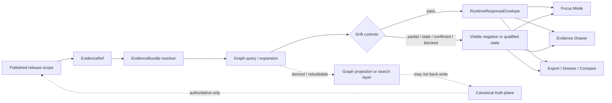

<!-- [KFM_META_BLOCK_V2]
doc_id: kfm://doc/<NEEDS-VERIFICATION-UUID>
title: Graph Query Drift
type: standard
version: v1
status: draft
owners: <NEEDS-VERIFICATION>
created: <NEEDS-VERIFICATION-YYYY-MM-DD>
updated: <NEEDS-VERIFICATION-YYYY-MM-DD>
policy_label: <NEEDS-VERIFICATION-POLICY-LABEL>
related: [docs/search/drift/README.md (NEEDS VERIFICATION), ../../../../contracts/README.md, ../../../../schemas/README.md, ../../../../policy/README.md, ../../../../.github/workflows/README.md]
tags: [kfm, search, drift, graph-queries]
notes: [Current session evidence was PDF-only; adjacency, owners, exact downstream paths, and mounted implementation depth remain review items. Doctrine in this file is anchored primarily in the March 2026 KFM canonical master manual and supporting repo-grounded summary artifacts.]
[/KFM_META_BLOCK_V2] -->

# Graph Query Drift

Derived-layer guardrails for graph traversal, expansion, and explanation in KFM search surfaces.

> [!IMPORTANT]
> This README is **source-bounded**. KFM doctrine in this file is **CONFIRMED** from the attached March 2026 manuals and repo-grounded summary artifacts. Exact neighboring docs, owners, mounted schema locations, workflow hooks, and directory contents for this path remain **UNKNOWN** unless explicitly marked otherwise.

| Field | Value |
|---|---|
| Status | `experimental` *(placeholder; NEEDS VERIFICATION)* |
| Owners | `<NEEDS VERIFICATION>` |
| Path | `docs/search/drift/graph-queries/README.md` |
| Primary role | Keep graph-query behavior subordinate to released evidence, policy, and visible trust state |
| Truth posture | **CONFIRMED doctrine** · **INFERRED shell/contract consequences** · **PROPOSED repo fit** · **UNKNOWN mounted adjacency** |

<p>
  
  
  
  
  
</p>

**Quick jumps:** [Scope](#scope) · [Repo fit](#repo-fit) · [Inputs](#inputs) · [Exclusions](#exclusions) · [Directory tree](#directory-tree) · [Quickstart](#quickstart) · [Usage](#usage) · [Diagram](#diagram) · [Reference tables](#reference-tables) · [Task list](#task-list) · [FAQ](#faq) · [Appendix](#appendix)

---

## Scope

This directory explains how **graph-based query behavior** should be described, reviewed, and kept honest when KFM uses graph traversal, expansion, or relationship-heavy retrieval to support outward surfaces.

In KFM, graph retrieval is useful. It is **not** canonical truth.

Graph, search, vector, tile, scene, cache, summary, and embedding layers are all derived and rebuildable by default unless they are explicitly promoted through governed release. This README exists to keep that boundary visible for graph-query work.

### What this README governs

This README is about graph-query behavior in:

- provenance traversal
- related-document exploration
- relationship-heavy evidence resolution
- bounded Focus interactions
- release-linked graph expansion over promoted scope
- outward explanations that rely on graph-assisted retrieval

### What “drift” means here

For this directory, **drift** means a meaningful gap between:

1. the **promoted release scope** KFM is allowed to use,
2. the **graph-query behavior** a surface actually performs,
3. the **evidence and provenance path** a reviewer or user can inspect, and
4. the **visible runtime state** presented at the point of use.

Typical examples include:

- expansion history missing even though the result depends on multi-hop traversal
- graph links that are source-dependent or conflicted but presented as settled
- query results that outrun release linkage or freshness rules
- Focus or export behavior that uses graph expansion without drill-through to evidence
- derived graph state becoming the only place where meaning survives

> [!NOTE]
> KFM treats graph retrieval as a useful accelerator for evidence resolution, not as a second truth plane. Any surface that cannot reconstruct its graph-assisted result back to released support should qualify, abstain, deny, error, or surface a visible negative state instead of bluffing.

### Truth labels used in this file

| Label | Meaning here |
|---|---|
| **CONFIRMED** | Directly supported by the attached KFM corpus or repo-grounded summary artifacts visible in this session |
| **INFERRED** | Strongly implied by repeated KFM doctrine, but not verified as mounted implementation |
| **PROPOSED** | Recommended local structure, artifact, or workflow pattern |
| **UNKNOWN** | Not verified strongly enough in the current session |
| **NEEDS VERIFICATION** | A placeholder or path-level claim that should be checked against the mounted repo before commit |

---

## Repo fit

### Path

`docs/search/drift/graph-queries/README.md`

### Upstream

The following parent docs are likely relevant, but their mounted adjacency was **not directly verified** in this session:

- [`../README.md`](../README.md) — `docs/search/drift/README.md` **NEEDS VERIFICATION**
- [`../../README.md`](../../README.md) — `docs/search/README.md` **NEEDS VERIFICATION**
- [`../../../README.md`](../../../README.md) — `docs/README.md` **NEEDS VERIFICATION**

### Downstream and adjacent doctrinal references

Repo-grounded summary artifacts indicate that the repo already has documentation surfaces for the following areas. The exact relative paths from this directory should still be checked against the mounted tree before commit:

- [`../../../../contracts/README.md`](../../../../contracts/README.md)
- [`../../../../schemas/README.md`](../../../../schemas/README.md)
- [`../../../../policy/README.md`](../../../../policy/README.md)
- [`../../../../.github/workflows/README.md`](../../../../.github/workflows/README.md)

### Why this directory belongs here

This path fits the attached KFM search doctrine because graph retrieval is admitted as a **derived retrieval method** with explicit cautions, and because graph expansion is called out as needing drift controls such as expansion history, provenance hints, release linkage, and visible status when relations are source-dependent or conflicted.

### Operational dependents

The items below are **PROPOSED starter dependents**, not mounted repo facts:

- `contracts/runtime/evidence_bundle.schema.json`
- `contracts/runtime/runtime_response_envelope.schema.json`
- `contracts/correction/correction_notice.schema.json`
- `contracts/policy/decision_envelope.schema.json`
- `policy/reason_codes.json`
- `policy/obligation_codes.json`
- `tests/contracts/*`
- `tests/policy/*`
- `tests/e2e/runtime_proof/*`
- `tests/ui/surface_state/*`

> [!IMPORTANT]
> A repo-grounded summary artifact also warns that `contracts/` and `schemas/` may currently behave as dual documentation surfaces. Until the authoritative schema home is directly verified, this README should reference contract families conservatively and avoid implying a singular mounted implementation path.

---

## Inputs

### Accepted inputs

This directory should accept material that helps a reviewer or implementer understand **graph-query drift** without blurring authoritative truth and derived convenience layers.

| Accepted input | Why it belongs here | Status |
|---|---|---|
| Promoted release refs | Graph queries must stay tied to published scope | **CONFIRMED** |
| EvidenceRef / EvidenceBundle references | Graph-query behavior must remain drill-through capable | **CONFIRMED** |
| Expansion history / hop history | Multi-hop graph behavior must be inspectable | **CONFIRMED** |
| Provenance hints / lineage summaries | Required to keep graph acceleration subordinate to evidence | **CONFIRMED** |
| Source-dependent / conflicted relation flags | Required when graph output depends on unstable or conflicting relations | **CONFIRMED** |
| Surface-state vocabulary | Needed to keep stale, partial, denied, generalized, or conflicted states visible | **CONFIRMED** |
| Reason / obligation code mappings | Needed for machine-readable decision grammar | **CONFIRMED doctrine**, mounted files **UNKNOWN** |
| Positive and negative runtime traces | Needed to prove answer / abstain / deny / error behavior | **PROPOSED** starter evidence |
| Query-class registry | Needed to keep drift checks stable across surfaces | **PROPOSED** |

### Good fit examples

- a note explaining why a graph-driven result became **STALE-VISIBLE**
- a matrix of graph query classes and their minimum release-linkage expectations
- a worked example showing how `corroboration.conflicted` remains visible during traversal
- a checklist for adding a new graph expansion feature without bypassing `EvidenceBundle` resolution
- one positive and one negative trace for a graph-assisted Focus interaction

---

## Exclusions

This directory is not the right home for everything related to search, graphs, or retrieval.

| Does **not** belong here | Why not | Goes instead |
|---|---|---|
| Canonical truth mutation logic | This directory is about derived query behavior, not authoritative writes | canonical truth / ingestion / repair lanes |
| RAW, WORK, or QUARANTINE internals | Public graph-query drift must not bypass the governed truth path | source and intake documentation |
| Full schema source of truth | This README may reference contracts, but does not own them | `contracts/` and `schemas/` |
| Policy bundle implementation | This doc can name policy needs, not replace executable policy bundles | `policy/` |
| UI component wiring | Trust-visible behavior belongs here; component implementation does not | shell/UI architecture docs |
| Generic search ranking theory | KFM needs release-linked, evidence-linked behavior, not generic IR advice | broader search docs or research notes |
| Hidden approval flows | Review artifacts must stay explicit, not inferred from prose | review / stewardship / release docs |
| Standalone graph-store sovereignty | KFM’s graph layer stays subordinate to release-backed evidence | runtime / platform / architecture docs |

---

## Directory tree

> [!IMPORTANT]
> The tree below is a **PROPOSED starter fit**. It is not a claim that these files already exist.

```text
docs/search/drift/graph-queries/
├── README.md                           # this file
├── query-classes.md                    # PROPOSED
├── drift-signals.md                    # PROPOSED
├── visible-states.md                   # PROPOSED
├── reason-obligation-crosswalk.md      # PROPOSED
├── examples/                           # PROPOSED
│   ├── positive-release-linked.md      # PROPOSED
│   ├── negative-conflicted.md          # PROPOSED
│   ├── stale-visible.md                # PROPOSED
│   └── correction-linked.md            # PROPOSED
└── fixtures/                           # PROPOSED
    ├── valid/                          # PROPOSED
    └── invalid/                        # PROPOSED
```

A smaller alternative is also acceptable if the repo prefers fewer doc leaves, provided this README still links clearly to:

- route-family doctrine
- contract families
- reason / obligation registries
- one positive trace
- one negative trace
- one correction-linked or stale-visible example

---

## Quickstart

### Minimum reading order

1. Start with the **derived-layer rule**: graph/search layers accelerate evidence resolution but do not replace canonical truth.
2. Confirm the **surface class** you are documenting: Focus, Evidence Drawer, export, dossier, compare, or internal review.
3. Confirm the **release scope** the graph query is allowed to touch.
4. Record the **query class** and the minimum drift controls it requires.
5. Require visible handling for **source-dependent**, **conflicted**, **stale**, **partial**, or **policy-blocked** relations.
6. Link the behavior to an `EvidenceBundle` and an accountable `RuntimeResponseEnvelope`.

### Illustrative starter record

```yaml
# Illustrative starter shape only.
# NOT a confirmed mounted schema.

query_class: provenance-traversal
surface_class: focus
release_ref: <published-release-ref>
subject_ref: <feature-or-evidence-ref>

drift_controls:
  expansion_history: required
  provenance_hints: required
  release_linkage: required
  source_dependent_visibility: required
  conflicted_visibility: required
  citation_check: required

negative_states:
  allowed:
    - ABSTAIN
    - DENY
    - ERROR
    - STALE_VISIBLE
    - PARTIAL

runtime_contracts:
  evidence_bundle: required
  runtime_response_envelope: required
  decision_envelope: recommended

notes: "Do not silently continue on unresolved trust state."
```

### Fast review questions

- Does this query stay inside **promoted scope**?
- Can the result still be explained through **evidence drill-through**?
- Is any graph relation **source-dependent** or **conflicted**?
- Is the visible output honest about **freshness**, **release linkage**, and **correction state**?
- Would failure produce a calm, explicit state instead of a bluff?

---

## Usage

### When to update this README

Update this file when any of the following changes:

- a new graph-query class is admitted
- a new drift signal becomes relevant at runtime
- a route family begins using graph expansion in a new way
- Evidence Drawer / Focus / export visibility rules change
- policy reason codes or obligation codes change in a way that affects drift handling
- graph-query traces become part of a release or correction proof pack

### How to use this README during implementation

Use this file as the narrative companion to contract and policy work:

1. **Name the query class.**
2. **State the drift controls.**
3. **Name the visible states that must remain user-facing.**
4. **Link to the governing route family.**
5. **Link to the contract family.**
6. **Add at least one positive trace and one negative trace.**

### How to use this README during review

Reviewers should check:

- no direct client bypass of governed APIs
- no derived graph layer back-writing authority
- no public-safe surface outrunning release state
- no graph expansion without provenance hints and expansion history
- no Focus behavior that hides citation or policy outcomes
- no correction state hidden behind graph convenience

---

## Diagram



---

## Reference tables

### Authoritative vs derived posture

| Layer or object | Role | Truth status | What this README should enforce |
|---|---|---|---|
| Canonical entities / observations / claims | System-of-record content | Authoritative | Must not be mutated from graph-query surfaces |
| Graph projection / graph expansion layer | Traversal and acceleration | Derived / rebuildable | Must stay release-linked and explainable |
| EvidenceBundle | Support package for a claim / answer / export | Trust object | Must remain resolvable and visible |
| RuntimeResponseEnvelope | Accountable runtime outcome | Trust object | Must expose result, timing, surface class, citation state, and decision linkage |
| Focus Mode result | Bounded synthesis over released scope | Derived runtime output | Must show scope, citations, policy, and audit linkage |
| Evidence Drawer | Provenance inspection surface | Trust-visible shell element | Must make graph-driven support inspectable |

### Query classes

| Query class | Best role | Minimum drift controls | Status |
|---|---|---|---|
| Provenance traversal | Move from claim to evidence, lineage, and related support | expansion history, provenance hints, release linkage | **CONFIRMED** |
| Related-document exploration | Find nearby support within promoted scope | provenance hints, release linkage, source-dependent visibility | **CONFIRMED** |
| Relationship-heavy question support | Bound Focus retrieval where graph structure helps narrow scope | citation check, release linkage, conflicted visibility | **CONFIRMED** |
| Route / path exploration | Ordered path output over graph edges or relation chains | expansion history, result qualification, policy scope | **INFERRED** |
| Neighborhood expansion | One-hop / multi-hop local discovery around a released subject | release linkage, source-dependent visibility, stale cues | **PROPOSED** |
| Scenario-linked graph walk | Traversal over modeled or twin-like relations | modeled-state visibility, review state, scenario labeling | **PROPOSED** |

### Starter drift signal matrix

| Drift signal | Why it matters | Minimum visible handling | Status |
|---|---|---|---|
| Missing release linkage | A derived answer cannot outrun promoted scope | stop silent success; emit explicit qualified or negative state | **CONFIRMED** |
| Missing expansion history | Multi-hop reasoning becomes non-inspectable | require trace or block outward confidence | **CONFIRMED** |
| Missing provenance hints | Users cannot reconstruct why a relation appeared | require drill-through path or visible limitation | **CONFIRMED** |
| Source-dependent relation | Relation is usable but not fully settled | keep source-dependent state visible | **CONFIRMED** |
| Conflicted corroboration | Independent admissible sources disagree | keep conflict visible; do not collapse into one confident path | **CONFIRMED** |
| Citation check failed | Focus or export cannot justify its prose | negative runtime outcome required | **CONFIRMED** |
| Rights or sensitivity unresolved | Query may surface material that cannot be released as-is | policy-driven block, generalization, or review path | **CONFIRMED** |
| Stale derived projection | Query uses a graph or index that no longer cleanly matches current release | show stale-visible cue or block where required | **INFERRED** |
| Hidden correction state | User sees a result without knowing it is superseded, narrowed, or withdrawn | correction linkage must remain visible | **CONFIRMED** |

### Starter reason / obligation crosswalk

| Code | Typical graph-query consequence | Status |
|---|---|---|
| `runtime.evidence_missing` | No reconstructible evidence path; do not surface confident result | **CONFIRMED doctrine** |
| `runtime.citation_failed` | Evidence was retrieved but user-visible claims failed citation verification | **CONFIRMED doctrine** |
| `policy.denied` | The requested graph-assisted action or surface is blocked | **CONFIRMED doctrine** |
| `projection.stale` | Derived graph/search projection is older than its freshness basis | **CONFIRMED doctrine** |
| `cite` | Attach inspectable evidence or fail closed | **CONFIRMED doctrine** |
| `disclose_partial` | Label partial coverage or incompleteness in place | **CONFIRMED doctrine** |
| `disclose_modeled` | Label modeled / assimilated / forecast / scenario status in place | **CONFIRMED doctrine** |
| `review_required` | Escalate before promotion or outward use | **CONFIRMED doctrine** |
| `generalize` | Serve a generalized representation only | **CONFIRMED doctrine** |
| `rebuild_projection` | Rebuild graph/search/vector/scene outputs from corrected scope | **CONFIRMED doctrine** |
| `correction_notice` | Keep correction state visible across affected surfaces | **CONFIRMED doctrine** |
| `log_audit` | Emit audit linkage and decision trace | **CONFIRMED doctrine** |
| `withhold` | Do not render or publish on the requested surface | **CONFIRMED doctrine** |

### Route-family touchpoints

| Route family | Why graph drift matters here | Minimum trust obligation |
|---|---|---|
| Evidence resolution | Graph traversal may mediate bundle assembly | bundle must resolve to admissible published scope |
| Story / dossier / compare | Graph expansion can shape what a surface seems to “know” | preserve spatial/temporal anchor and evidence drill-through |
| Focus / governed assistance | Graph helps retrieval but may not improvise truth | scope, citations, policy, and audit linkage stay visible |
| Export and report | Derived outputs can freeze drift into outward artifacts | export must not outrun release, policy, or correction state |
| Review / stewardship | Internal review may inspect graph drift before public release | no hidden approvals; emit review and decision artifacts |

[Back to top](#graph-query-drift)

---

## Task list

### Definition of done

- [ ] Owners, dates, policy label, and doc UUID assigned
- [ ] Parent drift/search docs verified and linked
- [ ] Query-class registry reviewed and accepted
- [ ] Drift-signal matrix cross-walked to reason / obligation codes
- [ ] `EvidenceBundle` and `RuntimeResponseEnvelope` links verified against mounted schema home
- [ ] One positive graph-query trace added
- [ ] One negative graph-query trace added
- [ ] One stale-visible or conflicted example added
- [ ] One correction-linked example added
- [ ] All relative links checked in GitHub render

### Review gates

| Gate | What must be true |
|---|---|
| Doctrine gate | No text implies graph/search is authoritative by default |
| Contract gate | README references the actual mounted schema home once verified |
| Policy gate | Source-dependent, conflicted, rights, and sensitivity cases stay explicit |
| UX gate | Evidence Drawer / Focus visibility rules remain trust-visible |
| Verification gate | Positive and negative traces are present and reviewable |
| Drift gate | Expansion history, provenance hints, and release linkage are not optional for the documented classes |

---

## FAQ

### Is the graph authoritative in KFM?

No. Graph layers are useful, but they remain derived and rebuildable unless explicitly promoted through governed release.

### Is graph-query drift the same thing as data drift?

No. This README is narrower. It focuses on drift in **derived graph-query behavior** and on how that behavior stays aligned with release scope, provenance, and visible trust state.

### Can public surfaces use graph queries?

Yes, but only through governed APIs and only within promoted scope, with evidence drill-through, policy evaluation, and visible runtime outcomes.

### Why is Focus called out so often here?

Because graph expansion becomes especially risky when it feeds bounded natural-language investigation. Focus must keep scope, citations, policy, and audit linkage visible in the same pane.

### Why is 3D mentioned in a graph-query drift doc?

Because KFM explicitly rejects spectacle-first escalation. If graph-linked 3D or twin-like behavior is added later, it still inherits the same release, evidence, policy, and correction duties.

[Back to top](#graph-query-drift)

---

## Appendix

<details>
<summary><strong>Glossary and illustrative starter payloads</strong></summary>

### Glossary

| Term | Working meaning |
|---|---|
| Graph query | A traversal, path, neighborhood, or relation-based lookup over a derived graph layer |
| Graph expansion | Any hop-based broadening of scope beyond the seed subject or evidence ref |
| Drift | A mismatch between promoted scope, graph behavior, visible provenance, and runtime state |
| Source-dependent | A relation or output that depends on unstable, indirect, or provisional source conditions |
| Conflicted | A relation or result whose independent admissible sources disagree materially |
| Stale-visible | A still-readable state that must remain visibly marked as stale rather than silently fresh |
| Evidence drill-through | The ability to move from a claim or result to the supporting bundle and lineage |
| Surface state | The user-visible trust state of a map, feature, story, export, or Focus response |
| Release linkage | The explicit connection between a derived answer and the promoted release scope it uses |

### Illustrative starter payload

```json
{
  "queryClass": "provenance-traversal",
  "surfaceClass": "focus",
  "releaseRef": "<release-ref>",
  "subjectRef": "<subject-ref>",
  "drift": {
    "expansionHistoryPresent": true,
    "provenanceHintsPresent": true,
    "releaseLinked": true,
    "sourceDependent": false,
    "conflicted": false,
    "staleVisible": false
  },
  "visibility": {
    "evidenceDrawer": true,
    "auditRef": "<audit-ref>",
    "correctionLinkage": "<optional>"
  },
  "notes": "Illustrative starter payload only; verify against mounted contract inventory."
}
```

### Suggested companion docs

The following companion docs are useful, but their mounted adjacency should still be verified before commit:

- Parent search/drift index — **NEEDS VERIFICATION**
- Contract family reference — expected under `contracts/` / `schemas/`
- Policy reason / obligation registry docs — expected under `policy/`
- Focus / Evidence Drawer shell docs — **NEEDS VERIFICATION**
- Optional retrieval-episode STAC documentation — **PROPOSED**, not confirmed here

[Back to top](#graph-query-drift)

</details>
