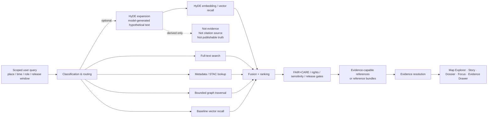

<a id="top"></a>

# Kansas Frontier Matrix — Governed HyDE Query Expansion

Policy-gated query expansion for DRIFT retrieval, kept downstream of evidence, release scope, and correction lineage.

> **Status:** draft  
> **Owners:** `REQUIRES-OWNER-VERIFICATION`  
> **Path:** `docs/search/drift/hyde/README.md`  
>       
> **Quick jumps:** [Scope](#scope) · [Repo fit](#repo-fit) · [Accepted inputs](#accepted-inputs) · [Exclusions](#exclusions) · [Directory tree](#directory-tree) · [Quickstart](#quickstart) · [Usage](#usage) · [Diagram](#diagram) · [Control matrix](#control-matrix) · [Task list](#task-list) · [FAQ](#faq) · [Appendix](#appendix)

> [!IMPORTANT]
> HyDE in KFM is a retrieval aid, not a truth surface. It may help the system find better candidates, but it must never become a citation source, a published narrative, or a substitute for `EvidenceRef -> EvidenceBundle` resolution.

> [!NOTE]
> This README is written to match the confirmed `docs/search/` and `docs/search/drift/` documentation pattern while replacing the current scaffold placeholder. It stays explicit about repo and runtime unknowns.

> [!WARNING]
> Do not treat this file as proof of live prompt templates, active HyDE runtime wiring, merge-gated evaluations, or deployed model/provider choice. Keep those areas `NEEDS VERIFICATION`, `INFERRED`, or `PROPOSED` until the mounted repo and runtime surfaces are directly inspected.

## Scope

`docs/search/drift/hyde/README.md` narrows the broader DRIFT rules to one specific query-transformation stage: model-generated hypothetical text used to improve retrieval recall or routing.

This README covers:
- when HyDE expansion is appropriate
- what inputs may shape it
- what boundaries must never be crossed
- how expansion remains release-scoped and policy-gated
- how HyDE-fed retrieval must still hand off evidence-capable references
- what failure modes, tests, and review questions matter most

In KFM terms, HyDE belongs to the derived search layer. It can enrich lexical, metadata, graph, and embedding retrieval, but it cannot silently promote generated prose into truth.

[Back to top](#top)

## Repo fit

| Direction | Path | Role | Status |
|---|---|---|---|
| This file | `docs/search/drift/hyde/README.md` | Governed HyDE query expansion for the DRIFT subtree | **CONFIRMED path · expanded content proposed here** |
| Upstream | [`../README.md`](../README.md) | Search-drift overview, drift classes, trust-visible rules | **CONFIRMED** |
| Upstream | [`../../README.md`](../../README.md) | Search-system entrypoint and surface handoff rules | **CONFIRMED** |
| Adjacent | [`../embeddings/README.md`](../embeddings/README.md) | Embedding-oriented retrieval layer | **CONFIRMED path · current scaffold** |
| Adjacent | [`../graph-queries/README.md`](../graph-queries/README.md) | Bounded graph precision layer | **CONFIRMED path · current scaffold** |
| Adjacent | [`../stac/README.md`](../stac/README.md) | Retrieval-episode STAC / evidence-bundle surface | **CONFIRMED path · current scaffold** |
| Adjacent | [`../examples/README.md`](../examples/README.md) | Redaction-safe runs and golden fixtures | **CONFIRMED path · current scaffold** |
| Downstream | `NEEDS VERIFICATION` | Exact tests, prompts, fixtures, or runbooks beneath this directory | **UNKNOWN** |

### Current fit statement

**CONFIRMED:** the search-system README already names this file as the HyDE-specific child doc inside the DRIFT subtree.

**INFERRED:** this README should be the narrow control surface for prompt-shaped query expansion, especially where short, vague, narrative, or intent-rich questions need better retrieval hints than raw query text alone.

**PROPOSED:** use this file as the place where maintainers define HyDE boundaries, fixtures, and review criteria before any runtime claims are hardened elsewhere.

[Back to top](#top)

## Accepted inputs

Accepted here:
- HyDE purpose and boundary rules
- prompt-shaping constraints that preserve release scope and policy posture
- query classes where HyDE is allowed, discouraged, or blocked
- redaction-safe examples of expansion inputs and output handling
- golden queries and negative fixtures for HyDE-assisted retrieval
- evaluation notes about recall lift versus evidence-quality loss
- logging or audit expectations where prompt or expansion details must be preserved
- UI guidance for how HyDE-assisted retrieval should remain honest and inspectable

### Typical source objects

- released search scope and query context
- policy and sensitivity constraints already applicable to the request
- search mode or routing decisions
- embedding or vector retrieval settings
- graph or metadata constraints used after expansion
- retrieval-episode records
- evidence-resolution traces
- downstream `ANSWER`, `ABSTAIN`, `DENY`, or `ERROR` outcomes

[Back to top](#top)

## Exclusions

This directory is not the place for:
- canonical truth authoring
- generated prose presented as evidence
- raw hypothetical documents published to public users as if they were source-backed content
- direct client access to vector stores, model runtimes, or search internals
- unrestricted prompt experimentation over unpublished, restricted, or quarantine material
- generic LLM prompt advice without KFM trust consequences
- hard claims about current provider, model, token budget, caching layer, or workflow wiring that are not repo-verified

### Route elsewhere

| Does **not** belong here | Belongs instead |
|---|---|
| Canonical entities, observations, claims | canonical data / contract surfaces |
| Product-wide Focus behavior | Focus / AI governance docs |
| Search-system-wide retrieval doctrine | [`../../README.md`](../../README.md) |
| General search drift classes | [`../README.md`](../README.md) |
| Embedding-store behavior not specific to HyDE | [`../embeddings/README.md`](../embeddings/README.md) |
| Graph traversal policy | [`../graph-queries/README.md`](../graph-queries/README.md) |
| Live runtime or provider specifics | direct repo/runtime evidence after verification |

[Back to top](#top)

## Directory tree

Starter shape — only the `README.md` path is confirmed here; everything else is a **PROPOSED** or **NEEDS VERIFICATION** starter layout.

```text
docs/search/drift/hyde/
├── README.md                 # This file
├── prompts/                  # PROPOSED: approved HyDE prompt profiles and rationale
├── fixtures/                 # PROPOSED: golden, stale, denied, conflicted, redaction-safe cases
├── reports/                  # PROPOSED: drift/evaluation snapshots and regression notes
├── runbooks/                 # PROPOSED: rollback, disable, narrow-scope, incident steps
└── examples/                 # PROPOSED: public-safe request/response and UI-state examples
```

> [!TIP]
> Keep any future subdirectories subordinate to one rule: the hypothetical text is a retrieval instrument, not a truth-bearing artifact.

[Back to top](#top)

## Quickstart

This quickstart avoids inventing scripts or workflow names that have not yet been verified.

### 1) Verify what actually exists

```bash
# NEEDS VERIFICATION: run only after mounted repo access is available
tree docs/search/drift
tree docs/search/drift/hyde
```

### 2) Confirm HyDE is allowed for the query class

Ask:
1. Is the request inside released, policy-allowed scope?
2. Would plain lexical, metadata, graph, or embedding retrieval already be sufficient?
3. Is HyDE improving discovery, or merely adding persuasive synthetic text?
4. Can downstream results still resolve cleanly to admissible evidence?

### 3) Keep the hypothetical text in the derived lane

Minimum handling rules:
- do not treat hypothetical text as a citation source
- do not export it as a truth-bearing artifact
- do not let it outrank release scope, policy posture, or evidence resolution
- do not keep it as the only surviving representation of meaning
- do record enough trace data for review when HyDE materially affects retrieval behavior

### 4) Run minimum checks

At minimum, HyDE review should include:
- golden-query comparisons
- citation-negative tests
- stale-scope tests
- conflict-sensitive tests
- policy or redaction leakage checks
- `ABSTAIN` / `DENY` / `ERROR` downstream behavior checks
- “HyDE off” versus “HyDE on” regression comparisons

### 5) Record governed findings

Capture:
- reviewed release scope
- query class
- whether HyDE was used, skipped, or blocked
- observed lift or degradation
- visible failure mode
- supporting traces or evaluation snapshot
- required rebuild, rollback, disable, or narrower-scope action
- reviewer and date

[Back to top](#top)

## Usage

### For maintainers

Use HyDE only to improve retrieval hints for difficult queries. Keep it:
- subordinate to released scope
- bounded by FAIR+CARE, rights, and sensitivity constraints
- downstream of routing, not upstream of doctrine
- disposable or reviewable as derived output
- unable to bypass evidence resolution

### For reviewers

Use this README to ask:
- Did HyDE widen the query beyond released scope?
- Did generated text introduce unsupported specificity?
- Did expansion improve recall but worsen evidence quality?
- Did policy-safe narrowing survive the expansion stage?
- Could a user mistake hypothetical prose for real support?
- Did the downstream path still preserve finite outcomes and correction lineage?

### For UI / app engineers

Treat HyDE as a retrieval-internal aid. Public-facing surfaces should expose:
- release scope
- evidence opener or Evidence Drawer path
- stale, partial, conflicted, generalized, denied, or withdrawn states where relevant

Public-facing surfaces should not expose a hypothetical paragraph in a way that looks like verified source content.

### For platform / retrieval engineers

Use HyDE as one option in routing, not as a mandatory universal step. Prefer:
- bounded prompt profiles
- replayable evaluation inputs where required
- explainable fusion with lexical, metadata, graph, and vector retrieval
- clear fallback to non-HyDE retrieval when latency, cost, or drift outweigh benefit

[Back to top](#top)

## Diagram



### Reading the diagram

- HyDE sits inside routing and retrieval, not at the claim surface.
- The hypothetical text is a **derived intermediate**, not a source document.
- Retrieval quality matters, but evidence handoff still matters more.
- Outward surfaces only become trustworthy after evidence resolution.
- If HyDE worsens trust, scope, or evidence quality, fallback or abstention is healthier than persuasive overreach.

[Back to top](#top)

## Control matrix

| Control area | Why it matters | Minimum rule | Status |
|---|---|---|---|
| Query scope | HyDE can widen intent if left unconstrained | bind expansion to released, policy-allowed scope | **CONFIRMED doctrine · PROPOSED HyDE application** |
| Prompt contract | poorly bounded prompts can inject invented specificity | use approved, reviewable prompt profiles only | **PROPOSED** |
| Generated text handling | hypothetical prose can be mistaken for support | never cite, publish, or export hypothetical text as evidence | **INFERRED / PROPOSED** |
| Fusion and ranking | recall lift can still degrade evidence quality | compare HyDE-on vs HyDE-off on golden queries | **PROPOSED** |
| Policy inheritance | retrieval cannot outrun rights/sensitivity posture | apply FAIR+CARE, rights, and review gates before outward results | **CONFIRMED doctrine** |
| Evidence handoff | KFM forbids detached claims | return evidence-capable references, then resolve evidence | **CONFIRMED doctrine** |
| Traceability | reviewers need to inspect when expansion changed results | capture evaluation or run evidence where required | **INFERRED / PROPOSED** |
| Correction | drift can persist after content is superseded | correction, rollback, and supersession must propagate forward | **CONFIRMED doctrine** |

## Failure and drift matrix

| Failure mode | What changed | Why it matters in KFM | Acceptable response |
|---|---|---|---|
| Hallucinated expansion | hypothetical text adds unsupported names, dates, places, or causal claims | search may look smarter while moving farther from evidence | block, narrow, or degrade to non-HyDE retrieval |
| Scope drift | expansion broadens beyond the user’s release/time/place scope | violates bounded retrieval | re-route or fail closed |
| Policy drift | expansion pulls in restricted, sensitive, or unsafe material | can breach public-safe retrieval posture | deny, redact, narrow, or review-escalate |
| Evidence drift | HyDE-ranked results no longer resolve cleanly to admissible evidence | breaks cite-or-abstain and inspectability | abstain, deny, correction, or rebuild |
| Ranking drift | semantic lift hides better lexical/evidence-grounded candidates | persuasive but less trustworthy results | retune fusion or disable HyDE for that query class |
| Replay gap | the system cannot explain why HyDE changed ranking | review, correction, and regression become weak | add logging/eval artifacts or keep HyDE off |
| Surface drift | UI implies high confidence from semantic expansion alone | trust failure at the point of use | add visible state cues or remove the affordance |

[Back to top](#top)

## Rules of use

### 1) HyDE is optional, not default truth

Use it where it helps retrieval. Skip it where it adds cost, drift, or ambiguity without measurable value.

### 2) The hypothetical document is disposable

It may be logged or evaluated as a derived artifact, but it does not become canonical content, publishable narrative, or supporting evidence.

### 3) HyDE may improve recall, not authority

Authority still comes from released scope, admissible evidence, policy checks, review state, and correction lineage.

### 4) If HyDE helps retrieval but hurts trust, HyDE loses

KFM optimizes for trustworthy discovery, not for the most impressive-looking semantic trick.

### 5) Finite outcomes remain healthy outcomes

A HyDE-assisted path that ends in `ABSTAIN`, `DENY`, or `ERROR` is functioning correctly when trustworthy support is unavailable or policy-safe publication is blocked.

[Back to top](#top)

## Definition of done

A HyDE-related documentation or behavior change is ready when:
- [ ] this file still states plainly that HyDE is a derived retrieval aid
- [ ] repo fit and adjacent links are current
- [ ] accepted inputs and exclusions are explicit
- [ ] the diagram shows evidence handoff after retrieval
- [ ] generated hypothetical text is clearly separated from evidence
- [ ] HyDE-specific failure modes and fallback responses are documented
- [ ] evaluation expectations include HyDE-on / HyDE-off comparison
- [ ] open repo/runtime unknowns remain visible instead of being silently assumed away
- [ ] any new prompts, fixtures, reports, or runbooks are redaction-safe and release-scoped

[Back to top](#top)

## Task list

### Immediate
- verify actual contents of `docs/search/drift/hyde/`
- confirm the current owner for this directory
- identify whether prompt profiles, fixtures, or reports already exist elsewhere in-repo
- reconcile this README with any verified search-runtime docs before merge

### Near-term
- define approved HyDE query classes
- define HyDE-off / HyDE-on golden comparisons
- define policy-sensitive negative fixtures
- define a small markdown- or schema-backed evaluation report format
- link rollback and disable guidance once verified runbooks exist

### Longer-term
- connect HyDE evaluation to search-drift reporting
- connect HyDE regressions to correction and rollback workflows
- align HyDE review with Focus-oriented retrieval evaluation
- document steward-facing review pathways if hypothetical text ever becomes inspectable outside engineering contexts

[Back to top](#top)

## FAQ

### What does “HyDE” mean here?
In this subtree, HyDE means model-generated hypothetical text used only to improve retrieval candidates for difficult queries.

### Is the hypothetical text evidence?
No. It is a derived retrieval instrument, not a source artifact.

### Can HyDE text be cited, exported, or published as-is?
No. Citations and outward claims must still resolve through real, admissible evidence.

### Must every query use HyDE?
No. KFM should route by need. Plain lexical, metadata, graph, or baseline vector retrieval may be safer and sufficient.

### What is the safest fallback?
Prefer non-HyDE retrieval, visible narrowing, review escalation, `ABSTAIN`, or `DENY` over persuasive unsupported expansion.

[Back to top](#top)

## Appendix

<details>
<summary>Status vocabulary, open verification items, and review questions</summary>

### Status vocabulary

| Label | Meaning in this README |
|---|---|
| **CONFIRMED** | directly supported by current repo docs or broader KFM doctrine |
| **INFERRED** | strongly implied by the project’s architecture and search/drift rules, but not directly proven as mounted implementation |
| **PROPOSED** | recommended starter shape or operating move |
| **UNKNOWN** | not directly verified in the current session |
| **NEEDS VERIFICATION** | should be checked against mounted repo/runtime evidence before being treated as settled fact |

### Open verification items

The following remain open:
- actual child contents beneath `docs/search/drift/hyde/`
- active prompt templates or approved model/provider settings
- whether HyDE is currently wired anywhere in runtime code
- current owners, reviewers, and merge-gated checks for this subtree
- existing fixture names, report templates, or CI entrypoints
- whether public UI surfaces ever display HyDE-adjacent state directly
- whether evaluation artifacts already emit proof objects or run receipts

### Suggested review questions

1. Does this README keep HyDE subordinate to KFM truth-path law?
2. Does it clearly prevent hypothetical text from becoming evidence?
3. Does it preserve release scope, policy posture, and evidence handoff?
4. Does it stay honest about repo and runtime unknowns?
5. Does it give maintainers a usable HyDE-specific review vocabulary?
6. Does anything here need to be narrowed once the mounted repo and runtime are directly inspected?

</details>

---

Current posture: source-bounded draft, expanded from scaffold into a reviewable repo-native README for governed HyDE query expansion.
