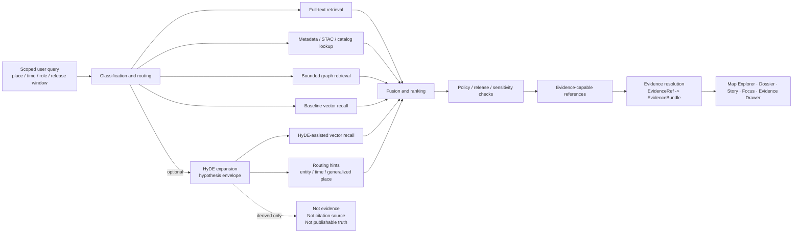

<!-- [KFM_META_BLOCK_V2]
doc_id: REQUIRES-DOC-ID
title: Kansas Frontier Matrix — Governed HyDE Query Expansion
type: standard
version: v1
status: draft
owners: REQUIRES-OWNER-VERIFICATION
created: YYYY-MM-DD
updated: YYYY-MM-DD
policy_label: public
related: [docs/search/drift/README.md, REQUIRES-RELATED-LINK-VERIFICATION]
tags: [kfm, search, drift, hyde]
notes: [Mounted repo tree was not directly available in the current session; owner, doc_id, dates, and adjacent path existence require verification.]
[/KFM_META_BLOCK_V2] -->

<a id="top"></a>

# Kansas Frontier Matrix — Governed HyDE Query Expansion

Policy-gated query expansion for DRIFT retrieval, kept downstream of evidence, release scope, and correction lineage.

> **Status:** draft  
> **Owners:** `REQUIRES-OWNER-VERIFICATION`  
> **Path:** `docs/search/drift/hyde/README.md`  
>       
> **Quick jumps:** [Scope](#scope) · [Repo fit](#repo-fit) · [Accepted inputs](#accepted-inputs) · [Exclusions](#exclusions) · [Directory tree](#directory-tree) · [Quickstart](#quickstart) · [Usage](#usage) · [Diagram](#diagram) · [Control matrix](#control-matrix) · [Task list](#task-list) · [FAQ](#faq) · [Appendix](#appendix)

> [!IMPORTANT]
> HyDE in KFM is a retrieval aid, not a truth surface. It may improve candidate discovery, but it must never become a citation source, a published narrative, or a substitute for `EvidenceRef -> EvidenceBundle` resolution.

> [!NOTE]
> This README is doctrine-led and repo-cautious. `CONFIRMED` material here comes from attached KFM manuals. Pathing, subtree shape, and implementation details remain `INFERRED`, `PROPOSED`, `UNKNOWN`, or `NEEDS VERIFICATION` unless the mounted repository later confirms them.

> [!WARNING]
> Do not treat this file as proof of live prompt templates, active HyDE runtime wiring, current model/provider choice, merge-gated evaluations, or deployed search behavior. Those areas remain unverified in the current session.

## Scope

This README narrows the broader DRIFT search doctrine to one specific transformation stage: a hypothetical, model-generated expansion used to improve retrieval recall or routing before evidence-capable references are resolved.

This file covers:

- when HyDE expansion is appropriate
- what inputs may shape it
- which boundaries must never be crossed
- how HyDE remains release-scoped and policy-gated
- how HyDE-assisted retrieval still hands off to evidence-capable references
- what failure modes, review questions, and test expectations matter most

In KFM terms, HyDE belongs to the **derived search layer**. It may enrich lexical, metadata, graph, or embedding retrieval, but it cannot silently promote generated prose into truth.

[Back to top](#top)

## Repo fit

| Direction | Path | Role | Current posture |
|---|---|---|---|
| This file | `docs/search/drift/hyde/README.md` | HyDE-specific governance and usage guide for the DRIFT subtree | **Task target · mounted repo confirmation pending** |
| Upstream | [`../README.md`](../README.md) | Expected DRIFT parent overview and routing doctrine | **INFERRED parent path · NEEDS VERIFICATION** |
| Downstream | `templates/`, `policies/`, `examples/`, `reports/`, `runbooks/` | Expected local operating assets for prompt shape, gates, examples, evaluation, and rollback | **Starter subtree only · PROPOSED** |

### Repo-fit reading rule

Use this file as the **narrow HyDE control surface**, not as a duplicate of broader search doctrine.

- Keep DRIFT-wide retrieval architecture in the parent DRIFT README.
- Keep canonical contracts in the repository-wide contract registry if one exists.
- Keep live runtime or deployment details in verified runtime / operations docs, not here.

[Back to top](#top)

## Accepted inputs

Accepted here:

- HyDE purpose, boundary, and non-goal statements
- query classes where HyDE is allowed, discouraged, or blocked
- deterministic prompt-shaping constraints
- CARE / sovereignty / sensitivity handling for hypothetical expansion
- routing-hint expectations for generalized place, time, entity, or document retrieval
- redaction-safe examples of request normalization and output handling
- HyDE-on / HyDE-off evaluation guidance
- review questions for maintainers, retrieval engineers, and governance reviewers

### Typical source objects

Typical inputs to a HyDE step may include:

- a release-scoped user query
- allowed audience / role context
- place and time scope already determined upstream
- policy and sensitivity constraints already applicable to the request
- routing decisions from the DRIFT parent flow
- retrieval mode hints for lexical, metadata, graph, or vector stages

### Truth-status rule

- `CONFIRMED` here means broader KFM doctrine confirms the rule.
- `INFERRED` means the rule is strongly implied by KFM’s search, Focus, and evidence posture.
- `PROPOSED` means a recommended starter shape for this subtree.
- `UNKNOWN` / `NEEDS VERIFICATION` means the current session did not directly verify repo or runtime reality.

[Back to top](#top)

## Exclusions

This directory is **not** the place for:

- canonical truth authoring
- generated prose presented as evidence
- public-facing hypothetical paragraphs that can be mistaken for verified support
- direct client access to vector stores, model runtimes, or search internals
- unrestricted prompt experimentation over unpublished, restricted, or quarantine material
- product-wide shell doctrine that belongs in broader KFM UI or runtime docs
- hard claims about current provider, model, token budget, caching, CI gates, or workflow wiring that are not directly verified

### Route elsewhere

| Does **not** belong here | Put it instead |
|---|---|
| Canonical entities, observations, or claims | canonical data / contract surfaces |
| Broader DRIFT architecture | parent DRIFT search documentation |
| Public shell choreography | UI / shell doctrine docs |
| Runtime endpoint contracts | central `contracts/` and `apis/` surfaces |
| Evidence resolution semantics | evidence resolver / runtime envelope docs |
| Live provider or deployment specifics | verified runtime / ops documentation |

> [!TIP]
> If the repository already has a central schema or contract registry, keep the **authoritative** HyDE envelope there and use this subtree for local guidance, examples, and runbooks rather than creating a parallel contract universe.

[Back to top](#top)

## Directory tree

Only the target README path is task-confirmed. The rest is a **starter shape**, not a verified mounted subtree.

```text
docs/search/drift/hyde/
├── README.md                  # This file
├── templates/                 # PROPOSED: stable prompt and guardrail assets
├── policies/                  # PROPOSED: CARE / sovereignty / masking rules
├── examples/                  # PROPOSED: redaction-safe request/response examples
├── reports/                   # PROPOSED: evaluation snapshots and regression notes
└── runbooks/                  # PROPOSED: disable, rollback, and incident guidance
```

### Future local assets worth considering

```text
templates/
├── hyde.prompt.template.md
├── hyde.guardrails.template.md
└── hyde.output.schema.json

policies/
└── hyde_policy.yml

examples/
├── hyde_request.example.json
└── hyde_response.example.json
```

These filenames are **starter suggestions**, not verified repo facts.

[Back to top](#top)

## Quickstart

This quickstart stays conservative: it avoids inventing scripts, workflow names, or runtime entrypoints that were not directly verified.

### 1) Verify what actually exists

```bash
# Run only after the repository is mounted locally
find docs/search -maxdepth 3 -type f | sort
find docs/search/drift -maxdepth 3 -type f | sort
```

### 2) Confirm whether HyDE is warranted

Ask, in order:

1. Is the request inside released, policy-allowed scope?
2. Would plain lexical, metadata, graph, or vector retrieval already be sufficient?
3. Is HyDE improving discovery, or merely manufacturing persuasive synthetic detail?
4. Can the downstream path still resolve to admissible evidence?

### 3) Keep HyDE in the derived lane

Minimum operating rules:

- do not cite hypothetical text
- do not publish hypothetical text as verified support
- do not store unrestricted sensitive detail in HyDE artifacts
- do not let HyDE outrank release scope, policy posture, or evidence resolution
- do preserve enough normalized trace data for deterministic review

### 4) Run minimum review checks

At minimum, HyDE-related review should include:

- HyDE-on vs HyDE-off comparison on difficult queries
- citation-negative tests
- stale-scope tests
- partial-coverage tests
- conflict-sensitive tests
- policy / redaction leakage checks
- `ABSTAIN` / `DENY` / `ERROR` behavior checks

### 5) Record governed findings

Capture at least:

- evaluated query class
- effective scope
- whether HyDE was used, skipped, narrowed, redacted, or denied
- observed lift or degradation
- visible failure mode
- supporting traces or evaluation snapshot
- reviewer, date, and follow-up action

[Back to top](#top)

## Usage

### For maintainers

Use HyDE only to improve retrieval hints for difficult, scope-bounded queries. Keep it:

- subordinate to released scope
- bounded by rights, sensitivity, and CARE obligations
- deterministic enough to review
- disposable as derived output
- unable to bypass evidence resolution

### For reviewers

Use this README to ask:

- Did HyDE widen the query beyond allowed place, time, or release scope?
- Did it introduce unsupported specificity?
- Did it improve recall but worsen evidence quality?
- Did generalized handling survive the HyDE stage?
- Could a user mistake hypothetical text for real support?
- Did the downstream path still preserve finite outcomes and correction lineage?

### For UI / app engineers

Treat HyDE as retrieval-internal. Public surfaces should expose:

- effective scope
- freshness and surface state where relevant
- evidence opener / Evidence Drawer path
- visible narrowing, partial, stale, generalized, denied, or withdrawn states where relevant

Public-facing surfaces should **not** render a HyDE paragraph in a way that looks like source-backed content.

### For retrieval / platform engineers

Use HyDE as an **optional routing move**, not a universal mandatory step.

Prefer:

- bounded prompt profiles
- normalized and hashed inputs
- replayable evaluation inputs
- explainable fusion with lexical, metadata, graph, and vector retrieval
- clear fallback to non-HyDE retrieval when latency, cost, or drift outweigh value

[Back to top](#top)

## Diagram



### Reading the diagram

- HyDE sits inside retrieval, not at the claim surface.
- The hypothesis envelope is a **derived intermediate**, not a source artifact.
- Retrieval lift matters only if evidence handoff still works.
- Trust rises only after evidence resolution and policy-safe surface handling.
- If HyDE harms trust, scope, or evidence quality, fallback is healthier than persuasive overreach.

[Back to top](#top)

## Control matrix

| Control area | Why it matters | Minimum rule | Posture |
|---|---|---|---|
| Query scope | HyDE can widen intent if left loose | bind expansion to effective release scope, place, time, and role | `CONFIRMED doctrine` / HyDE application `INFERRED` |
| Determinism | prompt drift weakens replay and review | normalize input; pin template/profile; preserve hashable trace | `INFERRED` / `PROPOSED` |
| Generated text handling | hypothetical prose can be mistaken for support | never cite, publish, or elevate HyDE text into evidence | `CONFIRMED doctrine` / `INFERRED consequence` |
| Policy inheritance | retrieval cannot outrun rights or sensitivity posture | apply CARE / rights / masking rules before outward use | `CONFIRMED doctrine` |
| Fusion and ranking | recall lift can still worsen trust | compare HyDE-on vs HyDE-off on governed fixtures | `PROPOSED` |
| Evidence handoff | KFM forbids detached claims | return evidence-capable refs, then resolve to bundles | `CONFIRMED doctrine` |
| Traceability | reviewers need to explain why results changed | log normalized query basis, decision context, and outcome | `INFERRED` |
| Correction | retrieval drift can persist after supersession | correction and rebuild obligations must propagate forward | `CONFIRMED doctrine` |

### HyDE envelope expectations

A future machine-validated HyDE envelope should stay narrow and policy-safe. It should carry only what the rest of KFM can actually govern.

Expected minimum fields:

- normalized query hash
- policy-safe hypothesis text or an empty/denied equivalent
- generalized routing hints
- gate result fields
- provenance anchors for template/profile/policy/runtime versioning

Anything more detailed than that should justify its burden.

[Back to top](#top)

## Failure and drift matrix

| Failure mode | What changed | Why it matters in KFM | Acceptable response |
|---|---|---|---|
| Hallucinated expansion | hypothetical text adds unsupported names, dates, places, or causes | retrieval looks smarter while moving farther from evidence | block, narrow, or fall back |
| Scope drift | HyDE broadens beyond allowed release / place / time scope | violates bounded retrieval | re-route or fail closed |
| Policy drift | expansion surfaces restricted or unsafe detail | can breach public-safe posture | redact, deny, narrow, or escalate |
| Evidence drift | top-ranked results no longer resolve cleanly to admissible support | breaks cite-or-abstain posture | abstain, deny, or correct |
| Ranking drift | semantic lift buries better evidence-grounded candidates | persuasive but less trustworthy results | retune fusion or disable HyDE for that class |
| Replay gap | reviewers cannot reconstruct why HyDE changed the result set | regression review weakens | preserve normalized traces or keep HyDE off |
| Surface drift | UI implies confidence from expansion alone | trust failure at point of use | add visible state cues or remove the affordance |

[Back to top](#top)

## Rules of use

### 1) HyDE is optional

Use it where it measurably helps retrieval. Skip it where it adds cost, ambiguity, or policy burden without value.

### 2) The hypothesis is disposable

It may be logged or evaluated as a derived artifact, but it does not become canonical content, public support, or supporting evidence.

### 3) HyDE may improve recall, not authority

Authority still comes from release scope, admissible evidence, policy checks, review state, and visible correction lineage.

### 4) If HyDE helps retrieval but hurts trust, HyDE loses

KFM optimizes for trustworthy discovery, not for the most impressive semantic trick.

### 5) Finite outcomes remain healthy outcomes

A HyDE-assisted path that ends in `ABSTAIN`, `DENY`, or `ERROR` may be the correct outcome.

[Back to top](#top)

## Definition of done

A HyDE-related doc or behavior change is ready when:

- [ ] this file still states plainly that HyDE is a derived retrieval aid
- [ ] repo fit and adjacent references were rechecked against the mounted repo
- [ ] accepted inputs and exclusions are explicit
- [ ] the diagram still shows evidence handoff **after** retrieval
- [ ] generated hypothetical text is clearly separated from evidence
- [ ] negative-path expectations include `ABSTAIN`, `DENY`, and `ERROR`
- [ ] evaluation expectations include citation-negative, stale-scope, partial-coverage, and conflict-sensitive checks
- [ ] HyDE-on vs HyDE-off comparisons are part of review
- [ ] open repo/runtime unknowns remain visible instead of being silently assumed away
- [ ] any new local templates, policies, examples, or reports are redaction-safe and release-scoped

[Back to top](#top)

## Task list

### Immediate

- verify actual mounted contents of `docs/search/drift/hyde/`
- confirm current owner(s) for this subtree
- confirm whether a parent DRIFT README already exists and what it currently says
- determine whether any HyDE prompt, guardrail, schema, or policy files already exist elsewhere in-repo
- reconcile this README against verified runtime docs before merge

### Near-term

- define approved HyDE query classes
- define HyDE-off / HyDE-on golden comparisons
- define policy-sensitive negative fixtures
- define a small evaluation report format
- decide whether the authoritative HyDE schema belongs centrally or locally
- link rollback / disable guidance once verified runbooks exist

### Longer-term

- connect HyDE regression review to broader search-drift reporting
- connect HyDE behavior to correction and rollback workflows
- align HyDE review with Focus-oriented retrieval evaluation
- document steward-facing review pathways if HyDE artifacts ever become inspectable outside engineering contexts

[Back to top](#top)

## FAQ

### What does “HyDE” mean here?

In this subtree, HyDE means hypothetical, model-generated query expansion used only to improve retrieval candidates for difficult queries.

### Is the hypothesis evidence?

No. It is a derived retrieval instrument, not a source artifact.

### Can HyDE text be cited or published?

No. Outward claims must still resolve through admissible evidence.

### Must every query use HyDE?

No. KFM should route by need. Plain lexical, metadata, graph, or baseline vector retrieval may be safer and sufficient.

### What is the safest fallback?

Prefer non-HyDE retrieval, visible narrowing, review escalation, `ABSTAIN`, or `DENY` over persuasive unsupported expansion.

[Back to top](#top)

## Appendix

<details>
<summary>Status vocabulary, verification backlog, and review prompts</summary>

### Status vocabulary

| Label | Meaning in this README |
|---|---|
| `CONFIRMED` | directly supported by attached KFM doctrine |
| `INFERRED` | strongly implied by KFM architecture and trust posture |
| `PROPOSED` | recommended starter shape or operating move |
| `UNKNOWN` | not directly verified in the current session |
| `NEEDS VERIFICATION` | should be checked against the mounted repo or runtime before merge |

### Open verification items

The following remain open in the current session:

- actual mounted subtree contents beneath `docs/search/drift/hyde/`
- current owner, reviewer, and merge-gate assignments
- live prompt templates or approved runtime settings
- whether HyDE is currently wired anywhere in runtime code
- existing fixture names, report templates, or CI entrypoints
- whether any public UI surface displays HyDE-adjacent state directly
- whether runtime receipts already capture HyDE decision traces

### Suggested review prompts

1. Does this README keep HyDE subordinate to KFM truth-path law?
2. Does it clearly prevent hypothesis text from becoming evidence?
3. Does it preserve release scope, policy posture, and evidence handoff?
4. Does it stay honest about repo and runtime unknowns?
5. Does it avoid creating a parallel local contract universe if a central registry already exists?
6. What should be narrowed once the mounted repo and runtime are directly inspected?

</details>

---

Current posture: doctrine-grounded draft, expanded into a reviewable README that is compatible with KFM trust law while keeping repo and runtime unknowns visible.
