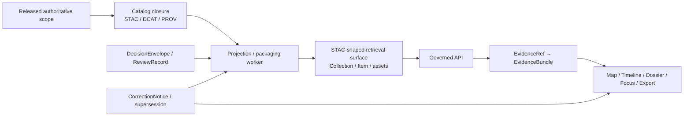

# STAC

Release-scoped STAC packaging for retrieval episodes, evidence handoff, and public-safe search discovery.

> [!NOTE]
> **Status:** draft  
> **Owners:** NEEDS VERIFICATION  
> **Path:** `docs/search/drift/stac/README.md`  
>     
>
> **Quick jump:** [Scope](#scope) · [Repo fit](#repo-fit) · [Accepted inputs](#accepted-inputs) · [Exclusions](#exclusions) · [Directory tree](#directory-tree) · [Quickstart](#quickstart) · [Usage](#usage) · [Diagram](#diagram) · [Packaging matrix](#packaging-matrix) · [Failure states](#visible-drift--failure-states) · [Task list](#task-list--definition-of-done) · [FAQ](#faq) · [Appendix](#appendix)

> [!IMPORTANT]
> In this directory, **STAC is a derived retrieval surface**.  
> It is useful when a search / drift episode has real spatiotemporal items or assets to expose, but it must stay downstream of release scope, policy posture, correction lineage, and EvidenceBundle resolution.

> [!NOTE]
> **Truth posture used in this README:** **CONFIRMED** = grounded in adjacent repo docs or repeated KFM doctrine; **INFERRED** = strong structural completion; **PROPOSED** = recommended starter shape; **NEEDS VERIFICATION** = live checkout proof still missing.

## Scope

This directory documents the STAC-shaped part of **search drift**: the release-scoped discovery and packaging layer used when a retrieval episode benefits from spatial/time-aware Collections, Items, preview assets, or provenance assets.

In KFM terms, that layer is valuable precisely because it is **not** sovereign truth. It should make triage, discovery, and evidence handoff easier while remaining visibly subordinate to canonical release scope, policy decisions, correction lineage, and governed evidence resolution.

Drift is acceptable here only when it stays **visible, bounded, and rebuildable**.

## Repo fit

| Link | Role here | Status |
|---|---|---|
| [`./README.md`](./README.md) | This directory README for the retrieval-episode STAC / EvidenceBundle surface | **CONFIRMED** |
| [`../README.md`](../README.md) | Upstream drift / retrieval overview | **CONFIRMED** |
| [`../../README.md`](../../README.md) | Upstream search overview; names this surface in the search taxonomy | **CONFIRMED** |
| [`../graph-queries/README.md`](../graph-queries/README.md) | Adjacent graph / relationship-shaped retrieval surface | **CONFIRMED** |
| [`../embeddings/README.md`](../embeddings/README.md) | Adjacent vector / embedding drift surface | **CONFIRMED** |
| [`../hyde/README.md`](../hyde/README.md) | Adjacent HYDE drift surface | **CONFIRMED** |
| [`../examples/README.md`](../examples/README.md) | Adjacent redaction-safe examples surface | **CONFIRMED** |

**Repo-fit rule:** this path should document **STAC-shaped retrieval packaging**, not general platform catalog doctrine, not canonical truth storage, and not unverified live API inventory.

## Accepted inputs

This directory is the right home for:

- **STAC Collection / Item conventions** used for retrieval episodes or release-backed search slices.
- **Public-safe preview and provenance asset guidance**, including manifest-like and lineage-oriented packaging notes.
- **Redaction-safe examples** that help reviewers distinguish promoted, generalized, partial, source-dependent, stale-visible, or withdrawn states.
- **Mapping notes** between STAC-shaped packaging and KFM trust objects such as `EvidenceRef`, `EvidenceBundle`, correction artifacts, and release linkage.
- **Validation/profile notes** for STAC alignment in the search / drift context.
- **Source-role handling notes** when documentary, modeled, observational, or community-contributed materials are exposed through a STAC-shaped surface.

## Exclusions

This directory is **not** the right home for:

- Canonical contract and schema definitions that belong in the repo’s contract / schema surfaces: [`../../../../contracts/`](../../../../contracts/), [`../../../../schemas/`](../../../../schemas/), and [`../../../../policy/`](../../../../policy/).
- Raw source onboarding, landing, quarantine, or canonical-write behavior.
- Undocumented or unverified live route trees, DTOs, schema filenames, or CI entrypoints presented as current repo fact.
- “STAC-ish” payloads that hide rights, sensitivity, generalization, withholding, or correction state.
- Detached public catalog design that bypasses governed evidence resolution.
- Any packaging that lets a preview, tile, search hit, or Collection / Item quietly stand in for authoritative truth.

> [!WARNING]
> If a result is too sensitive, too stale, too partial, or too weakly supported to publish cleanly, the answer is not “make the STAC prettier.” The answer is to **generalize, withhold, mark partial, surface correction, or fail closed**.

## Directory tree

### Current visible state

```text
docs/search/drift/stac/
└── README.md
```

### Proposed starter expansion

```text
docs/search/drift/stac/
├── README.md
├── profiles/          # PROPOSED: KFM-STAC alignment notes / extension allowlists
├── examples/          # PROPOSED: public-safe Collections / Items / asset examples
├── fixtures/          # PROPOSED: valid / invalid redaction-safe validation fixtures
├── runbooks/          # PROPOSED: correction / withdrawal / supersession drills
└── manifests/         # PROPOSED: release-scoped packaging notes and example closures
```

The first block is **CONFIRMED** from the current repo view. The second is **PROPOSED** starter structure only.

## Quickstart

1. Read the parent docs first: [`../../README.md`](../../README.md) and [`../README.md`](../README.md).
2. Verify the actual contents of `docs/search/drift/stac/` in a mounted checkout before adding new claims.
3. Treat every STAC-shaped object here as **release-scoped derived packaging**.
4. Require a visible handoff to evidence, not just a pretty Item.
5. Record unknowns instead of hard-coding unverified routes, schemas, or commands as fact.

```text
../../README.md
        ↓
../README.md
        ↓
inspect ./ for real contents
        ↓
add/update redaction-safe STAC example or profile note
        ↓
validate
        ↓
capture unknowns rather than smoothing them away
```

## Usage

### Use this directory when

Use this directory when a retrieval episode needs one or more of the following:

- a Collection / Item shape that helps **discover** or **group** spatiotemporal results;
- a public-safe preview asset that should travel with provenance context;
- a predictable handoff from search discovery to **EvidenceBundle** inspection;
- explicit documentation of generalized, withheld, stale, partial, or corrected states.

### Do not use it when

Do **not** use this directory as a shortcut for:

- canonical truth publication;
- undocumented live endpoint reference;
- hiding sensitive or exact-location material behind asset links;
- using STAC alone as the only explanation path for a consequential claim.

### Illustrative retrieval item

```yaml
# Illustrative only — not a confirmed mounted schema or live payload
stac_object: retrieval-item
release_ref: rel_YYYY_MM_DD_example
surface_state: generalized
source_role: documentary_archival
evidence_ref: evref_example
links:
  - rel: collection
    title: Parent retrieval collection
  - rel: via
    title: Governed evidence handoff
assets:
  preview:
    title: Public-safe preview
    roles: [overview]
  provenance:
    title: Lineage / manifest / proof pointer
    roles: [metadata]
```

The example is intentionally modest. The point is to show **shape and duty**, not to claim a mounted local schema.

## Diagram



## Packaging matrix

| Surface object | Primary job | Must include | Must **not** imply | Posture |
|---|---|---|---|---|
| Retrieval Collection | Group a release-backed retrieval slice or episode | Release scope, high-level semantics, discovery-friendly summary, correction linkage when relevant | That the Collection itself is canonical truth | **CONFIRMED** role / **PROPOSED** local shape |
| Retrieval Item | Make one spatiotemporal result triageable | Stable ID, geometry/bbox/time when appropriate, source-role cues, rights/sensitivity visibility, evidence handoff | That opening the Item alone settles a consequential claim | **INFERRED** / **PROPOSED** |
| Preview asset | Offer a lightweight public-safe overview | Media type, public-safe status, freshness context, clear role as preview | That the preview is the evidence | **INFERRED** |
| Provenance / manifest asset | Carry lineage, packaging, or release context | Lineage pointer, release reference, or manifest/proof linkage | That provenance can replace policy/review state | **INFERRED** |
| Evidence handoff link | Route discovery to governed evidence resolution | Visible relation to `EvidenceRef` / `EvidenceBundle` or equivalent governed trust object | That STAC is the only trust object users need | **CONFIRMED** duty / **PROPOSED** local packaging |
| Correction / supersession marker | Preserve lineage under change | Visible correction, withdrawal, or replacement state | Silent replacement or quiet erasure | **CONFIRMED** duty |

## KFM-to-STAC mapping checkpoints

| KFM concern | Carry it in STAC-shaped packaging as | Minimum expectation |
|---|---|---|
| Release scope | Collection / Item metadata and links | A reviewer can tell **which release-backed scope** this object belongs to |
| Evidence handoff | Link, property, or companion asset | A consumer can get from discovery to governed evidence without guessing |
| Source role | Provider / source-role note / profile documentation | Observed, modeled, documentary, archival, or community-contributed status stays legible |
| Rights / sensitivity | License + explicit visibility state | Public-safe, generalized, withheld, or review-bearing status is not implied away |
| Freshness | Timestamps / stale notes / rebuild context | Stale-visible states stay visible instead of masquerading as fresh |
| Correction lineage | Supersession / correction notes / related links | Replaced or withdrawn items remain traceable |
| Modeled / documentary status | Property, note, or example guidance | Modeled or documentary material is not flattened into direct observation |
| Preview boundaries | Asset role + explanatory note | Preview-safe assets stay clearly separate from evidence-bearing records |

## Retrieval rules for this directory

1. **Use STAC when Items and assets are the right carrier.**  
   Do not force every search result into a Collection / Item shape.

2. **Keep Items usable for triage without opening assets.**  
   A reviewer should not need to guess the basic place/time/role of a result.

3. **Stable asset naming beats improvisation.**  
   Discovery surfaces get brittle when every producer invents new keys and roles.

4. **Generalized and withheld are first-class states.**  
   If a surface is safe only in generalized form, say so directly.

5. **Correction must survive publication.**  
   Never replace a result silently when supersession, narrowing, or withdrawal is the real event.

6. **Derived packaging stays derived.**  
   Search-friendly STAC remains rebuildable and release-scoped unless explicitly promoted by a stronger governance act.

## Visible drift / failure states

| Visible state | What the STAC surface should say | Consumer behavior |
|---|---|---|
| `promoted` | Safe for outward use within the named release scope | May render / index / link normally |
| `generalized` | Geometry, timing, or detail has been reduced for safety | Must not infer hidden precision |
| `partial` | Coverage is incomplete or intentionally bounded | Must disclose incompleteness in-place |
| `source-dependent` | Upstream dependency or interpretation burden remains visible | Must not present as settled independent corroboration |
| `conflicted` | Independent admissible sources disagree materially | Must not collapse conflict into one confident story |
| `stale-visible` | Still renderable, but beyond declared freshness basis | Must show stale cue and avoid fresh-sounding language |
| `withdrawn` / `superseded` | No longer current for outward use | Must route to correction / replacement context |
| `withheld` | Not publishable on the requested surface | Must not leak hidden payloads through preview or metadata side channels |

## Task list & definition of done

### Immediate work

- [ ] Verify the live contents of `docs/search/drift/stac/` in a mounted checkout.
- [ ] Confirm the owner field for this directory.
- [ ] Decide whether this path will hold only profile/docs material or also example payloads.
- [ ] Add at least one redaction-safe Collection / Item example if this subtree is intended to hold examples.
- [ ] Add at least one correction / supersession example path.
- [ ] Verify whether any STAC profile, extension allowlist, or fixtures already exist elsewhere in the repo.
- [ ] Check that no unverified route, schema, or validator command is documented here as current fact.

> [!IMPORTANT]
> **Definition of done**
>
> This README is in a good repo-ready state when:
>
> - its role matches [`../../README.md`](../../README.md) and [`../README.md`](../README.md);
> - current vs proposed structure is explicit;
> - STAC is clearly framed as **derived** and **release-scoped**;
> - evidence handoff, rights/sensitivity, freshness, and correction duties are visible;
> - generalized / withheld / stale / partial states are documented as first-class behavior;
> - any example included here is redaction-safe;
> - no mounted implementation is implied where checkout proof is missing.

## FAQ

<details>
<summary><strong>Does this directory define all STAC in KFM?</strong></summary>

No. This README is scoped to the **search / drift** side of STAC usage. It should not be treated as the whole-platform catalog doctrine.

</details>

<details>
<summary><strong>Does STAC replace EvidenceBundle?</strong></summary>

No. STAC here is for discovery and packaging when spatiotemporal items/assets are the right carrier. Consequential trust still depends on governed evidence resolution.

</details>

<details>
<summary><strong>Must every search result become a STAC Item?</strong></summary>

No. Use STAC when it improves discovery, grouping, preview, or provenance packaging. Do not force non-spatiotemporal or non-asset results into a brittle pseudo-STAC shape.

</details>

<details>
<summary><strong>What if an asset is too sensitive to publish directly?</strong></summary>

Keep the state visible. Generalize, withhold, or escalate to review — but do not let a consumer infer that the hidden high-precision form is publicly safe.

</details>

<details>
<summary><strong>What is the safest next move if the subtree is still mostly empty?</strong></summary>

Add a small, reviewable starter pack: one profile note, one valid redaction-safe example, one invalid example, and one correction/supersession example — after checkout verification.

</details>

## Appendix

<details>
<summary><strong>Appendix — illustrative review prompts and starter asset-role vocabulary</strong></summary>

### Review prompts

Before merging a STAC-related change under this path, ask:

- Can a reviewer tell the release scope without opening raw payloads?
- Does the object show whether it is promoted, generalized, partial, source-dependent, stale, or withdrawn?
- Is there a visible handoff to evidence instead of a dead end?
- Does the object distinguish observed vs modeled vs documentary vs community-contributed material?
- Would a correction or supersession remain visible six months later?

### Proposed starter asset-role vocabulary

| Proposed label | Use | Posture |
|---|---|---|
| `preview` | Public-safe overview image, thumbnail, or lightweight visual | **PROPOSED** |
| `data` | Released payload or export safe for the audience and release scope | **PROPOSED** |
| `provenance` | Lineage / manifest / proof pointer | **PROPOSED** |
| `evidence` | Handoff or pointer to governed evidence resolution | **PROPOSED** |
| `correction` | Correction, withdrawal, or supersession context | **PROPOSED** |

### Notes

- The vocabulary above is a starter set only.
- Actual extension allowlists, asset keys, relation names, and local validation entrypoints remain **NEEDS VERIFICATION** until checkout-backed proof exists.

<p align="right"><a href="#stac">Back to top ↑</a></p>

</details>
