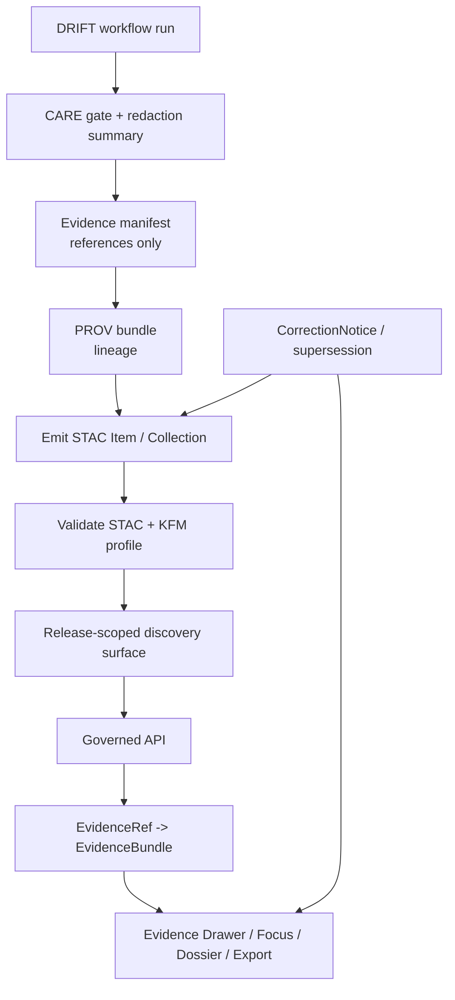

<!-- [KFM_META_BLOCK_V2]
doc_id: kfm://doc/NEEDS-VERIFICATION
title: STAC
type: standard
version: v1
status: draft
owners: NEEDS VERIFICATION
created: YYYY-MM-DD
updated: YYYY-MM-DD
policy_label: NEEDS VERIFICATION
related: [NEEDS VERIFICATION]
tags: [kfm, search, drift, stac, provenance, evidence]
notes: [Current-session evidence exposed PDFs only; repo checkout, owners, dates, and neighboring file existence need verification.]
[/KFM_META_BLOCK_V2] -->

# STAC

Release-scoped STAC packaging for retrieval episodes, evidence handoff, and public-safe search discovery.

> [!NOTE]
> **Status:** draft  
> **Owners:** NEEDS VERIFICATION  
> **Path:** `docs/search/drift/stac/README.md`  
>       
> **Quick jump:** [Scope](#scope) · [Repo fit](#repo-fit) · [Accepted inputs](#accepted-inputs) · [Exclusions](#exclusions) · [Directory tree](#directory-tree) · [Quickstart](#quickstart) · [Usage](#usage) · [Diagram](#diagram) · [Validation & CI expectations](#validation--ci-expectations) · [Tables](#tables) · [Task list](#task-list--definition-of-done) · [FAQ](#faq) · [Appendix](#appendix)

> [!IMPORTANT]
> In this target subtree, **STAC is a derived retrieval surface**.  
> It helps discovery, triage, and evidence handoff when a search or drift episode benefits from spatiotemporal Collections, Items, or related assets — but it must stay downstream of release scope, policy posture, correction lineage, and `EvidenceRef -> EvidenceBundle` resolution.

> [!NOTE]
> **Truth posture used in this README**
>
> - **CONFIRMED** = directly grounded in the attached KFM corpus visible in this session
> - **INFERRED** = strong structural completion from repeated KFM doctrine
> - **PROPOSED** = recommended starter shape or build step
> - **UNKNOWN** = not verified strongly enough in this session
> - **NEEDS VERIFICATION** = checkout-backed repo proof is still missing

## Scope

This README defines the **STAC-shaped part of search drift**: the release-scoped discovery layer used when a retrieval episode should be represented as a Collection, Item, or provenance-bearing asset set.

In this document, a **retrieval episode** means one governed search execution that produces a bounded, reviewable output bundle. The value of STAC here is not sovereignty. Its value is that it can make the episode **discoverable, auditable, and easier to hand off to evidence inspection** without letting the STAC object quietly replace canonical truth.

Drift is acceptable here only when it stays **visible, bounded, rebuildable, and policy-safe**.

## Repo fit

| Link | Intended role here | Status |
|---|---|---|
| [`./README.md`](./README.md) | This directory README for STAC-shaped retrieval packaging | **TARGET FILE** |
| [`../README.md`](../README.md) | Intended upstream drift overview | **NEEDS VERIFICATION** |
| [`../../README.md`](../../README.md) | Intended upstream search overview | **NEEDS VERIFICATION** |
| [`../examples/README.md`](../examples/README.md) | Intended redaction-safe examples companion | **NEEDS VERIFICATION** |
| [`../graph-queries/README.md`](../graph-queries/README.md) | Intended adjacent graph-shaped retrieval surface | **NEEDS VERIFICATION** |
| [`../embeddings/README.md`](../embeddings/README.md) | Intended adjacent vector / embedding surface | **NEEDS VERIFICATION** |
| [`../hyde/README.md`](../hyde/README.md) | Intended adjacent HYDE surface | **NEEDS VERIFICATION** |

**Repo-fit rule:** this path should document **STAC-shaped retrieval packaging** for drift/search episodes. It should **not** become the place for canonical truth storage, whole-platform catalog doctrine, or unverified live endpoint inventory.

## Accepted inputs

This path is the right home for:

- STAC Collection and Item conventions for **retrieval episodes**
- Guidance for **public-safe preview**, **evidence-manifest**, and **provenance** assets
- Redaction-safe examples that show **generalized**, **partial**, **stale-visible**, **withdrawn**, or **superseded** states
- Mapping notes between STAC-shaped packaging and KFM trust objects such as `EvidenceRef`, `EvidenceBundle`, `CatalogClosure`, `ProjectionBuildReceipt`, and `CorrectionNotice`
- Validation and profile notes for STAC in the **search / drift** context
- Source-role notes when observational, modeled, documentary, archival, or community-contributed material is exposed through a STAC-shaped retrieval surface

## Exclusions

This path is **not** the right home for:

- Canonical contract and schema files that belong in dedicated contract / schema surfaces
- RAW, WORK, QUARANTINE, or canonical-write behavior
- Detached “STAC-ish” examples that hide rights, sensitivity, generalization, withholding, or correction state
- Unverified live route trees, DTOs, schema filenames, CLI entrypoints, or CI workflow names presented as current repo fact
- A public catalog design that bypasses governed evidence resolution
- Any pattern where a Collection, Item, preview tile, or search hit is allowed to masquerade as authoritative truth

> [!WARNING]
> If a result is too sensitive, too stale, too partial, or too weakly supported to publish cleanly, the answer is not “make the STAC nicer.” The answer is to **generalize, withhold, mark partial, surface correction, or fail closed**.

## Directory tree

> [!WARNING]
> **Current-session evidence boundary**
>
> This session did **not** expose a mounted repository tree. The directly inspected workspace evidence for this task was the attached PDF corpus only. Path-level file presence, neighboring README existence, owners, dates, templates, fixtures, and local validator commands remain **NEEDS VERIFICATION** until checkout-backed proof exists.

### Target path

```text
docs/search/drift/stac/
└── README.md   # target file requested in this task
```

### Proposed starter expansion

```text
docs/search/drift/stac/
├── README.md
└── templates/              # PROPOSED: redaction-safe Collection / Item starter templates
```

### Proposed operational outputs

```text
data/stac/search/drift/     # PROPOSED: retrieval episode Collections / Items
data/processed/search/drift/  # PROPOSED: evidence manifests, redaction reports, bounded artifacts
data/processed/prov/search/drift/  # PROPOSED: PROV bundles for retrieval episodes
```

The first block reflects the **requested target path**. The latter two blocks are **PROPOSED** starter structure based on the attached STAC draft baseline and still require checkout verification.

## Quickstart

1. Verify the live checkout before adding path-level claims.
2. Confirm whether this subtree is **docs-only** or also expected to hold templates, fixtures, or examples.
3. Treat every STAC object here as **release-scoped derived packaging**.
4. Keep evidence as **references, manifests, and provenance assets** — not raw sensitive payload.
5. Record unknowns instead of smoothing them into fake implementation certainty.

```text
verify checkout
    ↓
confirm subtree scope
    ↓
author or revise redaction-safe STAC guidance
    ↓
validate STAC + KFM profile assumptions
    ↓
check CARE / sensitivity leakage
    ↓
confirm evidence handoff and correction visibility
```

## Usage

### Use this directory when

Use this path when a search or drift episode benefits from one or more of the following:

- a Collection / Item shape that improves **discovery** or grouping
- a public-safe preview or manifest that should travel with **provenance**
- a predictable handoff from retrieval output to **EvidenceBundle** inspection
- explicit representation of **generalized**, **withheld**, **partial**, **stale-visible**, or **corrected** states

### Do not use it when

Do **not** use this path as a shortcut for:

- canonical truth publication
- undocumented API reference
- hiding restricted geometry behind asset links
- treating STAC as the only explanation path for a consequential claim

### Collection expectations

A Collection should represent a **stable family of retrieval episodes**, not a dumping ground for unrelated search output. A good Collection makes it obvious which workflow, policy context, and index or release context the episode family belongs to.

Recommended starter posture:

- one stable collection for governed retrieval episodes
- version-pinning by workflow version, policy version, and index snapshot or lineage reference
- summary text that describes **what kind of retrieval family** the collection represents, not a vague generic catalog sentence

### Item expectations

A STAC Item should normally be created **per governed retrieval episode** that produces a bounded output bundle.

Good examples include:

- a Focus Mode research run over a bounded topic
- a Story Node evidence acquisition run
- a retrieval health-check run that emits only redaction-safe outputs

### Minimum PROV expectations

A retrieval episode should carry enough provenance to reconstruct **who ran what, against what, and what was emitted**.

Minimum starter expectations:

- `prov:Activity` for the retrieval execution
- `prov:Entity` records for outputs such as evidence manifest, redaction report, or bounded narrative stub
- `prov:Agent` for the service / runner, and optionally a reviewer
- explicit relations such as `prov:used`, `prov:wasGeneratedBy`, and `prov:wasDerivedFrom`

### Illustrative retrieval episode item

```json
{
  "stac_version": "1.0.0",
  "type": "Feature",
  "id": "urn:kfm:search:drift:episode:0123abcd4567ef89",
  "collection": "kfm-search-drift-episodes",
  "geometry": null,
  "bbox": null,
  "properties": {
    "datetime": "YYYY-MM-DDT00:00:00Z",
    "kfm:retrieval_episode_id": "urn:kfm:search:drift:episode:0123abcd4567ef89",
    "kfm:workflow_id": "drift:hybrid-global-local",
    "kfm:workflow_version": "NEEDS VERIFICATION",
    "kfm:query_hash": "sha256:…",
    "kfm:query_redacted": true,
    "kfm:care_gate_status": "redact",
    "kfm:index_snapshot_id": "urn:kfm:search:index:snapshot:…",
    "properties.prov:wasGeneratedBy": "urn:kfm:prov:activity:drift_retrieval_episode"
  },
  "assets": {
    "prov_bundle": {
      "href": "artifacts/prov/run.jsonld",
      "type": "application/ld+json",
      "roles": ["provenance"]
    },
    "evidence_manifest": {
      "href": "artifacts/evidence/manifest.json",
      "type": "application/json",
      "roles": ["metadata"]
    },
    "redaction_report": {
      "href": "artifacts/reports/redaction.json",
      "type": "application/json",
      "roles": ["report"]
    }
  }
}
```

> [!NOTE]
> **Illustrative only** — this is a starter shape derived from the attached corpus, not a confirmed mounted schema or live payload.

## Diagram



## Validation & CI expectations

A governed retrieval STAC object should pass, at minimum:

- **STAC validation** using `PySTAC item.validate()` or equivalent
- **KFM profile checks** proving required `kfm:*` properties and required assets / roles are present
- **CARE leakage checks** proving no raw sensitive coordinates or restricted identifiers leak through a discovery-safe object
- **Provenance linkage checks** proving the `prov_bundle` asset exists and the episode identifier is stable and reused consistently
- **Surface-state checks** proving generalized, stale-visible, withdrawn, denied, and abstained states remain visible
- **Correction drills** proving supersession, withdrawal, or narrowing stays discoverable instead of being silently replaced

## Tables

### Packaging matrix

| Surface object | Primary job | Must include | Must **not** imply | Posture |
|---|---|---|---|---|
| Retrieval Collection | Group a stable family of retrieval episodes | Scope summary, workflow/policy context, release or index lineage cues | That the Collection is canonical truth | **CONFIRMED role / PROPOSED local shape** |
| Retrieval Item | Represent one governed retrieval episode | Stable ID, time, bounded episode metadata, evidence linkage | That opening the Item alone settles a consequential claim | **CONFIRMED role / PROPOSED local shape** |
| `prov_bundle` asset | Carry lineage for the episode | Activity/entity/agent linkage and derivation path | That provenance replaces policy or review state | **CONFIRMED duty** |
| `evidence_manifest` asset | Carry bounded references to support | Reference list, stable IDs, redaction-safe structure | That raw restricted evidence belongs in public-safe STAC | **INFERRED / PROPOSED** |
| `redaction_report` asset | Make withholding/generalization visible | What was reduced, why, and at what policy stage | That redaction can remain implicit | **INFERRED / PROPOSED** |
| Correction / supersession marker | Preserve visible lineage under change | Replacement / withdrawal / narrowing context | Silent replacement or quiet erasure | **CONFIRMED duty** |

### KFM-to-STAC mapping checkpoints

| KFM concern | Carry it in STAC-shaped packaging as | Minimum expectation |
|---|---|---|
| Release scope | Collection / Item metadata and related links | A reviewer can tell what scope the episode belongs to |
| Evidence handoff | Stable reference or asset pointing to evidence resolution | A consumer can get from discovery to governed evidence without guessing |
| Policy / CARE state | Explicit redaction / sensitivity / visibility properties | Public-safe vs generalized vs withheld is not implied away |
| Source role | Provider note, property, or profile note | Observed, modeled, documentary, archival, or mixed status stays legible |
| Freshness | Datetime, stale cue, or projection freshness note | Stale-visible states do not masquerade as current |
| Correction lineage | Related links or correction asset / notice | Superseded or withdrawn episodes remain traceable |
| Geometry safety | Generalized geometry or `null` geometry where needed | Exact-location risk does not leak through the discovery layer |

### Visible drift & failure states

| Visible state | What the STAC surface should say | Consumer behavior |
|---|---|---|
| `promoted` | Safe for outward use within the named scope | May render / index normally |
| `generalized` | Geometry or detail was reduced for safety | Must not infer hidden precision |
| `partial` | Coverage is incomplete or intentionally bounded | Must disclose incompleteness in-place |
| `source-dependent` | Upstream dependency remains visible | Must not present as fully settled corroboration |
| `conflicted` | Independent support disagrees materially | Must not collapse conflict into one confident story |
| `stale-visible` | Still renderable, but beyond declared freshness basis | Must show stale cue |
| `withdrawn` / `superseded` | No longer current for outward use | Must route to correction or replacement context |
| `withheld` | Not publishable on the requested surface | Must not leak hidden payload through metadata side channels |

## Task list & definition of done

### Immediate work

- [ ] Verify the live contents of `docs/search/drift/stac/` in a mounted checkout.
- [ ] Confirm the owner field for this subtree.
- [ ] Confirm whether this path is docs-only or also expected to hold templates, examples, or fixtures.
- [ ] Verify whether any STAC profile, extension allowlist, or fixtures already exist elsewhere in the repo.
- [ ] Add at least one redaction-safe Collection / Item example if this subtree is meant to hold examples.
- [ ] Add at least one correction / supersession example path or reference.
- [ ] Check that no unverified route, schema, or validator command is documented here as current fact.

> [!IMPORTANT]
> **Definition of done**
>
> This README is in a good repo-ready state when:
>
> - the path and neighboring links have been checkout-verified;
> - STAC is clearly framed as **derived**, **release-scoped**, and **downstream of evidence resolution**;
> - evidence handoff, rights/sensitivity, freshness, and correction duties are visible;
> - generalized / withheld / stale / partial states are documented as first-class behavior;
> - at least one example is redaction-safe;
> - no mounted implementation is implied where session evidence is missing.

## FAQ

<details>
<summary><strong>Does this directory define all STAC in KFM?</strong></summary>

No. This README is scoped to the **search / drift retrieval surface**. It should not be read as the whole-platform STAC doctrine.

</details>

<details>
<summary><strong>Does STAC replace EvidenceBundle?</strong></summary>

No. STAC here improves discovery and packaging. Consequential trust still depends on governed evidence resolution.

</details>

<details>
<summary><strong>Must every search result become a STAC Item?</strong></summary>

No. Use STAC when it materially improves discovery, grouping, preview, or provenance. Do not force non-spatiotemporal or non-asset results into brittle pseudo-STAC.

</details>

<details>
<summary><strong>What should happen when geometry is too sensitive?</strong></summary>

Generalize it, omit it, or withhold publication. The safety state should be visible in the object instead of being silently assumed.

</details>

<details>
<summary><strong>What is the safest next move if this subtree is still mostly empty?</strong></summary>

Add a small starter pack after checkout verification: one template, one valid redaction-safe example, one invalid example, and one correction/supersession example.

</details>

## Appendix

<details>
<summary><strong>Appendix — review prompts and starter property / asset vocabulary</strong></summary>

### Review prompts

Before merging a STAC-related change under this path, ask:

- Can a reviewer tell what release or retrieval scope this object belongs to?
- Does the object make public-safe vs generalized vs withheld status explicit?
- Is there a visible handoff to evidence instead of a dead end?
- Does the object distinguish modeled, documentary, and direct observational material where relevant?
- Would a supersession or withdrawal still be visible six months later?

### Starter property / asset vocabulary

| Starter label | Use | Posture |
|---|---|---|
| `kfm:retrieval_episode_id` | Stable retrieval-episode identity | **PROPOSED / baseline-derived** |
| `kfm:workflow_id` | Names the retrieval workflow family | **PROPOSED / baseline-derived** |
| `kfm:workflow_version` | Pins workflow behavior | **PROPOSED / baseline-derived** |
| `kfm:query_hash` | Stores a hash instead of raw query text when redaction is required | **PROPOSED / baseline-derived** |
| `kfm:query_redacted` | Declares that raw query text is not public-safe | **PROPOSED / baseline-derived** |
| `kfm:index_snapshot_id` | Identifies what search ran against | **PROPOSED / baseline-derived** |
| `prov_bundle` | Lineage asset for the retrieval episode | **CONFIRMED duty / PROPOSED local key** |
| `evidence_manifest` | Bounded support references | **PROPOSED / baseline-derived** |
| `redaction_report` | Explains what was generalized or withheld | **PROPOSED / baseline-derived** |

### Notes

- The starter labels above are a **reviewable vocabulary seed**, not a verified mounted schema.
- Exact profile filenames, extension allowlists, validator entrypoints, and fixture paths remain **NEEDS VERIFICATION** until checkout-backed proof exists.

<p align="right"><a href="#stac">Back to top ↑</a></p>

</details>
