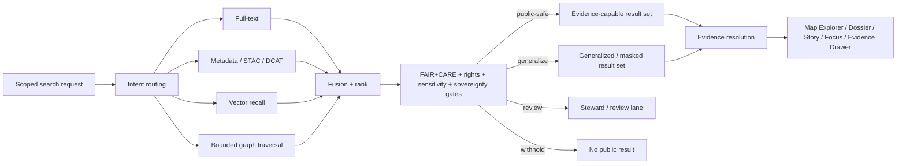

<!-- [KFM_META_BLOCK_V2]
doc_id: kfm://doc/<uuid-NEEDS-VERIFICATION>
title: Kansas Frontier Matrix — FAIR+CARE Search Rules
type: standard
version: v1
status: draft
owners: @bartytime4life
created: 2026-03-22
updated: YYYY-MM-DD
policy_label: NEEDS_VERIFICATION
related: [docs/search/README.md, docs/search/semantic-search.md, docs/search/query-language.md, docs/search/index-architecture.md, docs/standards/README.md, docs/standards/faircare/FAIRCARE-GUIDE.md, docs/standards/sovereignty/INDIGENOUS-DATA-PROTECTION.md]
tags: [kfm, search, faircare, governance]
notes: [Created date inferred from the first visible scaffold commit for this file; owner grounded from /.github/CODEOWNERS; policy label, durable UUID, and post-merge updated date still need verification; upstream FAIRCARE and sovereignty docs are present but currently scaffold-only.]
[/KFM_META_BLOCK_V2] -->

# Kansas Frontier Matrix — FAIR+CARE Search Rules

Search-local operating rules for release-scoped discovery that stays FAIR-aware, CARE-aware, sovereignty-aware, and evidence-bounded.

> **Status:** draft  
> **Owners:** `@bartytime4life`  
> **Path:** `docs/search/faircare-search-rules.md`  
> **Repo fit:** search-local rule layer under [`./README.md`](./README.md); complements [`./semantic-search.md`](./semantic-search.md), [`./query-language.md`](./query-language.md), and [`./index-architecture.md`](./index-architecture.md); bridges to [`../standards/README.md`](../standards/README.md), [`../standards/faircare/FAIRCARE-GUIDE.md`](../standards/faircare/FAIRCARE-GUIDE.md), and [`../standards/sovereignty/INDIGENOUS-DATA-PROTECTION.md`](../standards/sovereignty/INDIGENOUS-DATA-PROTECTION.md).  
> **Quick jumps:** [Scope](#scope) · [Accepted inputs](#accepted-inputs) · [Exclusions](#exclusions) · [Rule stack](#rule-stack) · [Decision matrix](#retrieval-decision-matrix) · [Source-role handling](#source-role-handling) · [Traversal and expansion limits](#traversal-and-expansion-limits) · [Review & definition of done](#review--definition-of-done) · [Open verification items](#open-verification-items)

> [!IMPORTANT]
> Search may widen discovery. It may **not** widen exposure.

> [!NOTE]
> This file is intentionally **search-local**. It does not replace broader FAIR+CARE, governance, or sovereignty standards. It defines how those obligations shape retrieval, ranking, result shaping, and handoff inside the search subsystem.

## Scope

This document applies to release-scoped search and discovery behavior across KFM search surfaces, including:

- search over documents, datasets, and metadata
- STAC / DCAT / catalog discovery
- graph-assisted exploration
- spatial and temporal retrieval
- Dossier, Story, Map Explorer, Evidence Drawer, and Focus handoff paths
- search-derived snippets, previews, rankings, and generalized result displays

This document is **not** a claim that current enforcement is complete. It defines the rule layer that search behavior should follow and that review, fixtures, and later workflow gates should verify.

## Accepted inputs

Content that belongs here includes:

- FAIR+CARE retrieval rules
- rights, sensitivity, and sovereignty-aware search behavior
- release-scope filtering rules
- result shaping and generalization rules
- provenance-preserving snippet and preview rules
- graph traversal and query expansion limits
- evidence-capable handoff rules for Focus, Dossier, Story, and Map Explorer
- search review checks, failure conditions, and redaction-safe examples

## Exclusions

Content that does **not** belong here:

- canonical truth modeling or lifecycle law as a primary topic
- raw ingest mechanics except where they affect admissibility or search exposure
- free-form model behavior detached from retrieval and evidence handoff
- direct-client bypass patterns
- exact-location disclosure patterns for sensitive or review-bearing lanes
- unbounded graph exploration
- broad FAIR+CARE theory that does not change search behavior
- asserted runtime enforcement details not directly verified in mounted implementation

## Why this file exists

The search subsystem is already positioned as a **derived, rebuildable discovery layer**. It improves recall, ranking, navigation, and handoff, but it does not become sovereign truth. That makes FAIR+CARE behavior especially important here:

- search is often the fastest place to accidentally overexpose sensitive material
- ranking can silently flatten differences between public-safe, generalized, source-dependent, modeled, and review-bearing material
- graph and vector expansion can over-connect records that should remain bounded
- snippets and previews can leak more than the final destination surface would allow
- “findable” is useful, but KFM needs “findable **within policy and care**”

A compact search doctrine sentence:

> **FAIR makes material discoverable; CARE determines whether discovery may become visible, generalized, withheld, or escalated for review.**

## Governing rule

Search in KFM follows this priority order:

1. **Release scope before relevance**
2. **Rights, sensitivity, and sovereignty before ranking convenience**
3. **Public-safe precision before full-detail recall**
4. **Evidence-capable handoff before outward claim-bearing use**
5. **Explainability before opaque expansion**
6. **Fail-closed behavior before “best effort” exposure**

That means relevance scoring is never the first gate. Admissibility, public-safe state, and release state come first.

## Rule stack

| Gate | Question | Search-side consequence |
|---|---|---|
| Release gate | Is the material in promoted, releasable scope for this surface? | Exclude anything outside allowed release scope. |
| Rights gate | Is redistribution or outward preview allowed here? | Withhold, narrow, or require review when rights posture is unclear or restrictive. |
| Sensitivity / care gate | Does the result create privacy, cultural, sovereignty, or exact-location risk? | Generalize, mask, aggregate, or suppress the result before ranking/output. |
| Precision gate | At what granularity may this result appear? | Prefer public-safe geometry, public-safe excerpts, and coarse location where needed. |
| Provenance gate | Can the result hand off to inspectable support? | Results that cannot support evidence handoff must not flow into claim-bearing surfaces. |
| Expansion gate | Is query expansion or graph traversal still within bounded, explainable limits? | Stop traversal, narrow the query, or drop unsafe joins. |
| Surface gate | Which surface is requesting the result? | Apply stricter shaping for public/civic flows than for steward or review flows. |

## Retrieval decision matrix

> [!TIP]
> The table below is normative behavior guidance. Exact result-object fields and enforcement hooks remain **NEEDS VERIFICATION** until search contracts and fixtures are directly verified.

| Situation | Search behavior | Public result shape | Required visible state |
|---|---|---|---|
| Released, public-safe, non-sensitive material | Retrieve, rank, and return normally | Standard result card / snippet / map marker | release-scoped, evidence-capable |
| Released material with precision risk | Retrieve, but downgrade to safe precision | generalized location, masked snippet, aggregated bucket, or coarse geometry | generalized |
| Rights or redistribution unclear | Do not render publicly | no public result, or steward-only holding path | withheld / review required |
| Cultural, Indigenous, archaeological, oral-history, biodiversity, or exact-location-sensitive material | Prefer suppression or approved generalization over “helpful” detail | generalized preview or no public result | generalized / review required |
| Modeled, source-dependent, partial, or conflicted material | May be discoverable, but only with explicit status | result remains visibly labeled and may rank below direct observational/statutory support | modeled / source-dependent / partial / conflicted |
| Graph expansion crosses weakly supported or policy-sensitive joins | Stop traversal or narrow the path | no auto-expanded public path | bounded traversal |
| Result cannot hand off to inspectable support | Keep out of claim-bearing surfaces | optionally maintainer-only debug visibility; no public claim path | evidence handoff unavailable |
| Surface requests material outside its allowed audience class | Enforce surface-specific narrowing | public-safe subset only | surface-constrained |

## Source-role handling

Search should not treat every source family as semantically interchangeable.

| Source role | Search value | Search risk | Required handling |
|---|---|---|---|
| Statutory / administrative | Strong anchor for official boundaries, districts, legal records, agency reporting | legal classification can be mistaken for functional capacity | keep legal status explicit; do not over-infer operational reality |
| Direct observational / instrumented | Strong for measurements, field records, sensor outputs | support, cadence, units, and calibration can be lost in ranking/snippets | preserve support, units, and time semantics in preview and handoff |
| Modeled / assimilated | Useful for forecasts, scenarios, interpolations, indices | modeled outputs can be mistaken for direct fact | label modeled status in-place; do not bury under neutral prose |
| Documentary / archival | Important for history, memory, reports, newspapers, scans, transcripts | decontextualized snippets can distort meaning | preserve context, date, provenance, and interpretive status |
| Community-contributed | Valuable for local knowledge and contributed observations | moderation, confidence, and rights can be uneven | treat as governed input, not automatic truth |
| Mirror / discovery service | Helpful for discovery and redundancy | can be mistaken for origin authority | keep mirror/origin distinction visible |

## Search-local FAIR+CARE rules

### 1. Release scope is mandatory

Search must operate over allowed release scope for the requesting surface and role. Public-facing search must not quietly widen into unpublished, quarantined, or review-only material.

### 2. CARE can narrow FAIR

Findability is not a blanket publication right. If care, sovereignty, privacy, cultural sensitivity, or exact-location burden applies, search must:

- generalize
- aggregate
- mask
- withhold
- or escalate for review

Search must not treat these outcomes as degraded success. They are correct outcomes.

### 3. Snippets are governed outputs

Titles, excerpts, previews, and map popups are governed outputs. They must not reveal:

- precise coordinates when only generalized exposure is allowed
- signed URLs, tokens, or internal locator details
- sensitive narrative fragments that bypass context or rights review
- detached prose that reads like a claim but cannot route to inspectable support

### 4. Ranking must not erase evidence state

Ranking and reranking must preserve visible distinctions such as:

- direct observational
- statutory / administrative
- modeled
- source-dependent
- generalized
- partial
- conflicted

A highly ranked result that hides those states is a trust failure.

### 5. Graph traversal must stay bounded

Graph-assisted retrieval is allowed only when it is:

- typed
- explainable
- provenance-preserving
- release-scoped
- and bounded by hop, relation, and policy constraints

Graph proximity is not authority.

### 6. Query expansion must stay safe

Expansion, synonyming, semantic recall, and generated query broadening must not introduce:

- new factual claims
- unsafe location detail
- unjustified relation hops
- or public exposure beyond the request’s allowed scope

### 7. Search hands off; it does not conclude

Search returns evidence-capable references, scoped previews, and routeable candidates. Consequential explanation remains downstream of evidence resolution, policy checks, and runtime outcome handling.

## Traversal and expansion limits

Search components may use full-text, metadata, vector, graph, and hybrid routing/fusion, but the following limits apply:

- **Full-text** may rank and filter, but must not overrule care gates.
- **Vector / semantic recall** may expand candidate sets, but must not be the sole basis for claim-bearing output.
- **Graph search** must preserve relation type, path length, and provenance hints.
- **Metadata / STAC / DCAT search** may improve discoverability, but it does not weaken publication classes.
- **Hybrid fusion** should prefer explainable combinations over opaque “best score wins” behavior.
- **Generated or hypothetical expansion** must be auditable where it affects outward visibility.

### Practical stop conditions

Stop or narrow retrieval when any of the following appear:

- unknown rights posture
- exact-location sensitivity not covered by a safe generalization
- unresolved sovereignty or cultural handling burden
- no evidence-capable handoff
- source conflict without clear disclosure path
- graph expansion drift
- stale or mismatched release scope

## Illustrative result-shaping fragment

> [!NOTE]
> Illustrative only. This is **not** a verified search schema.

```json
{
  "title": "Generalized heritage cluster",
  "surface_state": "generalized",
  "release_scope": "published",
  "evidence_handoff": "required",
  "preview_policy": "public-safe",
  "provenance_hint": "archival-source",
  "notes": [
    "Exact location withheld",
    "Further detail requires steward-reviewed path"
  ]
}
```

## Diagram



## Review & definition of done

A search change touching retrieval, ranking, snippets, previews, graph expansion, or surface handoff should not be considered done until the following checks pass.

| Check | Expectation |
|---|---|
| Release-scope check | Public search cannot retrieve outside promoted scope. |
| Rights / sensitivity check | Search behavior narrows or withholds when rights or sensitivity posture requires it. |
| Precision check | Exact-location risk is generalized, aggregated, or withheld. |
| Provenance check | Result can hand off to inspectable support or stays out of claim-bearing flows. |
| State-visibility check | generalized / modeled / partial / source-dependent / conflicted states remain visible. |
| Traversal check | graph/vector expansion is bounded and explainable. |
| Redaction check | examples and screenshots are public-safe. |
| Focus handoff check | downstream path still supports answer / abstain / deny / error semantics. |
| Documentation check | this file and adjacent search docs remain aligned. |
| Unknowns check | any unverified enforcement claim is still marked NEEDS VERIFICATION rather than implied as live. |

## Open verification items

The following items should remain explicit until directly verified in mounted implementation:

- exact search runtime and engine mix
- live schema inventory for search result objects
- fixture coverage for generalized, withheld, partial, and conflicted search outputs
- merge-blocking workflow coverage for search-local FAIR+CARE checks
- current reason / obligation registry implementation for search-facing policy outcomes
- parity between this file and future substantive versions of:
  - `../standards/faircare/FAIRCARE-GUIDE.md`
  - `../standards/sovereignty/INDIGENOUS-DATA-PROTECTION.md`

## Minimal maintenance rule

When adjacent standards or search contracts become more concrete:

1. update this file first for terminology stability,
2. then align examples and matrices,
3. then add or tighten fixtures and review checks,
4. and only then claim stronger enforcement.

<details>
<summary><strong>Anti-patterns to reject</strong></summary>

### Do not do these

- treat vector similarity as proof
- let graph neighbors become authority by association
- return exact location from archaeology, heritage, biodiversity, or community-held materials just because recall found it
- let a mirror outrank an origin authority without saying so
- hide modeled status behind neutral snippet text
- show public snippets that reveal more than the destination surface would allow
- let query expansion invent provenance
- let search become a parallel truth path that bypasses Evidence Drawer or evidence resolution

</details>

---

**Back to top:** [Kansas Frontier Matrix — FAIR+CARE Search Rules](#kansas-frontier-matrix--faircare-search-rules)
