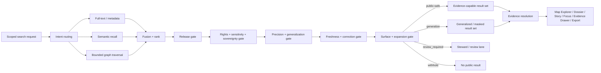

<!-- [KFM_META_BLOCK_V2]
doc_id: kfm://doc/<uuid-NEEDS-VERIFICATION>
title: Kansas Frontier Matrix — FAIR+CARE Search Rules
type: standard
version: v1
status: draft
owners: @bartytime4life
created: 2026-03-22
updated: 2026-04-06
policy_label: NEEDS_VERIFICATION
related: [docs/search/README.md, docs/search/semantic-search.md, docs/search/query-language.md, docs/search/index-architecture.md, docs/standards/README.md, docs/standards/faircare/FAIRCARE-GUIDE.md, docs/standards/sovereignty/INDIGENOUS-DATA-PROTECTION.md]
tags: [kfm, search, faircare, governance]
notes: [Owner and created date came from the provided scaffold; updated date reflects this draft pass; durable UUID, policy label, working-branch parity, and mounted enforcement still need confirmation.]
[/KFM_META_BLOCK_V2] -->

# Kansas Frontier Matrix — FAIR+CARE Search Rules

Search-local operating rules for release-scoped discovery that stays FAIR-aware, CARE-aware, sovereignty-aware, and evidence-bounded.


> **Status:** draft  
> **Owners:** `@bartytime4life`  
> **Path:** `docs/search/faircare-search-rules.md`  
> **Repo fit:** search-local rule layer under [`./README.md`](./README.md); complements [`./semantic-search.md`](./semantic-search.md), [`./query-language.md`](./query-language.md), and [`./index-architecture.md`](./index-architecture.md); bridges to [`../standards/README.md`](../standards/README.md), [`../standards/faircare/FAIRCARE-GUIDE.md`](../standards/faircare/FAIRCARE-GUIDE.md), and [`../standards/sovereignty/INDIGENOUS-DATA-PROTECTION.md`](../standards/sovereignty/INDIGENOUS-DATA-PROTECTION.md).  
> **Current public-main signal:** `docs/search/` is a visible checked-in subtree on public `main`; exact working-branch parity, merge gates, and runtime wiring still need verification.  
> **Quick jumps:** [Scope](#scope) · [Repo fit](#repo-fit) · [Accepted inputs](#accepted-inputs) · [Exclusions](#exclusions) · [Current alignment note](#current-public-main-alignment-note) · [Rule stack](#rule-stack) · [Surface handling](#surface-class-handling) · [Decision matrix](#retrieval-decision-matrix) · [Source roles](#source-role-handling) · [Traversal limits](#traversal-and-expansion-limits) · [Checklist](#review-checklist--definition-of-done) · [Open verification items](#open-verification-items)

> [!IMPORTANT]
> Search may widen discovery. It may **not** widen exposure.

> [!NOTE]
> Truth posture for this file: **CONFIRMED** on doctrine, current public search-lane placement, and adjacent public standards surfaces; **INFERRED** on search-local contract shapes not directly surfaced here; **PROPOSED** on concrete rule phrasing and review choreography; **NEEDS VERIFICATION** on mounted schemas, fixtures, workflow gates, engine mix, and deployed runtime behavior.

## Scope

This document applies to release-scoped search and discovery behavior across KFM search surfaces, including:

- search over documents, datasets, metadata, and catalog records
- graph-assisted exploration
- spatial and temporal retrieval
- search-derived snippets, previews, rankings, and generalized result displays
- handoff into Map Explorer, Dossier, Story, Evidence Drawer, Focus Mode, Compare, and export preview flows

This document is **search-local**. It does not replace broader FAIR+CARE, governance, or sovereignty standards. It defines how those obligations shape retrieval, ranking, result shaping, and evidence handoff inside the search subsystem.

## Repo fit

| Item | Current public `main` signal | Role here | Read carefully because |
|---|---|---|---|
| `docs/search/faircare-search-rules.md` | **CONFIRMED** draft file present | Search-local governance layer for retrieval, ranking, previews, generalization, and handoff | This file should stay conservative about implementation depth |
| `./README.md` | **CONFIRMED** substantive search index | Local search-system orientation and terminology anchor | It already uses a stronger public-main evidence boundary than older search docs |
| `./semantic-search.md` | **CONFIRMED** path in the checked-in subtree | Retrieval-method detail | Behavior claims still need separate verification if they become operationally specific |
| `./query-language.md` | **CONFIRMED** draft file present | User-facing / API-facing search contract and grammar surface | Owner marker and many downstream contract surfaces remain incomplete or proposed |
| `./index-architecture.md` | **CONFIRMED** draft file present | Derived search placement, projection, and boundary note | It still carries an attached-corpus-only evidence boundary and should not be over-read as current implementation proof |
| `../standards/README.md` | **CONFIRMED** substantive standards index | Cross-cutting routing surface for shared standards | This is the `docs/standards/` lane for “what must be true” |
| `../standards/faircare/FAIRCARE-GUIDE.md` | **CONFIRMED** substantive draft standard | Cross-cutting FAIR+CARE publication law | Current public `main` now shows a normative guide, not just a placeholder |
| `../standards/sovereignty/INDIGENOUS-DATA-PROTECTION.md` | **CONFIRMED** draft standard with visible caveats | Sovereignty, exact-location, and review-bearing discipline | Path/owner/enforcement claims remain intentionally conservative |

## Accepted inputs

Content that belongs here includes:

- FAIR+CARE retrieval rules
- rights-, sensitivity-, and sovereignty-aware search behavior
- release-scope filtering rules
- result shaping and generalization rules
- provenance-preserving snippet and preview rules
- graph traversal and query-expansion limits
- evidence-capable handoff rules for Focus, Dossier, Story, Map Explorer, Compare, Evidence Drawer, and export preview flows
- review checks, failure conditions, and public-safe examples for search surfaces

## Exclusions

Content that does **not** belong here:

- canonical truth modeling or truth-path law as the primary topic
- raw ingest mechanics except where they affect search admissibility or exposure
- free-form model behavior detached from retrieval and evidence handoff
- direct-client bypass patterns
- exact-location disclosure patterns for sensitive or review-bearing lanes
- unbounded graph exploration
- executable parser internals, tokenizer choices, route names, or ranking-stack claims not directly verified
- broad FAIR+CARE theory that does not materially change search behavior

## Current public-main alignment note

> [!WARNING]
> The public search lane is not yet perfectly synchronized. [`./README.md`](./README.md) already uses a current public-main evidence boundary. [`./index-architecture.md`](./index-architecture.md) still preserves an attached-corpus-only boundary. [`./query-language.md`](./query-language.md) still carries a `TODO-OWNER` marker and largely **PROPOSED** downstream contract surfaces. This file should therefore stay conservative about parser, schema, workflow, and deployment claims.

## Why this file exists

The search subsystem is a **derived, rebuildable discovery layer**. It improves recall, routing, ranking, and navigation, but it does not become sovereign truth. That makes FAIR+CARE behavior especially important here:

- search is often the fastest place to accidentally overexpose sensitive material
- ranking can silently flatten differences between public-safe, generalized, source-dependent, modeled, and review-bearing material
- graph and semantic expansion can over-connect records that should remain bounded
- snippets and previews can leak more than the destination surface would allow
- “findable” is useful, but KFM requires “findable **within policy and care**”

A compact doctrine sentence for this file:

> **FAIR makes material discoverable; CARE determines whether discovery may become visible, generalized, withheld, or escalated for review.**

## Governing order

Search in KFM follows this priority order:

1. **Release scope before relevance**
2. **Rights, sensitivity, and sovereignty before ranking convenience**
3. **Public-safe precision before full-detail recall**
4. **Evidence-capable handoff before outward claim-bearing use**
5. **Explainability before opaque expansion**
6. **Correction-visible behavior before silent replacement**
7. **Fail-closed behavior before “best effort” exposure**

That means relevance scoring is never the first gate. Admissibility, public-safe state, and release state come first.

## Rule stack

| Gate | Question | Search-side consequence |
|---|---|---|
| Release gate | Is the material in promoted, releasable scope for this surface and role? | Exclude anything outside allowed release scope. |
| Rights gate | Is redistribution or outward preview allowed here? | Withhold, narrow, or require review when rights posture is unclear or restrictive. |
| Sensitivity / care gate | Does the result create privacy, cultural, sovereignty, or exact-location risk? | Generalize, mask, aggregate, or suppress the result before ranking or output. |
| Precision gate | At what granularity may this result appear? | Prefer public-safe geometry, public-safe excerpts, and coarse location where needed. |
| Provenance gate | Can the result hand off to inspectable support? | Results that cannot support evidence handoff must not flow into claim-bearing surfaces. |
| Correction / freshness gate | Is the result stale, superseded, narrowed, withdrawn, or otherwise correction-bearing? | Keep the state visible, rebuild derived views where needed, or withhold misleading results. |
| Expansion gate | Is query expansion or graph traversal still within bounded, explainable limits? | Stop traversal, narrow the query, or drop unsafe joins. |
| Surface gate | Which surface is requesting the result? | Apply stricter shaping for public and civic flows than for steward or review flows. |

## Surface-class handling

Search behavior should vary by requesting surface, while preserving one rule everywhere: **search should route toward geography, evidence, and visible trust state rather than detached claim lists**.

| Requesting surface | Search may do | Search may not do |
|---|---|---|
| Public / civic search | Return released public-safe results, generalized previews, and evidence-capable destinations | Reveal withheld or review-only material, exact sensitive coordinates, or internal locator details |
| Map Explorer / Dossier / Story | Return geography-anchored candidates with visible freshness, support state, and evidence route | Convert snippets into unsupported claims or blur generalized vs precise state |
| Focus Mode | Supply scoped candidates and bundle-capable handoff into citation-checked synthesis | Answer solely from ranking or retrieval confidence |
| Review / stewardship | Expose broader review-bearing candidates with policy state visible | Reuse steward-only previews on public surfaces without separate release gating |
| Export preview | Return only release-safe selections that can inherit correction and evidence linkage | Generate outward artifacts from search hits that outrun release state |

## Retrieval decision matrix

> [!TIP]
> The matrix below is normative behavior guidance. Exact result-object field names, registry paths, and enforcement hooks remain **NEEDS VERIFICATION** until search contracts, schemas, and fixtures are directly surfaced.

| Situation | Search behavior | Public result shape | Required visible state |
|---|---|---|---|
| Released, public-safe, non-sensitive material | Retrieve, rank, and return normally | Standard result card, snippet, map marker, or geography-anchored hit | public-safe, evidence-capable |
| Released material with precision risk | Retrieve, but downgrade to safe precision | generalized location, masked snippet, aggregated bucket, or coarse geometry | generalized |
| Rights or redistribution unclear | Do not render publicly | no public result, or steward-only holding path | withheld / review required |
| Sovereignty-bearing, cultural, Indigenous, archaeological, oral-history, biodiversity, or exact-location-sensitive material | Prefer suppression or approved generalization over “helpful” detail | generalized preview or no public result | generalized / review required |
| Modeled, source-dependent, partial, or conflicted material | May be discoverable, but only with explicit state | result remains visibly labeled and may rank below direct observational or statutory support | modeled / source-dependent / partial / conflicted |
| Superseded, narrowed, withdrawn, or correction-bearing material | Route toward the current public-safe replacement or a visible correction notice | replacement hit, narrowed preview, or no public result | superseded / withdrawn / correction-visible |
| Graph expansion crosses weakly supported or policy-sensitive joins | Stop traversal or narrow the path | no auto-expanded public path | bounded traversal |
| Result cannot hand off to inspectable support | Keep out of claim-bearing surfaces | optionally maintainer-only debug visibility; no public claim path | evidence handoff unavailable |
| Surface requests material outside its allowed audience class | Enforce surface-specific narrowing | public-safe subset only | surface-constrained |

## Search-side obligation outcomes

> [!NOTE]
> This is a **starter mapping**, not a claim that the mounted repo already exposes these exact registry files or payload keys. It exists to keep search behavior aligned with KFM’s broader reason/obligation grammar.

| Obligation | Search-side consequence |
|---|---|
| `generalize` | Serve only coarse geometry, generalized labels, masked excerpts, or aggregated buckets |
| `withhold` | Return no public result or only a public-safe notice that detail is unavailable |
| `review_required` | Route to steward/review lane before promotion or outward use |
| `cite` | Require evidence-capable handoff; no claim-bearing preview without inspectable support |
| `disclose_partial` | Keep partial-coverage state visible in place |
| `disclose_modeled` | Keep modeled / assimilated / source-dependent state visible in place |
| `correction_notice` | Keep correction or supersession state visible wherever the result remains renderable |
| `rebuild_projection` | Rebuild affected search, vector, tile, or scene derivatives from corrected release scope |
| `log_audit` | Preserve audit linkage for the search decision and downstream handoff |

## Source-role handling

Search should not treat every source family as semantically interchangeable.

| Source role | Search value | Search risk | Required handling |
|---|---|---|---|
| Statutory / administrative | Strong anchor for official boundaries, districts, legal records, and agency reporting | legal classification can be mistaken for functional capacity | keep legal status explicit; do not over-infer operational reality |
| Direct observational / instrumented | Strong for measurements, field records, and sensor outputs | support, cadence, units, and calibration can be lost in ranking or snippets | preserve support, units, and time semantics in preview and handoff |
| Modeled / assimilated | Useful for forecasts, scenarios, interpolations, and indices | modeled outputs can be mistaken for direct fact | label modeled state in place; do not bury it under neutral prose |
| Documentary / archival | Important for history, memory, reports, newspapers, scans, and transcripts | decontextualized snippets can distort meaning | preserve context, date, provenance, and interpretive state |
| Community-contributed | Valuable for local knowledge and contributed observations | moderation, confidence, and rights can be uneven | treat as governed input, not automatic truth |
| Mirror / discovery service | Helpful for discovery and redundancy | can be mistaken for origin authority | keep mirror / origin distinction visible |

## Search-local FAIR+CARE rules

### 1. Release scope is mandatory

Search must operate over allowed release scope for the requesting surface and role. Public-facing search must not quietly widen into unpublished, quarantined, or review-only material.

### 2. CARE can narrow FAIR

Findability is not a blanket publication right. If care, sovereignty, privacy, cultural sensitivity, or exact-location burden applies, search must:

- generalize
- aggregate
- mask
- withhold
- or escalate for review

Search must not treat these outcomes as degraded success. They are correct outcomes.

### 3. Sovereignty and exact-location burdens override convenience

Where a result could expose sacred places, burial areas, heritage sites, archaeology, biodiversity occurrences, community-held material, or inference-friendly locator detail, search must favor public-safe generalization or suppression over detail-rich recall.

### 4. Snippets are governed outputs

Titles, excerpts, previews, tooltips, and map popups are governed outputs. They must not reveal:

- precise coordinates when only generalized exposure is allowed
- signed URLs, tokens, or internal locator details
- sensitive narrative fragments that bypass context or rights review
- detached prose that reads like a claim but cannot route to inspectable support

### 5. Ranking must not erase evidence state

Ranking and reranking must preserve visible distinctions such as:

- direct observational
- statutory / administrative
- modeled
- source-dependent
- generalized
- partial
- conflicted
- withdrawn or superseded where still visible

A highly ranked result that hides those states is a trust failure.

### 6. Graph traversal must stay bounded

Graph-assisted retrieval is allowed only when it is:

- typed
- explainable
- provenance-preserving
- release-scoped
- and bounded by hop, relation, and policy constraints

Graph proximity is not authority.

### 7. Query expansion must stay safe

Expansion, synonyming, semantic recall, and generated query broadening must not introduce:

- new factual claims
- unsafe location detail
- unjustified relation hops
- or public exposure beyond the request’s allowed scope

### 8. Search hands off; it does not conclude

Search returns evidence-capable references, scoped previews, and routeable candidates. Consequential explanation remains downstream of evidence resolution, policy checks, runtime outcome handling, and visible correction state.

### 9. Correction and freshness stay visible

If a hit is stale, superseded, narrowed, generalized, or withdrawn, search must surface that state where the user encounters the result. Search may not silently replace meaning and call the result “current” merely because the index still resolves.

## Traversal and expansion limits

Search components may use full-text, metadata, vector, graph, and hybrid routing or fusion, but the following limits apply:

- **Full-text** may rank and filter, but must not overrule care gates.
- **Vector / semantic recall** may expand candidate sets, but must not be the sole basis for claim-bearing output.
- **Graph search** must preserve relation type, path length, and provenance hints.
- **Metadata / STAC / DCAT search** may improve discoverability, but it does not weaken publication classes.
- **Hybrid fusion** should prefer explainable combinations over opaque “best score wins” behavior.
- **Generated or hypothetical expansion** must be auditable wherever it affects outward visibility.

### Practical stop conditions

Stop or narrow retrieval when any of the following appear:

- unknown rights posture
- exact-location sensitivity not covered by a safe generalization
- unresolved sovereignty or cultural handling burden
- no evidence-capable handoff
- source conflict without clear disclosure path
- graph-expansion drift
- stale or mismatched release scope
- correction or supersession state that would make the visible result misleading on the requested surface

## Illustrative result-shaping fragment

> [!NOTE]
> Illustrative only. This is **not** a verified search schema.

```json
{
  "title": "Generalized heritage cluster",
  "surface_state": "generalized",
  "release_scope": "published",
  "reason_codes": [
    "sensitivity.exact_location"
  ],
  "obligations": [
    "generalize",
    "cite",
    "log_audit"
  ],
  "evidence_handoff": "required",
  "preview_policy": "public-safe",
  "provenance_hint": "archival-source",
  "notes": [
    "Exact location withheld",
    "Further detail requires steward-reviewed path"
  ]
}
```

## Diagram



## Review checklist & definition of done

A search change touching retrieval, ranking, snippets, previews, graph expansion, semantic expansion, or surface handoff should not be considered done until all of the following are true:

- [ ] Public search cannot retrieve outside promoted scope.
- [ ] Rights and sensitivity posture narrows, generalizes, or withholds when required.
- [ ] Exact-location risk is generalized, aggregated, or withheld.
- [ ] Sovereignty-bearing material cannot bypass review by convenience.
- [ ] Every outward-facing result can hand off to inspectable support, or stays out of claim-bearing flows.
- [ ] `generalized`, `modeled`, `partial`, `source-dependent`, `conflicted`, `withdrawn`, and `stale-visible` states remain visible where users encounter them.
- [ ] Snippets, previews, and popups do not reveal more than the destination surface would allow.
- [ ] Graph and vector expansion stay bounded and explainable.
- [ ] Examples, screenshots, and fixtures are public-safe.
- [ ] Focus and related downstream surfaces still support answer / abstain / deny / error behavior.
- [ ] Adjacent search docs remain terminology-aligned enough that this file is not compensating for avoidable drift.
- [ ] Any unverified enforcement claim is still marked **NEEDS VERIFICATION** instead of implied as live.

## Open verification items

The following items should remain explicit until directly verified in the mounted branch or runtime under review:

- exact schema inventory for search-facing `DecisionEnvelope`, `EvidenceBundle`, `RuntimeResponseEnvelope`, and result-object payloads
- current reason / obligation registry files actually wired to search-facing policy outcomes
- fixture coverage for `generalized`, `withheld`, `review-required`, `partial`, `conflicted`, `withdrawn`, and `stale-visible` outputs
- merge-blocking workflow coverage for search-local FAIR+CARE checks under `.github/workflows/`
- current engine mix for lexical, metadata, vector, graph, and reranking layers
- public-main versus working-branch parity for:
  - `./README.md`
  - `./semantic-search.md`
  - `./query-language.md`
  - `./index-architecture.md`
  - `../standards/faircare/FAIRCARE-GUIDE.md`
  - `../standards/sovereignty/INDIGENOUS-DATA-PROTECTION.md`
- steward drawer payloads and generalized-vs-precise comparison flows for sovereignty-bearing results

## Minimal maintenance rule

When adjacent standards or search contracts become more concrete:

1. update this file first for terminology stability,
2. then align adjacent search docs and examples,
3. then add or tighten fixtures and review checks,
4. and only then claim stronger enforcement.

<details>
<summary><strong>Anti-patterns to reject</strong></summary>

### Do not do these

- treat vector similarity as proof
- let graph neighbors become authority by association
- return exact location from archaeology, heritage, biodiversity, or community-held materials just because recall found it
- let a mirror, cache, or embedding hit outrank an origin authority without saying so
- hide modeled or generalized status behind neutral snippet text
- show public snippets that reveal more than the destination surface would allow
- let query expansion invent provenance
- let withdrawn or superseded material rank as “current” without visible state
- let search become a parallel truth path that bypasses evidence resolution or the Evidence Drawer

</details>

---

**Back to top:** [Kansas Frontier Matrix — FAIR+CARE Search Rules](#kansas-frontier-matrix--faircare-search-rules)
