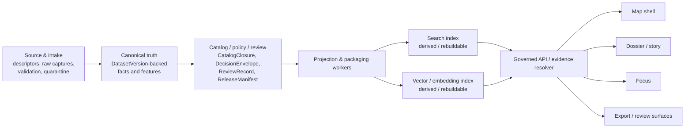
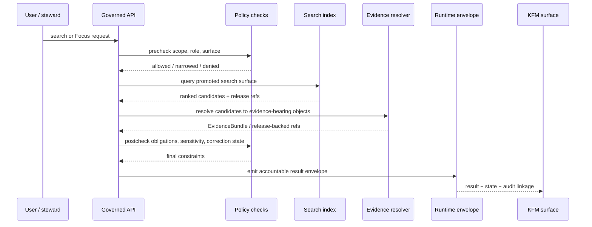

<!-- [KFM_META_BLOCK_V2]
doc_id: kfm://doc/<NEEDS_VERIFICATION_UUID>
title: Search Index Architecture
type: standard
version: v1
status: draft
owners: <NEEDS_VERIFICATION>
created: <NEEDS_VERIFICATION_DATE>
updated: <NEEDS_VERIFICATION_DATE>
policy_label: <NEEDS_VERIFICATION>
related: [<NEEDS_VERIFICATION>]
tags: [kfm, search, architecture]
notes: [Target path docs/search/index-architecture.md; attached corpus inspected; repo-local neighbors, owners, dates, and identifiers remain placeholders pending mounted repository verification.]
[/KFM_META_BLOCK_V2] -->

# Search Index Architecture

Release-backed, evidence-constrained search for KFM’s governed spatial evidence system.

> [!IMPORTANT]
> In KFM, search is a **derived, rebuildable delivery surface**. It is never canonical truth, never a public bypass around governed APIs, and never the only place where meaning survives.
>
> Current-session evidence for this note was **PDF-only**. Exact repo-local search paths, schemas, workers, engines, tests, and runtime shape therefore remain **UNKNOWN**.

**Quick jump:** [Purpose](#purpose) · [Authority boundary](#authority-boundary) · [Five-plane placement](#search-in-the-five-plane-model) · [Non-negotiable laws](#non-negotiable-search-laws) · [Search surfaces](#logical-search-surfaces) · [Projection record](#search-projection-record-inferred--proposed) · [Build lifecycle](#build-lifecycle) · [Contracts](#contracts-and-proof-objects) · [Runtime flow](#runtime-flow) · [Review gates](#minimum-review-gates) · [Open verification](#open-verification-items)

| Field | Value |
|---|---|
| Target path | `docs/search/index-architecture.md` |
| Document role | Standard architecture note for derived search and retrieval surfaces |
| Current posture | **CONFIRMED** doctrine · **INFERRED** structural completion · **PROPOSED** starter projection shape · **UNKNOWN** mounted implementation |
| Practical baseline | March 2026 KFM doctrine set, with central search-language reinforced by the attached master-manual overlays |
| Current-session evidence boundary | Attached corpus only; no directly mounted repo tree, schemas, workflows, tests, manifests, or runtime logs |
| Primary concern | Make search useful without letting it become sovereign truth |
| Main consumers | Builders, stewards, reviewers, API designers, search/ranking implementers |

## Purpose

This document defines how search should behave inside KFM’s architecture.

It does **not** define search as a standalone product, a parallel truth store, or a convenience-first indexing layer. In KFM, search exists to support discovery, navigation, retrieval acceleration, and evidence-aware runtime behavior while remaining downstream of governed publication, policy, review, release state, and correction lineage.

A KFM search hit is therefore a **navigation and retrieval aid**. It is not proof by itself.

### In scope

| Included here | Why it belongs here |
|---|---|
| Release-backed discovery | Search must operate over promoted scope, not arbitrary internal state |
| Full-text and metadata search | Core public and steward-facing discovery behavior |
| Retrieval acceleration | Search may assist dossier, story, export, and Focus flows |
| Freshness, rebuild, and correction behavior | Search must stay tied to release and correction state |
| Proof objects and runtime accountability | Search results must remain explainable under dispute or failure |
| Public-safe narrowing and withholding | Searchable representations must respect rights, sensitivity, and precision constraints |

### Out of scope

| Excluded here | Why it is excluded |
|---|---|
| Source onboarding mechanics | Covered upstream by source and intake architecture |
| Canonical storage design in full | Covered by canonical data architecture |
| Free-form assistant UX | Covered by bounded AI / Focus architecture |
| Exact engine choice | **UNKNOWN** in the mounted repo; doctrine constrains role more than product |
| Repo-local route names, DTOs, and worker names | Not directly verified in this session |
| Ranking experiments in isolation | KFM requires ranking to stay subordinate to evidence, policy, release, and correction rules |

## Authority boundary

This page is doctrine-led and intentionally conservative about implementation claims.

| Boundary | Status | Notes |
|---|---|---|
| Search index as a derived / rebuildable layer | **CONFIRMED** | Strongly repeated across the attached KFM manuals |
| Search, graph, vector, tiles, scenes, dashboards, and summaries as non-sovereign layers | **CONFIRMED** | These surfaces are useful, but may not silently become authority |
| Search written only by projection / packaging workers from promoted scope | **CONFIRMED** | Search belongs in the derived delivery plane |
| Search resolution through governed API + evidence resolver | **CONFIRMED** | Consequential outward use must reconstruct trust |
| Exact contents of `docs/search/` in the repo | **UNKNOWN** | Repo tree was not directly mounted |
| Existing search workers, schemas, tests, routes, or manifests | **UNKNOWN** | Current-session evidence did not surface them |
| Documentary repo surfaces such as `contracts/`, `schemas/`, `policy/`, `tests/`, and workflow readmes | **CONFIRMED** via attached repo-grounded summary | Helpful context, but not proof of a search implementation |

> [!NOTE]
> Where this document proposes structure, it does so as the **smallest plausible completion** of KFM doctrine, not as a claim that the repo already implements it.

## Search in the five-plane model

KFM’s search architecture only makes sense when placed inside the broader dependency order.



### Placement rule

The search index belongs in the **derived delivery** part of the system.

That has four immediate consequences:

1. It is built **from promoted scope**, not from RAW, WORK, QUARANTINE, or unpublished candidate state on the public path.
2. It is written by **projection / packaging workers**, not by browsers, shells, or model runtimes.
3. It remains **rebuildable by default**.
4. It must never become the only surviving representation of meaning.

## Non-negotiable search laws

### What search is allowed to do

| Allowed role | Posture |
|---|---|
| Discover release-backed objects | Required |
| Accelerate retrieval for dossier, story, export, and Focus | Allowed |
| Rank or filter candidates for bounded assistance | Allowed |
| Provide snippets or previews | Allowed, but previews are not final authority |
| Carry release linkage and freshness | Required |
| Surface generalized or policy-shaped representations where necessary | Required |
| Resolve to evidence-bearing or release-backed objects | Required |

### What search must never do

| Forbidden role | Why it is disallowed |
|---|---|
| Act as canonical truth | Violates authoritative-vs-derived separation |
| Bypass governed APIs | Breaks the trust membrane |
| Read from RAW / WORK / QUARANTINE directly on the public path | Violates publication discipline |
| Return uncited prose as if the hit itself were evidence | Breaks evidence-linked public claims |
| Become the only surviving representation of meaning | Violates rebuildability and auditability |
| Silently outrank release, policy, freshness, or correction state | Undermines governed publication |
| Smuggle model-generated summaries into search as if they were source facts | Collapses generation and authority |

## What may enter the index

Search inputs should be governed by surface and release class, not by convenience.

| Candidate input | Public surface | Steward / review surface | Notes |
|---|---|---|---|
| Promoted `CatalogClosure` metadata | Yes | Yes | Core outward discovery substrate |
| Release-backed evidence previews or excerpts | Yes, if preview policy allows | Yes | Must resolve onward to `EvidenceBundle` or equivalent support object |
| Promoted release cards, exports, or outward bundles | Yes | Yes | Searchable only within their published scope |
| `DecisionEnvelope` / `ReviewRecord` / correction artifacts | Normally no | Yes | Review-bearing and role-sensitive |
| RAW / WORK / QUARANTINE artifacts | No | No on normal search surfaces | Not a valid public or normal steward path |
| Withdrawn or superseded outward representations | Lineage note only | Yes, with visible state | Never silently served as current |
| Exact-location sensitive representations | Generalized or withheld only | Role- and policy-dependent | Public-safe precision rules apply |

## Logical search surfaces

The corpus strongly supports search as a family of derived discovery and retrieval surfaces, but not every slice is equally confirmed. The table below separates doctrinally firm ground from starter structure.

| Surface | Status | Primary role | Truth status | Must resolve to |
|---|---|---|---|---|
| Catalog search | **CONFIRMED** | Discover release-backed outward objects | Derived | `CatalogClosure` + release-linked outward metadata |
| Evidence text search | **INFERRED** | Find released evidence packages, excerpts, and inspectable support | Derived | `EvidenceBundle` or release-backed evidence object |
| Vector / embedding retrieval | **CONFIRMED** doctrine for derived vector stores; **PROPOSED** as a distinct slice here | Accelerate semantic retrieval for bounded assistance | Derived | `EvidenceBundle`, citation checks, release refs |
| Steward / review search | **PROPOSED** | Compare generalized vs precise, active vs withdrawn, prior vs superseding releases | Derived / review-bearing | `DecisionEnvelope`, `ReviewRecord`, `CorrectionNotice` context |
| UI-local query state | **INFERRED** | Remember search text, filters, sort, pane state | Ephemeral | UI state only; never truth-bearing |

### Reading rule

A **search result row** is not the trust object.

The trust object is the governed thing the row resolves to: a release-backed object, an `EvidenceBundle`, a `CatalogClosure`, or a runtime envelope with audit linkage.

## Search-serving KFM surfaces

Search should serve KFM’s map-first shell rather than pull the product into a search-first posture.

| Surface | Search should help by… | Search must not do… |
|---|---|---|
| Map | Finding places, features, districts, service areas, and released thematic layers | Certifying truth by map jump alone |
| Dossier | Surfacing release-backed facts, evidence excerpts, and related records | Flattening evidence into detached snippets |
| Story | Finding reusable release-backed narrative materials | Stripping context from archival or oral-history material |
| Focus | Accelerating bounded retrieval before synthesis | Becoming a free-form answer path |
| Review | Comparing surface states, release lineage, and correction effects | Acting as a hidden admin bypass |

## Search projection record (INFERRED / PROPOSED)

KFM doctrine does not prove a mounted search schema in this session. It does, however, strongly imply that a usable search projection needs enough structure to reconstruct release, freshness, correction, and evidence path.

| Minimum concern | Why it matters |
|---|---|
| Stable projection identifier | Lets a result be rebuilt, diffed, and traced |
| `release_ref` | Proves the projection came from a known released scope |
| `surface_class` | Separates public, steward, review, export, or Focus use |
| Resolved object type + reference | Keeps rows subordinate to actual trust objects |
| Display-safe title / excerpt / preview | Makes ranking useful without promoting preview to authority |
| Place / geometry hint | Supports map-first navigation without implying survey-grade certainty |
| Time basis | Prevents results from drifting away from valid-time meaning |
| Freshness basis + `stale-after` | Makes staleness explicit instead of silent |
| Correction / lineage state | Preserves supersession, withdrawal, or narrowing visibility |
| Rights / sensitivity / precision class | Keeps public-safe shaping operational |
| `ProjectionBuildReceipt` reference | Connects the row back to a provable build event |

> [!NOTE]
> Field names above are **illustrative**, not asserted repo-local schema names.

## Public protocol boundary

KFM doctrine supports standards-aligned outward discovery where that improves interoperability, but it does **not** prove a mounted search endpoint profile in this session.

| Boundary | Safe architectural reading | Current local status |
|---|---|---|
| Outward catalog discovery | Reasonable candidate for standards-aligned catalog search over published closure | **UNKNOWN** route/profile in mounted repo |
| Search result resolution | Must go through governed API + evidence resolver | **UNKNOWN** payload contract in mounted repo |
| Internal ranking / storage engine | Implementation-defined as long as it stays derived, rebuildable, and release-backed | **UNKNOWN** |
| Focus retrieval handoff | Internal governed route class, not a direct public engine path | **UNKNOWN** |

## Engine selection boundary

This document deliberately avoids pretending that doctrine already proves a particular engine.

| Decision area | Current status | Guidance |
|---|---|---|
| Exact search engine | **UNKNOWN** | Verify before documenting product-specific behavior |
| Single index vs multiple indexes | **INFERRED / PROPOSED** | Decompose by role only if proofs, freshness, and rebuild paths stay clear |
| Metadata + full-text + semantic retrieval split | **PROPOSED** | Useful only when each slice remains derived and release-backed |
| Direct database-only search | **UNKNOWN** | May be viable, but must still honor derived status and governed runtime |
| External search service | **UNKNOWN** | Acceptable only if it preserves trust membrane, release linkage, and rebuildability |

> [!CAUTION]
> Search technology is a secondary decision. KFM doctrine constrains **authority**, **freshness**, **correction**, **proof**, and **access path** before it constrains product selection.

## Build lifecycle

A search index should be built and maintained as a release-scoped projection.

1. **Canonical and control-plane prerequisites close.**  
   Eligible inputs are promoted `DatasetVersion` objects plus the required catalog, policy, review, and release artifacts for the intended scope.

2. **Projection workers build the index.**  
   Search build logic runs downstream of release, not as a side effect of browsing, editing, or authoring.

3. **A proof object is emitted.**  
   The build should produce a `ProjectionBuildReceipt` or equivalent object that records source release, projection type, build time, freshness basis, and stale-after policy.

4. **Governed API exposure begins.**  
   Public and steward clients read search only through governed interfaces.

5. **Runtime resolution reconstructs trust.**  
   Search candidates are resolved to release-backed objects or `EvidenceBundle` references before consequential outward use.

6. **Correction propagates forward.**  
   Supersession, withdrawal, narrowing, or replacement must trigger stale marking, rebuild, withdrawal, or visible lineage change in affected search-facing artifacts.

## Contracts and proof objects

Search architecture is thin without explicit object families.

| Object family | Why search cares |
|---|---|
| `DatasetVersion` | Defines the authoritative subject set that search may project from |
| `CatalogClosure` | Anchors outward discovery metadata and release linkage |
| `DecisionEnvelope` | Carries machine-readable policy results that may narrow or block search exposure |
| `ReviewRecord` | Matters where steward or policy-significant review is required |
| `ReleaseManifest` / `ReleaseProofPack` | Defines releasable scope and rollback/correction posture |
| `ProjectionBuildReceipt` | Proves the search projection was built from known release scope |
| `EvidenceBundle` | Packages support for a hit preview, dossier claim, export, or Focus retrieval |
| `RuntimeResponseEnvelope` | Makes runtime search / Focus outcomes accountable |
| `CorrectionNotice` | Preserves lineage when releases or search-facing meanings change |

### Minimum search-facing contract expectations

| Concern | Minimum expectation |
|---|---|
| Release linkage | Every indexable object points back to released authority |
| Surface class | Public, steward, review, export, or Focus use is explicit |
| Freshness basis | Search declares when the projection was built and when it becomes stale |
| Correction linkage | Superseded or withdrawn material remains traceable |
| Rights / sensitivity | Searchable representation reflects allowed precision and exposure rules |
| Auditability | Runtime search and Focus paths emit accountable runtime objects |

## Freshness, correction, and surface state

Search is only trustworthy when its staleness model is explicit.

| Requirement | Why it matters |
|---|---|
| Build time recorded | Explains what the index actually reflects |
| Freshness basis declared | Prevents silent drift |
| `stale-after` or equivalent policy present | Enables visible stale handling |
| Rebuild trigger linked to release / correction events | Keeps search aligned with published scope |
| Superseded content remains explainable | Preserves lineage instead of erasing history |
| Public-safe narrowing supported | Lets search degrade safely rather than lie |

### Surface behavior under change

| State | Meaning |
|---|---|
| Ready / promoted | Search projection matches a released scope |
| Partial | Coverage is intentionally incomplete and must be labeled |
| Stale-visible | Search is still readable but outside its declared freshness basis |
| Withdrawn | Searchable representation must no longer be served on that surface |
| Denied | Policy blocks the requested action or scope |
| Rebuilding | **INFERRED / PROPOSED** operator-visible state during correction or refresh |

## Runtime flow



## Security, policy, and trust-visible behavior

Search is part of KFM’s trust system, not just a convenience layer.

| Rule | Architectural consequence |
|---|---|
| Governed API only | No direct browser-to-index trust path |
| Public-safe scope only | Public search must not expose unpublished or unsafe candidates |
| Rights and sensitivity first | Snippets, previews, and highlights may need generalization or withholding |
| No exact-location bluffing | Search must not imply parcel-grade certainty when support is coarser |
| No silent model escalation | Semantic retrieval may assist, but it does not authorize synthesis by itself |
| No hidden correction state | Search must reflect supersession, withdrawal, or narrowing visibly |

## Minimum review gates

A search layer should not be considered done merely because queries return fast.

- [ ] Derived / rebuildable status is explicit in docs and architecture notes
- [ ] Search build inputs are restricted to promoted release scope
- [ ] `ProjectionBuildReceipt` or equivalent proof object exists
- [ ] Freshness basis and stale policy are declared
- [ ] Correction-triggered rebuild or withdrawal path is documented
- [ ] Search results drill through to release-backed objects or `EvidenceBundle` support
- [ ] Focus retrieval handoff is citation-checked and runtime-accountable
- [ ] Policy shaping of snippets, previews, and exact-location behavior is tested
- [ ] No direct frontend, shell, or model-runtime bypass around the governed API
- [ ] Negative-path behavior is visible and reviewable

## Open verification items

The following items remain intentionally visible because the mounted repo was not directly inspected in this session.

| Item | Why it matters | Current status |
|---|---|---|
| Exact neighboring docs under `docs/search/` | Needed for native repo fit and local cross-linking | **UNKNOWN** |
| Existing search implementation, if any | Prevents rewriting around phantom or duplicate structures | **UNKNOWN** |
| Actual engine choice(s) | Needed before documenting operational specifics | **UNKNOWN** |
| Existing schema files for projection / runtime search objects | Needed for contract-accurate documentation | **UNKNOWN** |
| Existing tests and fixtures | Needed before claiming verification depth | **UNKNOWN** |
| Active CI jobs for search rebuild / validation | Needed before documenting automation | **UNKNOWN** |
| Freshness thresholds per search surface | Needed for truthful stale-state language | **UNKNOWN** |
| Review-only vs public-safe search behavior in mounted code | Needed for accurate policy surface documentation | **UNKNOWN** |

## Non-goals

- Not a search-first authority engine.
- Not a free-form answer source.
- Not a detached admin bypass around governed APIs.
- Not a substitute for `CatalogClosure`, `EvidenceBundle`, or runtime accountability.
- Not a place where graph, vector, tile, scene, cache, or snippet layers quietly become truth.

## Illustrative starter decomposition

<details>
<summary>Open a small starter topology (INFERRED / PROPOSED)</summary>

```text
promoted release scope
        │
        ├── catalog search projection
        │     └── outward discovery, release cards, filters
        │
        ├── evidence text projection
        │     └── released excerpts, dossier/story support
        │
        ├── vector / embedding projection
        │     └── semantic retrieval acceleration only
        │
        └── governed API
              ├── public search
              ├── steward review search
              └── Focus retrieval handoff
```

Use this only as a logical decomposition. The mounted repo may implement these concerns differently.

</details>

## Working summary

Search in KFM should be boring in exactly the right way:

- downstream of release,
- explicit about freshness,
- unable to outrank authority,
- forced through governed APIs,
- correction-aware,
- and always capable of resolving a useful hit into an inspectable, release-backed object.

[Back to top](#search-index-architecture)
