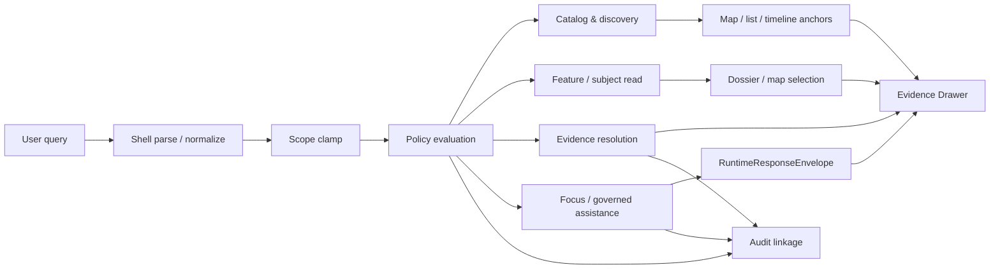

<!-- [KFM_META_BLOCK_V2]
doc_id: kfm://doc/TODO-UUID
title: Search Query Language
type: standard
version: v1
status: draft
owners: TODO-OWNER
created: TODO-YYYY-MM-DD
updated: TODO-YYYY-MM-DD
policy_label: TODO-POLICY-LABEL
related: [contracts/README.md, schemas/README.md, policy/README.md, .github/workflows/README.md]
tags: [kfm, search, query-language, governed-api, evidence]
notes: [Values marked TODO were not directly verifiable in the mounted workspace during this session; parser, endpoint, and schema implementation details remain NEEDS VERIFICATION.]
[/KFM_META_BLOCK_V2] -->

# Search Query Language

Governed search over promoted scope, designed to land users in geography, time, and evidence rather than detached result lists.


**Quick jump:** [Purpose](#purpose) · [Repo fit](#repo-fit) · [Operating model](#operating-model) · [Starter grammar](#starter-grammar-proposed) · [Filter registry](#filter-registry-proposed) · [Outcomes](#outcomes-and-surface-semantics) · [Verification](#open-verification-items)

> [!IMPORTANT]
> This file defines a **doctrine-aligned search language contract** for KFM. It does **not** claim that a mounted parser, route tree, or schema inventory already exists in the repository. Where implementation is not directly visible, this document marks the shape as **PROPOSED** or **NEEDS VERIFICATION**.

---

## Purpose

KFM search is not a general-purpose query engine, SQL passthrough, or detached site search.

Its job is to help users:

- discover released datasets and distributions
- locate authoritative subjects and dossiers
- move from results into the **Evidence Drawer**
- preserve place, time, release state, and policy context
- support bounded Focus-mode investigation without bypassing the trust membrane

In KFM terms, search is a **derived projection** and a **rebuildable accelerator**. It may speed up evidence resolution, but it must never become the only place where meaning survives.

## Repo fit

**Path:** `docs/search/query-language.md`

| Fit | Item | Status | Role |
| --- | --- | --- | --- |
| Upstream | `contracts/README.md` | CONFIRMED | Contract-surface orientation |
| Upstream | `schemas/README.md` | CONFIRMED | Schema-surface orientation |
| Upstream | `policy/README.md` | CONFIRMED | Decision grammar and deny-by-default posture |
| Upstream | `.github/workflows/README.md` | CONFIRMED | Workflow surface exists, but blocking gates remain unverified |
| Downstream | `contracts/v1/runtime/runtime_response_envelope.schema.json` | PROPOSED | Finite runtime outcomes for governed assistance |
| Downstream | `contracts/v1/evidence/evidence_bundle.schema.json` | PROPOSED | Evidence drill-through contract |
| Downstream | `contracts/v1/policy/decision_envelope.schema.json` | PROPOSED | Machine-readable policy result |
| Downstream | `apis/public/openapi.yaml` | PROPOSED | Public search/read/evidence route publication |

### Accepted inputs

This document is for:

- user-entered search text
- structured filters
- geography and time scope
- result-kind selectors
- sort and paging controls
- direct references to released subjects or evidence objects

### Exclusions

This document does **not** define:

- raw SQL syntax
- GraphQL syntax
- Lucene/Elasticsearch implementation details
- direct canonical-store access
- unpublished-scope access
- final endpoint names
- a claim that the current repository already ships this parser

## Authority and status

| Statement class | Status | Reading rule |
| --- | --- | --- |
| Search is derived, rebuildable, and may not become sovereign truth | CONFIRMED | Treat as load-bearing doctrine |
| Public/external search must operate through governed APIs over promoted scope | CONFIRMED | Non-negotiable |
| Search should land in geography and keep evidence one hop away | CONFIRMED | UI/search behavior target |
| Route families, EvidenceBundle resolution, and Focus envelopes shape search responsibilities | CONFIRMED | Architecture anchor |
| The textual grammar and canonical request object below | PROPOSED | Starter design, not mounted fact |
| Parser implementation, exact route tree, endpoint list, and schema filenames in repo | UNKNOWN / NEEDS VERIFICATION | Do not present as implemented |

## Design constraints

### 1. Search stays subordinate to evidence

Search may accelerate discovery, ranking, and retrieval. It may not replace:

- authoritative reads
- EvidenceRef → EvidenceBundle resolution
- policy decisions
- release state
- correction lineage

### 2. Search stays inside the trust membrane

Public or external surfaces may read only through governed APIs and only within promoted scope.

### 3. Search stays map-first and time-aware

Search should reinforce the shell’s geography/time model. The preferred landing is **Map Explorer**, **Timeline**, **Dossier**, **Story**, **Compare**, or **Evidence Drawer** context—not a detached results silo.

### 4. Search must fail safely

Where policy, rights, sensitivity, freshness, or evidence route requirements are not met, search-adjacent surfaces must degrade visibly rather than bluff.

---

## Operating model



### Reading the diagram

- **Catalog & discovery** handles released datasets, distributions, catalog closures, and discovery lists.
- **Feature / subject read** handles authoritative subjects, place dossiers, and released detail views.
- **Evidence resolution** handles `EvidenceRef -> EvidenceBundle`.
- **Focus / governed assistance** handles bounded synthesis and must surface finite outcomes.
- **Audit linkage** is not optional for consequential outward behavior.

## Query model

KFM should support **two compatible forms**:

1. a **human text form** for shell input
2. a **canonical request object** for APIs, tests, fixtures, and deterministic behavior

When they disagree, the **canonical request object** wins.

### Canonical request object (PROPOSED)

```json
{
  "q": "republican river flood stage",
  "kinds": ["dataset", "feature", "story"],
  "scope": {
    "place_ref": "TODO-PLACE-REF",
    "bbox": [-101.0, 39.0, -95.0, 40.5]
  },
  "time": {
    "as_of": "2026-03-01",
    "from": "2025-01-01",
    "to": "2026-03-01"
  },
  "filters": {
    "release": "published",
    "freshness": "current_or_visible_stale",
    "modeled": "include_labeled",
    "generalized": "allow"
  },
  "sort": "relevance",
  "limit": 25,
  "cursor": null
}
```

### Why this shape

This keeps search:

- typed
- testable
- fixture-friendly
- policy-aware
- easy to echo in audit trails
- compatible with outward OpenAPI publication later

---

## Starter grammar (PROPOSED)

The starter shell grammar below is intentionally small.

```text
query         := term* modifier*
modifier      := filter | negated_filter | range | flag
filter        := field ":" value
negated_filter:= "-" field ":" value
range         := field ":[" value " TO " value "]"
flag          := "stale_ok" | "generalized_ok" | "modeled_ok"
```

### Text conventions

| Form | Meaning | Status |
| --- | --- | --- |
| `word` | free-text term | PROPOSED |
| `"quoted phrase"` | exact phrase | PROPOSED |
| `field:value` | positive filter | PROPOSED |
| `-field:value` | negative filter | PROPOSED |
| `field:[a TO b]` | range filter | PROPOSED |
| `stale_ok` | permit stale-visible results | PROPOSED |
| `generalized_ok` | permit generalized public-safe results | PROPOSED |
| `modeled_ok` | include modeled outputs if visibly labeled | PROPOSED |

> [!NOTE]
> This is a **starter textual grammar**, not a claim that the current repo already implements this exact parser.

## Filter registry (PROPOSED)

| Field | Purpose | Example | Notes |
| --- | --- | --- | --- |
| `kind` | Restrict result families | `kind:dataset` | See [Result kinds](#result-kinds) |
| `id` | Direct stable subject lookup | `id:county.ks.02007` | Prefer authoritative IDs where available |
| `place` | Named geography | `place:"Republican River Basin"` | Human-friendly alias; resolver shape unknown |
| `bbox` | Bounding box filter | `bbox:-101,39,-95,40.5` | Text convenience form |
| `time.as_of` | Single as-of moment | `time.as_of:2026-03-01` | Strong fit with timeline model |
| `time.from` | Range start | `time.from:2025-01-01` | Use with `time.to` |
| `time.to` | Range end | `time.to:2026-03-01` | Use with `time.from` |
| `release` | Release-scope filter | `release:published` | Public-safe default should stay narrow |
| `freshness` | Freshness posture | `freshness:current_or_visible_stale` | Must not hide stale state |
| `modeled` | Modeled-output handling | `modeled:include_labeled` | Never unlabeled |
| `generalized` | Precision-limited output handling | `generalized:allow` | Useful for public-safe search |
| `rights` | Redistribution/public-safety restriction | `rights:public_safe` | Exact enum NEEDS VERIFICATION |
| `review_state` | Steward-only moderation state | `review_state:quarantined` | Not a public filter by default |
| `sort` | Sort mode | `sort:relevance` | Exact enum PROPOSED |
| `limit` | Page size | `limit:25` | Max bound NEEDS VERIFICATION |
| `cursor` | Pagination token | `cursor:abc123` | Canonical API form preferred |

### Reserved field naming guidance

Use dot-separated names where the field is semantically nested:

- `time.as_of`
- `time.from`
- `time.to`

Avoid parser-only aliases becoming the canonical contract surface unless tests and schemas stabilize them.

## Result kinds

| Kind | Primary route family | Governing surface | Notes |
| --- | --- | --- | --- |
| `dataset` | Catalog and discovery | Explorer / catalog views | Standards-aligned metadata discovery |
| `distribution` | Catalog and discovery | Explorer / export prep | Must retain release linkage |
| `feature` | Feature or subject read | Map / dossier | Stable ID and support semantics required |
| `subject` | Feature or subject read | Dossier / map | Good alias if repo uses “subject” family |
| `story` | Story / dossier / compare | Story surface | Must stay evidence-linked |
| `dossier` | Story / dossier / compare | Dossier | Durable object, not transient modal |
| `evidence` | Evidence resolution | Evidence Drawer | Not detached from release/policy state |
| `compare` | Story / dossier / compare | Compare | Must preserve time and comparison basis |
| `focus` | Focus / governed assistance | Focus pane | Returns finite outcomes, not open-ended chat |

## Result cards and landing behavior

### Discovery results should carry

At minimum, result surfaces should preserve:

- title or label
- result kind
- stable reference
- release context
- freshness or stale-visible cue
- route to evidence
- policy or precision cue where relevant

### Search should land in geography

The preferred landing sequence is:

1. resolve result
2. anchor map selection and time context
3. open dossier or story context if relevant
4. keep Evidence Drawer one hop away

Detached “search results only” screens should be avoided unless they still preserve geography, time, release, and evidence route.

---

## Outcomes and surface semantics

### Plain discovery/search results

For search and discovery, the primary behavior is usually a result set plus visible trust state.

Recommended per-result fields:

```json
{
  "kind": "feature",
  "label": "Illustrative Feature",
  "subject_ref": "TODO-SUBJECT-REF",
  "surface_state": "promoted",
  "release_ref": "TODO-RELEASE-REF",
  "evidence_ref": "TODO-EVIDENCE-REF",
  "rights_state": "public_safe"
}
```

### Focus and governed assistance

Where search flows into Focus or any synthesis surface, the outward response must be finite:

- `ANSWER`
- `ABSTAIN`
- `DENY`
- `ERROR`

Anything else is drift.

### Surface states

Search-adjacent surfaces should be able to expose states such as:

| Surface state | Meaning |
| --- | --- |
| `promoted` | Released and public-safe for the current audience |
| `generalized` | Precision has been reduced for safety/care reasons |
| `partial` | Coverage or evidence is incomplete |
| `stale-visible` | Still viewable, but visibly beyond freshness tolerance |
| `source-dependent` | Meaning still depends strongly on source caveats |
| `conflicted` | Admissible sources disagree materially |
| `withdrawn` | Previously visible, now withdrawn with lineage preserved |
| `denied` | Policy blocks this request or surface |
| `abstained` | Scope/evidence insufficient for safe outward synthesis |

> [!WARNING]
> Search must not silently collapse these states into “best match” confidence language.

## Policy and evidence rules

### Required behavior

1. Search operates over **promoted scope**, not raw or unpublished scope.
2. Search does **not** bypass the governed API.
3. Evidence remains **one hop away** for consequential results.
4. Public-safe search must respect rights, sensitivity, and precision obligations.
5. Search must preserve release and correction linkage.
6. Synthesis over search results must retrieve, cite, verify, and abstain when support is weak.

### Reason and obligation hooks

Search and search-adjacent surfaces should be able to carry reason and obligation signals such as:

- `rights.unknown`
- `sensitivity.exact_location`
- `validation.schema_failed`
- `corroboration.conflicted`
- `runtime.evidence_missing`
- `runtime.citation_failed`
- `policy.denied`

and obligations such as:

- `generalize`
- `withhold`
- `review_required`
- `correction_notice`
- `rebuild_projection`
- `cite`
- `disclose_partial`
- `disclose_modeled`
- `log_audit`

## Examples

> [!NOTE]
> The examples below are **illustrative starter examples** only. They show the intended shape of the language, not a verified mounted parser.

### Example 1 — dataset discovery

```text
kind:dataset place:"Republican River Basin" "floodplain"
```

Intended effect: discover released datasets or distributions relevant to a named geography and topic.

### Example 2 — feature/subject search with time anchor

```text
kind:feature q:"groundwater nitrate" time.as_of:2026-03-01
```

Intended effect: return authoritative feature or subject reads anchored to a specific as-of date.

### Example 3 — public-safe story search

```text
kind:story "trail corridor" generalized_ok
```

Intended effect: allow public-safe, generalized narrative surfaces where exact-location handling may matter.

### Example 4 — Focus handoff

```json
{
  "q": "What changed in this basin after the last promoted release?",
  "kinds": ["focus"],
  "scope": {
    "place_ref": "TODO-PLACE-REF"
  },
  "time": {
    "from": "2025-01-01",
    "to": "2026-03-01"
  }
}
```

Intended effect: pass a tightly scoped investigation into a governed assistance surface that must emit a `RuntimeResponseEnvelope`.

## Implementation notes

| Artifact | Status | Why it matters |
| --- | --- | --- |
| `contracts/v1/runtime/runtime_response_envelope.schema.json` | PROPOSED | Finite search-adjacent synthesis outcomes |
| `contracts/v1/evidence/evidence_bundle.schema.json` | PROPOSED | Evidence Drawer drill-through |
| `contracts/v1/policy/decision_envelope.schema.json` | PROPOSED | Deny-by-default policy record |
| `contracts/v1/release/release_manifest.schema.json` | PROPOSED | Release linkage on outward surfaces |
| `contracts/v1/correction/correction_notice.schema.json` | PROPOSED | Visible correction lineage |
| `contracts/vocab/reason_codes.json` | PROPOSED | Stable machine-readable reasons |
| `contracts/vocab/obligation_codes.json` | PROPOSED | Stable machine-readable obligations |
| `apis/public/openapi.yaml` | PROPOSED | Publishable route-family contract |
| `tests/fixtures/contracts/v1/{valid,invalid}/` | PROPOSED | Prevent grammar and contract drift |

## Anti-patterns to reject

- passing raw SQL, GraphQL, or datastore-specific syntax through the public shell
- returning unpublished or non-promoted scope because “it matched”
- treating search indexes or vector stores as authoritative truth
- returning result cards with no release reference
- returning claims with no route to evidence
- allowing Focus to emit uncited prose as a fifth hidden outcome
- letting public search results expose exact sensitive locations without policy handling
- splitting search into a separate epistemic system that ignores map, time, or correction context

## Open verification items

- [ ] Confirm whether a mounted `docs/search/` cluster already exists and align local links to it.
- [ ] Verify whether the repository already contains an implemented parser or tokenizer.
- [ ] Verify actual public and internal endpoint names.
- [ ] Verify which fields are public-safe versus steward-only.
- [ ] Verify whether catalog search is implemented through OGC API Records, STAC, KFM-specific OpenAPI, or a combination.
- [ ] Verify whether `EvidenceRef -> EvidenceBundle` resolution already has a mounted contract.
- [ ] Verify whether merge-blocking schema/fixture validation is already wired in CI.
- [ ] Verify max page size, cursor semantics, and result ranking strategy.
- [ ] Verify exact reason/obligation code registries and whether they live under `contracts/` or `policy/`.

## Definition of done

This document is ready to move from draft toward review when:

- the canonical request object is backed by a schema or OpenAPI component
- the starter textual grammar is covered by parser tests or explicitly narrowed
- search results can link to Evidence Drawer payloads
- public-safe result cards show release and surface state
- Focus handoff is backed by `RuntimeResponseEnvelope`
- valid and invalid fixtures exist for the first search-adjacent contracts
- this file is linked from the repo’s contract/schema/policy doc surfaces

<details>
<summary>Appendix — starter implementation checklist</summary>

### Smallest safe next move

1. Define the machine-readable contracts first.
2. Add one minimal valid fixture and one meaningful invalid fixture for each contract.
3. Publish the outward route-family contract in OpenAPI.
4. Wire one geography-first shell flow:
   - search input
   - map anchor
   - dossier open
   - evidence drawer drill-through
5. Add one Focus example proving `ANSWER`, `ABSTAIN`, `DENY`, and `ERROR`.

### Suggested review questions

- Does every result have a route to evidence?
- Can a user tell whether a result is promoted, stale, generalized, partial, or denied?
- Does search preserve geography and time context?
- Can a public query accidentally escape promoted scope?
- Does the search language encourage brittle parser cleverness over typed contracts?

[Back to top](#search-query-language)

</details>
