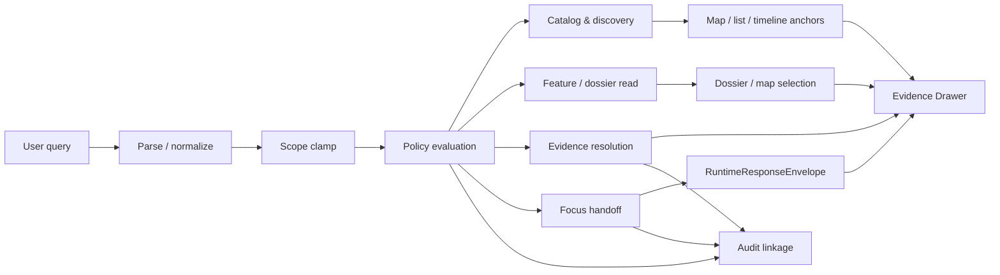

<!-- [KFM_META_BLOCK_V2]
doc_id: kfm://doc/TODO-UUID
title: Search Query Language
type: standard
version: v1
status: draft
owners: <NEEDS VERIFICATION: docs/search ownership / CODEOWNERS>
created: TODO-YYYY-MM-DD
updated: TODO-YYYY-MM-DD
policy_label: <NEEDS VERIFICATION: public|restricted|...>
related: [docs/search/README.md, contracts/README.md, schemas/README.md, policy/README.md, .github/workflows/README.md]
tags: [kfm, search, query-language, governed-api, evidence]
notes: [Current public main inspection confirms the docs/search cluster and first-wave schema-side contract scaffolds under schemas/contracts/v1/; parser/tokenizer, endpoint inventory, ranking stack, and merge-blocking workflow YAML remain NEEDS VERIFICATION.]
[/KFM_META_BLOCK_V2] -->

# Search Query Language

Governed search over promoted scope, designed to land users in geography, time, and evidence rather than detached result lists.

> **Status:** draft  
> **Owners:** `<NEEDS VERIFICATION: docs/search ownership / CODEOWNERS>`  
> **Path:** `docs/search/query-language.md`  
> **Repo fit:** sibling to [docs/search/README][search-readme]; upstream docs at [contracts/README][contracts-readme], [schemas/README][schemas-readme], [policy/README][policy-readme], and [.github/workflows/README][workflows-readme]; current public `main` also exposes first-wave machine-contract scaffolds under `schemas/contracts/v1/**`, while public route publication and runtime wiring remain **PROPOSED** or **NEEDS VERIFICATION**.


**Quick jump:** [Purpose](#purpose) · [Status & authority](#status--authority) · [Repo fit](#repo-fit) · [Search placement](#search-placement-in-the-shell) · [Operating model](#operating-model) · [Canonical request object](#canonical-request-object-proposed) · [Starter grammar](#starter-grammar-proposed) · [Filter registry](#filter-registry-proposed) · [Runtime outcomes](#runtime-outcomes--surface-states) · [Verification](#open-verification-items)

> [!IMPORTANT]
> This file defines a **doctrine-aligned search contract** for KFM. Current public `main` confirms that `docs/search/` is a real checked-in subtree and that first-wave schema-side contract scaffolds exist under `schemas/contracts/v1/`. It does **not** prove a mounted parser, tokenizer, endpoint family, ranking stack, or merge-blocking workflow inventory. Where implementation is not directly visible in the inspected public tree or attached doctrine, this document keeps the shape **PROPOSED**, **UNKNOWN**, or **NEEDS VERIFICATION**.

---

## Purpose

KFM search is not a general-purpose query engine, SQL passthrough, vector-only assistant surface, or detached site search.

Its job is to help users:

- discover released datasets and distributions
- locate authoritative subjects, features, dossiers, and stories
- move from results into the **Evidence Drawer**
- preserve geography, time, release state, freshness, and policy context
- support bounded Focus-mode investigation without bypassing the trust membrane

In KFM terms, search is a **derived projection** and a **rebuildable accelerator**. It may speed up evidence resolution, ranking, and retrieval, but it must never become the only place where meaning survives.

## Status & authority

| Statement class | Status | Reading rule |
| --- | --- | --- |
| Search, graph, vector, tile, scene, cache, and summary layers are derived/rebuildable by default | **CONFIRMED** | Treat as load-bearing doctrine |
| Search belongs inside the map-first, time-aware shell and should keep evidence one hop away | **CONFIRMED** | Interface and contract consequence |
| Public/external search must operate through governed APIs over outward released scope | **CONFIRMED** | Non-negotiable |
| Search surfaces must avoid policy leakage through overly specific denials, restricted-object hints, or revealing search counts | **CONFIRMED** | Public-safe behavior rule |
| Current public `main` exposes a checked-in `docs/search/` cluster including this file, sibling search docs, and `docs/search/drift/` | **CONFIRMED** | Local repo links may be written as real repo-relative paths |
| Current public `main` exposes first-wave schema-side contract scaffolds under `schemas/contracts/v1/*` and starter vocab files under `schemas/contracts/vocab/*` | **CONFIRMED** | Search-adjacent machine-contract references should prefer visible schema-side paths over older purely PROPOSED root-contract paths |
| Current public `main` does **not** expose checked-in workflow YAML under `.github/workflows/` | **CONFIRMED** | Do not imply merge-blocking search automation from the public tree alone |
| The canonical request object, textual grammar, filter registry, and route family implications below | **PROPOSED** | Starter design, not mounted implementation fact |
| Mounted parser/tokenizer, exact endpoints, ranking stack, and merge-blocking CI coverage | **UNKNOWN / NEEDS VERIFICATION** | Do not present as implemented |

### Reading key

| Label | Meaning in this file |
| --- | --- |
| **CONFIRMED** | Directly supported by attached KFM doctrine or current public-main repo evidence inspected for this revision |
| **INFERRED** | Strong architectural consequence implied by repeated KFM doctrine, but not directly surfaced as mounted implementation |
| **PROPOSED** | Recommended contract or design shape that fits KFM doctrine but is not verified as shipping |
| **UNKNOWN** | Not supported strongly enough to present as current repo/runtime fact |
| **NEEDS VERIFICATION** | A specific implementation or path claim that should be checked against the live repo/runtime before being treated as settled |

## Repo fit

**Target path:** `docs/search/query-language.md`

| Fit | Item | Status | Role |
| --- | --- | --- | --- |
| Parent | [docs/search/README][search-readme] | **CONFIRMED** | Search-system entrypoint and directory boundary |
| Sibling | [semantic-search.md][semantic-search] | **CONFIRMED** | Semantic/vector-oriented search companion on current public `main` |
| Sibling | [index-architecture.md][index-architecture] | **CONFIRMED** | Index-family and index-design companion on current public `main` |
| Sibling | [faircare-search-rules.md][faircare-search-rules] | **CONFIRMED** | Search governance companion on current public `main` |
| Upstream | [contracts/README][contracts-readme] | **CONFIRMED** | Contract-surface orientation |
| Upstream | [schemas/README][schemas-readme] | **CONFIRMED** | Schema-surface orientation |
| Upstream | [policy/README][policy-readme] | **CONFIRMED** | Deny-by-default and decision-grammar orientation |
| Upstream | [\.github/workflows/README][workflows-readme] | **CONFIRMED** | Workflow surface exists, but active merge-blocking YAML coverage remains unverified |
| Downstream | `schemas/contracts/v1/runtime/runtime_response_envelope.schema.json` | **CONFIRMED (scaffold-state)** | Finite runtime outcomes for Focus/search-adjacent synthesis |
| Downstream | `schemas/contracts/v1/evidence/evidence_bundle.schema.json` | **CONFIRMED (scaffold-state)** | Evidence Drawer drill-through contract surface |
| Downstream | `schemas/contracts/v1/policy/decision_envelope.schema.json` | **CONFIRMED (scaffold-state)** | Machine-readable policy result surface |
| Downstream | `schemas/contracts/v1/release/release_manifest.schema.json` | **CONFIRMED (scaffold-state)** | Release linkage on outward search surfaces |
| Downstream | `schemas/contracts/v1/correction/correction_notice.schema.json` | **CONFIRMED (scaffold-state)** | Correction / supersession visibility surface |
| Downstream | `schemas/contracts/v1/source/source_descriptor.schema.json` | **CONFIRMED (scaffold-state)** | Source-edge identity surface relevant to search-adjacent provenance |
| Downstream | `schemas/contracts/v1/data/dataset_version.schema.json` | **CONFIRMED (scaffold-state)** | Dataset version identity surface relevant to released search results |
| Downstream | `schemas/contracts/vocab/{reason_codes,obligation_codes,reviewer_roles}.json` | **CONFIRMED (starter registry files)** | Finite starter registries are branch-visible, though semantic completeness remains unverified |
| Downstream | [docs/search/drift/README][drift-readme] | **CONFIRMED** | Drift-governance sublane for search-derived behavior |
| Lateral proof surface | `schemas/tests/fixtures/contracts/v1/{valid,invalid}/` | **CONFIRMED (placeholder leaves)** | Fixture lane exists, but not yet a proven governed inventory |
| Lateral proof surface | `tests/contracts/README.md` | **CONFIRMED** | Root contract-facing verification family is visible, but runnable search-specific cases are not proven from public `main` alone |
| Downstream | `apis/public/openapi.yaml` | **PROPOSED** | Public search/read/evidence route publication |
| Downstream | Search parser / tokenizer / ranking stack | **UNKNOWN / NEEDS VERIFICATION** | Runtime implementation remains unverified |

### Current public repo signals

| Current public `main` signal | Status | Why it changes this file |
| --- | --- | --- |
| `docs/search/` is a real subtree with `README.md`, `faircare-search-rules.md`, `index-architecture.md`, `query-language.md`, `semantic-search.md`, and `drift/` | **CONFIRMED** | Local relative links should be treated as live repo paths, not just preserved-baseline references |
| `docs/search/drift/` visibly contains `README.md`, `embeddings/`, `examples/`, `graph-queries/`, `hyde/`, and `stac/` | **CONFIRMED** | Search drift is a current checked-in sublane, not a hypothetical downstream target |
| `schemas/contracts/v1/*/*.schema.json` exists across common, correction, data, evidence, policy, release, runtime, and source families | **CONFIRMED** | Machine-contract examples in this doc should point to visible scaffold paths |
| `schemas/contracts/vocab/*.json` exists for reasons, obligations, and reviewer roles | **CONFIRMED** | Registry references can be written against visible starter files |
| `schemas/tests/fixtures/contracts/v1/{valid,invalid}` exists but remains placeholder-only in current public docs | **CONFIRMED** | This file should not imply mature fixture inventory or search-specific cases |
| `.github/workflows/README.md` is present, but no `.yml` / `.yaml` files were visible in the inspected public `workflows/` directory | **CONFIRMED** | Keep merge-blocking workflow claims conservative |

### Accepted inputs

This document is for:

- user-entered search text
- structured filters
- geography and time scope
- result-kind selectors
- sort and paging controls
- direct references to released subjects, datasets, or evidence objects

### Exclusions

This document does **not** define:

- raw SQL syntax
- GraphQL syntax
- Lucene/Elasticsearch/OpenSearch internals
- direct canonical-store access
- unpublished or non-promoted scope access
- vector-store internals
- final endpoint names
- parser implementation details
- a claim that the current repository already ships this exact parser

## Search placement in the shell

KFM doctrine treats search as part of the persistent shell, not as a detached subsystem.

| Shell region / surface | Search responsibility | Status | Why it matters |
| --- | --- | --- | --- |
| Top command bar | Global search entry, mode switching, scope badges, saved views, role context | **CONFIRMED** | Search starts in stable shell context |
| Map Explorer | Layer/domain search, contextual discovery, landing in geography | **CONFIRMED** | Search should reinforce map-first operation |
| Timeline | Time scoping and as-of anchoring | **CONFIRMED** | Search should not strip chronology |
| Evidence Drawer | Drill-through target for consequential results | **CONFIRMED** | Every consequential result stays one step from evidence |
| Focus Mode | Bounded question entry after retrieval/evidence resolution | **CONFIRMED** | Search-adjacent synthesis still returns finite governed outcomes |
| Detached result silo | Primary search destination | **REJECTED** | Breaks geography/time/evidence continuity |

> [!NOTE]
> The strongest shell doctrine in the current corpus is **map-first**, **time-aware**, and **trust-visible**. This document therefore treats detached “search results only” experiences as a fallback at best, not the primary operating model.

## Governing rules

### 1. Search stays subordinate to evidence

Search may accelerate discovery, ranking, and retrieval. It may not replace:

- authoritative reads
- `EvidenceRef -> EvidenceBundle` resolution
- policy decisions
- release state
- correction lineage

### 2. Search stays inside the trust membrane

Public or external surfaces may read only through governed APIs and only within outward released scope.

### 3. Search stays map-first and time-aware

The preferred landing is **Map Explorer**, **Timeline**, **Dossier**, **Story**, **Compare**, or **Evidence Drawer** context—not a detached result silo.

### 4. Search must fail safely

Where policy, rights, sensitivity, freshness, or evidence-route requirements are not met, search-adjacent surfaces must degrade visibly rather than bluff.

### 5. Search must not leak restricted existence

Public-safe search behavior must avoid revealing restricted assets through:

- overly specific denials
- exact restricted-result counts
- malformed null behavior
- inconsistent error detail
- “no access” messages that confirm sensitive existence

---

## Operating model



### Reading the diagram

- **Catalog & discovery** handles released datasets, distributions, discovery lists, and outward metadata closures.
- **Feature / dossier read** handles authoritative subjects, place dossiers, and released detail views.
- **Evidence resolution** handles `EvidenceRef -> EvidenceBundle`.
- **Focus handoff** handles bounded synthesis and must emit finite outcomes.
- **Audit linkage** is not optional for consequential outward behavior.

## Query model

KFM should support **two compatible forms**:

1. a **human text form** for shell input
2. a **canonical request object** for APIs, tests, fixtures, and deterministic behavior

When they disagree, the **canonical request object** wins.

## Canonical request object (PROPOSED)

```json
{
  "q": "republican river flood stage",
  "kinds": ["dataset", "feature", "story"],
  "scope": {
    "place_ref": "TODO-PLACE-REF",
    "bbox": [-101.0, 39.0, -95.0, 40.5]
  },
  "time": {
    "as_of": "2026-03-01",
    "from": "2025-01-01",
    "to": "2026-03-01"
  },
  "filters": {
    "release": "public_safe_released",
    "freshness": "current_or_visible_stale",
    "modeled": "include_labeled",
    "generalized": "allow"
  },
  "sort": "relevance",
  "limit": 25,
  "cursor": null
}
```

### Why this shape

This keeps search:

- typed
- testable
- fixture-friendly
- policy-aware
- easy to echo in audit trails
- compatible with outward OpenAPI publication later

### Design notes

- `q` is the human search intent, not a parser-specific syntax bucket.
- `scope` preserves place/time rather than treating location as a late filter.
- `filters.release` is shown as a **semantic placeholder**, not a verified enum.
- Role/audience is expected to come from auth/session context, not arbitrary public query text.

## Starter grammar (PROPOSED)

The starter shell grammar below is intentionally small.

```text
query          := term* modifier*
modifier       := filter | negated_filter | range | flag
filter         := field ":" value
negated_filter := "-" field ":" value
range          := field ":[" value " TO " value "]"
flag           := "stale_ok" | "generalized_ok" | "modeled_ok"
```

### Text conventions

| Form | Meaning | Status |
| --- | --- | --- |
| `word` | free-text term | **PROPOSED** |
| `"quoted phrase"` | exact phrase | **PROPOSED** |
| `field:value` | positive filter | **PROPOSED** |
| `-field:value` | negative filter | **PROPOSED** |
| `field:[a TO b]` | range filter | **PROPOSED** |
| `stale_ok` | permit stale-visible results | **PROPOSED** |
| `generalized_ok` | permit generalized public-safe results | **PROPOSED** |
| `modeled_ok` | include modeled outputs if visibly labeled | **PROPOSED** |

> [!NOTE]
> This is a **starter textual grammar**, not a claim that the current repo already implements this exact parser.

## Filter registry (PROPOSED)

| Field | Purpose | Example | Notes |
| --- | --- | --- | --- |
| `kind` | Restrict result families | `kind:dataset` | See [Result kinds](#result-kinds) |
| `id` | Direct stable subject lookup | `id:county.ks.02007` | Prefer authoritative IDs where available |
| `place` | Named geography | `place:"Republican River Basin"` | Human-friendly alias; resolver shape unknown |
| `bbox` | Bounding box filter | `bbox:-101,39,-95,40.5` | Text convenience form |
| `time.as_of` | Single as-of moment | `time.as_of:2026-03-01` | Strong fit with timeline model |
| `time.from` | Range start | `time.from:2025-01-01` | Use with `time.to` |
| `time.to` | Range end | `time.to:2026-03-01` | Use with `time.from` |
| `release` | Release-scope filter | `release:public_safe_released` | Exact enum needs verification |
| `freshness` | Freshness posture | `freshness:current_or_visible_stale` | Must not hide stale state |
| `modeled` | Modeled-output handling | `modeled:include_labeled` | Never unlabeled |
| `generalized` | Precision-limited output handling | `generalized:allow` | Useful for public-safe search |
| `rights` | Redistribution/public-safe restriction | `rights:public_safe` | Exact enum needs verification |
| `review_state` | Steward-only moderation state | `review_state:quarantined` | Not a public filter by default |
| `sort` | Sort mode | `sort:relevance` | Exact enum **PROPOSED** |
| `limit` | Page size | `limit:25` | Max bound needs verification |
| `cursor` | Pagination token | `cursor:abc123` | Canonical API form preferred |

### Reserved field naming guidance

Use dot-separated names where the field is semantically nested:

- `time.as_of`
- `time.from`
- `time.to`

Avoid parser-only aliases becoming the canonical contract surface unless tests and schemas stabilize them.

## Result kinds

| Kind | Primary route family | Governing surface | Notes |
| --- | --- | --- | --- |
| `dataset` | Catalog and discovery | Explorer / catalog views | Standards-aligned metadata discovery |
| `distribution` | Catalog and discovery | Explorer / export prep | Must retain release linkage |
| `feature` | Feature or dossier read | Map / dossier | Stable ID and support semantics required |
| `subject` | Feature or dossier read | Dossier / map | Acceptable alias if the repo uses `subject` family |
| `story` | Story / dossier / compare | Story surface | Must stay evidence-linked |
| `dossier` | Feature or dossier read | Dossier | Durable object, not transient modal |
| `evidence` | Evidence resolution | Evidence Drawer | Not detached from release/policy state |
| `compare` | Compare | Compare surface | Must preserve time and comparison basis |
| `focus` | Focus / governed assistance | Focus pane | Returns finite outcomes, not open-ended chat |

> [!TIP]
> UI-level “layer search” may resolve to these underlying kinds rather than introducing `layer` as an authoritative truth kind of its own.

## Result cards & landing behavior

### Discovery results should carry

At minimum, result surfaces should preserve:

- title or label
- result kind
- stable reference
- release context
- freshness or stale-visible cue
- route to evidence
- policy or precision cue where relevant

### Search should land in geography

The preferred landing sequence is:

1. resolve result
2. anchor map selection and time context
3. open dossier, story, or compare context if relevant
4. keep Evidence Drawer one hop away

Detached “search results only” screens should be avoided unless they still preserve geography, time, release, and evidence route.

### Illustrative result card payload (PROPOSED)

```json
{
  "kind": "feature",
  "label": "Illustrative Feature",
  "subject_ref": "TODO-SUBJECT-REF",
  "surface_state": "promoted",
  "release_ref": "TODO-RELEASE-REF",
  "evidence_ref": "TODO-EVIDENCE-REF",
  "rights_state": "public_safe"
}
```

## Runtime outcomes & surface states

### Finite outcomes

Where search flows into Focus or another synthesis surface, the outward response must be finite:

- `ANSWER`
- `ABSTAIN`
- `DENY`
- `ERROR`

Anything else is drift.

### Surface states

Search-adjacent surfaces should be able to expose states such as:

| Surface state | Meaning |
| --- | --- |
| `promoted` | Released and public-safe for the current audience |
| `generalized` | Precision has been reduced for safety/care reasons |
| `partial` | Coverage or evidence is incomplete |
| `stale-visible` | Still viewable, but visibly beyond freshness tolerance |
| `source-dependent` | Meaning still depends strongly on source caveats |
| `conflicted` | Admissible sources disagree materially |
| `withdrawn` | Previously visible, now withdrawn with lineage preserved |
| `denied` | Policy blocks this request or surface |
| `abstained` | Scope/evidence insufficient for safe outward synthesis |

> [!WARNING]
> Search must not silently collapse these states into “best match” confidence language.

## Policy & evidence rules

### Required behavior

1. Search operates over outward released/public-safe scope, not RAW, WORK, QUARANTINE, or unpublished candidate scope.
2. Search does **not** bypass the governed API.
3. Evidence remains **one hop away** for consequential results.
4. Public-safe search respects rights, sensitivity, precision, and freshness obligations.
5. Search preserves release and correction linkage.
6. Synthesis over search results retrieves, cites, verifies, and abstains when support is weak.
7. Search and read behavior must avoid policy leakage through exact restricted counts or overly specific denials.

### Reason and obligation hooks

Search and search-adjacent surfaces should be able to carry reason and obligation signals such as:

- `runtime.evidence_missing`
- `runtime.citation_failed`
- `policy.denied`
- `release.docs_gate_failed`
- `projection.stale`

and obligations such as:

- `generalize`
- `withhold`
- `review_required`
- `correction_notice`
- `rebuild_projection`
- `cite`
- `disclose_partial`
- `disclose_modeled`
- `log_audit`

### Evidence drill-through expectations

Where a result opens the Evidence Drawer, the payload should later be able to expose at least:

| Concept | Why it matters |
| --- | --- |
| `EvidenceRef` | Stable outward pointer from result to inspectable support |
| bundle digest / version | Lets the user and audit trail know what evidence package was actually resolved |
| dataset version / `spec_hash` | Connects results to release state, not a floating search index |
| rights / policy summary | Makes public-safe limits visible at the point of use |
| lineage summary | Preserves transform context instead of pretending the result is raw truth |
| redaction / restriction notices | Keeps public-safe handling explicit |

## Examples

> [!NOTE]
> The examples below are **illustrative starter examples** only. They show the intended shape of the language, not a verified mounted parser.

### Example 1 — dataset discovery

```text
kind:dataset place:"Republican River Basin" "floodplain"
```

Intended effect: discover outward released datasets or distributions relevant to a named geography and topic.

### Example 2 — feature search with time anchor

```text
kind:feature "groundwater nitrate" time.as_of:2026-03-01
```

Intended effect: return authoritative feature or dossier reads anchored to a specific as-of date.

### Example 3 — public-safe story search

```text
kind:story "trail corridor" generalized_ok
```

Intended effect: allow public-safe, generalized narrative surfaces where exact-location handling may matter.

### Example 4 — direct evidence lookup

```text
kind:evidence id:evidence.ks.hydrology.2026-001
```

Intended effect: resolve a released evidence object into Evidence Drawer context.

### Example 5 — Focus handoff

```json
{
  "q": "What changed in this basin after the last released package?",
  "kinds": ["focus"],
  "scope": {
    "place_ref": "TODO-PLACE-REF"
  },
  "time": {
    "from": "2025-01-01",
    "to": "2026-03-01"
  }
}
```

Intended effect: pass a tightly scoped investigation into a governed assistance surface that must emit a `RuntimeResponseEnvelope`.

## Implementation notes

| Artifact / surface | Status | Why it matters |
| --- | --- | --- |
| `schemas/contracts/v1/runtime/runtime_response_envelope.schema.json` | **CONFIRMED (scaffold-state)** | Branch-visible machine contract for finite search-adjacent synthesis outcomes |
| `schemas/contracts/v1/evidence/evidence_bundle.schema.json` | **CONFIRMED (scaffold-state)** | Evidence Drawer drill-through contract surface is visible on public `main` |
| `schemas/contracts/v1/policy/decision_envelope.schema.json` | **CONFIRMED (scaffold-state)** | Machine-readable policy result surface is visible on public `main` |
| `schemas/contracts/v1/release/release_manifest.schema.json` | **CONFIRMED (scaffold-state)** | Release linkage contract surface exists in the inspected tree |
| `schemas/contracts/v1/correction/correction_notice.schema.json` | **CONFIRMED (scaffold-state)** | Correction / supersession contract surface exists in the inspected tree |
| `schemas/contracts/v1/source/source_descriptor.schema.json` | **CONFIRMED (scaffold-state)** | Source-edge identity is already represented in the first wave |
| `schemas/contracts/v1/data/dataset_version.schema.json` | **CONFIRMED (scaffold-state)** | Release-bearing dataset version identity is already represented in the first wave |
| `schemas/contracts/vocab/{reason_codes,obligation_codes,reviewer_roles}.json` | **CONFIRMED (starter registry files)** | Finite registry leaves exist, though semantic population remains unverified |
| `schemas/tests/fixtures/contracts/v1/{valid,invalid}/` | **CONFIRMED (placeholder leaves)** | Fixture lane is visible, but not yet a proven governed inventory |
| `tests/contracts/README.md` | **CONFIRMED** | Root contract-validation family is visible, but runnable search-specific cases are not proven from public `main` alone |
| `docs/search/drift/README.md` | **CONFIRMED** | Search-drift governance surface is visible as a real checked-in sublane |
| Parser / tokenizer / ranking stack | **UNKNOWN / NEEDS VERIFICATION** | Public docs do not prove executable search runtime internals |
| `.github/workflows/README.md` without visible workflow YAML | **CONFIRMED** | Workflow intent is documented, but merge-blocking search CI cannot be claimed from public `main` alone |
| `apis/public/openapi.yaml` | **PROPOSED** | Publishable route-family contract is still not directly evidenced in the inspected public tree |

## Anti-patterns to reject

- passing raw SQL, GraphQL, or datastore-specific syntax through the public shell
- returning unpublished or non-released scope because “it matched”
- treating search indexes or vector stores as authoritative truth
- returning result cards with no release reference
- returning claims with no route to evidence
- allowing Focus to emit uncited prose as a fifth hidden outcome
- letting public search results expose exact sensitive locations without policy handling
- exposing restricted-object existence through precise counts or overly specific denials
- splitting search into a separate epistemic system that ignores map, time, correction, or release context

## Open verification items

- [ ] Reconcile this file with [docs/search/README][search-readme] and the current public `docs/search/drift/` listing so preserved-baseline paths and live-tree paths do not drift.
- [ ] Verify whether the repository already contains an implemented parser or tokenizer.
- [ ] Verify actual public and internal endpoint names.
- [ ] Verify which fields are public-safe versus steward-only.
- [ ] Verify whether discovery is implemented through STAC, OGC APIs, KFM-specific OpenAPI, or a combination.
- [ ] Verify whether `EvidenceRef -> EvidenceBundle` resolution already has a mounted contract and outward resolver route.
- [ ] Verify whether `schemas/contracts/v1/**` and `schemas/contracts/vocab/**` are already consumed by runtime/tests or remain scaffold-state only.
- [ ] Verify whether merge-blocking search-related workflow YAML or required checks exist outside the current public `.github/workflows/README` surface.
- [ ] Verify max page size, cursor semantics, and result ranking strategy.
- [ ] Verify whether additional DRIFT companions such as provenance / synthesis / workflows exist on the active branch even though they were not visible in the inspected public `docs/search/drift/` listing.

## Definition of done

This document is ready to move from draft toward review when:

- the canonical request object is backed by a schema or OpenAPI component in the authoritative machine-contract lane
- the starter textual grammar is covered by parser tests or explicitly narrowed
- search results can link to Evidence Drawer payloads
- public-safe result cards show release and surface state
- Focus handoff is backed by `RuntimeResponseEnvelope`
- valid and invalid fixtures exist for the first search-adjacent contracts
- this file is linked from the repo’s search, contract, schema, policy, and workflow doc surfaces without contradicting current public-tree reality

<details>
<summary>Appendix — starter implementation checklist</summary>

### Smallest safe next move

1. Define the machine-readable contracts first.
2. Add one minimal valid fixture and one meaningful invalid fixture for each contract.
3. Publish the outward route-family contract in OpenAPI.
4. Wire one geography-first shell flow:
   - search input
   - map anchor
   - dossier open
   - evidence drawer drill-through
5. Add one Focus example proving `ANSWER`, `ABSTAIN`, `DENY`, and `ERROR`.

### Suggested review questions

- Does every consequential result have a route to evidence?
- Can a user tell whether a result is promoted, stale, generalized, partial, denied, or abstained?
- Does search preserve geography and time context?
- Can a public query accidentally escape outward released scope?
- Does the search language encourage brittle parser cleverness over typed contracts?
- Can public-safe denials avoid confirming the existence of restricted assets?

[Back to top](#search-query-language)

</details>

[search-readme]: ./README.md
[semantic-search]: ./semantic-search.md
[index-architecture]: ./index-architecture.md
[faircare-search-rules]: ./faircare-search-rules.md
[drift-readme]: ./drift/README.md
[contracts-readme]: ../../contracts/README.md
[schemas-readme]: ../../schemas/README.md
[policy-readme]: ../../policy/README.md
[workflows-readme]: ../../.github/workflows/README.md
